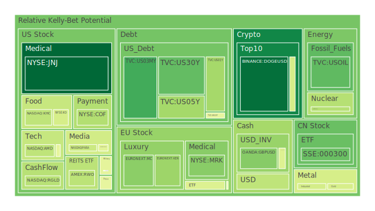
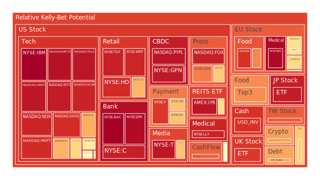
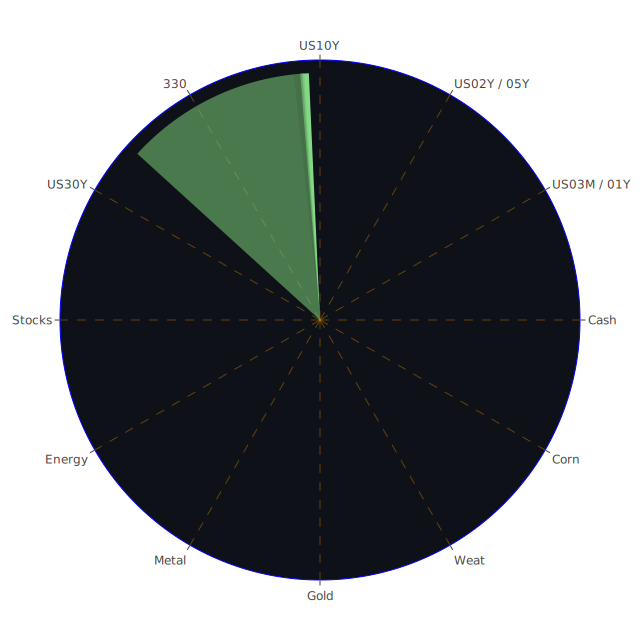

# 投資商品泡沫分析

## 美國國債

近期，美國國債收益率呈現波動。根據資料，2024年12月17日，10年期國債收益率為4.40%，較上一週的4.16%上升。短期國債如1年期和2年期收益率亦有變化。這種收益率的上升可能反映了市場對未來經濟增長和通脹的預期。

歷史上，美國國債收益率的上升往往與通脹預期上升或經濟增長加速相關。然而，高收益率也可能導致借貸成本上升，對經濟增長產生抑制作用。

## 美國零售股

美國零售股近期表現不一。Costco（NASDAQ:COST）股價上升，原因可能是消費者對大宗購物的需求增加。然而，沃爾瑪（NYSE:WMT）調整了其多元化政策，引發了投資者對其未來增長的擔憂。

歷史上，零售業的表現與消費者信心密切相關。經濟不確定性可能導致消費者減少開支，影響零售股的表現。

## 美國科技股

科技巨頭如蘋果（NASDAQ:AAPL）、微軟（NASDAQ:MSFT）和亞馬遜（NASDAQ:AMZN）股價持續走高。這可能受益於市場對人工智慧和創新技術的熱情。然而，需要注意的是，部分科技股的市盈率已達到歷史高位，存在泡沫風險。

歷史上，科技股泡沫曾在2000年破裂，導致市場震盪。因此，投資者應謹慎評估科技股的估值水平。

## 美國房地產指數

房地產市場呈現降溫跡象。固定抵押貸款30年期利率上升至6.60%，加上辦公室物業市場的問題，可能對房地產投資構成壓力。

回顧2008年的次貸危機，高房貸利率和房價下跌導致了市場崩盤。目前的情況需引起警惕。

## 加密貨幣

比特幣價格突破歷史新高，達到106,061美元。MicroStrategy的股票因大量持有比特幣而被納入納斯達克100指數。然而，加密貨幣市場波動性高，存在巨大風險。

2017年和2021年的比特幣熱潮均以劇烈調整告終，投資者應注意市場過熱的風險。

## 金/銀/銅

黃金價格持穩在2,650美元附近，金銀比和金銅比處於相對高位，表明市場對避險資產的需求上升。這可能反映了投資者對全球經濟不確定性的擔憂。

歷史上，地緣政治風險和經濟衰退預期常導致貴金屬價格上漲。

## 黃豆 / 小麥 / 玉米

農產品價格走勢分化。黃豆（AMEX:SOYB）和玉米（AMEX:CORN）價格相對穩定，但小麥（AMEX:WEAT）價格有所下滑。全球氣候變化和供應鏈問題可能影響農產品市場。

2010年的全球糧食價格上漲曾引發多國通脹，需要關注農產品價格對通脹的影響。

## 石油/ 鈾期貨UX!

石油價格在70美元附近波動，受全球需求前景影響。鈾期貨價格上升，反映了市場對清潔能源的關注。

能源市場易受地緣政治因素影響，例如中東局勢的緊張可能推高油價。

## 各國外匯市場

美元指數走強，美元對日元（USDJPY）升至154.04，對英鎊（GBPUSD）維持在1.27水平。這反映了市場對美國經濟前景的信心。

匯率波動可能影響進出口企業的業績，投資者需關注外匯風險。

## 各國大盤指數

美股納斯達克指數創下新高，主要受科技股帶動。歐洲股市相對疲弱，德國DAX指數（GDAXI）波動較大。

全球股市表現分化，投資者需平衡配置，降低單一市場風險。

## 美國半導體股

英特爾（NASDAQ:INTC）和美光科技（NASDAQ:MU）等半導體股表現穩定。隨著人工智慧和自動駕駛等領域的發展，半導體需求有望增長。

歷史上，科技周期的波動性較大，投資者需關注產業供需變化。

## 美國銀行股

摩根大通（NYSE:JPM）和美國銀行（NYSE:BAC）等銀行股表現良好。但需注意商業地產貸款風險可能對銀行業績造成影響。

2008年的金融危機提醒我們，銀行資產質量對其穩健性至關重要。

## 美國軍工股

洛克希德·馬丁（NYSE:LMT）和諾斯洛普·格魯曼（NYSE:NOC）等軍工股保持穩定。地緣政治緊張局勢可能刺激國防開支，利好軍工行業。

然而，政府預算限制和政策變動可能影響軍工企業的收入。

## 美國電子支付股

Visa（NYSE:V）和萬事達卡（NYSE:MA）股價持續上升。數字支付的普及和電子商務的發展推動了行業增長。

市場競爭加劇和監管風險需引起關注。

## 美國藥商股

輝瑞（NYSE:PFE）和默克（NYSE:MRK）等制藥公司表現穩健。新藥研發進展和專利到期等因素將影響其未來增長。

醫藥行業受政策和監管影響較大，投資者需密切關注。

## 美國影視股

迪士尼（NYSE:DIS）股價有所波動，受到內容製作成本和市場競爭的影響。流媒體服務的競爭日益激烈。

內容質量和用戶增長是影視公司成功的關鍵。

## 美國媒體股

康卡斯特（NASDAQ:CMCSA）等媒體公司的股價受廣告收入和用戶訂閱數影響。需關注數字化轉型和市場份額變化。

傳統媒體面臨新興媒體的挑戰，需適應市場變化。

## 石油防禦股

埃克森美孚（NYSE:XOM）等石油公司在能源轉型中面臨挑戰。新能源的興起可能對傳統石油企業造成壓力。

投資者需關注企業的戰略轉型和可持續發展。

## 金礦防禦股

Barrick Gold（NYSE:GOLD）等金礦企業可能受益於金價上漲。避險需求上升可能推動金礦股表現。

需考慮開採成本和地緣風險對企業盈利的影響。

## 歐洲奢侈品股

LVMH（EURONEXT:MC）等奢侈品公司股價受到中國等市場的需求影響。近期中國經濟增長放緩可能影響銷售。

奢侈品行業對全球經濟狀況和消費者信心敏感。

## 歐洲汽車股

戴姆勒（XETR:DAI）和寶馬（XETR:BMW）等汽車製造商面臨全球供應鏈挑戰和新能源轉型壓力。

政策支持和技術創新是汽車行業的關鍵。

## 歐美食品股

雀巢（SIX:NESN）等食品公司的穩定性較高，受益於必需消費品的剛性需求。

需關注原材料價格和匯率波動對其盈利的影響。

# 宏觀經濟傳導路徑分析

全球經濟呈現複雜格局。美國經濟數據顯示通脹和利率上升，FED持續收緊貨幣政策可能影響全球資金流動。歐洲經濟增長放緩，中國經濟復蘇乏力。

這些宏觀經濟因素將通過貿易、投資和金融市場傳導，影響各資產類別的表現。

# 微觀經濟傳導路徑分析

企業盈利能力受到供應鏈、中間成本和市場需求等因素影響。科技企業的研發投入和市場競爭，加密貨幣的市場接受度，都是影響微觀經濟的關鍵。

投資者需深入分析企業的基本面，評估其未來增長潛力。

# 資產類別間傳導路徑分析

資產之間存在聯動效應。例如，股市和債市的反向關係，商品價格對匯率的影響，避險資產與風險資產的資金流動。

投資組合需要考慮這些關聯性，進行風險對沖和資產配置優化。

# 投資建議

## 穩健型配置（40%）

- **美國國債**：20%

- **黃金**：10%

- **必需消費品股票（如雀巢）**：10%

## 成長型配置（35%）

- **科技股（如蘋果、微軟）**：15%

- **半導體股票**：10%

- **新能源相關股票**：10%

## 高風險型配置（25%）

- **加密貨幣**：10%

- **新興市場股票**：10%

- **原材料股票（如銅）**：5%

# 風險提示

投資有風險，市場總是充滿不確定性。我們的建議僅供參考，投資者應根據自身的風險承受能力和投資目標，做出獨立的投資決策。
 
Daily Buy Map:

 
Daily Sell Map:

 
Daily Radar Chart:

 
