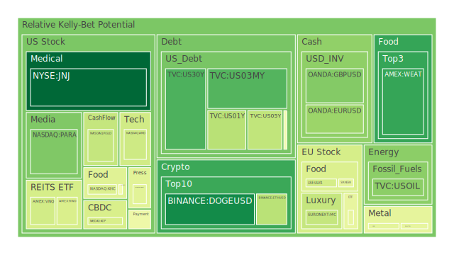
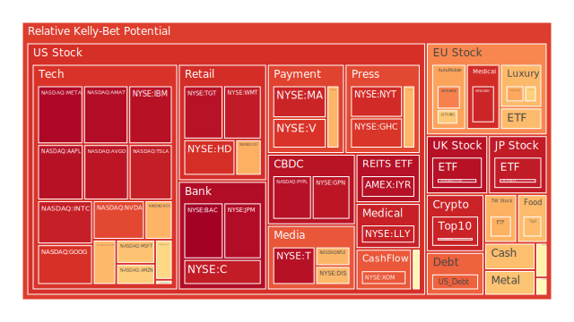
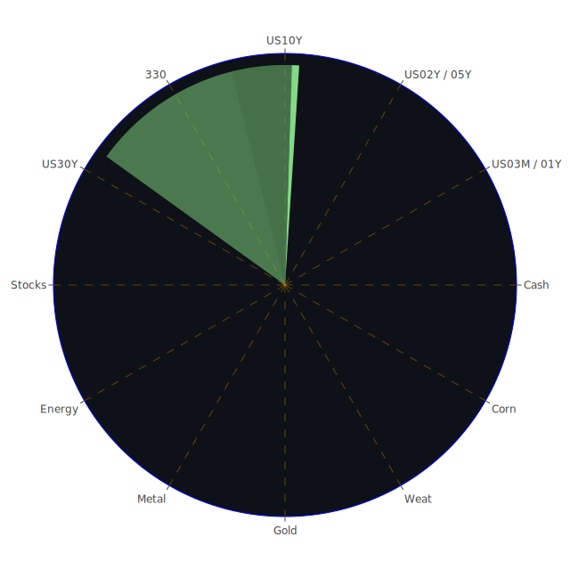

# 投資商品泡沫分析

## 美國國債

近期，美國國債收益率出現波動。特別是短期國債，如2年期和3個月期國債收益率，根據最新數據，2年期國債收益率為4.25%，較上週有所下降。這反映市場對美國經濟前景的不確定性增加。經濟學上，收益率曲線的倒掛可能預示著經濟衰退的風險。

從心理學角度，投資者對於未來經濟的不安感加劇，避險情緒升溫，導致對國債的需求增加。然而，博弈論告訴我們，市場參與者的行為可能導致收益率進一步下降，加劇市場的不穩定。

## 美國零售股

美國零售股近期受到經濟數據的影響。消費者信心指數下降，反映出消費者對經濟的悲觀預期。沃爾瑪（WMT）的股價略有下滑，近期報價為94.87美元，泡沫指數D1達到0.929479，風險較高。

歷史上，經濟衰退時期零售股表現不佳。因此，投資者需警惕零售業可能面臨的挑戰。社會學上，消費者習慣的改變，如線上購物的興起，對傳統零售商構成壓力。

## 美國科技股

科技股近期表現分化。蘋果（AAPL）股價達到248.13美元，泡沫指數D1為0.969738，風險較高。另一方面，英特爾（INTC）股價僅為20.34美元，泡沫指數D1為0.431583，風險相對較低。

經濟學上，高估值的科技股可能存在泡沫風險。心理學上，投資者對於人工智慧和科技創新的期待可能導致估值過高。博弈論提醒我們，當投資者過於樂觀時，市場可能調整。

## 美國房地產指數

房地產市場受利率影響顯著。隨著30年固定抵押貸款利率上升至6.60%，購房成本增加。VNQ近期報價為93.85美元，泡沫指數D1為0.701173，風險較高。

歷史上，高利率環境通常對房地產市場不利。社會學上，人口遷移和城市化進程也影響房地產需求。

## 加密貨幣

比特幣價格持續攀升，近期報價為104,495美元，泡沫指數D1為0.870289，風險極高。以太幣報價為3,948.98美元，泡沫指數D1為0.438015，風險較低。

心理學上，FOMO（害怕錯過）的情緒推動投資者進入市場。歷史上，加密貨幣市場波動性高，需謹慎投資。

## 金/銀/銅

黃金價格保持穩定，報價為2,650.19美元，泡沫指數D1為0.444536。白銀報價為30.58美元，泡沫指數D1為0.675182。銅報價為4.19美元，泡沫指數D1為0.447503。

經濟學上，貴金屬是避險資產，市場不確定性推動其需求。博弈論上，當股票市場風險增加時，資金可能流入貴金屬。

## 黃豆 / 小麥 / 玉米

黃豆（SOYB）報價為21.08美元，泡沫指數D1為0.502229。小麥（WEAT）報價為4.82美元，泡沫指數D1為0.788912，風險較高。玉米（CORN）報價為18.26美元，泡沫指數D1為0.747397。

社會學上，全球氣候變化對農產品供應造成影響。經濟學上，供需關係以及貿易政策都影響農產品價格。

## 石油/ 鈾期貨UX!

石油（USOIL）報價為70.18美元，泡沫指數D1為0.256019，風險較低。鈾期貨（UX1!）報價為76.40美元，泡沫指數D1為0.548446。

地緣政治因素對能源價格有直接影響。最近的新聞顯示，中國經濟數據不佳，可能降低對石油的需求。

## 各國外匯市場

美元指數近期走強，美元兌日圓匯率為153.37，泡沫指數D1為0.620453。英鎊兌美元匯率為1.26，泡沫指數D1為0.329742。

經濟學上，各國央行的貨幣政策影響匯率走勢。心理學上，市場情緒和避險需求也導致匯率波動。

## 各國大盤指數

美國納斯達克指數（NDX）報價為21,780.25點，泡沫指數D1為0.694465。德國DAX指數報價為20,412.90點，泡沫指數D1為0.617086。

歷史上，全球經濟放緩會導致股市調整。社會學上，投資者對於經濟前景的預期影響市場表現。

## 美國半導體股

半導體股如英偉達（NVDA）股價為134.25美元，泡沫指數D1為0.565960。美光（MU）股價為102.50美元，泡沫指數D1為0.491094。

隨著人工智慧和自動化的發展，半導體需求增加。但經濟學上，供應鏈問題和地緣政治風險可能影響行業發展。

## 美國銀行股

摩根大通（JPM）報價為239.94美元，泡沫指數D1為0.958264。花旗銀行（C）報價為71.01美元，泡沫指數D1為0.937738。

經濟學上，利率走勢和貸款需求直接影響銀行業績。近期的經濟數據顯示，消費者信心下降，可能影響銀行業務。

## 美國軍工股

洛克希德·馬丁（LMT）報價為494.65美元，泡沫指數D1為0.544683。近期地緣政治緊張局勢可能推動軍工股需求。

歷史上，國際衝突常常提升軍工企業的業績。博弈論上，各國軍備競賽可能持續。

## 美國電子支付股

Visa（V）報價為315.47美元，泡沫指數D1為0.915793。PayPal（PYPL）報價為91.02美元，泡沫指數D1為0.958032。

社會學上，電子支付的普及推動行業發展。心理學上，消費者對無現金交易的接受度提高。

## 美國藥商股

默克（MRK）報價為102.00美元，泡沫指數D1為0.493110。禮來（LLY）報價為789.12美元，泡沫指數D1為0.929276。

經濟學上，人口老齡化和醫療需求增加推動藥企業績。歷史上，醫藥行業具有防禦性。

## 美國影視股

Netflix（NFLX）報價為918.87美元，泡沫指數D1為0.690493。華納兄弟探索（PARA）報價為11.22美元，泡沫指數D1為0.365345。

社會學上，消費者娛樂習慣的改變影響影視行業。疫情期間，線上影音平台需求增加。

## 美國媒體股

康卡斯特（CMCSA）報價為39.92美元，泡沫指數D1為0.626951。福克斯（FOX）報價為44.72美元，泡沫指數D1為0.971523。

心理學上，媒體對於市場情緒有重要影響。博弈論上，媒體公司之間的競爭日益激烈。

## 石油防禦股

埃克森美孚（XOM）報價為110.84美元，泡沫指數D1為0.846287。隨著能源需求的不確定性，投資者需警惕風險。

歷史上，石油價格波動對能源企業有直接影響。地緣政治事件可能導致油價劇烈變動。

## 金礦防禦股

皇家黃金公司（RGLD）報價為146.93美元，泡沫指數D1為0.413255。黃金被視為避險資產，金礦公司受益於金價上漲。

經濟學上，通貨膨脹和貨幣政策影響金價走勢。歷史上，經濟危機時黃金需求增加。

## 歐洲奢侈品股

路易威登（MC）報價為639.00歐元，泡沫指數D1為0.491662。開雲集團（KER）報價為244.05歐元，泡沫指數D1為0.514223。

社會學上，全球高淨值人群的消費能力影響奢侈品市場。經濟不確定性可能抑制奢侈品需求。

## 歐洲汽車股

寶馬（BMW）報價為80.16歐元，泡沫指數D1為0.613899。戴姆勒（MBG）報價為56.53歐元，泡沫指數D1為0.665587。

經濟學上，全球經濟放緩可能影響汽車銷售。環保政策和新能源汽車的發展對傳統汽車企業構成挑戰。

## 歐美食品股

雀巢（NESN）報價為75.18瑞士法郎，泡沫指數D1為0.640115。卡夫亨氏（KHC）報價為31.69美元，泡沫指數D1為0.407102。

社會學上，消費者健康意識提升，對食品企業提出新要求。經濟學上，原材料價格波動影響企業成本。

# 宏觀經濟傳導路徑分析

全球經濟面臨多重挑戰。美國聯邦儲備局的貨幣政策走向對全球資本市場影響深遠。高利率環境可能抑制經濟增長，導致企業投資和消費者支出下降。

地緣政治風險，如中東局勢緊張，可能推高能源價格，進一步加劇通脹壓力。貿易緊張局勢也可能影響全球供應鏈，增加企業經營成本。

# 微觀經濟傳導路徑分析

企業層面，供應鏈中斷和成本上升可能影響盈利能力。消費者信心下降可能導致需求減少，影響企業收入。

科技企業可能受益於技術創新，但也面臨估值過高的風險。傳統行業則需適應市場變化，尋求轉型機會。

# 資產類別間傳導路徑分析

股票市場和債券市場之間存在避險與風險偏好的轉換。當股票市場風險上升時，資金可能流入債券市場或貴金屬等避險資產。

外匯市場的波動亦影響資產配置。美元走強可能導致新興市場資金流出，影響這些地區的經濟。

# 投資建議

考慮到當前市場環境，建議投資者進行多元化配置，以降低風險。

## 穩健型配置（50%）

- **債券基金（20%）**：投資高評級的政府債券，獲取穩定收益。
- **黃金（15%）**：作為避險資產，對沖市場風險。
- **防禦性股票（15%）**：如公用事業和醫藥行業，對經濟波動敏感度較低。

## 成長型配置（30%）

- **科技股（10%）**：投資具有核心技術優勢的企業。
- **新能源板塊（10%）**：受政策支持，具有長期成長潛力。
- **消費品行業（10%）**：關注消費升級趨勢，選擇優質品牌。

## 高風險型配置（20%）

- **加密貨幣（10%）**：雖具高波動性，但可能帶來高回報。
- **新興市場股票（5%）**：有較大增長潛力，但風險較高。
- **初創企業投資（5%）**：通過風險投資參與新興行業。

# 風險提示

投資有風險，市場總是充滿不確定性。我們的建議僅供參考，投資者應根據自身的風險承受能力和投資目標，做出獨立的投資決策。
 
Daily Buy Map:

 
Daily Sell Map:

 
Daily Radar Chart:

 
