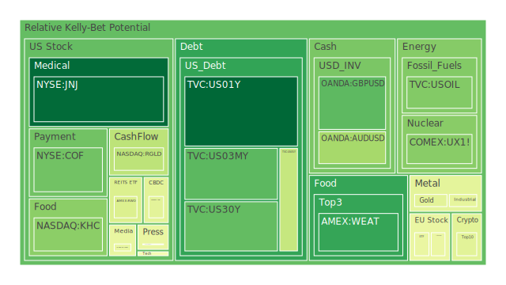
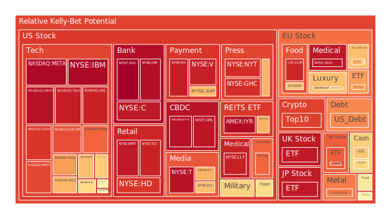
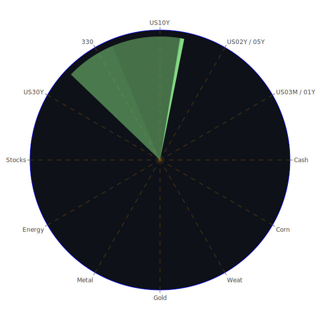

# 投資商品泡沫分析

## 美國國債

近期美國國債收益率呈現波動，尤其是短期與長期國債之間的收益率差距不斷縮小。根據最新數據，3個月期國債收益率為4.34%，而30年期國債收益率為4.68%。這種收益率曲線趨平的現象可能預示著經濟增長放緩的風險。投資者應關注美聯儲的貨幣政策動向，尤其是在利率決策方面的訊號。

## 美國零售股

美國零售業近期受到消費者信心下降的影響。一些主要的零售商，如沃爾瑪（WMT）和塔吉特（TGT），股價出現疲軟。消費者支出的放緩可能源於通貨膨脹壓力和經濟不確定性增加。歷史上，零售股在經濟放緩時期表現相對遜色，投資者應謹慎對待。

## 美國科技股

科技股近期表現強勁，但泡沫風險逐漸增加。蘋果（AAPL）、微軟（MSFT）等大型科技公司的股價接近歷史高位。特別是人工智慧和自動駕駛等領域的投資熱度高漲。然而，過度樂觀的市場情緒可能導致估值過高。投資者應警惕科技股可能的調整風險。

## 美國房地產指數

美國房地產市場持續面臨高利率的挑戰。固定抵押貸款30年期利率維持在6.60%左右，抑制了購房需求。房地產投資信託基金（REITs）如VNQ股價有所下跌。歷史經驗顯示，高利率環境下房地產市場增長受限，投資者應審慎評估房地產投資的風險。

## 加密貨幣

比特幣（BTCUSD）價格近期衝高至106,000美元以上，但泡沫風險指數達到0.92，顯示風險較高。以太坊（ETHUSD）也呈現類似走勢。加密貨幣市場的波動性和不確定性高，歷史上曾多次出現劇烈調整。投資者應注意市場情緒和監管政策的變化。

## 金/銀/銅

黃金價格穩定在2,600美元以上，金銀比和金銅比持續上升，顯示避險需求增加。銀價和銅價相對疲軟，反映出市場對全球經濟增長的擔憂。歷史上，經濟不確定性增加時，黃金作為避險資產的需求上升。

## 黃豆 / 小麥 / 玉米

農產品價格近期波動較大。小麥價格受到全球供應和貿易政策的影響，WEAT的泡沫風險指數較高。黃豆和玉米價格則受到氣候和需求變化的影響。投資者應關注農業市場的供需基本面，考慮天氣和地緣政治因素。

## 石油/ 鈾期貨

油價在每桶70美元左右波動，但市場對需求前景持謹慎態度。地緣政治因素和經濟增長預期影響油價走勢。鈾期貨價格穩定，但受到能源政策和核能發展的影響。投資者應留意能源市場的全球動態。

## 各國外匯市場

美元指數走強，對主要貨幣呈現升值趨勢。歐元、英鎊等貨幣相對疲軟。外匯市場受到各國貨幣政策和經濟數據的影響。投資者需關注美聯儲和其他央行的政策調整，以及全球經濟復甦的進展。

## 各國大盤指數

全球股市呈現分化格局。美國納斯達克指數創下新高，但歐洲和亞洲市場表現相對平淡。經濟基本面、企業盈利和地緣政治因素共同影響各國股市走勢。投資者應多元配置，分散風險。

## 美國半導體股

半導體行業持續受到關注。儘管市場對AI和高性能計算的需求推動了部分公司的增長，但供應鏈限制和地緣政治風險仍存。投資者應關注行業內公司的技術領先性和市場份額。

## 美國銀行股

銀行股近期表現穩定。隨著利率水平的調整，銀行的利息收入可能受到影響。歷史上，利率上升有利於銀行業績，但需要考慮經濟增長和信貸風險因素。

## 美國軍工股

軍工股受益於國防預算的增加和全球安全局勢的變化。洛克希德·馬丁（LMT）和雷神科技（RTX）等公司具有穩定的訂單和盈利能力。投資者可將其視為防禦性資產。

## 美國電子支付股

電子支付行業持續增長，受益於消費者從現金向數字支付的轉變。Visa（V）和萬事達卡（MA）等公司具備良好的市場地位。但需注意市場競爭和監管風險。

## 美國藥商股

製藥行業面臨政策變化和研發挑戰。大型藥企如默克（MRK）和輝瑞（PFE）正在尋求新的增長機會。投資者應關注研發管線和專利到期風險。

## 美國影視股

影視行業受到線上流媒體的衝擊，傳統媒體公司面臨轉型挑戰。奈飛（NFLX）等流媒體公司競爭激烈。投資者需評估公司在內容創作和用戶增長方面的能力。

## 美國媒體股

媒體行業正在適應數字化轉型，廣告收入模式發生變化。公司需要創新以吸引觀眾和廣告商。投資者應關注企業的數字化佈局和市場競爭力。

## 石油防禦股

石油公司如埃克森美孚（XOM）在能源轉型中尋求新機會。高油價有助於提升業績，但同時面臨可再生能源的競爭。投資者應平衡短期收益和長期風險。

## 金礦防禦股

金礦公司受益於黃金價格上漲，作為避險資產具有吸引力。但需注意開採成本和地緣風險。投資者可將其作為資產配置中的一部分。

## 歐洲奢侈品股

歐洲奢侈品品牌如LVMH（MC）和開雲集團（KER）受益於高端消費市場的增長。但經濟放緩和地緣政治風險可能影響需求。歷史上，奢侈品行業具有一定抗周期性。

## 歐洲汽車股

歐洲汽車製造商面臨電動化轉型挑戰。市場競爭加劇，研發投入增加。投資者需關注企業的創新能力和市場份額變化。

## 歐美食品股

食品行業相對穩定，具有防禦性特徵。公司如雀巢（NESN）和百事（PEP）具備全球市場影響力。考慮到消費者需求的穩定性，投資者可將其納入穩健配置。

# 宏觀經濟傳導路徑分析

全球經濟正處於多重挑戰之中。美聯儲的貨幣政策調整影響全球資金流動，美元走強對新興市場造成壓力。地緣政治風險增加，影響能源和大宗商品價格。高通脹環境下，消費者支出減少，企業投資謹慎。這些因素相互作用，形成複雜的經濟傳導路徑。

# 微觀經濟傳導路徑分析

企業面臨成本上升和市場需求變化的雙重壓力。供應鏈中斷導致生產效率降低，利潤空間受壓縮。科技創新成為企業突圍的關鍵，小型企業更易受到市場波動影響。消費者行為的改變，推動企業進行數字化轉型，帶來新的商業模式和機會。

# 資產類別間傳導路徑分析

資產價格之間存在相互影響。股票市場的波動可能引發債券市場的資金流動。大宗商品價格的變化影響相關產業的盈利能力。外匯市場的波動對進出口企業產生直接影響。投資者應關注資產之間的相關性，進行風險對沖與資產配置。

# 投資建議

根據當前市場環境，建議投資者採取多元化的資產配置策略，平衡風險與收益。

## 穩健型配置（50%）

1. **美國國債（20%）**：作為低風險資產，提供穩定的收益和流動性。
2. **黃金（15%）**：避險資產，對抗市場波動和通脹風險。
3. **高信用評級公司債（15%）**：穩定的利息收入，風險相對較低。

## 成長型配置（30%）

1. **科技龍頭股（15%）**：如蘋果、微軟，具備持續增長潛力。
2. **醫療保健股（10%）**：人口老齡化帶來長期需求，如強生（JNJ）。
3. **新能源相關股票（5%）**：把握能源轉型機遇，關注行業領先者。

## 高風險型配置（20%）

1. **新興市場股票（10%）**：經濟發展潛力大，但需承擔較高風險。
2. **加密貨幣（5%）**：高波動性，僅適合少量配置。
3. **小型創新企業股（5%）**：可能帶來高回報，但風險不可忽視。

# 風險提示

投資有風險，市場總是充滿不確定性。我們的建議僅供參考，投資者應根據自身的風險承受能力和投資目標，做出獨立的投資決策。
 
Daily Buy Map:

 
Daily Sell Map:

 
Daily Radar Chart:

 
