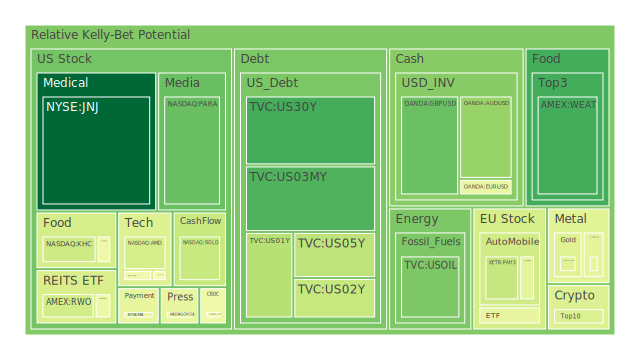
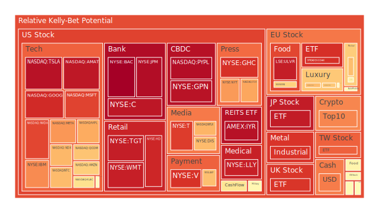
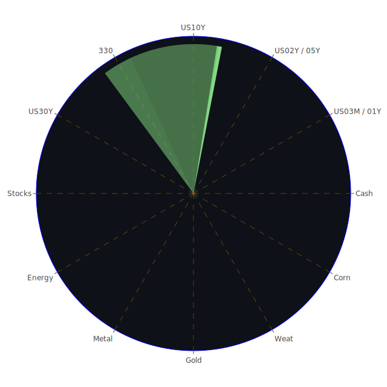

# 投資商品泡沫分析

- **美國國債**

  近期美國國債收益率呈現波動，特別是短期與長期國債之間的利差逐漸縮小。根據資料，2024年12月20日，10年期國債收益率為4.57%，較上週上升，反映市場對未來經濟不確定性的擔憂。經濟學上，收益率曲線倒掛可能預示著經濟衰退的來臨。投資者需關注聯準會的貨幣政策動向，以及美國經濟數據的變化。

- **美國零售股**

  美國零售股近期表現不一。沃爾瑪（NYSE:WMT）股價維持相對穩定，但泡沫指數接近0.94，顯示潛在風險增加。消費者信心指數的下降，以及高通膨對消費者購買力的影響，可能對零售業造成壓力。歷史上，經濟放緩時零售業績常受影響，投資者需謹慎評估。

- **美國科技股**

  科技股如蘋果（NASDAQ:AAPL）、微軟（NASDAQ:MSFT）等，泡沫指數皆超過0.9，顯示市場對科技股的高期待。然而，聯準會可能減緩降息步伐，以及全球經濟增長放緩，可能對科技業造成影響。心理學上，投資者對科技股的過度樂觀可能導致估值過高，需注意可能的調整風險。

- **美國房地產指數**

  房地產ETF（AMEX:RWO、AMEX:IYR）泡沫指數接近1，顯示市場可能過熱。高利率環境下，房貸成本上升可能抑制房地產需求。歷史上，房地產市場過熱往往伴隨著泡沫破裂的風險，投資者需警惕潛在的市場調整。

- **加密貨幣**

  比特幣（BTCUSD）價格達到約10萬美元，泡沫指數超過0.9，加密貨幣市場再次出現狂熱。新聞報導顯示，比特幣近期漲勢迅猛，但市場質疑其內在價值。心理學上，投資者的追漲心理可能導致價格脫離基本面，風險增加。

- **金/銀/銅**

  黃金價格持續走高，金價與油價比值上升至37.51，顯示市場避險情緒濃厚。銀價泡沫指數亦偏高。銅價相對穩定，但全球經濟放緩可能影響需求。歷史上，黃金作為避險資產，在經濟不確定性時表現優異。

- **黃豆 / 小麥 / 玉米**

  農產品價格近期波動較大，玉米ETF（AMEX:CORN）泡沫指數超過0.55，小麥ETF（AMEX:WEAT）亦呈現高泡沫指數。全球氣候變遷、貿易政策以及供應鏈問題可能影響農產品供給，投資者需關注相關消息。

- **石油/ 鈾期貨UX!**

  油價近期回落，但金油比上升，可能顯示油市需求放緩。鈾期貨（COMEX:UX1!）價格穩定，但能源政策轉變可能影響其長期需求。地緣政治風險仍是影響能源市場的主要因素。

- **各國外匯市場**

  美元指數走強，美元兌主要貨幣如歐元（EURUSD）、日元（USDJPY）等維持強勢。聯準會的貨幣政策立場，以及全球經濟情勢，將繼續影響匯率走勢。投資者需密切關注央行政策變化。

- **各國大盤指數**

  美股近期受聯準會立場影響出現波動，道瓊指數、納斯達克指數等皆有調整。歐洲股市亦受經濟數據影響，投資者需關注全球宏觀經濟走勢。

- **美國半導體股**

  半導體股如英特爾（NASDAQ:INTC）、微芯科技（NASDAQ:MU）等，泡沫指數較高。全球晶片需求仍然強勁，但供應鏈問題可能影響產業發展。博弈論角度，競爭加劇可能導致價格戰，影響獲利。

- **美國銀行股**

  銀行股如摩根大通（NYSE:JPM）、美國銀行（NYSE:BAC）等，泡沫指數接近1，需警惕潛在風險。高利率環境下，銀行利差擴大，但經濟放緩可能增加呆帳風險。

- **美國軍工股**

  軍工股如洛克希德馬丁（NYSE:LMT）、雷神（NYSE:RTX）等，泡沫指數約在0.54左右，處於相對穩定狀態。地緣政治緊張可能推動國防支出，利好軍工產業。

- **美國電子支付股**

  電子支付股如PayPal（NASDAQ:PYPL）、Visa（NYSE:V）等，泡沫指數偏高。數位支付趨勢持續，但市場競爭加劇，需關注創新能力與市場份額。

- **美國藥商股**

  藥商股如默克（NYSE:MRK）、輝瑞（未列出）等，受疫情影響，市場需求增加。但泡沫指數提升，需注意政策風險和研發進展。

- **美國影視股**

  影視股如迪士尼（NYSE:DIS）、Netflix（NASDAQ:NFLX）等，面臨內容競爭與訂閱增長挑戰。泡沫指數偏高，投資者需關注業務模式的可持續性。

- **美國媒體股**

  媒體股如康卡斯特（NASDAQ:CMCSA）、紐約時報（NYSE:NYT）等，受廣告市場波動影響。數位化轉型和內容質量是關鍵。

- **石油防禦股**

  石油巨頭如埃克森美孚（NYSE:XOM），泡沫指數超過0.8。能源轉型背景下，石油企業面臨長期挑戰，但短期仍受油價波動影響。

- **金礦防禦股**

  金礦企業如Royal Gold（NASDAQ:RGLD），泡沫指數在0.38左右。金價上漲利好金礦股，但需注意開採成本和地緣風險。

- **歐洲奢侈品股**

  歐洲奢侈品如路威酩軒（EURONEXT:MC）、開雲集團（EURONEXT:KER）等，泡沫指數約在0.5-0.7之間。中國市場需求放緩可能影響銷售，需關注地區市場的變化。

- **歐洲汽車股**

  德國汽車股如戴姆勒（XETR:DAI）、BMW（XETR:BMW）等，泡沫指數升高。電動化轉型和供應鏈問題是主要挑戰。

- **歐美食品股**

  食品企業如雀巢（SIX:NESN），泡沫指數約在0.65。通膨提高生產成本，消費者需求疲弱可能影響業績。

# 宏觀經濟傳導路徑分析

全球經濟面臨多重挑戰：高通膨、央行貨幣政策收緊、地緣政治緊張等。聯準會可能減緩降息步伐，引發市場利率上升，使得債券價格下跌。高利率環境抑制投資與消費，進一步影響企業盈利和股市表現。能源價格波動影響通膨預期，進而影響央行決策。

# 微觀經濟傳導路徑分析

企業層面，成本壓力上升，利潤空間被壓縮。供應鏈問題導致生產延誤，進一步影響營收。消費者信心下降，削弱市場需求。企業可能採取削減成本或提高價格的策略，影響市場競爭格局。

# 資產類別間傳導路徑分析

債券市場與股市呈現負相關關係，利率上升可能導致股市資金流出，投向債券市場。商品價格上漲，特別是黃金，顯示避險情緒升溫。匯率變動影響國際貿易和跨國企業盈利。不同資產間的聯動性增加，需考慮資產配置的多元化。

# 投資建議

**穩健型配置（50%）：**

1. **美國國債（20%）**：在經濟不確定性時期，國債是較為安全的投資標的。

2. **金礦防禦股（15%）**：利用黃金的避險屬性，對沖市場風險。

3. **高品質藍籌股（15%）**：如必需消費品行業的領導企業，業績穩定，抗風險能力強。

**成長型配置（30%）：**

1. **科技股（15%）**：選擇具備核心競爭力和創新能力的科技企業。

2. **醫藥股（10%）**：受益於研發突破和健康需求增長。

3. **新能源相關股（5%）**：符合長期發展趨勢，但需控制風險。

**高風險型配置（20%）：**

1. **加密貨幣（10%）**：市場波動大，需嚴控投資比例。

2. **新興市場股票（5%）**：高成長潛力，伴隨較大風險。

3. **原油期貨（5%）**：受地緣政治影響大，可作短期投機。

# 風險提示

投資有風險，市場總是充滿不確定性。我們的建議僅供參考，投資者應根據自身的風險承受能力和投資目標，做出獨立的投資決策。
 
Daily Buy Map:

 
Daily Sell Map:

 
Daily Radar Chart:

 
