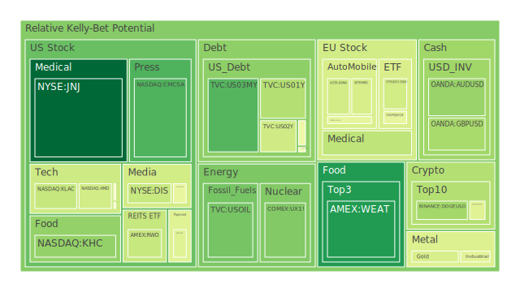
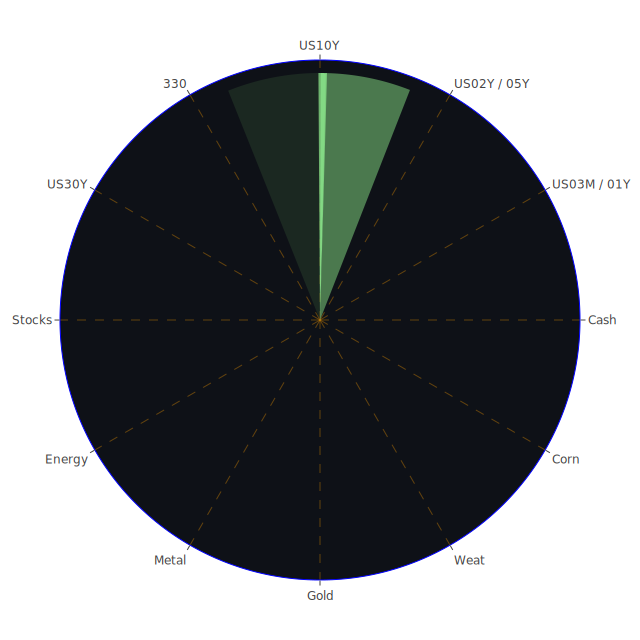

# 投資商品泡沫分析

## 美國國債

近期美國國債收益率呈現波動，10年期國債收益率上升至4.53%，而30年期國債收益率也升至4.72%。這反映了市場對美國經濟前景的複雜情緒。從經濟學角度來看，收益率的上升可能源於投資人對通貨膨脹的預期增加，以及對聯邦準備理事會（FED）未來政策的不確定性。社會學層面，投資者情緒受到近期新聞事件的影響，如FED的鷹派言論增多，加之地緣政治風險，加劇了市場的不確定性。心理學上，投資者可能陷入了羊群效應，隨著收益率上升，拋售國債的行為進一步推高了收益率。

## 美國零售股

美國零售股，如沃爾瑪（WMT）近期股價波動，加上沃爾瑪可能無法達成2025和2030年的氣候變化目標的新聞，對股價產生了負面影響。經濟學上，這可能反映了市場對零售業未來成本上升的擔憂，如需投入更多資源以達成環保目標。社會學層面，消費者對企業社會責任的關注度提高，可能影響購買行為。心理學上，投資者可能對企業未達成環保目標感到失望，從而減少持股。

## 美國科技股

美國科技股，如蘋果（AAPL）、微軟（MSFT）等，近期股價表現強勁。然而，OpenAI的GPT-5未達預期，以及AI相關企業的潛在風險，加之對於未來科技發展的不確定性，可能為科技股帶來風險。經濟學上，科技企業的估值可能過高，存在泡沫風險。社會學角度，大眾對新技術的期待與現實可能存在差距。心理學上，投資者可能過度樂觀，導致市場過熱。

## 美國房地產指數

房地產市場方面，AMEX:RWO的泡沫指數顯示風險逐漸增加。固定房貸30年利率維持在6.72%，相較去年2.67%，大幅上升。經濟學上，高利率可能抑制購房需求，導致房地產市場降溫。社會學上，人們對住房負擔能力的擔憂增加。心理學上，潛在買家可能推遲購房計劃，等待利率下降。

## 加密貨幣

比特幣（BTCUSD）的價格在經過長時間的上漲後，首次出現週跌幅。新聞報導中，對於OpenAI的GPT-5未達預期，以及AI相關企業的風險，可能影響了市場對加密貨幣的信心。經濟學上，加密貨幣缺乏內在價值，價格波動性大，存在較高的泡沫風險。心理學上，投資者情緒易受市場情緒影響，FOMO（錯失恐懼）可能推動價格上漲，但也可能導致快速下跌。

## 金/銀/銅

黃金價格維持在2588美元附近，金銀銅比率顯示市場對避險資產的需求增加。經濟學上，當市場不確定性增加時，投資者傾向轉向黃金等避險資產。社會學上，全球地緣政治緊張局勢，如中東地區的衝突，以及各國央行的政策，影響著市場情緒。心理學上，投資者尋求安全感，增加對黃金的配置。

## 黃豆 / 小麥 / 玉米

農產品市場方面，黃豆（SOYB）、小麥（WEAT）和玉米（CORN）的泡沫指數顯示風險上升。新聞報導中，美國與墨西哥在基因改造玉米的爭端中，美國勝訴，可能影響農產品的供應和價格。經濟學上，供需關係的變化可能導致價格波動。社會學上，對於基因改造食品的爭議影響消費者需求。心理學上，投資者可能預期價格上漲，增加持倉。

## 石油/ 鈾期貨UX!

石油價格持續下跌，石油/黃金比率上升。經濟學上，供過於求以及全球經濟增長放緩導致油價下跌。社會學上，對於環保能源的需求增加，可能減少對傳統能源的依賴。心理學上，投資者對石油市場的信心下降。鈾期貨方面，核能政策的變動可能影響鈾的需求和價格。

## 各國外匯市場

美元指數走強，特別是對歐元（EURUSD）和英鎊（GBPUSD）。經濟學上，FED的鷹派立場，使美元相對其他貨幣升值。社會學上，各國經濟政策的差異影響匯率。心理學上，投資者傾向於持有美元資產，以避險。

## 各國大盤指數

美國NASDAQ指數維持高位，但有調整壓力。歐洲股市受到經濟數據和政治事件的影響，表現不一。經濟學上，全球經濟增長放緩可能影響股市表現。社會學上，投資者對政策變動和地緣政治風險的擔憂增加。心理學上，市場情緒偏謹慎。

## 美國半導體股

半導體股如英特爾（INTC）、美光（MU）等，泡沫指數較高。新聞報導中，日本反壟斷機構可能對谷歌進行處罰，可能影響科技產業。經濟學上，需求可能放緩，供應過剩風險上升。社會學上，科技發展的瓶頸和政策限制可能影響行業前景。心理學上，投資者可能過度樂觀，忽視風險。

## 美國銀行股

銀行股如摩根大通（JPM）、美國銀行（BAC）等，泡沫指數接近高位。經濟學上，利率變動直接影響銀行利差收益。社會學上，對於經濟衰退的擔憂可能導致貸款需求下降。心理學上，投資者對銀行業的風險偏好降低。

## 美國軍工股

軍工股如洛克希德馬丁（LMT）等，受益於地緣政治緊張局勢。然而，泡沫風險需要警惕。經濟學上，國防預算的變動直接影響軍工企業收益。社會學上，戰爭與和平的討論影響投資者情緒。心理學上，投資者可能預期軍工股的穩定收益，但忽視潛在風險。

## 美國電子支付股

電子支付股如PayPal（PYPL）、Visa（V）等，泡沫指數較高。新聞報導中，經濟放緩可能影響消費者支出。經濟學上，交易量的下降可能影響企業收入。社會學上，消費者行為的改變，如節約消費，可能影響電子支付使用率。心理學上，投資者對科技股的熱情可能過度。

## 美國藥商股

藥商股如默克（MRK）、禮來（LLY）等，風險相對較低。經濟學上，醫療需求穩定，收入具有防禦性。社會學上，人口老齡化和健康意識提高，利好藥企。心理學上，投資者將醫藥股視為避險資產。

## 美國影視股

影視娛樂股如迪士尼（DIS）、Netflix（NFLX），市場競爭激烈。新聞報導中，迪士尼面臨員工罷工，可能影響業績。經濟學上，內容製作成本上升，訂戶增長放緩。社會學上，觀眾收視習慣改變，轉向新媒體平台。心理學上，投資者對行業前景持謹慎態度。

## 美國媒體股

媒體股如康卡斯特（CMCSA）、紐約時報（NYT）等，面臨數位化轉型。經濟學上，廣告收入的波動影響盈利。社會學上，讀者和觀眾的需求變化，要求媒體適應新形式。心理學上，投資者對傳統媒體的信心減弱。

## 石油防禦股

石油防禦股如埃克森美孚（XOM），受油價下跌影響。經濟學上，全球供需失衡導致油價波動。社會學上，環保意識提升，對化石燃料需求減少。心理學上，投資者可能轉向可再生能源企業。

## 金礦防禦股

金礦股如Royal Gold（RGLD），隨著金價上漲而受益。經濟學上，當市場不確定性增加，黃金作為避險資產需求上升。社會學上，經濟動盪時，投資者尋求資產保值。心理學上，安全感驅使投資者增加對金礦股的配置。

## 歐洲奢侈品股

歐洲奢侈品股如路威酩軒（MC）、開雲集團（KER）等，近期受中國經濟增長放緩影響。經濟學上，關鍵市場需求減少直接影響銷售。社會學上，消費者偏好轉變以及對奢侈品的觀感變化。心理學上，投資者對行業前景存疑。

## 歐洲汽車股

歐洲汽車股如BMW、賓士（MBG），面臨電動化轉型挑戰。新聞報導中，大眾汽車（VW）與工會談判陷入僵局，可能影響生產。經濟學上，投資電動化需要大量資本，影響短期盈利。社會學上，環保政策推動電動車需求。心理學上，投資者對傳統汽車企業能否成功轉型持謹慎態度。

## 歐美食品股

食品股如雀巢（NESN）、可口可樂（KO），具備防禦性。經濟學上，食品需求相對穩定，不受經濟周期影響。社會學上，健康飲食趨勢可能影響產品線。心理學上，投資者將食品股視為避險選擇。

# 宏觀經濟傳導路徑分析

全球經濟面臨多重挑戰：FED的鷹派態度使市場預期利率將維持高位，導致美元走強，影響新興市場資本流動。地緣政治風險，如中東局勢緊張，加劇了市場的不確定性。大宗商品價格波動，特別是石油和黃金，反映了市場對全球經濟前景的擔憂。

高利率環境下，企業融資成本增加，可能導致投資減少，經濟增長放緩。消費者支出可能受到抑制，影響零售和服務業。

# 微觀經濟傳導路徑分析

企業層面，利率上升導致債務成本增加，影響盈利能力。供應鏈問題和勞動力成本上升，可能進一步壓縮利潤。

消費者層面，貸款利率提高，影響住房和汽車等大型消費品的購買決策。通貨膨脹壓力增加，實際收入減少，消費者可能縮減非必需品開支。

# 資產類別間傳導路徑分析

股票市場與債券市場存在負相關性。當利率上升，債券收益率提高，股票市場可能下跌。商品市場，如黃金，與股市和美元呈負相關性。

外匯市場中，美元走強，影響貿易順差國家的出口。新興市場貨幣貶值，可能導致資本外流。

大宗商品價格下跌，影響資源型國家的經濟，進而影響全球貿易鏈。

# 投資建議

在當前充滿不確定性的市場環境下，建議投資組合進行適當的調整，以達到風險對沖和收益平衡。

## 穩健型配置（50%）

1. **黃金（20%）：** 作為傳統的避險資產，黃金在市場波動時提供穩定性。
2. **醫藥股（15%）：** 投資如默克（MRK）、禮來（LLY），醫療行業需求穩定，風險較低。
3. **食品股（15%）：** 如雀巢（NESN）、可口可樂（KO），消費品需求穩定。

## 成長型配置（30%）

1. **科技股（10%）：** 選擇具備創新能力的企業，如蘋果（AAPL）、微軟（MSFT），長期看好。
2. **新能源股（10%）：** 投資可再生能源相關企業，符合未來發展趨勢。
3. **半導體股（10%）：** 雖然存在風險，但長期需求增長可期。

## 高風險配置（20%）

1. **加密貨幣（8%）：** 投資比特幣、以太坊，但需警惕高波動性。
2. **新興市場股票（6%）：** 一旦全球經濟復甦，新興市場可能提供高回報。
3. **石油相關資產（6%）：** 如果油價反彈，相關資產可能獲益。

# 風險提示

投資有風險，市場總是充滿不確定性。我們的建議僅供參考，投資者應根據自身的風險承受能力和投資目標，做出獨立的投資決策。

目前市場存在高泡沫風險的警告，特別是在科技股和加密貨幣方面。投資者應該謹慎行事，注意資產配置的多樣化，並隨時關注市場動態和經濟指標的變化。

總之，透過對市場的全面分析，我們建議在投資組合中保持穩健與成長並重，同時對於高風險資產進行適度配置，以期在不確定的市場環境中達到最佳化的投資效果。
 
Daily Buy Map:

 
Daily Sell Map:

 
Daily Radar Chart:

 
