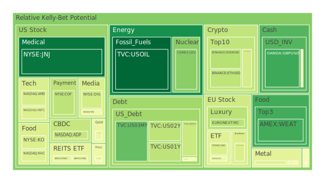
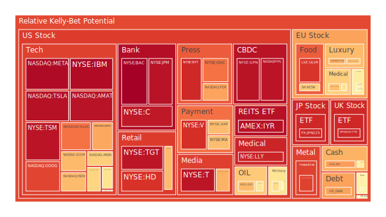
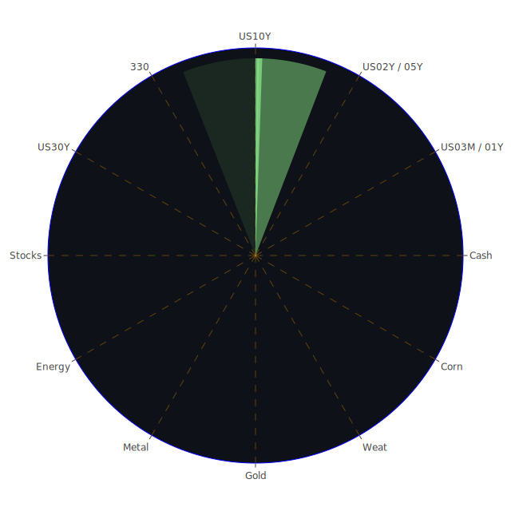

# 投資商品泡沫分析

## 美國國債

近期美國國債市場出現了明顯的波動。根據提供的資料顯示，2024年12月24日，美國10年期國債收益率達到4.59%，較上一週的4.40%上升。同時，30年期國債收益率也上升至4.78%。這種收益率的上升，可能反映出市場對未來通脹的預期增強，投資者對美聯儲貨幣政策持續收緊的擔憂加劇。

從經濟學角度分析，當債券收益率上升時，債券價格通常下降，這意味著國債市場可能存在泡沫風險。歷史上，類似的情況曾在2013年的“削減恐慌”中出現，當時美聯儲暗示可能減少量化寬鬆政策，引發了國債收益率的飆升。

針對目前的情況，投資者應密切關注美聯儲的政策動向，以及通脹數據的變化。博弈論分析指出，在不確定性的市場環境下，投資者可能會選擇觀望，導致市場流動性下降，加劇價格波動。

## 美國零售股

美國零售股近期承受壓力。根據新聞報導，Starbucks工人擴大罷工行動，涉及紐約等多個城市，這可能對零售業的營運產生負面影響。從社會學角度看，勞資關係緊張可能導致企業成本上升，影響盈利能力。

此外，消費者信心指數下降，反映出消費者對經濟前景的擔憂。心理學研究表明，消費者情緒對購買行為有直接影響，可能導致零售銷售額下降。歷史上，零售業在經濟衰退時期通常表現不佳，投資者需謹慎對待。

## 美國科技股

美國科技股近期表現出色，尤其是在人工智慧（AI）和半導體領域。根據資料，NVIDIA、AMD等公司的股價持續上漲，帶動NASDAQ指數上揚。這主要得益於科技創新和市場對新技術的期待。

然而，值得注意的是，科技股的估值已經處於高位，存在泡沫風險。歷史上，2000年的互聯網泡沫就是前車之鑑。經濟學理論指出，當資產價格遠高於其基本面時，市場調整的風險增加。

## 美國房地產指數

美國房地產市場面臨挑戰。固定抵押貸款30年期利率上升至6.72%，較去年同期的2.67%大幅上升。高利率環境可能抑制房地產需求，導致房價增長放緩。

從社會學角度看，房價上漲和利率上升對購房者造成雙重壓力。歷史上，2008年的次貸危機就是因為房地產泡沫破裂，導致全球金融危機。投資者應關注房地產市場的風險。

## 加密貨幣

比特幣等加密貨幣近期價格波動加劇。根據資料，BTC/USD價格在12月24日下降至93,365美元，同時泡沫指數D1為0.399，風險較高。新聞報導顯示，美國稅務機關將加密貨幣質押視為應稅收入，這增加了市場不確定性。

心理學研究表明，投資者對加密貨幣的熱情容易受到政策和監管的影響。歷史上，加密貨幣市場曾多次出現大幅跳水，投資者需提高警惕。

## 金/銀/銅

黃金價格近期保持穩定，作為傳統避險資產，受到市場青睞。黃金與石油、銅的比率上升，顯示出市場對避險資產的需求增加。

從經濟學角度分析，高通脹和貨幣貶值風險提升了黃金的投資價值。歷史上，黃金在經濟不穩定時期通常表現良好。

## 黃豆 / 小麥 / 玉米

農產品價格受到全球供需關係的影響。玉米期貨價格上升，泡沫指數D1達到0.555，風險增加。氣候變化和地緣政治因素可能導致供應中斷。

經濟學理論指出，農產品價格對通脹有直接影響。歷史上，農產品價格波動曾引發社會動盪，需謹慎關注。

## 石油/鈾期貨UX!

石油價格近期略有下滑，報每桶69美元左右。全球經濟放緩可能抑制石油需求。同時，中東地區的地緣政治緊張局勢可能影響供應。

鈾期貨價格上升，反映出市場對核能的關注增加。能源轉型和減碳政策推動對清潔能源的投資，但需警惕市場過熱的風險。

## 各國外匯市場

美元指數走強，歐元、日元等主要貨幣兌美元匯率下跌。這可能與美聯儲的貨幣政策預期有關。英鎊兌美元匯率也持續走低，英國經濟不確定性加劇。

從經濟學角度看，貨幣政策差異和經濟基本面是影響匯率的主要因素。投資者需關注各國央行的政策動向。

## 各國大盤指數

全球股市表現分化。美國股市受科技股上漲帶動上行，歐洲股市則受到能源危機和通脹壓力的影響表現疲軟。亞洲市場受中國經濟放緩影響，投資者信心不足。

歷史上，全球市場聯動性增加，任何一個主要市場的波動都可能影響其他市場。博弈論分析指出，投資者在全球資產配置中需考慮風險分散。

## 美國半導體股

半導體行業持續高速增長。人工智慧、物聯網等新興技術需要大量的芯片支持。資料顯示，AMD、NVIDIA等公司股價上漲，投資者對該行業充滿信心。

然而，供應鏈瓶頸和地緣政治風險可能對行業造成影響。需關注美中貿易關係和技術管制政策。

## 美國銀行股

銀行股受益於利率上升，淨息差擴大。然而，經濟前景不確定性增加了貸款違約風險。資料顯示，美國銀行（BAC）的泡沫指數接近1，風險極高。

從心理學角度看，投資者對銀行業的信心可能因經濟下行而減弱。歷史上，金融危機期間銀行股表現不佳。

## 美國軍工股

地緣政治緊張推高了軍工股的需求。洛克希德·馬丁（LMT）等公司可能受益於國防預算增加。博弈論指出，國際局勢緊張時，各國可能增加軍事投入。

然而，軍工行業受政府政策影響較大，投資者需關注政策變化和道德風險。

## 美國電子支付股

電子支付行業蓬勃發展。VISA、MASTERCARD等公司受益於無現金支付的趨勢。然而，競爭加劇和監管風險需要關注。

歷史上，科技創新帶來行業革命，但市場份額可能被新興企業侵蝕。投資者需警惕市場格局變化。

## 美國藥商股

醫藥行業持續受到投資者關注。新藥研發和疫情影響使得默克（MRK）、輝瑞等公司的業績受到關注。社會學角度看，人口老齡化增加了醫療需求。

需關注藥價管制政策和專利過期等風險因素。

## 美國影視股

影視媒體行業面臨數字化轉型挑戰。迪士尼（DIS）等公司加強流媒體佈局，尋求新的增長點。疫情後影院業務復甦仍然緩慢，投資者需關注內容創新和用戶增長。

## 美國媒體股

傳統媒體受新媒體衝擊，廣告收入下滑。康卡斯特（CMCSA）等公司加速數字轉型，但競爭激烈。心理學研究表明，消費者習慣的改變對媒體行業影響深遠。

需關注行業整合和技術創新帶來的機遇和風險。

## 石油防禦股

石油防禦股在能源價格波動時提供相對穩定的收益。埃克森美孚（XOM）等公司受益於成本控制和下游業務。然而，能源轉型可能對行業長期發展帶來挑戰。

投資者應關注企業的可持續發展策略和政策風險。

## 金礦防禦股

金礦企業受金價上漲推動。皇家黃金（RGLD）等公司的表現與黃金價格密切相關。歷史上，金礦股在經濟危機時期表現優異。

需關注生產成本、地緣政治風險和環保政策。

## 歐洲奢侈品股

歐洲奢侈品行業受全球經濟和消費趨勢影響。LVMH、開雲集團（KER）等公司在中國市場的業績至關重要。近期，市場擔憂中國經濟放緩可能影響銷售。

社會學分析指出，奢侈品消費具有文化和心理因素，投資者需關注市場情緒變化。

## 歐洲汽車股

歐洲汽車製造商面臨電動化轉型挑戰。大眾、戴姆勒等公司投入巨資研發電動汽車。同時，全球供應鏈問題和晶片短缺對生產造成影響。

博弈論角度看，企業需要在競爭和合作中尋求最佳策略。政策支持和市場需求將決定行業前景。

## 歐美食品股

食品行業受益於剛性需求。雀巢（NESN）、可口可樂（KO）等公司業績穩定。然而，原材料價格上漲和供應鏈中斷可能壓縮利潤。

投資者需關注成本管理和產品創新，以保持競爭優勢。

# 宏觀經濟傳導路徑分析

全球經濟正處於復甦與挑戰並存的階段。高通脹、供應鏈瓶頸、地緣政治緊張等因素共同影響著經濟走勢。美聯儲的貨幣政策調整對全球資本流動產生重要影響。

利率上升可能導致新興市場資本外流，壓力增加。同時，美元走強對全球貿易和債務負擔帶來挑戰。各國需協調政策，共同應對全球性問題。

# 微觀經濟傳導路徑分析

企業面臨成本上升和需求不確定性的雙重挑戰。工資上漲、原材料價格上升壓縮了利潤空間。消費者信心下降可能導致消費支出減少，進而影響企業收入。

同時，技術創新和數字化轉型為企業帶來新的機遇。企業需要靈活調整，提升競爭力。

# 資產類別間傳導路徑分析

不同資產之間存在互相影響。債券收益率上升可能使股票相對吸引力下降，資金從股市流出。同時，避險需求提升可能推動黃金價格上漲。

匯率變動影響國際資本配置，美元走強可能導致新興市場壓力加大。大宗商品價格波動對相關股票和貨幣產生影響。

# 投資建議

根據上述分析，建議投資者採取多元化的投資策略，平衡風險與收益。

**穩健型配置（50%）：**

- **美國國債（20%）：** 提供穩定收益，對抗市場波動。
- **黃金（15%）：** 作為避險資產，對抗通脹和貨幣貶值。
- **高品質藍籌股（15%）：** 如食品、醫藥等防禦性行業。

**成長型配置（30%）：**

- **科技股（10%）：** 把握科技創新帶來的長期增長機會。
- **半導體股（10%）：** 受益於數字化和AI發展。
- **醫藥創新企業（10%）：** 投資於有研發潛力的公司。

**高風險型配置（20%）：**

- **加密貨幣（5%）：** 具有高波動性，僅適合風險承受能力強的投資者。
- **新興市場股票（10%）：** 把握經濟增長潛力，但需要警惕政策和匯率風險。
- **原油相關資產（5%）：** 投資於油價上升的機會，但需關注地緣政治風險。

投資比例應根據個人風險偏好和財務目標進行調整，並保持資產配置的靈活性。

# 風險提示

投資有風險，市場總是充滿不確定性。我們的建議僅供參考，投資者應根據自身的風險承受能力和投資目標，做出獨立的投資決策。

**請注意：**

- 市場可能受到突發事件影響，資產價格可能出現劇烈波動。
- 泡沫風險高的投資標的需謹慎對待，避免因過度樂觀導致重大損失。
- 定期檢視投資組合，根據市場變化進行調整。

---

以上報告旨在提供對當前市場的全面分析，協助投資者在複雜的環境中做出明智的決策。我們強調理性投資，避免盲目跟風，持續關注市場動態，以達成長期財務目標。
 
Daily Buy Map:

 
Daily Sell Map:

 
Daily Radar Chart:

 
