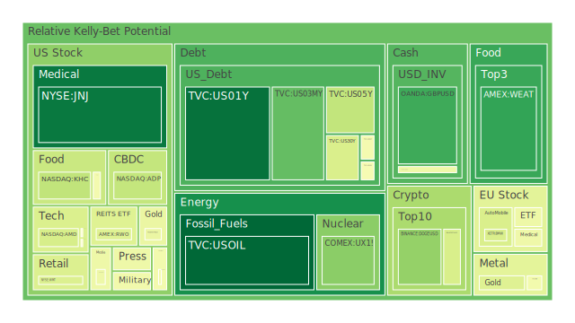
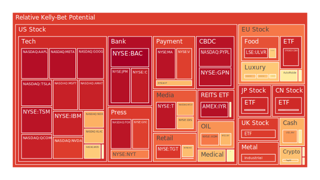
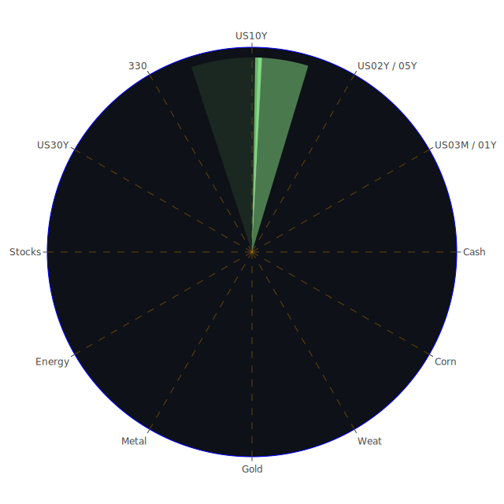

# 投資商品泡沫分析

## **美國國債**

近期，美國國債收益率呈現波動。根據資料，2024-12-25的美國10年期國債收益率為4.58%，較前一週的4.40%有所上升，與去年同期的3.81%相比，明顯提高。這說明市場對未來經濟的不確定性增加，投資者要求更高的收益率來承擔風險。

從經濟學角度，這可能反映了通貨膨脹預期的上升，以及對聯邦儲備局未來貨幣政策的猜測。心理學上，投資者可能對未來經濟增長放緩感到焦慮，導致避險情緒升溫。博弈論角度，各市場參與者在觀望他人行動，導致市場波動加劇。

## **美國零售股**

近期，美國零售業正面臨挑戰。新聞報導顯示，「Starbucks工人擴大罷工，美國多個城市受影響」，這可能對零售業造成負面影響。加上「Party City宣佈破產」，顯示零售業者在當前經濟環境下經營困難。

社會學角度，消費者消費意願下降，可能是經濟不確定性或物價上漲所致。心理學上，消費者可能轉向網絡購物，傳統零售店面臨挑戰。這些因素可能導致零售股價下跌，投資者需要謹慎。

## **美國科技股**

科技股近期表現突出。資料顯示，NASDAQ:AMZN、NASDAQ:AAPL等科技巨頭的泡沫風險指數相對較高。然而，新聞提到「華爾街在節日交易周開始時科技股領漲」，顯示市場對科技股的信心仍在。

經濟學上，科技股受益於數位轉型和創新。心理學上，投資者對科技行業的未來增長預期樂觀。博弈論角度，市場參與者可能因為Fear of Missing Out（錯失恐懼）而追捧科技股，推高了其估值。

## **美國房地產指數**

房地產市場出現一定波動。資料顯示，AMEX:RWO與AMEX:VNQ的泡沫風險指數有所上升。同時，新聞報導「美國房價在11月環比上漲」，顯示房地產市場仍有一定活力。

經濟學角度，低利率環境可能刺激房地產投資。但隨著利率上升，房貸成本增加，可能抑制購房需求。心理學上，消費者可能對未來房價走勢感到不確定，觀望情緒增加。

## **加密貨幣**

比特幣等加密貨幣近期波動較大。資料顯示，Bitcoin的泡沫風險指數較高，並且新聞提到「比特幣接近自特朗普當選以來的首次週度下跌」，顯示市場情緒波動。

心理學角度，加密貨幣市場受投資者情緒影響較大。經濟學上，加密貨幣缺乏實體支撐，價格易受消息面影響。博弈論角度，市場參與者可能出現集體拋售或買入，導致價格劇烈波動。

## **金/銀/銅**

貴金屬市場近期表現平穩。資料顯示，XAUUSD（黃金）與XAGUSD（白銀）的泡沫風險指數較高，但價格相對穩定。新聞報導「黃金價格穩定，交易者關注不確定的2025年利率路徑」。

經濟學角度，貴金屬通常被視為避險資產，在經濟不確定性時受到青睞。心理學上，投資者可能轉向黃金等資產以保值。歷史上，在通脹上升或金融市場波動時，貴金屬價格有上漲趨勢。

## **黃豆 / 小麥 / 玉米**

農產品市場出現一定波動。資料顯示，AMEX:WEAT（小麥）與AMEX:CORN（玉米）的泡沫風險指數有所上升。新聞提到「礦業公司面臨環境指控」，可能影響農產品供應鏈。

經濟學角度，供應鏈中斷可能導致農產品價格上漲。心理學上，市場對未來供應的不確定性可能推高價格。歷史上，極端天氣或地緣政治因素都可能影響農產品市場。

## **石油/ 鈾期貨UX!**

能源市場近期波動明顯。資料顯示，TVC:USOIL（石油）的泡沫風險指數較低，但新聞報導「油價在假期前交易中下跌，美元走強」。同時，COMEX:UX1!（鈾期貨）的泡沫風險指數較高，反映市場對核能資源的興趣增加。

經濟學角度，石油價格受到供需影響，地緣政治因素也起作用。心理學上，投資者對新能源的未來預期可能推動鈾期貨價格上漲。博弈論角度，各國在能源領域的競爭與合作影響市場走向。

## **各國外匯市場**

外匯市場近期受到多重因素影響。資料顯示，OANDA:GBPUSD、OANDA:EURUSD等主要貨幣對的風險指數有所變化。新聞提到「美元走強，因聯儲局利率展望引導方向」。

經濟學上，各國經濟基本面、利率政策等影響匯率走勢。心理學上，投資者情緒和避險需求也起作用。博弈論角度，各國央行的政策博弈影響匯市走勢。

## **各國大盤指數**

全球股市出現分化。資料顯示，歐洲與亞洲市場指數泡沫風險指數有所上升。新聞報導「亞洲股市在華爾街科技股帶動下上漲」，顯示市場受美股影響明顯。

經濟學角度，全球經濟聯動性加強，市場受主要經濟體影響。心理學上，投資者情緒容易受到全球事件影響。歷史上，重大事件常導致全球股市同步波動。

## **美國半導體股**

半導體行業受到市場關注。資料顯示，NASDAQ:NVDA、NASDAQ:AMD等公司的泡沫風險指數較高。新聞提到「NVIDIA、晶片股領漲科技板塊」，反映市場對人工智慧和科技創新的期望。

經濟學角度，半導體是現代科技產業的基礎，需求持續增長。心理學上，投資者對科技創新帶來的機遇感到興奮。博弈論角度，各國在科技領域的競爭加劇，影響行業發展。

## **美國銀行股**

銀行業近期面臨挑戰。資料顯示，NYSE:BAC等銀行股泡沫風險指數接近1，風險較高。新聞報導「銀行起訴聯準會，挑戰壓力測試方法」，顯示銀行業與監管機構之間的緊張關係。

經濟學角度，利率政策、經濟增長等影響銀行業績。心理學上，投資者可能對銀行業的未來感到擔憂。博弈論角度，銀行需要在合規和盈利之間尋求平衡。

## **美國軍工股**

軍工行業穩定發展。資料顯示，NYSE:LMT、NYSE:NOC等公司的泡沫風險指數適中。地緣政治緊張局勢可能推動軍工股需求。

經濟學角度，國防預算和政府政策影響軍工行業。心理學上，投資者可能視軍工股為防禦性資產。歷史上，軍事衝突或緊張局勢時，軍工股表現通常較好。

## **美國電子支付股**

電子支付行業蓬勃發展。資料顯示，NYSE:V、NYSE:MA等公司的泡沫風險指數較高。新聞提到「Google使用Anthropic的Claude來改進其Gemini AI」，反映科技與支付的融合。

經濟學角度，數位經濟發展帶動電子支付需求。心理學上，消費者習慣轉變，越來越依賴電子支付。博弈論角度，各公司競爭激烈，需持續創新。

## **美國藥商股**

醫藥行業受到關注。資料顯示，NYSE:JNJ、NYSE:MRK等公司的泡沫風險指數適中。新聞提到「FDA對Eli Lilly的Zepbound做出裁定，導致睡眠呼吸暫停設備製造商股價下跌」。

經濟學角度，研發成本與市場需求影響藥商業績。心理學上，投資者對新藥研發成功與否存在期待與不確定性。

## **美國影視股**

影視行業正面臨挑戰。資料顯示，NASDAQ:NFLX的泡沫風險指數較高。新聞提到「美國工人罷工擴大，導致接近60家Starbucks門店關閉」，反映勞資關係緊張可能影響服務業。

經濟學角度，消費者娛樂支出和競爭環境影響影視公司業績。心理學上，觀眾觀看習慣改變，流媒體崛起。

## **美國媒體股**

媒體行業格局改變。資料顯示，NASDAQ:GOOG、NYSE:DIS等公司的泡沫風險指數較高。新聞提到「Google提議的搜尋結果變更獲得歐盟航空公司的好評」，顯示監管環境對媒體公司的影響。

經濟學角度，廣告收入和數位轉型是關鍵。心理學上，觀眾對資訊獲取的方式轉變。

## **石油防禦股**

能源防禦股受到關注。資料顯示，NYSE:XOM的泡沫風險指數適中。新聞報導「油價在假期前交易中上漲1%」，顯示市場對石油需求的期待。

經濟學角度，能源需求與供應的平衡影響股價。心理學上，投資者可能將能源股視為防禦性資產。

## **金礦防禦股**

金礦公司表現穩定。資料顯示，NASDAQ:RGLD的泡沫風險指數中等。黃金價格的穩定有助於金礦公司的業績。

經濟學角度，金價走勢直接影響金礦公司的盈利。心理學上，投資者可能在市場波動時增持金礦股。

## **歐洲奢侈品股**

奢侈品行業面臨挑戰。資料顯示，EURONEXT:MC、EURONEXT:RMS等公司的泡沫風險指數較高。新聞提到「中國需求下降，對歐洲奢侈品股造成壓力」。

經濟學角度，全球經濟放緩可能影響奢侈品需求。心理學上，消費者信心下降，可能減少高端消費。

## **歐洲汽車股**

汽車行業正經歷轉型。資料顯示，XETR:BMW、XETR:MBG的泡沫風險指數有所上升。新聞報導「Honda與Nissan計劃宣布整合談判」，顯示行業整合趨勢明顯。

經濟學角度，電動車興起、環保政策等影響汽車公司策略。心理學上，消費者對新能源車接受度提升。

## **歐美食品股**

食品行業相對穩定。資料顯示，SIX:NESN、NYSE:KO的泡沫風險指數適中。食品為剛性需求，受經濟波動影響較小。

經濟學角度，原材料價格和供應鏈管理影響成本。心理學上，品牌忠誠度影響消費者選擇。

# 宏觀經濟傳導路徑分析

全球經濟處於不確定時期。主要央行的貨幣政策、地緣政治緊張局勢、疫情影響等因素交織，影響市場走向。貨幣政策方面，美聯儲加息預期影響全球資金流動，利率變動直接影響股市和債市。

地緣政治方面，中美關係、俄烏衝突、中東局勢等都可能影響能源價格和投資者情緒。這些宏觀因素通過影響企業盈利預期和投資者信心，進而傳導到各資產類別。

# 微觀經濟傳導路徑分析

在企業層面，公司面臨供應鏈挑戰、成本上升和市場需求變化等問題。科技公司需不斷創新以保持競爭力，傳統行業則需適應新技術和消費者習慣的變化。

消費者層面，收入水平和消費信心影響消費行為。企業的經營策略和市場定位需要適應這些變化，企業績效的變化又反映在股票價格上。

# 資產類別間傳導路徑分析

各資產類別之間存在聯動關係。股市與債市之間，資金可能在風險與避險資產之間流動。商品市場與匯率市場之間，能源價格變化可能影響相關國家貨幣走勢。

此外，投資組合中資產配置的變化，也會影響各資產類別的表現。投資者在尋求對沖風險時，可能在不同資產之間調整配置，造成市場波動。

# 投資建議

在當前環境下，投資者應該根據自身風險承受能力，進行多元化投資。以下提供穩健、成長和高風險三種配置建議：

## **穩健型（50%）**

1. **美國國債**：作為避險資產，可以穩定收益。
2. **金礦防禦股**：在市場動盪時，具有保值作用。
3. **消費必需品股（例如NYSE:KO）**：需求穩定，受經濟波動影響較小。

## **成長型（30%）**

1. **美國科技股（例如NASDAQ:AAPL）**：具有長期增長潛力。
2. **半導體股（例如NASDAQ:NVDA）**：受益於科技發展和創新。
3. **新能源相關股**：符合未來發展趨勢。

## **高風險型（20%）**

1. **加密貨幣**：波動性大，潛在回報高。
2. **新興市場股票**：增長潛力大，但風險高。
3. **小型科技創新公司**：有可能出現爆發式增長，但存在失敗風險。

# 風險提示

投資有風險，市場總是充滿不確定性。我們的建議僅供參考，投資者應根據自身的風險承受能力和投資目標，做出獨立的投資決策。
 
Daily Buy Map:

 
Daily Sell Map:

 
Daily Radar Chart:

 
