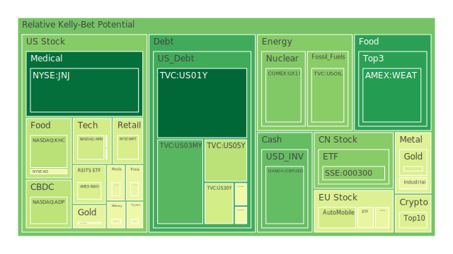
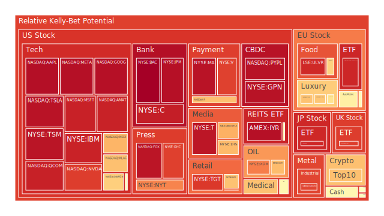
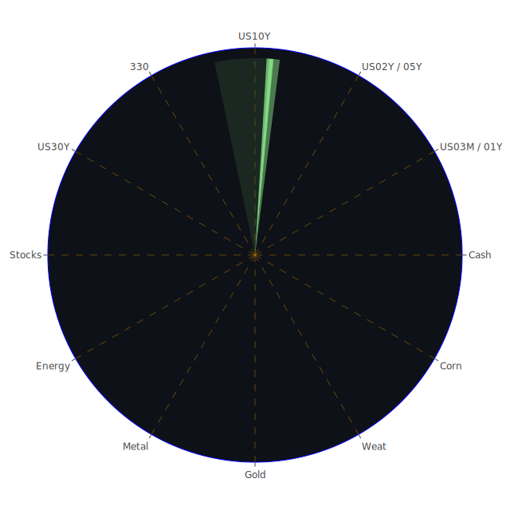

# 投資商品泡沫分析

## 美國國債

近期，美國國債的收益率呈現出穩定上升的趨勢。其中，1年期、2年期、5年期和10年期國債收益率分別達到4.25%、4.33%、4.43%和4.58%。從泡沫指數觀察，D1、D7、D14和D30均顯示出較高的風險分數，尤其是30年期國債的D1值達到0.407946。

**經濟學角度**，美國國債收益率上升通常反映投資者對未來通貨膨脹的預期增強，以及對美聯儲可能採取緊縮貨幣政策的預期。高收益率可能導致資金從風險資產流向債券市場，削弱股市活力。

**社會學角度**，國債作為一種避險資產，當市場對未來經濟前景感到不確定時，會吸引大量投資者購買，推高價格並壓低收益率。然而，當收益率上升時，可能反映出市場對經濟的樂觀預期減弱。

**心理學角度**，投資者可能受到“羊群效應”的影響，隨著國債收益率上升，更多人可能選擇拋售國債，進一步推高收益率，形成自我實現的預言。

**博弈論角度**，各國央行和大型金融機構在國債市場上進行策略性配置，可能會影響收益率的走勢。他們的行動可能導致市場出現非預期的波動。

**歷史觀察**，在經濟周期的轉折點，國債收益率的變化常常預示著經濟的方向。例如，2008年金融危機前，國債收益率就出現異常波動。

## 美國零售股

美國零售股近期表現平穩，但泡沫風險指數顯示出一定的上升趨勢。以沃爾瑪（NYSE:WMT）為例，股價已達到92.68美元，D1值為0.414961，D30值達到0.833441。

**經濟學角度**，零售業的表現通常與消費者信心指數相關。近期，美國消費者信心有所下降，可能影響零售股的未來表現。

**社會學角度**，電子商務的持續興起對傳統零售業造成壓力，消費者購物習慣的改變可能導致零售股的長期價值受影響。

**心理學角度**，節假日期間的購物熱潮可能推高零售股的短期表現，但投資者需要警惕季節性因素帶來的波動。

**博弈論角度**，零售巨頭之間的價格戰和市場策略競爭，可能影響整個行業的盈利能力。

**歷史觀察**，過去經驗表明，經濟衰退期間，零售業首當其衝，因此需要關注宏觀經濟的變化。

## 美國科技股

美國科技股近期持續領漲市場。納斯達克指數（NASDAQ:NDX）達到21797.65點，D1值為0.694915。主要科技公司如微軟（NASDAQ:MSFT）和蘋果（NASDAQ:AAPL）的泡沫指數均超過0.9。

**經濟學角度**，科技股的高估值可能反映了市場對未來科技創新和盈利增長的高預期。然而過高的市盈率可能暗示著投資泡沫的風險。

**社會學角度**，疫情加速了數字化進程，推動了科技公司的快速發展，但隨著疫情影響減弱，這種增長可能放緩。

**心理學角度**，投資者可能存在“過度樂觀”偏誤，忽視了科技股可能面臨的風險。

**博弈論角度**，科技巨頭之間的競爭和併購活動可能改變市場格局，影響投資者的利益。

**歷史觀察**，參考2000年互聯網泡沫破裂，過度炒作的科技股可能面臨嚴重的調整風險。

## 美國房地產指數

美國房地產指數近期有所回升，VNQ的價格達到89.41美元，D1值為0.547866，D30值為0.639375。

**經濟學角度**，低利率環境通常促進房地產市場的繁榮，但隨著利率的上升，房地產市場可能遇冷。

**社會學角度**，遠程工作的普及可能影響商業地產的需求，同時增加對郊區住宅的需求。

**心理學角度**，投資者對房地產的情感依賴可能導致高估價值，忽視潛在風險。

**博弈論角度**，開發商與投資者之間的博弈可能影響房地產市場的供需平衡。

**歷史觀察**，2008年次貸危機的教訓提醒投資者需警惕房地產市場的過度槓桿。

## 加密貨幣

比特幣價格達到99616美元，D1值為0.648682。以太坊價格為3503.51美元，D1值為0.429804。

**經濟學角度**，加密貨幣缺乏內在價值支撐，價格波動劇烈，具有高度的投機性。

**社會學角度**，加密貨幣已成為年輕一代投資者的熱門選擇，反映出對傳統金融體系的信任缺失。

**心理學角度**，投資者容易受到“FOMO”（錯失恐懼症）的影響，追高買入，增加風險。

**博弈論角度**，市場莊家可能利用信息不對稱進行操縱，影響價格走勢。

**歷史觀察**，加密貨幣市場多次經歷大幅度的價格調整，投資者需謹慎對待。

## 金/銀/銅

黃金價格維持在2619.68美元，D1值為0.424115。白銀價格為29.69美元，D1值為0.867386。銅價格維持在4.1美元，D1值為0.46285。

**經濟學角度**，貴金屬通常作為避險資產，當經濟不確定性增加時，價格上漲。

**社會學角度**，黃金和白銀在文化中具有價值象徵，需求具有一定的剛性。

**心理學角度**，市場恐慌情緒可能推高貴金屬價格。

**博弈論角度**，主要產金國和大型投資機構的行動可能影響市場供需。

**歷史觀察**，貴金屬價格與通貨膨脹和美元指數呈負相關。

## 黃豆 / 小麥 / 玉米

黃豆和玉米價格有所上升。SOYB價格為20.76美元，D1值為0.510736。CORN價格為18.36美元，D1值為0.490427。

**經濟學角度**，農產品價格受供需關係影響，天氣、疫情等因素可能導致供給波動。

**社會學角度**，全球人口增長和飲食習慣的改變增加了對農產品的需求。

**心理學角度**，投資者可能因為食品安全問題而調整投資組合。

**博弈論角度**，主要農業國之間的貿易政策和關稅壁壘影響市場價格。

**歷史觀察**，歷次全球糧食危機均導致農產品價格飆升。

## 石油/ 鈾期貨UX!

石油價格回升至70.21美元，D1值為0.280744。鈾期貨價格達到71.4美元，D1值為0.26634。

**經濟學角度**，能源價格受供需和地緣政治影響，價格波動較大。

**社會學角度**，對新能源的需求增加可能影響傳統能源市場。

**心理學角度**，市場情緒對石油價格有顯著影響，投資者需警惕過度反應。

**博弈論角度**，產油國之間的協議和衝突對價格影響重大。

**歷史觀察**，歷次中東緊張局勢均導致石油價格大幅波動。

## 各國外匯市場

歐元兌美元匯率維持在1.04，D1值為0.516731。英鎊兌美元匯率為1.25，D1值為0.224992。

**經濟學角度**，匯率受貨幣政策、經濟增長和通貨膨脹等多種因素影響。

**社會學角度**，國際貿易和旅遊活動的變化影響外匯需求。

**心理學角度**，市場預期和投機活動可能導致匯率劇烈波動。

**博弈論角度**，各國央行之間的貨幣政策協調或競爭影響匯率走勢。

**歷史觀察**，重大經濟事件如金融危機會導致匯率大幅波動。

## 各國大盤指數

各國大盤指數表現不一。德國DAX指數達到20018.4點，D1值為0.921453。中國滬深300指數為3985.63點，D1值為0.276772。

**經濟學角度**，大盤指數反映了一國經濟的整體健康狀況。

**社會學角度**，社會穩定性和政策變化可能影響投資者信心。

**心理學角度**，投資者情緒和市場情緒指數對指數表現有重要影響。

**博弈論角度**，國際資本流動和跨國投資策略影響各國股市。

**歷史觀察**，全球性事件如疫情、戰爭對大盤指數產生重大影響。

## 美國半導體股

美國半導體股持續走高。AMD價格為126.29美元，D1值為0.402841。NVIDIA價格為140.22美元，D1值為0.879805。

**經濟學角度**，半導體需求持續增長，受益於人工智能和物聯網的發展。

**社會學角度**，科技產品在生活中的普及推動了半導體行業的發展。

**心理學角度**，投資者對科技創新的期待可能推高股價，但需警惕過度樂觀。

**博弈論角度**，美中科技戰可能影響全球供應鏈和市場份額。

**歷史觀察**，半導體週期性波動明顯，需注意市場供需變化。

## 美國銀行股

美國銀行股表現穩健。摩根大通（NYSE:JPM）價格為242.31美元，D1值為0.964961。美國銀行（NYSE:BAC）價格為44.38美元，D1值為0.997045。

**經濟學角度**，利率上升有助於銀行利差擴大，但可能增加壞賬風險。

**社會學角度**，金融科技的興起對傳統銀行業構成挑戰。

**心理學角度**，投資者對經濟前景的樂觀情緒支撐銀行股。

**博弈論角度**，銀行業的競爭和監管政策影響盈利能力。

**歷史觀察**，經濟衰退期間銀行股往往表現不佳，需關注宏觀經濟走勢。

## 美國軍工股

軍工股如洛克希德·馬丁（NYSE:LMT）價格為488.13美元，D1值為0.544944。

**經濟學角度**，國防預算增減直接影響軍工企業收入。

**社會學角度**，地緣政治緊張局勢提升了軍工產品需求。

**心理學角度**，安全感缺失可能推動投資者配置軍工股。

**博弈論角度**，國際軍備競賽和軍火交易影響市場格局。

**歷史觀察**，戰爭和衝突時期軍工股往往表現突出。

## 美國電子支付股

電子支付股如Paypal（NASDAQ:PYPL）價格為88.25美元，D1值為0.960135。Global Payments（NYSE:GPN）價格為112.98美元，D1值為0.959818。

**經濟學角度**，電子支付行業受益於數字化經濟增長。

**社會學角度**，消費者支付習慣的轉變推動行業發展。

**心理學角度**，疫情影響下無現金支付的需求增長。

**博弈論角度**，市場競爭激烈，併購活動頻繁。

**歷史觀察**，金融危機期間電子支付股受衝擊較小，具有一定防禦性。

## 美國藥商股

強生（NYSE:JNJ）價格為145.85美元，D1值為0.046723。默克公司（NYSE:MRK）價格為99.45美元，D1值為0.529167。

**經濟學角度**，藥品需求具有剛性，行業具備穩定的盈利能力。

**社會學角度**，人口老齡化和醫療需求增加推動行業增長。

**心理學角度**，投資者尋求穩定收益時，常青睞藥商股。

**博弈論角度**，藥品專利和研發競爭影響市場份額。

**歷史觀察**，醫藥行業在經濟低迷時期表現相對穩定。

## 美國影視股

奈飛（NASDAQ:NFLX）價格為932.12美元，D1值為0.702061。迪士尼（NYSE:DIS）價格為112.56美元，D1值為0.685531。

**經濟學角度**，流媒體市場競爭加劇，內容成本上升可能壓縮利潤。

**社會學角度**，觀眾觀影習慣的改變影響了傳統電視和影院行業。

**心理學角度**，消費者對娛樂內容的需求增長，但忠誠度可能下降。

**博弈論角度**，版權爭奪和市場佈局戰略決定了競爭優勢。

**歷史觀察**，科技進步對影視行業帶來巨大衝擊，需適應變化。

## 美國媒體股

時代公司（NYSE:NYT）價格為53.37美元，D1值為0.77079。康卡斯特（NASDAQ:CMCSA）價格為38.4美元，D1值為0.461576。

**經濟學角度**，廣告收入是媒體公司的主要收入來源，經濟下行時可能受影響。

**社會學角度**，數字媒體崛起對傳統媒體構成挑戰。

**心理學角度**，資訊過載時代，消費者注意力成為稀缺資源。

**博弈論角度**，內容質量和渠道佈局成為競爭焦點。

**歷史觀察**，媒體行業的變革速度加快，需適應新技術和模式。

## 石油防禦股

埃克森美孚（NYSE:XOM）價格為106.4美元，D1值為0.780445。西方石油（NYSE:OXY）價格為48.12美元，D1值為0.680028。

**經濟學角度**，石油價格波動直接影響企業盈利。

**社會學角度**，環保意識增強可能限制化石能源的發展。

**心理學角度**，市場對傳統能源的信心可能減弱。

**博弈論角度**，國際能源市場的競爭和協作影響企業戰略。

**歷史觀察**，能源轉型對傳統石油企業構成挑戰。

## 金礦防禦股

皇家黃金（NASDAQ:RGLD）價格為133.32美元，D1值為0.45232。

**經濟學角度**，金價上升有利於金礦企業的盈利。

**社會學角度**，避險需求增加時，金礦股受到青睞。

**心理學角度**，投資者對經濟前景悲觀時，可能加大對金礦股的投資。

**博弈論角度**，金礦資源的開發和併購活動影響市場格局。

**歷史觀察**，金融危機期間金礦股表現突出。

## 歐洲奢侈品股

LVMH（EURONEXT:MC）價格為630.8歐元，D1值為0.603109。開雲集團（EURONEXT:KER）價格為234.2歐元，D1值為0.669533。

**經濟學角度**，奢侈品需求對經濟周期敏感，但具有一定的抗周期性。

**社會學角度**，新興市場的富裕階層崛起推動奢侈品市場增長。

**心理學角度**，消費者對品牌的忠誠度和身份認同感影響購買行為。

**博弈論角度**，品牌之間的競爭和併購影響市場份額。

**歷史觀察**，經濟衰退期間奢侈品銷售可能下滑。

## 歐洲汽車股

BMW（XETR:BMW）價格為76.94歐元，D1值為0.408614。戴姆勒（XETR:MBG）價格為52.72歐元，D1值為0.567076。

**經濟學角度**，汽車行業受宏觀經濟和消費者信心水平影響。

**社會學角度**，環保政策和新能源車趨勢影響傳統汽車企業。

**心理學角度**，消費者對品牌的偏好和時尚潮流影響銷售。

**博弈論角度**，全球市場佈局和技術研發競爭激烈。

**歷史觀察**，經濟危機時期汽車銷量下滑明顯。

## 歐美食品股

雀巢（SIX:NESN）價格為74.08瑞士法郎，D1值為0.639461。聯合利華（LSE:ULVR）價格為4563英鎊，D1值為0.915361。

**經濟學角度**，食品需求相對穩定，企業具備防禦性。

**社會學角度**，健康飲食和可持續發展趨勢影響產品策略。

**心理學角度**，品牌信任度和產品品質影響消費者選擇。

**博弈論角度**，企業之間的市場佔有率競爭和產品創新是關鍵。

**歷史觀察**，經濟波動對食品企業影響相對較小。

# 宏觀經濟傳導路徑分析

全球經濟環境充滿不確定性，美聯儲貨幣政策、市場利率、通貨膨脹以及地緣政治因素共同影響資產價格。高企的國債收益率可能導致資金從股票市場流出，壓低股價。而加密貨幣市場的波動可能影響投資者對風險資產的偏好。

# 微觀經濟傳導路徑分析

企業盈利能力、市場競爭、技術創新和消費者行為直接影響行業和個股表現。科技企業的創新能力和市場佔有率決定其股價走勢。零售和食品行業需關注消費者需求的變化。

# 資產類別間傳導路徑分析

資產之間存在漣漪效應。國債收益率上升可能導致股票和房地產市場承壓。能源價格變動影響相關行業的盈利。貨幣市場的波動可能引發資本在不同資產之間的重新配置。

# 投資建議

## 穩健型配置（40%）

1. **美國國債**：20%
2. **歐美食品股（雀巢、聯合利華）**：10%
3. **美國藥商股（強生、默克）**：10%

## 成長型配置（35%）

1. **美國科技股（微軟、蘋果）**：15%
2. **美國半導體股（AMD、NVIDIA）**：10%
3. **新能源相關股票**：10%

## 高風險型配置（25%）

1. **加密貨幣（比特幣、以太坊）**：10%
2. **新興市場股票**：10%
3. **貴金屬（黃金、白銀）**：5%

# 風險提示

投資有風險，市場總是充滿不確定性。我們的建議僅供參考，投資者應根據自身的風險承受能力和投資目標，做出獨立的投資決策。
 
Daily Buy Map:

 
Daily Sell Map:

 
Daily Radar Chart:

 
