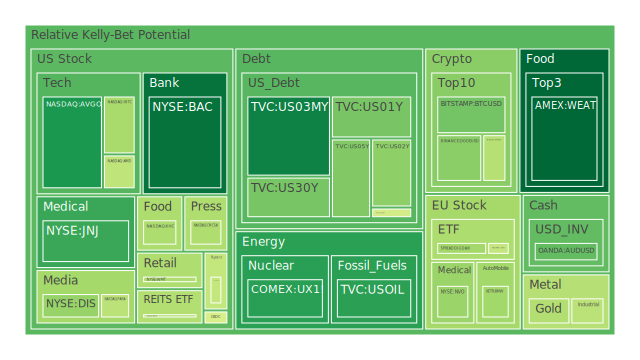
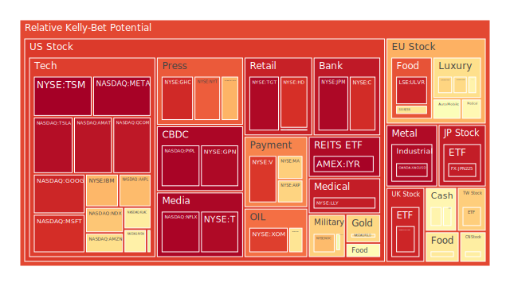
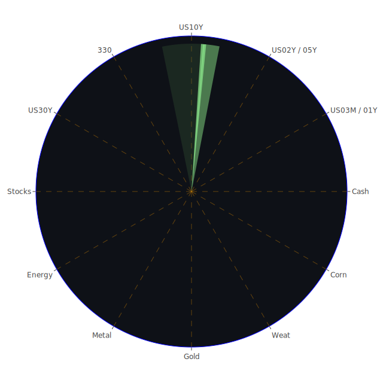

# 投資商品泡沫分析

## 美國國債

近期，美國國債市場呈現出一定的泡沫風險。根據資料，1年期國債（TVC:US01Y）的泡沫指數D1為0.033419，但D14和D30分別上升至0.238378和0.255789，顯示短期風險較低，但中長期風險正在累積。10年期國債（TVC:US10Y）的D1為0.481763，D30為0.527259，風險指數較高。

**經濟學觀點**：美國經濟數據顯示，雖然通脹有放緩跡象，但美聯儲可能維持高利率政策，導致國債收益率上升，價格下跌的風險增加。

**社會學觀點**：社會對未來經濟的不確定性增加，投資者可能傾向避險資產，但過度需求可能推高國債價格，形成泡沫。

**心理學觀點**：投資者的「追漲」心理可能導致國債需求過熱，忽視潛在風險。

**博弈論觀點**：市場參與者預期他人會持續購買國債，導致價格上漲，但一旦預期反轉，可能引發拋售。

## 美國零售股

以沃爾瑪（NYSE:WMT）為代表的美國零售股，泡沫指數D1為0.414961，D30上升至0.833441，顯示風險逐漸增加。

**歷史參考**：2020年疫情期間，零售股曾因線上銷售激增而大幅上漲，但隨著經濟重開，增長放緩。

**心理學觀點**：假期季節的消費熱潮可能導致投資者過於樂觀，忽視長期挑戰。

**經濟學觀點**：通脹壓力可能削弱消費者購買力，對零售業績造成壓力。

## 美國科技股

科技股如微軟（NASDAQ:MSFT），其泡沫指數D1為0.930543，顯示出高度的泡沫風險。蘋果（NASDAQ:AAPL）的D1更高達0.967337。

**歷史參考**：類似2000年的科技股泡沫，過度的市場樂觀可能導致估值過高。

**心理學觀點**：投資者對科技創新的期待，可能導致過度追捧科技股。

**博弈論觀點**：市場參與者可能認為科技股是「不能錯過」的投資，導致價格持續上漲，但風險積累。

## 美國房地產指數

房地產ETF（AMEX:RWO）的泡沫指數D1為0.422161，D30上升至0.470420。

**經濟學觀點**：高利率環境下，房地產需求可能受抑，價格可能調整。

**心理學觀點**：對房地產作為抗通脹資產的迷思，可能導致過度投資。

**歷史參考**：2008年房地產泡沫破裂的教訓值得警惕。

## 加密貨幣

比特幣（BITSTAMP:BTCUSD）泡沫指數D1在0.661850，D30達到0.823061，以太坊（BINANCE:ETHUSD）D1為0.406355，顯示加密貨幣市場存在較高風險。

**心理學觀點**：投資者的「恐失症」（FOMO）可能推高價格。

**社會學觀點**：對去中心化金融的熱情可能被過度放大。

**博弈論觀點**：市場缺乏監管，資訊不對稱，風險難以評估。

## 金/銀/銅

黃金（OANDA:XAUUSD）泡沫指數D1為0.421076，白銀（OANDA:XAGUSD）達到0.873378。

**經濟學觀點**：在經濟不確定性下，避險需求增加，但過度需求可能導致價格偏離基本面。

**歷史參考**：金銀價格曾在經濟危機時大幅波動。

**心理學觀點**：投資者對避險資產的盲目追捧可能引發泡沫。

## 黃豆 / 小麥 / 玉米

玉米ETF（AMEX:CORN）的D1為0.490427，D30上升至0.687814，風險較高。

**經濟學觀點**：農產品價格受天氣、供需等因素影響，價格波動較大。

**社會學觀點**：全球人口增長和氣候變化可能影響供應。

**博弈論觀點**：投機資金的流入可能加劇價格波動。

## 石油/ 鈾期貨

原油（TVC:USOIL）的D1為0.012518，風險較低，但D30上升至0.194533。鈾期貨（COMEX:UX1!）的D1為0.266340。

**經濟學觀點**：全球經濟活動的恢復可能推動能源需求，但地緣政治風險可能影響供應。

**歷史參考**：石油市場受OPEC政策影響較大。

**博弈論觀點**：市場預期和實際供需可能出現差異，導致價格波動。

## 各國外匯市場

美元對日圓（OANDA:USDJPY）的D1為0.562553，風險中等。英鎊對美元（OANDA:GBPUSD）D1為0.157694，D30上升至0.406740。

**經濟學觀點**：各國貨幣政策差異可能導致匯率波動。

**心理學觀點**：市場情緒和避險需求影響匯率走勢。

**博弈論觀點**：央行干預和投資者預期可能影響匯市。

## 各國大盤指數

納斯達克100指數（NASDAQ:NDX）的D1為0.694915，D30為0.736512，風險較高。德國DAX指數（SPREADEX:GDAXI）的D1為0.921453。

**經濟學觀點**：全球經濟放緩風險可能導致股市調整。

**社會學觀點**：投資者對未來經濟的不確定性增加，可能導致市場波動。

**博弈論觀點**：指數基金的被動投資可能加劇市場漣漪效應。

## 美國半導體股

英特爾（NASDAQ:INTC）的D1為0.495135，D30為0.628526，風險上升。輝達（NASDAQ:NVDA）的D1為0.879805。

**經濟學觀點**：全球芯片短缺可能推高半導體公司營收，但供應鏈風險依然存在。

**歷史參考**：科技週期的波動對半導體行業影響較大。

**心理學觀點**：對人工智能和自動化的熱情可能導致高估。

## 美國銀行股

摩根大通（NYSE:JPM）的D1為0.964961，風險極高。美國銀行（NYSE:BAC）的D1為0.997045。

**經濟學觀點**：高利率環境可能提升銀行利差收入，但經濟放緩風險影響貸款質量。

**歷史參考**：2008年金融危機對銀行業的衝擊仍記憶猶新。

**博弈論觀點**：銀行之間的競爭可能導致風險承擔增加。

## 美國軍工股

洛克希德·馬丁（NYSE:LMT）的D1為0.544944，風險中等。

**經濟學觀點**：國防預算的增加可能利好軍工股，但政治風險需關注。

**歷史參考**：地緣政治衝突往往推高軍工股價。

**心理學觀點**：投資者對安全需求的關注可能提高軍工股的吸引力。

## 美國電子支付股

維薩（NYSE:V）的D1為0.874255，萬事達（NYSE:MA）為0.958636，風險較高。

**經濟學觀點**：電子支付市場競爭加劇，利潤空間可能被擠壓。

**社會學觀點**：消費習慣的改變推動無現金支付，但市場飽和風險增加。

**博弈論觀點**：新進入者和技術革新可能改變競爭格局。

## 美國藥商股

默克（NYSE:MRK）的D1為0.529167，禮來（NYSE:LLY）為0.669350。

**經濟學觀點**：醫療需求持續增長，但研發成本高企，盈利能力受挑戰。

**歷史參考**：專利到期可能影響藥企收入。

**心理學觀點**：疫情影響下，市場對醫藥股的期待增加。

## 美國媒體股

彭博（NASDAQ:BLOOMBERG）的相關數據未提供，但福克斯（NASDAQ:FOX）的D1為0.953922。

**經濟學觀點**：廣告收入受到經濟週期影響。

**社會學觀點**：媒體消費習慣的改變，流媒體興起對傳統媒體構成挑戰。

**博弈論觀點**：內容競爭加劇，版權爭奪激烈。

## 石油防禦股

埃克森美孚（NYSE:XOM）的D1為0.783399。

**經濟學觀點**：能源需求波動，油價不穩定性對公司業績有直接影響。

**歷史參考**：過去油價暴跌對石油公司造成重大損失。

**心理學觀點**：投資者對新能源的期待可能降低對傳統能源股的興趣。

## 金礦防禦股

皇家黃金（NASDAQ:RGLD）的D1為0.452351。

**經濟學觀點**：金價上漲可能提高金礦企業盈利，但開採成本和環保壓力需考慮。

**歷史參考**：金礦股在經濟危機時期往往表現優異。

**博弈論觀點**：市場對黃金的需求變化直接影響金礦股價。

## 歐洲奢侈品股

路威酩軒（EURONEXT:MC）的D1為0.603109，愛馬仕（EURONEXT:RMS）為0.661163。

**經濟學觀點**：高淨值人群的消費能力保持強勁，但經濟放緩可能影響奢侈品銷售。

**社會學觀點**：新興市場的富裕階層崛起，帶來新的消費需求。

**博弈論觀點**：品牌競爭和市場飽和度需關注。

## 歐洲汽車股

寶馬（XETR:BMW）的D1為0.408614，梅賽德斯-賓士（XETR:MBG）為0.567076。

**經濟學觀點**：電動化轉型需要大量投入，傳統汽車製造商面臨挑戰。

**歷史參考**：汽車行業受經濟週期影響明顯。

**社會學觀點**：環保意識提高，消費者偏好變化。

## 歐美食品股

雀巢（SIX:NESN）的D1為0.639461。

**經濟學觀點**：必需消費品有一定抗週期性，但成本上升可能壓縮利潤。

**社會學觀點**：健康飲食趨勢可能影響傳統食品企業。

**博弈論觀點**：市場競爭激烈，新產品開發和市場佔有是關鍵。

# 宏觀經濟傳導路徑分析

全球經濟正處於複雜的宏觀環境中。美聯儲維持高利率政策，導致全球資本流動方向發生變化。美元強勢可能引發其他國家資本外流，影響全球資產價格。

同時，地緣政治風險升溫，如中東地區的緊張局勢，加劇了市場的不確定性。這些因素可能通過影響投資者信心和資金流動，傳導至各國金融市場。

# 微觀經濟傳導路徑分析

在微觀層面，企業盈利能力受成本上升和需求變化的影響。供應鏈問題仍然存在，特別是在科技和製造業。消費者行為的轉變，如線上購物的普及，正在重塑零售和物流行業。

企業間的競爭加劇，新技術的應用對傳統行業形成衝擊。這些微觀層面的變化會影響到企業股價和行業表現。

# 資產類別間傳導路徑分析

不同資產類別之間存在複雜的關聯性。例如，當股票市場波動加劇時，投資者可能轉向債券和黃金等避險資產，推高其價格。匯率變動也會影響跨國企業的盈利和進出口貿易。

此外，加密貨幣市場的波動可能影響投資者的風險偏好，進而影響傳統金融市場。資產之間的漣漪效應需要投資者密切關注。

# 投資建議

**穩健型配置（50%）**：

1. **黃金（20%）**：作為傳統的避險資產，黃金在經濟不確定性時期具有保值作用。
2. **高評級債券（20%）**：選擇投資級別較高的國債或企業債，獲取穩定收益。
3. **必需消費品股票（10%）**：如食品和醫藥行業，具有抗經濟週期性。

**成長型配置（30%）**：

1. **科技股（15%）**：關注具有創新能力的科技公司，長期增長潛力大。
2. **新能源股票（10%）**：隨著全球碳中和目標的推進，新能源行業前景廣闊。
3. **新興市場股票（5%）**：人口和經濟增長快，有潛在的投資機會。

**高風險型配置（20%）**：

1. **加密貨幣（10%）**：市場波動大，適合風險承受能力高的投資者。
2. **小型科技創業公司股票（5%）**：可能帶來高回報，但風險也大。
3. **商品期貨（5%）**：如原油、農產品等，價格受多種因素影響，波動較大。

# 風險提示

投資有風險，市場總是充滿不確定性。我們的建議僅供參考，投資者應根據自身的風險承受能力和投資目標，做出獨立的投資決策。

**特別提醒**：目前市場存在較高的泡沫風險，特別是在科技股、加密貨幣等領域。投資者應謹慎評估資產的內在價值，避免盲目跟風投資。
 
Daily Buy Map:

 
Daily Sell Map:

 
Daily Radar Chart:

 
