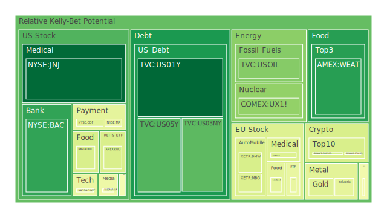
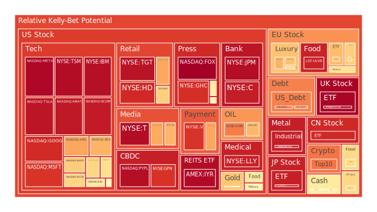
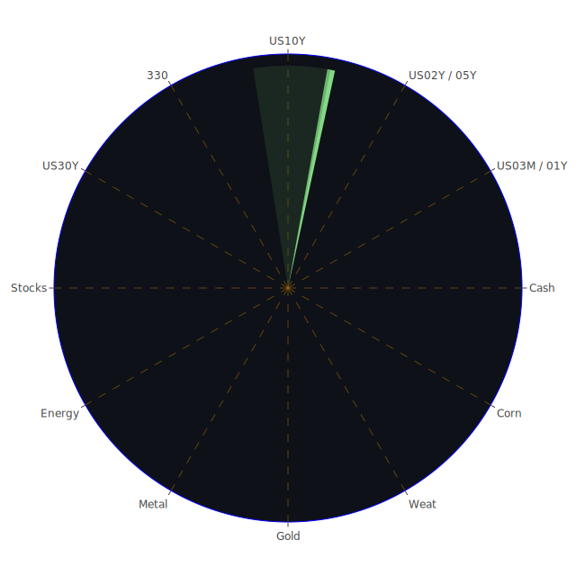

# 投資商品泡沫分析

## 美國國債

目前，美國國債利率呈現微幅波動。根據資料，10年期國債收益率（US10Y）為4.63%，較上週的4.52%有所上升。這反映了市場對未來經濟不確定性的擔憂。同時，短期國債收益率如3個月期（US03M）和2年期（US02Y）也出現上升，分別為4.30%和4.33%。收益率曲線的走勢顯示出投資人對短期風險的預期上升。

從歷史角度看，美國國債一直被視為避險資產。然而，近期利率的上升可能導致國債價格下跌，投資人需警惕這一風險。在經濟學上，利率上升可能代表通貨膨脹的壓力增大，中央銀行可能採取緊縮的貨幣政策。

## 美國零售股

美國零售股，如沃爾瑪（WMT）和目標公司（TGT），近期表現出現波動。沃爾瑪的價格為92.68美元，泡沫指數D1為0.414961，顯示出一定的風險。消費者信心指數下降，可能影響零售業績。同時，電子商務的競爭加劇，也對傳統零售商造成壓力。

從社會學角度，消費者行為的改變，尤其是年輕一代更傾向於線上購物，對零售股形成挑戰。歷史上，零售業需要不斷轉型以適應市場變化，如當年亞馬遜的崛起。

## 美國科技股

科技股如蘋果（AAPL）、微軟（MSFT）和英偉達（NVDA）等，近期股價達到歷史高位。然而，泡沫指數顯示風險增加。例如，AAPL的D1為0.967337，接近1，意味著泡沫風險高度集中。

心理學上，投資者可能出現過度樂觀的情緒，導致市場泡沫。歷史上，科技股的泡沫風險在2000年的科技股泡沫中得以體現，投資人需謹慎。

## 美國房地產指數

房地產投資信託基金（REIT）如VNQ和IYR的泡沫指數均較高，IYR的D1為0.964853。房地產市場受利率影響較大，目前利率上升可能抑制房地產投資。

經濟學上，利率上升會增加購房成本，抑制需求。歷史上，2008年的房地產泡沫破滅就是一個典型案例，投資人需警惕市場風險。

## 加密貨幣

比特幣（BTCUSD）價格接近100,000美元，ETH也達到3,500美元左右。泡沫指數顯示，加密貨幣市場風險較高，BTCUSD的D1為0.648682。

從博弈論角度，加密貨幣市場存在高度投機性，價格波動劇烈。歷史上，加密貨幣多次經歷大幅漲跌，投資者應謹慎對待。

## 金/銀/銅

黃金（XAUUSD）價格上升至2,619美元，銀（XAGUSD）價格也呈現上升。金銀比率（GOLD SILVER RATIO）顯示，貴金屬市場有避險需求。

經濟不確定性增加時，投資者往往轉向貴金屬避險。從歷史角度，2008年金融危機期間，貴金屬價格也出現上漲。

## 黃豆 / 小麥 / 玉米

農產品價格近期有所上漲。黃豆（SOYB）、小麥（WEAT）和玉米（CORN）的泡沫指數均有提高。

氣候變化和地緣政治因素可能影響農產品供應，導致價格波動。歷史上，供需失衡對農產品價格影響顯著。

## 石油/ 鈾期貨UX!

石油價格穩定在70美元左右，泡沫指數中等。鈾期貨（UX1!）價格為71美元，D1為0.266340。

能源市場受地緣政治影響明顯。近期新聞指出，中東緊張局勢升溫，可能影響能源供應。

## 各國外匯市場

美元指數走強，美元對日元（USDJPY）達到157.08。美元走強可能受美國經濟數據和利率政策影響。

從博弈論角度，外匯市場是各國經濟博弈的反映。投資者需關注各國貨幣政策和經濟數據。

## 各國大盤指數

美國NASDAQ指數（NDX）達到21,826點，泡沫指數較高。歐洲股市如德國DAX指數（GDAXI）也處於高位。

股市的高估值可能隱含風險。歷史上，高估值往往預示著市場調整的可能。

## 美國半導體股

半導體股如英特爾（INTC）、AMD、輝達（NVDA）等近期表現強勁。然而，泡沫指數顯示風險增加，NVDA的D1達到0.879805。

供應鏈的瓶頸和市場需求的不確定性可能影響半導體行業。投資者需關注技術發展和市場需求。

## 美國銀行股

銀行股如摩根大通（JPM）、美國銀行（BAC）等近期股價上漲。BAC的D1為0.997045，風險較高。

利率上升對銀行利潤有正面影響，但經濟下行風險可能導致貸款壞賬增加。

## 美國軍工股

軍工股如洛克希德·馬丁（LMT）、諾斯洛普·格魯門（NOC）等受地緣政治影響。

近期，中東局勢緊張可能帶動軍工股需求。然而，高估值需要謹慎對待。

## 美國電子支付股

支付公司如Visa（V）、萬事達（MA）等，泡沫指數較高，V的D1為0.874255。

電子支付市場競爭激烈，技術革新可能帶來機遇和挑戰。

## 美國藥商股

制藥公司如默克（MRK）、強生（JNJ）等，泡沫風險相對較低。

醫藥行業受政策和研發進展影響，投資者需關注相關動態。

## 美國影視股

影視公司如Netflix（NFLX），近期訂閱數增長放緩，泡沫指數升高，NFLX的D1為0.963564。

市場競爭加劇，內容製作成本上升，可能影響盈利能力。

## 美國媒體股

媒體公司如迪士尼（DIS），受到消費者行為改變的影響。

串流媒體的崛起對傳統媒體形成挑戰，需適應市場變化。

## 石油防禦股

能源防禦性股票，如埃克森美孚（XOM），泡沫指數高企，XOM的D1為0.780445。

能源轉型和政策因素可能影響傳統能源公司。

## 金礦防禦股

金礦公司如Royal Gold（RGLD），在貴金屬價格上升時受益。

避險需求增加可能推動金礦股價上漲。

## 歐洲奢侈品股

奢侈品公司如LVMH（MC）、開雲集團（KER），泡沫指數較高。

消費者需求和經濟不確定性可能影響奢侈品市場。

## 歐洲汽車股

汽車公司如BMW、戴姆勒（MBG），面臨新能源轉型挑戰。

政策和技術變革可能帶來風險和機遇。

## 歐美食品股

食品公司如雀巢（NESN），受原材料價格和消費者偏好影響。

健康食品趨勢可能影響傳統食品公司的市場份額。

# 宏觀經濟傳導路徑分析

全球經濟面臨不確定性，通貨膨脹壓力上升，主要央行收緊貨幣政策。利率上升影響債券、市場估值和消費者支出。

地緣政治風險，如中東局勢緊張，影響能源價格，進而影響全球供應鏈和通脹。

# 微觀經濟傳導路徑分析

企業收益受到成本上升和需求波動的影響。供應鏈瓶頸可能導致生產成本增加，壓縮利潤。

消費者行為的改變，如線上購物的增長，影響零售和物流行業。

# 資產類別間傳導路徑分析

股票市場的高估值可能導致資金轉向債券和貴金屬等避險資產。

外匯市場波動可能影響進出口企業的收益。

能源價格的變化影響相關行業，如航空、運輸和化工。

# 投資建議

根據以上分析，提出以下三種配置：

## 穩健型（40%）

- **黃金（XAUUSD）**：15%
- **美國國債（US10Y）**：15%
- **醫藥股（JNJ、MRK）**：10%

## 成長型（35%）

- **科技股（AAPL、MSFT）**：15%
- **半導體股（NVDA、AMD）**：10%
- **新能源股（TSLA）**：10%

## 高風險型（25%）

- **加密貨幣（BTCUSD、ETHUSD）**：10%
- **新興市場股票**：10%
- **農產品期貨（CORN、WEAT）**：5%

# 風險提示

投資有風險，市場總是充滿不確定性。我們的建議僅供參考，投資者應根據自身的風險承受能力和投資目標，做出獨立的投資決策。

請特別關注市場可能存在的泡沫風險，高估值資產可能面臨較大的回調壓力。地緣政治風險和經濟政策變化可能對市場產生重大影響，需密切關注相關動態。
 
Daily Buy Map:

 
Daily Sell Map:

 
Daily Radar Chart:

 
