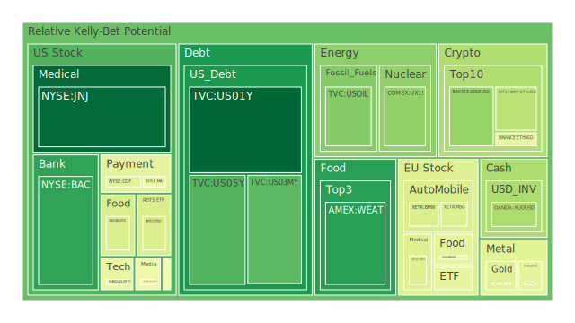
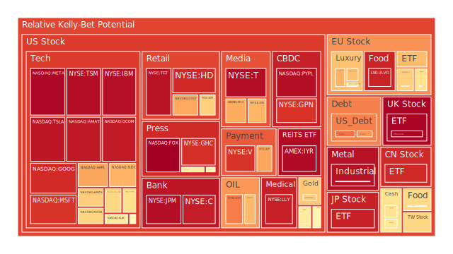
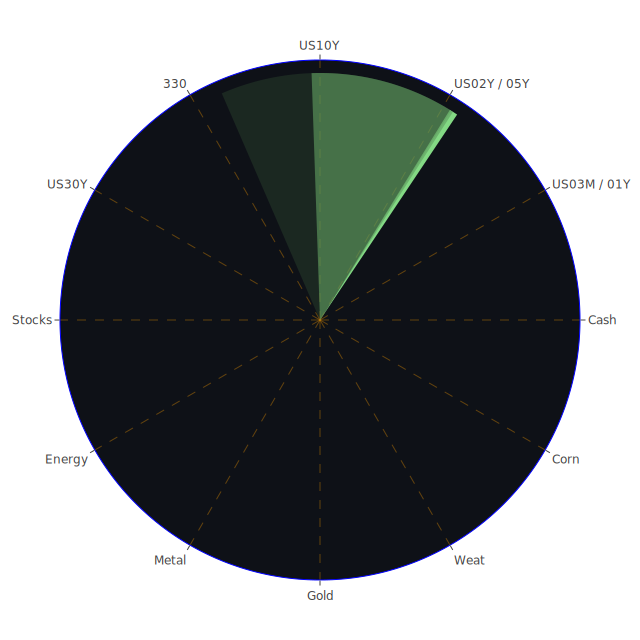

# 投資商品泡沫分析

# 美國國債

近期，美國國債收益率呈現波動趨勢。10年期國債收益率在4.63%，較去年同期的3.75%有所上升。這反映了投資者對未來經濟增長和通貨膨脹的預期。在歷史上，當經濟展望不確定時，國債通常被視為安全避風港。然而，隨著聯邦儲備局可能調整利率政策，國債價格可能面臨壓力。

從經濟學角度來看，利率上升會導致國債價格下跌，投資者需求減弱。然而，社會學和心理學因素，如市場情緒和投資者信心，也會影響國債的需求。近期新聞顯示，市場對於經濟衰退的擔憂有所增加，可能推動國債需求上升。

# 美國零售股

美國零售股近期受到消費者信心指數波動的影響。儘管假日季節銷售額增加了3.8%，但通貨膨脹和供應鏈問題可能對零售業造成壓力。歷史上，在經濟不確定時期，零售業往往受到影響，特別是非必需消費品。

心理學上，消費者行為的轉變可能導致零售商收入波動。博弈論角度，零售商需要制定策略以吸引消費者，應對競爭。近期新聞報導指出，線上購物增長，這對傳統零售商構成挑戰。

# 美國科技股

科技股一直是市場的焦點。近期，由於利率上升預期，科技股出現調整。然而，科技行業的長期增長前景仍被看好。類似於2000年的網路泡沫時期，投資者需要警惕過高的估值和市場過熱的風險。

經濟學上，科技公司的高估值需要由未來的盈利增長來支撐。心理學上，投資者對於科技創新的熱情可能導致價格偏離基本面。近期新聞顯示，人工智慧和區塊鏈等新技術引發市場關注，但投資者需謹慎評估風險。

# 美國房地產指數

美國房地產市場近期顯示出放緩跡象。30年定息房貸利率上升至6.85%，為今年7月以來的最高水平。高利率可能抑制購房需求，導致房價增長放緩。歷史上，利率上升通常會導致房地產市場降溫。

從社會學角度，住房可負擔性問題可能加劇社會不平等。心理學上，購房者的信心和預期會影響市場需求。新聞報導指出，新的抵押貸款規定和經濟不確定性可能影響房地產市場的前景。

# 加密貨幣

比特幣價格近期接近95,000美元，但漲勢有所放緩。與2021年的加密貨幣熱潮類似，市場對於監管和安全問題的擔憂加劇。近期新聞報導，包括比特幣在內的加密貨幣市場面臨監管風險和技術漏洞。

經濟學上，加密貨幣缺乏內在價值，價格主要由供求關係和市場情緒決定。心理學上，投資者的投機行為可能導致價格劇烈波動。投資者需要警惕市場泡沫風險。

# 金/銀/銅

黃金價格受避險需求推動，近期有所上升。黃金與石油和銅的價格比率顯示出市場對經濟前景的擔憂。歷史上，當經濟不穩定時，貴金屬通常成為投資者的避風港。

從經濟學角度，通貨膨脹預期上升會提高黃金需求。社會學上，文化和傳統對貴金屬的需求也有影響。新聞報導指出，地緣政治風險和貨幣政策的不確定性可能推動黃金價格上漲。

# 黃豆 / 小麥 / 玉米

農產品價格近期受天氣和全球供需關係影響。黃豆價格在輕量交易中上漲，受天氣因素影響。歷史上，氣候變化和農業政策對農產品價格有重大影響。

經濟學上，供應短缺和需求增長會推動價格上漲。博弈論角度，各國在糧食貿易中的策略和政策會影響全球市場。新聞報導指出，全球氣候變化帶來的農業挑戰可能影響未來的供應。

# 石油/ 鈾期貨

油價近期在年末交易中小幅上漲，但全年呈現波動。地緣政治風險和供需平衡是影響油價的主要因素。歷史上，中東地區的衝突常常影響石油供應，導致價格波動。

經濟學上，全球經濟增長放緩可能抑制對石油的需求。心理學上，市場情緒和預期會加劇價格波動。新聞報導中，對2025年的潛在供應風險引發市場關注。

# 各國外匯市場

美元近期走強，特別是對日元，達到五個月高位。這反映了市場對美國經濟增長和通貨膨脹的預期。歷史上，貨幣政策和經濟基本面是影響匯率的主要因素。

經濟學上，利率差異和購買力平價理論解釋了匯率走勢。博弈論角度，國家之間的貨幣政策博弈會影響匯率。新聞報導中，市場預期美國新政府的政策可能推動美元進一步上漲。

# 各國大盤指數

全球股市在年底呈現混合走勢。美國股市因科技股下跌而受挫，而歐洲市場受到地緣政治風險的影響。歷史上，年末時期市場交易量較低，波動性可能增加。

從社會學角度，投資者的集體行為和情緒對市場影響重大。心理學上，損失厭惡和跟風效應可能導致市場過度反應。新聞報導指出，投資者對於新一年的經濟前景持謹慎態度。

# 美國半導體股

半導體行業受益於科技發展和需求增長，但近期也面臨供應鏈挑戰。類似於過去的科技周期，行業可能存在過熱風險。

經濟學上，供需不平衡和研發成本是關鍵因素。博弈論角度，企業之間的競爭和合作決定了市場格局。新聞報導中，對於人工智慧和物聯網的需求增長可能推動半導體行業發展。

# 美國銀行股

銀行股受到利率變動和經濟前景的影響。利率上升通常有利於銀行利差收入的增加。然而，經濟不確定性可能導致貸款需求下降和壞賬增加。

經濟學上，貨幣政策和銀行業監管是重要因素。社會學上，消費者信心和企業投資意願影響銀行業務。新聞報導指出，監管政策的變化可能影響銀行的盈利能力。

# 美國軍工股

地緣政治緊張局勢加劇可能推動軍工股上漲。歷史上，戰爭和國防支出增加時，軍工行業表現突出。

經濟學上，政府支出對軍工企業的影響巨大。博弈論角度，國際關係和軍備競賽決定了行業需求。新聞報導中，中東地區的衝突和國際關係緊張可能影響軍工股走勢。

# 美國電子支付股

隨著電子商務的發展，電子支付行業持續增長。然而，競爭加劇和監管風險也是需要關注的問題。

經濟學上，網絡效應和規模經濟是行業的關鍵。心理學上，消費者對新技術的接受程度影響市場份額。新聞報導指出，技術創新和安全問題可能影響電子支付公司的發展。

# 美國藥商股

醫藥行業受政策、研發進展和市場需求影響。近期，對新藥研發的投資和疫苗需求可能推動行業增長。

經濟學上，高研發成本和市場準入是挑戰。社會學上，人口老齡化和健康意識提高增加了醫療需求。新聞報導中，政策變化和藥品價格監管可能影響藥商的盈利。

# 美國影視股

流媒體的興起改變了傳統影視行業的生態。歷史上，技術變革對媒體行業有深遠影響。

經濟學上，內容製作成本和版權收益是關鍵。心理學上，觀眾偏好和消費習慣的轉變需要關注。新聞報導中，新平台的競爭和市場份額的變化可能影響影視公司的表現。

# 美國媒體股

媒體行業面臨數位化轉型的挑戰。廣告收入和訂閱模式的轉變影響公司營收。

經濟學上，數位廣告市場競爭激烈。社會學上，資訊獲取方式的多元化影響媒體消費。新聞報導指出，媒體整合和併購可能改變行業格局。

# 石油防禦股

地緣政治風險和能源政策影響石油防禦股的表現。能源轉型和環保政策可能對行業帶來挑戰。

經濟學上，供需平衡和油價波動是關鍵。博弈論角度，企業需制定策略應對市場變化。新聞報導中，對於未來能源需求的預期和政策變化需要關注。

# 金礦防禦股

金礦公司收益與金價高度相關。市場避險需求增加時，金礦股可能受益。

經濟學上，開採成本和市場價格決定盈利能力。心理學上，投資者對避險資產的偏好影響需求。新聞報導指出，全球經濟不確定性可能推動金礦股上漲。

# 歐洲奢侈品股

奢侈品行業受全球經濟和消費者需求影響。亞洲市場的需求特別重要。

經濟學上，收入水平和匯率變動影響銷售。社會學上，文化和時尚趨勢影響消費行為。新聞報導中，中國市場的消費趨勢和旅遊限制可能對行業產生影響。

# 歐洲汽車股

汽車行業面臨電動化和自動化的挑戰。政策支持和技術研發是關鍵。

經濟學上，生產成本和市場需求決定盈利。博弈論角度，企業間的合作和競爭影響市場份額。新聞報導指出，環保政策和消費者偏好轉變可能影響汽車股。

# 歐美食品股

食品行業相對穩健，但也受原材料成本和消費趨勢影響。

經濟學上，供應鏈管理和成本控制是關鍵。社會學上，健康意識和飲食習慣變化影響需求。新聞報導中，食品安全和環保問題需要關注。

# 宏觀經濟傳導路徑分析

全球經濟正處於轉型期，通貨膨脹、利率政策和地緣政治因素共同影響市場走向。聯邦儲備局的政策調整對全球資金流向有重要影響。利率上升可能導致資金從高風險資產轉向債券市場，從而影響股票和其他風險資產的價格。

地緣政治緊張局勢，如中東衝突，可能推動能源價格上漲，進一步加劇通貨膨脹壓力。全球供應鏈問題和貿易政策變化也影響著各國經濟。

# 微觀經濟傳導路徑分析

企業層面，生產成本的上升可能壓縮利潤率。勞動力市場緊張和原材料價格上漲給企業帶來挑戰。消費者的購買力和消費信心影響企業的銷售和收入。

科技創新和市場競爭加劇，企業需要適應數位化和新技術帶來的變化。企業間的併購和合作可能改變行業結構和競爭格局。

# 資產類別間傳導路徑分析

不同資產類別之間存在複雜的關聯性。股票市場與債券市場通常呈現反向關係，當投資者從股票轉向債券時，股市可能下跌，債券價格上漲。

大宗商品價格，如石油和金屬，受供需關係和地緣政治影響，也反映經濟增長預期。外匯市場與國際貿易和資本流動密切相關。

避險資產，如黃金，通常在市場不確定時受到青睞。投資者的風險偏好轉變會在不同資產之間產生漣漪效應。

# 投資建議

根據當前市場狀況，建議投資者進行多元化配置，平衡風險與收益。

# 穩健型配置（40%）

- **美國國債**：作為避險資產，提供穩定收益。
- **黃金**：對抗通貨膨脹和市場不確定性的工具。
- **歐美食品股**：消費必需品行業，受經濟波動影響較小。

# 成長型配置（35%）

- **美國科技股**：長期增長前景，但需警惕估值風險。
- **美國半導體股**：受益於科技發展和市場需求。
- **歐洲奢侈品股**：消費升級趨勢下的潛在收益。

# 高風險型配置（25%）

- **加密貨幣**：高波動性，潛在高收益，需謹慎投資。
- **新興市場股票**：高增長潛力，但風險較高。
- **能源類股**：受地緣政治影響大，價格波動性高。

# 風險提示

投資有風險，市場總是充滿不確定性。我們的建議僅供參考，投資者應根據自身的風險承受能力和投資目標，做出獨立的投資決策。

在當前環境下，高估值和市場泡沫風險需要特別關注。投資者應密切留意經濟指標、政策變化和市場情緒的影響。
 
Daily Buy Map:

 
Daily Sell Map:

 
Daily Radar Chart:

 
