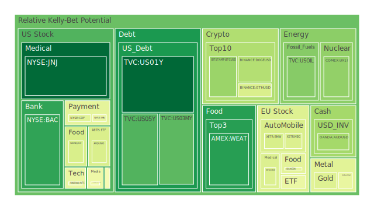
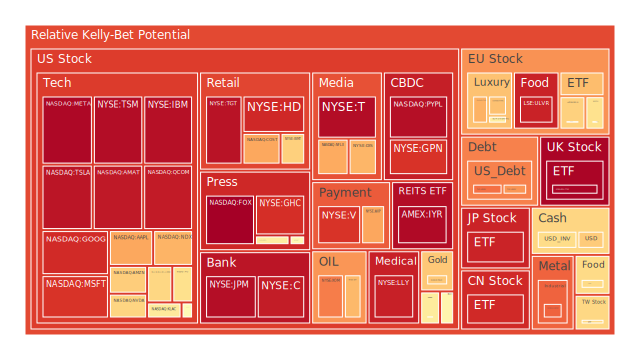
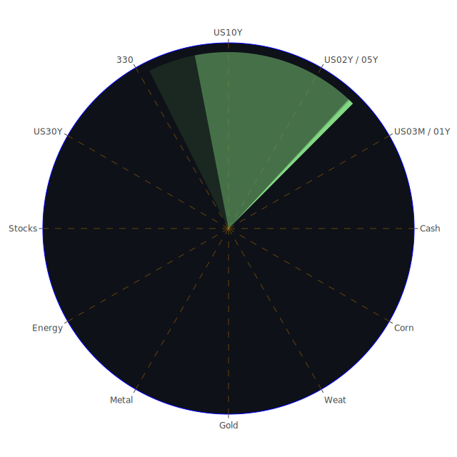

# 投資商品泡沫分析

## 美國國債

近期，美國國債收益率出現波動，特別是長期國債收益率上升。根據數據顯示，2024年12月底，10年期美國國債收益率達到4.63%，相比去年同期的3.75%有明顯上升。這一現象反映了市場對未來通脹和經濟增長的預期變化。

從經濟學角度來看，隨著美國聯邦儲備局持續縮減資產負債表，以及市場對未來加息的預期增強，國債價格受到壓力。歷史上，在通脹預期升溫的時期，國債收益率往往上升。例如，1970年代的高通脹時期，美國國債收益率也曾大幅攀升。

然而，從心理學角度分析，投資者對全球經濟不確定性的擔憂可能導致避險需求增加，從而支撐國債價格。特別是地緣政治風險上升時，國債常被視為安全資產。

## 美國零售股

最近，美國零售股表現略顯疲弱。根據數據，沃爾瑪（WMT）的泡沫風險指數較高，反映出市場對零售業前景的擔憂。經濟學上，通脹上升削弱了消費者購買力，可能對零售業產生負面影響。

同時，社會學角度來看，消費者行為正在轉變，線上購物繼續擴張，傳統零售商面臨挑戰。歷史上，類似的轉變曾發生在電子商務興起的早期階段。

## 美國科技股

美國科技股近期波動明顯。以蘋果（AAPL）和微軟（MSFT）為代表的科技巨頭，其泡沫風險指數處於高位。博弈論角度，市場對AI和數據中心的投資熱潮可能導致資金過度集中於科技板塊。

然而，心理學上，投資者對科技創新的樂觀情緒推動了股票價格。在2000年互聯網泡沫時期，科技股曾經歷過類似的情緒驅動上漲，最終導致泡沫破滅。

## 美國房地產指數

美國房地產市場顯現出一定的風險信號。房貸利率上升至6.85%，相比去年同期的2.65%大幅攀升。經濟學上，利率上升會降低房地產需求，壓制房價上漲。

歷史上，2008年的次貸危機就是由於房地產市場過熱和貸款風險積累所引發。社會學角度，年輕一代購房意願降低，可能對市場造成長期影響。

## 加密貨幣

比特幣（BTC）價格在95000美元左右波動，但泡沫風險指數高企。近期新聞顯示，Terraform Labs聯合創始人都賢洙將被引渡至美國面臨指控，這對市場情緒產生負面影響。

心理學上，投資者對加密貨幣的熱情和恐慌情緒交替出現。歷史上，比特幣曾在2017年和2021年經歷過大幅波動，提示風險需要謹慎對待。

## 金/銀/銅

黃金價格保持穩定，但黃金與石油、銅的比率有所變化。黃金/石油比率為37.29，略高於去年水平。經濟學上，這可能暗示市場對避險資產的需求增加。

從博弈論看，投資者在權衡通脹風險和經濟增長預期，黃金作為傳統避險資產，仍具有吸引力。歷史上，在經濟不確定性時期，黃金價格往往表現強勢。

## 黃豆 / 小麥 / 玉米

農產品價格波動顯著。近期，能源價格上漲可能影響農產品生產成本。經濟學上，供需關係的變化會直接影響價格。

歷史上，2008年和2011年的糧食危機期間，農產品價格曾大幅上漲。社會學上，全球人口增長和氣候變化對農業生產的影響，需要關注。

## 石油/ 鈾期貨

石油價格小幅上漲，達到69.64美元。新聞報導稱，能源巨頭縮減新能源投資，專注於短期利潤。經濟學上，供給側的調整可能推動價格上漲。

鈾期貨價格也在上升，反映出市場對核能需求的預期增強。從歷史上看，能源危機時期，石油和鈾等能源資產價格往往同步上漲。

## 各國外匯市場

美元指數近期走弱，市場預期美聯儲可能放緩加息步伐。新聞顯示，財政部長耶倫表示美國可能在1月中旬達到新的債務上限。

從博弈論角度，各國貨幣政策的分化導致匯率波動加劇。投資者需要關注匯率風險對投資組合的影響。

## 各國大盤指數

全球股市表現分化。美國納斯達克指數泡沫風險指數較高，而歐洲股市相對穩定。經濟學上，不同地區的經濟基本面和貨幣政策差異導致市場走勢不同。

歷史上，市場輪動現象經常發生。投資者需要關注跨市場的資產配置機會。

## 美國半導體股

半導體板塊近期承受壓力。英特爾（INTC）和美光（MU）的泡沫風險指數上升。新聞報導稱，AI數據中心可能對美國電網造成壓力，這對相關企業構成挑戰。

從供應鏈角度，地緣政治風險可能影響半導體行業。歷史上，供應短缺和需求波動曾導致行業劇烈變化。

## 美國銀行股

銀行股表現疲弱。摩根大通（JPM）等大型銀行的泡沫風險指數攀升。經濟學上，利率上升對銀行盈利有利，但同時可能導致貸款風險增加。

歷史上，經濟衰退期銀行資產質量下降，投資者需警惕潛在風險。

## 美國軍工股

軍工股如洛克希德·馬丁（LMT）泡沫風險指數穩定。地緣政治緊張局勢可能促進國防開支增加。從博弈論角度，國際關係的動態對軍工企業具有重要影響。

歷史上，冷戰等時期軍工股表現突出。投資者可以關注長期投資機會。

## 美國電子支付股

電子支付公司如Visa（V）和PayPal（PYPL）的泡沫風險指數較高。隨著數字經濟的發展，電子支付行業競爭加劇。

心理學上，消費者習慣的變化推動了行業發展。但需要注意的是，監管政策和安全問題可能對企業產生影響。

## 美國藥商股

製藥公司如強生（JNJ）和默克（MRK）的泡沫風險指數較低。疫情後，醫藥行業的增長趨於穩定。

經濟學上，研發投入和市場需求是驅動行業的主要因素。歷史上，新藥研發突破往往帶來投資機會。

## 美國影視股

Netflix（NFLX）等影視公司的泡沫風險指數上升。新聞報導稱，華爾街預計Netflix股價可能下跌10%。

社會學上，觀眾觀影習慣的改變和市場競爭加劇，對影視行業產生影響。歷史上，技術變革曾改變行業格局。

## 美國媒體股

媒體公司如Comcast（CMCSA）的泡沫風險指數上升。數字化趨勢和廣告市場的變化對傳統媒體構成挑戰。

心理學上，受眾偏好的轉變需要企業調整策略。投資者需關注行業創新和轉型的機會。

## 石油防禦股

能源公司如埃克森美孚（XOM）的泡沫風險指數上升。石油價格上漲利好公司業績，但需關注行業轉型風險。

從環境、社會及公司治理（ESG）角度，投資者對能源企業的可持續性越發關注。

## 金礦防禦股

金礦企業如Royal Gold（RGLD）的泡沫風險指數上升。黃金價格的波動直接影響公司盈利。

歷史上，經濟不確定性時期，金礦股表現良好。投資者可視風險偏好進行配置。

## 歐洲奢侈品股

歐洲奢侈品公司如LVMH（MC）的泡沫風險指數上升。新聞報導稱，中國經濟放緩可能影響奢侈品需求。

經濟學上，消費趨勢和經濟周期對奢侈品行業影響顯著。歷史上，經濟衰退期奢侈品銷售下滑。

## 歐洲汽車股

德國汽車公司如BMW的泡沫風險指數處於中等水平。新能源車的發展為行業帶來機遇和挑戰。

博弈論角度，市場競爭加劇，企業需加強創新。投資者需關注行業政策和技術趨勢。

## 歐美食品股

食品公司如雀巢（NESN）的泡沫風險指數上升。通脹壓力可能提高生產成本，影響盈利能力。

從社會學角度，消費者對健康食品的需求增加，企業需調整產品策略。

# 宏觀經濟傳導路徑分析

全球經濟正面臨通脹壓力和增長放緩的雙重挑戰。美聯儲的貨幣政策調整對全球資金流動產生影響。貨幣政策分化導致匯率波動，進而影響國際貿易和投資。

通脹預期上升導致國債收益率上升，壓制股市估值。同時，能源價格上漲推高生產成本，影響企業盈利。

# 微觀經濟傳導路徑分析

企業層面，供應鏈中斷和成本上升對盈利造成壓力。消費者行為變化影響企業銷售，特別是在零售和服務業。技術創新和市場競爭加劇，企業需適應變化以保持競爭力。

# 資產類別間傳導路徑分析

不同資產類別之間存在聯動效應。股市下跌可能導致資金流入債市和黃金等避險資產。匯率波動對跨國企業業績產生影響。商品價格變動則影響相關行業和經濟體。

# 投資建議

在當前市場環境下，建議進行多元化投資，以分散風險。

- **穩健型配置（50%）**

  - 美國國債（20%）：作為避險資產，提供穩定收益。
  - 黃金（15%）：對抗通脹和經濟不確定性。
  - 藥商股（15%）：醫藥行業穩定增長。

- **成長型配置（30%）**

  - 科技股（15%）：關注具有創新能力的企業。
  - 半導體股（10%）：受益於科技發展趨勢。
  - 歐洲汽車股（5%）：新能源車領域的機遇。

- **高風險配置（20%）**

  - 加密貨幣（10%）：具有高波動性，需嚴格控制倉位。
  - 新興市場股票（5%）：潛在高回報，同時風險較大。
  - 能源股（5%）：受益於能源價格上漲，但需關注行業風險。

# 風險提示

投資有風險，市場總是充滿不確定性。我們的建議僅供參考，投資者應根據自身的風險承受能力和投資目標，做出獨立的投資決策。
 
Daily Buy Map:

 
Daily Sell Map:

 
Daily Radar Chart:

 
