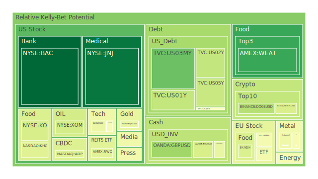
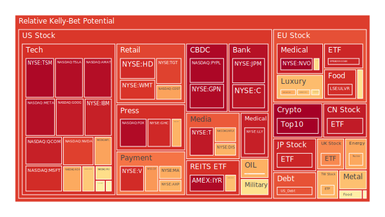
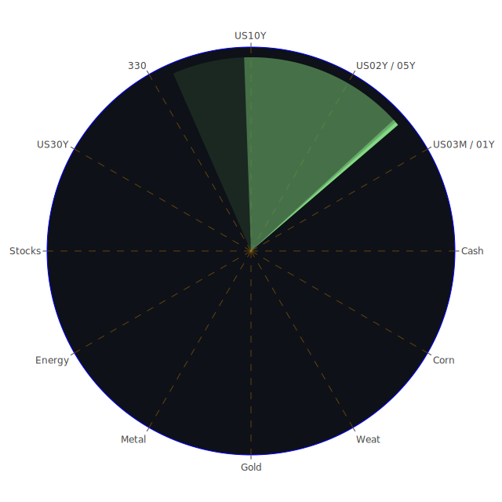

# 投資商品泡沫分析

## 美國國債

近期，美國國債收益率呈現波動。根據資料顯示，2024年12月31日，美國1年期國債（US01Y）的收益率為4.17%，而2年期國債（US02Y）的收益率為4.24%。同時，10年期和30年期國債的收益率分別為4.54%和4.75%。短期國債與長期國債之間的收益率差異縮小，引發市場對經濟前景的擔憂。

從經濟學角度來看，收益率曲線的倒掛往往被視為經濟衰退的前兆。此次收益率曲線的異常現象，可能反映了市場對未來經濟增長放緩的預期。而社會學角度則指出，投資者的避險情緒在加強，他們更傾向於購買長期國債以鎖定收益。心理學上，市場的恐慌情緒可能加劇，導致更多資金流入國債市場。

博弈論的觀點提示，各大機構投資者之間的競爭可能加劇。他們可能採取快速買入長期國債的策略，以在市場波動中獲取先機。然而，這樣的行為可能進一步壓低長期收益率，加劇收益率曲線的倒掛。

## 美國零售股

美國零售股近期表現較為疲軟。以沃爾瑪（WMT）為例，2024年12月31日，其股價為90.57美元，泡沫指數D1達到0.88，顯示出較高的風險。歷史上，零售業的表現與消費者信心密切相關。當消費者支出減少，零售商的收益將受到影響。

經濟學分析指出，通貨膨脹和利率上升可能抑制消費者支出。社會學層面，消費模式的改變，以及電子商務對傳統零售的衝擊，也是需要關注的因素。心理學上，消費者對經濟未來的不確定性，可能導致儲蓄率上升，進一步壓縮零售業的收益。

## 美國科技股

美國科技股仍然是市場焦點。蘋果（AAPL）股價在2024年12月31日為252.20美元，泡沫指數D1為0.70。微軟（MSFT）和谷歌（GOOG）也表現出較高的泡沫風險。

歷史上，科技股的泡沫風險一直存在。經濟學上，科技股的高估值可能無法持續，特別是在經濟不確定性加劇的情況下。社會學上，科技行業的快速發展可能導致市場過度樂觀。心理學角度，投資者可能存在從眾心理，追逐熱門股票，忽視潛在風險。

博弈論提示，市場上對科技股的競爭投資可能導致價格偏離基本面。投資者需要警惕過度樂觀帶來的風險。

## 美國房地產指數

美國房地產市場近期出現降溫跡象。房地產ETF（VNQ）的泡沫指數D1達到0.66，風險較高。歷史上，房地產市場的過熱往往導致經濟調整。

經濟學上，利率上升將抑制房地產市場的需求。社會學角度，年輕一代的購房能力下降，也影響了市場需求。心理學上，投資者對房地產市場的信心可能受到經濟政策和市場趨勢的影響。

## 加密貨幣

比特幣（BTCUSD）價格在2024年12月31日為61,462美元，較高點有所回落。泡沫指數D1為0.40，顯示風險仍然存在。以太坊（ETHUSD）價格為2,929.98美元，泡沫指數D1達到0.99，風險極高。

歷史上，加密貨幣市場波動劇烈。經濟學上，加密貨幣缺乏內在價值支撐，價格易受市場情緒影響。社會學上，監管政策的不確定性增加了市場風險。心理學上，投資者的投機心理可能導致價格劇烈波動。

## 金/銀/銅

黃金（XAUUSD）價格為2,929.98美元，泡沫指數D1為0.99。白銀（XAGUSD）價格為28.94美元，風險較高。銅的價格也呈現波動。

經濟學上，貴金屬通常被視為避險資產，價格受通脹和地緣政治影響。社會學角度，全球經濟不確定性增加了對黃金的需求。心理學上，投資者對未來的擔憂推動了貴金屬價格上漲。

## 黃豆 / 小麥 / 玉米

農產品市場近期波動較大。黃豆（SOYB）和玉米（CORN）的泡沫指數均超過0.55。氣候變化和供應鏈問題影響了農產品供應。

經濟學上，供需失衡將推動價格上漲。社會學上，全球糧食安全問題引發關注。心理學上，市場投機行為可能加劇價格波動。

## 石油/ 鈾期貨

石油價格在2024年12月31日略有上升，布倫特原油價格為79.12美元。泡沫指數D1為0.47。鈾期貨價格也有所上漲。

經濟學上，能源需求的變化直接影響石油價格。社會學上，新能源的興起對傳統能源形成挑戰。心理學上，市場對供需的預期和地緣政治風險影響投資者行為。

## 各國外匯市場

美元指數近期走弱，歐元、英鎊等主要貨幣兌美元匯率上升。英鎊兌美元（GBPUSD）匯率為1.25，泡沫指數D1為0.29。

經濟學上，匯率受國家經濟基本面和利率政策影響。社會學上，國際政治關係和貿易政策影響貨幣走勢。心理學上，投資者對貨幣政策的預期影響匯率。

## 各國大盤指數

全球股市表現分化。美國納斯達克指數（NDX）下跌，泡沫指數D1為0.70。歐洲主要股指也呈現回調跡象。

經濟學上，全球經濟增長放緩影響股市表現。社會學上，投資者對全球政治經濟環境的擔憂增加。心理學上，市場情緒轉向謹慎。

## 美國半導體股

半導體股近期表現平平。英特爾（INTC）股價下跌至19.82美元，泡沫指數D1為0.55。美光（MU）和AMD的風險指數也較高。

經濟學上，供應鏈問題和需求波動影響行業發展。社會學上，科技競爭加劇，政府政策影響行業格局。心理學上，投資者對行業前景的預期影響投資決策。

## 美國銀行股

美國銀行（BAC）股價下跌至43.91美元，泡沫指數D1僅為0.005，風險較低。但需要注意的是，整體銀行業受利率政策和經濟環境影響較大。

經濟學上，利率走勢直接影響銀行利差收入。社會學上，消費者債務風險和貸款質量是關鍵。心理學上，投資者對經濟衰退的擔憂可能影響銀行股表現。

## 美國軍工股

洛克希德·馬丁（LMT）股價為483.37美元，泡沫指數D1為0.54，風險中等。軍工行業受政府預算和國際局勢影響較大。

經濟學上，政府支出是軍工企業收入的主要來源。社會學上，國際緊張局勢可能推動軍費增加。心理學上，市場對地緣政治風險的預期影響投資情緒。

## 美國電子支付股

Visa（V）股價為315.31美元，泡沫指數D1為0.90，風險較高。馬斯泰卡（MA）和PayPal（PYPL）也需要關注。

經濟學上，消費者消費模式和支付方式的變化影響行業發展。社會學上，數字經濟的興起推動電子支付普及。心理學上，投資者對科技創新的期待影響股價。

## 美國藥商股

輝瑞（PFE）和強生（JNJ）等藥企股價相對穩定。強生的泡沫指數D1為0.03，風險較低。

經濟學上，研發投入和藥品價格政策影響企業收益。社會學上，人口老齡化和健康意識提高推動行業需求。心理學上，市場對疫苗和創新藥物的期待影響股價。

## 美國影視股

奈飛（NFLX）股價下跌至900.43美元，泡沫指數D1為0.70，風險較高。

經濟學上，市場競爭加劇，內容投入增加影響盈利能力。社會學上，觀眾的觀影習慣和娛樂需求變化影響行業發展。心理學上，投資者對訂閱用戶增長的預期影響股價。

## 美國媒體股

迪士尼（DIS）股價為110.80美元，泡沫指數D1為0.68。紐約時報（NYT）也需關注。

經濟學上，廣告收入和內容產出是關鍵。社會學上，新媒體的興起對傳統媒體形成衝擊。心理學上，投資者對媒體行業轉型的信心影響投資決策。

## 石油防禦股

埃克森美孚（XOM）股價為105.76美元，泡沫指數D1為0.39。能源行業受全球需求和政策影響。

經濟學上，油價波動影響企業盈利。社會學上，環保意識提高和新能源發展對傳統能源企業構成挑戰。心理學上，投資者對能源轉型的預期影響投資策略。

## 金礦防禦股

皇家黃金公司（RGLD）股價為131.05美元，泡沫指數D1為0.44。金礦股受金價影響。

經濟學上，黃金價格受避險需求和通脹預期影響。社會學上，地緣政治風險提高黃金需求。心理學上，投資者的避險情緒推動金礦股上漲。

## 歐洲奢侈品股

路威酩軒（MC）股價為629.30歐元，泡沫指數D1為0.61。開雲集團（KER）和愛馬仕（RMS）也需要關注。

經濟學上，奢侈品需求受經濟景氣度和富裕階層消費能力影響。社會學上，消費者行為和文化差異影響市場。心理學上，品牌效應和消費者心理對行業至關重要。

## 歐洲汽車股

寶馬（BMW）股價為78.98歐元，泡沫指數D1為0.50。戴姆勒（MBG）和大眾（VOW）也是行業代表。

經濟學上，汽車需求受經濟周期和政策影響。社會學上，新能源車的興起和環保政策推動行業轉型。心理學上，消費者偏好和品牌忠誠度影響市場份額。

## 歐美食品股

雀巢（NESN）股價為74.88瑞士法郎，泡沫指數D1為0.40。可口可樂（KO）和百事（PEP）也需關注。

經濟學上，日常消費品需求相對穩定。社會學上，健康意識提高影響消費選擇。心理學上，品牌認知和消費習慣對企業有利。

# 宏觀經濟傳導路徑分析

全球經濟增長放緩，加上地緣政治風險上升，導致投資者避險情緒增強。利率政策的不確定性使得資金流向債券和黃金等避險資產。同時，通脹壓力和供應鏈問題影響企業盈利，進一步加劇市場波動。

# 微觀經濟傳導路徑分析

企業面臨成本上升和需求減弱的雙重壓力。行業競爭加劇，企業需要創新和提高效率以維持盈利。消費者信心下降，影響零售和服務業收益。同時，科技行業的快速變化帶來機遇和挑戰。

# 資產類別間傳導路徑分析

債券收益率上升可能導致股市資金流出，壓低股價。黃金和債券等避險資產需求增加，推高價格。匯率波動影響進出口企業盈利。石油價格上漲可能推高通脹，進一步影響貨幣政策。

# 投資建議

基於以上分析，我們建議投資者採取多元化投資策略，以分散風險。

1. **穩健型配置（50%）**

   - **美國國債**：美國10年期國債，避險資產，佔20%。
   - **大型藥企股**：如強生（JNJ），穩定收益，佔15%。
   - **日常消費品股**：如雀巢（NESN），抗周期能力強，佔15%。

2. **成長型配置（30%）**

   - **科技巨頭股**：如微軟（MSFT），長期增長潛力，佔10%。
   - **新能源相關股**：如特斯拉（TSLA），未來趨勢，佔10%。
   - **半導體股**：如台積電（TSM），行業領先者，佔10%。

3. **高風險型配置（20%）**

   - **加密貨幣**：如比特幣（BTCUSD），波動大，佔10%。
   - **新興市場股**：潛在高收益，佔5%。
   - **黃金ETF**：避險和投機雙重屬性，佔5%。

# 風險提示

投資有風險，市場總是充滿不確定性。我們的建議僅供參考，投資者應根據自身的風險承受能力和投資目標，做出獨立的投資決策。
 
Daily Buy Map:

 
Daily Sell Map:

 
Daily Radar Chart:

 
