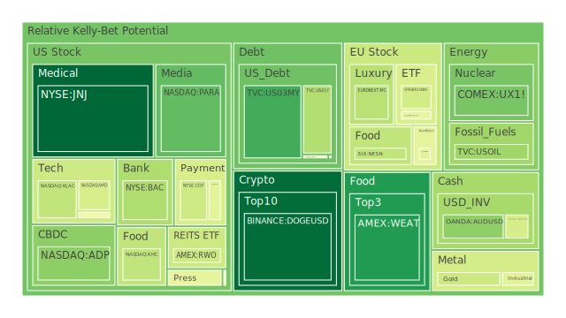
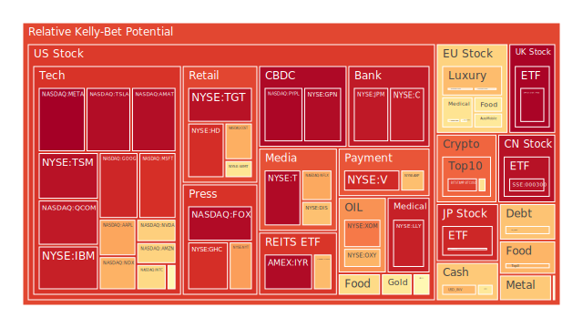
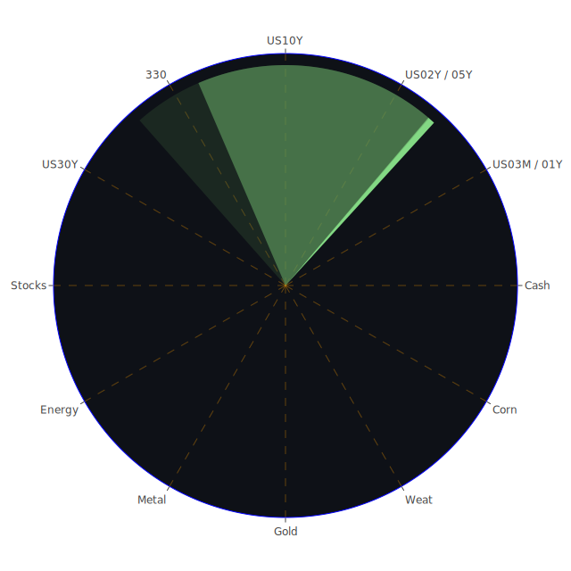

# 投資商品泡沫分析

- **美國國債**

近期，美國國債市場出現了一些值得關注的動向。根據數據顯示，1年期美國國債（PP100為4.1600）和2年期美國國債（PP100為4.2400）的收益率有所下降，而10年期和30年期國債的收益率則分別達到4.5700和4.7900。這種長短期收益率的差異導致了收益率曲線的倒掛現象。

在經濟學中，收益率曲線倒掛通常被視為經濟衰退的先行指標。歷史上，每當出現此現象時，經濟衰退的概率都會顯著增加。投資者對未來經濟增長的預期下降，導致對長期債券的需求上升，價格上漲，收益率下降。此外，社會學和心理學角度來看，全球市場對地緣政治風險、通脹壓力以及貨幣政策的不確定性感到憂慮，資金紛紛流入安全的長期債券市場。

- **美國零售股**

美國零售業近期面臨多重挑戰。沃爾瑪（NYSE:WMT，PP100為90.5700）和目標百貨（NYSE:TGT，PP100為135.0500）等零售巨頭的股價出現波動。雖然假日購物季的銷售數據尚可，但通脹壓力侵蝕了消費者的購買力。心理學上，消費者信心指數下降，導致消費支出放緩。歷史上，在經濟放緩或衰退時期，零售業的表現往往不佳。

- **美國科技股**

科技股一直是市場的焦點，蘋果（NASDAQ:AAPL，PP100為250.4200）和微軟（NASDAQ:MSFT，PP100為424.8300）等龍頭企業的股價持續攀升。然而，高估值也帶來了泡沫風險。回顧2000年的科技股泡沫，過度樂觀的市場情緒和投機行為最終導致股價大幅回調。心理學上，投資者的從眾心理可能加劇市場波動。

- **美國房地產指數**

美國房地產市場呈現出過熱跡象。儘管30年固定抵押貸款利率升至6.85%，房價仍在上漲。經濟學理論表明，利率上升應該抑制房屋需求，但供應不足和投資者對實物資產的偏好支持了房價。歷史上，房地產市場的泡沫風險需要警惕，如2008年的次貸危機。

- **加密貨幣**

比特幣（BITSTAMP:BTCUSD，PP100為93675.0000）價格近期波動劇烈，距離歷史高點仍有距離。新聞報導稱，美國計劃建立比特幣戰略儲備，可能推動價格上漲至100萬美元。然而，加密貨幣市場存在極高的泡沫風險和監管不確定性。心理學上，FOMO（錯失恐懼）和投機心理可能導致市場過度興奮。

- **金/銀/銅**

貴金屬市場表現穩健，黃金（XAUUSD，PP100為2624.6600）和白銀（XAGUSD，PP100為28.9000）受到避險需求的支持。銅（FX:COPPER，PP100為4.0200）作為經濟領先指標，其價格穩定反映了市場對全球經濟的謹慎樂觀。從歷史角度看，金融市場動盪時，投資者往往轉向貴金屬避險。

- **黃豆 / 小麥 / 玉米**

農產品價格出現上漲趨勢。黃豆（AMEX:SOYB，PP100為21.4800）、小麥（AMEX:WEAT，PP100為4.8200）和玉米（AMEX:CORN，PP100為18.7700）的價格受到全球氣候變化和地緣政治因素的影響。供應鏈問題和農業生產受阻可能導致價格進一步上升。歷史上，農產品價格波動對通脹有直接影響。

- **石油/ 鈾期貨UX!**

石油價格（TVC:USOIL，PP100為71.8100）受供需因素影響呈現震盪。冬季來臨，對取暖油需求增加，以及主要產油國的產量政策，都可能推動油價上漲。鈾期貨（COMEX:UX1!，PP100為72.9000）價格上升，反映了對核能需求的增加。能源安全和清潔能源轉型是影響該市場的主要因素。

- **各國外匯市場**

美元指數走強，美元對歐元（OANDA:EURUSD，PP100為1.0400）和英鎊（OANDA:GBPUSD，PP100為1.2500）呈升值趨勢。美聯儲的貨幣政策和利率走勢是主要推動力。歷史上，美元強勢往往對新興市場資本流動和全球貿易產生影響。

- **各國大盤指數**

全球股市表現分化。美國納斯達克指數（NASDAQ:NDX，PP100為21197.0900）高位震盪，日本日經225指數（FX:JPN225，PP100為39488.8900）持續上漲。儘管部分市場創新高，但高估值帶來的泡沫風險需要警惕。歷史上，股市在繁榮期後可能出現大幅回調。

- **美國半導體股**

半導體行業面臨供應鏈挑戰。英特爾（NASDAQ:INTC，PP100為20.0500）和台積電（NYSE:TSM，PP100為197.4900）等公司的股價受到影響。地緣政治風險和技術競爭加劇，使該行業的不確定性增加。博弈論角度看，各國爭奪半導體領域的主導權。

- **美國銀行股**

銀行股如摩根大通（NYSE:JPM，PP100為239.7100）和花旗集團（NYSE:C，PP100為70.3900）走勢穩定。利率水平上升可能提高銀行的利差收入，但經濟前景的不確定性和潛在的信貸風險需要關注。歷史上，經濟衰退時期銀行業績往往下滑。

- **美國軍工股**

軍工企業如洛克希德馬丁（NYSE:LMT，PP100為485.9400）和諾斯羅普格魯曼（NYSE:NOC，PP100為469.2900）股價相對穩定。全球地緣政治緊張可能推動各國增加國防預算，利好軍工行業。歷史上，軍工股在國際關係緊張時期表現突出。

- **美國電子支付股**

電子支付領域競爭激烈。Visa（NYSE:V，PP100為316.0400）和PayPal（NASDAQ:PYPL，PP100為85.3500）的股價高位震盪。隨著數字化和移動支付的普及，市場潛力巨大。但監管政策和市場飽和度是潛在風險。

- **美國藥商股**

製藥公司如默克（NYSE:MRK，PP100為99.4800）和強生（NYSE:JNJ，PP100為144.6200）持續受益於醫療需求的增加。疫情後人們對健康的重視程度提高，帶動製藥行業發展。歷史上，醫藥股具有一定的防禦性。

- **美國影視股**

迪士尼（NYSE:DIS，PP100為111.3500）等影視公司的股價受到流媒體業務競爭的影響。消費者觀影習慣的改變使傳統影視公司面臨轉型挑戰。心理學上，年輕一代更傾向於線上娛樂。

- **美國媒體股**

傳統媒體公司如康卡斯特（NASDAQ:CMCSA，PP100為37.5300）面臨數位轉型的壓力。新興媒體平台的崛起改變了廣告和內容分發模式。社會學上，資訊獲取方式的變化對媒體行業產生深遠影響。

- **石油防禦股**

石油企業如埃克森美孚（NYSE:XOM，PP100為105.7600）在能源轉型背景下面臨挑戰。環境政策的收緊和新能源的興起可能影響傳統石油企業的長期發展。

- **金礦防禦股**

金礦公司如Royal Gold（NASDAQ:RGLD，PP100為131.0500）受益於金價上漲。投資者對避險資產的需求提高了金礦企業的盈利能力。歷史上，當市場不確定性增加時，金礦股往往表現良好。

- **歐洲奢侈品股**

歐洲奢侈品巨頭如路威酩軒（EURONEXT:MC，PP100為635.5000）和開雲集團（EURONEXT:KER，PP100為238.2500）表現強勁。新興市場消費者對奢侈品的需求增長為企業帶來機遇。文化和社會因素也促進了奢侈品市場的發展。

- **歐洲汽車股**

戴姆勒（XETR:MBG，PP100為53.8000）和寶馬（XETR:BMW，PP100為78.9800）等歐洲汽車企業正積極推進電動化轉型。政策支持和市場需求引導了行業方向。歷史上，技術革新對汽車行業的影響深遠。

- **歐美食品股**

食品飲料巨頭如雀巢（SIX:NESN，PP100為74.8800）和可口可樂（NYSE:KO，PP100為62.2600）具備防禦性特質。在經濟不穩定時期，必需消費品的需求相對穩定。社會學上，消費者對健康和品質的追求也影響了行業趨勢。

# 宏觀經濟傳導路徑分析

全球經濟正面臨多重壓力：通脹高企、供應鏈中斷、地緣政治緊張等。各國央行的貨幣政策進入緊縮周期，美聯儲加息步伐影響全球資本流動。利率上升導致借貸成本增加，可能抑制企業投資和消費支出。經濟學理論指出，貨幣政策的時滯效應可能在未來一段時間內對經濟增長產生更大影響。

同時，政府財政政策的刺激力度減弱，市場對未來經濟增長的預期下調。全球經濟周期下行的風險增加。從歷史經驗看，宏觀經濟的不確定性往往引發金融市場的波動。

# 微觀經濟傳導路徑分析

在企業層面，成本上升壓力增大。能源、原材料和勞動力成本的上漲壓縮了企業利潤率。供應鏈中斷導致生產延誤，影響企業的交付能力。

消費者層面，通脹削弱了實際購買力。消費者可能削減非必要支出，影響零售和服務業的業績。心理學上，對未來經濟的不確定感增加，消費者傾向於增加儲蓄，減少消費。

# 資產類別間傳導路徑分析

不同資產之間的相互影響加劇。股市下跌可能引發投資者轉向債券和黃金等避險資產，推高其價格。外匯市場的波動影響跨國企業的盈利和進出口貿易。

商品價格上漲可能傳導至消費者物價，進一步推升通脹。地緣政治風險加劇，導致油價和貴金屬價格上漲。博弈論角度，市場參與者的行為相互影響，加劇了市場的波動性。

# 投資建議

綜合以上分析，我們建議投資者採取多元化的投資策略，平衡風險和收益。在當前環境下，建議以下資產配置：

- **穩健型投資組合（50%）**

  - **美國國債（20%）**：配置中長期美國國債，利用其避險特性對沖市場風險。
  - **必需消費品股票（15%）**：選擇雀巢（NESN）、可口可樂（KO）等防禦性強的公司。
  - **黃金（15%）**：增持黃金資產，作為抗通脹和避險工具。

- **成長型投資組合（30%）**

  - **科技股（10%）**：投資於蘋果（AAPL）、微軟（MSFT）等具備長期增長潛力的企業。
  - **半導體行業（10%）**：關注台積電（TSM）等領先企業，受益於科技發展趨勢。
  - **歐洲奢侈品股（10%）**：佈局路威酩軒（MC）、開雲集團（KER），受益於新興市場需求。

- **高風險型投資組合（20%）**

  - **加密貨幣（10%）**：投資比特幣（BTC）等，有望獲取高收益，但需承受高波動性。
  - **新興市場股票（5%）**：關注增長潛力大的市場，但需警惕政治和經濟風險。
  - **能源資產（5%）**：投資石油（USOIL）和鈾期貨（UX1!），受益於能源需求增長。

# 風險提示

投資有風險，市場總是充滿不確定性。我們的建議僅供參考，投資者應根據自身的風險承受能力和投資目標，做出獨立的投資決策。
 
Daily Buy Map:

 
Daily Sell Map:

 
Daily Radar Chart:

 
