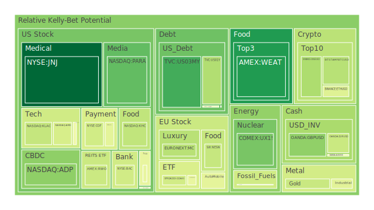
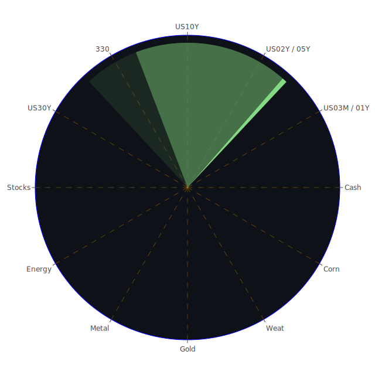

# 投資商品泡沫分析

## 美國國債

目前美國國債收益率持續攀升，特別是長期國債收益率，如30年期國債收益率已達到4.79%，較去年同期的3.90%有明顯上升。這反映了市場對未來通脹和利率上升的預期。此外，聯邦準備理事會（FED）資產負債表持續收縮，也可能對國債市場產生影響。歷史上，國債收益率的上升常常預示著經濟增長放緩或通脹壓力增加，投資者需謹慎觀察。

## 美國零售股

美國零售股近期表現疲軟，特別是大型零售商如沃爾瑪（WMT）和塔吉特（TGT）的股價波動明顯。消費者信心指數的下降，以及消費者支出的放緩，可能是導致零售股表現不佳的主因。回顧2008年金融危機期間，零售股也曾因消費者支出下降而受到重挫，投資者應警惕類似的風險。

## 美國科技股

科技股在過去一年持續上漲，但近期出現了高估值的跡象。以蘋果（AAPL）和微軟（MSFT）為代表的科技巨頭市盈率已達歷史高位。歷史上，科技股泡沫如2000年的網路泡沫崩潰，給市場帶來巨大震盪。投資者應注意科技股可能存在的估值過高風險。

## 美國房地產指數

美國房地產市場持續升溫，房價指數連續數月上漲。低利率環境和供需失衡推動了房價的上升。然而，固定房貸30年期利率已升至6.85%，較去年同期的2.65%大幅上升，可能對房地產市場需求產生抑制作用。類似2007年房地產泡沫的情況，需警惕潛在的市場調整風險。

## 加密貨幣

比特幣（BTCUSD）價格近期在94,000美元左右震盪，相較於最高點108,000美元有所回落。市場對加密貨幣的熱情逐漸降溫，同時監管壓力增大。歷史上，加密貨幣市場波動劇烈，投資者應注意風險管理。

## 金/銀/銅

黃金價格持續上漲，目前每盎司約2,600美元。金銀銅比例顯示，黃金對銀和銅的價格比率已達到高位，可能預示著貴金屬市場的過熱。經濟不確定性增強時，黃金通常被視為避險資產，但投資者需警惕價格回調的可能性。

## 黃豆 / 小麥 / 玉米

農產品價格近期呈現波動，特別是玉米（CORN）和黃豆（SOYB）的價格指數上升明顯。氣候變化和全球需求增長可能推動農產品價格上漲。然而，歷史上農產品價格受供需影響較大，價格波動性高，需謹慎對待。

## 石油/ 鈾期貨UX!

石油價格持續波動，目前每桶約71美元。全球經濟復蘇放緩可能抑制石油需求，而供給方面的不確定性也增添了價格波動風險。鈾期貨價格上升，反映了市場對清潔能源的需求增長。投資者可關注能源市場轉型帶來的機會與風險。

## 各國外匯市場

外匯市場方面，美元指數保持強勢，歐元和英鎊對美元匯率呈現疲軟。全球貨幣政策趨勢和經濟基本面是影響匯率走勢的關鍵因素。投資者應密切關注各國央行的貨幣政策變化。

## 各國大盤指數

全球股市表現分化，美國股市在高位震盪，歐洲和亞洲股市表現不一。經濟復蘇的不確定性和地緣政治風險可能對股市產生影響。回顧歷史，市場在高位時進入調整的風險增加，投資者需謹慎評估。

## 美國半導體股

半導體股近期受到市場關注，如英特爾（INTC）和輝達（NVDA）。然而，供應鏈瓶頸和市場需求波動可能影響半導體行業的發展。歷史上，半導體行業波動性較高，需注意市場風險。

## 美國銀行股

銀行股如摩根大通（JPM）和花旗（C）股價近期表現疲軟。利率上升可能提高銀行利差收益，但經濟下行風險可能導致信貸損失增加。2008年金融危機對銀行業的衝擊仍歷歷在目，投資者應關注風險管理。

## 美國軍工股

軍工股如洛克希德馬丁（LMT）和雷神科技（RTX）受地緣政治局勢影響，近期股價有所上升。軍事衝突和國防支出的增加可能推動軍工股上漲。但政策變化可能帶來不確定性，需慎重考慮。

## 美國電子支付股

電子支付股如Visa（V）和PayPal（PYPL）持續受益於數位支付的普及。然而，高估值和市場競爭加劇可能對股價產生壓力。回顧科技股泡沫時期，高估值股票面臨較大風險。

## 美國藥商股

制藥股如默克（MRK）和禮來（LLY）在疫情影響下表現突出。研發進展和政策支持可能帶來機會，但同時面臨專利到期和市場競爭等風險。

## 美國影視股

影視娛樂股如迪士尼（DIS）受到內容製作和流媒體競爭的挑戰。疫情對電影行業的影響仍未完全消退，投資者需關注行業復蘇的進展。

## 美國媒體股

媒體股如紐約時報（NYT）在數位轉型中尋求增長。然而，廣告收入波動和讀者習慣改變可能影響媒體公司的盈利能力。

## 石油防禦股

石油防禦股如埃克森美孚（XOM）和雪佛龍（CVX）在能源轉型中面臨挑戰。化石燃料需求可能逐步下降，投資者需關注公司的轉型策略。

## 金礦防禦股

金礦股如皇家黃金公司（RGLD）受益於金價上漲。然而，金礦開採成本和地緣政治風險可能影響公司盈利。

## 歐洲奢侈品股

歐洲奢侈品股如路威酩軒（MC）和開雲集團（KER）受中國市場需求影響較大。近期中國經濟放緩可能影響奢侈品銷售，需密切關注市場變化。

## 歐洲汽車股

歐洲汽車股如賓士（MBG）和寶馬（BMW）在電動化轉型中投入巨大。市場競爭加劇和政策變化可能對行業產生重大影響。

## 歐美食品股

食品股如雀巢（NESN）和可口可樂（KO）受益於消費者必需品的穩定需求。然而，原材料價格上漲和供應鏈問題可能影響盈利能力。

# 宏觀經濟傳導路徑分析

當前全球經濟面臨較大不確定性。美國利率上升加大了新興市場資本外流的壓力，美元走強對全球流動性產生影響。能源價格波動和通脹壓力可能導致消費者支出減少，進而影響企業盈利和就業市場。

全球供應鏈問題尚未完全解決，對製造業和貿易產生影響。地緣政治風險如俄烏衝突、亞洲地區緊張局勢等也可能對全球經濟造成衝擊。

# 微觀經濟傳導路徑分析

企業層面，成本上升和需求不穩定可能影響盈利能力。科技公司可能面臨芯片短缺和研發成本上升的挑戰。零售和服務業可能因消費者信心下降而營收受損。

金融市場方面，投資者情緒波動影響資產價格。避險情緒升溫可能推高黃金價格，而風險資產如股票可能面臨調整。

# 資產類別間傳導路徑分析

股票市場和債券市場之間存在聯動性。當債券收益率上升，股票市場可能受到抑制。商品市場與匯率、市場情緒也有密切關聯。能源價格上漲可能推動通脹，進一步影響貨幣政策和投資決策。

不同資產之間可能存在替代效應。例如，當股票市場風險增加時，投資者可能轉向黃金等避險資產。外匯市場的波動也可能對進出口企業產生影響。

# 投資建議

## 穩健型投資組合（40%）

1. **美國國債**：具備安全性和穩定收益，可分配15%。
2. **黃金**：作為避險資產，可抵禦市場波動，分配15%。
3. **高評級公司債券**：提供穩定的利息收益，分配10%。

## 成長型投資組合（35%）

1. **科技股**：選擇具有競爭優勢的科技巨頭，如微軟、蘋果，分配15%。
2. **醫藥股**：關注研發實力強的公司，如禮來，分配10%。
3. **可再生能源股**：受益於能源轉型趨勢，分配10%。

## 高風險投資組合（25%）

1. **新興市場股票**：潛在高回報，但風險較大，分配10%。
2. **加密貨幣**：波動性高，需嚴格控制倉位，分配5%。
3. **原油期貨**：價格波動劇烈，可進行適度配置，分配10%。

# 風險提示

投資有風險，市場總是充滿不確定性。我們的建議僅供參考，投資者應根據自身的風險承受能力和投資目標，做出獨立的投資決策。
 
Daily Buy Map:

 
Daily Sell Map:

 
Daily Radar Chart:

 
