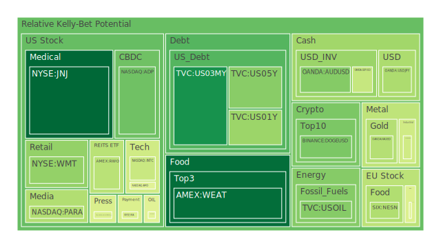
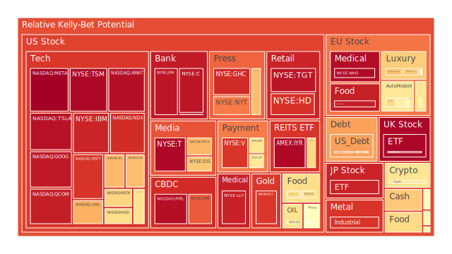
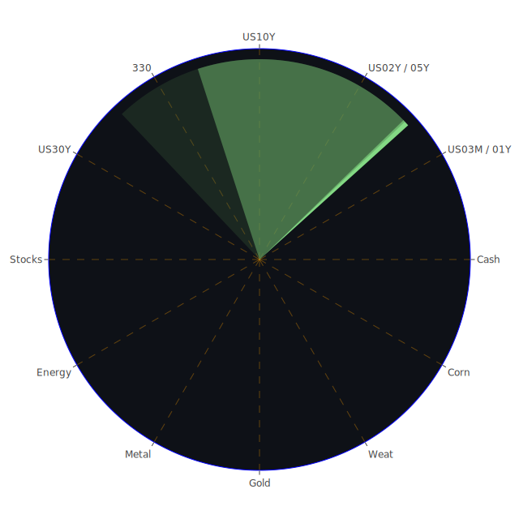

# 投資商品泡沫分析

- **美國國債**

近期美國國債收益率呈現波動，2025年1月3日的數據顯示，2年期美債收益率為4.24%，比上週略有下降。10年期美債收益率為4.56%，與上週持平。有趣的是，長短期利差（如30年期與3個月期利差）呈現正值，這意味著市場對未來經濟前景持謹慎樂觀態度。然而，美國聯邦儲備局總資產下降，顯示市場流動性可能收緊。綜合來看，美國國債市場可能面臨一定的泡沫風險，需要密切關注經濟數據和貨幣政策的變化。

- **美國零售股**

美國零售股近期表現疲軟，例如沃爾瑪（NYSE:WMT）在2025年1月3日的泡沫指數（D1）達到0.344368，反映出市場對零售業的信心不足。這可能與消費者信心指數下降有關，也可能受到通貨膨脹和利率上升的影響。歷史上，零售業在經濟放緩時期容易受到衝擊，投資者需謹慎評估。

- **美國科技股**

科技股如蘋果（NASDAQ:AAPL）和微軟（NASDAQ:MSFT）在泡沫指數上顯示出高風險，1月3日的D1分別為0.715313和0.891567。這可能反映了市場對科技股估值過高的擔憂。此外，新聞報導中提到「Big Tech Stocks’ Reign May Falter in 2025」，暗示大型科技股的主導地位可能在2025年受到挑戰。投資者應關注科技行業的競爭格局和創新能力。

- **美國房地產指數**

房地產相關的ETF（如AMEX:VNQ）在D1泡沫指數為0.647278，顯示出一定的風險。美國30年固定抵押貸款利率達到6.91%，比去年大幅上升，增加了購房成本。歷史上，利率上升可能對房地產市場產生壓力，需要關注房地產市場的供需關係和信貸政策。

- **加密貨幣**

比特幣（BTCUSD）在1月3日的泡沫指數D1為0.621190，顯示風險較高。近期新聞提到「Bitcoin Slips in December as Investors Cash In on Record Rally」，反映出投資者在價格高點套現，市場可能出現調整。此外，OpenAI未能按時推出其承諾的選擇退出工具，可能影響市場對科技和加密貨幣的信心。

- **金/銀/銅**

黃金（XAUUSD）和白銀（XAGUSD）的價格近期保持穩定，但泡沫指數顯示出高風險，XAUUSD的D1為0.394594，XAGUSD的D1為0.891049。金銀比率（GOLD SILVER RATIO）上升，顯示市場避險情緒上升。歷史上，在經濟不確定性增加時，貴金屬價格往往上漲。

- **黃豆 / 小麥 / 玉米**

農產品價格近期波動較大，AMEX:SOYB（黃豆ETF）的泡沫指數維持在0.512176。全球供應鏈問題和氣候因素可能影響農產品價格。歷史上，農產品價格受天氣、政策和需求影響較大，投資者需留意相關新聞事件。

- **石油/ 鈾期貨UX!**

原油價格（USOIL）在1月3日的泡沫指數為0.325177，風險較低。近期油價下跌，可能與全球經濟增長放緩和供應增加有關。烏克蘭停止俄羅斯天然氣過境，標誌著俄羅斯在歐洲能源市場的主導地位結束，可能對全球能源格局產生影響。

- **各國外匯市場**

美元指數走強，達到兩年高點，反映出市場對美國經濟的信心和避險需求。新興市場貨幣如墨西哥比索出現大幅下跌，可能受到美元走強和全球經濟不確定性的影響。

- **各國大盤指數**

全球股市表現不佳，美國標普500指數在新年的第一個交易日下跌。新聞報導指出「Stocks stumble as Tesla weighs, dollar hits 2-yr high」，表明市場情緒謹慎。歐洲和亞洲股市也受到影響，投資者需密切關注宏觀經濟變化。

- **美國半導體股**

英特爾（NASDAQ:INTC）股價下跌，引發市場擔憂。泡沫指數顯示英特爾的D1為0.429035，風險較高。半導體行業面臨供應鏈瓶頸和需求變化，歷史上該行業波動性較高。

- **美國銀行股**

銀行股如摩根大通（NYSE:JPM）的泡沫指數D1達到0.946068，風險較高。美國銀行業可能受到利率變化和經濟增長放緩的影響，需要關注信貸風險和資產負債表狀況。

- **美國軍工股**

軍工企業如洛克希德馬丁（NYSE:LMT）維持較高的泡沫指數，D1為0.545406。地緣政治緊張局勢可能支撐軍工股的表現，但也需警惕政策變化帶來的風險。

- **美國電子支付股**

電子支付企業如Visa（NYSE:V）和全球支付（NYSE:GPN）的泡沫指數分別為0.889570和0.834532，風險較高。科技和金融的融合帶來機遇，但競爭加劇和監管風險也需關注。

- **美國藥商股**

默克藥廠（NYSE:MRK）的泡沫指數D1為0.506639，風險適中。醫藥行業受益於人口老齡化和科技進步，但研發風險和政策影響不可忽視。

- **美國影視股**

華特迪士尼（NYSE:DIS）的泡沫指數D1為0.673524。流媒體競爭加劇和消費者行為改變可能影響影視行業的未來走向。

- **美國媒體股**

媒體公司如紐約時報（NYSE:NYT）的泡沫指數D1為0.789873，風險較高。媒體行業面臨數位轉型的挑戰和機遇，需要適應新的商業模式。

- **石油防禦股**

石油企業如埃克森美孚（NYSE:XOM）的泡沫指數D1為0.474809。儘管油價下跌，但能源需求仍然存在，石油防禦股可能提供一定的防禦性。

- **金礦防禦股**

金礦公司可能受益於金價上漲，提供避險機會。然而，需要關注生產成本和地緣政治風險。

- **歐洲奢侈品股**

歐洲奢侈品企業如LVMH（EURONEXT:MC）的泡沫指數D1為0.533719。亞洲市場需求和全球經濟變化可能影響奢侈品行業的表現。

- **歐洲汽車股**

德國汽車企業如BMW（XETR:BMW）的泡沫指數D1為0.569458。電動汽車競爭加劇，政策和市場需求變化可能帶來挑戰。

- **歐美食品股**

食品公司如雀巢（SIX:NESN）的泡沫指數D1為0.388639。消費者偏好的變化和供應鏈問題可能影響食品行業。

# 宏觀經濟傳導路徑分析

全球經濟面臨多重挑戰，包括通貨膨脹、利率上升、供應鏈瓶頸和地緣政治緊張局勢。美國聯邦儲備局的貨幣政策動向影響全球資本流動，美元走強給新興市場帶來壓力。

高盛等大型投資機構調整對全球經濟增長的預期，市場對未來的不確定性增加。經濟學理論表明，貨幣政策、財政政策和市場情緒共同影響經濟周期。

# 微觀經濟傳導路徑分析

行業層面，科技行業可能面臨估值調整和競爭加劇。零售業受消費者信心和購買力影響明顯。能源行業受供需關係和政策影響。

企業層面，創新能力、財務狀況和市場定位決定競爭優勢。心理學理論指出，投資者的行為和預期會影響資產價格。

# 資產類別間傳導路徑分析

不同資產類別之間存在聯動效應。例如，股市下跌可能導致避險資產如黃金價格上漲。美元走強可能導致新興市場貨幣貶值，進而影響當地資產價格。

博弈論觀點下，各國政策制定者的行為和決策會相互影響，形成政策博弈，影響全球資本市場。

# 投資建議

**穩健型投資組合（50%）**

1. **美國國債（20%）**：持有短期國債，以應對市場波動和利率風險。
2. **黃金（15%）**：作為避險資產，對抗通貨膨脹和經濟不確定性。
3. **高品質企業債券（15%）**：選擇財務穩健的企業，獲取穩定收益。

**成長型投資組合（30%）**

1. **科技股領導企業（10%）**：如微軟和蘋果，具有長期競爭優勢。
2. **醫療保健行業（10%）**：人口老齡化帶來持續需求。
3. **新能源產業（10%）**：政策支持下的太陽能和電動汽車企業。

**高風險投資組合（20%）**

1. **加密貨幣（8%）**：比特幣和以太幣，波動性高但潛在收益大。
2. **新興市場股票（6%）**：關注具備增長潛力但風險較高的市場。
3. **小型創新企業（6%）**：投資於具有前瞻性技術的初創公司。

# 風險提示

投資有風險，市場總是充滿不確定性。我們的建議僅供參考，投資者應根據自身的風險承受能力和投資目標，做出獨立的投資決策。特別是在當前市場環境下，需要警惕可能存在的泡沫風險，密切關注宏觀經濟形勢和市場動態。
 
Daily Buy Map:

 
Daily Sell Map:

 
Daily Radar Chart:

 
