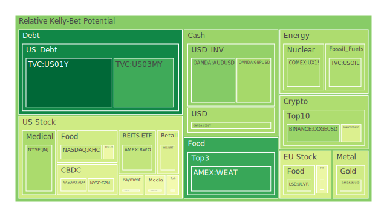
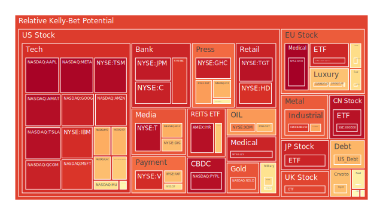
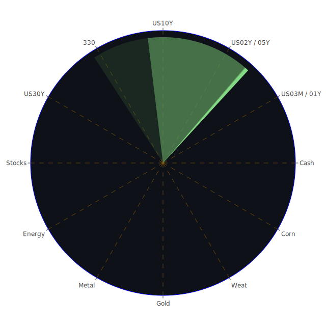

# 投資商品泡沫分析

## 美國國債

近期，美國國債市場展現出一定的波動性。根據資料顯示，短期國債（如1年期、3個月期）的收益率呈現上升趨勢，而長期國債（如10年期、30年期）的收益率也有所上漲。經濟學上，這可能反映出市場對未來通脹的預期增加，投資者要求更高的收益率來抵消未來購買力的下降。

從心理學角度來看，投資者可能對經濟前景抱有謹慎態度，選擇避險資產。同時，博弈論指出，在市場不確定性增加時，投資者傾向於重新配置資產，增加國債持有量。然而，需要注意的是，國債價格的上升可能導致泡沫風險的累積，投資者應密切關注市場動態。

## 美國零售股

美國零售股近期受到消費者信心波動的影響。社會學研究表明，消費者行為受經濟環境和疫情影響顯著。隨著線上購物的普及，傳統零售商面臨挑戰。然而，一些零售商成功轉型，在電商領域取得突破，帶動股價上揚。

從歷史角度來看，零售業經常在經濟周期中經歷起伏。投資者應關注宏觀經濟指標，如失業率和消費者支出，以判斷零售股的未來走勢。

## 美國科技股

美國科技股一直是市場焦點。近期，科技巨頭的業績表現突出，推動整體板塊上漲。經濟學理論認為，技術進步是經濟增長的主要動力之一。心理學上，投資者對創新企業抱有高度期望，可能導致過度樂觀。然而，需要警惕的是，高估值可能隱含泡沫風險。

歷史上，科技股曾在互聯網泡沫時期經歷巨幅波動，投資者應保持理性，避免盲目追高。

## 美國房地產指數

美國房地產市場近期呈現穩定增長。低利率環境下，貸款成本下降，刺激房地產需求。社會學指出，城市化進程和人口增長是房地產市場的重要推動力。然而，過快的價格上漲可能導致市場過熱。

從心理學角度，投資者可能存在「恐失良機」的心態，加速進場購買。需注意房地產市場的週期性波動，避免潛在風險。

## 加密貨幣

加密貨幣市場波動劇烈。近期，比特幣價格再創新高，但同時也伴隨著大幅調整。經濟學上，加密貨幣缺乏內在價值支撐，其價格主要由供求關係決定。心理學研究表明，投資者情緒對價格影響巨大，易受市場消息左右。

歷史上，加密貨幣多次經歷大漲大跌，投資者應保持謹慎，注意市場風險。

## 金/銀/銅

貴金屬價格近期呈現上升趨勢。金銀作為傳統避險資產，受到通脹預期和地緣政治風險的影響。銅則被視為經濟晴雨表，其價格上漲可能反映出市場對未來經濟復甦的信心。

投資者應關注宏觀經濟數據和供需關係，評估貴金屬的投資價值。

## 黃豆 / 小麥 / 玉米

農產品價格近期有所波動。供應鏈中斷、天氣因素和全球需求變化都是影響價格的關鍵。經濟學上，供給短缺或需求增加都可能推高價格。

歷史上，農產品價格受天災人禍影響較大，投資者應密切關注相關資訊，管理風險。

## 石油/ 鈾期貨UX!

石油價格近期反彈，主要受全球經濟復甦預期和供給調整影響。博弈論指出，主要產油國的政策協調對油價有重大影響。鈾期貨價格則可能受到能源政策和核能需求變化的影響。

投資者應關注國際政治動態和供需平衡，謹慎評估投資機會。

## 各國外匯市場

外匯市場近來波動顯著。美元指數上升，反映出市場對美國經濟的信心增加。歐元、日圓等主要貨幣則因各自經濟狀況而出現不同走勢。

經濟學理論強調，利率差異和資本流動是匯率變化的主要因素。投資者需關注各國央行政策與宏觀經濟指標。

## 各國大盤指數

全球股市近期走勢分化。美國股市創新高，歐洲和亞洲市場則受各自經濟情況影響出現不同表現。社會學上，投資者情緒和市場信心是影響股市的重要因素。

歷史經驗表明，全球市場聯動性增加，投資者應關注全球經濟動態，進行多元化配置。

## 美國半導體股

半導體產業受益於科技發展和數字化轉型，股票表現強勁。供應鏈短缺使得產品供不應求，推動公司業績增長。

然而，需留意市場供需變化和技術迭代風險，避免高估值帶來的投資風險。

## 美國銀行股

銀行股近期表現平穩。低利率環境對銀行利差收入產生壓力，但經濟復甦預期可能帶動貸款需求增加。監管政策和資本充足率要求也是影響銀行業的關鍵因素。

投資者應關注宏觀經濟走勢和政策變化，評估銀行股的投資價值。

## 美國軍工股

地緣政治緊張局勢可能推動軍工股需求增長。歷史上，軍工企業在全球安全形勢不穩定時期表現較好。

然而，需注意政府預算和政策變化對行業的影響，謹慎評估投資風險。

## 美國電子支付股

電子支付行業受益於消費者支付習慣的改變和科技進步。疫情加速了數字化支付的普及，相關企業業績亮眼。

需關注市場競爭加劇和監管環境變化對行業的影響。

## 美國藥商股

醫藥行業受人口老齡化和健康需求增加的推動。近期，新藥研發進展和疫情相關產品需求提升了行業熱度。

投資者應關注研發風險、專利到期和政策監管等因素。

## 美國影視股

隨著經濟開放，影視娛樂行業逐漸復甦。串流媒體的興起改變了行業格局，傳統影視公司面臨轉型壓力。

需關注消費者習慣變化和內容版權等問題，評估投資機會。

## 美國媒體股

媒體行業在數字化背景下進行重組。廣告收入模式轉變，數位媒體崛起帶來新的機遇和挑戰。

投資者應關注行業整合和技術創新對公司的影響。

## 石油防禦股

石油防禦股通常在能源價格波動時被視為避風港。近期油價上漲可能提升這些公司的盈利能力。

然而，需注意全球能源轉型和環保政策對行業的長期影響。

## 金礦防禦股

金礦公司受益於金價上漲。作為避險資產，黃金在市場不確定性增加時需求上升。

投資者應關注開採成本、儲量和地緣政治風險。

## 歐洲奢侈品股

奢侈品行業受益於全球富裕階層消費增加。亞洲市場特別是中國的需求是關鍵驅動力。

需關注匯率風險、品牌競爭和市場飽和度。

## 歐洲汽車股

歐洲汽車廠商正面臨電動化轉型的挑戰和機遇。政策支持和技術研發是成功的關鍵。

投資者應評估企業的創新能力和市場戰略。

## 歐美食品股

食品行業屬於防禦性板塊，在經濟波動時期相對穩定。健康飲食趨勢和消費者偏好變化可能影響公司業績。

需關注成本壓力、供應鏈管理和產品創新。

# 宏觀經濟傳導路徑分析

全球經濟正處於復甦階段，但仍面臨通脹壓力和供應鏈瓶頸。主要央行的貨幣政策動向影響資本流動和市場流動性。國際貿易局勢和地緣政治風險可能影響商品價格和市場信心。

經濟學理論指出，貨幣供給、利率和匯率之間存在緊密聯繫，影響投資和消費。宏觀政策的調整將通過金融市場影響實體經濟。

# 微觀經濟傳導路徑分析

企業層面，生產成本上升和市場需求變化影響盈利能力。科技創新和商業模式轉型為企業帶來新的機遇和挑戰。博弈論指出，企業間的競爭策略將影響市場格局。

消費者行為變化直接影響企業的營收和市場份額。企業需適應市場變化，制定靈活的經營策略。

# 資產類別間傳導路徑分析

不同資產之間存在聯動關係。例如，股市和債市可能呈現反向波動，投資者在避險和追逐收益之間進行配置。商品價格變化影響相關行業的股票表現。

外匯市場波動可能影響進出口企業的盈利，進而影響股價。投資者應綜合考慮各資產間的關聯性，進行分散投資。

# 投資建議

在當前市場環境下，建議投資者根據自身風險承受能力進行資產配置：

- **穩健型投資（50%）**：
  - **國債**：提供穩定的收益和避險功能。
  - **大型藍籌股**：具有穩定的現金流和分紅。
  - **黃金**：對沖通脹和市場不確定性。

- **成長型投資（30%）**：
  - **科技股**：受益於科技進步和產業升級。
  - **醫藥股**：符合人口老齡化和健康需求增長趨勢。
  - **新能源企業**：符合環保政策和能源轉型方向。

- **高風險投資（20%）**：
  - **加密貨幣**：高波動性，投資需謹慎。
  - **新興市場股票**：增長潛力大，但風險較高。
  - **小型創新企業**：具有高成長性，但面臨市場風險。

# 風險提示

投資有風險，市場總是充滿不確定性。我們的建議僅供參考，投資者應根據自身的風險承受能力和投資目標，做出獨立的投資決策。
 
Daily Buy Map:

 
Daily Sell Map:

 
Daily Radar Chart:

 
