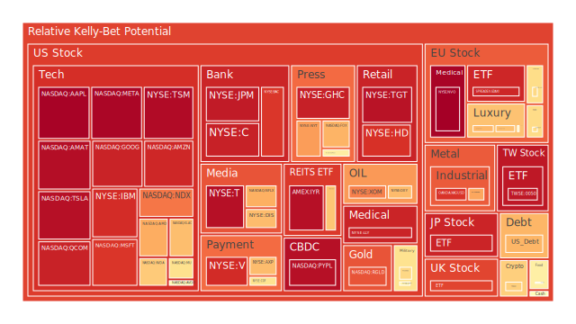

# 投資商品泡沫分析

## **美國國債**

近期，美國國債收益率呈現波動，尤其是短期國債的收益率變化引人關注。根據資料顯示，2025年1月5日，美國2年期國債收益率為4.28%，較上週的4.33%略有下降。這反映出市場對未來經濟走向的不確定性增加。歷史上，在經濟衰退前夕，短期國債收益率上升，而長期國債收益率下降，形成收益率曲線倒掛的現象。目前，2年期與10年期國債收益率的差距縮小，需警惕可能的經濟放緩風險。

從經濟學角度來看，美聯儲的貨幣政策調整對國債市場產生了直接影響。近期，美聯儲總資產持續下降，顯示其在收緊貨幣政策，這將對國債價格形成壓力。投資者應關注美聯儲未來的政策走向，以及經濟數據的變化。

## **美國零售股**

美國零售股近期表現平平，特別是大型零售商的業績未達預期。以沃爾瑪（WMT）為例，雖然股價在90美元上下波動，但泡沫風險指數D1達到0.4205，需謹慎考量。歷史上，消費者信心指數的下降往往導致零售業績下滑。目前，通貨膨脹和利率上升壓力可能抑制消費者支出。

從社會學角度，消費者行為的轉變，如線上購物的興起，對傳統零售商構成挑戰。投資者需關注零售業對新消費模式的適應，以及企業轉型的進展。

## **美國科技股**

科技股在2025年初出現了震盪，特別是一些大型科技公司的表現不如預期。以特斯拉（TSLA）為例，有關其年度交付量下降的新聞引發市場擔憂，股價受到壓力。然而，歷史上，科技股的波動性較高，但長期增長潛力仍被市場看好。

從心理學角度來看，投資者對科技創新和未來增長的預期可能過於樂觀，需警惕過度炒作帶來的泡沫風險。同時，競爭加劇和監管環境的變化也可能對科技企業造成影響。

## **美國房地產指數**

美國房地產市場近期受到高利率的影響，30年期固定抵押貸款利率達到6.91%，較去年同期的2.79%大幅上升。這可能導致購房需求下降，房價增長放緩。歷史上，利率上升往往對房地產市場帶來壓力。

從博弈論的視角，買家和賣家之間的博弈可能導致市場交易量下降。投資者應關注房地產市場的供求關係變化，以及可能的價格調整風險。

## **加密貨幣**

比特幣（BTCUSD）價格在2025年初保持在98,000美元以上，泡沫指數D1接近0.64，風險較高。近期，有報導稱微策略公司再次大額購買比特幣，推動市場情緒。然而，加密貨幣市場的波動性和監管風險依然存在。

從歷史上看，加密貨幣經歷多次大幅波動，投資者情緒容易受到新聞事件影響。需警惕市場過熱和潛在的泡沫風險。

## **金/銀/銅**

貴金屬價格近期有所上漲，黃金價格達到2,639美元/盎司，銀價也有所提升。考慮到全球經濟不確定性增加，投資者往往將貴金屬作為避險資產。歷史上，經濟動盪時期貴金屬需求上升。

從經濟學角度，通貨膨脹預期和貨幣政策走向將影響貴金屬價格。投資者應關注全球宏觀經濟形勢，以及貨幣供應變化對貴金屬的影響。

## **黃豆 / 小麥 / 玉米**

農產品價格近期有所波動。以黃豆ETF（SOYB）為例，泡沫指數D1在0.5121左右，風險中等。全球氣候變化和地緣政治因素可能影響農產品供應和價格。

從歷史角度來看，農產品價格對自然災害和政策變化敏感。投資者需要關注供應鏈的穩定性，以及農業技術的進步。

## **石油/ 鈾期貨UX!**

原油價格穩定在73美元/桶左右，泡沫指數D1約為0.3311。全球經濟復蘇乏力，對原油需求形成壓力。同時，新能源的發展對傳統能源市場造成挑戰。

從博弈論角度，主要產油國之間的合作與競爭關係將影響油價走勢。投資者需關注OPEC政策及地緣政治風險。

鈾期貨價格維持在74.59美元，受新能源政策影響，核能需求可能上升。從社會學角度，環保意識增強可能推動清潔能源的發展。

## **各國外匯市場**

美元指數強勢上漲，美元兑其他主要貨幣匯率上升。GBPUSD、EURUSD匯率保持穩定，但需警惕美元走強對新興市場的影響。

從經濟學角度，貨幣政策分化將影響匯率走勢。投資者應關注各國央行政策動向，以及經濟基本面的變化。

## **各國大盤指數**

全球股市表現不一。美股在科技股拖累下出現調整，歐洲股市則受益於能源股的上漲。亞洲市場受到地緣政治影響，波動較大。

從心理學角度，投資者情緒容易受到新聞事件和宏觀數據影響。需關注市場情緒的變化，以及可能帶來的連鎖反應。

## **美國半導體股**

半導體行業在2025年初呈現增長趨勢。英特爾（INTC）、美光科技（MU）等公司股價有所回升。歷史上，科技革新帶動半導體需求上升。

從經濟學角度，5G、AI等新技術的發展將推動半導體行業增長。投資者應關注行業供需關係，以及新技術應用的普及程度。

## **美國銀行股**

銀行股近期表現相對穩定。摩根大通（JPM）、美國銀行（BAC）等大型銀行業績穩健。然而，需警惕經濟放緩對貸款需求和資產質量的影響。

從歷史上看，經濟周期影響銀行業盈利能力。投資者需關注貸款風險和利率變化對銀行業的影響。

## **美國軍工股**

軍工股如洛克希德·馬丁（LMT）股價保持相對穩定。全球地緣政治緊張局勢可能推動國防支出增加。

從博弈論視角，各國之間的軍備競賽可能帶動軍工行業發展。投資者應關注國際形勢變化。

## **美國電子支付股**

電子支付行業繼續保持增長勢頭。Visa（V）、萬事達（MA）等公司受益於全球支付市場的擴大。

從社會學角度，消費習慣的改變和電子商務的發展將推動電子支付市場增長。投資者應關注市場競爭格局和新技術的應用。

## **美國藥商股**

制藥行業近期受政策影響較大。強生（JNJ）、默克（MRK）等公司需應對藥品價格監管和研發投入的挑戰。

從經濟學角度，研發成本和市場准入規定將影響藥企盈利能力。投資者需關注政策風險和產品管線進展。

## **美國影視股**

影視行業在疫情後逐步復甦。迪士尼（DIS）等公司受益於線下活動的恢復和線上流媒體的發展。

從心理學角度，消費者娛樂需求的變化將影響行業發展。投資者應關注內容創新和市場競爭。

## **美國媒體股**

媒體行業面臨數字化轉型的挑戰。紐約時報（NYT）等傳統媒體需適應新的媒體環境。

從歷史上看，技術變革對媒體行業影響深遠。投資者需關注企業轉型策略和內容質量。

## **石油防禦股**

能源行業的防禦性股票，如雪佛龍（XOM），在市場波動時具有一定的防禦能力。然而，需考慮能源轉型帶來的長期挑戰。

## **金礦防禦股**

金礦公司股票在避險需求上升時表現較好。投資者可考慮在經濟不確定性增加時配置部分金礦股。

## **歐洲奢侈品股**

歐洲奢侈品公司如路易威登（LVMH）、開雲集團（KER）等，受益於全球高端消費需求。然而，經濟放緩可能影響奢侈品消費。

## **歐洲汽車股**

歐洲汽車行業面臨電動化轉型的巨大挑戰。投資者需關注企業在新能源領域的投入和市場表現。

## **歐美食品股**

食品行業具有一定的抗周期性。雀巢（NESN）等公司業績相對穩定。投資者可考慮作為防禦性配置。

# 宏觀經濟傳導路徑分析

全球經濟受到貨幣政策、地緣政治和疫情等多重因素影響。美聯儲的貨幣政策調整對全球資本流動造成影響，進而影響匯率和資產價格。地緣政治緊張局勢可能影響能源供應和貿易關係，對全球經濟造成衝擊。

# 微觀經濟傳導路徑分析

企業的經營環境受到供應鏈、中間品價格和勞動力成本的影響。科技進步和消費者偏好的變化對企業產品和服務需求產生影響。企業需適應市場變化，調整經營策略。

# 資產類別間傳導路徑分析

不同資產類別之間存在聯動關係。例如，當股市下跌時，避險資產如黃金可能上漲。匯率變動會影響進出口貿易，進而影響企業盈利和股市表現。投資者需關注資產之間的相關性，進行合理配置。

# 投資建議

根據以上分析，提出以下三種投資組合：

## **穩健型（50%）**

- **黃金（20%）**：作為避險資產，可抵禦市場波動。
- **食品行業股票（15%）**：如雀巢，具有抗周期性。
- **美國國債（15%）**：提供穩定的收益。

## **成長型（30%）**

- **半導體行業股票（10%）**：受益於科技發展。
- **新能源行業股票（10%）**：符合未來發展趨勢。
- **電子支付行業股票（10%）**：受益於消費模式轉變。

## **高風險型（20%）**

- **加密貨幣（10%）**：高波動性，潛在高回報。
- **新興市場股票（5%）**：高增長潛力，同時風險較大。
- **原油相關資產（5%）**：受地緣政治影響大，波動性高。

# 風險提示

投資有風險，市場總是充滿不確定性。我們的建議僅供參考，投資者應根據自身的風險承受能力和投資目標，做出獨立的投資決策。
 
Daily Buy Map:

 
Daily Sell Map:

 
Daily Radar Chart:

 
