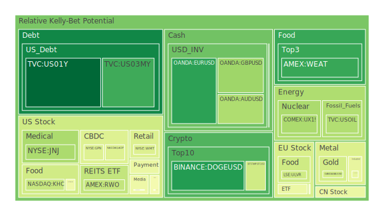
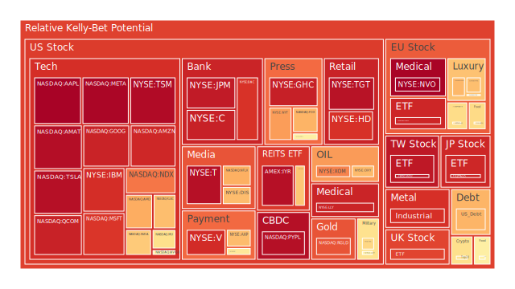
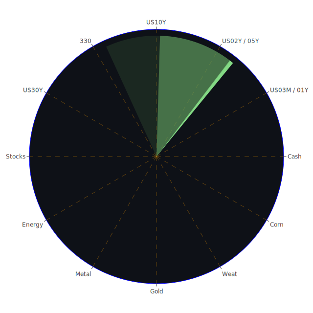

# 投資商品泡沫分析

## 美國國債

近期，美國國債收益率呈現上升趨勢，特別是10年期國債收益率已達到4.60%。這種現象可能反映了市場對未來通貨膨脹和經濟增長的預期上升。從經濟學角度來看，當投資者預期通貨膨脹上升時，債券收益率通常會上升，以補償未來貨幣購買力的下降。社會學上，投資者情緒可能受到近期經濟數據和政策預期的影響，導致資金從避險資產轉向風險資產。心理學上，投資者可能對未來經濟前景抱有更為樂觀的態度，減少對國債的需求。博弈論觀點下，各國央行的貨幣政策博弈可能加劇了收益率的波動。

## 美國零售股

根據近期新聞，美國新車銷售在2024年持續攀升，受益於庫存回升和混合動力車的需求增長。這對於零售業特別是汽車零售商來說是積極的信號。經濟學上，消費者支出的增加反映了經濟的健康發展。社會學上，消費趨勢可能受到消費者信心改善的影響。心理學上，消費者對未來收入和就業的樂觀預期可能推動購買行為。博弈論角度，零售商之間的競爭可能加劇，促使他們提供更具吸引力的產品和服務。

## 美國科技股

美國科技股近期表現強勁，特別是與人工智慧（AI）相關的公司。新聞報導指出，微軟計劃在今年投入800億美元建設AI數據中心，顯示對AI領域的重視和投入。經濟學上，科技創新的投資可能帶來長期的經濟增長。社會學上，科技的進步可能改變人們的生活方式和工作方式。心理學上，投資者對科技行業的未來增長抱有高度期望，可能導致股價上漲。博弈論角度，科技公司之間的競爭可能促進創新和市場份額的重新分配。

## 美國房地產指數

美國房地產市場出現了一些調整的跡象。30年期固定抵押貸款利率上升至6.91%，這可能對購房需求產生抑制作用。經濟學上，利率的上升通常會降低房地產市場的活力。社會學上，高房價和高貸款成本可能影響年輕一代的住房擁有率。心理學上，潛在購房者可能因為利率上升而推遲購房計劃。博弈論角度，房地產開發商可能需要調整策略，以應對市場需求的變化。

## 加密貨幣

比特幣價格預計在2025年達到150,000美元，以太幣突破8,000美元，反映出市場對加密貨幣的強勁需求。新聞報導指出，BlackRock的比特幣ETF出現了創紀錄的單日資金流出，這可能反映出市場的短期波動。經濟學上，加密貨幣被視為新興的避險資產或風險資產。社會學上，對傳統金融體系缺乏信任的群體可能更傾向於投資加密貨幣。心理學上，市場的高波動性可能吸引風險偏好型投資者。博弈論角度，加密貨幣市場的參與者之間存在高度的不確定性和競爭。

## 金/銀/銅

黃金和白銀價格保持穩定，黃金價格約為2632美元，白銀價格約為29美元。金銀比率呈現上升趨勢，這可能意味著市場對避險資產的需求增加。銅價則略有下跌，可能反映了市場對未來工業需求的擔憂。經濟學上，貴金屬價格受供需和貨幣政策影響。社會學上，全球政治不確定性可能推動對貴金屬的需求。心理學上，投資者可能將貴金屬視為對抗通脹和貨幣貶值的工具。博弈論角度，各國央行的黃金儲備策略可能影響全球黃金市場。

## 黃豆/小麥/玉米

農產品市場受到多重因素影響。新聞報導提到，加拿大元連續第六週下跌，部分原因是中國經濟放緩，可能影響農產品出口。經濟學上，供需變化和天氣條件是主要影響因素。社會學上，消費者飲食習慣的改變可能影響農產品的需求。心理學上，市場預期和投機活動可能導致價格波動。博弈論角度，各國之間的農產品貿易政策和補貼可能引發市場競爭。

## 石油/鈾期貨UX!

石油價格近期有所上漲，但仍受供需平衡和全球經濟前景的影響。鈾期貨價格則顯示出市場對核能需求的預期上升。新聞報導指出，意大利正在與SpaceX討論15億美元的安全通信服務合約，這可能間接影響能源市場。經濟學上，能源價格對全球經濟有著深遠影響。社會學上，環保意識的提升可能推動對清潔能源的需求。心理學上，地緣政治風險可能導致油價波動。博弈論角度，產油國之間的協調和競爭將影響市場供給。

## 各國外匯市場

外匯市場近期受到多重因素影響。澳元兌美元匯率預計下跌至0.60，美國對華關稅政策的不確定性增加了市場風險。加元連續下跌，部分原因是對中國經濟放緩的擔憂。經濟學上，匯率受到利率差異、經濟增長和國際貿易的影響。社會學上，國際投資者的資金流動會影響匯率。心理學上，市場情緒和風險偏好是重要因素。博弈論角度，央行之間的貨幣政策博弈對匯率有直接影響。

## 各國大盤指數

全球股市表現各異。美國股市在科技股的帶動下有所回升，歐洲股市受到能源政策和地緣政治的影響。新聞報導指出，投資者關注特朗普的政策對市場的影響。經濟學上，股市是經濟健康程度的晴雨表。社會學上，投資者的集體行為會放大市場的波動。心理學上，市場的樂觀或悲觀情緒會引導投資決策。博弈論角度，投資者之間的信息不對稱和策略互動影響市場走向。

## 美國半導體股

半導體行業繼續受益於AI和雲計算的需求增長。新聞報導指出，iPhone供應商TDK推出新電池以跟上AI的步伐。經濟學上，技術進步和需求增長驅動行業發展。社會學上，全球數字化轉型加速了對半導體的需求。心理學上，投資者對科技行業的高預期可能導致估值上升。博弈論角度，企業之間的研發競賽和市場佈局決定了行業格局。

## 美國銀行股

近期，美國銀行股受到多重挑戰。新聞報導稱，投資者對美國銀行股的風險偏好下降，部分原因是經濟前景的不確定性和監管政策的變化。經濟學上，銀行業的利潤受利率和貸款需求影響。社會學上，消費者信貸需求和儲蓄行為影響銀行業務。心理學上，投資者可能擔心經濟衰退風險，影響銀行股表現。博弈論角度，銀行之間的競爭和與金融科技公司的合作或競爭影響行業未來。

## 美國軍工股

在全球地緣政治緊張局勢下，軍工股可能受益。新聞報導顯示，義大利正在與SpaceX討論安全通訊服務合約，這可能帶動軍工行業的投資。經濟學上，軍事支出增加可能帶動相關產業的增長。社會學上，安全需求提升影響政府預算分配。心理學上，投資者可能將軍工股作為避險資產。博弈論角度，國防企業之間的競標和國際合作影響市場份額。

## 美國電子支付股

電子支付行業持續發展。新聞報導提到，微軟計劃投入巨資建設AI數據中心，這可能促進電子支付和金融科技的發展。經濟學上，數字經濟的增長推動了電子支付需求。社會學上，消費者習慣逐漸轉向無現金交易。心理學上，安全便捷的支付方式提升了用戶體驗。博弈論角度，支付平台之間的競爭和合作將決定市場格局。

## 美國藥商股

醫藥行業受到政策和市場需求的影響。新聞報導指出，生物製藥公司可能受益於政府對醫療研發的投入。經濟學上，人口老齡化和健康意識提升帶動醫藥需求。社會學上，公共衛生事件可能影響藥品需求結構。心理學上，投資者對新藥研發的期待可能推高股價。博弈論角度，藥企之間的專利競爭和研發投入影響市場地位。

## 美國影視股

影視行業面臨數位化轉型和內容競爭。新聞報導提到，流媒體平台之間的競爭加劇。經濟學上，訂閱模式和廣告收入是主要盈利方式。社會學上，觀眾的觀看習慣影響內容製作方向。心理學上，明星效應和口碑效應影響票房和收視率。博弈論角度，影視公司之間的版權競爭和合作關係影響市場份額。

## 美國媒體股

媒體行業受制於廣告市場和數位化挑戰。新聞報導稱，媒體公司需要適應新的技術和消費者行為。經濟學上，廣告收入和付費內容是主要收入來源。社會學上，資訊傳播方式的轉變影響媒體行業的發展。心理學上，觀眾的注意力經濟影響媒體內容製作。博弈論角度，傳統媒體與新媒體的競爭將決定行業未來。

## 石油防禦股

受能源市場波動影響，石油防禦性股票可能受到投資者關注。經濟學上，能源價格的不確定性可能推動投資者尋求穩定的防禦性資產。社會學上，環境保護意識提高可能影響對傳統能源公司的投資。心理學上，市場風險加大時，投資者可能更傾向於防禦性股票。博弈論角度，企業需要在能源轉型中找到平衡。

## 金礦防禦股

在經濟不確定性時期，金礦防禦性股票通常受到青睞。經濟學上，金價上漲通常推動金礦公司的收益。社會學上，避險情緒提升可能增加對黃金的需求。心理學上，投資者尋求資產保值，可能增加對金礦股的投資。博弈論角度，金礦企業之間的資源競爭和生產成本控制將影響其競爭力。

## 歐洲奢侈品股

歐洲奢侈品行業受到全球消費者需求的影響。新聞報導指出，勞力士零售價格在2025年上漲，而二手價格繼續下跌。經濟學上，奢侈品需求與高淨值人群的消費能力相關。社會學上，消費者對品牌的認同和文化影響購買行為。心理學上，炫耀性消費和身份認同驅動奢侈品市場。博弈論角度，奢侈品品牌之間的競爭在於品牌形象和產品創新。

## 歐洲汽車股

歐洲汽車行業面臨新能源轉型和市場競爭。新聞報導提到，德國汽車製造商受冬季天氣影響生產。經濟學上，新能源汽車政策和市場需求影響汽車行業。社會學上，環保意識提升推動電動車需求。心理學上，消費者對品牌和技術的偏好影響購買決策。博弈論角度，汽車廠商之間的技術競爭和市場佈局決定行業走向。

## 歐美食品股

食品行業受消費者需求和成本結構影響。新聞報導稱，可口可樂等企業面臨成本上升和健康意識提高的挑戰。經濟學上，原材料價格和供應鏈問題影響企業盈利。社會學上，健康飲食趨勢影響產品研發和市場策略。心理學上，品牌忠誠度和產品認知度影響消費者選擇。博弈論角度，食品企業需要在創新和成本控制上取得平衡。

# 宏觀經濟傳導路徑分析

全球經濟正處於復蘇與風險並存的階段。主要央行的貨幣政策、地緣政治風險、國際貿易關係等都對市場產生深遠影響。美國聯準會的政策動向影響全球資金流向，利率上升可能導致資本從新興市場回流至發達國家。中國經濟的放緩可能影響全球貿易和大宗商品需求。歐洲的能源政策和政治局勢也影響投資者信心。

# 微觀經濟傳導路徑分析

企業層面的決策和行業競爭態勢對市場有直接影響。科技公司的研發投入和創新能力決定其市場地位。消費者的行為和偏好改變對企業營收產生影響。供應鏈的變化和成本管理也是企業需要考量的關鍵因素。行業內的併購和合作會改變競爭格局。

# 資產類別間傳導路徑分析

不同資產之間存在著相互影響的關係。例如，利率上升可能導致債券價格下跌，進而影響股市和房地產市場。貴金屬價格的上升可能反映市場避險情緒，對股票市場產生壓力。外匯市場的波動會影響進出口企業的盈利能力。能源價格的變化影響相關行業的表現，同時也影響消費者支出。

# 投資建議

在當前市場環境下，投資者應該關注全球宏觀經濟形勢，密切留意貨幣政策和地緣政治的變化。分散投資風險，選擇具有穩健基本面的企業。對於具有成長潛力的科技和新能源行業，可適度增加配置。同時，需警惕市場可能出現的泡沫風險，避免過度投機。

穩健型配置（50%）：

- **美國國債**
- **金礦防禦股**
- **必需消費品行業**

成長型配置（30%）：

- **美國科技股**
- **新能源行業**
- **醫療保健行業**

高風險型配置（20%）：

- **加密貨幣**
- **新興市場股市**
- **創新科技初創企業**

# 風險提示

投資有風險，市場總是充滿不確定性。我們的觀點僅供參考，投資者應根據自身的風險承受能力和投資目標，做出獨立的投資決策。
 
Daily Buy Map:

 
Daily Sell Map:

 
Daily Radar Chart:

 
