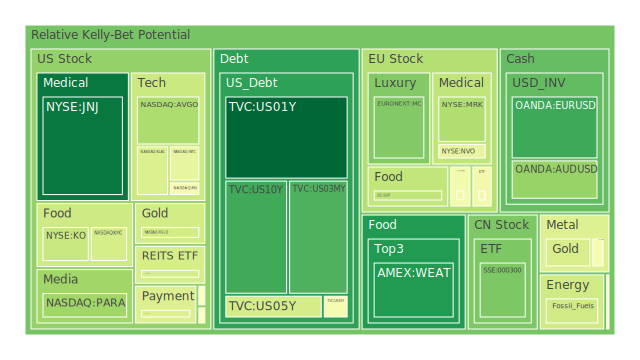
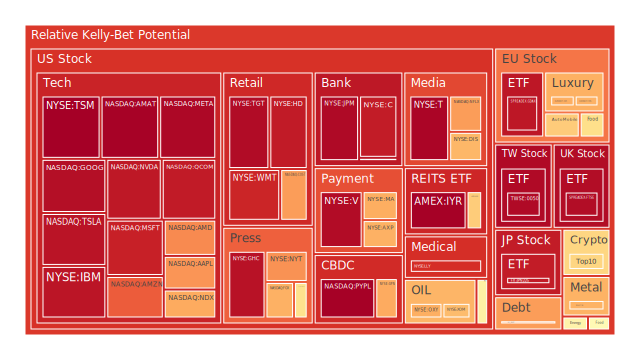
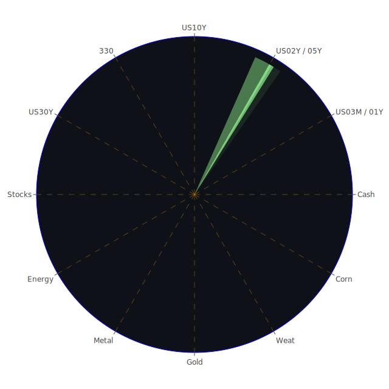

# 投資商品泡沫分析

**美國國債**

近期美國國債的泡沫指數有所上升，特別是在短期債券方面。由於市場對聯準會政策走向的不確定性增加，投資者對利率變動的預期使得短期國債價格波動加劇。

**美國零售股**

受通貨膨脹和消費者支出放緩的影響，美國零售股面臨壓力。沃爾瑪等大型零售商的泡沫指數上升，顯示市場對零售業未來盈利能力的擔憂。

**美國科技股**

科技股的泡沫指數達到高位。微軟、蘋果等公司受益於技術創新，但高估值可能帶來調整風險。投資者需注意市場過度樂觀所帶來的潛在風險。

**美國房地產指數**

房地產市場因抵押貸款利率上升而放緩。房地產投資信託的泡沫指數增加，反映出市場對房地產價格持續上漲的信心減弱。

**加密貨幣**

比特幣和以太坊的泡沫指數攀升，市場投機情緒高漲。但監管風險和市場波動性仍是主要風險因素，需謹慎對待。

**金/銀/銅**

貴金屬的泡沫指數上升，顯示避險需求增強。銅價波動受全球經濟增長預期影響，工業需求的不確定性帶來價格波動。

**黃豆 / 小麥 / 玉米**

農產品價格上漲，泡沫指數提高。氣候變化和供應鏈問題可能導致供給短缺，推動價格進一步上揚。

**石油/ 鈾期貨UX!**

石油價格受地緣政治緊張局勢影響，泡沫指數上升。鈾期貨價格波動，加強對能源安全的關注。

**各國外匯市場**

主要貨幣對，如歐元/美元和美元/日元的波動加劇。貨幣政策差異和經濟基本面變化是主要驅動因素。

**各國大盤指數**

歐美主要股指的泡沫指數上升，市場對經濟前景的樂觀情緒與宏觀經濟風險並存。

# 宏觀經濟傳導路徑分析

全球通貨膨脹壓力和貨幣政策收緊對資產價格產生顯著影響。央行加息可能導致資金從風險資產流向避險資產，影響股票和債券市場。

# 微觀經濟傳導路徑分析

企業盈利預期下調和成本上升壓力增加，影響個別行業和公司的表現。供應鏈中斷和勞動力短缺等問題對微觀經濟產生負面影響。

# 資產類別間傳導路徑分析

不同資產之間存在相關性，如股債市場的資金輪動，大宗商品價格對通脹預期的影響，以及匯率變動對出口型企業的盈利影響。

# 投資建議

**穩健型**

- 美國國債：40%
- 黃金：30%
- 高評級企業債券：30%

**成長型**

- 科技股：50%
- 新能源板塊：30%
- 消費品行業：20%

**高風險型**

- 加密貨幣：50%
- 新興市場股票：30%
- 高收益債券：20%

# 風險提示

投資有風險，市場總是充滿不確定性。我們的建議僅供參考，投資者應根據自身的風險承受能力和投資目標，做出獨立的投資決策。
 
Daily Buy Map:

 
Daily Sell Map:

 
Daily Radar Chart:

 
