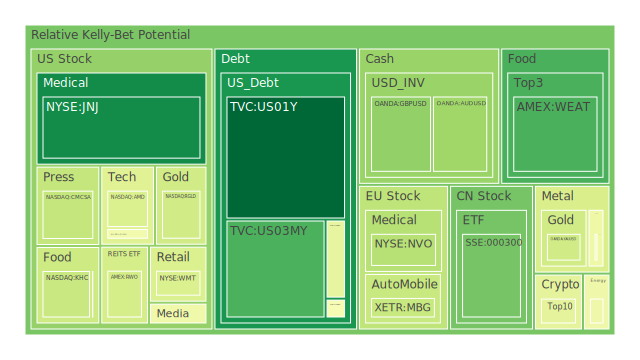
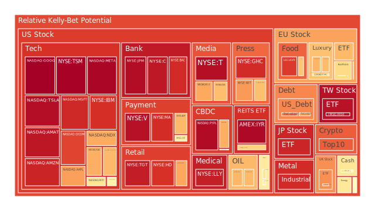
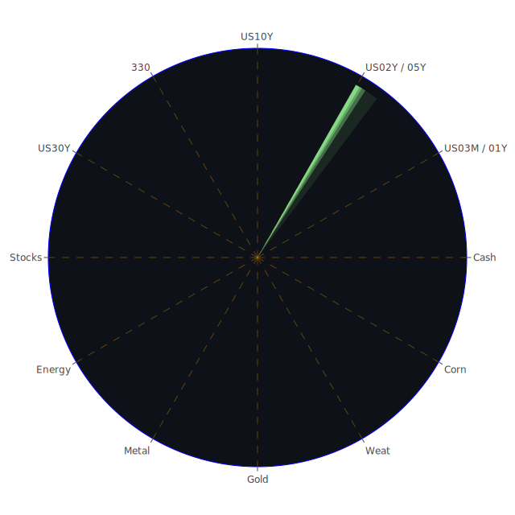

# 投資商品泡沫分析

自2025年初以來，全球金融市場看似動盪不安；若從新聞面觀察，可以看到多數消息對市場的負面衝擊仍居主導地位。根據目前的觀察視角，整體經濟的表象並非單點崩解，而是多處隱憂疊加，包括房地產、新興市場流動性、以及全球政治局勢。此外，美國聯準會（FED）總資產以及各種資金工具的變化，都顯示市場對未來政策方向存在高度的不確定性，尤其在利率是否會延後降息與國際緊張局勢下產生的地緣政治風險之間交錯影響。以下將就各投資商品，按照當前的泡沫程度與風險走勢，做一簡要的論述與連動性探討。

## 美國國債
美國國債近期的長短天期殖利率走勢出現明顯變化。報告中顯示，30年期美債殖利率持續向上攀升至4.93左右，10年期約4.69，5年期約4.46，2年期約4.29，1年期則在4.18上下波動。這其中可以從幾個面向去解讀：  
1. **經濟學**：正常情況下，若長天期殖利率高於短天期殖利率不少，市場可能對未來經濟成長抱持一定信心。然而，目前整體美債曲線由於先前經歷長期的倒掛，近幾週慢慢出現恢復跡象，但距離完全「健康的向上斜率」仍有一段距離。  
2. **社會學**：美國國債一直是全球資金與各國央行的「避風港」。面對新聞中不斷出現的負面消息，及其對市場情緒的衝擊，投資人是否重回對國債的信任，將取決於美元流動性、財政狀況，以及全球資金再配置方向。  
3. **心理學**：從投資者的風險偏好來看，美國國債長期以來受到「避險資金」青睞，一旦其他資產泡沫疑慮升高，或地緣政治動盪擴大，投資人常採取資金回流美債的策略。  
4. **博弈論**：在與其它國家進行貨幣、利率、經濟政策互動時，美國國債利率的調整常成為籌碼之一；市場目前密切觀察FED後續是否繼續「鷹派」，亦或對可能的衰退隱憂持保守態度。  

在泡沫風險方面，短天期與中長天期殖利率相比，雖然有逐漸「不那麼倒掛」的趨勢，但整體來看，**此時美債**在D1、D7、D14、D30風險分數都介於約0.27至0.57不等，顯示市場對於美債仍有一定程度的信心。然而，FED在2025-01-09的關鍵數據顯示，縮表持續、BTFP與Discount Window雖然都不算高，但市場對利率的走向仍存高度猜測。**若政府債務比例上升且未有長期財政整頓計畫，長期殖利率可能持續上行**，促使投資人對國債合理價格重新評估。

## 美國零售股
美國零售股大致包括消費必需品、服飾、耐用商品等板塊。新聞提及一些大型零售公司（例如沃爾瑪）在最近展現較明顯的負面因素：根據報告，沃爾瑪（WMT）先前價格在90-91美元區間震盪，泡沫分數在短期內大幅增加（D30約0.77上下），暗示市場對零售景氣較為謹慎。  
1. **經濟學**：若通膨壓力未顯著下降，或者失業率上升，消費者信心下降將衝擊零售行業獲利。  
2. **社會學**：加拿大總理突如其來的辭職新聞引發對北美地區政治風險及可能後續帶來的消費者信心變數。  
3. **心理學**：消費者多在通膨與就業的相互角力中拉鋸，若收入無法追上物價，日常消費與非必需消費會出現下修。  
4. **博弈論**：零售業價格戰也會因大型連鎖間的競爭加劇而全面影響整個板塊定價結構。  

短期來看，在泡沫評估裡，零售股例如沃爾瑪的D1與D7風險分數逼近0.42至0.59，幅度屬中高階。**代表市場對零售板塊泡沫並不極度警戒，但也不見樂觀**；仍須關注隨季節變動的銷售數據。

## 美國科技股
近年科技股對全球資金的吸引力有增無減，無論是半導體、雲端、電動車、AI等題材，都曾帶動各種投資熱潮。報告顯示，某些科技股（例如MSFT、GOOG、META、NVDA、AMD等）其D1、D7到D30風險分數都有高檔現象，例如META約0.97、GOOG約0.98、NVDA約0.68-0.76，TSLA約0.95-0.96，表示市場對此類成長型公司依舊擁有巨大期望，同時也在該領域聚集了更多泡沫風險。  
1. **經濟學**：利率變動對成長股的估值具有顯著影響。若FED政策趨於保守或維持較高利率，科技股的未來現金流折現成本增高，估值可能受壓。  
2. **社會學**：新聞中對AI技術、5G、元宇宙等概念反覆強調，一旦資金退潮，對投機者來說便容易造成估值雪崩。  
3. **心理學**：股民常有「FOMO」(Fear Of Missing Out) 心理，一旦市場炒作熱絡，散戶與投資機構會跟進買入；但只要出現估值不及預期，恐慌亦可能迅速擴散。  
4. **博弈論**：科技龍頭公司與主管機關之間對「反壟斷」與「國家安全」的利益角力持續。近期新聞特別指出，美國可能加強限制Nvidia高階AI晶片對部分國家的出口，顯示地緣政治會干擾科技股的市值走向。  

**整體來看**，科技股依舊處於明顯的高估值區間，很多在D1或D7的風險分數超過0.9，對應其股價仍高企，顯示**其泡沫風險並未完全釋放**，須慎防連鎖性拋售或短期獲利了結造成的震盪。

## 美國房地產指數
全球房地產市場脆弱性逐漸加大，美國不動產亦不例外。從RWO（全球房地產ETF）或VNQ（美國房地產ETF）等指標來看，其D1、D7至D30顯示在0.39-0.63之間，且最近30年期房貸利率攀升至6.91%的高點。  
1. **經濟學**：房貸利率往往是房市溫度計；若長期利率高企，購屋成本上升，需求方下滑，可能形成新一輪房市壓力。  
2. **社會學**：大城市租金依舊高昂，根據部分新聞顯示，加拿大總理辭職可能造成政治動盪並影響美加邊境城市的移民與房市需求動向。  
3. **心理學**：許多消費者對房地產存在「房價不會跌太多」的執念，但在全球經濟不穩的背景下，若失業率轉差，拋售潮還是可能出現。  
4. **博弈論**：房地產投資機構在通膨與利率博弈下，往往透過槓桿或套利操作，也加深市況波動。  

**目前看來**，房地產市場短期較為不明朗。根據FED統計，美國商業不動產逾期率高企；若經濟前景惡化，商用與住宅端都可能面臨壓力。

## 加密貨幣
Bitcoin（BTC）、Ethereum（ETH）及其他數位貨幣在近幾年劇烈波動，常與科技股連動。報告顯示BTC（BITSTAMP:BTCUSD）現報約9萬5千至9萬6千美元，D1接近0.84，ETH（BINANCE:ETHUSD）則在約3300-3600美元區間，D1則落在0.53-0.60。  
1. **經濟學**：許多人視加密貨幣為對抗法幣通膨的替代資產，但FED緊縮與利率高企，可能打壓該類高波動投資。  
2. **社會學**：若國際形勢動盪，開發中國家或地區的資本外流常湧入加密領域。近期新聞裡，幾則亞洲新興市場政局的不確定性，可能帶動數位貨幣一波短暫需求。  
3. **心理學**：投資者在加密市場常抱持「一夜暴富」與「快速翻倍」的期待，但隨著全球監管加嚴，加密市場心態逐漸偏謹慎。  
4. **博弈論**：各國政府與加密貨幣交易所間對監管的談判仍在持續。若與當地政策協商破裂（例如新的交易稅或限制），交易量可能驟減。  

從數據觀察，加密貨幣的中短期風險指標依舊相當高；**BTC D30大約0.66左右，ETH D30則在0.43上下**。此顯示雖有機構資金進入，但泡沫風險猶存。

## 金/銀/銅
黃金（XAUUSD）報價逐步攀升至2640-2660美元區間，D1、D7、D14、D30風險分數約在0.39-0.40區間，顯示市場對黃金的需求似乎平穩但仍有隱憂；白銀（XAGUSD）約29-30美元區間，風險分數更高，約0.74-0.90，波動度較金更激烈。銅（COPPER）則受製於全球經濟週期變數與中國需求。  
1. **經濟學**：黃金與銀的需求大部分來自投資、工業、珠寶、中央銀行儲備。若世界動盪或實質利率下滑，金銀需求易攀升；但若利率居高不下，黃金「零息」劣勢可能抵銷部分避險需求。  
2. **社會學**：負面新聞充斥，如衝突、政治動盪往往刺激金屬避險行情。  
3. **心理學**：金銀向來是投資人面對不確定時的「安全感」來源，一旦恐慌指數急劇上升，往往有資金追捧。  
4. **博弈論**：金銀在全球貿易與貨幣體系中常扮演對沖角色，而銅則被視為工業金屬「銅博士」，預測全球製造業景氣。  

從GOLD OIL RATIO與GOLD COPPER RATIO來看，黃金對原油與銅的比率都上揚，相比去年增幅顯著（去年黃金對石油比大約28上下，現已超過36，對銅比率亦從500多升至600多）。這可能象徵市場對工業生產前景不若對黃金價值這般樂觀，金屬防禦性能升高。

## 黃豆 / 小麥 / 玉米
在新聞部分，針對農產品消息並不多，但從價格與泡沫分數可見一斑：小麥基金（WEAT）、黃豆基金（SOYB）、玉米基金（CORN）這些ETF皆呈現不同程度的風險指標。其中WEAT在D7約0.14-0.15，D30攀至0.40以上，SOYB與CORN則都在0.49-0.64上下浮動。  
1. **經濟學**：糧食與能源互相影響；若石油價格走升，生質能源需求增加可能推動農產品需求；而通膨與天氣災害也會影響農作物產量。  
2. **社會學**：地緣衝突可能造成農產品出口受阻，如中東、俄烏地區的國際航運或糧食供應鏈中斷，都會推升價格。  
3. **心理學**：投資人對「飢荒」或「糧價報復性上漲」的恐慌情緒，在市場緊張時容易擴大，並導致農產品期貨價格劇烈波動。  
4. **博弈論**：跨國農業巨頭與進出口國家間定價角力常令農產品期貨出現偏離實際供需的現象，成為對衝基金操作的溫床。  

考量到近期全球氣候異常與新聞裡提到的非洲或亞洲部分地區社會動盪，若乾旱或洪水持續惡化，糧價仍有結構性上漲風險，需密切追蹤。

## 石油 / 鈾期貨UX!
原油價格在73-74美元區間波動，短線內上下幅度較過去數月收斂，但D30風險分數約0.19-0.22，並不算高；鈾期貨（UX1!）則顯示D1、D7、D14風險分數分別在0.32-0.37左右，長期需求預期較穩定。  
1. **經濟學**：能源市場與全球景氣、地緣政治緊密相關。若世界經濟成長放緩，原油需求跟著減少；但若中東或產油國地區出現衝突，可能迅速推升油價。  
2. **社會學**：新能源崛起與環保意識抬頭，對傳統石化能源有一定替代作用。然而短期要大幅降低原油依賴並不容易，需求曲線仍有剛性。  
3. **心理學**：原油交易者習慣性關注「供應短缺」或「庫存過剩」訊號；若任何一方出現極端波動，市場反應往往放大。  
4. **博弈論**：產油國與消費國之間的協商常影響OPEC+減產或增產決策，並牽動市場預期。  

鈾期貨涉及核能發電議題；由於全球減碳需求增加，部分國家正在重新思考核電。**鈾的長期需求曲線**可能溫和成長，短期受地緣政治與核能政策影響波動。

## 各國外匯市場
歐元（EURUSD）目前約1.03上下，英鎊（GBPUSD）1.23-1.25區間，澳幣（AUDUSD）0.62，日圓（USDJPY）高達158。  
1. **經濟學**：美元在高利率環境下保持強勢，令非美貨幣普遍承壓；日本持續超寬鬆貨幣政策，日圓被顯著低估。  
2. **社會學**：加拿大政局動盪若延續，可能衝擊加元及北美整體貨幣走勢。  
3. **心理學**：匯率投機者往往追逐利差，特別在美元利率居高時，短線熱錢傾向湧入美元市場。  
4. **博弈論**：全球央行互動與地緣政治直接影響外匯市場的干預與資本管制。  

**由於美國10年與2年期利差仍然侷限在一段較小範圍內，美債在全球資本心中仍具吸引力**，造成非美貨幣近期動能相對不足。

## 各國大盤指數
美國NASDAQ-100（NDX）與標普500（S&P 500）都顯示高風險；NASDAQ-100 D1約0.70上下，S&P 500某些成分股或板塊的風險更高。歐洲主要股指（如GDAXI、FCHI、FTSE）也同樣受到通膨與能源問題影響，雖然之前短暫反彈，但整體泡沫風險依然存在。  
1. **經濟學**：整體股指走勢大多受到預期利率、高估值科技股與企業獲利情況牽動。若後續財報不如預期，指數恐回調。  
2. **社會學**：全球負面新聞壟罩，下行風險若遭遇投資人信心動搖，可能產生較大連鎖拋售。  
3. **心理學**：對大盤指數來說，ETF與被動投資資金量龐大，一旦市場信心瓦解，流出速度同樣驚人。  
4. **博弈論**：主要經濟體之間的關稅、科技禁令等，也常成為左右全球大盤趨勢的關鍵。

## 美國半導體股
資料顯示NVDA、AMD、INTC、KLAC等公司在近期皆有不小波動。NVDA風險指標D1約0.68-0.77不等，AMD也有0.70上下，INTC約0.48-0.57。半導體產業一方面受惠於AI浪潮與自動駕駛需求，但另一方面也受到全球產能的分散、各國的補貼競賽與地緣管制政策影響。  
1. **經濟學**：半導體行業是週期性顯著產業，當需求放緩或陷入供需失衡時，獲利會劇烈變動。  
2. **社會學**：地緣風險與供應鏈移轉，是此產業未來幾年最重要的關鍵變數；在東南亞、北美與歐洲等地分散生產，對人力與基礎設施要求很高。  
3. **心理學**：投資者對「AI晶片」與「超級電腦」的想像，推高了如Nvidia、AMD的股價。若未來數據顯示成長不及市場炒作預期，泡沫可能釋放。  
4. **博弈論**：政府補貼、關稅與競爭對手間的技術專利較勁，都會形成半導體股價的市場博弈。  

目前半導體股漲多回檔風險不容忽視，市場正在權衡「未來潛力」與「短期獲利」的拉鋸。

## 美國銀行股
以JPM、BAC、C等為主的銀行股，在經歷2023-2024年的流動性壓力之後，近期在泡沫風險數據裡顯示較高的分數（例如JPM接近0.95上下，BAC也曾衝至0.90-0.82波動）。  
1. **經濟學**：銀行業獲利取決於淨利差、信貸資產品質，以及壞帳準備金。FED持續縮表與利率高企，同時市場對貸款逾期的疑慮仍在升溫。  
2. **社會學**：部分新聞提及各國房地產或商業不動產壓力高漲，銀行若對此部位過度曝險，風險會快速蔓延。  
3. **心理學**：投資者仍擔憂「銀行倒閉」的陰影，特別是中小型銀行或區域銀行。大型銀行相對穩健，但也會承接市場系統性風險。  
4. **博弈論**：銀行同業之間的競爭、與FED的政策交織，左右著銀行流動性與穩定度。  

銀行股雖相對比科技股便宜，但**近年因金融政策與經濟面可能衰退**，風險評估不可忽視。

## 美國軍工股
軍工股如LMT、NOC、RTX等，風險評分大約0.54-0.58不等，對應其股價尚算平穩。地緣危機時常推動軍工需求，但此類標的有時受聯邦政府預算與政治因素牽動。  
1. **經濟學**：軍工產業依賴政府財政支出，如聯邦政府舉債成本攀升，長期可能影響軍費。  
2. **社會學**：社會對軍事衝突的厭惡情緒，若產生廣泛反戰浪潮，也可能影響政治端對軍工採購的正當性。  
3. **心理學**：投資者往往將軍工視為地緣政治的對沖標的，一旦出現衝突，需求上揚。  
4. **博弈論**：各國之間軍備競賽亦是一種「威懾—反威懾」的博弈，預算與技術發展速度是一大關鍵。  

短期軍工股並無明顯泡沫，但若地緣衝突升溫，股價可能迅速脫離估值區間。

## 美國電子支付股
MA、V、PYPL、GPN等電子支付公司，風險分數普遍較高，部分超過0.85。此代表高利率環境衝擊成長性，且市場對消費端支出力道抱持不確定。  
1. **經濟學**：電子支付業務規模常伴隨經濟增長與線上交易需求。若消費減緩，對其手續費收入不利。  
2. **社會學**：網購與行動支付趨勢不可逆，但市場飽和度與競爭激烈。  
3. **心理學**：投資人對「FinTech」想像空間大，容易形成過度投機。  
4. **博弈論**：支付巨頭的手續費率、跨國併購與政府監管也牽動該領域整合。  

若FED維持緊縮，電子支付股可能承壓；短線上若出現經濟衰退或消費力降溫，估值將重新洗牌。

## 美國藥商股
如JNJ、MRK等，疫情後雖關注度下降，但醫藥與保健需求仍在；JNJ風險分數短期大約0.09-0.12之間，相對穩健，MRK則約0.50上下。  
1. **經濟學**：防疫概念股熱度退卻，市場轉向評估藥廠研發管線與長期專利布局。  
2. **社會學**：人口老化趨勢支撐醫藥需求；若醫改政策或藥價管制方式改變，則牽動整個產業利潤。  
3. **心理學**：投資者對此板塊相對保守，將其視為防禦性標的之一。  
4. **博弈論**：政府對藥價壟斷及保險給付的規範，常成為各大藥廠須權衡之因素。  

短期看來，醫藥股相對穩定；若市場大幅震盪，此板塊具一定吸引力作為防禦配置。

## 美國影視股
傳統影視公司面對串流平台競爭，加上廣告市場景氣下降等衝擊。PARA、DIS等在泡沫風險指標裡呈現中高區間（DIS D1約0.66-0.67，PARA D1約0.46-0.47）；迪士尼近期因串流與電影收益波動大。  
1. **經濟學**：消費者可支配所得若減少，娛樂支出縮水，衝擊影視營運。  
2. **社會學**：串流平台之間競爭激烈，傳統媒體收視群持續被瓜分。  
3. **心理學**：投資人對內容創新與IP價值期待頗高，但若新作品不符市場胃口，股價易遭挫折。  
4. **博弈論**：併購與版權交易是該產業博弈焦點，國際版權收入也受各國政策影響。  

影視公司雖然曾在疫情後短暫反彈，但長期方向仍存隱憂。

## 美國媒體股
泛媒體及網路媒體同樣面臨廣告市場起伏與消費習慣轉移；CMCSA、NYT等在D1約0.56-0.73。若景氣低迷，廣告支出勢必下降，拖累媒體收入。  
1. **經濟學**：廣告預算是經濟景氣的指標，一旦企業主縮減行銷支出，媒體營收便立刻受影響。  
2. **社會學**：數位分眾時代，用戶黏著度分散，媒體之間競爭激烈。  
3. **心理學**：讀者或觀眾是否願意付費訂閱，牽涉內容品質與品牌忠誠度。  
4. **博弈論**：大型媒體集團的併購與國際擴張策略，決定未來市場版圖。

## 石油防禦股
如OXY、XOM等，依附在石油生產或整合業務的公司，風險分數約0.67-0.68之間，代表該產業尚稱穩定；但若油價劇烈波動，一樣可能翻轉。  
1. **經濟學**：防禦性較強，是因能源需求具剛性，且超大型公司具有多元業務。  
2. **社會學**：社會輿論傾向減碳與替代能源，長期對石油需求造成壓力。  
3. **心理學**：投資人往往在其他板塊泡沫膨脹時，將資金轉向油氣巨頭以作避險。  
4. **博弈論**：產油國減產、增產以及國際制裁等因素帶來策略性操作。

## 金礦防禦股
如RGLD等黃金相關公司，風險評分普遍在0.64-0.84。金礦股常被視為避險工具，同時也是高波動標的。若金價繼續走升，金礦股可望獲益，但仍需提防金價突然翻轉。  

## 歐洲奢侈品股
歐洲奢侈品（MC、KER、RMS等）在報告顯示其泡沫風險不容忽視，如RMS、KER D1約0.67-0.68上下，意味該板塊短期需求仍在，但存在高估疑慮。若中國或其他新興市場消費力道減弱，衝擊會很快浮現。

## 歐洲汽車股
如BMW、MBG等，風險指標約0.47-0.58。歐洲經濟在能源危機與中國市場需求不確定之下，這些汽車股前景複雜。若全球供應鏈持續不穩，可能干擾生產成本與銷售。

## 歐美食品股
包含KHC等，其泡沫風險約0.38-0.42。食品行業受大宗原物料成本與運輸費影響，短線波動雖小，但長線利潤率也不太高；屬防禦性標的範疇。

---

# 宏觀經濟傳導路徑分析

從空間維度（Spatial）來看，中美歐美等主要經濟體之間，關稅政策、貿易壁壘、地緣衝突都在影響全球資金流向。美國國債與美元作為世界主要儲備貨幣地位，使得許多地區資本在不確定時選擇流入美債避險。  
從時間維度（Temporal）來看，FED縮表、利率走勢及國債殖利率曲線是市場判斷未來幾季走向的重要前瞻。若下一季的就業數據及通膨仍難下降，市場將預期FED再度轉向鷹派，可能造成股市與高收益債的再次震盪。  
從概念維度（Conceptional）來看，市場不僅關注傳統經濟理論中「供需」與「貨幣」之互動，也融入地緣政治、新興市場的金融脆弱性、以及投資人行為心理的非理性因素。因此可以用正反合的方式來做「三位一體」的動態詮釋：  
- **正面**：全球經濟科技創新持續，使長期成長故事仍具潛力；投資人預期AI、新能源、醫療科技等領域將有突破。  
- **反面**：地緣政治、國債飆升、通膨率居高不下、民粹抬頭等因素隨時可阻礙經濟復甦；區域性衝突更令市場恐慌激增。  
- **綜合**：在政策、科技、社會需求等交互影響下，市場經常出現利多與利空並存的場景；資金在各資產之間輪動，導致泡沫可能被掩蓋或延後爆發。

---

# 微觀經濟傳導路徑分析

在企業層級，利率上行先影響融資成本，接著企業投資意願下降或轉向成本更低的地區。同時消費者支出若受就業與通膨雙壓，企業產品銷量不佳，營收與獲利便衰退，股價也遭殃。這些惡性循環又會進一步壓制金融市場流動性，造成信貸收緊。

---

# 資產類別間傳導路徑分析

通過前述三位一體正反合的整理，可以從以下幾點捕捉各資產之間的「漣漪效應傳導路徑」：  
1. **美債利率↑ → 股票估值↓**：利率升高讓未來現金流折現更保守，成長股首當其衝，造成科技板塊大幅震盪。銀行、保險等金融股相對收益空間增大，但若壞帳攀升或資本不足，也會有系統性風險。  
2. **能源與大宗商品 → 新興市場貨幣**：能源價格若走高，新興市場進出口結構易被衝擊，尤其原物料依賴度高的國家，其匯率易受波動，進一步影響債券與股票市場資金配置。  
3. **高估值科技股 → 加密貨幣**：投機資金在科技股獲利回吐時，部分轉向加密貨幣等高波動市場；但若監管收緊，也可能快速逃離。  
4. **房地產 → 金融股**：若房市走弱，銀行壞帳攀升，影響金融股獲利；資金因擔憂流動性風險，可能轉向黃金或國債等避險標的。  
5. **半導體 → 汽車與高階工業**：若AI與自動駕駛需求增溫，帶動晶片廠盈利，同時帶動電動車產業與相關高階製造業。但若消費需求轉弱，成也半導體、敗也半導體。  

這些「相位差」在120度附近，理想上可構成分散風險的投資組合，但實際市場環境中，往往會因流動性突變而變得相對或同向波動，因此需仔細衡量。

---

# 投資建議

綜合上述信息航母式的多維度觀察，以下將給出穩健、成長、高風險三大類配置，比例總和為100%。建議投資人根據自身風險承受能力與投資目標，自行斟酌：

1. **穩健型配置（約40%）**  
   - **美國投資級公司債（15%）**：利率雖高，但違約風險較低；適度鎖定當前殖利率，兼具保本與收益。  
   - **大型藥廠股（15%）**：如JNJ等，防禦性高、泡沫風險指數相對低，在風雨飄搖的市場擁有穩定分紅與需求。  
   - **黃金現貨或金礦ETF（10%）**：地緣政治與股市動盪時作避險；雖短期波動難免，但長期可作分散風險之用。

2. **成長型配置（約40%）**  
   - **半導體領導股（15%）**：如NVDA、AMD、AVGO、KLAC等，儘管泡沫風險頗高，但AI與車用電子為長期大趨勢，適度佈局以分享成長。  
   - **綜合消費與零售龍頭（15%）**：如部分大眾消費品牌，包含大型連鎖超市或優勢零售（例如COST、WMT），若經濟下行風險可控，此板塊仍有長期成長空間。  
   - **再生能源或核能概念股（10%）**：包含鈾期貨或新能源ETF，全球政策逐步傾向綠能與核能供電需求，長期具發展潛力。

3. **高風險型配置（約20%）**  
   - **加密貨幣（5%）**：BTC、ETH等龍頭，雖風險高，但可作為布局未來數位資產體系的嘗試；務必嚴控部位與做好風險對沖。  
   - **美國小型成長股（5%）**：如部分新創科技、網路媒體或生技公司，潛力與泡沫並存，需審慎選擇。  
   - **高收益債券或新興市場債（10%）**：殖利率高，但信用風險與匯率風險並存，建議精挑穩健的債務人或搭配避險操作。

如此一來，總計40%穩健、40%成長、20%高風險，搭配可以調整微幅比例，期望在分散風險的同時，捕捉一定的成長機會。

---

# 風險提示

投資有風險，市場總是充滿不確定性。本報告透過三位一體的空間、時間、概念性分析，試圖從經濟學、社會學、心理學與博弈論多角度大膽假設。但仍須提醒以下幾點：

1. **經濟衰退與泡沫風險**：全球主要國家債務高企，地緣政治紛爭加劇，若經濟衰退訊號浮現，股債雙殺並非不可能。  
2. **金融槓桿與流動性**：短期資金狂熱（例如科技股或加密貨幣）可能反轉迅速，若使用槓桿加倍放大損失，影響投資組合。  
3. **政策與法規**：各國可能祭出強力法規干預（如出口管制或貨幣管制），使市場走向劇變。  
4. **新聞衝擊**：負面消息（地緣衝突、公司破產、政局動盪）容易在短時間內造成恐慌，建議關注新聞動向並及時應變。  
5. **泡沫分數與指標僅供參考**：D1、D7、D14、D30等值非絕對；市場情緒往往瞬息萬變，應持續追蹤最新數據。

 
Daily Buy Map:

 
Daily Sell Map:

 
Daily Radar Chart:

 
