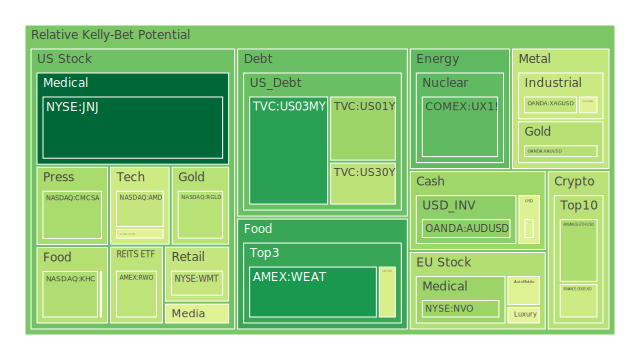
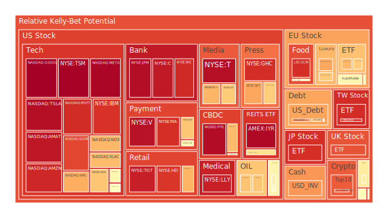
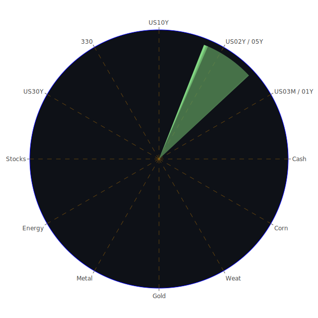

# 投資商品泡沫分析

在近幾日公佈的各種資產泡沫指數資料中，我們可以觀察到許多商品都有不同程度的泡沫風險分數（D1、D7、D14、D30），也可見到部分資產即便價格仍維持一定漲勢，但短期風險因新聞面或市場情緒而出現明顯上升。以下針對重要資產類別進行分析：

## 1. 美國國債（US01Y、US02Y、US05Y、US10Y、US30Y 等）
根據最新報價，1 年期殖利率約在 4.16，2 年期則在 4.27，10 年期大約在 4.69，30 年期約 4.93。面對美國聯準會（FED）對通膨的觀察指標顯示就業市場依舊保持韌性，短債與長債利差雖有一度大幅倒掛，但最近幾周出現了些微彈升跡象，如「US Yield 20Y-03M」或「US Yield 10Y-03M」的負值變少，顯示市場對未來利率走勢的預期產生些許修正。在泡沫評估上，雖然美國國債不太會出現傳統意義的「泡沫」，但若殖利率波動過大，反而可能引發對債券市場流動性的疑慮。近月來，FED 資產負債表仍在收縮，總資產下降趨勢持續，若此趨勢加深，或將導致長端殖利率居高不下，並使得債券價格波動攀升。

歷史類比上，在 2013 年「Taper Tantrum」與 2018 年末的升息路徑中，均出現過長端殖利率急速彈升、引發全球資本市場劇烈波動的案例。如今市場再度面臨可能的「緊縮」或利率維持高檔的情境，宜注意此類風險升溫的可能性。

## 2. 美國零售股
零售相關的個股（例如 WMT、TGT 等）的泡沫分數並不算低，尤其 WMT（目前泡沫指數有接近 0.775 之高）的風險提示並未緩解，預示消費者支出與通膨之間的微妙拉鋸可能衝擊零售商利潤。新聞面來看，近幾日有報導指出，美國消費力道稍顯不振，有些零售商對未來營收預期轉趨保守，通膨以及貸款利率走高都可能壓抑消費意願。此外，就歷史經驗而言，若經濟進入某種衰退風險，零售商往往面臨較大股價修正。

## 3. 美國科技股（AAPL、AMZN、MSFT、GOOG、TSLA、META、NVDA、AMD 等）
近期科技股的泡沫指數依舊偏高：像是 TSLA 約 0.95 左右，NVDA 也高達 0.76-0.77 區間，AAPL、GOOG、META、AMZN 等多檔巨頭都有高於 0.90 的短期泡沫風險分數。不少新聞同時顯示市場對 AI、雲端、電動車等前景抱持高期待，但也有資訊透露「Nvidia 推出新一代 AI superchip 未達投資人預期」、「Biden 政府可能限制更多高階晶片出口」等負面衝擊。歷史上，每當科技創新趨勢遇上利率高檔或監管政策干擾時，都可能引爆市場評價修正，例如 2000 年科技泡沫破裂就伴隨了科技行業前景與政策調整的交互作用。當前雖未必複製 2000 年模式，但在泡沫分數明顯偏高的狀態下，若有宏觀利空或政策風險，科技股有明顯回調壓力。

## 4. 美國房地產指數（RWO、VNQ 等）
全球地產型 REITs 與房地產相關資產估值面臨利率居高的挑戰。例如 VNQ、RWO 之類的指數基金，泡沫風險分數約在 0.63-0.65 左右。近幾年，房貸利率攀升，例如美國 30 年固定房貸利率已逼近 7% 水準；該情況下，房地產融資成本高漲，壓抑住宅及商用地產價格，長期走勢並不樂觀。加上聯準會資金收緊、銀行對房地產貸款的保守審核可能更趨嚴謹，投資者應留意潛在的泡沫風險在堆積。

## 5. 加密貨幣（BTCUSD、ETHUSD、DOGEUSD 等）
比特幣價格依舊在 9 萬美元以上，但泡沫風險（D1、D7、D14、D30 平均超過 0.5）不容小覷。根據市場消息，近期對於經濟數據的解讀使聯準會大幅降息的預期落空，導致比特幣在某些交易時段出現急跌行為，如 1 月 8 日有新聞報導「Bitcoin Tumbles As Positive Job Market Numbers Dim Hopes for Rate Cuts」，顯示市場正在消化更加鷹派的貨幣政策走勢。以歷史參考而言，加密貨幣多次出現短期大漲又大跌的循環，若全球流動性收緊，恐會引發加密市場新一波劇烈波動。

## 6. 金／銀／銅（XAUUSD、XAGUSD、COPPER 等）
黃金目前在 2600-2700 美元區間震盪，泡沫風險約落在 0.39-0.40。白銀（XAGUSD）則升至 30 美元上下，泡沫指數約 0.72-0.80。銅價則在 4.2-4.3 美元左右浮動。近期新聞顯示「Tariff Fears Spark Disconnect in Silver and Copper Markets」等字眼，暗示地緣政治或貿易政策變數都在擾動金屬市場。歷史經驗看，當市場預期衰退並懷疑貨幣寬鬆時，金價常有避險買盤支撐；而銀與銅除投機層面，也牽涉到工業需求狀況。倘若全球製造業景氣轉弱，銀、銅需求可能降低，價格容易承受壓力。

## 7. 黃豆／小麥／玉米（SOYB、WEAT、CORN 等）
根據泡沫分數顯示，WEAT（小麥）、CORN（玉米）等平均在 0.4-0.65 之間，部分商品像是小麥則出現較高風險波動。新聞面透露全球氣候災害（如北美火災、南美乾旱），以及烏克蘭局勢仍影響穀物供給；不過也有消息指出阿根廷、巴西農業產量可能增長。歷史上穀物期貨易受天候和地緣衝突衝擊，若出現重大氣候變化，商品價格或再次飆升，但同時價格若遇到宏觀緊縮，也可能大幅回跌，建議關注最新天氣與地緣消息。

## 8. 石油／鈾期貨（USOIL、UX1!）
油價目前約 74 美元，泡沫指數介於 0.36-0.59 之間；UX1!（鈾期貨）在 72-73 美元上下，風險分數在 0.35-0.47。近期報導「Oil Advances as Dwindling Inventories Counter China Weakness」顯示一旦原油庫存減少或中國需求稍有回溫，油價便可能震盪走揚；然而全球經濟成長若顯著放緩，能源需求也恐下滑。歷史上石油價格極易受地緣政治影響，如中東地區或俄羅斯相關制裁事件。而鈾則更小眾，若核能需求提升或供給端受限，價格波動幅度可能很劇烈。

## 9. 各國外匯市場（EURUSD、GBPUSD、AUDUSD、USDJPY 等）
目前歐元約 1.03、英鎊約 1.23、澳幣 0.62、美元兌日圓 158 左右，這些交叉匯率在近幾次消息中，尤其美國就業、通膨數據釋放後，皆出現劇烈波動。新聞有提到「Dollar up as US 10-yr yield hits 8-1/2 month high on tariff report」，顯示若美國長端殖利率持續攀升，美元指數仍有支撐。回顧 2014-2015 年的「美元強勢週期」，新興市場易在美元升值背景下資金外流。投資外匯應慎防突發政策干預，如日本曾多次干預日元匯率，近來仍有「Yen Intervention Risk Creeps Higher」等報導預警。

## 10. 各國大盤指數（000300、FCHI、FTSE、GDAXI、JPN225、TWSE:0050 等）
大陸 A 股（000300）一度升至 3780-3790，但整體泡沫分數約 0.39-0.52，不算特別高；法國 FCHI 及英國 FTSE、德國 GDAXI、日本 JPN225 近來因全球資金移動及對歐日利率前景不明影響，出現震盪。新聞「Asian Stocks Set for Cautious Open After US Churns」等也暗示了歐日股市的漲勢或受制於美國市場情緒。台灣 0050 則受半導體景氣帶動，目前泡沫分數超過 0.90，屬於風險較高區域，尤其中長線若美國進一步限制先進製程晶片出口，台股龍頭恐受衝擊。

## 11. 美國半導體股（INTC、AMD、NVDA、KLAC、AVGO、AMAT 等）
美國半導體類股是近年最被看好的投資標的之一，但這也造成高估值與高泡沫風險。許多個股的泡沫分數都在 0.5-0.9。新聞面顯示「Nvidia Traders Bail on Bullish Option Bets as Shares Slide」，市場對 AI 半導體過熱題材有所退燒。歷史上，半導體常見波段式循環（如 2018 年的挖礦潮），一旦需求不及預期或被政策箝制，股價修正將非常猛烈。

## 12. 美國銀行股（BAC、JPM、C 等）
銀行股先前受利率走高普遍獲利提升，但也面臨貸款質量惡化的風險。FED 數據顯示「Charge-off Rate on Credit Card」等消費信貸壞帳率攀升，倘若經濟形勢下行，銀行股可能在呆帳與監管升溫壓力下受挫。BAC 目前泡沫分數約在 0.82-0.90 區間，JPM 逼近 0.96，顯示市場對銀行股高評價的同時，其風險亦水漲船高。

## 13. 美國軍工股（LMT、NOC、RTX 等）
軍工股因近年地緣政治衝突不斷，防禦預算常維持高檔，股價相對抗跌。然而若未來全球政治衝突趨緩，或政府預算規模因景氣放緩而調整，也可能出現獲利成長減弱的可能。目前 LMT、NOC、RTX 的泡沫分數約在 0.50-0.59。新聞也有提到「Lockheed Martin delivers 110 F-35 fighter jets in 2024」，此類利多時常支撐軍工股走勢，但要留意評價是否過高。

## 14. 美國電子支付股（MA、GPN、PYPL、V）
電子支付公司在疫情後數位消費模式普及度更高，股價於過去兩年大多有顯著成長。然而當前利率環境走升，消費衰退風險上升，可能壓抑交易量及營收。MA、V、PYPL、GPN 等泡沫指數多在 0.65-0.97 間，尤其有關「Biden to Further Limit Nvidia AI Chip Exports」等相關數位監管議題，也牽動支付領域對跨境數位交易的發展，未來仍須警惕潛在的監管波動。

## 15. 美國藥商股（MRK、NVO、LLY 等）
近年因高齡化與疫情衝擊，藥商股多被視為相對防禦的標的。不過，觀察最新泡沫分數，LLY 接近 0.92-0.93，MRK 約 0.50-0.53，NVO 約 0.66-0.76。新聞顯示「Japan’s Household Spending Falls for Fourth Month Amid Inflation」，若全球經濟成長速度放緩，也可能抑制醫療保健支出增速；不過藥商普遍獲利模式相對穩健，泡沫風險相對其他高飛的科技股而言略微可控。

## 16. 美國影視股（DIS、PARA、NFLX、FOX 等）
影視娛樂產業在流媒體競爭之下，業界經營模式不斷轉型。近期 DIS、NFLX 都曾享受訂閱成長，但市場也開始質疑增速放緩。像 DIS 近期泡沫指數接近 0.63-0.67，NFLX 約 0.69-0.72，PARA 約 0.39-0.47。新聞「Nvidia Slides After Unveiling Leaves Investors Wanting More」間接影響到串流與廣告技術領域。歷史可回溯到 2019-2020 年疫情時，串流股大幅上漲，但之後估值若修正，會帶來巨大波動。投資人應注意內容支出、廣告市場景氣等風險。

## 17. 美國媒體股（NYT、CMCSA 等）
媒體股常與廣告景氣連動，NYT、CMCSA 的泡沫指數目前約 0.48-0.72。若企業廣告預算縮減，媒體公司獲利前景將受限。新聞指出「Longshoremen reach tentative agreement with ports, shippers, averting a potential strike」對整體貨運市場是利多，但對媒體廣告費用的挹注是否能增溫仍是未知。

## 18. 石油防禦股（XOM、OXY 等）
近期 XOM、OXY 的泡沫風險維持在 0.65-0.68 一帶。新聞可見「Exxon signals weaker performance across the board to hurt Q4 profits」和「Exxon Predicts $700 Million Hit to Profit From Lower Oil Prices」等，顯示石油巨頭獲利並非毫無疑慮。若油價長期震盪或下滑，防禦股的支撐力也恐下降。回顧 2014 年油價大跌期間，石油企業的股價也面臨顯著壓力。

## 19. 金礦防禦股（RGLD 等）
金礦防禦股在通膨高漲、地緣衝突時通常能受到青睞，但價格波動也頗大。RGLD 的泡沫分數約 0.60-0.77。若金價維持在高位，有利金礦企業營收與獲利。歷史上 2011 年金價飆漲時，金礦股一度沖高，但在金價回落後也大幅修正，因此若全球緊縮暗示需求放緩，也須警惕該類股的評價壓力。

## 20. 歐洲奢侈品股（MC、KER、RMS 等）
歐洲奢侈品公司普遍受益於中國與新興市場消費能力。然而新聞顯示「Tariff Fears Spark Disconnect in Silver and Copper Markets」可推論跨國貿易或關稅政策可能影響奢侈品供應鏈，以及「China」消費前景的不確定性。MC、KER、RMS 等泡沫指數多在 0.44-0.69 區間不等，若歐美貨幣政策緊縮、市場資金收斂，奢侈品股或出現溢價壓縮。

## 21. 歐洲汽車股（BMW、MBG 等）
歐洲車廠依賴全球市場需求，特別是中國與北美市場。然而當前地緣、關稅、電動化競爭激烈，BMW、MBG 的泡沫風險大約 0.47-0.58。若全球景氣走下行，汽車消費大宗支出易遭壓縮。2008 年金融危機時，歐洲汽車業也曾經歷嚴重銷售放緩，應留意此一下行風險。

## 22. 歐美食品股（KO、ULVR、NESN、KHC 等）
食品產業在景氣循環中屬於相對防禦，但若成本上漲過快、匯率變動或政策管制，仍會造成獲利壓力。KO、ULVR、NESN、KHC 的泡沫指數多介於 0.38-0.73。新聞顯示「FTC Fines H&R Block $7 Million, Orders Changes to Advertising, Service Practices」雖與食品業無直接關聯，但可看出監管面開始聚焦企業廣告與消費者保護，若後續有針對食品定價或稅賦等政策，仍可能帶來短線風險。

---

# 宏觀經濟傳導路徑分析

在 Spatial（空間）層面上，市場與新聞的三位一體映射出以下狀況：  
1. 各國利率策略差異：美國債市殖利率持續走高，日歐維持相對低利，形成資金跨市場流動，牽動匯率與債券供需。  
2. 地緣政治聚焦：俄烏衝突、東亞地區潛在緊張、大洋洲供應鏈動盪等，不斷在新聞中出現高負面情緒，造成資本市場區域性分化。  
3. 商品與金融產品全球定價的相互牽動：如石油、黃金、農產品都與全球投資資金流動互相交織。  

在 Temporal（時間）層面，新聞舊聞交疊，長期結構與短期事件不斷發酵：  
1. 聯準會動向：從 2024 年以來的升息週期，延伸至 2025 年仍有不確定性，新聞顯示有 5 次鷹派講話，0 次鴿派，壓抑市場對降息的樂觀預期。  
2. 歷史常見類似循環：2000 年科技泡沫、2008 年金融海嘯、2020 年疫情衝擊，往往在新聞與數據互相印證下，帶來巨大拋售或狂熱追捧。  
3. 中期選舉或主要國家領導人變動：政治勢力改組常帶來新政策並改寫市場基調，而新聞跟隨這些節點釋放情緒。  

在 Conceptional（觀念）層面，社會學、心理學、博弈論與經濟學並列：  
1. 「市場先生」的情緒：新聞若偏負面，投資者心理與行為就傾向風險趨避，放大波動。  
2. 團體迷思：市場容易對同一題材（如 AI、EV）抱持盲目樂觀，推升泡沫。  
3. 自我實現：若新聞反覆強調「泡沫風險」，投資者反而恐慌拋售，自我實現泡沫破滅的結果。  

三位一體正反合總結：市場與新聞彼此構成了「空間連動、時間序列、觀念引導」的交織網絡；在當前資本市場多重變數疊加下，任何單一維度的訊息都可能被放大為觸發點。此時需審慎透過宏觀基本面、政策走向及歷史前例綜合研判。

---

# 微觀經濟傳導路徑分析

1. 企業部門：若銀行收緊貸款與消費疲弱，零售、食品、房地產相關企業將面臨周轉壓力。  
2. 家庭部門：高物價與高利率疊加，使得消費與房貸支出升高，進一步抑制可支配所得。  
3. 資產交易層面：對沖基金與機構投資者若預期美國不會快速降息，可能調整資金配置至短債或避險資產，擠出風險資產價格。

---

# 資產類別間傳導路徑分析

1. 股債聯動：當利率呈現高檔震盪，企業融資成本攀升，利多債券殖利率卻壓抑股票估值。  
2. 商品和貨幣：油價和金屬價格上揚，對原物料依賴度高的國家匯率產生壓力；同時避險資金可能湧入美元或金銀。  
3. 數位資產與科技股：若政策打壓高階晶片出口，加密貨幣及 AI 概念股或同步出現劇烈波動；市場資金亦可能在這兩者間進行快速輪動。  

在不同資產的相位中，若能互相對沖（相關係數約 -0.5）且在景氣循環中分散投資，便有機會在市場震盪之際有效減少資本總回撤風險。

---

# 投資建議

基於前述觀察，風險對沖策略建議在多個資產之間配置，彼此相位差盡可能在 120 度左右，藉由價格與風險指數的負相關性，達成抵銷效應。根據「資訊航母表格」的三位一體推演以及過去歷史案例，建議形成三大類投資組合，合計 100% 配置，並各自分成三個子投資項目：

1. **穩健型 (總和 40%)**  
   - **短天期美國國債 (15%)**：在 FED 可能維持高利率且市場仍動盪的情形下，持有短債獲取票息並降低淨值波動。  
   - **黃金 (15%)**：雖然短期金價並非極度低估，但在地緣政治持續緊張、FED 資產負債表收縮下，黃金仍具備對沖風險的功能。  
   - **美國公用事業股 (10%)**：如部分低波動、防禦性特徵較明顯的企業（報告中未列出 symbol，但對應類似公用事業 ETF），能在景氣下行時保持相對穩定。

2. **成長型 (總和 35%)**  
   - **美國半導體股 (10%)**：雖然泡沫風險高，但若以長期趨勢看，半導體（例如 NVDA、AMD、KLAC 等）仍屬科技發展基石，須控制倉位。  
   - **歐洲奢侈品股 (15%)**：受益於新興市場中產階級擴張，但要嚴格觀察全球需求輪動。  
   - **美國醫藥/生技 (10%)**：如 NVO、LLY 等，長期受人口結構支持，但短期可望因研發進展激發股價想像空間。

3. **高風險型 (總和 25%)**  
   - **比特幣 (8%)**：高度波動，若市場流動性再度寬鬆，漲幅潛力大，但應嚴控部位大小。  
   - **新興市場指數 (10%)**：例如 A 股或東南亞市場，政治面與匯率面風險不小，但中長期若全球供應鏈重新洗牌，成長性可期。  
   - **原油期貨 (7%)**：考量庫存與地緣供需變量，波動度高，但亦是通膨風險時的對沖工具。

此種配置之目的，在於以穩健型資產抗衡短期波動，同時搭配成長型以期獲取未來超額報酬，再納入部分高風險標的，分散投資組合可能的極端情況。一旦各類資產處於約 -0.5 的相關係數並維持一定相位差，有助在一方回檔時由他方提供支撐。

---

# 風險提示

1. **聯準會政策調整風險**：FED 堅持鷹派導致市場降息預期落空，美債殖利率上行或引爆資產重新定價，特別是高估值科技股與加密資產。  
2. **地緣政治衝突**：俄烏戰事未平、東亞區域緊張升高、能源供應線動盪等，都可能對油價與股市造成衝擊。  
3. **經濟衰退疑慮**：若消費者信用壞帳增加與企業獲利下滑，整體經濟或陷入衰退，零售、房地產、銀行股等恐承壓。  
4. **流動性收縮**：全球央行若加速縮表，流動性趨緊下，資產估值面臨系統性修正。  
5. **泡沫潰裂警告**：泡沫分數高的科技股、加密貨幣若出現負面新聞與政策壓制，短期內恐出現雪崩式下跌。任何時候都不可忽視「泡沫風險高」之警示。  

綜合而言，市場永遠充滿多重不確定性，任何對泡沫風險的衡量都只是參考。投資人需要密切關注最新的新聞事件與央行政策動向，審慎評估自身風險承受度後再做決策。本報告僅提供客觀觀點參考，投資仍需自行承擔風險並應做好資產多元化配置與風險控管。

 
Daily Buy Map:

 
Daily Sell Map:

 
Daily Radar Chart:

 
