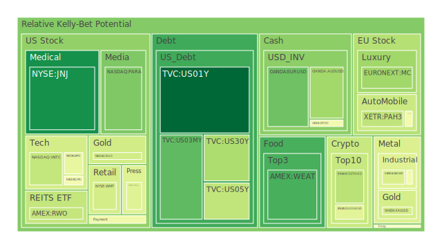
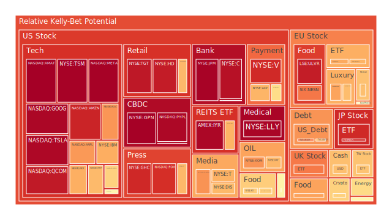
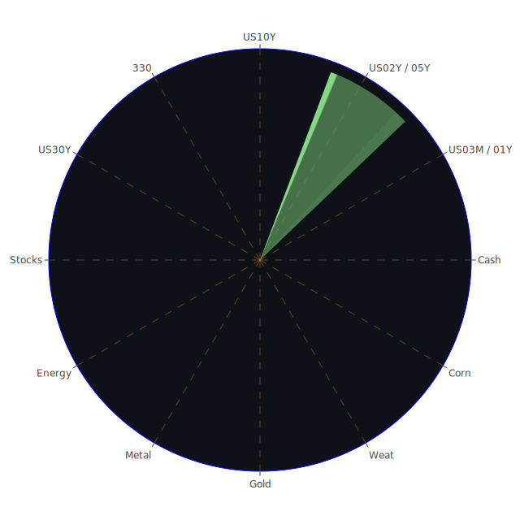

# 投資商品泡沫分析

## 美國國債
近期根據資料顯示，美國1年期公債（US01Y）殖利率約在4.23%上下，2年期（US02Y）約4.37%至4.38%，5年期（US05Y）約4.58%上下，10年期（US10Y）則約4.76%，30年期（US30Y）約4.95%。從泡沫分數來看，如D1、D7等短期指標因應市場對利率路徑的反覆猜測而呈現波動，但仍維持在中高區域。如同新聞裡提到的「Rising Treasury yields caps global stocks; traders weigh tariffs, Fed rate cuts」與「Blowout Jobs Report Fuels Wall Street Fear of ‘Lose-Lose’ Market」，都暗示目前市場對聯準會下一步的政策仍感到分歧，尤其是就業數據強韌、通膨雖有趨緩但仍不夠明顯，使市場對是否會減少或延後預期中的降息抱持觀望。

回顧歷史上，公債殖利率在2008年金融危機前後以及2020年初疫情爆發之際，曾有劇烈波動。2008年時，市場對系統性風險的恐懼導致投資人一窩蜂追逐美債避險，造成殖利率大幅下滑；2020年初則因疫情而重現“資金湧入避險資產”的情況。然而，今時今日的情勢有所不同：一方面各國央行高度關注通膨動向，另一方面市場對聯準會長期維持較高利率水準的認知日漸加深，美國國債價格短線雖可能因突發事件出現避險買盤，但終究仍會受到利率走勢和資金面影響。

值得注意的是最新FED資料顯示，美國銀行總存款仍在高檔，Money Market Funds總資產持續攀升，顯示資金面依舊充裕。但公債殖利率升高背後也代表著市場對美國政府持續發債以及財政壓力有所警惕。對投資人而言，美國國債因其流動性與信用度高，泡沫風險相較較低，但殖利率持續升高也暗示價格仍有向下修正風險，需注意長債波動可能加劇的情形。

## 美國零售股
零售股如WMT、TGT等，近來受到通膨影響、消費者信心動搖，以及就業數據正反指標交織的衝擊。在近期新聞可見「Macy's Is Closing Underperforming Stores as Its Turnaround Attempt Continues」，顯示部分百貨零售業者對於消費行為疲弱的因應。WMT與TGT在D1、D7到D30的泡沫分數一路走來並未維持在極高水準，但依舊不容輕忽。历史上2008年金融危機前後，零售消費階段性受到壓力，雖之後也曾遇到報復性消費，但以通膨帶來的生活成本壓力而言，零售行業利潤空間被壓縮，導致整體表現較保守。近期的冬季暴風雪、美國局部地區野火或天災也會影響零售業的店舖營運，尤其若供應鏈或運輸受阻時，銷售端恐受到更大衝擊。

## 美國科技股
科技股如AAPL、MSFT、GOOG、META、NVDA、AMD等，整體泡沫分數仍偏高，部分甚至超過0.95以上，顯示市場對科技股的看法依舊亢奮，或以成長題材支撐股價。然而，「Biden to Further Limit Nvidia AI Chip Exports in Final Push」等新聞，說明政府對半導體、高階晶片相關出口管制的趨勢大概不會放鬆。再者，聯準會維持高利率週期對於偏重預期本益比的科技成長股常帶來估值壓力，令此區塊泡沫風險增高。

歷史上可對照2000年網路泡沫時期，當時市場對科技前景抱持極端樂觀態度，然而估值飆升並缺乏實質獲利基礎，一旦資金面趨緊，股價下跌往往極為猛烈。今時雖已有不少大型科技企業具備龐大現金流與穩定獲利能力，但依然無法避免市場評價波動的沖擊。尤其新聞多次提及「Blowout Jobs Report Fuels Wall Street Fear of ‘Lose-Lose’ Market」，使得市場對升息或維持利率高檔更為擔憂，進而波及原本就估值偏高的科技股。

## 美國房地產指數
根據AMEX:RWO與AMEX:IYR等全球與美國房地產相關指數的泡沫分數維持在0.9上下，有些甚至突破0.96，如IYR先前報價在91美元多，現今泡沫分數高達0.96以上，也顯示投資人對房地產ETF的追捧仍然相當顯著。然而，根據最新消息顯示，美國30年固定房貸利率已達到6.93%，這樣的高房貸利率可能打擊很多購屋者與建商，長期來看壓抑整體房市需求。

回顧2007–2009年之次貸風暴，一旦消費者無法負擔房貸利率攀升，亦或經濟環境轉差時，房地產價格若大幅下修，就可能導致一連串違約與銀行壞帳風險。因此，雖然目前房地產市場並沒有如次貸危機前般嚴重槓桿問題，但依舊須警惕市場現有投資者對房地產信心若發生崩盤，對整體資本市場造成的潛在漣漪效應仍然不可小覷。

## 加密貨幣
在本次數據當中，BTCUSD價格約9萬多美元，ETHUSD在3000+美元上下，一些泡沫分數已從前幾日的0.83左右下滑到0.62-0.65區間，亦顯示市場對加密貨幣的熱度稍有降溫。D1、D7的短期數值略有振盪，但整體還稱不上「崩跌」的狀態。參考新聞方面，並沒有特別宣示監管機構瞬間祭出過大力度，但仍有關於量子運算未來發展尚需時日的訊號（如「Rigetti, IonQ stocks plunge after Nvidia CEO says 'useful' quantum computing is decades away」），多少為加密貨幣投資人提供些許「短期內不會被量子電腦全面破解」的心理安慰。雖如此，一般投資者對高槓桿投機風險仍須保持高度警惕，歷史上如2017年底至2018年的加密大泡沫崩盤、2022年某些交易所流動性問題，都證明了此類市場迴轉速度可以極快且殺傷力驚人。

## 金／銀／銅
XAUUSD（黃金）及XAGUSD（白銀）近期的報價皆在高檔區，泡沫分數顯示黃金約0.39-0.40上下、白銀則更高達0.76-0.81。新聞「Gold climbs after weaker-than-expected private payrolls data」說明了避險需求和對利率未必立即趨緩的矛盾心理。金銀比、金銅比等比值亦在相對較高水準，若通膨持續，黃金仍具吸引力。對歷史而言，黃金在經濟與地緣政治動盪期往往受到市場青睞，而白銀因產業用途與金融避險並存，波動度可能更大。此外，「Tariff Fears Spark Disconnect in Silver and Copper Markets」的新聞則暗示，若貿易衝突或關稅政策升溫，銅的出口與需求均面臨不確定性，價格與泡沫分數可能來回震盪。

## 黃豆 / 小麥 / 玉米
在ETF或期貨角度看，AMEX:WEAT（小麥）、AMEX:SOYB（黃豆）與AMEX:CORN（玉米），近期泡沫分數雖不如科技股等單一數值高，但也有明顯的波動。例如小麥（WEAT）D14、D30一度攀升至0.40以上，黃豆（SOYB）亦有約0.51上下，而玉米（CORN）則曾達0.63以上。根據新聞，如「CME Group challenges Miami exchange with new spring wheat contract」，顯示農產品的衍生品交易環境正在競爭激烈。回顧以往國際農作物價格常常受天災人禍、惡劣氣候及地緣政治左右，存在階段性飆漲或崩跌的可能。投資人須留意農業期貨槓桿風險，同時也應注意全球通膨及天氣變化對農產品產量與價格帶來的衝擊。

## 石油 / 鈾期貨UX!
石油（USOIL）現報約73-76美元區間，泡沫分數約0.22-0.60區間起伏不斷。新聞顯示「Oil Steadies After Volatile Session on Signs of Tighter Market」以及「Oil Advances as Dwindling Inventories Counter China Weakness」，都代表著石油市場的供需面仍然動態，庫存水平、地緣風險以及中國需求是其中的關鍵變數。對照歷史上，例如1990年海灣戰爭期間，或2008年金融海嘯，石油價格往往會因地緣衝突或全球需求降溫而大幅波動。

至於鈾期貨（COMEX:UX1!）報價約72-73美元附近，泡沫指數介於0.36-0.48。新聞報導相對較少聚焦，但隨著全球對於潔淨能源或核能發電議題的關切，市場對鈾需求也可能出現局部增溫。投資人需警惕鈾期貨流動性不如主流商品，且核能相關消息面通常較難預測，一旦市場突然轉向亦會顯現顯著風險。

## 各國外匯市場
美元對日圓（USDJPY）近來到157-158之間，泡沫分數約0.51-0.66，英鎊對美元（GBPUSD）約1.22-1.24附近，泡沫分數約0.40-0.59，歐元對美元（EURUSD）則約1.02-1.03，泡沫分數約0.45-0.80上下，顯示主要貨幣之間的波動加劇。新聞「Dollar up as US 10-yr yield hits 8-1/2 month high on tariff report」揭露了美元強勢可能持續。若美國仍處於高利率環境，則維持美元優勢，但在通膨、國債發行量與外國持有美債規模下降等因素干擾下，也不排除美元可能出現意料之外的回調。

從歷史視角來看，歐美主要貨幣對大宗商品價格的影響不可輕忽。當美元轉強時，通常以美元計價的大宗商品就有壓力，進而影響其他市場資金流動。投資者需留意央行干預可能：如日本若干預日圓匯率，就可能引發另一波金融市場震盪。

## 各國大盤指數
中國滬深300（SSE:000300）目前位在3770-3780點區間，泡沫分數有時高達0.52。雖然中國官方已著手刺激內需，但在房地產壓力、大規模債務及地方政府融資平台風險等陰影下，中國股市走勢可能反覆。消息如「China's tumbling bond yields intensify 'Japanification' risks」也暗示市場已擔憂中國經濟進入長期低通膨、低增長的“日本化”通道。另方面，歐洲主要指數如德國DAX（GDAXI）、法國CAC 40（FCHI），以及英國FTSE 100分別在2萬點、7千多點及8千多點區，泡沫分數如DAX有時逼近0.76，FTSE甚至能到0.88，顯示歐洲股市也因歐洲能源、通膨、與地緣政治問題面臨壓力，投資者須考量歐洲央行之動態與消費市場能否維持。

## 美國半導體股
半導體相關個股如NVDA、AMD、INTC、KLAC、AMAT等，皆是科技成長股的重要環節，其泡沫分數多半飆高到0.72-0.97不等。近期新聞「Biden to Further Limit Nvidia AI Chip Exports in Final Push」以及「China has ample fiscal space to bolster growth this year」形成一種錯綜複雜的市場背景：一邊是美國政府對高階晶片出口加強管制，一邊是中國試圖增加內需擴大投資，若中方加大晶片自主化投入，恐挫傷美國半導體企業營收，也可能引發報復性反制。投資人回顧中美貿易戰以來的演化即可明白，半導體本質上是高度政治化、同時也深度牽動科技產業鏈和資本市場信心。許多半導體大廠在經濟下行週期仍持有巨額現金流，短期內大跌機率也許不大，但估值若過高，亦存在縮水的可能。

## 美國銀行股
銀行股如JPM、BAC、C、COF等，泡沫分數多在0.45-0.96之間浮動。美國銀行股受利率政策、經濟景氣循環、貸款違約率影響甚深。新聞「BlackRock Stares Down FDIC Just Before Deadline Over Bank Stakes」與FED資料「US Bank Total Deposits is at relatively high level」說明銀行存款依舊穩定，但信用卡違約率或房地產壞帳是否上升則值得長期關注。一旦失業率再度攀升，或商業地產繼續惡化，銀行資產負債表恐遭受打擊。回溯2008年雷曼兄弟倒閉前，銀行股從看似穩固到崩盤速度之快，至今仍令人警惕。現階段雖然監管相對嚴謹，但經濟下行週期仍是銀行股的風險源。

## 美國軍工股
軍工股如LMT、RTX、NOC等，泡沫分數大多維持在0.50-0.59區間，雖非特別高但也不低。新聞如「Lockheed Martin delivers 110 F-35 fighter jets in 2024」顯示出軍工產業具有長期合同及穩定預算優勢。歷史上，美國軍工產業常與國防開支掛鉤，一旦地緣政治局勢緊張、或中東與歐洲出現衝突，往往推升相關股票與訂單。雖然泡沫風險相對一般科技股略低，但如國際衝突局勢舒緩及各國削減國防預算，軍工股也可能面臨下修。

## 美國電子支付股
電子支付類股如GPN、PYPL等普遍泡沫分數高企，有些達0.96以上。這表示市場對電子支付服務在未來數位經濟中的關鍵地位仍寄予很大期望。然則自2022年起，多國監管機構加強對金融科技行業的規範，並要求平台增進洗錢防範與個資保護的措施。回顧過去，電子支付平台雖具備強大網路效應，但競爭者眾多，加上利率上升可能抑制部分消費者的信用消費習慣。投資人需留意此類企業的用戶數增長與交易量的持續力，以及估值是否過高。

## 美國藥商股
藥商股如JNJ、MRK等，泡沫分數多半處於0.09-0.53之間，整體偏低，顯示資金對此傳統防禦性板塊的態度並不極度炒作。一些新聞如「Edison International’s Stocks, Bonds Fall Amid LA Wildfire」牽涉範圍較廣，但對藥廠直接影響並不大；倒是「Biogen proposes to buy remaining stake in Sage in $442 million deal」顯示生技與藥廠之間仍有資本市場合作合併的可能性。歷史上，此類股通常在經濟衰退時期能提供相對防禦作用，但亦須注意研發失利或專利到期帶來的股價衝擊。

## 美國影視股
影視股如PARA（派拉蒙）等，近期報價約10美元上下，泡沫分數在0.39-0.46區間浮動。新聞如「Rigetti, IonQ stocks plunge after Nvidia CEO says 'useful' quantum computing is decades away」或「Triller launches a tool to back up users' TikToks ahead of the US ban deadline」等雖非直指影視產業，但亦透露影音內容產業競爭格局。以歷史觀點看，過去Disney（DIS）與Netflix（NFLX）因串流業務崛起而大幅成長，但在近年多家平台推出、訂戶成長開始趨緩、消費者分散等，都使該產業收益競爭更激烈。若經濟走弱或廣告市場萎縮，影視股往往最先遭受衝擊。

## 美國媒體股
媒體股如NYT、FOX、CMCSA等，泡沫指數有些較高甚至超過0.72，市場對新聞、廣告收入、串流戰的前景心態都很複雜。新聞「Fox Corp must face Smartmatic $2.7 billion defamation claim: Fox Corp, the parent of Fox News Network...」說明法律糾紛或政治性質報導常對媒體股產生重大衝擊，而廣告市場一旦疲弱，也會壓低媒體公司收益。回顧2008年到2009年金融危機期間，廣告支出收縮劇烈，許多媒體公司股價也曾腰斬。

## 石油防禦股
石油防禦股如OXY、XOM等，屬於上游開採與下游煉油、或與防禦概念兼具的能源類別。近來價格在高位進行盤整，泡沫分數約0.66-0.73。若未來中東局勢出現重大變數或OPEC+政策改變，都能驟然推升或壓低油價。歷史證明油價常與地緣局勢共振，一旦衝突或制裁引爆，就可能急速上漲；反之，全球經濟衰退下需求不振時，也可能使之大跌。

## 金礦防禦股
金礦股如RGLD等，與黃金價格的高度正相關。在泡沫分數約0.39-0.76之間浮動。當金價處於高位，金礦公司理論上能受惠毛利率提升；但若公司經營不善、開採成本升高或地區政治風險干擾，也可能壓低股價。投資人須注意金礦業務的槓桿性，正如歷史上黃金在2011年一度衝破每盎司1900美元時，部分金礦股收益顯著增長；但金價一旦回落，股價修正也相當驚人。

## 歐洲奢侈品股
歐洲奢侈品如LVMH、KER等近來泡沫分數介於0.63-0.70之間，顯示市場對奢侈品需求仍具熱度。新聞「France’s Growth Set to Surpass 5%」或「Eurozone inflation data」等雖不直接指名奢侈品，但歐洲內部消費力道若減弱，可能不利高檔消費支出。歷史證明奢侈品需求較受中高端消費者與觀光旅遊市場帶動，若地緣政治趨穩，旅遊業復甦往往使奢侈品銷量水漲船高；但若經濟周期轉弱或新興市場貨幣走弱，奢侈品也會面臨下修壓力。

## 歐洲汽車股
歐洲汽車類股如BMW、MBG（賓士母公司）等，泡沫分數約0.48-0.57。歐洲汽車製造業受能源價格、運輸供應鏈和新能源車轉型的掣肘。回看2020年疫情初期，汽車股因工廠停擺和供應鏈斷裂而大跌，但2021年至2022年需求回春推動股價彈升。現今則擔憂歐盟對碳排放的嚴格規範，以及電動車與中國新勢力車企的競爭壓力。新聞雖無特別針對歐洲車企，但若國際關稅或地緣衝突再起，車廠利潤空間或再受衝擊。

## 歐美食品股
如KO、KHC、NESN等，屬民生必需品板塊，相對防禦色彩濃厚。近日泡沫分數通常落在0.39-0.65區間。從歷史角度看，金融危機時期往往該類股價較具抗跌性，但若經濟整體衰退嚴重或原物料價格驟升，也可能壓縮利潤空間。新聞顯示「Job Seekers Reported a Stagnant Labor Market」與「US longshoremen have reached an agreement with ports」等在物流層面與就業市場層面都有正反影響，未來若供應鏈出現大規模中斷，食品公司成本或許增加，也有可能轉嫁至終端產品價格。

---

# 宏觀經濟傳導路徑分析

根據FED關鍵數據，目前高利率、高就業、通膨仍在約2.7%上下徘徊（CPIYOY 2.73左右），而銀行體系存款仍然居於高檔，Money Market Funds也持續增加，暗示社會總流動性雖然不如量化寬鬆時期但並未面臨資金“乾涸”。同時美國國債規模擴大、外國機構持有美債規模下降，也代表政府對內部籌資需求上升；一旦市場對美國財政信心出現疑慮，長債利率可能攀升更快。若聯準會無意大幅降息，將持續牽動全球資金流動方向，造成新興市場外資流出或本幣貶值。

新聞所提及之「Japan Nov real wages fall for 4th straight month as inflation weighs」等訊息，顯示其他主要經濟體（如日本）同樣面對物價與工資的拉扯，間接讓美國市場資金仍保持相對有利地位。整體傳導路徑可歸納為：全球通膨壓力 + 美國FED利率走廊上移 + 美元資金流向優質債券與避險資產 → 全球風險資產估值壓力升高 → 新興市場或經濟結構較脆弱者首當其衝。

---

# 微觀經濟傳導路徑分析

若將視角縮小到產業與企業層級，因利率和通膨走勢不明，以及若干地緣政治風險（例如美中貿易戰、歐洲天然氣供應風險等）可能干擾，企業面臨訂單不穩、成本上揚的複合情況。零售業者必須評估消費者支出是否縮減；科技業者評估企業投資及研發預算是否收斂；能源業者面臨綠能轉型與國際供需博弈；銀行與保險公司則必須應對貸款壞帳風險上升的可能性。

在心理學與博弈論層面，投資人通常會在不確定性高漲時，非理性地集中持有所謂“熱點”資產，推升相關價格並形成“順勢追多”的泡沫。當下一個利空或事件出現，又可能瞬間拋售造成系統性下跌。從微觀層次看，有時企業獲利增長尚可，卻依然可能因市場氛圍而遭到錯殺。故投資人除分析公司基本面，也要留意市場擁擠交易狀態與籌碼集中度。

---

# 資產類別間傳導路徑分析

1. **美國公債與房地產**：當公債殖利率攀升，房貸利率隨之而上，導致房市需求下降，房地產指數可能面臨壓力。反之，若資金再度尋求避險湧入公債，就可能在短期拉低利率、暫時支撐房市。

2. **科技股與半導體供應鏈**：若美國對高階晶片出口祭出更多限制，或中方加大對本土供應鏈扶植，將衝擊美國科技公司的銷售額，並可能影響整體半導體生態系（包含設備製造、原材料、雲端運算等）。

3. **農產品與能源價格**：全球運輸成本、氣候變遷與地緣政治事件可能影響能源（石油、天然氣）價格，也間接帶動農產品生產成本與運輸費用，最終傳導到零售與食品股的利潤表現。

4. **美元強弱與新興市場**：美元持續走強會使得新興市場貨幣承受壓力，若新興市場央行被迫升息，可能壓抑經濟成長，進而影響全球商品需求，使跨國企業收益削減。反之，若美元出現階段性回貶，也可能帶動新興市場資產反彈。

---

# 投資建議

以下將提出穩健、成長、高風險三大類型的資產配置方向，各大類之權重加總為100%，以供參考。必須強調，投資組合須依個人風險偏好調整，同時留意市場泡沫與潛在的負面事件。

1. **穩健型（50%）**  
   - **美國短中期公債（約20%）**：兼具流動性與相對穩健。雖然殖利率上行對價格有壓力，但美國公債在全球仍屬避險優先選擇，可在市場恐慌時提供一定防禦力。  
   - **黃金現貨或黃金相關標的（約15%）**：在避險需求與通膨疑慮並存的情況下，黃金可適度分散風險。泡沫分數並未飆至極端，長期配置價值仍在。  
   - **民生消費防禦型股票（約15%）**：如大型藥廠JNJ、MRK或食品飲料股KHC、KO等。此類公司歷史上在經濟景氣下滑時，營收波動相對較小，可以對沖市場衝擊。

2. **成長型（30%）**  
   - **科技龍頭與半導體（約15%）**：在利率高企的階段，科技股估值風險高，但若篩選具有強大現金流與技術壁壘的龍頭，長期具增長潛力。特別關注AAPL、MSFT等，或具備AI/雲端優勢的NVDA、AVGO，但需分散以降低集中風險。  
   - **歐洲奢侈品或汽車股（約10%）**：在中國與全球旅遊復甦背景下，部分歐洲奢侈品公司如KER、MC等仍有成長動能，汽車業則可關注電動化轉型與出口市場恢復。不過地緣政治風險不可忽視。  
   - **房地產投資信託（REITs）（約5%）**：雖然房貸利率偏高，但長期而言，REITs具有穩定租金收入，分散風險的功能。選擇優質物業或策略性領域（如物流中心、資料中心）的REITs，可能在利率頂峰過後具備不錯的中長期機會。

3. **高風險型（20%）**  
   - **加密貨幣（約5%）**：BTC、ETH等主流幣市值較大，若市場資金氣氛再次轉暖，仍有快速上漲空間。但泡沫風險高，需做好風險控管。  
   - **小型創新科技股或量子計算概念股（約5%）**：雖然新聞顯示量子運算短期內尚未成熟，但超前部署與博弈論下，可能帶來驚人的潛在報酬。同時也要接受劇烈波動。  
   - **新興市場高收益債或股票（約10%）**：此區塊易受美元強弱、地緣政治影響，波動度大，但若在全球資金充裕時可能享受高資本流入。在地區或產業選擇上仍須謹慎挑選。

---

# 風險提示

投資必然有風險，任何投資標的皆可能隨著大環境與不可測之事件而迅速逆轉行情，尤其在泡沫分數偏高的條件下，更須提高警覺。歷史上，無論是2000年科網泡沫或2008年金融海嘯，都讓人理解系統性風險往往在市場過度樂觀、槓桿增長或監管出現盲點時急速爆發。近期須多關注以下潛在風險：

1. **泡沫與估值偏高**：科技巨頭、高成長產業或特定ETF之估值已到高檔，若市場對利率和經濟前景的預期變化過快，易導致殺估值行情。  
2. **地緣政治摩擦**：美中科技戰、地區性衝突、歐洲能源危機等不確定性，隨時可能影響全球供應鏈與金融市場波動。  
3. **政策風向突變**：聯準會、歐洲央行或其他主要央行若對利率或貨幣政策的基調有所調整，市場可能劇烈震盪。  
4. **信用與流動性風險**：部分企業財務槓桿較高或貸款體系較脆弱，若經濟衰退或利率持續高檔，銀行壞帳問題可能浮現，牽動股市下修。  
5. **極端氣候與天災**：如美國西部山火、颶風、歐洲洪水、中國極端高溫，皆會影響區域經濟活動與農作物收成，也可能擾亂運輸與供應鏈。  
6. **新興市場貨幣動盪**：一旦美元走強，資本外流、匯率急貶對新興市場社會與金融市場穩定構成威脅，也影響跨國企業盈利。  

綜合而論，當前市況不論是就宏觀或微觀層面觀察，都呈現出多空交織局面。通膨與升息雖在某些數據上略顯趨緩，但絕非高枕無憂；全球地緣不確定仍存，加上企業獲利能否穩定亦有變數。上文所提之各種資產建議，僅是以風險對沖與分散原則作為大方向參考，投資者務必衡量自身財務狀況、投資期限、風險偏好，做好資金控管、紀律管理。市場充滿不確定性，任何短期漲跌都可能帶來情緒化操作，但若能了解泡沫風險，掌握資產間的連動關係，並持續追蹤重大政策及新聞進展，就有機會相對穩健地度過市場波動階段。

最後再度重申：**投資有風險，市場總是充滿不確定性。以上所述觀點僅供參考，投資者應結合自身風險承受能力與投資目標做獨立判斷。**多留意潛在的泡沫跡象、及時關注全球政治經濟變化及關鍵新聞事件，方能在風高浪急的市場中保持靈活與警戒，為投資組合尋求更佳的配置與長期報酬。  

 
Daily Buy Map:

 
Daily Sell Map:

 
Daily Radar Chart:

 
