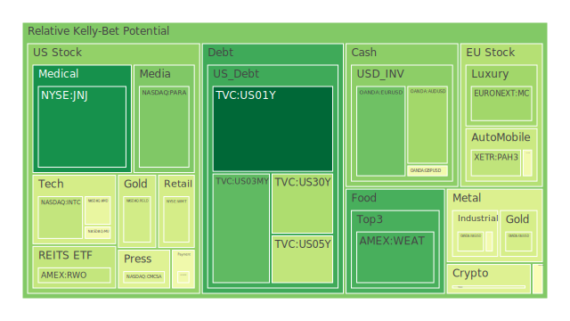
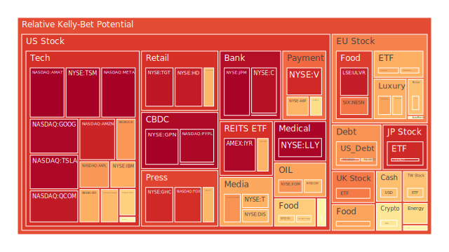
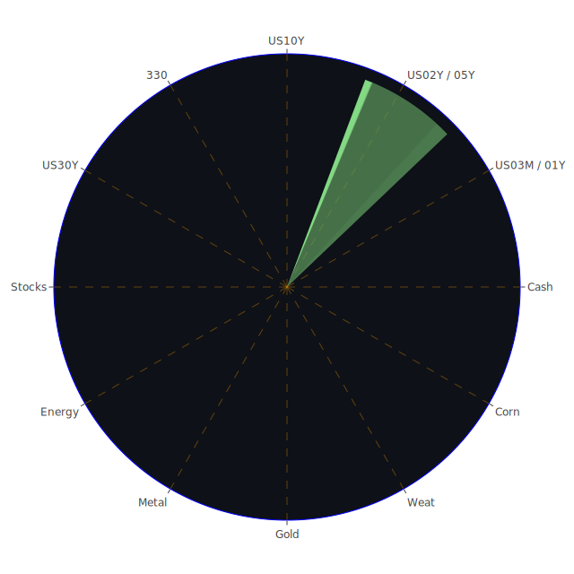

# 投資商品泡沫分析

在探討各資產的泡沫分析之前，先點出若干近期新聞對市場情緒的潛在影響，並輔以歷史場景作佐證。從多條新聞可見，日本消費仍在通膨壓力下持續走弱、澳洲特定娛樂股因流動性疑慮而股價重挫、房地產市場與零售業亦不乏負面消息。另一方面，美國科技與大型公司財報雖曾有亮麗表現，但因聯準會（FED）鷹派言論增多、就業數據強勁而使得市場再次擔憂利率維持高檔，引發一波獲利了結。以下針對各資產類別，據其近期與歷史數據中的泡沫指數（如D1, D7, D14, D30風險分數）與市場走勢略作評論：

1. **美國國債**  
   美國國債從短天期至長天期，最新數據顯示1年期與2年期殖利率分別約在4.23-4.38%上下，而10年期則緩步提升至4.75-4.76%左右，30年期則逼近4.95-4.96%的區間。新聞內容顯示美國仍可能面臨通膨與經濟衰退的兩難，加之美聯儲鷹派講話並未顯著放鬆，造成短端利率並未像某些投資人預期那樣快速下行。歷史上曾出現過若干次經濟轉折時期，當就業數據過度強勢，但景氣週期逐步衰退時，債券市場容易先行反映風險。就泡沫風險而言，國債本身被視為避險資產，通常泡沫程度相對較低，但若資金被大舉抽離而轉進股市或其他高收益資產，也可能使部分長天期債券流動性略有波動，需要警惕。

2. **美國零售股**  
   美國零售業近期遭遇經濟面與就業市場不均衡表現的壓力，新聞提及一些大型連鎖零售商關閉表現欠佳的門市，以止血重組。這與歷史上零售周期性衰退前夕的現象略有雷同。泡沫風險並不特別高，但若消費持續低迷且利率高企，零售股後市不容樂觀。整體D1、D7、D14、D30風險分數雖相對中性，但部分領先指標如庫存周轉與商務氛圍可能出現裂痕，需謹慎觀察。

3. **美國科技股**  
   科技產業長期以來都因創新、成長性佳而受到投資人追捧。然而根據某些指標數據顯示，近期大型科技股如AAPL、MSFT、META、AMZN等的泡沫風險分數偏高，有的超過0.95甚至逼近1.0。歷史上也多次證明當市值過度集中於少數科技巨頭，而市場整體資金流動趨緊時，極端回調的機率就會上升。雖新聞上也提到部分公司財報優於預期，或在人工智慧領域有所布局，但若全球流動性環境改變（特別是利率走高），仍須警惕科技板塊在短時間內大幅修正的可能。

4. **美國房地產指數**  
   根據近期數據與新聞所述，在利率持續高檔與經濟不確定性下，美國房地產類股與REITs之泡沫指數整體呈上升趨勢。利率越高，房貸負擔越重，加之新聞中有提及特定地區遭受極端氣候災害而保費與保險承保意願均產生結構性衝擊。歷史上經常出現當房地產高檔過熱並遇到利率上行周期時，市場流動性可能驟減，房地產價格在短期內難以支撐。近期相關指數D1與D7風險分數雖仍在中間偏高水準，但若利率無法有效鬆動，該領域或有中長期風險。

5. **加密貨幣**  
   BTC、ETH以及其他加密貨幣的波動向來劇烈，新聞指出在經濟與政治不穩定環境中，加密資產有時被視為替代性避險標的，導致短線投機增加。歷史上，加密市場的暴漲暴跌常和整體資金面變化呼應：當市場流動性寬鬆時，價格往往飆漲；一旦資金緊縮與監管態度轉向，市值可能迅速蒸發。現今加密貨幣的泡沫風險通常較傳統資產為高，如ETH的D1風險已逼近0.42左右，BTC則在近期資料顯示波動度仍偏高，請特別留意短期投機風險。

6. **金/銀/銅**  
   金銀向來被視為避險資產，銅則視為景氣金屬。新聞顯示地緣政治衝突、貿易關稅以及某些地區的災害都可能引發金銀需求。但整體而言，近幾月金價相對強勢，一些投資人亦藉此預期景氣下滑時的保值作用。然而新聞同時也提及關稅問題對銅市場造成需求面疑慮。歷史經驗告訴我們，一旦全球製造業疲弱，銅價可能先行修正。就泡沫風險層面，金銀與銅的D1、D7、D14指數各不相同。黃金雖有一定支撐，但需警惕若全球資金改而投向收益較高的美元債券，短線資金有機會抽離金市。

7. **黃豆 / 小麥 / 玉米**  
   農產品價格受天氣、地緣政治、供應鏈與貨幣走勢等多重因素交互影響。新聞提到澳洲與多地天氣異常，可能干擾農作物供給；同時也有地緣政治引發的物流運輸衝擊。歷史上農產品價格常在短期內劇烈波動，且若碰上通膨高期，投資人或投機客會湧入期貨市場，使價格擴大波動。根據近期數據，CORN與WEAT的泡沫風險分數呈現不斷起伏，尤其是某些時候D30風險飆高，要小心留意可能的突然性大漲大跌。

8. **石油 / 鈾期貨**  
   石油價格近期雖有報導顯示，因亞洲需求疑慮而短暫下滑，但整體來看仍可能因某些產油國減產、地緣衝突或冬季需求拉抬再次走揚。新聞強調中國與中東等地的各種政治風險都在發酵。鈾期貨方面，雖然具備另類能源投資屬性，但市場對核能的正反情緒並未達到大範圍共識。歷史上，原油與鈾在地緣局勢緊張、氣候關鍵事件出現時都有飆漲先例，但一旦需求端萎縮，價格亦可能急跌。

9. **各國外匯市場**  
   外匯市場近期主要觀察美元強勢或弱勢循環。資料顯示GBPUSD、EURUSD與USDJPY泡沫風險各不相同，EURUSD在近期有稍微走強的跡象，但仍看美聯儲接下來的政策走向。新聞提及日本通膨還在高點，日元偏弱，且日本家庭消費有下滑狀況，不利於日元快速反彈。若全球資金青睞美債收益而持續流向美元，則日元等其他貨幣可能更顯疲態。在歷史經驗中，外匯市場通常更能反映當下的全球資金選擇，多頭與空頭的對賭往往導致匯價快速波動。

10. **各國大盤指數**  
   像是FTSE、GDAXI、FCHI、SSE:000300、JPN225等大型指數短期動能並不一致。新聞顯示歐洲地緣政治疑慮、能源危機，亞洲則有地產風險或地緣衝突疊加，且美國利率影響全球資本流向。歷史上在寬鬆週期尾聲到緊縮週期中段之際，通常存在國際資本在不同股市間調度的現象。近期若經濟下行壓力加大，各國指數或將面臨重新定價，風險指數也呈現一定程度的上升。

11. **美國半導體股**  
   NVDA、AMD、INTC、AMAT、KLAC等公司佔據了相當大的市場關注度。新聞顯示美國政府對半導體發展與AI領域仍持續加碼，但同時也對其他國家實施程度不一的管制。歷史來看，半導體股往往迎合多輪科技創新浪潮；一旦市場需求增長放緩，整體估值就會受到壓力。資料中可見某些半導體公司泡沫風險超過0.9乃至逼近1.0，要小心由於資本支出巨大且景氣循環具高波動性，可能存在快速修正的契機。

12. **美國銀行股**  
   BAC、C、JPM等銀行常受資金流動性與利差影響較大。當前聯準會雖暫時沒有更加激進升息，但市場普遍認為利率可能維持在高檔區間，對銀行的淨利差有短期正面助益。然而新聞亦透露消費端卡債、房貸違約率正在攀升，若未來經濟衰退風險升溫，金融體系的壞帳可能擴大。歷史上多次發生當壞帳比例急增、貨幣政策轉向時，銀行股常帶來連鎖影響。銀行板塊泡沫風險現階段不算最高，但同業競爭和違約風險若再攀升，後勁不可小覷。

13. **美國軍工股**  
   RTX、LMT、NOC等軍工巨頭常因地緣政治衝突而受惠。新聞也有提到多國防禦預算可能增加。同時歷史證明，每當局勢趨於緊張，軍工股極可能持續高檔甚至再創新高。但需要留意的是，若局勢意外舒緩或國防預算降低，軍工股可能遭獲利了結，短線回跌劇烈。當前泡沫風險雖升高，但在地緣政治尚未明朗前，該領域仍具防禦性。

14. **美國電子支付股**  
   GPN、PYPL、V、MA等電子支付公司受電商與線上消費習慣興起而蓬勃發展。新聞提到零售市場的起伏對這些公司也構成潛在變數。歷史數據顯示電子支付領域先前在疫情期間一路飆漲，但之後因市場擔憂成長趨勢放緩，部分股價面臨壓力。要留意過去若干案例，一旦消費動能停滯，這類成長型公司在估值面容易受到衝擊。現今泡沫風險指數對某些公司（例如GPN）甚至一度接近0.98-0.99區間，要審慎防範。

15. **美國藥商股**  
   JNJ、MRK、NVO等公司在面對公共衛生事件或新藥推出時，股價常有獨立走勢。新聞也顯示有些藥廠與生技公司收購或合併案，形成短暫的利多。但回顧歷史，藥商股的泡沫風險一般較其他高成長型領域為低，除非出現大規模市場對醫藥產業估值失衡的炒作潮。近期觀察到某些藥品管道或專利糾紛，都可能帶來階段性股價波動。

16. **美國影視股**  
   媒體與影視公司如DIS、PARA、CMCSA等受串流平台競爭和消費者收視習慣改變影響。新聞提到廣告市場萎縮、一部分公司關閉或整併部分內容製作部門，與歷史上影視行業週期性調整大致相符。整體泡沫風險雖不算頂尖，但若串流紅利消退、廣告營收縮水，影視類股有可能更深度回調。

17. **美國媒體股**  
   包括NYT、FOX等傳統媒體類股，在新聞內容可見，他們在訴訟、廣告縮減以及政治壓力交織下走勢不甚樂觀。歷史多次見證傳統媒體行業在廣告景氣不佳與新媒體競爭時，估值下修幅度不可小覷。現今部分媒體股的泡沫風險略有增高，一旦市場情緒惡化，投資人或大幅拋售。

18. **石油防禦股**  
   此類股票常與整體能源股重疊，但在地緣政治緊張下，防禦意義特別凸顯。儘管新聞顯示中國需求疲弱疑慮，不排除油價在短期回調。但若後期又有供給端或政治面的變化，也難保油價不再度攀升。歷史上多次出現，石油防禦類股在衰退或通膨共存時期，可能維持相對強勢，但並非絕對無風險。

19. **金礦防禦股**  
   當黃金價格上揚或全球金融不穩時，金礦股往往成為資金避險去處。新聞提示貿易局勢緊張，地緣政治風險升溫時，投資人對黃金需求也可能增加。然而一旦風險情緒短暫降溫或利率提高吸收資金，金礦類股也常在高點出現較快的跌幅。歷史證據指出，金礦股與黃金走勢並非一體同心，有時會出現挖礦成本或環境因素干擾。當前泡沫風險雖仍在中高水準，但尚未見到極端狂熱狀態。

20. **歐洲奢侈品股**  
   歐洲奢侈品公司如RMS、MC、KER等通常深受中國大陸遊客消費與全球富裕族群景氣影響。新聞提到中國與英國之間重新開啟若干金融合作、歐洲國家在地緣政治上依舊動盪，這些都不斷改變奢侈品的需求。歷史證明奢侈品市場具備較強的週期韌性，但一旦經濟衰退嚴重或全球政治衝突升溫，高端消費可能快速收斂，導致股價回調。現階段泡沫風險中等偏高。

21. **歐洲汽車股**  
   包括BMW、MBG等在內的德系車廠近期受全球電動化、供應鏈轉型與中國競爭壓力影響。新聞顯示，若消費信心不足或利率維持高檔，車市有可能結束一段時間的反彈，回歸疲弱。歷史上在全球車市進入飽和期時，股價往往修正。泡沫風險雖尚未到最高，但需要警惕技術轉型與需求滑落的雙面夾擊。

22. **歐美食品股**  
   KO、NESN、KHC等公司反映生活必需消費為主，股價多數時候相對穩健。然而新聞亦顯示原物料成本提升與供應鏈可能遭極端天氣或地緣政治影響，若無法順利轉嫁成本，獲利空間將被壓縮。再從歷史可知，食品類股雖防禦性高，但在整體市場劇烈震盪時仍會有被資金拋售的可能；泡沫風險不算太高，但也不宜忽略。

---

# 宏觀經濟傳導路徑分析

綜觀新聞對市場的解讀與FED關鍵數據呈現，顯示出全球資金面仍相對緊張，而美國與多國的就業數據暫時維持強韌。這樣的宏觀背景無法立即打消市場對高利率的疑慮，令股債市出現某些分歧。當RRP偏低而EFFR體量偏高，與部分FED資產負債表下降並不互相矛盾，說明資金在不同管道之間重新配置的動態進行中。再者，若高收益債利率持續上揚、銀行壞帳攀升，將干擾整體信用傳導。此時若美國政府舉債持續走高，對公債長期利率的壓力也會進一步提升。

很多新聞顯示地緣政治衝突導致某些國家與地區的通膨壓力與匯率不穩。以博弈論視角看，各大經濟體為確保本國利益而在貿易、科技與能源議題上日趨分裂，也可能造成未來全球化受阻並引發區域化風險。社會學與心理學角度上看，市場對大國政策或戰略性動作的負面恐慌仍在累積，投資人預期的風險溢價恐將持續居高不下。

---

# 微觀經濟傳導路徑分析

企業方面，部分公司出現資本開支保守或縮減員工的現象。零售與餐飲、旅遊、娛樂等產業若面臨高利率、通膨未退、消費力下滑的多重阻力，可能削減營運計畫。根據心理學與博弈論，企業可能陷入一種保護自身現金流的競局，使得整體經濟進一步放緩。若就業市場在未來數個季度開始轉弱，將更明顯反饋到各產業獲利。

相對而言，部分對景氣較不敏感或通膨下具備轉嫁能力的企業（如基礎民生、軍工、防禦類）有機會在逆風中相對穩健。加密貨幣與高成長科技企業則受市場風險偏好大幅度擺盪，屬於波動性最高的板塊之一。

---

# 資產類別間傳導路徑分析

在資產之間的聯動，若債市因利率上行造成價格下跌，部分投資人可能持續轉向股市追求更高回報，這短期或可推升股價。然而一旦股市資金面失衡，出現流動性不足或獲利了結潮，衝擊往往更大。房地產類股亦同樣容易因利率與資金重新配置而遭遇拋售。原物料（石油、貴金屬、基本金屬）則深受地緣政治與需求變化影響，它們若大漲，可能驅動通膨或製造業成本。當大宗商品價格上揚，食品股與工業股的獲利空間都會受壓力。

這種動態在歷史上幾度出現：例如2008年金融海嘯前夕，初期商品價格飆漲，股市熱絡，但隨著信用市場出現斷層，陸續引爆連鎖反應。而在心理層面，投資人面對市場訊息過度敏感，常出現集體非理性操作，使資金高速逃離或湧入特定領域，激發泡沫和崩跌的交互過程。

---

# 投資建議

## 1. 風險對沖的投資組合機會

根據三位一體（Spatial：區域與市場層面、Temporal：時間週期演化、Conceptional：經濟與心理學理論假設）的正反合分析，並從新聞線索與歷史經驗為基礎，嘗試設計能在此波市場環境中盡量滿足互相對沖、相位約120度、相關係數約-0.5的投資機會：

- **A. 穩健防禦機制**  
  1) 美國中短天期國債（利率雖已偏高，但有相對安全性）  
  2) 金礦或黃金相關防禦標的（地緣政治反覆，保值作用凸顯）  
  3) 民生與必需消費類股（相對不易出現大幅波動）  
  透過上述組合，通常與高波動資產形成一定程度的避險，並維持資金流動性。

- **B. 成長潛力區塊**  
  1) 半導體、AI相關科技股（長期成長趨勢不變，但短期震盪）  
  2) 軟體即服務（SaaS）或電子支付股（需挑選估值合理者）  
  3) 部分軍工與航太產業（地緣政治驅動需求）  
  雖然該群泡沫風險偏高，但若操作妥當，在長線產業趨勢與政府政策支持下有機會享受超額報酬，須留意可能的劇烈回調風險。

- **C. 高風險博弈機制**  
  1) 加密貨幣（BTC、ETH等，高波動，可能帶來短期翻倍或腰斬）  
  2) 新興市場中小型股或ETF（成長潛力與風險並存，取決於地緣與政策）  
  3) 特定原油、鈾期貨或農產品期貨（行情受地緣政治與天氣干擾）  
  這些標的波動度非常大，理論上可與穩健標的形成一定相關分散，但必須嚴格控管部位與停利停損。

## 2. 三類資產配置比例（總和為100%）

考量到市場當前仍處於高度不確定性，可優先以「穩健：成長：高風險」的比重作為參考範本，分述如下：

- **穩健型**：40%  
  - (1) 美國中短天期國債或ETF：15%  
  - (2) 黃金或金礦相關標的：15%  
  - (3) 必需消費或公用事業類股：10%  

- **成長型**：35%  
  - (1) 半導體或AI相關優勢企業：15%  
  - (2) 具全球市占率的電子支付/網路服務龍頭：10%  
  - (3) 部分軍工或航太股：10%  

- **高風險型**：25%  
  - (1) 加密貨幣：10%  
  - (2) 新興市場中小型股或ETF：10%  
  - (3) 大宗商品期貨（原油、鈾、農產品等）：5%  

此種比例僅為一般建議，實際投資人可按風險偏好做微調。目的在於利用資產間的相關性、不同週期特性，以及在新聞、經濟學、心理學與歷史經驗的啟示下，追求分散風險與潛在收益的平衡。

---

# 風險提示

1. **泡沫風險**  
   大量新聞顯示在高利率與全球政治經濟動盪之下，部分資產的估值水準明顯偏離長期平均，尤其是高科技股或加密貨幣等領域。一旦市場風險偏好轉向或流動性驟降，短時間內可能大幅修正。投資人應高度警覺泡沫化跡象，包含本益比極度偏離、資金瘋狂流入單一版塊、散戶投資者槓桿激增等。

2. **地緣政治與政策不確定性**  
   新聞反覆提到地緣衝突與各國政策博弈。任何國際摩擦升溫，都可能引發油價、糧食價格、貴金屬等大漲或國際資金大規模撤離。若中美關係、歐洲能源安全等議題出現重大變化，市場波動勢必加劇。

3. **市場流動性風險**  
   當前的FED與歐洲各央行都可能持續使貨幣環境維持緊縮。根據歷史上多次經驗，在流動性不足下，股市與債市都較難獲得全面支撐，從而引發連鎖下跌。投資人對高槓桿的產品與衍生性金融商品應更加謹慎。

4. **信用風險與違約事件**  
   銀行股、保險資產、地產與中小企業，隨著利率走高，市場上壞帳增多、信用收縮，恐加劇金融體系的隱憂。新聞亦指出有些大公司或有重新協商債務或推延發債計畫，暗示債務壓力不斷累積。須提防信用評等機構可能下修企業評級，引發高收益債市場動盪。

5. **極端氣候與天災風險**  
   部分新聞提及加州與其他地區的野火災損、在歐洲或亞洲的暴風雪、洪水等，這些都可能對當地保險業、房地產或基礎建設產生衝擊，影響供應鏈與整體經濟活動。一旦災害蔓延，農產品與保險標的的風險因子會更形明顯。

6. **投資者心理與羊群效應**  
   回顧歷史，市場常因投資人心理在新聞環境下過度解讀而助漲助跌。一旦網路輿情與媒體鋪天蓋地地報導利多或利空，投資者情緒容易走向極端，忽略基本面實況。博弈論下，若大戶與散戶陷入同質化操作，即可能短時間引爆劇烈波動。

---

總結而言，目前市場環境包含通膨壓力、高利率前景、地緣政治不穩、企業財報參差不齊等不確定因素。從三位一體的空間、時間、概念角度審視，顯示資本市場容易在短期內忽上忽下。投資人宜透過正反合的思考方式，綜合宏觀與微觀觀察，並檢驗自身投資組合對不同風險的曝險程度。在上述建議的多種資產組合中，穩健與高風險並存的配置乃是試圖平衡多重風險，同時爭取成長潛力。然而投資不可能只依賴單一報告或數據，仍須綜合自身財務目標與風險承受能力，進行動態調整。

最後再次提醒，投資市場充滿不確定性與瞬息萬變的消息面。無論任何標的，都需持續追蹤其泡沫分數與基本面變化。特別對於泡沫風險較高的品種（如部分高科技股、加密貨幣、部分高槓桿商品），宜適度設定停利或停損策略，並考量流動性與風險承受度。投資人最終仍應依自身狀況、時間規劃及風險偏好做獨立判斷，以避免在突發事件或市場狂熱與恐慌之間蒙受重大損失。

---

# 風險提示

投資有風險，市場總是充滿不確定性。本報告僅提供多角度參考與分析，投資者應評估自身風險承受能力與投資目標，最終獨立決策。在高波動與訊息繁雜的環境下，保持冷靜與持續追蹤市場動態，才可避免被短期情緒或新聞雜訊牽著走。如若對於某些標的或操作策略欠缺充分理解，宜在專業人士協助或進一步研究後再做投入。切勿忽視任何顯示泡沫風險增溫的警告，也切勿輕忽潛在的政策和地緣風險帶來的漣漪效應。祝投資順利。

 
Daily Buy Map:

 
Daily Sell Map:

 
Daily Radar Chart:

 
