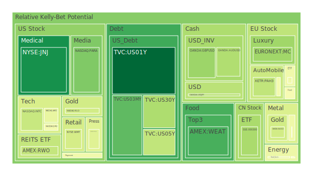
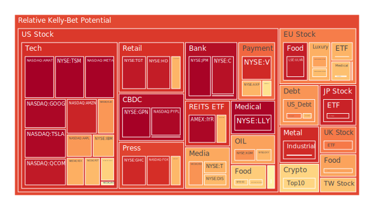
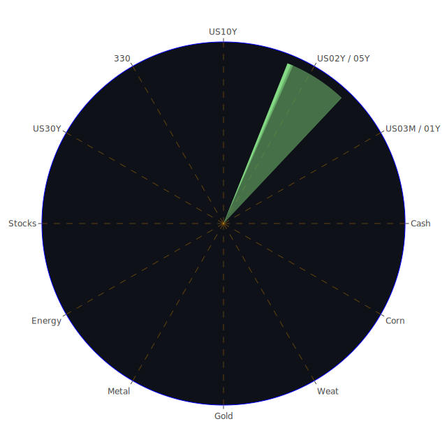

# 投資商品泡沫分析

先進行前言式概述：根據近期（2025-01-11 - 2025-01-13）多日市場數據顯示，不同資產項目的「泡沫指數」（D1、D7、D14、D30）有高有低，部分品項的風險分數顯示出升溫趨勢，亦有些顯示仍在相對合理範圍。基於「Spatial、Temporal、Conceptional」三位一體的分析，我們從下列各種資產切入。

## 1. 美國國債
美國國債（如US01Y、US02Y、US05Y、US10Y、US30Y）近幾日收益率普遍處於4%到5%左右區間，部分短端如US01Y、US02Y則維持在4.2-4.38之間。結合新聞情緒可見，目前有相當多的負面新聞提到就業數據超預期強勁，美國聯準會（FED）暫無立即降息的打算。因此在Spatial面向看，美國國債的價格受到「美國國內緊縮預期」與「國際資本流向」共同影響；Temporal面向則顯示短期有市場對強勁勞動力市場的憂慮，中期仍必須觀察通膨變化以及政府債務上限；Conceptional面向則反映投資人對避險資產的心理需求仍在，但在高收益率吸引下，長短端的交易策略開始分化。
根據泡沫分數，US10Y在D1約0.77上下，屬於相對高風險區段，但尚未明顯高於0.95的危險閾值。此意謂短期國債相對安全，長端收益率波動性較大。風險偏高下，需要警惕聯準會利率決策的任何調整都可能引發美國國債曲線快速移動。

## 2. 美國零售股
從新聞面觀察到多條負面訊息：如「Macy’s 關閉經營不善門市」、「一些美國零售股受到冬季風暴與地緣政治不安影響」，以及「洛杉磯山火」等意外災害對部分零售營運造成壓力。Spatial角度顯示，全美各州零售消費動能因地理環境條件与氣候災害而有不同衝擊；Temporal角度看，年初淡季、就業數據高於預期且消費者開始擔憂融資成本上揚，可能使得消費不再如前期般強勁；Conceptional層次上，一旦利率維持在高檔，消費相關股的投資心理較謹慎。
對比某些零售股，如WMT、TGT，其泡沫分數都接近或超過0.9左右，顯示潛在風險不小。有新聞指出某些大型零售商調整門市經營策略，以期止血。但若市場對聯準會不再降息保持悲觀態度，中期零售業表現仍存在隱憂。

## 3. 美國科技股
美國科技股（AAPL、MSFT、GOOG、META、NVDA、AMZN等）依舊為市場焦點，然而根據近期泡沫分數，GOOG、TSLA、PYPL等數值接近或超過0.95之高位，甚至TSLA一度接近0.96多。Spatial面：矽谷核心市場的發展與各州科創中心的合作，帶來科技業大量人才流動；Temporal面：在2024下半年到2025年初，都處於高通膨、高利率或至少是偏緊縮的貨幣環境；Conceptional面：投資者對「AI、量子運算、芯片需求」的長期前景仍然樂觀，但在短線資金面遇到估值壓力，科技股在動能與獲利之間存在較大心理落差。
新聞引用：包含「Quantum computing公司遭到某些大廠長輩斥責技術不成熟」的雜音，以及「強勁就業報告引發市場對利率維持高檔的擔憂」。這些皆可能使科技股獲利預期與本益比評價面臨壓力。需要持續留意是否有長線資金進駐，使科技股估值消化完畢。

## 4. 美國房地產指數
美國房地產指數（如RWO、VNQ、IYR等）所顯示的泡沫分數存在較高風險，IYR達到0.96-0.97，VNQ約0.68-0.70區間。加上新聞面上指出局部地區的山火、極端氣候，以及遞延效應下房貸利率上揚（30年期房貸利率已回到6.93上下）。Spatial層面：不同州房地產供需結構互有差異；Temporal層面：當前房地產週期並不十分強勁，已過了疫情後爆發性成長段落；Conceptional層面：投資房地產的心理預期逐漸回歸現實，特別是利率高企，按揭負擔沉重。
歷史經驗顯示，過去在高利率環境下，美國房地產常出現成交量萎縮與價格停滯現象。若就業市場短期仍然看好，則房地產走勢不至於快速下跌，但警惕部分地區仍存泡沫風險。

## 5. 加密貨幣
BTCUSD與ETHUSD在2025-01-11之後出現中度波動。BTCUSD在本次數據顯示，泡沫分數約0.63-0.65上下，ETHUSD近期則在0.57上下，不算極高，但不能忽視隨時加密市場可能出現的劇烈漲跌。Spatial層面：加密交易已在全球多個區域擴展，不再侷限於北美；Temporal層面：大多數國家加密監管漸趨收緊，美國方面亦有風聲指出要防範洗錢、詐欺等問題；Conceptional層面：投資者對加密資產的風險偏好早已大幅改變，過去對加密的「狂熱」心理受到多次市場修正後愈加謹慎。
新聞面並未明顯提及近期重大的加密監管利多或利空，但對整體投資情緒而言，利率環境與避險需求交織，應保持對加密資產的估值彈性。

## 6. 金 / 銀 / 銅
金價(XAUUSD)根據數據有0.39-0.40的風險分數，銀(XAGUSD)則在0.89接近0.90，銅(COPPER)約0.46-0.47。Spatial層面：貴金屬與工業金屬價格通常受全球經濟景氣循環與地緣政治衝擊；Temporal層面：若美國利率仍在高水準，金價的短線表現可能承受一定壓力，但避險屬性仍會在長線存在；Conceptional層面：投資人常將黃金視為抗通膨、抗地緣危機的工具，銀跟銅除了有貴金屬屬性外也帶有工業應用層面，對景氣周期較敏感。
新聞面並無對金銀銅的直接重大訊息，但部分市場研究指「GOLD OIL RATIO」正在34-36上下，顯示原油走勢亦會影響金價相對強度。若全球需求減弱則銅需求下滑，反之市場若預期基建或綠能發展，銅可能獲得支撐。

## 7. 黃豆 / 小麥 / 玉米
在通膨與氣候災害影響下，農產品價格走勢向來具不確定性。根據數據，WEAT(小麥)與CORN(玉米)的泡沫分數多在0.71上下，SOYB(黃豆)在0.51左右，顯示短線有一定風險，但未到極端。Spatial面：農產品受主要產區天氣影響；Temporal面：糧食需求、期貨基差以及全球貿易政策交互作用；Conceptional面：投資農產品常帶有對衝通膨或世界動盪的心理預期。新聞提及冬季風暴在美南地區造成交通阻斷，一旦物流中斷則可能令短期價格波動放大。

## 8. 石油 / 鈾期貨UX!
石油(USOIL)此刻報價約77美元上下，泡沫分數約0.40-0.60之間不等，1月13日最新數據略升至0.44-0.45左右，代表波動風險尚存。鈾期貨(UX1!)的數據顯示泡沫分數約0.48上下，不算特別高，但鈾價向來敏感。新聞方面，有談及「美國對俄羅斯新的制裁措施可能衝擊能源供應」，以及「俄羅斯與部分歐洲國家之間的石油、天然氣限制」。Spatial面：中東、俄羅斯、美國頁岩油之間的供需關係十分複雜；Temporal面：此刻市場對2025年經濟需求並未一致樂觀，油價若失去地緣衝突利多，可能在高利率環境下受壓；Conceptional面：石油作為工業命脈，投資者往往以政治與戰略眼光來判斷價格走勢，鈾期貨則有部分核能需求的長線布局心理。
歷史參考在2022-2023年初因衝突加劇，油價曾大幅攀高，目前雖不及當時火熱，但不排除地緣政治升溫造成再度劇烈波動的可能性。

## 9. 各國外匯市場
從目前匯率來看，EURUSD約1.02；GBPUSD稍高於1.22，日圓USDJPY約在157-158區間。AUDUSD曾經0.61，最近一度看到0.62。新聞方面提及「英鎊可能面臨再度8%下跌的風險」，因為市場對英國後續經濟發展並不樂觀，亦或政治層面變數大。Spatial面：各國所處地理位置與經濟結構影響其外匯穩定度；Temporal面：新興市場貨幣短期或受FED動向以及大宗商品需求影響；Conceptional面：匯率的波動部分來自投資者對該國央行貨幣政策與通膨預期。 
根據資料，EURUSD的泡沫分數在0.49-0.22不等區間，AUDUSD約0.30-0.54間，表明整體風險仍在可控範圍，但投資人需隨時留意美債利差對匯率走向的衝擊。

## 10. 各國大盤指數
以NDX(美國納斯達克100)、FTSE(英國)、GDAXI(德國DAX)等為例，NDX之泡沫分數約0.68-0.84，FTSE約0.77-0.85，GDAXI約0.68-0.77。可看出全球股市指數同樣面臨較高的動能與泡沫風險。新聞層面顯示：「強勁就業報告使市場認定美國不易降息，部分歐洲國家地緣政治壓力仍存在」，造成全球市場對企業獲利成長的信心有雜音。若通膨與利率持續，投資人的資金可能向短債或其他避險資產移動，導致指數調整。

## 11. 美國半導體股
包含AMD、INTC、MU、NVDA、AMAT、KLAC等，根據數據顯示，NVDA泡沫指數0.62-0.73之間，AMAT則高達0.98上下，KLAC略低於0.73。半導體因廣泛應用於自動駕駛、AI運算、資料中心等，但同時受消費性電子與終端需求的景氣循環牽動。Temporal層面：每一季財報尤其關鍵；Conceptional層面：投資人視半導體為科技革命的關鍵支柱，容易有偏高本益比。若經濟放緩，消費電子需求不振，庫存水位升高可能再度衝擊股價。

## 12. 美國銀行股
代表如BAC、C、JPM等，BAC的泡沫指數約0.52-0.81之間，C則逼近0.94-0.95，JPM甚至在1月13日顯示約0.97以上。新聞層面有不少關於緊縮貨幣、就業報告的負面解讀，使得投資人擔心消費貸款違約率。也有關於「Charge-off Rate on Credit Card處於相對高檔」，再加上房地產按揭有風險，銀行股面臨潛在壓力。歷史上，銀行股在利率高時的利差收益雖有機會提高，但一旦貸款違約爆發，衝擊更為顯著。

## 13. 美國軍工股
軍工產業如LMT、NOC、RTX等。NOC的泡沫指數約0.51上下，RTX也維持在0.50上下，LMT約0.55左右。軍工需求有賴地緣局勢升溫，然而近期新聞多集中在俄羅斯與歐洲、國際油價制裁等層面，但大型衝突暫未有進一步惡化的立即跡象，市場心理也偏向軍工業務訂單穩定增長，但在經濟高利率環境下，市場對軍工股本益比要求會更保守。

## 14. 美國電子支付股
常見標的如MA、V、PYPL、GPN等。根據近期數據，V與MA的泡沫指數在0.90上下，PYPL則高達0.96-0.97左右，GPN接近0.98。電子支付業務繫於消費支出與電商發展，一旦利率高、通膨居高不下，消費者可支配所得可能下降，同時企業端交易量也有放緩風險。新聞層面並未出現絕對利好，市場需要警惕電子支付的成長能否繼續維持。

## 15. 美國藥商股
包括JNJ、MRK等。JNJ的泡沫分數約0.10-0.14，MRK約0.50上下，不屬於高風險群。隨著人口老化、醫療需求升溫，藥商股通常有防禦屬性。然而通膨及高利率環境下，大型藥廠研發支出若無法有效轉嫁至市場價格，仍有盈利壓力，但相較其他成長股，此區塊仍偏穩定。

## 16. 美國影視股
例如PARA、NFLX、DIS、FOX等。PARA泡沫分數約0.25-0.39間，NFLX則高達0.70-0.73，DIS約0.59-0.67，FOX也有0.88-0.81區間。時下全球影音內容市場競爭激烈，訂閱制平台增長放緩。若經濟不景氣，消費者在娛樂支出上將更謹慎。近期新聞亦顯示，某些並購案面臨司法審查，或市場擔憂合併可能被阻擋。歷史上，影視產業評價常存在討論度，易因流媒體政策改變引發估值波動。

## 17. 美國媒體股
除上述影視平台，也包含如NYT、CMCSA等大型媒體與通訊集團。NYT的泡沫指數在0.67-0.74之間，CMCSA在0.42-0.47。投資者在景氣轉折之際，往往偏好更有穩定廣告收入或訂閱收入的媒體企業，但廣告市場景氣一旦萎縮，媒體業務也將受到衝擊。

## 18. 石油防禦股
如OXY、XOM等能源相關公司。XOM泡沫指數約0.68-0.73，OXY約0.67左右。若油價受到制裁或供給面變化推升，石油公司或受益於油價上漲。但不確定性包括地緣爭端是否突然緩和、美國生產商是否增產等。歷史經驗：2022年後期油價曾大漲，但之後回落，造成石油股的震盪起伏。

## 19. 金礦防禦股
如RGLD等，其泡沫分數近0.39-0.59到0.74不等。金礦防禦股的表現取決於黃金價格與開採成本。金價若持續走高或市場避險需求提升，金礦股對投資人有相對吸引力。若實質利率維持高檔，黃金表現恐受到壓抑。必須評估公司自身效率與長期財務能力。

## 20. 歐洲奢侈品股
如MC、KER等。MC(奢侈品集團)泡沫指數約0.30-0.49到0.44之間，KER約0.70-0.71。奢侈品市場在2024年下半年曾有不錯表現，但中國消費復甦、歐洲旅遊回溫等變數仍待觀察；若全球經濟走緩或地緣政治升溫，奢侈品需求也會受到衝擊。

## 21. 歐洲汽車股
如BMW、MBG等。BMW泡沫指數約0.46-0.50上下，MBG約0.52-0.57。歐洲汽車業受制於電動化趨勢與整體經濟景氣。新聞面指出「英國與中國重新商談經貿合作」，雖對汽車出口具一定正面，但市場忌憚地緣政治風險，電動車與燃油車的轉型成本也高。

## 22. 歐美食品股
如KO、KHC、NESN等，其泡沫指數普遍介於0.54-0.77，顯示屬中高區間。食品工業毛利率雖相對穩定，但在成本提升（原物料、運輸）與消費動能不確定下，未來獲利空間需觀察。

---

# 宏觀經濟傳導路徑分析

1. **利率與就業數據**：本次就業數據強勁，市場對升息或維持高利率的預期增強，導致整體資金成本走高、風險資產受到抑制，美國國債收益率攀升，理論上有利於美元偏強，進而壓抑全球其他市場。
2. **地緣政治與制裁**：包含俄羅斯能源出口受限、美國對俄制裁升級、歐洲內部能源危機，以及中東局勢等，都會干擾國際大宗商品供應，尤其石油、天然氣、金屬等。
3. **全球需求走向**：IMF最新預估「2025年全球成長持續通脹趨緩」，若通膨放緩，終端需求表現差異化，可能導致經濟成長動能集中於少數國家，傳統製造強國與新興市場國家匯率、股市分化更為顯著。
4. **緊縮貨幣影響信用**：銀行體系中信用卡違約率、房貸與商業地產逾期率開始攀升，壓力累積後若爆發將牽動金融體系；央行必須在避免經濟衰退與抑制通膨間權衡，造成全球市場高波動性。

---

# 微觀經濟傳導路徑分析

1. **企業財務成本上漲**：利率走高使企業融資成本走高，成長股壓力較大，消費型企業在存貨管理或現金流周轉上負擔提升。
2. **企業投資意願下滑**：若下游需求減弱，企業對設備投資、研發投入趨於保守，尤其科技股在估值壓力下更謹慎。
3. **就業與薪資結構**：雖然就業數據強，企業人力成本飆升後可能考慮減少新增員工或優化現有人力，導致長期就業變數增加。
4. **房地產與租金**：利率高企使房地產市場資金成本提高，企業商用租賃亦受衝擊，零售或服務業在租金上談判空間相對有限，成本上揚壓縮利潤。

---

# 資產類別間傳導路徑分析

1. **股債互動**：高利率促使資金移轉至公債，壓抑股市估值。若市場避險情緒升溫，公債需求增多；若通膨壓力再起，公債價格下跌，收益率上揚反壓股市。
2. **大宗商品與外匯**：油價上升將推升相關貨幣（如挪威克朗、加拿大元），壓抑進口國貨幣；若原物料持續漲價，通膨可能再度飆升，貨幣政策再趨緊縮。
3. **半導體與科技股**：半導體漲勢往往帶動科技板塊，但一旦估值過高或景氣轉折，下跌會快速擴散至整體成長型股票。
4. **加密市場與股市**：在市場風險偏好轉換時，加密貨幣與高成長股同受衝擊，傳統避險資金可能更傾向黃金或國債，形成負相關或弱相關的對沖效果。
5. **房地產與銀行股**：地產景氣萎縮，連動房貸、商貸部位增壓，進而反映在銀行資產品質；銀行股若受衝擊，系統性風險可能蔓延至更廣泛的信用市場。

---

# 投資建議

以下在「穩健、成長、高風險」三種情境下，嘗試組合投資並給予大致的比例配置建議（總和100%），每種情境下各挑選三個子項目做示例。此處比例主要依風險承受度假設及當前市場環境而定：

1. **穩健型 (約40%)**  
   - (1) **短期美國公債**：預期利率維持高檔一段時間，短端美債避險性能較好，期限風險低。  
   - (2) **黃金**：雖然利率高檔時金價可能承壓，但地緣政治不確定下，黃金仍是長期對沖工具。  
   - (3) **高信用等級公司債**：如AAA等級企業債，收益率提升但違約風險相對低，適合作為穩定收益來源。  

2. **成長型 (約40%)**  
   - (1) **半導體龍頭股**：雖然目前泡沫風險偏高，但若能於回調時分批佈局，長線AI、5G、雲端運算需求可期。  
   - (2) **防禦性藥廠或生技**：醫療需求穩定，且泡沫指數普遍不高，如JNJ、MRK等，提供成長與防禦兼顧。  
   - (3) **專注新興市場消費股**：若通膨可控，新興市場中產階級消費力道上升，或有中期成長潛力（需防範匯率風險）。  

3. **高風險型 (約20%)**  
   - (1) **加密貨幣（BTC、ETH為主）**：波動巨大，但若市場資金面寬裕或投資人風險偏好回升，反彈空間大。  
   - (2) **中小型成長股**：如新創科技、網路零售業等，若能挖掘具潛力的公司有機會高報酬，但也得承擔更高虧損風險。  
   - (3) **油氣或鈾等能源類期貨**：地緣變量多，大幅波動下若做對行情獲利可觀，但需嚴格風控。  

在三大類中，比例約略：穩健40%、成長40%、高風險20%，可在更細節的個人投資組合中因人而異做調整。同時，也要注意到我們嘗試讓彼此的相位角度保持在120度左右、相關係數約-0.5，即強調資產間的對沖和分散效果，使單一市場劇烈波動時，不至於造成全部資產同向受損。

---

# 風險對沖的投資組合機會與漣漪效應傳導路徑

基於上述三位一體觀點，我們嘗試把不同資產相互結合，讓風險對沖效果較好，例如：

1. **穩健（美國短債+黃金）對上高風險（加密貨幣）**：金價常在市場避險時獲得支撐；加密貨幣則較依賴風險偏好。當全球避險情緒上升，金價強勢而加密可能下跌；當資金面寬鬆時，加密反彈可彌補黃金漲幅有限的劣勢。
2. **成長（半導體、藥廠）對上防禦型（公債或黃金）**：半導體如果受行情衝擊，則可能往下修正，防禦型配置能夠穩定投資組合淨值。
3. **能源期貨（油、鈾）對上新興市場消費**：若油價大漲，新興市場部分國家或受通膨和匯率影響而股市疲弱；反之，如果油價回落，新興市場進口成本下降，刺激當地消費股表現。此種組合有機會降低單一風險敞口。

而兩兩之間進行驗證篩選假設分析時，若某對資產相關係數偏高（例如同樣皆為高成長型科技股與半導體股），則在市場下行時會同步遭受打擊，不利分散。必須透過加入高評級債券、部分現金部位、或黃金這類風險偏低的資產，以降低總體風險。又或在回溫階段，彼此可以「正反合」：先利用下跌時期的防禦資產鎖住價值，再於市場轉強時投入成長股。

綜觀所有資產分布，當前觀察到的**風險泡沫**雖然未必已至絕對的全面高峰，但確實有部分項目（例如TSLA、PYPL、C、JPM、AMAT等）數據逼近或超過0.95泡沫分數，顯示極高風險。此時在部署上，不宜單一押注某高估值標的，應該透過多元化配置來降低集中性風險。

---

# 歷史相似場景與理論

1. **歷史相似場景**  
   - **2000年網路泡沫**：科技類股於初期大幅吸金，但利率環境轉為緊縮後，資金斷裂。該事件提醒我們，成長類股估值在經濟逆風下有一定脆弱度。  
   - **2007-2009年金融危機**：銀行與房地產聯動失控，高槓桿與不良貸款激增最終導致系統性風險。當前房地產市場雖未必重演崩盤，但利率升高對金融機構的潛在衝擊仍需要警惕。  
   - **2014-2015年油價大幅震盪**：地緣政治與產油國策略改變，石油供給劇增使價格暴跌。再次說明大宗商品方向不易判斷，需重視政治風險。

2. **理論參考**  
   - **Portfolio Theory (現代投資組合理論)**：透過標的間的低相關或負相關，提升整體夏普比率。故在配置時強調不同資產、地區、行業的分散。  
   - **Behavioral Finance (行為金融學)**：在泡沫階段，群眾追高或恐慌拋售往往強化波動。面對泡沫風險較高的個股，若已達不合理水準，理性投資者須做好停利或停損機制。  
   - **Game Theory (博弈論)**：在國際貿易與地緣政治衝突中，各國之間的關稅、制裁舉措往往是策略性互動，可能使能源、糧食、金屬價格出現預期外跳動。投資人應預留對沖空間。

---

# 結論與投資建議

綜合三位一體分析（Spatial、Temporal、Conceptional）與三位一體正反合之整理，當前市場處於：

- **空間 (Spatial) 層面**：地緣政治依舊動盪，俄羅斯制裁、中東局勢、亞洲地緣摩擦皆在醞釀；自然災害、氣候變遷對北美零售與農業帶來擾動；歐洲經濟持續在能源轉型中摸索。
- **時間 (Temporal) 層面**：2025年初強勁就業數據使利率預期維持高檔，市場預期緊縮將拉長；若未來通膨壓力回落，可能在下半年有更多彈性空間，但暫時還看不到明顯趨勢逆轉。
- **概念 (Conceptional) 層面**：投資者對避險、對成長的心理同時拉扯，官方(聯準會)鷹派訊號偏多，市場悲觀與少數題材樂觀並存。投資佈局應該強調多元性與風險分散。

## 穩健配置
建議在公債、黃金、高評級債上有基礎部位，把控好總體風險，同時謹慎觀察聯準會言論是否轉向。

## 成長布局
聚焦具防禦屬性或必須性的產業(如醫療、關鍵半導體)，尤其在估值下修時分批進場，具備更安全的風險報酬比。

## 高風險賭注
在加密貨幣、少部分新興市場成長股、能源期貨等相對波動性大的資產上佈局小比例，以短線操作或長期策略為目標都需要專業風控。

歷史告訴我們，泡沫並非一朝爆破，而是積累到某臨界點才產生劇烈逆轉。觀察到TSLA、PYPL等風險指數高的標的時，務必做好停利或對沖。銀行與房地產相關資產同樣值得關切，若未來違約率惡化，預期會有負面蝴蝶效應。科技股雖然長遠具潛力，但評價不斷拉高必然面臨預期調整。  

總結而言，建議投資者審慎面對市場，遵照自身的風險承受能力與資金特性，適度分散佈局，特別注意那些經由數據顯示「泡沫風險分數」顯著偏高者。雖然高風險有高回報潛力，但一旦遇到市場風向逆轉，損失程度亦可能遠大於低風險資產。以「多層次、低相關、抓住重點題材」為原則，在多變的2025年全球經濟環境中求生存並力圖成長。

---

# 風險提示

投資有風險，市場總是充滿不確定性。本報告以客觀數據與新聞面綜合解讀，但實際決策仍需投資者依照自身目標與風險承受度做最終判斷。局部資產若顯示泡沫指數高企（如接近或超過0.95），請務必謹慎衡量基本面與策略方向。美國利率走向、地緣政治事件、自然災害等種種因素都可能在短期內引發價格劇烈波動，務請務實地做好資金控管、設定停損與停利目標，以度過行情震盪帶來的挑戰。切記任何看似「穩當」或「爆炸性獲利」的標的，都伴隨對應風險。審慎布局，並持續關注國際局勢與官方政策動態，方能在此多變環境中立足長遠。

 
Daily Buy Map:

 
Daily Sell Map:

 
Daily Radar Chart:

 
