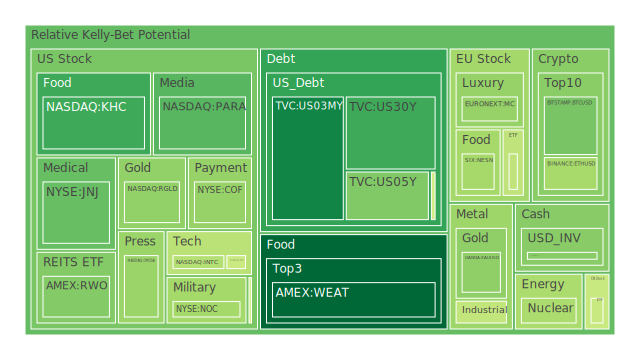
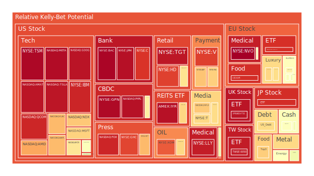
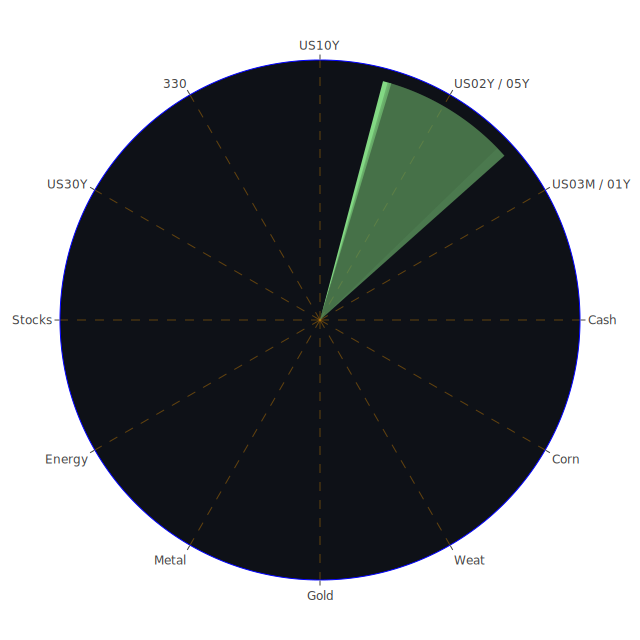

# 一、投資商品泡沫分析

## （1）美國國債
美國國債被視為全球金融市場的重要風向標，牽動著各種利率定價及風險評估。近年來，美國國債在歷經通膨抬頭與美聯儲多次升息後，收益率曲線曾出現相對倒掛，近期又逐漸修復。觀察新聞可知，某些報導提到「股市因擔憂聯準會可能停止寬鬆或重新緊縮，而出現資金撤離」，使得部分資金流向國債避險。然而，依據當前經濟數據（如就業維持強勁），仍有許多投資人擔心通膨的黏性，擔憂長期利率可能再度上行，甚至出現「長端利率小幅升破前高」的預期。美國國債通常被認為泡沫風險偏低，但若長端收益率突然跳升，會引發價格重挫風險。歷史上如1994年「債市屠殺」，正是一旦市場調整預期、債券價格恐面臨大幅修正的典型案例。故此時對美債持有者而言，若收益率再次急劇變動，需警惕短線波動。

## （2）美國零售股
近期新聞顯示部分大型零售商面臨關店或銷售數據低迷的壓力，另有報導指出「主要百貨公司未來將關閉更多分店」。這類負面訊息疊加消費者行為轉向網購，讓市場對傳統零售模式前景存疑。回顧2008年金融危機後，零售股曾在經濟回溫時有不錯表現，但若經濟增速趨緩、就業增長放緩，消費信心下降的情況下，零售營收可能遭受直接衝擊。配合最近「紐約市徵收擁擠費導致人流量下降」等消息，或許顯示了消費型態跟城市交通費用改變有一定相關。這些因素會進一步影響零售業的獲利預期，長期若難轉型，股票估值恐產生系統性壓力。

## （3）美國科技股
美國科技股長期以來經歷多輪泡沫與修正。例如2000年網路泡沫破裂時，全球投資人對科技股的風險有深刻體會。現今，某些科企市值仍處於高位，然而新聞面顯示，有些公司廣告營收增速下滑，或是面臨使用者成長放緩，另有部分企業深陷隱私與反壟斷等爭議。近期又有量子計算領域公司執行長對他人評論提出反駁，表示市場投資人對前沿科技的期望過高。若資本市場對未來現金流預期過度樂觀，估值明顯脫離基本面時，便容易出現泡沫跡象。歷史上2000年以來的多次「科網浪潮」都提醒我們，要留心估值與資金動能的相互關係。一旦利率再上行，企業融資成本增加，可能壓抑科技企業未來發展速度，市場也會調整對成長型公司的評價。

## （4）美國房地產指數
房地產市場牽涉利率、就業與整體經濟等多方因素。2020年之後，美國房市經歷一段強勁的漲勢，但隨著抵押貸款利率在近一年多快速升高，一般民眾負擔能力下降。新聞報導近來提到「房屋銷售減少」、「賣方增加但買方意願卻下滑」，反映了房地產市場或有放緩跡象。回顧2007–2008年的次貸危機，大家都見識到房地產泡沫破裂的連鎖威力。雖然目前銀行體系的杠桿結構與當年不同，且監管也加強，但若利率長期走高，購屋需求可能難再創高峰，房地產指數勢必面臨不小修正壓力。

## （5）加密貨幣
加密貨幣近年歷經多次高點與暴跌，市場情緒極易受政策風向、交易所風險事件或大型機構進場/退場等因素影響。新聞中可見「比特幣跌至兩個月新低，投資人對Fed可能延後降息預期而保持謹慎」，另也有消息稱某些國家進一步打擊非法挖礦或洗錢行為。回首2017年底、2021年初的狂熱漲勢，以及之後的數度腰斬，顯示市場投資人對加密貨幣的價格波動容忍度雖然提高，但系統性風險仍不容忽視。部分投資人也留意到各國央行數位貨幣（CBDC）的推動，可能在長期削弱民間加密貨幣的地位。加密市場屬於高波動、高風險區域，一旦出現流動性問題或監管打壓，價格波動幅度可謂劇烈，泡沫隱憂也時時存在。

## （6）金／銀／銅
貴金屬（如黃金、白銀）與工業金屬（如銅）通常在通膨預期與經濟景氣循環中扮演避險或產業需求的角色。近來新聞稱「黃金對油價比值下降」，也有報導談到「銅價格波動，反映市場對工業需求的疑慮」。歷史上，當經濟進入衰退或地緣政治動盪時，金銀往往成為避險首選，價格可能迅速攀升。但若經濟明顯走下坡、產業投資減少，銅等工業金屬的需求就會下滑，造成價格壓力。這些金屬的泡沫風險相對可控，主要在於市場對衰退或通膨的預期反覆拉鋸，導致金銀銅價格上下波動。要留意的是，一旦有突發事件（如地緣衝突加劇或主要礦區供應中斷），金銀銅也可能瞬間出現價格失衡。

## （7）黃豆／小麥／玉米
農產品容易受到天氣、戰爭、地緣政治、航運成本等多重因素影響。新聞面近來針對部分地區的氣候異常，恐導致糧食產量預估不穩；另因國際物流或關稅政策調整，也可能直接拉抬糧價或造成供需失衡。回顧2010–2011年，中東與北非地區因糧食價格暴漲，引發社會動盪，進而衍生政治危機。當前若有大型進口國突然擴大囤糧，或主產國減產，則農產品行情很可能再度上揚。泡沫風險在農產品領域多半是結合天災人禍、地緣外交而產生的劇烈波動，難以用一般財報或估值模型判斷，故投資該領域需額外留意天氣與政策動向。

## （8）石油／鈾期貨UX!
能源商品（石油與鈾等）一直是地緣政治、產能調控與政策博弈的核心。最近新聞頻繁提及「新的美國制裁或對俄羅斯能源出口構成打擊」，也有正面訊息提到「部分中東產油國仍願擴大產能以彌補市場供應」。石油價格上漲時，航空、航運、旅遊等行業成本隨之抬升，企業獲利壓力擴大；反之，若產油國忽然釋出增產信號，也會使油價下修。至於鈾，雖是較小眾的市場，但核能相關議題往往牽涉重大風險與政治議程。一旦全球關注節能減碳，核能發電重新評估時，鈾的需求有機會回溫，價格就可能出現波動。回顧1970年代石油危機與2011年日本福島事故的歷史，可知能源市場常因重大事件產生急劇變動，泡沫風險在供給受限時特別顯著。

## （9）各國外匯市場
外匯市場受央行貨幣政策、經濟數據、國際資金流向及避險情緒驅動。近期有報導指出「英鎊貶值風險加劇」，另有顯示歐元面臨區域內通膨與政策分歧，澳幣、加幣等商品貨幣也受大宗商品價格波動牽引。外匯市場的泡沫不一定像股票般直觀，但若一國資本大量外流或貿易逆差急劇擴大，就可能使該國貨幣遭受投機資金狙擊。回顧1997年亞洲金融風暴與2015年瑞郎突然脫鉤歐元事件，都佐證了外匯市場在極端狀況下會出現跳空暴漲或暴跌。投資者需關注各國經常帳與外匯存底，以及政治動盪與制裁措施。若國家無法維持健全的貨幣政策或開放靈活的市場環境，貨幣波動可能成為衝擊金融穩定的主因。

## （10）各國大盤指數
不論是美國標普500、那斯達克指數、道瓊工業指數，或歐洲的德國DAX、英國FTSE，乃至亞洲的日經、滬深300、台灣加權指數等，均為市場投資情緒與整體經濟體質的寫照。新聞顯示「多國股市在年初遭遇拋售，擔憂通膨與加息壓力」。回顧全球市場於2020年初因疫情一度劇烈回檔，隨後在超寬鬆政策下強勢反彈，但隨著近期政策轉向、地緣政治衝突持續，股市易受消息面衝擊。大盤指數是否出現泡沫，需看整體本益比、企業獲利能見度、經濟週期等多方指標。目前市場對「下行風險仍在」這樣的論調抱持警覺。投資大盤ETF雖然能分散風險，但若系統性風險飆升，依舊免不了整體大幅回調壓力。

## （11）美國半導體股
半導體產業攸關科技、汽車、工業自動化、國防等多重領域，被視為先進製造業的指標。多家半導體廠最近公告財報並警示可能的庫存調整或需求趨緩。新聞也提到「人工智慧、量子運算及邊緣運算」等新需求，長期看似利多，但短期供應鏈調度和地緣爭議（如某些地區對半導體關鍵材料的出口管制）都可能造成產業波動。回顧2000年科網泡沫與2018年貿易衝突時期，半導體股都曾出現大幅震盪。若企業對新技術前景預估過度樂觀，市場也可能會出現短暫性「本益比過高」的狀態，進而形成泡沫。投資者需同時關注各大晶圓代工、IC設計、設備廠商的營運狀況以及國際禁令動向。

## （12）美國銀行股
銀行類股對利率走勢、高收益債市與經濟週期的敏感度高。若美國利率維持高檔，銀行在放款利差擴大的同時，亦需面對貸款違約率可能上升的風險。新聞報導多次提到「銀行對消費貸款、市場交易融資活動仍在調整」。回顧2008年金融危機，次貸產品與衍生性金融商品的風險引爆了系統性危機。雖然此後監管加嚴，但銀行資產品質仍需高度留意。若商業地產或消費貸款在經濟下行時違約攀升，銀行股價將遭受嚴峻考驗。目前市場對「地產貸款逾放率」尤其敏感，所以投資銀行股時要同時留意放款結構與外部的總體環境。

## （13）美國軍工股
軍工產業由國防預算、外交政策與地緣衝突推動。新聞不斷提及「國際局勢緊繃」，部分區域衝突升級導致軍工需求看漲。歷史上，冷戰時期軍工企業就享有龐大資金投入，但若後續局勢緩和或政府預算縮減，軍工股市值也會出現明顯下修。同時，若政治立場變動、執政黨對軍費支出轉向保守，軍工股也可能遭遇訂單銳減。一般而言，軍工股泡沫風險相對較低，因訂單多和政府簽署長期合約，然而在市場行情高漲時，也不乏投機資金推升股價。投資人應持續追蹤各國軍費預算趨勢與產業集中度。

## （14）美國電子支付股
電子支付涉及網路零售、金融創新與消費者行為的轉變。過去十年許多龍頭企業市值屢創新高，但現在也開始出現成長放緩跡象。近期有新聞指「在部分地區，消費者縮減支出或轉向替代支付方式」，同時某些電子支付平台面臨監管挑戰和數據安全疑慮。歷史上看，2000年代末至今，電子支付相關的風險多在於交易額度成長的天花板，以及消費端信用風險。一旦信貸循環逆轉或技術競爭加速，市場預估的高倍數成長可能需要重新評估。這些公司若營收成長未達預期，估值泡沫易被戳破。

## （15）美國藥商股
醫藥領域高度依賴研發成果、臨床試驗與專利保護。同時，大型藥商也受到政府醫療政策、保險機制的調整衝擊。新聞面常會出現「某新藥獲得FDA快速通過，股價應聲大漲」或「藥價控制政策下，利潤空間被壓縮」。2015年時，美國出現若干藥價暴漲風波，令市場對醫療產業的道德與監管產生質疑。投資藥商股時，若遇到專利到期或研發失敗，都會讓股價劇烈下跌，甚至引起結構性擔憂。泡沫風險在醫藥產業較難一次性擴散至整體市場，但個別公司若估值過高，一旦臨床試驗失利就容易令投資人措手不及。

## （16）美國影視股
影視產業在串流平台崛起後，競爭格局明顯改變。多家傳統大廠與科技公司爭奪訂閱戶，彼此之間博弈激烈。市場曾見「訂閱成長放緩、成本飆升」的報導，也有「優質內容帶動訂戶再度回流」的正面新聞。回顧2019–2021年的高峰時期，影視娛樂股估值一度十分昂貴，但若觀眾黏著度轉弱、製作預算過高，獲利壓力就會顯現。歷史經驗告訴我們，影視行業常周轉於「創新內容需求」與「單一作品或影集失利」的高風險之間。若資本持續湧入而未創造足夠收益，就容易形成泡沫隱憂。

## （17）美國媒體股
媒體公司包含新聞、社群、娛樂、廣告等複合型態。新聞事件提到「某些社群平台因隱私與反壟斷遭官方調查」，亦有「大型併購引發內容整合與裁員」。回顧過去，媒體類股估值常與廣告景氣循環綁定，一旦企業廣告預算縮減，媒體營收就大幅縮水。泡沫風險通常在市場過度信任某媒體平台的成長潛力時冒出。若整體廣告主需求萎縮，又或者用戶習慣在科技與自媒體平台分流，傳統媒體收益面臨緊縮，估值隨之下修。

## （18）石油防禦股
石油防禦股指的是那些主營策略為對沖能源價格波動的企業，如油田服務、基礎設施、防災技術等。近年來，地緣政治導致石油供應受到關注，不少資金湧入該類公司。但若原油價格走勢反轉，或環保趨勢加劇，政策對化石燃料限制增強，這些企業的營運可能受挫。歷史上，石油危機往往伴隨對傳統能源企業的高漲投機。然而，一旦供需重新平衡，或新能源技術快速崛起，傳統石油防禦股可能失去市場青睞。

## （19）金礦防禦股
與前述黃金類似，金礦開發類股在「金融市場波動或地緣衝突升溫」時常被視為避險。近來金價波動雖然不算極度劇烈，但若出現通膨再度抬頭、利率卻無法迅速調整的情境，市場往往湧向黃金，帶動金礦股飆漲。歷史上類似2010–2011年黃金大漲時，有些金礦股股價在短時間內翻倍，但後續金價回落也使投機泡沫破裂。由於採礦行業受環境與人力成本，以及各國開發許可制度限制，若金價調整，金礦公司獲利立即受到打擊。故對該類標的而言，投資人需關注全球利率走勢與地緣突發事件，泡沫風險和黃金本身走勢緊密相連。

## （20）歐洲奢侈品股
歐洲奢侈品龍頭遍布法國、義大利等地，客源主要來自全球高淨值消費者與新興市場。新聞面提到「歐洲奢侈品公司在亞洲地區銷售再度恢復成長」，也有報導說明「旅遊業復甦帶動奢侈品購買力」。歷史證明，奢侈品在經濟繁榮時尤受青睞，但一旦經濟下行或地緣衝突造成消費者不確定感提高，銷售可瞬間縮水。2008年後，奢侈品雖在中國與新興市場推動下快速回升，但若全球經濟再度放緩，加之與當地電商或新興品牌競爭，也有出現泡沫嫌疑的可能。投資者需關注高端消費心理變化與富裕族群資產配置狀況。

## （21）歐洲汽車股
歐洲車廠包含豪華品牌與大眾市場，同時面臨新能源轉型與市場競爭。新聞面曾指「中國電動車外銷到歐洲搶市」，也有報導「歐洲因能源危機導致製造成本上升」。歷史上看，汽車業常受經濟週期起伏影響，一旦利率走高或消費力道減弱，車市銷售數據也會轉弱。倘若新技術投入不足，被電動車或其他創新產業超前，對傳統車廠或許構成長期壓力。歐洲車廠的泡沫風險不若純科企般明顯，但若市場對其轉型成功過度樂觀，股價可能在營收證實無法如預期般大幅成長時大幅回調。

## （22）歐美食品股
食品產業在經濟學上屬必需消費，但國際食品龍頭常受大宗商品價格、貨幣匯率、國際貿易政策影響。新聞顯示「消費者支出結構改變，部分人轉向更健康或在家自行烹調」，也有報導「速食產業調漲價格引來客戶抱怨」。回顧2014–2015年，俄羅斯、巴西等主要農業出口國匯率波動，就曾衝擊全球食品企業利潤。當前若石油與運輸成本增加，也會推動食品成本。食品股泡沫風險相對較小，因必需品特性維繫了穩定需求，但若原材料大漲或營運管理不善，仍可能影響盈利，使高估值產生修正。

---

# 二、宏觀經濟傳導路徑分析
從空間維度出發，全球主要央行貨幣政策分化明顯：美國與若干經濟體仍在抑制通膨；歐洲雖同時面對能源問題，但也逐漸走上升息路線；部分新興市場在外匯與資金外流的壓力中放緩寬鬆節奏。這些差異將使國際資金在高收益率與避險需求間來回流動，也可能形成「各地市場輪動」的空間性傳導。

在時間維度上，市場先前對「FED很快會結束緊縮」的樂觀假設，近期因就業數據強勁、通膨仍高，開始出現反轉，不少資金選擇重新評估風險。回顧歷史，1970年代的高通膨時代顯示，如果貨幣政策未能及時控制通膨，長期經濟成長會被侵蝕，市場震盪期也將延長。當前對未來的預期若再次修正，會進一步牽動債市和股市的漲跌。

觀念維度上，經濟學理論方面強調利率與通膨之間的緊密關係；社會學和心理學層面則關注投資人「對衰退或危機的集體記憶」，遇到不確定時容易放大恐慌；博弈論則暗示各國在地緣政治博弈下，或選擇保護本國產業，加重財政補貼或貿易壁壘，增添國際市場摩擦。這些都可能放大市場波動，不斷透過匯率、資本流動、商品價格的連鎖反應，傳導到實體經濟，反之亦然。

---

# 三、微觀經濟傳導路徑分析
微觀層次可分為企業財務與市場行為。企業端，借貸成本升高使擴張意願下降，部分公司若本身槓桿較高或現金流不足，將面臨債務壓力。再者，原材料價格若因供應鏈中斷或地緣衝突飆漲，企業利潤率勢必受損。市場行為則涵蓋投資人與消費者心理：負面新聞（如零售關店、航空事故、火災、戰爭、政治動盪等）會壓抑消費或投資意願，而正面新聞（如海外訂單大增、新技術突破等）則能短暫提振信心。社交媒體對訊息傳播的放大效應，也常在短期放大股價或某些期貨行情的漲跌幅度，導致資產價格偏離長期基本面，逐漸累積泡沫風險。

---

# 四、資產類別間傳導路徑分析
不同資產間往往存在「120度相位」的概念，亦即在資金佈局時，理想情況是其風險走向呈現某種程度的負相關（約-0.5），以達到對沖效果。舉例來說，當資金避險到美國國債時，往往會使股市承壓；若原油價格上漲，航空旅遊類股就可能走弱，而能源股受益；當匯率劇烈波動時，也會傳導至進出口型企業、黃金與加密貨幣等相對避險標的。這些跨資產傳導有時在新聞面事件（如地緣衝突或大型企業併購）爆發後更加顯著。回顧歷史可發現，1998年俄羅斯債務危機、2011年歐債危機以及2020年疫情初期，都曾出現資金在股、債、金、油等標的間急速切換的現象。如果市場投資人同時持有多元化資產，可能在某些衝擊下減少總體虧損，但若選擇的標的高度正相關，反而在極端風險時同步下跌。

---

# 五、投資建議

以下給出穩健、成長與高風險三大配置主軸，各自內含三個子投資項目。整體比例以100%為基準，可依投資人風險偏好與資金部位彈性調整：

1. **穩健配置（約40%）**  
   - 美國短年期國債：在避險需求仍在且收益相對穩定的條件下，有助降低組合波動。  
   - 黃金：作為長期避險資產，可在市場不確定增加時提供風險緩衝。  
   - 高評級公司債：若能適度篩選財務體質穩健、違約風險低的企業，可兼顧收益與較低波動。

2. **成長配置（約40%）**  
   - 半導體龍頭股：雖短期面臨庫存調整壓力，但長期看好AI、車用晶片等需求；選擇掌握核心技術且現金流強健的領導廠商。  
   - 歐美奢侈品股或消費品牌股：若地緣衝突緩解，旅遊消費回溫，奢侈品與大型消費品企業仍有長期發展空間。需留意估值與市場飽和度。  
   - 大型網路或雲服務科技股：在數位化持續推進的趨勢下，具有規模優勢的企業依舊具成長潛力。惟要預防政策監管與市場競爭。

3. **高風險配置（約20%）**  
   - 加密貨幣：交易週期與風險極高，但波動度亦可帶來潛在獲利機會，若能掌握時機介入並嚴控部位，或可在牛市行情中取得高報酬。  
   - 新興市場外匯或股票：部分新興國家擁有人口紅利與產業轉型契機，但也受政治、外匯與流動性風險影響，需要更嚴謹的風險控管。  
   - 能源題材（如石油或鈾）：若地緣政治陡然升級或供應鏈受阻，價格可能急速拉升。其政治敏感度高，建議小部分配置並隨時觀察動態。

---

# 六、風險提示

1. **泡沫風險**：任何高估值標的，一旦市場情緒逆轉或資金面縮緊，就會產生嚴重回調。尤需注意美國科技股、加密貨幣與部分新興市場標的的波動。  
2. **地緣政治與制裁**：持續關注俄羅斯、歐洲、中東、東亞等地區政治局勢，一旦重大衝突升溫，石油、軍工、農產品等價格或訂單轉變，將對市場造成衝擊。  
3. **宏觀政策變動**：若美國聯準會或其他主要央行改變利率方針，資產價格將立刻反應。市場對降息預期若落空，高槓桿投資者可能面臨流動性危機。  
4. **企業財務質量**：在經濟不確定性下，企業債務違約風險上升。特別是銀行系統的壞帳、商用地產貸款問題，都可能透過金融體系傳遞放大。  
5. **新聞與心理因素**：如近期報導「大型零售業關店」、「電動車搶市」、「火災或空難造成供需中斷」，等等，都會激起投資人短線恐慌或投機心理。情緒因素往往使市場波動幅度擴大。  
6. **歷史規律與不可測事件**：雖可借鑑1970年代高通膨、2000年科網泡沫、2008年次貸危機、2020年疫情等事件，但仍須保持對未來不確定性的警覺。可能還有新型態危機或黑天鵝事件超出以往範疇。

---

透過空間、時間、觀念三個維度的多重對照，並在正反合的觀點下綜合新聞、歷史借鑑、博弈動態與當下市場現象，可看出全球金融環境正處於高敏感度階段。若央行或政府政策發生顯著改變，或某些不可預期的突發事件爆發，都足以撼動原本的資產價格分布與避險策略。

現階段的投資人必須深刻體會到，資產間的漣漪效應相互傳導，一個區域的政經風險、某個產業的技術挫敗、或是一家大型企業的流動性危機，都可能通過外匯市場、債券市場或其他衍生品，迅速蔓延到股市與實體經濟。為求穩健，應先檢視自身資金時間長度、風險承受度與投資目標，並適度分散部位及預留現金流，以因應劇烈波動。能透過不同相位、不同相關性的標的來進行佈局（努力達到負相關或者低相關的效果），可最大程度降低系統性衝擊帶來的損失。

最後要再度強調，投資市場本質上充滿無數不確定性，任何看似明朗的走勢或趨勢，在巨變時都可能發生逆轉。外部宏觀因子（如各國貨幣與財政政策、地緣政治緊張度）以及內部微觀因子（企業獲利結構、杠桿程度、投資人情緒）都須同時關注，方能提高整體投資決策的合理性與安全性。

 
Daily Buy Map:

 
Daily Sell Map:

 
Daily Radar Chart:

 
