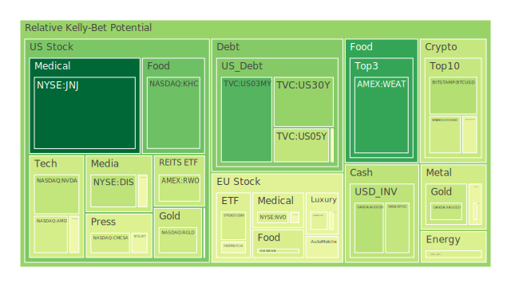
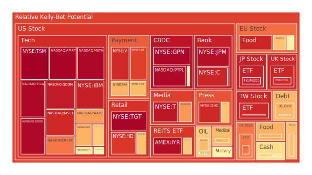
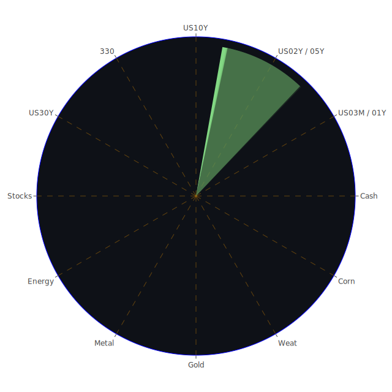

# 投資商品泡沫分析

在當前錯綜複雜的金融市場環境中，投資人往往容易被各種消息面與市場情緒面牽動，尤其面對政治、經濟與社會領域層出不窮的事件時，更須審慎檢視潛藏的泡沫風險。綜合對市場動向的空間性（Spatial），亦即全球各區域市場間聯動；時間性（Temporal），即短期、中期與長期的動態；以及概念性（Conceptional），也就是經濟學、社會學、心理學與博弈論等多領域思維，可從以下多類資產的「正、反、合」進行觀察與論述。

綜觀最新的市場訊號，根據多日累積整理之D1、D7、D14、D30泡沫指數（泡沫分數越高代表可能的風險累積越顯著），整體偏高或急遽攀升的資產，容易在投資氛圍多變時出現劇烈波動。以下將就美國國債、美國零售股、美國科技股、美國房地產指數、加密貨幣、金銀銅、黃豆/小麥/玉米、石油/鈾期貨UX!、各國外匯市場、各國大盤指數、美國半導體股、美國銀行股、美國軍工股、美國電子支付股、美國藥商股、美國影視股、美國媒體股、石油防禦股、金礦防禦股、歐洲奢侈品股、歐洲汽車股、歐美食品股等常見標的進行解析，並同時參考近期新聞面、歷史相似情境及既有理論。

## 1. 美國國債
美國國債近數月來持續在市場扮演避險角色，然而根據最新資料顯示，1年期、2年期、5年期與10年期、20年期、30年期殖利率整體雖仍位居高檔，但與先前相比，曲線各端有些微震盪。過去一年以來，出現了「長端殖利率走揚、中短端也在震盪」的現象，造成市場對未來Fed調整貨幣政策的預期反覆。最新的FED數據顯示，RRP在走低，EFFR Volume卻在高檔，加上FED Total Assets處於相對低位，但美國銀行體系總存款依舊高企，顯示銀行端依然有一定程度的流動性。市場同時預期Fed可能再度遞延「鴿派」行動。近期新聞面，如「美國就業數據比預期強勁」而引發對高利率延續的疑慮，也對國債產生負面情緒，使殖利率保持在高點，抵銷了原本期待之Fed暫停升息後的利多。

若從歷史來看，過去在殖利率升高的時段，美國國債價格往往會受到壓力。然而，一旦風險事件加劇，資金又可能轉向國債作為避險資產。本次泡沫分數D1、D7略有上升，但D30層面尚未至於極端高位，市場疑慮焦點在於「政府債務占GDP持續提高」會否影響後續長端利率攀升與潛在信用風險。投資人可留意若出現違約邊緣政治戲碼，國債變動將會加劇。

## 2. 美國零售股
美國零售股如WMT、TGT等，近來於泡沫分數出現些許走高。零售業通常受到就業與消費動能的顯著影響，而近期新聞提到「美國可能維持高利率」以及「通膨尚未完全消退」，皆使得消費者支出較以往更謹慎。此外，部分新聞指出「強勁的就業數據卻帶動市場對延後降息的憂慮」，若消費者擔心未來利率和物價不斷爬升，零售股的營運成本與貸款利率同步提升，就可能有短期的負面衝擊。歷史上，零售股在利率走高周期易出現估值下修與獲利壓縮，不過，一旦步入假日季或是景氣循環向上時，它們又能快速反彈。

## 3. 美國科技股
美國科技股（如AAPL、MSFT、GOOG、META、NVDA、AMD、INTC、QCOM等）是過去幾年來市場資金極度青睞的對象。然而，最新泡沫分數不斷攀高，尤其部分個股如TSLA、META、GOOG等，D1、D7、D14皆有相當高的風險暗示。這些龍頭企業往往聚焦市場多數目光，一旦投資人對未來利率展望疑慮升溫，或對於企業研發支出及廣告收入有衝擊預期時，會帶動股價大幅震盪。新聞面提到像「Meta計畫大幅裁員」、「Apple面對勞動法與全球供應鏈挑戰」，以及「Google投資新一代雲端與AI芯片技術」，均讓投資人同時看到利多與風險交互。歷史相似案例出現在2000年網路泡沫前後，市場對高成長高估值企業的預期飆漲，但當利率與信用條件收緊後，後續「反轉」的風險也跟著增大，投資人必須高度警惕。

## 4. 美國房地產指數
美國房地產（VNQ、IYR等）受制於抵押貸款利率走高，而根據FED公布之30年固定抵押貸款利率現已來到6.9%以上，相較於前幾年的2%-3%區間有明顯攀升。房地產價格仍在某些區域維持高檔，但交易量、建案融資成本等方面可能已出現壓力。新聞面若繼續報導地區性銀行或REITs在商用不動產上遭遇違約潮，加之商辦空置率攀升，資金更傾向防禦類型股票，房地產相關ETF恐面臨回調風險。歷史上，每當利率快速抬升，加上就業市場若出現明顯回落時，房地產容易形成泡沫破裂。因此，雖目前部分指數的D1、D7泡沫分數尚未在頂峰，仍需密切關注。

## 5. 加密貨幣
BTC與ETH、DOGE等持續在市場熱度中震盪。根據泡沫指數顯示，比特幣（BTC）在D1雖較先前相對穩定，但D7與D30仍處於相對偏高區域，代表若面臨貨幣政策可能的突然轉向，或監管突然收緊，數位貨幣仍易在短時間內經歷大幅波動。新聞面也顯示「比特幣因為Fed利率可能延續高檔而下挫」，同時也有「SEC與其他監管單位盯上交易所與ETF發行人」等負面消息。回顧歷史類似情境，2017年底至2018年爆量退潮、2021年中旬的多次調整，都顯示加密市場牛熊切換快。若其泡沫分數持續高企，投資人必須對此領域抱持審慎態度。

## 6. 金/銀/銅
貴金屬與基礎金屬近期價格在全球需求及地緣政治變動下出現波動。黃金（XAUUSD）隨著「GOLD OIL RATIO」以及「GOLD COPPER RATIO」都有走跌跡象，顯示黃金相對石油與銅的價格比率正在回歸，部分反映了原物料市場相對不斷地受到新制裁與供應緊張因素的影響。銀（XAGUSD）在D1、D7、D14方面出現一定幅度的上漲後再震盪。銅（COPPER）也因部分國家對基礎建設的需求與全球市場對景氣修正的分歧而震盪，加上新聞報導「尼日利亞、德國等地有地緣運輸風險」，這些均會干擾金屬行情。歷史上大宗金屬常在景氣循環中扮演「領先或同向指標」角色，因此需留意各國製造業采購經理人指數（PMI）變化。

## 7. 黃豆 / 小麥 / 玉米
農產品一向深受天候、地緣政治衝突、國際關稅影響，如近期有「墨西哥對美國進口服飾徵收新關稅」、「俄羅斯制裁新規帶動全球糧價波動」等新聞，都為大宗農產品價格增添變數。現今泡沫指數顯示，黃豆（SOYB）大致處於中性偏高區間，小麥（WEAT）略帶波動，玉米（CORN）也有階段性上行之勢。歷史上，若地緣或氣候問題在短期內集中爆發，像是乾旱導致供給銳減，價格跳空飆漲的風險就會放大。近期雖尚無全球性的天災，但任何區域性衝突或天氣異常，都可能促成農產品價格急漲。

## 8. 石油 / 鈾期貨 UX!
石油方面，根據最新價格顯示，美國制裁持續施壓俄羅斯石油產量，使中印需求重新配置來自中東、非洲或美洲的供應，國際油價（USOIL）近期在77-79美元區間波動，新聞標題如「更嚴格的美國制裁可能進一步抑制俄羅斯對中印的石油供給」，帶動對價格支撐。OPEC 也頻傳可能配合減產。歷史上，油市常伴隨地緣政治衝突而出現飆漲，若未來制裁加碼或歐洲與美國的庫存水位偏低，油價飆升可能不容忽視。

鈾期貨（UX1!）方面，因地緣政治對核能安全的討論不斷升溫，以及全球對減碳與綠能多元化布局之加強，導致鈾價格偶有受到炒作的機會。然而，長期核能電廠的建設仍須冗長的程序與風險評估，在疫情後的不確定性下，整體投入尚有波動。歷史上，鈾的價格曾經在2010年代初因日本福島核災而遭遇大幅修正，若未來相關風險被再次放大，其價格也可能顯著變動。

## 9. 各國外匯市場
外匯市場近期新聞面突出的是「英鎊遭看空」、「歐元、美金在通膨與利率預期間拉鋸」。GBPUSD的泡沫分數維持中高，但潛藏8%的跌幅預期在某些報導中被提起。EURUSD則對歐洲大陸的經濟展望頗為敏感，近期歐盟因俄羅斯能源受限、且內部通脹尚未顯著緩解，歐元走勢易受衝擊。若聯準會最終動向繼續鷹派，美元升值空間可能再度出現，而風險資產因而遭受賣壓也並非罕見。另一方面，日圓（USDJPY）維持在高檔，泡沫分數也顯示投資人對日央行或許不願提前轉向的預期，使日圓難有大幅升值的契機，但任何意外措施都會帶來快速翻轉。

## 10. 各國大盤指數
包含美國S&P 500、Nasdaq 100（NDX）、道瓊、歐洲主要指數（如GDAXI、FCHI、FTSE）、中國滬深300（000300）以及台灣0050等。近期傳出負面消息居多，如「負面新聞：美國通膨數據堅挺導致對未來降息預期落空」、「歐洲股市因俄制裁與能源議題低迷」等。雖部分市場（尤其美股）依然有大企業財報超預期的情況，但整體宏觀訊號仍顯示投資人戒慎。台灣的0050泡沫分數則屬於較高區段，意味著市場對科技循環的熱絡期待及對未來資本支出持續成長的押注。然而，一旦全球資金再度緊縮，該類ETF容易受牽連。歷史上，每當加速升息與縮表延長時期，股市出現大幅回調並非罕例。

## 11. 美國半導體股
AMD、NVIDIA（NVDA）、Intel（INTC）、Micron（MU）、KLAC等，是前期驅動市場熱度的重要動能。近年來隨著AI晶片、資料中心、車用半導體的需求升溫，半導體產業多次演繹「高峰—低谷」周期性法則。新聞面可見「AI與雲端需求強勁」，但也出現「全球經濟降溫、手機與PC市況衰退」等負面因子交織。根據最新泡沫指數，NVIDIA與AMD在D1、D7乃至於D30都有偏高的風險信號，顯示若市場心態迅速反轉，半導體股可能面臨資金撤離的壓力。歷史上，2001年與2008年等科技或金融危機時，半導體股的跌幅往往十分深刻，需要慎防景氣輪動。

## 12. 美國銀行股
BAC、JPM、C等銀行，在利率上行時通常能獲利於淨利息收益擴大，然而目前市場也擔憂「商業地產貸款與消費信用貸款」的違約風險。同時FED報告指出「Charge-off Rate on Credit Card」與消費者違約指標已有增溫跡象。新聞面持續出現「銀行為了應對潛在的不良貸款增加而充提準備」，且若後續景氣下行幅度加深，該類股仍需面臨資本壓力。歷史上，銀行股曾於2008年金融危機中重創，因此縱使現在資本水位較以前更充足，系統性風險爆發時仍不容小覷。

## 13. 美國軍工股
LMT、NOC、RTX等公司，近年因地緣政治不斷升溫而享有一定程度支撐，包括中東地區緊張、歐洲局勢、印太區域以及最新各國增購先進武器的訊息都有利於防禦性軍工產業。新聞面顯示「瑞典將加派軍艦進駐北約在波羅的海之行動」，也有「美國與英國正擴大對伊拉克安全合作」，皆意謂後續軍備需求不會馬上減退。根據泡沫指數顯示軍工股有一定熱度，但尚未如高成長科技股那般泡沫化。歷史上，軍工股常在地緣升溫之際逆勢走強；唯若國際情勢忽然和緩，或政府削減軍費，此類股價亦可能快速回落。

## 14. 美國電子支付股
V、MA、PYPL、GPN等在疫情期間快速成長，電子支付需求大增。如今疫情雖趨緩，但網購模式已成習慣。然而，隨著全球經濟進入不確定狀態，消費支出動能若放緩，交易手續費收入亦受影響。新聞報導「美國通膨與就業數據交織」，投資人擔憂高利率長期化。從泡沫指數觀之，Visa、Mastercard都顯示高分區間，PYPL更顯示出有潛在下行風險，暗示市場正重新評估此類科技型金融服務的未來獲利空間。歷史上，支付服務商與消費者支出高度相關，若再遭遇監管、專利或安全疑慮，股價波動幅度將更大。

## 15. 美國藥商股
JNJ、MRK等醫藥類股通常被視為防禦型標的，在經濟衰退或市場波動時，往往能穩定維持現金流。然而近期有新聞提到「藥價壓力」、「專利到期風險」等，使此類公司短期股價震盪。歴史上看，藥商股長線穩健，但若遇到研發失敗、併購風險或重大藥物官司，其泡沫亦能快速累積並破裂。當前泡沫指數顯示部分藥商股雖偏中高，但尚未至極端水準，後續仍須持續關注政策及研發面訊息。

## 16. 美國影視股
如DIS、CMCSA、PARA、NFLX、FOX等。影視娛樂產業正遭受OTT競爭加劇、廣告預算壓縮，亦有消費者支出分散的影響。新聞面如「Meta廣告營收下滑」、「字母公司廣告主預算縮減」等訊息，都暗示影視與串流平台同樣面臨廣告收入壓力。DIS則有部分併購與人事消息干擾，加上傳統影院觀影人數尚未回到疫情前水準；NFLX雖有復甦跡象，但競爭對手林立，成長空間或受限。歷史證明，當廣告市場寒冬出現或經濟走向疲弱，娛樂產業往往承壓。

## 17. 美國媒體股
與影視股部分重疊，媒體業包含NYT、GHC等，廣告收入占營收很大比重。新聞指出「某些媒體公司面臨裁員」、「訂閱制平台成敗互見」。目前泡沫指數顯示部分媒體股已有高企傾向，短期若總體經濟持續疲弱或廣告景氣不佳，泡沫恐快速瓦解。歷史上，媒體行業面臨技術改革時常出現新舊勢力博弈，投資人需要從產業結構變遷來判斷中長期風險。

## 18. 石油防禦股
當國際油價走高或地緣風險升溫，石油相關防禦股常因配息與能源保護優勢而走強。例如XOM、OXY等。新聞面顯示「新制裁與俄羅斯限產可能推高油價」，帶來短期利多。泡沫分數雖不及科技股誇張，但仍不可忽視極端走勢可能。歷史上，油價泡沫通常與政治局勢密切相關，若中東、俄羅斯或其他產油區域情勢出現重大轉折，漣漪效應也會傳導至相關股項。

## 19. 金礦防禦股
RGLD等，因金價走勢與避險需求影響。若市場擔心股市震盪，大量資金或流入黃金等避險資產，拉抬金礦股價。但金礦股亦常被視為槓桿化的黃金投資，當金價下跌時，下行幅度也更大。觀察當前FED數據與通膨信號，若後續通膨止穩而利率持續維持高檔，黃金需求也可能被壓制。回看歷史，金礦股時常呈現劇烈波動，投資人須留意自身承受度。

## 20. 歐洲奢侈品股
歐洲奢侈品（如MC、RMS、KER）表面上看似受全球富裕消費者帶動，但若整體經濟下行，奢侈消費增速就會趨緩。近來中國與亞洲旅遊復甦令其營收有潛在利多，但俄烏衝突與歐洲經濟體不穩定等因素則形成隱憂。歷史上，2008年金融危機時，奢侈品銷售大受衝擊，後來在新興市場需求支撐下才逐漸回升。泡沫分數顯示MC與RMS處於中高區段，暗示如果市場信心轉弱，該類股易出現獲利了結。

## 21. 歐洲汽車股
像BMW、MBG等，歐洲汽車業受制於能源轉型與電動車崛起，外加今年燃料價格波動與供應鏈受俄羅斯衝擊，加上歐洲整體經濟展望趨緩，汽車消費可能放緩。但若電動車銷售持續成長，又有政府補貼，則可在短期內支撐其獲利。歷史上，歐洲汽車業一旦面對景氣下行，往往很難立即對產能與就業進行快速調整，形成「高固定成本」的壓力。雖目前看來泡沫指數沒有極端高檔，但中長期仍需留意產業變局。

## 22. 歐美食品股
如KO、KHC、NESN等，防禦性質明顯，市場動盪時，食品飲料股對資金具有一定吸引力。不過，若原物料（農產品、糖、咖啡、可可等）價格高漲，生產成本攀升也會壓縮利潤。新聞面提到「通膨仍舊頑強」，代表食品類股未必穩賺不賠。回顧歷史，該類型股票在衰退期間相對穩健，但估值過高時，也曾出現明顯回檔。近期觀察KHC與KO的泡沫分數都在中高區，若企業利潤率下滑而股價被高估，投資人需提高警惕。

---

# 宏觀經濟傳導路徑分析

回到「三位一體」大膽假設的思路：  
1. **空間（Spatial）**：在全球化後，貨幣政策與產業供應鏈交織。譬如，美國對俄羅斯油氣的制裁衝擊歐洲與亞洲供應；中國與印度因此改變進口來源；農產品價格因戰爭、天候與關稅連動；金融資金於避險時分流至美國國債或金礦股，或流向外匯市場對沖。這些空間性的連動造成多市場同步波動。  
2. **時間（Temporal）**：短期來看，各國央行立場與就業、通膨數據驅動市場劇烈情緒；中期則要視地緣政治演變、企業獲利報告；長期還須留意全球綠能轉型、人口結構、政府債務占GDP比率升高等結構性因素。  
3. **概念（Conceptional）**：運用經濟學（供需、利率）、社會學（消費行為與政治民心）、心理學（風險偏好循環與市場泡沫心理）、博弈論（各國爭取資源與投資者多空博弈）。比如，在高利率環境下，市場對企業估值偏謹慎，出現「資金搶債券、風險資產受壓」的博弈結果；同時，若各國陷入貿易關稅博弈，則可能產生新一輪匯率與資產波動。

經由正（市場對未來樂觀擴張）、反（市場對衰退與風險急遽收縮）、合（市場達成某種平衡調整）的過程，我們可預期在2025年初的這幾個月內，市場正艱困地尋找方向。經濟結構不穩定之處，容易放大各資產的泡沫化風險。

---

# 微觀經濟傳導路徑分析

微觀層面上，企業獲利前景、消費者可支配所得、產業供應鏈韌性等，都直接或間接影響股價和商品價格。比方，美國銀行業若因消費者拖欠信用卡而導致呆帳率提升，就會壓抑金融股表現。科技股的廣告營收或資料中心需求變動，會傳導到供應商（半導體）等領域。若農產品價格飆漲，食品生產與零售端的成本壓力最終反映到消費者。石油漲價除提振上游能源股，也可能對航空、運輸、旅遊股造成利空。如此層層疊加，使各資產間出現複雜相位耦合。依據本次對沖組合的初步假設，若能在各資產間找出相關係數約-0.5，且相位盡量達到120度的配置方式，或許能在波動環境中降低整體組合風險。

---

# 資產類別間傳導路徑分析

基於對泡沫指數與新聞事件資料的「正反合」整理，可以推演出以下多層「漣漪效應」：  
- **油價飆高** → 運輸與化工原料成本上揚 → 刺激貨幣緊縮預期 → 傳導至科技股、零售股等承壓 → 轉而利好黃金、石油類防禦股。  
- **美國國債收益率竄升** → 企業融資成本提高 → 成長型科技股遭估值下修 → 帶動市場避險需求 → 引發資金湧向防禦型資產與黃金/金礦股；但若收益率過度上揚，也會衝擊黃金吸引力。  
- **地緣衝突升溫** → 軍工股走強 & 能源供應不確定 → 原油、鈾等交易活絡 → 引發其他風險資產被抽離資金 → 若延伸到金融體系違約或信用動盪，銀行股與房地產率先受衝擊。  
- **農產品價格波動** → 糧食成本→ 食品股獲利影響 → 若糧食短缺深化，消費通膨可能再起 → 央行暫停寬鬆的空間被擠壓。

這些環環相扣的機制解釋了各類資產的同步與異步震盪。任何單一事件放大時，都可能引爆局部或全面的資金快速挪移，投資人需要對此保持警惕。

---

# 投資建議

以下提出根據穩健、成長、高風險三種配置類別的簡要思考，並各自選擇三項子投資標的，合計比例為100%，僅供參考：

1. **穩健型**（約50%配比）
   - **美國國債/投資級債**：佔穩健配置的20%。持有期限以中長期券為主，觀察殖利率走勢並視需求避險。  
   - **金礦/黃金**：佔穩健配置的15%。在目前地緣衝突不定與通膨陰影下，仍具避險功能。  
   - **防禦型消費股（如KO、KHC、NESN）**：佔穩健配置的15%。雖然這些食品飲料股估值偏高，但在衰退風險升溫時，仍具相對防禦性。

2. **成長型**（約30%配比）
   - **美國軍工股（如LMT、NOC）**：佔成長配置的10%。全球緊張局勢並未顯著緩解，防務預算預計持續擴大。  
   - **半導體龍頭（如NVDA、AMD）**：佔成長配置的10%。AI、車用、雲端仍具潛力，但留意泡沫分數高企時須機動調整。  
   - **歐洲奢侈品股（如MC、RMS）**：佔成長配置的10%。中國等地的報復性消費可能促成短中期營收增長，但注意歐洲整體經濟波動風險。

3. **高風險型**（約20%配比）
   - **加密貨幣（BTC或ETH）**：佔高風險配置的7%。需嚴控倉位，留意監管風險與市場流動性。  
   - **石油或鈾期貨相關（如USOIL、UX1!）**：佔高風險配置的7%。若地緣衝突升溫或制裁加重，可能出現利潤，但價格波動巨大。  
   - **新興市場科技股**：佔高風險配置的6%。聚焦可能受惠於近岸外包與區域成長的公司，例如墨西哥或東南亞市場；但政治與資金面均存在較高風險。

上述三大類加總為100%。此種佈局嘗試兼顧防禦與成長，一旦市場劇烈反轉，也可適度分散衝擊。當然，實務仍須考量投資人對於短期流動性和心理承受度的需求。

---

# 風險提示

整體而言，不容忽視任何可能的泡沫訊號。從歷史經驗看，當市場同時顯現多數資產D1、D7、D14、D30泡沫分數都位於高位時，若又出現預期外的利率持續上揚或地緣政治激化，可能帶動一連串拋售與流動性短缺。新聞面上已頻現「全球債市震盪」、 「投資人對衰退風險增溫」與「政府債務/GDP向上」等負面消息，也有「墨西哥關稅新制對進口服飾衝擊」、「美國對俄羅斯的新制裁推升油價」等具體案例。若事態快速惡化，勢必牽動金融市場更大震盪。

投資人應持續追蹤全球央行與主要政府之政策變化、企業財報表現、就業與消費意願指標、各產業獲利警訊，以及市場恐慌指數（VIX）的異動。並切記，投資有風險，市場總是充滿不確定性。本報告僅提供整體參考與分析，投資者務必根據自身的風險承受能力與財務目標做出獨立決策，對于泡沫風險高、D1-D30指數連續偏高的標的更要謹慎。過往案例顯示，許多投資人在大幅回調來臨前仍舊樂觀如常，最終蒙受嚴重損失。

綜上所述，當前的全球宏觀局勢複雜且脆弱，微觀傳導與不同資產之間的交互影響深遠，投資人務必在避險與布局之間取得平衡。透過三位一體的空間、時間與概念性剖析，可以幫助我們從最廣泛的新聞、歷史與理論視角去衡量漣漪效應的可能傳導。建立「相位盡量滿足120度、相關係數約-0.5」的對沖組合機會或許有助於分散巨大波動，但仍須就時時變化的情勢來動態調整。本報告在此提供綜合觀點與假設，供參考之用，投資結果則須個別評估與負責。

 
Daily Buy Map:

 
Daily Sell Map:

 
Daily Radar Chart:

 
