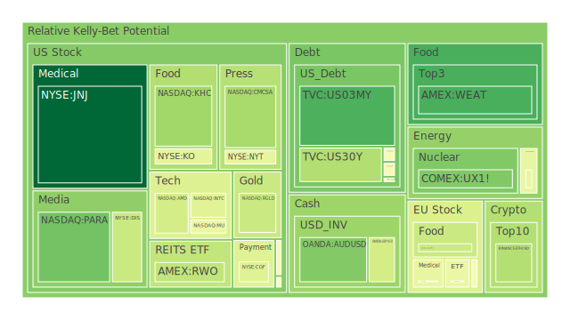
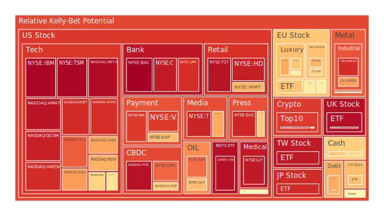
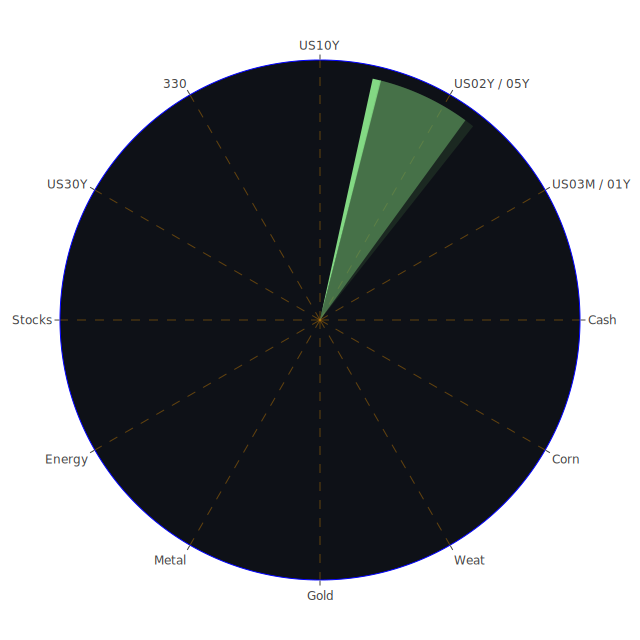

# 投資商品泡沫分析

## 美國國債
近期美國國債殖利率分布從1年、2年到10年、30年之間，依據最新所見，1年與2年期殖利率都落在4%左右，而10年期約4.65%，30年期約4.88%，整體處於頗高水準。在空間面(Spatial)而言，全球資金流向仍將美國國債視為主要避險資產，但大量負面新聞(例如各種經濟下行風險與地緣政治衝擊)仍可能引發貨幣政策前景不確定。在時間面(Temporal)來看，美國聯準會(FED)歷次加息週期結合通脹數據變化，顯示未來幾季若經濟數據惡化，或通脹意外回升，都可能顯著改變市場對殖利率的預期路徑。在概念面(Conceptional)則可用博弈論與經濟學共同檢視：當市場認為FED的鷹派言論放緩，或經濟轉差時，長天期公債需求可能升溫，反之亦然。歷史上(如1980年代初與1990年代中後期)也經常在利率高檔、通膨上行的環境裡出現短期風險與長期風險分化的情況。現階段美國國債的短期泡沫分數雖不算極度顯著，但仍須警惕長天期債券價格瞬間大幅波動之風險，特別當市場流動性或地緣情勢有重大變動時。

## 美國零售股
美國零售板塊的近期消息面多呈現負面：消費者開支在通膨高企與裁員潮頻傳下轉為疲弱，一些零售龍頭公布的銷售預期也顯示前景保守。部分企業(如家居裝修或大型商超類股)的財報顯示獲利壓力攀升。從空間角度看，美國本土零售向來深度依賴國內需求，受到國內宏觀環境和政策情緒(例如就業市場緊縮、稅收壓力)影響甚鉅。時間角度上，節慶旺季已過，年初常是零售板塊淡季，加上聯邦政府對未來財政與貨幣政策的立場並不明朗，市場可能對零售企業季度獲利產生疑慮。概念層面從心理學出發，人們的消費意願在高通膨與裁員消息不斷的情況下，往往傾向防禦。從過往(例如2008年金融危機期間)，美國零售股泡沫風險往往在中短期景氣轉弱時比較突出。目前市場對零售板塊的疑慮大於信心，故其泡沫分數雖不至於極端高漲，但結合新聞面負面聲浪，使該板塊風險相對並不小。

## 美國科技股
最近對科技股不利的新聞(如成長放緩、裁員、以及數家科技大廠被指涉市場壟斷或面臨嚴管)颳起一波負面情緒；同時亦有部份消息指出，人工智慧、雲端服務等領域仍存在中長期發展空間，引發另一波投資人熱情。從空間角度看，科技股擁有全球資本與人才流動的先天優勢，但也面臨國際政治政策限制(如出口管制)。時間層面上，2025年初部分企業財報開始釋出成長下修的跡象，再加上市場普遍預期未來幾季的利率大體仍維持高檔，導致科技類股的估值修正壓力居高不下。概念面，經濟學與博弈論都指向：高估值時若回報不如預期，資金往往快速撤離，造成股價大幅波動。回顧「網路泡沫」(2000年)與「次貸危機」(2008年)，科技板塊都曾因估值過高而急遽下修。目前根據部分泡沫指數顯示(如一些指標公司之D1分數、D7分數及D14分數明顯攀升)，雖然不能斷言馬上會爆發泡沫，但仍須謹慎觀察。

## 美國房地產指數
美國房地產指數過去幾年隨著利率趨勢急劇變化，近兩季在抵押貸款(Mortgage)利率飆升至6.9%左右後，購屋需求可見明顯趨緩。空間層面上，美國各州的人口流動趨勢呈現從高房價地區外流，轉進更實惠地帶；這種區域房產熱度大幅不同的狀況易影響整體指數波動。時間上，因高利率對購屋者的壓力遞延，加上某些地區預售屋量先前過剩，一旦需求難以消化，房價將可能鬆動。概念層面，心理與社會層面皆反映：房地產不僅是投資，也在美國文化裡扮演生活品質與財富象徵，當負面新聞(如大企業裁員)放大時，民眾信心下降，導致房屋交易量下滑。回顧2008年次貸危機，房市急轉直下曾引發連鎖風險，如今雖然整體金融體系較穩定，但若違約率激增，不可排除局部泡沫出現的可能性。短期內風險尚未到達2008年般劇烈，但已需防範部分房地產投資信託(REITs)等敞口較大的標的。

## 加密貨幣
新聞面顯示，比特幣、以太幣等加密資產在今年初曾因風險性資產普遍回調而下跌，後續仍受宏觀利率與監管政策所影響。大數據指標顯示，加密貨幣的泡沫分數近來有所升高，尤其當負面新聞繼續累積(如監管風暴、交易所倒閉風險)時，市場恐慌心理可能加劇。歷史對照來看，比特幣從早期的數次暴漲暴跌可以見得其對風險情緒的敏感度極高；一旦全球投資人對利率預期變化或監管出現轉折，價格就會大幅波動。通過社會學與心理學視角，一部分群體將加密貨幣視為「去中心化金融」的理想象徵，另一部分則不斷憂心其用途與長期價值，加上近期新聞常見「詐騙」、「駭客」等負面資訊，使此板塊的信心依舊脆弱。整體而言，加密貨幣在2025年依然充滿波動，不宜忽視它們的泡沫風險警告。

## 金/銀/銅
貴金屬黃金因避險屬性，在市場風險意識加劇時通常走強；然而近期黃金-原油比率與黃金-銅比率都有所下滑或上升，顯示宏觀風險情緒的變化微妙。新聞報導提到油價高漲與通脹擔憂再起，使黃金長期依舊受到部分追捧，短期內泡沫分數並未大幅飆升，但若全球利率趨勢改變而帶動美元變動，金價亦會隨之震盪。白銀與銅則更易受到製造業或綠能需求影響，若全球製造趨勢放緩，白銀與銅也有價格回調風險。回顧2011年左右貴金屬大牛市，漲勢後期常因投資情緒過熱造成估值偏離，而此刻市場情緒儘管轉趨防禦，但不算失控，建議謹慎保留少量避險配置。

## 黃豆 / 小麥 / 玉米
農產品價格易受天災、地緣衝突與物流瓶頸影響，也與貨幣動向息息相關。前陣子新聞報導能源價格上漲、貨運中斷等等，令農產品一度受提振，但後續需求若放緩，或是經濟停滯，則價格可能突然轉弱。時序上看，每逢大規模氣候異常或國際緊張局勢，農產品波動就被放大。歷史上(例如2010-2012年的糧食價格飆升)也因糧食出口國限製或天氣乾旱造成價格激烈波動。目前泡沫風險並非特別高，但中期若有極端天氣或地緣局勢擴大，糧食安全議題會抬頭，投機情緒也可能驟增。

## 石油 / 鈾期貨UX!
石油近期價格衝上五個月新高，主要因美國對俄羅斯制裁升級，同時美國庫存下滑。透過空間維度看，中東、俄羅斯、美國頁岩油等主要生產區的政治紛擾，使油價極易牽動全球資金的擾動。時間維度上，季節需求、戰略儲備釋放政策都影響油價走勢。概念層面，博弈論與社會學觀點都說明：各產油國往往透過產量政策影響油價，以達到自身利益或政治訴求。另一方面，鈾期貨自2023年之後因核能議題在全球重新受矚目，然而一旦國際安全情勢不穩，或是綠能發展的速度放慢，鈾價可能反覆震盪。目前觀察指標顯示，石油與鈾市場都不乏短線投機資金，泡沫分數有中度水準，須留意需求量真實成長與地緣政治變數。

## 各國外匯市場
外匯市場近來最顯著的現象是美元指數在「利率高檔、經濟強韌」的邏輯下相對偏強，但又因市場預期FED長期緊縮政策或進入不確定週期，導致美元走勢階段性波動。英鎊、歐元、澳幣等面臨各自的通膨壓力與政治議題，有時呈現短期反彈但長期乏力。回顧歷史(例如2014-2015年美元強勢週期、2020年疫情初期美元流動性壓力)，匯市的泡沫主要體現於匯率失衡後的劇烈修正。從社會心理學而言，匯市投資人更容易受新聞消息波動影響，特別當負面新聞如政治動盪、央行意外政策轉向時，匯率波動會更大。目前外匯市場雖未出現嚴重恐慌，但情緒依舊脆弱。

## 各國大盤指數
歐洲與亞洲部分指數(如德國DAX、法國CAC40、台灣加權指數等)隨地緣政治與區域經濟數據震盪。中國經濟雖嘗試復甦，但仍受內需疲軟與外部需求放緩所苦；日本方面通膨仍不明朗，日元波動成為股市指數漲跌的另類推手。綜觀各地，新聞面呈現區域性的企業獲利警訊，如日本調查指製造業景氣、澳洲對中國出口貿易尚未全面恢復等等，都令多數大盤指數波動空間拉大。從過往經驗(如亞洲金融風暴、歐債危機)可知，一旦大盤估值與企業獲利脫節，或有金融風險醞釀，就會誘發泡沫破裂。目前雖無立即信號，但不可掉以輕心。

## 美國半導體股
半導體領域長期以來是科技產業核心驅動力，近年因人工智慧、資料中心、高速運算等需求推升，但隨著總體經濟趨緩、下游需求減速，庫存風險浮現。新聞面提到多家晶片大廠調整生產與裁員，表面上是為了控制成本，但也隱含市況無法支撐先前樂觀預期的成長速度。回首2001年網路泡沫時，半導體亦遭受庫存調整衝擊而股價劇烈回檔；2008年則因金融動盪帶來大客戶訂單驟減。目前雖然半導體應用趨勢未變，但若需求遲遲無法回溫，資金或將撤離估值過高的標的。

## 美國銀行股
銀行股與利率週期息息相關，高利率環境在短期內有助銀行淨利差擴大，但也加劇信用風險，加上近期新聞提到的違約率上升、消費者信用卡逾期率攀高，銀行股恐在資產負債表上承受壞帳壓力。歷史上(如2008年金融海嘯)曾因房貸違約拉垮銀行體系，雖然當前並未出現類似全面性危機，但大型銀行在應對企業融資或債務展延上，仍需承受較高風險。後續若就業市場明顯放緩，銀行壞帳問題可能進一步擴散。

## 美國軍工股
近期美國地緣政治與外交議題持續，美國軍工企業涉及的防務合約往往在全球緊張態勢中受益，但有時也受國會預算分配不確定性影響。新聞面雖有提到一些長期軍售合約或軍事科技研發案對業績有正面支撐，但若政治風向或國際協調發生轉變，可能出現訂單延宕。防務產業長期以來在經濟衰退期較具抗跌性，但若政治立場出現重大變動(如政府換屆)，亦會帶來衝擊。目前看不出特別嚴重的泡沫風險，但估值略顯偏高，須謹慎觀察。

## 美國電子支付股
電子支付行業近年靠網購和數位金融興起而成長，但隨著消費者支出放緩，交易手續費收入可能疲弱。新聞面提到某些電子支付企業正在進行業務調整，以因應可能的經濟下行。同時監管強度對電子支付的合規性提出更嚴格要求，也意味著成本增高。過去電子支付概念在市場上受熱炒，估值曾飆至偏高，參考2000年網路時期電子交易概念股(如PayPal早期)爆發力強，但後來也出現大幅回調。投資人目前對該板塊維持觀望態度。

## 美國藥商股
傳統醫藥與生技公司在市場動盪時通常被視為防禦型，然而過去幾年疫苗、大型新藥題材都曾帶動熱炒，估值也水漲船高。倘若藥商無法不斷推出新產品線，業績將受專利藥權到期與競爭者侵蝕之苦。新聞上提到大型藥廠調整未來研發預算，以因應醫療保險政策變動與價格壓力。回想2015年某些高價新藥風潮退燒後，藥商股曾歷經大幅回跌。故投資者仍需平衡該產業的中長期穩定性與創新挑戰，泡沫不算嚴重，但也不算毫無風險。

## 美國影視股
串流媒體、院線電影、電視網絡等整合趨勢明顯，許多大廠同時面臨製作成本飆升與觀眾分散的壓力。新聞報導，一些影視娛樂公司可能因廣告收入與訂閱成長趨於飽和而調整策略。回顧昔日(例如2000年代中期傳統有線電視興衰的轉折)，影視產業若轉型不及時，就會出現訂戶流失與內容投資回收低落。當前泡沫水平不至於像科技板塊那般極端，但仍有疑慮，投資者應評估各家內容與平台策略的成功率。

## 美國媒體股
媒體生態從報紙、電視、線上整合到社群平台之間，競爭日趨激烈，廣告收益面臨經濟緊縮與資金收緊衝擊。新聞提到多家媒體機構營收下滑、裁員。參考2020年疫情期間的流量暴增後，現在廣告主預算卻轉為保守。媒體股的泡沫風險在於若流量或廣告投放突然下跌，市值往往瞬間蒸發。以往(例如2008年金融危機)也曾見不少媒體業陷入財務危機，目前狀況尚不那麼嚴重，但務必注意該產業正加速洗牌。

## 石油防禦股
所謂「石油防禦股」通常是能源產業中的整合型企業或特殊地處於油價下行時亦可保持現金流的公司。新聞面顯示油價暫時高企，這些企業利潤有機會擴張，但若後續國際協議或需求下滑，防禦屬性依然得面臨油價周期影響。歷史上(如2014-2015年原油大跌)也曾使相對穩健的企業市值受創。泡沫並不高，但波動也不可小覷。

## 金礦防禦股
黃金礦業類股往往有類似黃金避險的特質，但同時會面臨開採成本、環境規範與地緣地質風險。此類公司在金價上漲時可擴大獲利，但若金價修正，股價可能大幅回落。從新聞所述，黃金價格雖然保持強韌，但任何利率、美元匯率的突變都可能壓制金價。由歷史可見(如2011年黃金見頂後許多金礦股下跌逾五成)，該類企業存在結構性風險，短期泡沫不算極端，但值得保持警惕。

## 歐洲奢侈品股
歐洲奢侈品牌常受新興市場購買力支撐，比如中國富裕階層需求一度帶動該板塊大幅成長。然而國際旅遊、政治關係、關稅與消費取向轉變等，都能大幅影響銷售。新聞上提到部分品牌在新興市場增長放緩的跡象，且歐洲本地的通脹壓力與能源問題也抬升營運成本。回顧2015年人民幣波動、2020年疫情旅遊封鎖，奢侈品股都曾有明顯挫折。當前歐洲奢侈品股在高位整理，中期仍須注意下行風險。

## 歐洲汽車股
歐洲汽車業近年面對電動化轉型、供應鏈斷裂與環保規範升級，導致車廠利潤空間與研發負擔並存。新聞面強調，部分德國車廠因能源成本高漲與中國電動車競爭，出現市場份額縮減。歷史上(如2008年歐洲主機廠大裁員)看出當全球經濟下行，歐洲汽車股會同時面臨需求萎縮與研發經費沉重之痛。市場對該板塊的信心屬溫和，泡沫風險中等。

## 歐美食品股
食品飲料與必需消費品在經濟下行時，相對具有防禦性，惟新聞顯示通脹壓力導致原物料成本飆漲，不少企業削減利潤預期。回顧多次通膨時期，食品業雖能把部分成本轉嫁給消費者，但若遇到需求轉弱或原料進口受阻，也會產生淨利率下滑的問題。歷史上(如2011-2012年通膨環境)已有案例。預計該板塊短期泡沫風險不高，若消費者預算緊縮則影響銷售數量，但尚不至於劇烈崩跌。

---

# 宏觀經濟傳導路徑分析
綜觀新聞與FED關鍵數據，可見市場流動性與利率變動交織：EFFR交易量趨向升溫、RRP下降顯示短期資金面在美國內部有再分配跡象；銀行體系方面，信用卡壞帳與商業不動產違約率上升暗示長期消費力與經濟活力承壓。從地緣政治與全球資金流向來看，避險資金部分依舊駐留在美元、美債與黃金，另一方面，高風險、高波動區塊(如加密貨幣、區域性股市)則在新聞頻繁的負面因素下反覆震盪。利率不確定性仍是主導未來幾季經濟走向的關鍵；假如FED再度加息或延長高利率時間，則企業融資成本上升、就業市場降溫，經濟壓力加大。

---

# 微觀經濟傳導路徑分析
企業財報與消費者行為是微觀層面最直接的體現。多家企業提及裁員、預算緊縮、資本開支縮減，而消費者方面因實質所得受通脹與加稅影響，支出意願放緩。投資層面上，銀行股與零售股都受到信用風險、消費力不振的打擊；科技股則高度依賴創新與資金支援，一旦資金鏈緊縮，研發步調或估值將面臨壓力。整體來說，若負面循環(需求降低→企業獲利減少→就業減少→需求進一步下滑)成形，最終將導致更多不良債務的累積。

---

# 資產類別間傳導路徑分析
從空間、時間、概念的三位一體出發，可見美國國債利率攀升→帶動全球債市收益水準變化→使得股市估值壓力加大；同時通脹不確定性若重新升溫→大宗商品與農產品價格易受投機力量推波助瀾→牽動新興市場貨幣與股市聯動下跌；另外地緣政治若惡化→驅動軍工股與避險資產(黃金、美元)短線升溫，但也提高整體經濟衝擊風險→連帶影響金融板塊資本配置與消費者支出水準。這種彼此漣漪效應路徑，可能跨產業與跨市場迅速擴散。

---

# 投資建議

## 1. 穩健配置
在當前環境下，穩健的核心可佔整體投資組合的40%，以分散風險為首要。建議：
- 第一，適度配置美國短天期國債或投資等級債券，因短期利率雖高但到期風險相對較低，可鎖定一部分收益。
- 第二，少量配置防禦型大盤消費股，例如必需消費品類或食品飲料股，因相對抗衰退，股價波動較小。
- 第三，持有有限度的黃金或金礦防禦股，雖然黃金本身的短線泡沫分數並非最低，但作為傳統避險仍具地位。

## 2. 成長配置
此部分可佔整體投資組合的40%，聚焦仍具潛力但估值相對合理的成長標的。建議：
- 第一，關注科技股中的必需產業，如雲端服務、半導體中下游關鍵零件供應等，因長期AI、5G、先進運算需求仍在。須避開估值過於高漲的標的。
- 第二，留意電動車、再生能源或核能(如鈾期貨間接標的)等能源轉型相關領域，雖然波動大，但國際趨勢尚未改變，中期仍有成長空間。
- 第三，挑選具有穩定研發投入且擁有多元產品線的藥商股或生技公司，雖處政策風險，但若管線成功，有望帶來可觀成長。

## 3. 高風險配置
此類可佔整體投資組合的20%，承擔較高報酬的同時亦要承擔波動。建議：
- 第一，一部分投機資金可布局加密貨幣龍頭，比特幣、以太幣等，但因近期監管爭議和波動風險仍大，應嚴控比重。
- 第二，選擇具槓桿的石油衍生品或石油防禦股，預期若油價持續維持高位，短期內報酬可觀，但若地緣風險緩和或需求下降也會面臨暴跌。
- 第三，集中火力在少數新興市場或特定地區主題投資，如巴西航空或墨西哥近岸生產供應鏈概念股，因國際供應鏈有轉移跡象，但若全球經濟再次趨緩則衝擊更大。

---

# 風險提示

投資有風險，市場總是充滿不確定性。本報告所提供之觀點僅作參考，投資者應根據自身的風險承受能力與投資目標做獨立決策。就本報告涵蓋的各種資產，包括美國國債、美國零售股、美國科技股、美國房地產指數、加密貨幣、貴金屬與農產品、石油與鈾期貨、外匯、各國大盤指數、美國半導體股、美國銀行股、美國軍工股、美國電子支付股、美國藥商股、美國影視股、美國媒體股、石油防禦股、金礦防禦股、歐洲奢侈品股、歐洲汽車股、歐美食品股等，皆須小心評估其泡沫風險，高估值與市場情緒疊加容易造成劇烈波動。新聞面偏空事件頻繁，任何對FED政策、利率動向、政治局勢、地緣紛爭等的誤判，均可能導致資金快速流動並扭轉行情。

回顧歷史幾次重大泡沫破裂(例如2000年網路泡沫、2008年金融海嘯)，往往是在市場高度樂觀或對系統性風險掉以輕心時突然翻轉。因此保持警覺、做好風險對沖，並以三位一體(空間、時間、概念)維度以及正反合思考方式，及時檢視投資組合間的相位關係、相關係數以及可能的資金漣漪效應路徑，才能在不可預測的市場動盪中盡可能掌握機會並保全資本。任何高泡沫分數之標的，都可能隨時出現劇烈修正或跳空走勢，切勿盲目追高，需動態調整配置。

以上為當前依據新聞信息、各類資產歷史場景、與社會學、心理學、博弈論以及經濟理論等觀點綜合之分析報告。投資人應以慎思、謹慎佈局，並隨時關注市場最新消息，以期在宏觀與微觀條件風雲變化下，依舊能兼顧穩健與機會，把握當下，也為未來做好周全準備。切記，無論市場如何演變，合理的風險管理是投資成功的基礎，而任何短期看似狂熱的漲勢都可能只是自然波動的一環。祝各位投資順利。

 
Daily Buy Map:

 
Daily Sell Map:

 
Daily Radar Chart:

 
