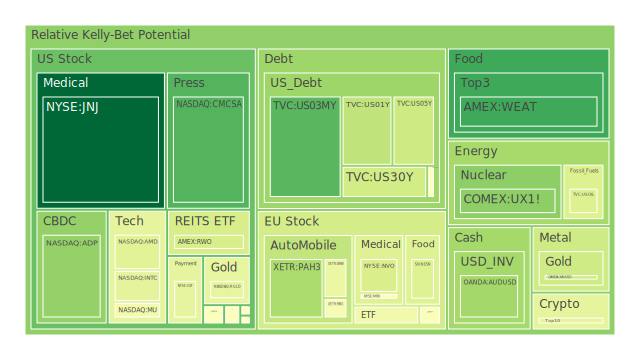
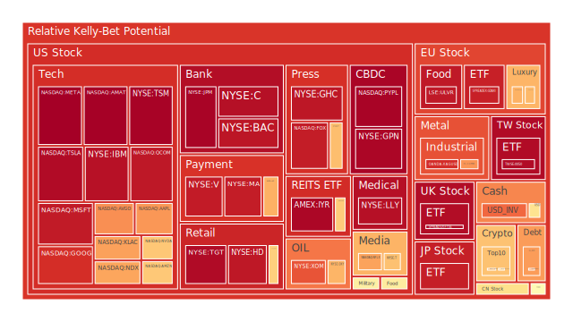
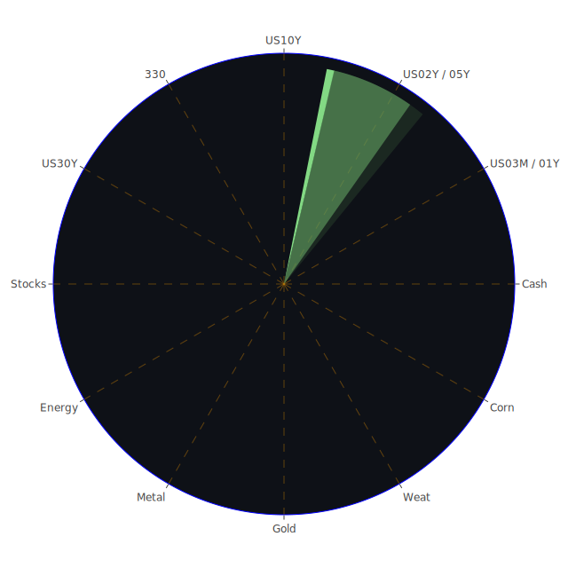

# 投資商品泡沫分析

為了更具體呈現不同資產在近期（例如2025-01-15至2025-01-17）的泡沫風險狀況，我們留意到許多標的的當日（D1）、七天平均（D7）、兩週平均（D14）、以及月平均（D30）風險分數，顯示某些品種開始出現偏高甚至接近1.0的極端值。這些風險分數若逐漸累積，通常反映市場情緒過度亢奮，或可能正醞釀潛在的挫殺拋售。此外，結合近期新聞事件可觀察到全球對地緣政治的不安、科技產業增長的喜憂參半，以及能源供需矛盾等情形，皆對資產估值產生重大影響。

然而，將空間層面與時間維度交疊，也能發現同類資產在不同區域或不同時間窗口所展現的差異性：例如歐洲奢侈品股受益於特定高端消費群體，表面看似仍然強勢，但若與中國市場或美國消費力結合後，後續成長動能是否能持續有明顯變數；又或美國科技股在短期財報利多炒作與長期AI、量子運算等前景的催化下，泡沫風險已來到高檔，而任何負面新聞都可能令其估值大幅回調。概念層面則穿插在其中，比如市場對「量子計算」、「AI翻譯」或「大數據」的高度想像，推動股價脫離基本面，這種「群眾認知扭曲」的過程，在2000年科網泡沫與2017年加密貨幣的狂潮時均有類似前車之鑑。

以下逐一檢視主要資產類別：

## 1. 美國國債
美國長天期國債殖利率一直是市場關注重點。近期10年、20年與30年殖利率大約在4.61、4.93、4.86上下，與前幾週相比輕微下行，但仍處在過去幾年相對高檔。通膨壓力雖有所紓解，但美國財政負債、區域銀行潛在風險、地緣衝突等因素並未完全消除。從空間面來看，國債仍是全球配置資金的「風險避風港」之一，但若FED態度再次轉向鷹派，殖利率仍可能上行。歷史上（如2008年金融危機）投資人普遍在恐慌時轉向美債，讓其成為避險商品，但一旦財政赤字與國債規模快速膨脹，長期來看也不可忽視殖利率的再度飆升風險。

## 2. 美國零售股
Walmart、Costco等零售巨頭，近期在D1或D7風險分數居於中高水準。市場對零售表現的分歧見仁見智：一方面，美國失業率尚未大幅上升，零售企業營收尚有支撐；另一方面，通膨和利率對消費者購買力與信用卡負債已產生壓力。若美國經濟進一步放緩，零售股或面臨盈餘下修的風險。回溯2000與2008年的經驗，零售商在經濟轉壞的早期表面上能維持一定營業額，但若衰退範圍擴大，消費意願下滑會拖累其股價表現。

## 3. 美國科技股
科技股整體泡沫指數高企，特別是多檔超大型龍頭，如Apple、Microsoft、Google、Amazon、Meta，以及受惠AI題材的NVIDIA、AMD等，其D1曾逼近或超過0.9，顯示估值與市場熱度達到極高程度。歷史上，在2000年科網泡沫、2021年初的科技成長股狂潮，都曾見到類似估值快速膨脹後的急跌。一旦新聞面傳來財報不及預期，或法規鎖定大廠進行反壟斷調查，資金就會急速撤離。短期若科技公司仍能呈現營收高增長，股價可延續熱度；但從心理學與博弈論分析，一旦賣出力量成為「群體思維」，往往出現瀑布式下跌。

## 4. 美國房地產指數
房地產相關ETF，如VNQ、RWO等，近月泡沫風險分數相較科技股並不算高，但在聯準會多次升息、30年固定房貸利率超過7%的情況下，未來屋主買房成本仍可能繼續增加。二手房交易量下滑與租金趨穩皆顯示市場需求不若疫情前火熱。2008年房地產次貸風暴的教訓在於：房地產泡沫若大量累積，破裂時對金融體系衝擊往往強烈。現階段雖未出現類似「槓桿斷裂」徵兆，但投資人也需持續留意區域性市場的差異，以及銀行信貸政策轉向。

## 5. 加密貨幣
Bitcoin、Ethereum等加密貨幣一向波動劇烈。比特幣在D1的泡沫風險約介於0.34-0.58，似乎相對不算太高，但加密市場特有的高波動性與監管風險不得不防。過往多次牛市與崩跌都與「市場對監管立場的詮釋」以及「投機資金流入或退出」息息相關。近期美國SEC與歐盟監管機構加強稽查，警示意義濃厚。歷史經驗也顯示，加密資產常在過度樂觀時迅速飆漲數倍，一旦恐慌情緒傳開，連續多日暴跌的情況也不罕見。

## 6. 金／銀／銅
貴金屬方面，黃金始終是地緣衝突、避險需求時的第一選擇，近期的D1雖然多在0.37-0.54間，但若新聞面出現大規模地緣衝突升溫，金價有望再次攀升。銀的風險分數相對較高，部分因工業用途與投機性兼具而波動更大。銅方面，新聞稱銅價在新年初發力，但後續受中國需求、全球製造業訂單與新能源發展左右。歷史上，銅常被視為經濟景氣的晴雨表；若國際衰退或地緣爭端造成需求放緩，銅價便可能回調。

## 7. 黃豆 / 小麥 / 玉米
農產品期貨近期仍受氣候、戰爭與貿易政策影響，包含黃豆、玉米、小麥等若產地天候異常或主要出口國政策波動，很可能在短期出現驚人的價格漲跌。2025年的某些新聞指出阿根廷、巴西收成狀況不一、美國對部分農業補貼政策又有爭議，都將衝擊農產品期貨市場。歷史上，如2010年俄羅斯禁止小麥出口，導致全球糧價陡增，正是此類地緣與天候交織的案例。

## 8. 石油 / 鈾期貨UX!
原油價格近期約在77-80美元震盪，風險分數介於0.28-0.50上下，中等程度；然而若俄羅斯與主要產油國的政治衝突升溫，或OPEC+釋出意外減產信號，油價仍可能急漲。同樣地，一旦需求面轉弱，或有人預測全球衰退，油價也能迅速下跌。鈾期貨在0.26-0.50左右，長期核能需求成長趨勢之下，價格或有上漲空間，但政治爭議和安全問題始終讓該市場投資門檻較高。

## 9. 各國外匯市場
在空間層面來看，外匯市場最能反映不同國家之間的利率差異與資本流向。日圓走弱已持續一段時間，但近期日本央行或有調升利率的苗頭，已讓日圓空頭稍有收斂。澳幣、英鎊、歐元等仍受各自經濟成長或政治決策影響。過去幾十年裡，美聯儲的升息或降息周期，往往牽動美元對主要貨幣的長波動，過度槓桿的金融市場也會隨之震盪。若目前FED真的進入再次降息準備，美元走勢便可能反轉，外匯投資需高度關注此點。

## 10. 各國大盤指數
NASDAQ（NDX）、德國DAX（GDAXI）、英國FTSE及中國大陸上證300等，均受各自區域內的宏觀與政策因素影響；但全球化趨勢下，也有顯著聯動。NASDAQ因科技股佔比高，風險指數時常偏高；德國DAX則對歐洲製造業、奢侈品與汽車工業高度敏感；英國FTSE逼近0.90的泡沫風險可能與脫歐後的產業轉移與金融中心地位調整有關；中國市場則看疫情後的內需復甦與外部訂單的交互影響。歷史多次金融震盪顯示，若美國市場出現系統性風險，歐亞市場幾乎難以獨善其身。

## 11. 美國半導體股
如NVIDIA、AMD、Intel、Micron、Qualcomm等，各公司泡沫指數不一，但整體確實呈現偏高狀態。新聞面顯示美國政府祭出對中國更嚴厲的半導體輸出管制，短期看似利好部分美國廠商，但全球供應鏈割裂卻可能長期降低產業的利潤上限。歷史上，半導體產業屬於「高度週期性」，當市況轉差，庫存淤積、價格崩跌的例子比比皆是，因此投資人需注意企業在對抗全球化裂變的策略與財務彈性。

## 12. 美國銀行股
JPMorgan、Bank of America、Citigroup等巨頭，泡沫風險指數時而逼近或超過0.9。FDIC近期對矽谷銀行破產案中部分高層提出告訴，凸顯銀行業經營或存在暗中風險。若就空間面分析，銀行股同時受到國際資本流向與本地監管影響；從時間面看，銀行業需要在升息階段擴大利差，但又得提防信用違約與市場流動性風險；從概念面來說，大眾對銀行系統的「信心」與恐慌心理常令金融風暴加劇，正反劇情經常在短時間內演化。過去像2008年雷曼兄弟破產便是典型例子，投資人要留意此環節潛在的骨牌效應。

## 13. 美國軍工股
Lockheed Martin、Northrop Grumman、Raytheon等，通常在地緣戰爭、全球局勢不穩時表現相對抗跌。新聞面顯示美國對海外軍售與烏克蘭的軍事援助未見明顯縮減，市場對軍工企業後續訂單預期仍正面。然而若戰爭拉鋸漸趨持久，或各國財政壓力升高以致軍費削減，軍工股也可能轉弱。歷史上，軍工在美國政府預算及國際衝突走勢影響下常一波波輪動，需隨時關注政策細節。

## 14. 美國電子支付股
Visa、Mastercard、PayPal、Global Payments等，估值長期較高。近期Visa、Mastercard的泡沫指數接近0.88-0.92，PayPal甚至到0.96以上，既代表市場相信電子支付的未來潛力，也說明其估值已反映大量樂觀預期。一旦跨境交易量減少，或者消費信心急降，成長速度可能不如預期。從博弈論與心理學角度，在風險意識升高時，投資人常急於鎖定利潤而非堅持長期持有，易引發拋售連鎖。

## 15. 美國藥商股
Merck、Pfizer、Johnson & Johnson、Eli Lilly等，因藥品與醫療服務具防禦性質，一向是穩定投資人喜愛的領域。然而近期根據新聞，Eli Lilly營收與展望不及預期，使其股價下跌。泡沫風險指數方面，J&J一度只有0.01-0.03的相對低值，而Lilly的數值則明顯攀高至0.90以上，可見市場兩極評價。歷史上，藥商股當遇到專利到期、集體訴訟或併購計畫生變時，股價也可能劇烈波動，投資人仍需自我警惕。

## 16. 美國影視股
Disney、Fox、Netflix等大廠在串流、電影、娛樂產業中各具優勢，但也飽受市場競爭壓力。Disney長期投資於主題樂園、版權內容，Fox在新聞與娛樂領域具傳統優勢，Netflix則靠串流模式領跑。不過，近年來串流市場對手環伺，成長幅度趨緩，股價波動頻繁。若借鏡2007-2008年經濟低迷時期，影視娛樂支出雖不至斷崖式下降，但也會隨景氣減速或廣告預算緊縮而下滑。

## 17. 美國媒體股
Comcast、New York Times、Paramount等傳統或跨平台媒體，新舊業務交錯。有些公司廣告收入在經濟逆風下減弱，並須面對社群平台及串流的侵蝕。在疫情期間，網路用戶量一度大增，使這些媒體股短期收益提升，但後續若競爭對手紛紛搶市，盈利恐難持續上揚。歷史顯示媒體行業常隨技術革命洗牌（如電視到網路、再到行動裝置），投資者需關注未來商業模式改造的成敗。

## 18. 石油防禦股
ExxonMobil、Occidental Petroleum等大型石油公司，在油價中高檔時往往收益豐厚，亦能發揮防禦功能。但泡沫風險有時隨油價暴漲而升高，若政治面或供給面出現變局（如中東局勢和美國對於天然氣開採的政策），石油股也會隨之震盪下修。1990年海灣戰爭、2008年金融海嘯都曾造成油價與石油股劇烈波動，投資者須秉持審慎原則。

## 19. 金礦防禦股
RGLD、NEM等金礦股，與金價走勢高度掛鉤。當市場避險情緒走高，金礦股往往因槓桿效應而漲幅更勝金價；反之，若投資人重新偏好風險性資產，金礦股就會先行修正。新聞面短期若不斷傳出地緣衝突或政治動亂，金礦股易受追捧，反映前述空間層面與概念層面的交互作用：一旦人們預期衝突可能擴大，便集中買入貴金屬及相關股。

## 20. 歐洲奢侈品股
LVMH、Kering、Hermès等主要依賴中國、美國與歐洲本土高端客群之需求。近期泡沫風險雖然不算極端（大致0.48-0.68），但一旦經濟放緩、富裕消費者投資受損，奢侈品銷售增速也可能下修。2008年金融危機時，奢侈品雖不至暴跌，卻也跑不贏大市。若地緣衝突導致高淨值客戶縮手或離開某些消費市場，這些歐洲品牌的業績也會受到衝擊。

## 21. 歐洲汽車股
包括BMW、Mercedes-Benz等，泡沫風險時而衝高，主因歐洲產業面對電動化、排放規範升級、以及國際貿易磨擦。歷史上，德國汽車在「柴油門」事件後曾飽受信任危機；未來若歐盟頒布更嚴厲的碳排放規範，加上特斯拉和中國電動車廠商的競爭壓力，歐洲車廠在市場佔有率可能面臨挑戰。

## 22. 歐美食品股
如Kraft Heinz、Nestlé等，受到通膨、糧食成本波動及消費者習慣轉變影響。雖然日常消費品相對穩定，但原物料價格仍在不斷波動，若公司調整售價過高，可能流失價格敏感度較高的客群。回顧歷史，食品股常在金融風暴或景氣衰退時表現相對抗跌，惟長期競爭者眾多，品牌力是否能持續維繫亦攸關未來走勢。

---

在上述分析之中，可見許多資產的泡沫風險分數有一定程度的警訊。若我們把報告開頭提出的「空間、時間、概念」三維度結合來看，會發現一旦地緣政治（空間層面）與短期財報或央行政策（時間層面）結合，再加上投資人對於某些產業前景的高度幻想（概念層面），足以推動股價或商品價格以瘋狂的速度上升。但「正、反、合」的辯證顯示，任何一種利多的正向敘事，只要新聞、實際數據或政策轉向產生反向衝擊，都可能促使資金的快速抽離，最終在價格波動中達到再次平衡。歷史多次證明，市場往往在過度樂觀中爆發風險，或在絕望慌亂中蘊藏反轉機會。

---

# 宏觀經濟傳導路徑分析

整體宏觀層面上，聯準會（FED）數據顯示資金面與金融機制之間依然存在各種跡象：  
- FED總資產縮減，表示量化寬鬆逐漸退出；  
- RRP（逆回購）下降顯示部分資金重新回流銀行體系，但EFFR量仍高企代表隔夜拆借需求旺盛；  
- 信用卡違約率與商業地產逾期等風險逐漸積累；  
- 高收益債利率雖一度攀升，後來又稍加穩定，反映市場對未來降息預期存在矛盾心理。

同時，歐洲在能源供應轉向、亞洲在供應鏈重組、美國內部對銀行業監管與財政政策的博弈，都令人難以對未來通膨或景氣走勢有明確結論。從空間面看，國際間資本流動速度可能加快，尤其是地緣衝突地帶外的安全資產需求較高；從時間面看，投資人關注下半年或明年央行動向，若貨幣政策再次轉向寬鬆，資金或許重返風險市場；從概念面觀之，市場對人工智慧、新能源與軍備競賽的渴望，可能帶來結構性的需求增長，但亦潛藏產能過剩、技術演進過慢的風險。

過往歷史如1970年代石油危機、2008年金融危機，都曾見到宏觀因素（例如石油供給、金融槓桿爆炸）造成市場斷崖式下跌，也見到寬鬆貨幣政策與財政刺激讓股市快速反彈。現今2025年情勢複雜，投資人需持續透過貨幣供應量、利率與地緣衝突演變等信號，研判長短期資產配置策略。

---

# 微觀經濟傳導路徑分析

微觀層面聚焦到企業本身的營運機制與投資人心理：

1. **成本與定價傳導**：  
   若能源與原物料價格上漲，企業需將成本轉嫁給消費者；消費者支付更高價格後，或減少購買量，企業營收與利潤水準可能不如預期，股價也會下修。從空間維度觀察，若該企業供應鏈大部分在地緣衝突或天然災害頻繁地區，衝擊更大。

2. **融資與槓桿**：  
   高利率環境下，企業融資成本提高，一些資金密集的行業（如房地產、電信、航空）壓力更甚。過往在利率上行時，小型企業違約風險增，進而衝擊銀行信貸資產品質。博弈論提示，一旦市場警覺到銀行資本狀況惡化，便會急速抽逃或拋售金融股，引發系統性恐慌。

3. **心理預期管理**：  
   若媒體大肆報導「某科技公司新產品將改變世界」，短期股價往往被拉抬。可是一旦落地成效不明或市場期望失衡，就會反轉下殺。回看2000年網路公司紛紛以「改寫商業模式」為賣點，最終大部分泡沫破裂，僅少數巨頭倖存。這充分說明投資人的概念性期待常左右短期走勢。

---

# 資產類別間傳導路徑分析

多種資產之間存在連鎖反應與漣漪效應：

1. **國債與股票**：  
   依據「避險切換」原理，若市場對風險資產產生恐慌，資金常流入國債與黃金；若央行暗示重啟寬鬆，則股票行情可能再度攀升，而國債殖利率受拋售壓力影響則走揚。

2. **大宗商品與貨幣**：  
   當油價與金屬價格飆升，通膨擔憂增強，貨幣政策可能更趨緊，造成某些新興市場貨幣貶值，而美元反而短期走強；但若美國進入經濟衰退，資金也可能轉向收益較高的新興市場債券或股票。

3. **加密貨幣與科技股**：  
   兩者在投機氛圍中常有共振。當市場對科技創新抱持樂觀，往往也順勢湧入加密貨幣；相反地，若監管風聲鶴唳，科技股和加密貨幣雙雙受創。

4. **能源與軍工**：  
   戰爭或制裁引發油價上升，軍工股因訂單增長受惠；但若衝突緩和，油價回落，軍事預算縮減，能源與軍工都有可能同步回吐漲幅。

投資者在面對上述多重傳導機制時，往往需要同時思考各種風險對沖策略，以分散大規模下跌或巨大波動時的損失。

---

# 投資建議

根據前文對各標的泡沫程度、地緣與政策環境、以及歷史類似場景分析，本報告提出三大投資組合方向，可依照個人風險偏好與資金狀況靈活調整。配置比例（總和100%）僅為示意參考，非絕對指引。

## 1. 穩健型（40%）
- **美國國債（10年、20年等）約15%**：  
  在不確定性升溫時，持有國債可降低整體組合波動；殖利率雖非極高，但穩定性相對較佳。
- **必需消費與歐美食品股約15%**：  
  例如Kraft Heinz、Nestlé或其他必需品類的高市佔公司，市場景氣轉差時，消費者相對不易大幅削減對食品與日用品的支出，防禦特性可補足其他高波動部位。
- **黃金或金礦相關標的約10%**：  
  如金礦公司RGLD等，當地緣政治惡化或金融市場崩跌時，黃金通常上漲，有助平衡組合整體風險。

## 2. 成長型（40%）
- **半導體與科技龍頭股約20%**：  
  若AI、量子計算、5G等長期趨勢持續，NVIDIA、AMD、Microsoft、Apple等龍頭企業具備成長潛力，但短期波動亦大，需分批佈局並持續關注法規與技術演進。
- **奢侈品或醫藥股約10%**：  
  奢侈品如LVMH、Hermès擁有品牌護城河，醫藥股如Merck、Pfizer在醫療需求剛性下長期也具潛力。此兩領域具一定抗週期性，可同時享受成長與防禦。
- **軍工或新能源約10%**：  
  軍工企業如Lockheed Martin受政府支出保障，新能源公司若取得政策支持與技術突破，也可長期收益。但需留意政治因素變化。

## 3. 高風險型（20%）
- **加密貨幣約5%**：  
  BTC、ETH等仍具高波動特質，僅可少量資金參與，避免重倉造成不可挽回損失。
- **新興市場指數或外匯約10%**：  
  中長期若全球資金撤出美元後，部分新興國家（例如拉丁美洲或東南亞）有成長潛力，但地緣與政治風險更高，需選擇改革穩定度較佳的市場。
- **高Beta成長股約5%**：  
  例如Tesla或其他極具波動性的網路股，如能判斷短期利多，則短線收益可觀；但一旦市場情緒翻轉，下跌速度也極快。

這三種類型各佔40%、40%、20%，可彈性微調。若投資人對高風險偏好更低，可將高風險部位進一步降至10%甚至5%，相對地提升穩健配置比例；亦或將資金更多投入成長性標的，追求更大報酬但承擔更高波動。最終仍視個人對總風險水位的承受力而定。

---

# 風險提示

1. **通膨與貨幣政策反覆**：  
   市場多次預判通膨高峰已過，但也有可能再度回升，迫使FED或其他央行重新緊縮。若政策訊號變動快速，資產價格易現大幅震盪。

2. **地緣政治衝擊**：  
   烏俄戰局、亞太緊張、以及任何貿易制裁與關稅壁壘都可能加劇供應鏈斷裂、原料價格上漲，並引發不同板塊價格急動。

3. **金融體系潛在動盪**：  
   雖然矽谷銀行倒閉風波已有一段時間，但銀行體系仍有潛藏風險。若資本水位或債務槓桿持續緊張，可能出現新的連鎖危機。

4. **加密貨幣監管與網路安全**：  
   監管機構持續擴權，任何重拳都可能帶來加密貨幣市場的資金大幅流出。此外，網路安全事件、駭客攻擊也會衝擊市場信心。

5. **泡沫破裂風險**：  
   就像科技股、銀行股泡沫分數達到0.9甚至接近1.0，代表投資人情緒極度亢奮。一旦情勢急轉直下，拋售潮可能極其兇猛，歷史上多次大跌案例都源於高估值或高槓桿環境突然逆轉。

回顧以往，無論是2000年網路泡沫、2008年金融風暴，還是近幾年加密貨幣的跳水，市場每一次過度亢奮，都潛藏了大規模泡沫破裂的警訊。當前情勢同樣如此：部分資產的估值已高企，投資人務必提防過度追高造成的損失。一方面，地緣衝突與政策多變導致資訊快速翻轉；另一方面，群眾情緒常在最狂熱時忽視風險信號。故務請投資人依照自身財務狀況、風險承受能力，並持續追蹤政策面、經濟面與新聞動態，才能在瞬息萬變的市場中保有彈性與退場機制。

---

綜觀全篇，我們將空間（Spatial）與時間（Temporal）、概念（Conceptional）三維度的「正、反、合」思維，融合在投資商品泡沫分析、宏觀與微觀傳導機制、以及投資組合建議中，強調市場不僅受地緣政治（空間）的牽動，也同時受到貨幣與金融周期（時間）以及群眾想像或媒體敘事（概念）的交互影響。各資產之間的漣漪效應時而疊加、時而對沖，使市場預期不斷修正。在此環境下，分散投資、保留流動性、審視槓桿與避險工具，都是投資人應特別留意的關鍵。

最後強調，投資有風險，市場永遠存在無法掌握的變數。本報告所提供的建議與觀察僅供參考，未必適用於所有投資者。建議每位投資人綜合自身財務狀況、投資目標與風險承受度，再做獨立判斷。本報告同樣不排除市場出現各種「黑天鵝」或「灰犀牛」事件的可能性，尤其是當多項資產泡沫指數不斷攀高，便代表市場整體的敏感度與脆弱度都在提升。若泡沫確實破裂，不僅造成財務損失，也可能連帶引起更廣泛的金融和社會衝擊。期盼投資者能以嚴謹態度面對當前環境，並結合更寬廣的訊息與理性分析，制定穩健且具前瞻性的投資策略。

 
Daily Buy Map:

 
Daily Sell Map:

 
Daily Radar Chart:

 
