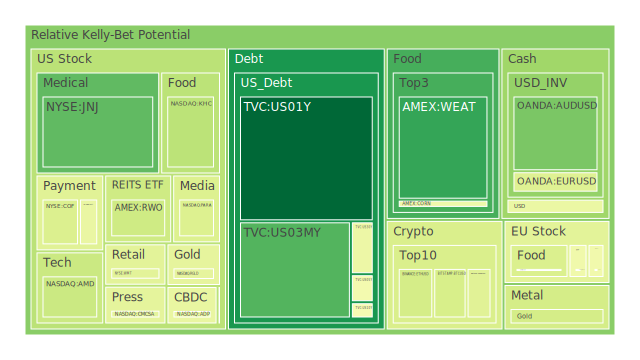
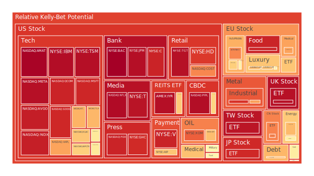
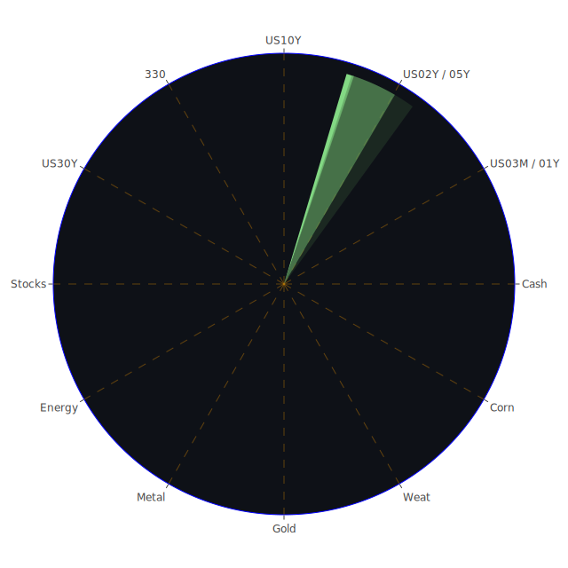

# 投資商品泡沫分析

在面對市場上眾多資產標的時，我們若僅以「漲勢或跌勢」作片面判斷，往往會陷入過度單一或主觀的思考模式；因此，本文嘗試結合經濟學、社會學、心理學與博弈論的觀點，並輔以歷史經驗、新聞事件以及既有理論內外的諸多可能性，來協助投資人更全面地理解當前局勢。我們將「空間（Spatial）」、「時間（Temporal）」及「概念（Conceptional）」這三個層面整合為一個「資訊航母」，再借助「三位一體」的正反合思維，嘗試提出客觀分析，最終再搭配風險對沖及資產配置建議。

以下將依照各常見資產類別，針對其泡沫風險與相關的新聞、歷史背景，進行一個盤點與敘述。需強調的是，本文任何觀點都只是一種可能性與理性推斷，投資市場充滿不確定性，一切波動均屬自然現象，並無意指向任何道德價值判斷。

---

## **美國國債**

美國國債在過去數十年，一直被視為最具安全邊際的資產之一。然而根據近期新聞與各項經濟數據顯示，聯準會（FED）在資產負債表縮表過程中，正逐步消化債券；同時市場對於未來利率路徑也出現兩極化預期：一派認為今年進一步的降息幅度可能比想像中來得更大，另一派則認為通脹壓力無法真正消失，市場或許期待的降息速度會被放緩。在這種分歧情緒下，美國國債收益率出現反覆波動，對短債和長債的需求也同時呈現不同程度的波段行情。

根據部分歷史經驗（例如1970年代的停滯性通膨以及1980年代後期為控制通脹而做的急速升息政策），當市場對利率走向尚未形成一致共識，國債價格可能短期偏弱，伴隨收益率上揚；但若資金最終仍找不到足以替代的避險工具，資金恐最終回流至國債市場，令價格回穩。由於如今美國政府債務規模相對GDP的佔比提升，“美國國債是否真的零風險”依然是國際投資者關注的課題。一旦債務上限談判的政治風險浮現，美國國債也可能面臨階段性波動。泡沫風險方面，雖然美國國債的當日泡沫分數並不算特別高，但部分較長天期（如30年期、20年期）的短線風險指標仍顯示可能存在不小波動。

---

## **美國零售股**

美國零售股近年所面臨的挑戰相當多元，包含電商崛起、物流與供應鏈壓力、勞動力短缺問題，以及通膨對消費意願的抑制效應。在近期新聞事件裡，也可看到有企業因通脹壓力導致獲利能力下滑；另外也有不少金融機構對信用卡應收帳款的違約率提高提出警訊。若消費端受到信用卡循環利息調升的影響，可能進一步削弱零售領域的銷售表現。

歷史上如2008年金融海嘯前夕，零售股往往有過一波快速增長，但在突然的信用收縮與消費信心退潮下即大幅下跌。目前據新聞顯示，部分零售龍頭公司財報仍不算太悲觀，但也沒有呈現強烈的正成長，這透露出市場似乎進入相對觀望狀態。從最近新聞看來，消費性開支可能因「TikTok禁令」、「社交媒體廣告預算轉向」等外部因素而呈現結構性的轉移。一旦這些網路管道被關閉或產生變化，零售企業在行銷與曝光層面勢必得重新布局。泡沫風險就現有數據顯示，零售股的風險評分有些標的已經偏高，特別是銷售依賴度很高的消費品牌；建議投資者在面臨高槓桿與高泡沫分數的零售股時，多加留意隱含風險。

---

## **美國科技股**

美國科技股一直是市場焦點，然而當前情勢並非像2020年疫情初期那般，一旦政策寬鬆就帶動連番高漲，而是在聯準會縮表和升息預期交錯的環境下反覆波動。新聞面顯示，科技股中尤以人工智慧、雲端、大數據相關企業仍然受到市場關注，但近期也同樣有消息指出某些企業的財報不及預期，且對未來成長速度的展望出現分歧。再者，地緣政治使得供應鏈重新洗牌，使得部分半導體、網路服務企業或將受衝擊。例如美國政府或歐盟提出的限制芯片出口之措施，都影響到科技股中高階晶片業者的營運計劃。

回顧歷史，科技板塊曾在2000年網路泡沫時一度衝上高峰，之後迅速崩盤。許多投資人得出教訓：高增長的預期若不能轉化為強韌的現金流量或穩定競爭力，市場迅速翻轉時極有可能造成評價大幅重挫。從最新的數據來看，部分龍頭科技股的泡沫分數曾經攀升到接近1.0，意即短期內價格對未來美好想像的反映過度充分；若之後財報或市場預期出現負面訊號，股價回跌的風險可能顯著增加。當然，也有投資人會以「長期創新價值」為依據，而忽略短期波動。但在此提醒，投資科技股仍需謹慎衡量成本與收益，尤其留意企業的估值水準和未來現金流量能力。

---

## **美國房地產指數**

美國房地產長期以來被視為相對穩健的投資標的，然而在高利率環境下，不動產市場的借貸成本持續走高。根據新聞披露，30年期房貸利率一度突破7%，遠高於2021年—2022年間的低檔水平，使得買家意願面臨考驗。若未來就業情況受到某些企業財報不佳、裁員的消息干擾，可能進一步影響購屋與租賃需求。同時，疫情後有些商辦大樓空置率上升，部分冷鏈或物流倉儲市場也在調整佈局，顯示商用不動產領域的波動性依然存在。

歷史上，2007年-2008年由房貸衍生產品引發的金融海嘯，將美國房地產市場帶到一個深度修正；之後長達十年的升勢令許多資金轉向不動產，尋求租金現金流與土地資產增值。然而，凡是繁榮太久，都需警惕潛藏風險。短期來看，房地產市場雖尚未呈現全面性下滑，但隨著交易量萎縮，價格有機會鬆動。觀察近幾日數據與新聞可知，部分地區（如紐約）房市依舊維持熱度，甚至官方預期公寓評值有機會上漲超過7%，但這種「地區性的繁榮」不足以保證全國整體市場都安全。投資人若投入不動產相關指數型標的，應多關注該指數納入的物件類型及地理位置差異。

---

## **加密貨幣**

加密貨幣的市值在過去幾年像雲霄飛車般忽高忽低，市場波動往往結合了投機心態、政策監管消息與加密貨幣自身的生態演進。有新聞披露某些交易所或金融機構遭受駭客攻擊，或發生詐騙事例，顯示此領域的安全性與透明度一直是詬病之處。近期市場也觀察到部分國家針對加密貨幣交易所提出進一步監管，以及對某些穩定幣進行較嚴格的規範。一旦監管框架落實，不排除部分交易量會轉向地下或轉移至他國，對加密貨幣價格造成新的波動。

歷史上，加密貨幣在2017年曾創下驚人的飆漲紀錄，之後又在2018年初大幅下跌，2020-2021年間借著量化寬鬆浪潮再度推升，顯示出其高度炒作與資金輪動性質。最近觀察到某些主流加密貨幣（例如BTC、ETH）的泡沫評分出現波動，當前雖尚未回到高峰，但部分走勢顯示短線買盤活躍，也有機會短暫衝高。然而，任何政治或經濟層面的負面消息都可能引發急跌。例如先前若有媒體大幅報導「TikTok對加密貨幣廣告限制」等政策，就曾令市場情緒降溫。投資人若想布局加密貨幣，建議謹慎控制部位規模，因其泡沫風險在整體資產裡屬相對高的水平。

---

## **金／銀／銅**

黃金在歷史與心理學層面上，一直被視為抵禦貨幣膨脹及地緣政治風險的防禦性資產。從新聞可見，俄羅斯受到國際制裁、貨幣市場對美元走勢帶有不確定性，都可能推升黃金的需求。不過近來美國收益率維持在高檔，會在一定程度壓抑金價的短期表現。就最新新聞與數據來看，金價雖整體仍處在高位，但市場對於「聯準會是否進一步寬鬆」有不同揣測，因此黃金多頭並未過度狂熱。

銀和銅則更多地反映工業需求。疫情後全球供應鏈的調整，加上地緣政治爭端，使得金屬原料的流通成本與時程備受挑戰。歷史上，銅價往往被視為全球製造業活力的晴雨表；若大國在基礎建設或新能源投資上有重大計畫，銅需求可能迅速提高。然而也常見投資機構以銅來進行金融投機，一旦資金退潮時會出現劇烈下殺。銀除了在首飾與投資市場扮演角色，也在太陽能電池板等產業應用受關注。綜合近期泡沫分數觀察，金、銀、銅之間的價格聯動強弱時常變化，且地緣因素往往是導火線。投資人可視自身風險偏好在商品配置中納入，但要隨時留意可能的急漲急跌。

---

## **黃豆 / 小麥 / 玉米**

農產品期貨一直擁有相當程度的天候風險和地緣政治風險，如糧食出口國遇到災害或地緣衝突，價格就會出現暴漲。在近期新聞中，通膨使得食物價格上漲，且供應鏈因某些地區的氣候異常或戰事而產生限制。這些因素推升小麥、玉米等穀物期貨的市場需求。同時，黃豆在生質燃料與飼料領域的需求也不斷增長。

歷史上，若回看1970年代石油危機引發的糧食價格飆升，可以理解地緣政治衝擊對農產品的敏感度非常高。而從目前已公開的泡沫分數來看，小麥、小玉米等標的正處在一個高位區間震盪，雖不一定已經到達頂部，但若後續地緣局勢有所改善或氣候好轉，價格就可能快速回落。投資者若投入農產品，需觀察該季實際種植面積、產量預估，以及輸出國或進口國的貿易政策，並在杠桿應用上保持警覺。

---

## **石油 / 鈾期貨UX!**

在國際能源需求層面，石油市場經歷了2020年初段的價格崩跌，也在之後出現極為猛烈的反彈。近期新聞顯示，對於俄羅斯石油的制裁加上美國戰略石油儲備調控，使原油供給層面時而趨緊。國際能源署（IEA）也多次提醒地緣政治對石油供給影響的嚴重性。最近數據顯示油價四週連漲，但短線也偶有震盪，暗示市場對全球經濟成長不確定性的擔憂。從歷史案例來看，石油價格常在政治衝突（如1973年石油禁運）或經濟衰退預期之間劇烈搖擺。

至於鈾期貨（UX!），其泡沫風險評分在近幾個月波動也不小。隨著全球逐漸將核能視為減碳過程中的選項之一，鈾需求有上揚趨勢。但鈾市場較不透明，價格易受大型核能國家採購政策影響。若某些國家增加核電投資，或因原油價格過高而把核能視為替代方案，鈾期貨有望受益。然而，一旦國際社會對核能安全重新產生疑慮（歷史上如福島核災），就可能再度引發市場對鈾供應鏈的排斥。投資人須認知到鈾市場流動性相對石油更小，價格波動恐更劇烈。

---

## **各國外匯市場**

外匯市場涵蓋範圍廣泛，包含美元、歐元、日圓、英鎊以及澳幣、加幣等等。近期美國與其他主要國家之間在利率政策上的落差仍是一大關鍵：若聯準會走向比其他央行更快降息，可能造成美元指數回落；但若地緣局勢避險需求升溫，美元又有機會成為資金避風港。市場新聞顯示，日本企業面臨勞動力短缺，高齡化等問題，日圓匯率亦受「是否退出負利率政策」與「BOJ何時出手」的預期牽動；這導致日圓在短期內屢有劇烈波動。英鎊方面，英國因脫歐影響與通脹問題也面臨政經壓力；而歐元則關注歐洲央行對通脹的強硬立場，與能源危機的發展。

在歷史上，貨幣戰常造成匯價在短期內出現大幅度波動，例如1992年的英鎊危機或1998年的亞洲金融風暴，都顯示出匯率政策與市場投機力量相互博弈。就目前的泡沫風險角度而言，外匯並非一般意義上的「泡沫資產」，但高槓桿交易與地緣政治衝突的組合容易使得某些貨幣出現急漲急跌。對投資人來說，若要涉入外匯市場，務必做好停損與保證金控管，不可輕忽新聞面或央行動態帶來的轉折。

---

## **各國大盤指數**

無論是美國標普500、那斯達克指數，或是歐洲如德國指數、法國指數，及亞洲如日經225、上證綜合指數等，全球大盤指數在疫情後歷經一輪低檔反彈，之後因利率不確定性與通脹壓力產生多方震盪。近期新聞顯示，市場對企業獲利的預估趨於保守，然而股市依舊維持相當程度的韌性，令人懷疑是否已累積不少隱憂。從歷史面來看，股指可能在利空消化過程顯得平穩，但一旦市場下意識地將風險集結並爆發，就可能演變為快速修正。

檢視最新數據，部分科技巨頭在大盤指數中的權重升高，投資人實質上是買進了「集中風險」。而從2025年1月以來的新聞面，提及TikTok禁令、美中科技壁壘升級、歐洲緊縮與各式地緣衝突可能左右資金流向。一旦主要經濟體無法對未來經濟增速及通脹控制給出明確指引，大盤指數既可能輕微續漲，也可能面臨較大回調。雖然就泡沫評分來看，大盤整體未必處於瘋狂狀態，但局部板塊（如科技、銀行、高槓桿企業）卻已有可疑的高風險徵兆。

---

## **美國半導體股**

美國半導體企業在近年被推到聚光燈下，尤其在中美競爭、供應鏈重整的大環境下，半導體不只是經濟問題，也上升到國安層級。新聞事件常提到對部分國家的技術禁運、晶圓代工大廠的全球擴廠計畫等，顯示該產業的供需狀態極為敏感。此外，高階晶片需求是否仍有更大增長潛力，取決於5G、AI、雲端運算、電動車乃至於元宇宙等應用場景的發展速率。在歷史上，半導體產業週期性明顯，每隔3-4年就會有一輪景氣循環，此時若評估不當，極容易在景氣高峰階段買進，卻在週期走向衰退時慘遭大幅虧損。

目前據最新的泡沫風險數據，一些大型半導體公司評分顯得偏高，如市面上知名的CPU、GPU設計大廠，前期股價已漲幅可觀，稍有風吹草動就造成短線震盪。再加上近期新聞指出某些廠商在資料中心、AI訓練晶片的訂單遞延，也意味著成長勢頭恐遭遇壓力。投資人若在半導體股部位佈局過深，一旦美國或其他國家採取更嚴厲的技術出口限制，將對產業發展造成不確定性衝擊。

---

## **美國銀行股**

銀行股通常與利率循環高度相關。理論上，若利率走高，銀行淨利差可望擴大。然而在社會學與心理學的視角，民眾對銀行的信任程度、金融監管單位對不良資產的容忍度，也會決定銀行股是否能真正受益。前陣子曾發生某些銀行流動性出了問題，聯準會不得不出手穩定市場；而從新聞面來看，FDIC對矽谷銀行倒閉事件的調查持續進行，顯示銀行體系仍不乏暗潮洶湧。

歷史上，銀行危機往往源自信用風險被低估或高杠桿操作，如2008年雷曼倒閉。當前我們同樣也看到，商業地產與信用卡違約可能漸漸攀升，若經濟趨勢沒有如市場樂觀預期般回暖，銀行資產負債表中的風險恐逐漸浮現。從最新的泡沫評分來看，部分銀行股雖然本益比不高，但在「市場信心」這個維度上卻隱含較高風險。投資者若配置銀行股，須持續追蹤其資產品質與流動性狀況，提防黑天鵝事件爆發。

---

## **美國軍工股**

軍工產業時常受地緣政治的新聞與預算影響，如同俄烏衝突、其他地區軍事摩擦等等。當國際局勢緊張升溫，軍工股在短線可能因訂單增加而表現亮眼，然而若衝突降溫或預算遭受刪減，則股價又會大幅回調。歷史上，美國軍工企業在冷戰期間和反恐戰爭期間皆見證了訂單量與營收的陡增，但之後也相繼出現動能衰退。

目前泡沫評分顯示，軍工股雖不一定到達最高警示區，但倘若地緣局勢忽然大幅和緩，或美國國防預算因國內財政壓力而縮減，就可能衝擊該領域。投資人須注意，軍工合約通常由國家掌控，因此政治風險甚高，非單純依需求面預測即可判斷。

---

## **美國電子支付股**

全球數位支付需求在疫情期間爆發性增長，這些公司股價也在此期間大幅走高。然而，後疫情時代的需求可能進入平穩成長或出現消退風險。近期新聞談及某些電子支付公司面臨詐騙、洗錢嫌疑或支付清算爭議，以及法規機關提高監管要求，這都可能影響企業估值。在社會學和心理學層面，消費者對電子支付的使用習慣與信任度改變，往往產生巨大的市場動能；但一旦有重大隱私外洩或安全問題事件曝光，也會迅速引發擔憂。

歷史上，金融科技行業的成長軌跡常常是「先急速擴張，再在監管逼迫下進入整頓」。目前電子支付股不乏估值偏高的案例，若利率維持高水準，市場對成長股的要求也會提升，導致資金轉移到更穩健的標的。泡沫評分對一些龍頭電子支付企業出現了頗高的警示值，提醒投資者要關注該公司的使用者成長曲線與整體交易額能否繼續支撐高估值。

---

## **美國藥商股**

醫藥產業歷經疫情紅利後，目前或面臨疫苗需求減弱、研發支出提高、政府保險計畫與藥價談判等多重議題。從新聞可以看出：部分藥廠想要拓展新領域（例如癌症治療、基因療法），但進入門檻高、臨床試驗費用龐大且過程漫長，短期股價常受藥品審批結果與公衛政策影響。歷史上，大型藥廠若成功推出革命性新藥，股價可能爆衝；若研發失敗，則估值會面臨重挫。

就泡沫評分來看，美國藥商股的風險與科技股、零售股相比，並非一面倒地偏高，反而呈現較分化狀態：擁有獨家專利或良好管線的公司，市場給予較正面的評價；但若產品線老化，缺乏新藥替換，則評分呈現明顯飆高風險。投資者應逐家檢視公司研發進度、財務穩定度以及潛在專利風險，再來決定是否進場。

---

## **美國影視股**

串流平台日益競爭，傳統影視製作公司與新興OTT廠商之間的版權之爭、人才之爭都持續升級。新聞報導顯示，部分大型影視企業加強全球佈局，但也有企業財務壓力飆升。此外，廣告收入的競爭激烈導致有些影片及系列作集數減少，以降低製作成本。歷史上，影視行業具有「爆款產品帶來短期收益，若無新作品則快速下跌」的特性。

隨著市場對內容品質和多元化需求升溫，投資人要關注該企業是否有強大IP、粉絲基礎與穩定製作能力。如果新聞爆出某公司的旗艦影片口碑不佳或發生醜聞，即可能衝擊股價。就泡沫風險數據而言，影視股近來的整體熱度略降，但部分平台因「訂戶增長可能放緩」而被市場質疑其未來獲利模式，導致風險評分仍偏高。

---

## **美國媒體股**

與影視股類似，美國媒體公司在廣告營收與訂閱服務上面臨社群平台與串流勢力的夾擊；同時，政治立場、假新聞爭議或社會極化使一些媒體企業的訂戶群體相對固定但也局限。新聞報導指出，某些傳統媒體為求生存積極擴展到線上訂閱或多元平台，但轉型速度卻不如預期。若面對即將到來的選舉檔期，廣告預算或許會在短期內帶來營收增長，然而長期成長仍仰賴內容品質與數位化策略。

歷史案例如報業在網路普及後的衰退或電視網隨著線上串流崛起而受衝擊，都顯示媒體業的競爭環境極其殘酷。目前媒體股普遍本益比不高，但市場對其未來成長的懷疑也相當大。因此，泡沫風險可能並不在傳統的價格膨脹，而在於商業模式能否持續帶來足夠的現金流。假使投資人預期政治廣告季帶來短線機會，仍需警惕新聞輿論對該公司的品牌價值影響。

---

## **石油防禦股**

石油防禦股通常指業務涉足傳統油氣或替代能源、防禦性開支的綜合型企業，這類公司在地緣衝突升溫時，可能同時受益於油價上漲與軍工防禦訂單上升。然一旦地緣局勢和緩、油價回跌，這些公司的股價也會減少外部支撐。歷史上，兩伊戰爭、海灣戰爭等都讓石油及相關軍需產業短暫受益，但最終還是回歸經濟成長與成本結構決定公司獲利。

目前某些石油防禦類股在泡沫評分上尚未到極端高位，但因為近年能源轉型與碳排放壓力升高，市場對未來的預期較難估計。投資人若看好該領域，需要衡量「純粹油價」與「防禦訂單」的相互關聯，在評價高峰出脫或在衰退時撿便宜，都需要根據實際財報與接單情形來判斷。

---

## **金礦防禦股**

金礦防禦股是結合「黃金開採」及「防禦概念」的企業，有些企業同時經營軍需相關的金屬開採或其他資源供應。由於黃金被視為避險資產，若市場恐慌情緒升溫，金礦公司股價可能水漲船高；但當風險趨勢下降或利率回升，金價可能下修，導致金礦公司的獲利承壓。在歷史上，金礦公司股價通常比金價波動幅度更大，因為礦業開採具備較高固定成本，一旦價格下跌就會造成獲利急速縮減，而當金價上漲，其槓桿效應又能帶來巨大收益。

目前泡沫風險顯示，部分金礦防禦股的分數偏高，或許與地緣爭端與通脹不確定性令市場資金流向黃金相關標的有關。但是，一旦國際情勢與市場預期逆轉，該類股很可能出現劇烈回吐。投資人須警惕金礦產量、開採成本及公司債務負擔等面向，再評估能否承受其波動。

---

## **歐洲奢侈品股**

奢侈品市場的成長常仰賴新興市場（特別是中國、中東地區）的消費力道，與西方成熟市場的高端需求。新聞時常提及若中國放鬆疫情管控或若出現重大國際體育賽事帶動商旅往來，歐洲奢侈品企業營收就可能大幅躍升。不過在過往經驗中，也出現過因地緣政治或旅遊限制造成銷售重挫的案例。例如香港社會運動或歐洲恐攻時期，都曾對奢侈品銷售帶來強烈衝擊。

目前此板塊的泡沫風險指標，有些公司在股價上已經累積大量利好反映，加上全球景氣若開始走緩，奢侈品市場勢必面臨消費者信心收縮。投資人需謹慎判斷各家公司在亞洲、美洲、歐洲三大市場的銷售占比，一旦某區域需求下滑，可能嚴重影響該公司整體估值。

---

## **歐洲汽車股**

歐洲汽車品牌以其工藝、性能著稱，但在電動化轉型和排放法規加嚴的背景下，傳統燃油車廠正面臨重大挑戰。新聞可看到許多車廠宣布新能源車計畫，但實際產線與市場接受度仍在觀察。再者，能源價格若居高不下，會提高整個供應鏈的製造成本。從歷史來看，汽車產業就算是龍頭品牌，也無法抵擋經濟衰退或石油危機時期的銷售下滑。眼下歐洲汽車股的泡沫風險不算非常高，但也不容小覷，畢竟在經濟衰退時，車市的需求常是首波被削減的可支配支出之一。

---

## **歐美食品股**

歐美主要食品製造企業，面對的挑戰包含原料價格上漲、物流運費居高、勞動成本增加，及消費者健康意識提高導致市場轉變等。新聞時不時爆料企業因應成本壓力而被迫調漲產品售價，也讓部分品牌的銷量下滑。歷史可見，食品工業固然有相對穩定的需求基礎，但大宗商品價格波動、高通膨及貨幣貶值風險都會在全球供應鏈裡傳遞。就泡沫風險來說，一般認為民生必需消費類股票的防禦性較高，因此泡沫分數不會像科技或加密資產那樣誇張，但若市場整體轉向深度熊市，食品股也無法全身而退。建議投資人著重觀察企業的地域營收佈局和對成本轉嫁能力的評估。

---

# 宏觀經濟傳導路徑分析

本質上，宏觀經濟的變數來自多個面向：利率、貨幣供給、就業、市場信心、地緣局勢等等。當前的FED政策多次暗示對通脹的擔憂並未完全結束，但也從先前的多次鷹派言論轉趨謹慎。新聞亦顯示，美國政府債務規模對GDP比重已走高，若債務上限談判衝擊市場信心，資金流向便會迅速轉向避險。

在全球範圍內，歐洲央行和日本央行的立場也牽動外匯市場與大宗商品價格，進而影響企業進出口與金融信心。當全球資金涌向某種貨幣或避險資產時，容易推升該標的價格，可能成為階段性的「小型泡沫」；若政治或經濟事件令資金恐慌撤離，則立刻引發連鎖下跌。此種傳導路徑反映出，宏觀經濟面往往是一種「大環境震盪—資金輪動—市場價格急漲急跌」的過程。

---

# 微觀經濟傳導路徑分析

在微觀層面，各企業的營收、成本結構、市場佔有率、管理效率，都會受到大環境波動影響。例如：

1. **利率走向**：利率提高時，企業借貸成本增加，擴張意願下降，獲利縮減；金融機構則在貸款利差中受益，但信用風險上升。
2. **匯率波動**：匯率改變影響企業原料採購成本與出口價格競爭力。若美元升值，出口型企業盈收可能下滑，進口型企業成本相對便宜。
3. **原物料價格**：如原油、金屬、農產品等大宗商品價格的上漲或下跌，直接影響企業產品利潤率與消費者最終支付價格。
4. **政策監管**：監管措施、關稅、科技限制、金融法令等，會從企業的市場佈局到生產鏈都產生實質衝擊。

這些微觀因素反覆影響企業財報，形成投資者在股市、債市或期貨市場的行為動機，並進一步帶動相關資產價格的波動。

---

# 資產類別間傳導路徑分析

基於三位一體的空間、時間及概念綜合考量，各資產之間往往通過以下路徑互相傳導並產生漣漪效應：

1. **空間（Spatial）**：全球化使資金可在不同地區市場快速流動，若歐美股市走勢強勁，資金也許短暫撤出新興市場資產進入歐美市場。同時，如果美國某項科技法案限制芯片出口，受衝擊的亞洲供應鏈板塊也會震盪。

2. **時間（Temporal）**：短期新聞與市場情緒（如TikTok禁令或某央行緊急降息）可能引發瞬間的資金流向；長期則視企業研發成果、人口結構變動、地緣政治演變來重新調整風險評估。時間拉長後，一旦資訊被逐漸消化，價格可能回歸企業基本面或國家經濟實力。

3. **概念（Conceptional）**：在經濟學、社會學、心理學及博弈論裡，利害關係者的預期互動決定了市場動能。市場常伴隨「從眾效應」：一旦某資產普遍被視為「必漲」，大家搶買就推升價格；但若抱持懷疑和恐慌的資金占上風，市場就很快轉空。

在這樣的動態過程裡，我們可看見各類資產傳遞風險或收益「漣漪」：美國半導體股若大幅回調，整體納斯達克指數翻空，而投資人情緒又延伸影響到零售股、銀行股，最後蔓延到歐洲或亞洲股市，形成交互影響。

---

# 投資建議

綜合以上觀點，我們建議投資人面對當前市場應有以下幾點心法：

1. **多角度分析：** 在空間、時間和概念三個面向各自找出可能的風險和機會，切忌只關注單一市場或短期技術面。
2. **警惕泡沫：** 有些資產的評分顯示風險已經接近高檔，如部分科技股、加密貨幣、銀行股等，務必謹慎分散部位，以免集中於單一高風險資產。
3. **利用避險工具：** 若持有較高波動性資產，可考慮搭配公債、黃金或防禦性股，並關注選擇權、遠期合約等衍生品工具，用來對沖市場突然巨震。
4. **靈活調整：** 必要時根據新聞事件的演變及經濟數據的更新，快速調整倉位，長期則仍以基本面為依歸。
5. **保留現金部位：** 在不確定性大的情況下，保有一定比重的現金或短期可流動資產，能提高投資人面對突發性下跌或重大機會的反應能力。

進一步而言，根據不同風險承受能力及投資目標，可以將投資組合分成「穩健」、「成長」與「高風險」三大類，合計必須是100%。

- **穩健型（合計約40%）：**  
  - 選擇美國國債（中長天期）或高評級公司債做核心防禦（約15%）。  
  - 配置黃金或部分貴金屬相關標的（約10%），以對沖通脹及地緣政治風險。  
  - 防禦性高的食品或日常用品股（約15%），選取在成本轉嫁能力較強、現金流穩定的龍頭企業。

- **成長型（合計約40%）：**  
  - 半導體或關鍵零組件公司（約15%），但須避免估值過高、泡沫分數已接近極端的標的。  
  - 部分電子支付與雲端服務股（約10%），緊盯財報和監管風險。  
  - 歐洲奢侈品或汽車股（約15%），利用需求反彈與新興市場購買力來獲取成長，同時留意經濟下行的壓力。

- **高風險型（合計約20%）：**  
  - 加密貨幣（約5%），選擇市值與流動性相對成熟的主流幣，嚴控槓桿。  
  - 軍工股或石油防禦股（約10%），短期若地緣衝突持續，可能有快速拉升機會；但風險同樣高。  
  - 新興市場大盤指數或小型新創企業（約5%），期待政策放鬆與高成長潛力，並嚴謹設定停損。

以上比例皆可因應個人財務目標與偏好彈性調整，最終重點是將不同資產之間的相關性控制在相對低的水準，使投資組合在市場動盪時不會出現系統性崩盤。

---

# 風險提示

投資永遠存在風險，我們必須注意以下幾點：

1. **泡沫風險高的提醒：** 如今有些資產的泡沫指數明顯偏高，一旦市場情緒轉向，價格可能急跌，尤其在高槓桿情況下更是風險驚人。
2. **宏觀環境不確定：** 聯準會的利率走向仍然左右市場，且美國國債上限、地緣政治與大國競爭等因素都會帶來衝擊。
3. **監管與法規：** 多項新聞顯示，各國政府正推進對數位領域（含社交媒體、加密貨幣、網路隱私）的監管，出其不意的政策措施恐打亂市場預期。
4. **心理與情緒波動：** 博弈論告訴我們，市場參與者往往互相影響，從而出現恐慌性拋售或瘋狂搶購。投資者需保持冷靜，避免盲目從眾。
5. **流動性風險：** 部分商品或地區市場在交易量低時，可能造成巨大的價差與滑價，須謹慎評估進出場成本。

總而言之，投資者在做資產配置時，需持續追蹤各類新聞與經濟數據，並結合歷史經驗與既有理論，在社會、心理與博弈層面進行多重驗證。以上分析並無絕對對錯，只是嘗試以理性態度來面對市場波動，每個人應該根據自身的風險承受力與財務目標做出最適切的決定。

 
Daily Buy Map:

 
Daily Sell Map:

 
Daily Radar Chart:

 
