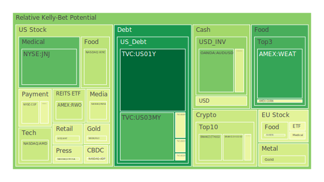
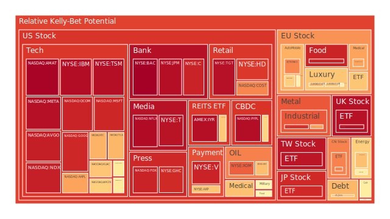
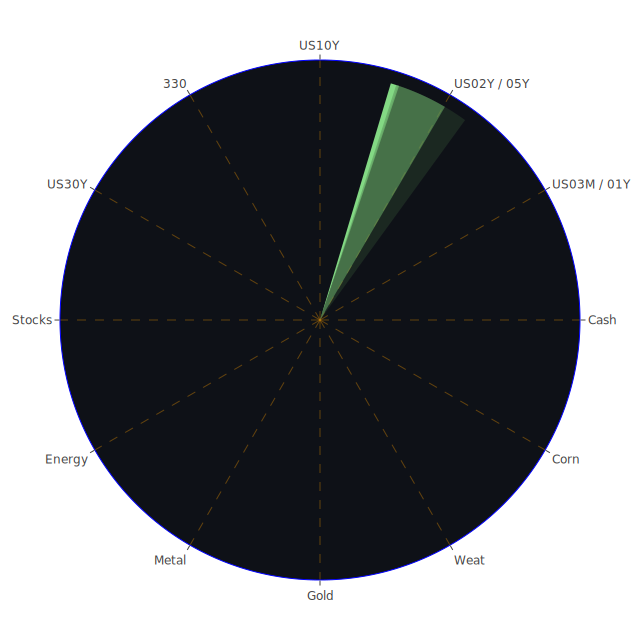

# 投資商品泡沫分析

在正式進入各項投資商品的剖析之前，我們先概述本報告所採用的「資訊航母表格」概念，以及其所蘊含的「Spatial（空間）—Temporal（時間）—Conceptional（概念）」三重視角。此處所謂「三位一體」是指經濟學、社會學、心理學與博弈論之間的交疊融合，結合最新新聞訊息及市場動態，透過空間維度、時間維度與概念層次的整合，在最少文字之中力求最大意涵。再者，基於三位一體「正-反-合」的思維，我們會嘗試從正面假設到反面挑戰，再到綜合平衡，最後提出對各項資產可能的泡沫風險與機會判斷。本報告也會進一步探討如何在多元資產中尋求風險對沖投資組合，並盡力維持相位角大約120度、相關係數約-0.5之投資分散，以避免單一市場崩盤引發連鎖效應。需再次強調的是，報告中的假設與結論僅是為了幫助投資人進行思考參考，並不代表保證任何獲利結果，市場瞬息萬變，投資必定存在風險。

同時也特別呼應要求：本報告雖不直接展示「表格」形式，但仍會提及「資訊航母表格」的多重維度觀點，例如在Spatial層次連結地緣政治、市場結構和資金流向；在Temporal層次比較短期（每日、每週）、中期（數月）、長期（數年）不同階段的動能與週期；在Conceptional層次則融入既有經濟理論、歷史經驗、新聞事件和心理預期；最後，透過三位一體的正反合綜合，將有助於形塑對各投資標的未來走勢與風險的更全面評估。

以下，我們將根據市場上常見且具代表性的投資品種，逐一探討當前所觀察到的泡沫風險訊號（D1, D7, D14, D30為風險分數，值越高代表近期泡沫化的風險程度越高）、相關新聞事件對市場情緒的影響，以及歷史上類似的情境參考。

---

## 美國國債

美國各期限國債近期收益率普遍處於相對高位，尤其是長端（10Y、20Y、30Y）雖然略有波動，但仍在4.6%到4.9%區間盤整。根據最新的FED經濟關鍵數據顯示，美國國債在外國持有的比例近來有所下降，顯示外資對長期美債的興趣略有放緩，反映出市場對美國政府財政狀況和潛在違約風險的擔憂；另一方面，美國銀行體系仍持有相當多的國債，FED資產負債表總體逐漸收縮，而公債發行量仍在攀升。近期新聞中並未有明確的「違約」風險事件，但也有不少負面消息指出地緣政治緊張和債務上限爭議延燒，對投資人心理層面造成不安。

歷史類比方面，2013年與2011年美國國債的債務上限風波，都曾引發全球金融市場對美國國債信用度的關注，當時市場對美元資產的需求因風險趨避或避險而先升後降。以泡沫風險指數（根據資料中D1, D7等）來看，短端如1Y、3M的風險指數大多落在0.02-0.20之間，相對較低；10Y和30Y的D1於最近則相對偏高在0.48-0.56左右，但尚未達到極度泡沫的狀態。綜合來看，美國國債整體風險分數中等偏低，主要是受到全球風險意識或資金迴流美元的避險心態支撐。但若政治爭端或政府停擺風險升溫，此區塊的流動性仍可能帶來一定波動。

---

## 美國零售股

Walmart、Target等龍頭零售商受到最新新聞顯示，消費者支出勢頭或有放緩可能，美國內部信用卡違約率上升。另一面，Walmart（WMT）在過去幾日的D1風險指數都已經突破0.55，甚至在最新一日有0.62左右，其D30指標也高達0.70以上，顯示投資人對零售消費市場前景較為擔憂。此外，Target（TGT）近期的D1接近0.96，波動極大，顯示短線泡沫或市場高估的疑慮甚深。從社會學與心理學觀點來看，若信貸成本持續提升，消費意願下降，零售股雖然通常被視為防禦型產業，但在特殊週期（如後疫情消費力減弱或信用卡負債飆升）時也可能迎來修正。

歷史上類似情境可參考2008年金融海嘯前後，信用市場緊縮導致美國消費者購買力驟降，零售商營收短期出現大幅下滑，不過龍頭企業往往能在市場恢復後率先反彈。現階段來看，Target與Walmart有局部的負面新聞壓力，例如Walmart股東對新政策的反彈、Target受到庫存壓力與通貨膨脹影響。從投資心理面而言，投資人擔憂零售商是否能平衡商品成本與零售價格。泡沫風險整體看來仍相對較高，需要特別留意政策面以及就業數據對最終消費需求的影響。

---

## 美國科技股

美國科技類股，包括蘋果（AAPL）、微軟（MSFT）、亞馬遜（AMZN）、谷歌（GOOG）、Meta（META）、特斯拉（TSLA）等標的，在泡沫風險數據上，D1普遍都在0.70～0.95之間，甚至特斯拉（TSLA）於最新資料中D1接近0.95以上，為極高水平；而Meta（META）接近0.96-0.97，同樣有較高風險。這些科技巨頭在市場樂觀預期與高估值之下，常常成為主導股市漲跌的要角。

就近期新聞而言，美國科技股多半受到AI領域競爭、新型產品推出以及網路廣告市場需求等因素左右。負面新聞包含Meta內部對AI研發的激烈競爭、以及部分政府針對大型科技公司進行更嚴格監管的討論。正面新聞部分，Amazon的物流與貨運業務有所發展、Google在雲端服務布局續漲等。從歷史觀點，可回顧2000年的網路泡沫當時，大量投資資金湧入短期估值衝高後迅速崩潰。現今市場同樣存在對科技創新（如AI、雲端、電動車、自動駕駛等）的高度期待，但預期過高與實際獲利能否匹配，仍是關鍵變數。

投資者可警惕短期過度炒作所形成的泡沫風險，同時也要考慮這些巨頭企業在財務上相對穩健，若政策環境或利率條件出現寬鬆，也可能再度推高股價。因此，對於美國科技股可採用分批分散佈局，而非大舉集中押注。

---

## 美國房地產指數

全球房地產市場在經過疫情後的寬鬆貨幣環境一度大幅抬升。但根據最新FED數據，固定30年期房貸利率已升至約7%左右，相較去年2-3%的水準，成本增加顯著，這導致美國房地產市況出現降溫。代表房地產投資信託的VNQ（美國房地產相關ETF）D1在0.63至0.65間，短線仍偏高，但也不算最嚴峻。由於美國整體通膨及利率趨勢尚未出現明確轉折，房市需求可能繼續放緩。

歷史上，2006-2007年的美國房貸狂潮和次貸危機可謂一大警訊。雖然目前市場結構與那時不同，但高利率環境本身就壓抑購屋意願與投資需求。此外，不少公司縮編員工乃至裁員，也造成辦公室不動產需求下滑。最新新聞顯示，在加州某些地區仍出現火災、或是土地稀缺問題，給房地產市場帶來區域性挑戰。若銀行貸款條件持續偏緊，商辦與住宅地產指數的估值壓力不容小覷。整體而言，房地產指數的泡沫風險並非最高，但仍需審慎看待。

---

## 加密貨幣

Bitcoin（BTC）在先前價格屢創新高後，現報價約10萬美元上下（資料中顯示BTCUSD接近100000上下），以泡沫風險指數來看，D1呈現約0.45-0.66，但7日與30日平均風險分數約0.54-0.58；Ethereum（ETH）也在3000-3500美元上下波動，D1約0.37-0.40，短線泡沫分數較前期降低。然而，市場結構性風險並未真正消失，特別是新聞裡提及多起金融監管機關與加密交易平臺的糾紛。近期亦有「Digital Currency Group與Genesis達成SEC罰款協議」等負面消息，以及大型交易所在銀行端付款管道受阻，都會影響市場流動性。

歷史視角上，加密資產容易受到全球宏觀流動性與投資人情緒驅動，2017年末與2021年初的暴漲暴跌即是代表例。從心理層面看，投資人往往期待比特幣能對沖通膨、或認為它具有「類黃金」避險功能，但在高波動與監管不確定性下，也可能遭遇快速的獲利了結與下跌。整體而言，加密貨幣雖偶有利多（例如NFT和DeFi等創新），但市場對泡沫風險的警訊必須持續高度關注。

---

## 金 / 銀 / 銅

黃金（XAUUSD）依據數據顯示短期價格已經站上2700美元以上，D1在0.40上下，7日至30日區間大致0.39-0.41，並未出現極端高位。白銀（XAGUSD）則出現波動相對加大，D1在0.89-0.90區間，顯示短線或存在投機過熱的跡象；銅（COPPER）報價約4.3-4.4美元磅左右，泡沫風險指數約0.72上下。一方面，市場預期中國與美國的製造業需求持續波動，另一方面則是地緣政治使得金屬類原料的供應鏈存在不確定性。

從社會與心理面而言，金銀通常被視作避險工具，銅則被視作景氣指標。新聞中提到「俄羅斯與北約之間的緊張可能升溫」、各國有可能擴大軍備等，都會推動金銀價格維持在高位。回顧2009年後QE時代，金價曾出現長期上漲，但當美聯儲退出寬鬆並升息後，金價也有一段長期回落。就當前而言，白銀因工業與貴金屬雙重屬性，波動幅度更敏感，短期內投資者應留意籌碼集中度與避險需求的消長。

---

## 黃豆 / 小麥 / 玉米

這些農產品期貨會受天氣條件、全球糧食政策以及地緣衝突影響。根據資料顯示，黃豆（SOYB）D1約0.51、0.52附近，處於中性偏高；小麥（WEAT）短線D1在0.15-0.16間，但30日平均可到0.33以上，波動較為極端；玉米（CORN）D1約0.47-0.51。新聞曾提到阿根廷和美國農業災害、或地緣衝突影響糧食出口，如俄烏衝突此前對全球小麥造成重大供應衝擊。若未來衝突重燃，或自然災害加劇，農產品價格容易快速拉升並伴隨高波動。

回顧過去十年，包含2012年美國乾旱時期，玉米與黃豆期價都曾翻倍；2010-2011年的俄羅斯小麥禁運政策也曾導致小麥價格飆漲。就現況而言，短線波動恐繼續，泡沫風險目前不算最頂端，但仍須提防天氣與地緣事件的「黑天鵝」。

---

## 石油 / 鈾期貨UX!

石油（USOIL）最新報價約77-78美元，根據資料顯示其泡沫風險大約在0.41到0.67之間，一個月平均則在0.30-0.31。相較於2022年地緣衝突最劇烈時，油價暫時沒有再度衝破百元的強烈跡象，但仍受到地緣政治干擾，許多新聞提到「俄羅斯對歐洲的供應可能再次出現變數」，「OPEC+可能會減產」等訊息，隨時可能刺激油價上揚。

至於鈾期貨（UX），由於全球對核能需求的分歧以及地緣政治的壓力，其報價在70-74美元區間波動，D1顯示約0.26-0.56之間，意味著短線市場對核能發電之需求評估相對反覆，亦有消息指出部分國家延長核能電廠壽命，也有國家計畫逐步退出核能。鈾的歷史波動巨大，2007年前後曾因全球核電投資潮而暴漲，之後在福島核災等事件衝擊下大幅回跌，現在依舊帶有政策面不確定性。心理層面上，投資人對此商品較陌生，市場深度有限，易受消息面帶動。

---

## 各國外匯市場

外匯市場近期一大焦點是美元對日圓（USDJPY）、對歐元（EURUSD）、對英鎊（GBPUSD）等主要貨幣的走勢。數據顯示，USDJPY已達156上下高位，泡沫風險D1約0.44-0.46；EURUSD則在1.03左右，D1在0.79上下，呈現高值；GBPUSD約1.22，D1約0.56上下。新聞訊息中提到「美元指數受美國經濟數據穩定及聯準會可能暫緩降息影響而短線反彈」，但也有談到「中國可能對美元制裁或資本管制」，帶來其他不確定性。

歷史上，在高利率周期或避險情緒高漲的階段，美元往往呈現走強態勢。就博弈論而言，若美國持續收緊政策而他國仍相對寬鬆，美元資金的吸引力會繼續擴張。不過，D1達到0.79以上的EURUSD，顯示市場對歐元短線反彈空間或衰退風險均抱著高度爭議。匯市後續變數仍多，要多關注各國央行政策及地緣政治演化。

---

## 各國大盤指數

從資料看，歐洲主要指數（如德國DAX）以及法國CAC、英國FTSE，近幾日D1大多在0.66-0.96之間，最高可到0.96附近；另外日經225指數（JPN225）接近38500-38900之間，D1約0.91-0.92，也顯示投資人憂心高位調整的風險。新聞裡提到「歐洲能源危機趨勢仍不明朗」、「俄羅斯與北約對峙可能加劇」、「部分歐洲銀行退出環保金融聯盟」，都可能影響歐洲投資人的信心。德國曾在2022年底開始面臨製造業放緩，雖短期反彈，但能否延續仍是疑問。

回顧歐洲主權債危機的2011-2012年，或英國脫歐公投的2016年，歐洲大盤往往會因政治風險而大震盪。當前歐洲政策立場在地緣安全與經濟復甦之間搖擺，投資人宜適度分散佈局。至於日本方面，若日元匯率持續走貶，對日經225的大型出口企業是好事，但也需要防範泡沫成長過速導致之後的急修。

---

## 美國半導體股

包含NVIDIA（NVDA）、AMD、Intel（INTC）、Applied Materials（AMAT）、KLA（KLAC）等，近年來因為AI算力需求而被市場追捧。這些股票的D1大多在0.57-0.97之間，甚至AMAT最新資料中D1逼近0.99，是極高風險水準；NVDA的D1也在0.58-0.70不等，但14日和30日分數都偏高。新聞面指出，美國對中國的先進晶片出口管制政策，以及各大晶片公司新一輪併購合作等，都可能引爆更多波動。

歷史經驗來看，半導體類股曾在全球經濟繁榮期大漲，也曾在景氣循環與庫存調整期大跌。心理層面上，市場一旦形成「缺貨」、「晶片荒」等預期，股價短期往往以倍數增長，但若實際需求無法支撐或政府政策抑制，便有高檔回跌的風險。從社會層面，半導體產業與軍工、高階科技應用緊密相連，容易受到地緣政治與關鍵技術封鎖左右。綜合上述，該領域的泡沫風險較高。

---

## 美國銀行股

美國銀行（BAC）、摩根大通（JPM）、花旗（C）、高盛（GS，未列於資料但同屬此範疇）等大型銀行近年面臨利率環境上行、信貸違約率上升、銀行監管法規壓力等多重因素。資料顯示BAC的D1已在0.93-0.99上下，表示市場對其短線估值有高度疑慮；JPM則在0.95-0.97之間。另有新聞顯示美國信用卡壞帳率提升及商業地產貸款壓力加重等。若經濟放緩，銀行資產品質將更易受衝擊。

回首2008年金融海嘯時期，大型銀行因次級房貸爆雷，市值大幅縮水。雖然這些銀行在後期恢復力不俗，但系統性風險不容忽視。以博弈論角度來看，銀行間也存在激烈存款利率競爭，如若資金大規模外流，個別銀行的流動性風險仍然存在。整體而言，銀行股現階段短線泡沫風險較高，尤其在負面新聞壟罩的情況下宜謹慎持有。

---

## 美國軍工股

包含洛克希德馬丁（LMT）、雷神（RTX）、諾斯洛普格拉曼（NOC）等。軍工股往往在地緣衝突或防務預算增加時獲得青睞。當前美國政府對國防支出未見大幅縮減，反而在某些領域加碼，造成軍工股雖經歷一段漲勢，D1風險也累積至中高水準。以RTX、NOC等資料可見D1在0.50上下，30日指數也約0.54-0.55，並未高到極端，但若地緣衝突變得更加激烈或出現停滯，股價亦會波動。

歷史上，軍工股在冷戰、反恐戰爭時期常有長期上漲動能，但也會受國防預算壓縮和國際局勢緩和時回落。心理與社會角度，民意對軍費開支的接受度變化，也會在美國選舉政治中被放大，進而帶動軍工相關產業預期。如果政府宣示更大規模軍購，軍工股價格則再度升溫。目前看來尚無明確的急劇泡沫，但投資者仍須留意該板塊短線事件衝擊。

---

## 美國電子支付股

此範疇包含Visa（V）、Mastercard（MA）、PayPal（PYPL）等。最新數據顯示Visa與Mastercard的D1都已高於0.90，PayPal亦有0.96-0.97之間，屬於較高泡沫區域。新聞報導指出，部分金融監管單位檢查支付平臺以防止洗錢、避稅等不法行為，加上一些交易量成長趨緩，也令市場對支付股抱持戒備。

歷史經驗上，電子支付股近十年崛起迅速，因電商普及及第三方支付廣泛應用。但若經濟環境緊縮、消費力下降，交易手續費收入增速可能減緩。再者，加密貨幣或區塊鏈支付的競爭，亦對傳統支付巨頭形成挑戰。從心理上看，投資人往往將這些支付龍頭視為「長期成長股」，因而給予高估值。一旦市場資金面趨緊或成長不及預期，股價易遭調整。

---

## 美國藥商股

如強生（JNJ）、默克（MRK）、輝瑞（PFE，未列於細表，但同類），以及其他生技藥廠。以JNJ為例，近期價格在147美元上下，但D1約0.21-0.22，整體泡沫風險較低；MRK D1則約0.47-0.48，屬中間水平。若市場傳出更多藥品管制、新藥失敗或專利挑戰等負面新聞，則泡沫風險可能升溫。

從歷史上，藥廠的估值常具長期防禦性，尤其是在經濟衰退時期，投資人喜愛配置醫療保健股以對抗景氣波動。不過，如2015年前後美國開始嚴查藥價過高問題，也曾使藥商股遭遇大幅波動。就現在看，對於藥商股，雖然負面新聞如「FDIC對矽谷銀行的訴訟案牽連部分醫療創投」可能間接影響投資，但相較其他高成長科技板塊，其泡沫風險相對並不算嚴峻。

---

## 美國影視股

包含Disney（DIS）、Netflix（NFLX）、Comcast（CMCSA）等。Disney最新D1在0.51-0.52之間，NFLX接近0.70-0.97區間波動，可能因內容投資成本高漲、競爭激烈以及國際擴張速度放緩等因素使市場預期有分歧。Comcast的D1在0.18-0.44上下，但7日、14日及30日的指數都在上升趨勢。

從社會角度，串流媒體產業競爭越來越激烈，用戶對訂閱費用的敏感度也提高。歷史上，傳統電視網路曾面臨高速網路與OTT服務的衝擊，現在串流平臺之間的合併與競爭又帶來新一輪淘汰賽。心理上若投資人認為影視股成長空間尚存，就會不斷推升股價，但若企業獲利未如預期、燒錢擴張導致現金流不足，泡沫亦可能形成。

---

## 美國媒體股

美國媒體股如Fox（FOX）、New York Times（NYT）等。Fox的D1在0.92左右，顯示短線被炒作不小；NYT也有0.63-0.65，新聞中提及NYT面臨訂閱增長放緩。同時，數位廣告市場競爭激烈，社交平臺與搜尋引擎在廣告分配中取得優勢，壓縮傳統媒體利潤。2020年疫情期間許多媒體訂閱量大增，但隨後成長趨勢並未持續。

歷史性看點是報紙與電視廣告的黃金時代早已過去，如2008年金融危機時，許多傳統媒體的廣告收入被嚴重侵蝕。若未來宏觀經濟疲弱，廣告市場萎縮恐使媒體股再次下跌。就泡沫風險而言，高估值並無實質營收成長支撐時，就容易出現回檔壓力。

---

## 石油防禦股

石油防禦股通常指那些擁有穩定產量、管線及基礎設施的能源企業，可能包括ExxonMobil（XOM）等。XOM之D1接近0.82，顯示投資人對石油股短期仍抱持熱烈追捧的態度，同時擔心可能有高檔修正風險。地緣政治對能源板塊的影響極大，油價若再度上衝，這些公司獲利可期；若地緣局勢和緩且替代能源推廣，石油股勢必面臨估值壓力。

回顧過去，石油防禦股於2008年原油大漲至接近140美元後，股價亦曾創高；但當全球進入衰退或轉向替代能源，再加上2014年頁岩油崛起等因素，石油股就會有下行空間。社會與心理面看到減碳訴求日益強烈，長期對石油公司估值或多或少帶來壓力。

---

## 金礦防禦股

與黃金現貨同樣具有避險特性，但波動性通常更大。Royal Gold（RGLD）、Newmont（NEM，未列於資料，但同類）等公司若金價上漲，其股價往往呈數倍放大效應；但若金價走低，其股價也可能大幅回跌。RGLD的D1約0.44-0.45，14日或30日平均卻有0.53-0.67，代表過去兩週至一個月市場預期存在較大熱度。歷史上，金礦股也曾受到成本、礦山罷工或環境議題等衝擊。

投資人若認定全球局勢持續動盪，金價將走高，金礦股的確具有吸引力。然而與實際產量、勘探進度和財務槓桿有關，需綜合評估。博弈論上，若各國央行積極囤金，將推動金價，帶動金礦股持續走強；但若需求落空，金礦股漲勢也不易持久。

---

## 歐洲奢侈品股

如LVMH（MC）、Kering（KER）、Hermès（RMS）等。報告資料顯示RMS的D1約0.67，30日泡沫指數約0.66，KER則在0.68上下。歐洲奢侈品近年來仰賴中國、北美等地消費力，若旅遊限制鬆綁或新興市場消費崛起，就會支撐其業績。但若世界經濟放緩，消費者削減奢侈品支出，股價恐面臨下修。歷史上，奢侈品在2008年危機時也短暫下跌，但之後很快恢復增長。從心理學來看，奢侈品在部分消費族群中具有象徵地位，市場往往給予較高估值。

---

## 歐洲汽車股

BMW、Daimler/Mercedes-Benz（MBG）、Volkswagen（VOW，未列於資料但同類）等。資料指出BMW最新D1約0.44-0.56，MBG約0.47-0.55，顯示歐洲汽車整體仍在可控範圍，但也不低。新聞面提到「歐洲能源成本升高，製造壓力仍大」，且「全球電動化轉型競爭激烈」。2015年大眾柴油門事件曾重創整個德系車業，投資人不可忽視潛在的政策或排放法規風險。假使中國市場需求減弱，也會打擊德系車企出口。

---

## 歐美食品股

如Nestlé（NESN）、可口可樂（KO）、百事可樂（PEP，未列於資料但同類）等。NESN的D1約0.42-0.47，KO則在0.54-0.55上下，反映投資人對民生必需消費防禦力的認可。美國新聞指出，有關食品安全與通膨使得食品企業盈利空間仍然具韌性，但也面臨原物料與運輸成本上揚壓力。回顧2008年金融危機時，食品類股相對抗跌，但在牛市後半段時，該類股也有可能表現遜於高成長科技股。整體泡沫風險不算極端，但需提防若通膨放緩或消費力趨弱時，業績亦恐受衝擊。

---

# 宏觀經濟傳導路徑分析

從Spatial角度來說，全球地緣政治局勢變動會影響國際貿易、資本流動與投資心理。例如俄羅斯與烏克蘭衝突、美國與中國在科技、金融領域對抗等，都可能導致資金避險流向美元資產或黃金。再者，地區性的天然災害或政治動盪，也可能衝擊原物料價格（如農產品、石油），進一步影響企業成本與最終商品價格。

Temporal維度上，短期數據如就業率、通膨率、利率決議常在數週至數月期間反覆影響股債市波動；中期3-6個月的週期有企業財報、景氣循環明朗化；長期則需觀察整體貨幣政策方向、技術升級、人口結構改變等因素，對經濟帶來的深遠衝擊。例如FED資產負債表縮減、利率走高，都屬於中長期持續施壓的要素。

Conceptional上，必須融合經濟理論、歷史經驗、新聞事件、社會心理與博弈論角度：當高利率成為常態，經濟主體對負債的容忍度下降，消費或投資就會收縮；若政府與企業心理都傾向防守，則資本市場的風險偏好降低。此外，若地緣對立加深，各國可能形成區域經濟陣營，以關稅、出口管制、貨幣競貶等博弈方式打擊對手或保護自身產業。在此過程中，投資者對未來現金流預期下降或波動度上升，容易造成資產價格不穩，泡沫風險隨之增大。

---

# 微觀經濟傳導路徑分析

企業層面（Micro）來看，若原物料價格（石油、農產品、金屬）上揚，製造業或運輸業面臨成本增加。同時，利率上揚使融資成本走高，削弱企業獲利空間。新聞指出多家銀行審慎對待房地產與商用貸款，代表資金緊縮蔓延。一旦企業獲利縮減，就業市場可能轉差，又進一步打擊消費端。

從社會心理層面，當民眾看到新聞中不斷播報「外資撤離本地公債」、「企業裁員」、「負面國際局勢」等，往往產生預期消費保守與投資退卻的連鎖反應。如此一來，零售、餐飲、休閒服務等消費類股票都會受到衝擊。而當信心不足時，資金更傾向流向黃金或國債等避險標的，形成另一種微觀層次的資本重新配置。

---

# 資產類別間傳導路徑分析

1. **債券與股票之間**：若利率維持高檔，債券價格承壓，但在系統性風險升高時，投資人仍可視美國國債為避險標的，資金可能從股票流回債市。  
2. **股票與原物料之間**：經濟成長若放緩，對石油、金屬、農產品需求下降，原物料價格也隨之回落，傷及資源股的營收；但若衝突升溫或供給面受阻，原物料價格可能逆勢上揚，對股票市場形成通膨壓力。  
3. **外匯與各國央行政策**：若FED繼續鷹派，美元指數增強，新興市場貨幣恐貶值，造成資本外流。同時歐元、日圓等是否能採取反制政策，也影響全球資金版圖。  
4. **黃金與加密貨幣**：在避險風潮中，金價通常與美元同步走強；然而近期也有部分投資者視比特幣為「數位黃金」，造成金與比特幣之間有時正相關、有時負相關的複雜互動。  
5. **房地產與金融股**：房市景氣下滑，壞帳風險提升，金融股就可能面臨貸款損失。反之，若就業穩定、消費上升，房貸需求增加，對銀行利差收入有正面助力。

綜觀而言，各資產類別之間存在多層次的「漣漪效應」。任何一個板塊若出現重大利空，都可能透過經濟鏈條或投資心理衝擊其他板塊。

---

# 投資建議

在「三位一體正反合」的思路下，建議投資者應根據自身對風險的承受度和投資期限，進行適度且分散的配置，避免單一資產集中度過高，尤其是那些D1或D7風險分數已經接近或超過0.9者。以下提出穩健、成長、高風險三大組合的參考方向，每種組合內部再細分三項子投資標的，並給出各自比例（合計100%），以期透過相位120度、相關係數約-0.5的方式，達到相對分散的效果。

## 穩健型組合（合計100%）

1. **美國短期國債（30%）**  
   由於美國國債收益率維持在相對較高區間，且D1風險不高，能提供較為穩定的票息與安全性。  
2. **黃金現貨或黃金ETF（20%）**  
   黃金長期作為避險工具，D1數據在0.40上下，尚未進入極端泡沫階段，可適度配置以對抗不確定風險。  
3. **歐美大型食品股（50%）**  
   例如可口可樂、NESN等，其防禦性相對較好，D1尚未高到過熱，能在經濟波動中提供一定現金流與相對穩定。

## 成長型組合（合計100%）

1. **美國大型科技股（40%）**  
   如AAPL、MSFT等，雖然D1較高，但在長期創新與財務體質仍具吸引力，可採分批佈局。  
2. **半導體關鍵設備股（30%）**  
   包括AMAT、KLAC等，雖然目前泡沫風險較高，但若AI與高階製程需求持續，長線仍有發展潛力，須控制好進場時機。  
3. **歐洲奢侈品股（30%）**  
   諸如LVMH、KER等，消費力一旦回升或旅遊業復甦，業績反彈動能可觀。但需留意高估值壓力，建議定期調整權重。

## 高風險型組合（合計100%）

1. **加密貨幣（40%）**  
   包含BTC、ETH等，波動巨大且泡沫警訊不斷，但一旦市場流動性寬鬆或需求回溫，可能有超額收益。  
2. **美國中小型科技成長股（30%）**  
   更高的市值成長空間，也伴隨更大波動，投資人若看好創新與風險承受度高，可配置一部分。  
3. **農產品期貨（30%）**  
   如黃豆、小麥、玉米。若地緣或天氣事件發生，價格容易飆升，但行情轉折也快，高風險高報酬的典型。

在配置過程中，建議投資人可透過再平衡的方式，每隔一段時間檢視並調整比例，以確保整體組合在不同市場階段都能分散系統性風險。

---

# 風險提示

投資具風險，市場難以預測。尤其在當前資訊顯示許多資產的泡沫指數已達偏高水平，包括某些科技股、半導體股、美國大型銀行股，甚至能源相關標的。這些標的雖短期可能繼續上漲，但若宏觀環境或新聞情勢轉變，亦有大幅回調的可能。不可忽視高泡沫指標所帶來的警告，一旦市場情緒逆轉或流動性快速緊縮，獲利了結與踩踏式拋售都可能同時發生。歷史上如網路泡沫或金融海嘯的經驗，正顯示當群體心理過度樂觀時，反轉往往出現得又急又猛。

整體而言，基於「Spatial—Temporal—Conceptional」的資訊航母多重視角，從經濟、社會、心理、博弈論等面向綜合分析可知：  
1. **地緣政治**在全球範圍持續衝擊供應鏈與資本流動。  
2. **利率與貨幣政策**維持高檔，不少資產已經感受到壓力，尤其是企業盈餘可能無法跟上估值泡沫。  
3. **投資人心理**在新聞情緒負面超過90%的情況下易引發避險動作，但一旦市場出現短暫利多，又會推升股市快速反彈，形成「急漲急跌」態勢。  
4. **歷史經驗**顯示，一旦資產相互聯動下行，去槓桿化或流動性風險或許比想像更嚴重。  
5. **投資組合分散與風控**至關重要，盡量讓標的間的相關係數不要太高，維持適度相位差，有助於在波動市況中降低整體組合風險。

最終強調：本報告僅為資訊整理與風險提示之用，並非投資承諾或保證。投資人務必根據自己的風險承受能力、投資期限以及對各產業的理解度，獨立做出投資決策。當市場負面訊息增加且波動度放大時，更要高度警惕泡沫危機，理性控制槓桿與持倉部位。同時也請勿忽視各類衍生性金融商品及高槓桿領域的潛藏風險，一旦踩到風險雷區可能損失慘重。建議保持持續關注最新的宏觀政策、企業財報及重大新聞事件，在「三位一體」的觀念中，不斷更新對市場的看法並適度調整投資策略。

投資有風險，市場永遠充滿不確定性。本報告中所列舉之觀點與建議僅供參考，各位投資人仍需依照自身財務狀況與專業判斷謹慎評估。願一切投資皆能建立在充分資訊與理性決策的基礎之上。

 
Daily Buy Map:

 
Daily Sell Map:

 
Daily Radar Chart:

 
