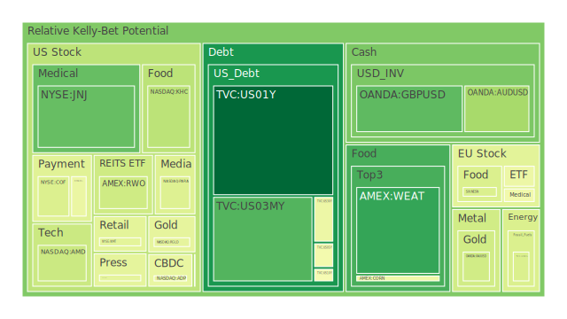
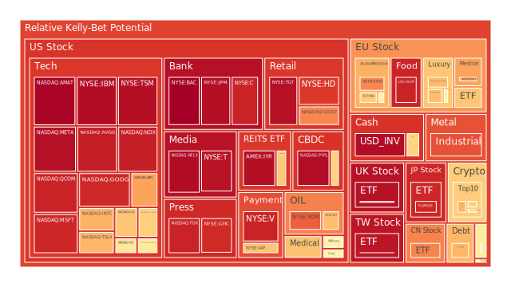
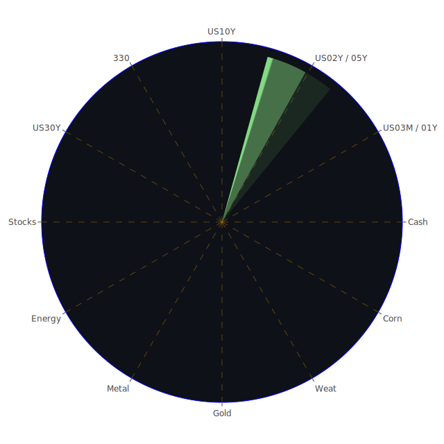

# 投資商品泡沫分析

在當前多元且瞬息萬變的市場環境中，我們可以從空間（Spatial）、時間（Temporal）以及概念（Conceptional）三個層面，嘗試進行經濟學、社會學、心理學與博弈論的綜合考量，並運用「三位一體」的正反合思考架構，客觀地為各類投資資產做泡沫風險及潛在走勢分析。以下將依照各項常見投資標的分別闡述，並同時參考近期新聞事件與歷史相似情境，以期在有限文字內表達更多內涵。

---

## 1. 美國國債

美國國債近來受到市場對利率政策反覆預期的影響，收益率曲線在短端與中長端之間有著顯著的波動。根據近期市場數據，美國1年期、2年期及5年期國債殖利率雖然皆在4%以上，但仍較前期略有變化，如1Y自上週4.16升至4.22左右，2Y約4.28，5Y約4.43。這些變動被解讀為投資人對通脹與聯準會可能的後續動作存在分歧，尤其在「空間」層面上，美國國債與全球其他安全性資產之間的避險需求偶有此消彼長的特性。就「時間」面向看，市場對未來12個月的經濟下行風險與就業市場韌性有多重解讀，拜登政府的最後執政時期與新一屆政府可能帶來的財政政策走向，也在投資人心理層面產生波動。歷史上，在2008年金融危機、2020年疫情爆發時期，美國國債作為避險資產常有資金大舉流入並壓低殖利率的經驗。就「概念」而言，投資人若對未來美國聯準會動向與政府債務上限抱持懷疑，短期的操作策略將轉趨謹慎。目前從新聞觀察，並無大幅度利多消息支撐，尤其在近期國債發行量仍高企，加上美國聯準會在公開談話中多次強調抑制通脹的重要性，一旦利率保持相對高檔，美國國債價格易遭拋售，殖利率易上行，但在經濟下滑風險增強時，國債又可能因避險需求被買入而造成殖利率下行。此「正反合」的動態，顯示美國國債的泡沫風險目前相對溫和，但也應注意長期國債在更高利率時代的價格震盪風險。

---

## 2. 美國零售股

美國零售板塊近期因就業市場的韌性與實質消費力道出現分化。新聞層面上，沃爾瑪（WMT）高泡沫分數顯示市場對其過去幾季表現雖抱有期待，但也怕其估值過高，且公司本身可能面臨消費者需求變化與營收成長放緩的疑慮。再者，有些大型連鎖零售企業出現裁員消息，如咖啡連鎖品牌進行組織優化，導致該領域的情緒轉為謹慎。歷史上，零售股在經濟成長後期常因消費者支出放緩而遭遇評價重置，2001年網路泡沫與2008年金融危機期間類似的零售股獲利下修現象就曾發生。從「空間」層面看，國際局勢不確定與貿易政策重新洗牌，均可能影響零售供應鏈。從「時間」角度看，進入新任政府後，若對關稅、移民與企業稅有新想法，零售股供應端與消費端會同步面臨不確定。就「概念」層面而言，美國民眾對通脹持續性的擔憂尚未全然消退，信用卡循環利息與逾期率上升，使市場對個人消費支出可持續性保持警覺。因此，該板塊的泡沫風險可能因短期需求回溫而被拉抬，但若後續就業數據或消費者信心指數急轉直下，則會面臨顯著修正。

---

## 3. 美國科技股

科技股長期以來一直是市場關注的焦點，但其估值常因未來成長預期而居高不下。根據最近的資料，部分龍頭科技公司如AAPL、MSFT、GOOG等，泡沫分數普遍在0.90以上，顯示市場對高增長潛力計入了相當高的價格。新聞面可見，AI概念與雲端服務等議題不斷吸引投資人目光，但同時某些半導體供應商的股價也因市場對新一波升級週期不確定而下跌。近期有消息指向某些晶片供應鏈廠商股價大跌30%，但仍獲知名金融機構維持「買入」評級，說明了市場普遍抱有「短期雜訊與長期潛力並存」的心態。回顧歷史，類似在2000年網路泡沫時期，大量資金在美國高科技板塊集結，之後在基本面無法持續支撐的情況下出現大幅震盪。此後在2020年到2021年間，因疫情帶動的雲端應用與線上需求再度推升科技股估值。就「空間」層面而言，科技企業跨國布局強度高，任何區域的政策或貿易紛爭都可能牽動估值。從「時間」面，市場既擔心新任政府對科技龍頭的反壟斷動作，也考量到全球經濟若放緩，廣告和雲端支出都會下降。若從「概念」面考慮，投資人對創新、AI、大數據等未來趨勢抱有高度憧憬，因此科技股的泡沫風險雖高，但除非出現衝擊性的宏觀事件或創新技術週期下滑，否則難以見到如同2000年時的全面性破滅。然而，仍須提醒投資者關注這個板塊的超漲疑慮。

---

## 4. 美國房地產指數

房地產相關指數在過去一年面臨利率抬升、房貸利率上行等負面因子影響，然而某些地區的房地產成交量仍未大幅萎縮。一方面，房貸30年固定利率已攀至7%以上，這對潛在購房者的財務壓力大增。美國房地產投資信託基金（REITs）類型的股票，如部分世界房地產ETF，近日泡沫分數升至0.65上下，顯示市場對房地產投資情緒不似前幾年熾熱，但仍保有一定的流動性。歷史可見，2008年次貸危機爆發時，美國房地產市值大幅貶值，但在經歷量化寬鬆後於2012年起快速回溫。就「空間」面看，人口流動與企業遷移帶動某些州或都市區域的房市熱度遠高於其他地區。就「時間」面而言，利率走勢與政府在稅務或補貼上的政策會影響房地產景氣循環；若就「概念」而言，目前市場對經濟衰退仍存在顧慮，但也有一派投資人認為如果通脹降溫，利率有望於中長期回落，進而支撐房市價格。近期新聞不斷提及美國局部地區有企業裁員與零售門市關閉，引發地產空置率的討論，顯示商用地產風險隱憂仍未解除。整體而言，目前房地產或相關指數的泡沫風險不至於高到失控，但對比過往幾年的漲勢已顯疲態。

---

## 5. 加密貨幣

加密貨幣市場經歷多次波動，目前部分主要幣種的泡沫指數呈現偏高態勢。特別是BTC與ETH，在近期報價顯示BTC維持在約10萬美元以上，ETH則在3000美元至3500美元區間，但其泡沫分數都有0.4到0.6甚至更高的水準。新聞中提到數起監管事件：美國SEC與某些加密企業和高層達成和解，以及美國政府對數位貨幣交易所的審視日益嚴格。從「空間」層面出發，各國對加密資產的監管態度差異巨大，市場資金避險或投機行為一旦跨境流動，就易帶來價格急升或急跌。從「時間」層面看，加密貨幣的週期往往與宏觀流動性相關，當利率高企且風險資產承壓時，買氣可能減弱。回顧歷史，2021年底至2022年初的加密泡沫緩慢破滅教訓仍記憶猶新。從「概念」層面，投資人對區塊鏈技術的未來應用仍持肯定，但看法漸趨理性，不再盲目追漲。近期也有部分社群與媒體質疑某些「殺手級應用」的真實落地進度。如果後續全球經濟放緩，資金風險偏好降低，加密貨幣可能承受大幅調整壓力。目前可見短期泡沫風險仍偏高，須審慎留意。

---

## 6. 金／銀／銅

金價相對於通脹與地緣政治動盪，往往扮演避險角色，近期報價約在2700美元上下浮動，但泡沫分數並不算極端。銀與銅則與工業需求密切掛鉤：銀在太陽能、電子產業應用廣泛，銅更被視為反映全球工業活力的金屬。最近全球經濟雖有放緩跡象，但多國基礎建設計畫和綠能轉型需要大量金屬，銅的需求前景因此受到期待。然而，短期數據顯示銅價與金價比例波動，且金／油比例與金／銅比例都有波動。歷史上，金價在重大地緣政治衝突或避險需求升溫時常大幅上漲，2008年、2020年即是典型例子。就「空間」層面而言，礦產分布與生產國政策會影響供給，需求則來自全球製造與投資。從「時間」面看，若有更多基礎建設專案於未來數年開跑，銀銅或有需求支撐，但如果經濟重陷衰退則會壓抑。從「概念」面，市場普遍視貴金屬為保值工具，除了短期投機，也作為長期布局。若聯準會維持鷹派，金價易受美元強弱左右。目前看來，金、銀、銅泡沫並未到危險區，但市場仍要警惕短線投機所帶來的價格劇烈波動。

---

## 7. 黃豆 / 小麥 / 玉米

農產品期貨易受到天氣、地緣政治、全球貿易政策的影響。近期新聞顯示烏克蘭與其他糧食出口地區的局勢尚未完全穩定，也有氣候異常導致部分穀物預估產量下修的消息。黃豆、小麥與玉米期貨價格波動呈現中度泡沫風險，一些對衝基金會基於通脹對沖與糧食供給緊縮預期而配置農產品。從「空間」層面，糧食供應鏈環繞全球，輸出國的政策與產量變化會牽動期貨價格。從「時間」面，季節性收成、高溫乾旱等極端氣候都可能影響短期行情。歷史可見1970年代的糧食危機使得糧價飆漲，2008年時也出現農產品期貨爆炒的情況。從「概念」上，糧食期貨因關係民生且具剛性需求，長期仍有支撐，但若全球經濟大幅衰退，最終消費亦可能減緩。雖然泡沫風險不及高估值科技股等資產，但應留意天氣與地緣政治的突發事件。

---

## 8. 石油 / 鈾期貨

近期石油價格約在每桶77美元上下，市場擔心對俄羅斯石油出口的制裁擴大，以及產油國減產或增產策略。同時，一些新聞顯示局部衝突威脅運輸管道，對油價形成支撐。然而，由於全球經濟放緩、替代能源崛起、以及疫情後運輸需求平穩，石油上漲空間也可能受限。歷史上石油價格常呈現週期性暴漲暴跌：2008年曾見超過每桶140美元，2020年疫情初期甚至出現期貨價格短暫為負的特殊現象。從「空間」面考慮，中東、俄羅斯、美國頁岩油等供給面動向是價格變因。從「時間」面，綠能轉型與各國對化石燃料依賴的調整會影響長期需求。鈾期貨則因核能政策重新獲得部分關注，特別是歐洲有些國家與亞洲新興市場考慮發展核能替代化石燃料。鈾供需一旦失衡，價格易呈現跳躍性波動。就「概念」面分析，一旦發生能源緊縮或地緣政治事件，油與鈾都會因恐慌買盤而飆升；但若經濟轉向衰退或有重大科技替代突破，需求面萎縮則迅速壓低價格。當前泡沫風險中等偏高，需留意國際局勢與氣候議題。

---

9. 各國外匯市場

美元在新一屆政府的政策觀察期常有劇烈波動。新聞顯示一方面投資人對美元走強有所預期，認為美國可能重啟更多關稅或製造業保護政策，促使海外資金回流；另一方面，若經濟衰退壓力升溫，聯準會可能無法持續高利率路線，造成美元相對弱勢。歐元、英鎊、澳幣、日圓等對美元的匯率近期都有所波動。例如日圓在156上下，英鎊約1.22，澳幣約0.62。歷史上，美元指數在重大政經事件時常成為避險或投機的對象。就「空間」面看，歐洲與亞太地區政策與成長差異會加劇匯率波動；從「時間」面來看，全球利率循環趨勢、地緣衝突與企業投資意願亦牽動匯市走勢。就「概念」層面，市場若對某一貨幣失去信心，就會出現資本集中美元或黃金的行為。目前外匯市場泡沫風險不算極端，但部分貨幣若被過度炒作，仍可能面臨快速修正。

---

## 10. 各國大盤指數

歐洲、亞洲主要大盤指數近期雖然反彈，但新聞層面指出，各地政治變化引發經濟與金融不確定，如東歐衝突、東亞地區地緣風險等。中國大盤在經歷疫情後的復甦脈動仍不穩定；歐洲各國則面臨能源轉型與通脹蠢動等挑戰。就「空間」面，主要指數成分股的營收來源已高度全球化，單一地區事件往往能造成跨市衝擊。就「時間」面，季報、年報與各國央行貨幣政策時間表均會影響投資人判斷；而「概念」層面則顯示投資人普遍對大盤後市謹慎但仍期待政策面來支撐。歷史上，2008年美國次貸危機爆發後，全球主要股指皆同步重挫；2020年疫情初期則也出現同步下跌。近期大盤雖有反彈，但單從泡沫分數的角度，部分地區指數已有不小漲幅，需要關注估值是否已背離企業實際獲利能力。

---

11. 美國半導體股

半導體股長期受惠於科技產業升級、AI應用需求，但其價格常伴隨景氣循環與庫存調整出現巨幅震盪。新聞指出某些巨頭仍在擴廠投資先進製程，但也有人擔心前期供應鏈「搶貨潮」結束後，可能面臨產能過剩。且有地緣政治風險導致高階晶片與設備出口管制，增加該產業變數。回顧歷史，2018年中美貿易摩擦時，半導體股遭到長期估值折價；2020年後又因宅經濟帶動需求大漲。就「空間」面來看，美國半導體企業之客戶遍布全球，特別在中國與東南亞有龐大市場；「時間」面則凸顯科技週期通常3-5年便會出現一次顯著調整；而在「概念」層面，市場對未來AI算力與資料中心需求普遍看好，讓半導體股的泡沫分數居高不下。然而，若宏觀經濟下滑，企業資本支出減少，半導體營收成長會受到衝擊。因此，目前這個領域的泡沫風險偏高，仍需謹慎評估。

---

## 12. 美國銀行股

銀行股目前正面臨多重挑戰：高利率雖能推升淨息差，但同時也壓抑了貸款需求，且壞帳率上升風險已經開始浮現。新聞裡提到消費者信用卡逾期率、商業地產不良貸款率正在攀升，意味著銀行體系面對潛在壞帳的壓力加大。回顧2008年金融危機，銀行股在信用風險累積到無法消化時遭遇大幅下挫。就「空間」面看，部分銀行在國際佈局上有更高的風險曝險；從「時間」面來看，當前政府與監管單位對銀行資本充足率的要求大增；而「概念」層面則是市場對銀行業務創新與傳統放貸之間的平衡仍存不安。目前銀行股的泡沫風險相對中等，原因在於整體估值並未如科技股般狂飆，但若經濟衰退壓力升溫，資產質量下滑可能造成銀行獲利急遽惡化。

---

## 13. 美國軍工股

軍工股往往受國防預算驅動。在新聞面，近期地緣政治事件頻仍，加上全球多國談及軍事現代化，使美國軍工企業訂單暢旺。然而，歷史經驗顯示軍工股的漲幅也與國際緊張程度密切相連，若衝突降溫，需求可能迅速減少。從「空間」面分析，外銷市場對軍工裝備的需求有一定侷限性，且容易受政治因素影響。從「時間」面來看，研發與生產周期長，並非短期消息就能決定整體營收走向。就「概念」層面，投資人對軍工股的態度有時兩極：一方面認為其防禦性強，另方面則擔心國際局勢若緩和，股價容易失去成長動能。泡沫風險上，目前還在可控制範圍，因資金對它的追捧並未達到極端程度，但國際衝突資訊需要嚴密關注。

---

## 14. 美國電子支付股

電子支付股受惠於線上交易、行動支付的普及，尤其過去幾年因疫情而快速增長。近期新聞中顯示部分公司依然維持相對高毛利，但也有質疑在競爭激烈的市場中，業者需要持續投入研發、購併的預算，高評價能否永續。历史上，支付行業經常透過創新與收購來擴張版圖，但同時會面臨監管檢視。從「空間」觀點看，電子支付技術在全球多地普及度不同，一旦某些區域推行新政策或監管措施，該企業擴張步調或產生影響。從「時間」面看，信用卡逾期上升恐影響支付交易量；若經濟回落，整體消費支出也會減少。就「概念」面來說，投資人持續看好數位化浪潮，但監管與資本成本上行都會是風險。當前泡沫風險中等偏高，需注意競爭與經營成本。

---

## 15. 美國藥商股

藥商股通常受到研發成果與專利到期節奏的影響。近期有些大型藥廠因新藥上市獲利可期，吸引資金進入；但也有些因專利到期或競爭加劇，股價承壓。回顧2000年之後，幾波大規模併購整合潮都發生在利率相對低、研發進程快速的階段。現今利率已走高，研發成本不斷抬升，也可能讓一些藥廠評估裁減非核心專案。就「空間」面分析，美國藥廠全球行銷，任何地區的醫療保險政策變動都可能衝擊銷售。從「時間」面來看，新藥研發通常數年乃至十年，成果難以即刻反映；而「概念」面上，市場對生技與醫藥創新的需求永不退潮，但股價能否配合依賴許多政策與臨床試驗結果。目前美國藥商股泡沫風險適中，若有重大科研突破或國家級醫療補助計畫，可能進一步推升估值。

---

## 16. 美國影視股

影視產業在串流媒體崛起後面臨市場重新洗牌。新聞上顯示，美國主要影視公司為了搶佔訂閱市場，正投資大量自製內容；但同時線下影院與實體娛樂收入未必能快速回升。歷史上，2000年代DVD與電視訂閱的興起帶來新的黃金時期；2020年疫情讓院線生意驟降，但串流平台卻取得爆發成長。就「空間」層面，全球觀眾口味日益多元，海外市場成為重要增長來源。從「時間」面看，消費者的口袋可能在經濟衰退下縮水，必須在多家串流平台間做取捨。就「概念」而言，投資人對內容創意的評價及用戶黏著度變得更重要。近期部分企業泡沫分數升高，顯示投資人仍看好長期發展，但同時擔憂競爭導致利潤稀釋。

---

## 17. 美國媒體股

媒體股與影視股雖然有部分重疊，但涵蓋更廣，包括新聞網絡、出版、社交平台等。近期新聞披露有些傳統媒體公司因廣告收入不振而裁員，但也有大媒體集團併購新興平台以強化線上內容布局。歷史上，媒體產業在1990年代經歷整合潮，2000年後又隨著網路崛起而不斷轉型。從「空間」面看，媒體訊息跨越國界，但受各地審查制度或文化差異影響。從「時間」面來看，新舊媒體在廣告營收與用戶付費模式的轉變速度快，競爭也相當激烈；而「概念」層面則圍繞品牌公信力、內容質量與社交影響力。媒體股雖曾在疫情期間因流量激增而估值走高，但隨著市場對傳統廣告模式的興趣減弱，未來增長可能趨於平穩。泡沫風險不算最嚴重，但需警惕大量併購背後的高估值隱憂。

---

## 18. 石油防禦股

所謂石油防禦股，通常指那些在石油、天然氣產業中專注於防禦性業務或穩定分紅的公司，如具備長期運輸合約、管線設施等。這些企業因收益較受長期合約或管線租金保護，波動通常略小於上游勘探企業。但若國際原油市場大幅下跌，亦會影響其評價。就「空間」層面看，此類公司業務遍佈多地；在「時間」面上，其股票型債券型特色讓一些保守資金青睞。概念上，若全球對化石燃料需求減少，長期營運也可能受衝擊。目前泡沫風險相對中性，估值未出現極端飆漲，但也要關注新能源轉型對其長期地位的挑戰。

---

## 19. 金礦防禦股

金礦企業一向被視為在黃金牛市中有槓桿效應，一旦金價上漲，金礦股利潤增幅可能遠大於金價本身。但金礦開發有自身風險，包括地理因素、生產成本、政治風險與環保限制等。回顧2008年、2020年當黃金價格飆漲時，金礦股曾有大漲紀錄，但若之後金價疲弱，此類股票也會迅速回落。就「空間」面分析，各主要產金國的法規與稅制不同；「時間」面上，地雷式的礦區事故或不可預測的國家政策也會導致股價震盪。從「概念」角度，市場若普遍預期通脹抬頭、貨幣貶值或地緣風險升溫，金礦股將受到追捧。目前仍無出現全面非理性瘋漲，故泡沫風險在中等水平。

---

## 20. 歐洲奢侈品股

歐洲奢侈品品牌近年來仰賴中國、北美等新興富裕消費者的支出來推動成長。然而，在新聞上可看到，中國等地經濟復甦不如預期、美國的高端消費或也因利率走高而減速，使得奢侈品公司成長有所放緩。歷史上，奢侈品在2008年金融危機時也短暫下挫，但之後隨著全球資產價格再度高漲而強勢反彈。就「空間」面來看，這些企業大多是全球布局，歐美地區政治風向與亞洲消費能力變化均影響股價。從「時間」面，季節性與消費習慣也會造成營收波動。就「概念」而言，奢侈品屬於稀缺性象徵，具備某種抗跌性，但在極端衰退時也可能銷售大幅滑落。當前泡沫風險並非特別高，但若全球資本市場進入劇烈修正，奢侈品股恐怕也難獨善其身。

---

## 21. 歐洲汽車股

歐洲車廠正經歷電動化與數位化的轉型，成本投入巨大，同時面臨高通脹時期的供應鏈與能源成本增加壓力。新聞亦有提到某些原先風靡的燃油車需求放緩，且消費者多在觀望新能源補貼政策。回顧歷史，汽車業往往在景氣走弱時出現銷售萎縮，2008年與2020年皆如此。就「空間」面，歐洲車廠銷售遍及全球，一旦新興市場增速放緩，影響頗大；從「時間」面看，新技術推出與法規合規需要較長醞釀期；而在「概念」層面，消費者對電動車熱情與對傳統汽車的品牌認同之間存在拉鋸。當前汽車股的泡沫風險不算極端，但若研發投入無法轉化為銷量，估值會被市場修正。

---

## 22. 歐美食品股

食品行業在經濟震盪時相對防禦，但若成本（原物料、運輸、能源）大幅上升，利潤恐縮水。新聞指出部分跨國食品巨頭面臨成本轉嫁壓力，甚至引發通脹顧慮。回顧歷史，食品股在1990年代後期與2008年之後皆有不錯表現，因消費者對必需品需求彈性較小。就「空間」面，食品市場高度全球化，區域衝突或匯率變動會衝擊供應成本；從「時間」面看，農業收成與企業採購週期左右了毛利；從「概念」面而言，此類股票往往被視為經濟放緩時的避險選擇。目前泡沫風險在中等水準，因為該產業估值基礎較穩，但仍需觀察通脹與原料價格是否又有新一輪波動。

---

## 宏觀經濟傳導路徑分析

宏觀層面，根據最新訊息：美國聯準會的資產負債表（FED Total Assets）持續縮減，RRP（逆回購）也有所下降，顯示流動性不斷收斂。市場對OIS FED Fund Rate高低有分歧，同時觀察到SOFR交易量在上升。美國10年期國債殖利率約4.62，30年期約4.86，顯示長端利率並未出現劇烈倒掛。總體來看，市場對未來一年中美國可能進行更嚴格或更寬鬆的貨幣政策仍未有明確定論。商業地產壞帳率與信用卡壞帳率的升高，意味著消費端與企業端償債壓力正在累積，並對銀行與其他金融機構形成資產質量風險。各國貨幣與財政政策亦試圖在抑通脹與保增長間取得平衡，若有任何一方出現極端偏離，將透過債券殖利率、股市估值、匯率波動等渠道快速傳導，形成蝴蝶效應式的市場連鎖反應。整體宏觀路徑：美國利率→全球資金流動→新興市場貨幣與資金成本→全球貿易與企業投資→企業營收與就業數據→消費支出→再度影響利率預期與通脹，循環不斷。

---

## 微觀經濟傳導路徑分析

在微觀層面，企業層級所面臨的成本結構、研發投入與需求端變化，都直接影響獲利表現。近期新聞報導裁員、產能調整、併購整合等事件，說明企業正試圖因應不確定環境：利率上揚與消費者需求轉變讓部分行業備感壓力，尤其零售業、部分快速消費品與非必需奢侈消費品。同時，半導體、電動車、綠能科技等領域企業若能掌握新技術或供應鏈策略，則有機會在下一波需求升溫時保持領先。由於全球化深度連結，一家企業的上游供應商、下游客戶、跨國分支政策協同，都可能因他國的金融與政治事件受到牽連，最終在財報與股價上展現出正或負的漣漪效應，形成微觀經濟層面的「正反合」動態循環。

---

## 資產類別間傳導路徑分析

各類資產間的交互影響，在本報告中可以由三位一體方式綜觀：  
1. 空間角度：美國、歐洲、亞洲等市場的聯動，使得一地的政治、貨幣或經濟事件可能跨越區域對股票、債券、匯率與大宗商品等產生共振或對沖作用。  
2. 時間角度：聯準會與各國央行的貨幣政策周期交錯，金融資本有時候集中流向避險資產（如黃金、國債），有時候集中在風險資產（如科技股、加密貨幣），並隨時間不斷轉移，造成階段性的輪動。  
3. 概念角度：投資者信心、政策預期、市場共識與媒體報導形塑了人們對「未來」的想像，一旦重大利多或利空突然出現，資產之間的相關性可能短期內大幅改變。例如，金價與美國國債往往被視為避險組合，但當市場懼怕流動性枯竭時，兩者也可能同時遭到拋售以換現金。再者，股市與油市也可能出現同漲或同跌，視投資人的總體風險承受與政策態度而定。  
在此三位一體交織下，相關係數約-0.5且能在週期與空間維度上相位120度錯開的資產，反而有機會成為組合對沖利器，這需要投資人細緻評估各標的的資金面與消息面，並不斷調整配置比重，以求達到總體風險更低或更能平滑波動的效果。

---

## 投資建議

基於上述分析，建議在不同風險偏好下制定三類型投資組合，以對沖不確定性並發掘成長機會：

1. 穩健型（約佔投資組合40%）  
   - 美國國債：由於美國國債具有全球避險與流動性地位，配置部分中長天期，可在經濟放緩時獲得資本利得。  
   - 黃金：歷史經驗顯示，地緣政治或金融市場動盪時，金價具防禦性，適度配置能防範黑天鵝風險。  
   - 歐美大型食品或生活必需品股：這些防禦性個股在經濟循環轉折時相對穩定，且具備穩定股息或長期需求支撐。

2. 成長型（約佔投資組合35%）  
   - 美國科技股：聚焦具有創新應用與AI潛力的企業，雖短期估值高、波動大，但中長期有機會分享技術紅利。  
   - 半導體產業：選擇具備核心專利或製程領先的公司，利用週期波動提前布局，但須留意地緣政治限制與出口管制。  
   - 綠能與基礎建設相關股：全球減碳趨勢與基礎建設計畫為驅動力，如風電、電動車充電設施或再生能源供應鏈。

3. 高風險型（約佔投資組合25%）  
   - 加密貨幣：包含BTC或主流公鏈代幣，雖高波動且受到監管與流動性風險，但若市場再度狂熱或技術落地出現突破，漲幅可觀。  
   - 新興市場高收益債或股票：在特定國家政治或經濟改革進展順利時，可能帶來高報酬，但亦易受國際資金撤離與匯率動盪衝擊。  
   - 軍工或特殊題材股：在地緣政治高度緊張下往往爆發力強，但局勢緩和後股價可能迅速回跌，宜嚴控部位與停利策略。

上述組合的比例僅供參考，可根據投資者對風險的理解與財務目標做動態調整。關鍵在於持續追蹤泡沫風險指數、總體經濟指標、新聞消息與資金流向，並隨情勢變化在「三位一體」理論下做正反合的滾動檢視。

---

## 風險提示

投資市場存在多重泡沫風險，尤其在高利率與地緣政治不穩定的階段，任何突發事件都可能對資產價格造成連鎖衝擊。新聞層面上，我們看見大型企業裁員與併購、國際衝突升溫或緩和、地區性天災人禍、政策翻轉等，都可能於短期內重塑資本市場的供需結構。加上部分資產（如加密貨幣與高估值科技股）本身就具有高波動特性，一旦市場情緒逆轉或流動性緊縮，很容易引發跳空下跌或連續性拋售。歷史經驗顯示，泡沫的滋生往往伴隨著資金過度集中與投資者對風險的忽視；當警訊出現時，調整速度也往往比預期更猛烈。因此，在做任何投資決策前，應審慎評估自身風險承受能力與資金需求期限，也切忌盲目追高或過度加槓桿。持續關注基本面、評估多方消息、並保留適度的資金部位或防禦性資產，才能在金融市場多重波動之下穩健應對。

最後再次強調，以上所提供的建議僅供參考之用。任何投資皆蘊含風險，不確定性長存，投資人需根據個人財務狀況、風險偏好與理財目標，自行斟酌是否進行或調整投資。本報告意在從多角度客觀解讀市場現象，並不構成對任何個別標的的最終投資意見。投資前務必多方蒐集資訊，做好研究與資產配置規劃，以在市場動盪與結構變遷中保持穩定並把握可行機會。

 
Daily Buy Map:

 
Daily Sell Map:

 
Daily Radar Chart:

 
