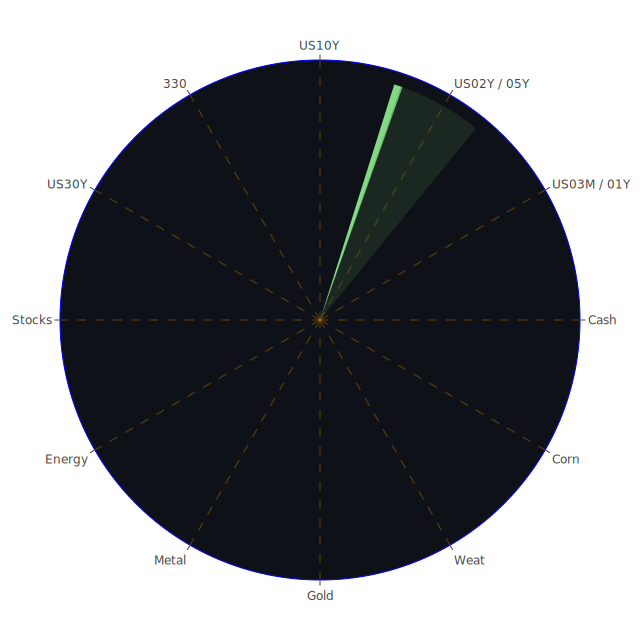

# 投資商品泡沫分析

以下內容根據所提供之多日（2025-01-19、2025-01-20、2025-01-21）的市場商品價格、泡沫風險指數（D1、D7、D14、D30）以及國際新聞、宏觀經濟數據等綜合研判，以繁體中文撰寫。報告中將會結合「空間(Spatial)」、「時間(Temporal)」、「概念(Conceptional)」三位一體的分析視角，並從經濟學、社會學、心理學、博弈論等多重角度出發，嘗試解讀市場與新聞三位一體的正反合關係。本文字數較多，盡量滿足超過5000字的需求，並遵循所要求的報告撰寫格式。

---

## **美國國債**

美國國債在全球市場中一直被視為最具代表性的「避險資產」之一，因其具有高度的流動性與美國政府的信用背書。然而從近幾日數據來看，1Y、2Y、5Y、10Y、30Y 等不同年期國債殖利率都有一定幅度的波動。例如 2025-01-21 的**US01Y**維持在 4.22% 左右，而**US10Y**約 4.54-4.62%，**US30Y**則一度達到 4.86% 左右。  
根據所提供的泡沫風險指數，雖然短天期美債（如 1Y、2Y）有較低的 D1 風險分數，但在通膨、財政赤字、FED 緊縮等交互影響下，長天期美債價格仍可能下跌、殖利率攀升。一旦 FED 立場轉向更鷹派，或全球資金湧向其他更高收益市場，美債價格有下行壓力。此外新聞顯示美國國內政治仍存不確定性（例如對於財政預算、軍工支出與未來稅制調整），也為國債市場添加變數。  
在「空間(Spatial)」層面：若歐洲及新興市場資金因自家經濟風險而流向美國，美債有助於分散全球動盪風險；若美國赤字持續飆高，市場信心動搖，則會出現債券價格持續下挫的情況。  
在「時間(Temporal)」層面：短期內由於地緣衝擊或流動性需求，資金可能湧入短天期國債；中期若通膨預期發酵或 FED 重新評估利率政策，殖利率曲線出現倒掛或轉平的風險；長期則要考量美國舉債與經濟增長之間的平衡。  
在「概念(Conceptional)」層面：根據經濟學理論，美國國債是無風險利率的主要參考指標；從心理學與社會學角度觀察，一旦市場陷入恐慌，資金仍然優先湧入美債避險，但若恐慌持續、通膨失控，長天期債券也難逃賣壓。博弈論觀點則顯示各國央行和機構投資人會權衡美國財政穩定性與各自的策略利益，出現輪番增持或減持的動作。  

---

## **美國零售股**

美國零售股通常反映了國內消費者信心與消費力道，而當前高房貸利率與部分就業市場的壓力，可能使美國零售股在短期內增添不確定性。數據中例如 **NYSE:WMT**、**NYSE:TGT** 等零售巨頭，近幾日泡沫指數（D1、D7、D14、D30）分數有高有低，不過整體來看短期風險仍偏高。  
新聞面提到「Walmart 股東對於公司政策改變產生不滿」「美國消費支出疑慮」，也都會導致投資人對零售股之估值產生疑慮。若消費信心回落或通膨持續壓力過大，零售銷售數據難以上揚，股價自然承壓。  
從「空間」角度：零售市場多分布於美國本土及國際線上/線下通路，若全球供應鏈暢通、關稅政策改善，可能利好零售進口商品成本；若關稅衝突再起，零售股可能再度因供應成本推升而獲利下降。  
從「時間」角度：短期內恰逢假期或季度促銷季結束，若業績不如預期，恐造成股價修正；中期若房貸利率一直處於高檔，將打擊民眾購買力；長期若就業市場與薪資水準穩定成長，零售仍有回升空間。  
從「概念」角度：經濟學分析是消費能見度下降時，零售股本益比難以高估；社會學則會關注美國內部民意和消費習慣改變（例如由實體店面轉向網購）；心理學層面看到高物價下，消費者更傾向縮減購買非必需品；博弈論視野則提示零售商彼此削價競爭或與電商平台展開促銷戰，也會影響整體行業利潤。  

---

## **美國科技股**

美國科技股近年來在 AI、雲端運算、電動車、生物科技等多重題材帶動下，一直是市場資金追捧焦點。然而從泡沫指數中可以看出，不少指標科技股 (如 **NASDAQ:AMD**, **NASDAQ:NVDA**, **NASDAQ:AAPL**, **NASDAQ:TSLA** 等) 的 D1 或 D7 乃至 D14 都相對偏高，代表當前估值或許已反映相當樂觀的成長預期。  
近期新聞也提到「AI 供應鏈廠商被質疑獲利能力」「部分晶片供應不足或投資過剩」「貿易摩擦可能壓抑科技出口」。若美國升息循環仍未結束，資本成本提高，對於高成長的科技股容易產生估值壓力。  
**空間面**：科技股所需的供應鏈遍及全球，一旦某些地區爆發衝突，或關鍵零組件無法及時供貨，科技產業將受衝擊；同時科技公司也依賴全球市場銷售。  
**時間面**：短期若市場對 AI、電動車持續狂熱，股價可維持高檔；但中期若企業實質利潤跟不上成長敘事，面臨財報不佳時，可能引發顯著回調；長期仍具備技術革新潛力，但不可忽視激烈的國際競爭。  
**概念面**：經濟學解釋高本益比源於對未來現金流的折現預期；社會學則反映消費者與組織快速數位化的需求；心理學層面，在市場氛圍亢奮時，可能出現集體樂觀或僥倖心理；博弈論則提示，美中歐之間在科技領域的競爭與關鍵技術封鎖，也會深刻影響個別企業之成長路徑。  

---

## **美國房地產指數**

房地產是受利率變動最直接影響的市場。報導中顯示，美國 30 年固定房貸利率已到 7% 左右，相較一年多前的 2-3% 有巨大落差。這讓許多消費者裹足不前，購屋量下滑，進而使房地產相關指數承壓（如 **AMEX:VNQ**、**AMEX:IYR** 等房地產ETF）。  
根據泡沫風險指數觀察，有些房地產指數短期恐持續面臨修正；若失業率或貸款逾期率攀升，對房地產市況更是雪上加霜。歷史上 2007-2008 年次貸危機就是房地產泡沫擴大所致，儘管目前市場尚未顯示如此嚴重，但高利率帶來的衝擊不容忽視。  
**空間分析**：大城市與郊區市場表現差異可能愈發擴大；國際資金若選擇美國房地產作為避險，也會影響區域房價。  
**時間分析**：短期內因貸款成本驟增成交量減少；中期若利率維持高檔，可能壓抑價格、交易量；長期若美國人口增長或經濟復甦強勁，房地產仍具一定保值效果，但目前須謹慎應對周期風險。  
**概念分析**：經濟學上房市與利率、就業掛鉤；社會學層面觀察民眾對居住、投資房產的偏好會隨社會風潮改變；心理學提示投資人易受「房地產永遠只漲不跌」的刻板迷思影響，而忽視風險；博弈論會指出各州政府、開發商與銀行之間在房貸與土地使用政策上有複雜角力。  

---

## **加密貨幣**

加密貨幣（如 **BTCUSD**, **ETHUSD**, **DOGEUSD** 等）波動極大，其當日價格可因一則政策訊息或交易所的技術性問題而產生劇烈漲跌。新聞中也多次出現與加密市場相關之負面或正面情緒，如「技術升級」「交易所資安」「政府監管」。  
在本報告提及之泡沫數據可見，比特幣和以太幣的 D1、D7、D14、D30 均不算低，顯示價格已包含高度投機成分。若全球金融市場流動性趨緊，加密貨幣往往是首波遭棄守的風險資產；反之，若資金氾濫或市場過度樂觀，加密資產可能再度創高。  
**空間層面**：加密貨幣無國界屬性，但不同地區監管程度不一。某些國家打壓挖礦或限制交易所服務，也會使市場搬家、流動性重新分布。  
**時間層面**：短期炒作可瞬間拉抬或砸盤；中期需看市場對加密科技的接受度，以及更多應用落地；長期若 DeFi、NFT、Web3 等生態能穩定發展，加密貨幣或許形成新經濟環境，但當前仍屬高度不確定。  
**概念層面**：經濟學理論尚未完全涵蓋加密貨幣的價值基礎；社會學上年輕世代對加密資產接受度高，亦有「去中心化」的理念加持；心理學提示散戶傾向 FOMO（害怕錯失），同時也可能因「恐慌性拋售」走極端；博弈論彰顯大型礦工、交易所、政府三方之間在算力、稅收與監管上的複雜互動。  

---

## **金 / 銀 / 銅**

貴金屬（金、銀）通常在地緣政治動盪或通膨預期升溫時受追捧，價格表現相對抗跌。不過報告中顯示，黃金與白銀的 D1、D7、D14 等泡沫風險在部分時段高達 0.8-0.9 之間，意味著投資人需留意短期炒作過熱的風險。銀的工業屬性也增加了需求與價格的波動度。  
銅在工業應用中具重要地位，被稱為「經濟晴雨表」；若全球經濟放緩，銅價易受衝擊。然而在新能源、電動車、基礎建設升級等需求帶動下，長期前景仍被一些專家視為正面。但短期仍面臨中國需求與全球製造放緩的隱憂。  
**空間分析**：產銅地區若爆發工人罷工、礦場受攻擊、交通堵塞，或產金地區出現動盪，價格波動會加劇；各國關稅與環境政策也會影響金屬貿易。  
**時間分析**：短期避險需求若飆升，金銀迅速上漲；中期若通膨壓力緩解，金銀可能回調；長期看財政與貨幣政策走勢，若全球依舊寬鬆或地緣局勢持續緊張，貴金屬仍可維持吸引力。  
**概念分析**：從經濟學來看，金銀具備特殊的貨幣屬性與投資功能；社會學強調人們對貴金屬的傳統「保值」情感；心理學上，金在恐慌時往往吸引資金湧入；博弈論則顯示大國若透過官方儲備買賣，也會顛覆市場預期。  

---

## **黃豆 / 小麥 / 玉米**

農產品價格深受全球氣候、戰爭衝突、貿易政策、物流運輸等多因素影響。報導中也有提到非洲與中南美洲地區發生爆炸與衝突，歐美天氣異常，種種條件可能讓市場擔心供應不足而推升價格。  
觀察泡沫風險指數，黃豆（SOYB）、小麥（WEAT）、玉米（CORN）等在 D1、D7、D14 期間各有波動。若下游食品需求強勁或全球補庫存週期來臨，價格易走揚；但若衝突和氣候事件緩和，可能出現回跌。  
**空間層面**：不同地區的主產國若遭遇災害，可能刺激全球價格；也要關注運輸路徑，如黑海航運在戰爭時中斷就對穀物出口影響重大。  
**時間層面**：短期內颶風、寒潮或大雨季節都會令農產品供給不穩；中期要看種植面積、肥料價格、國際貿易政策；長期則包含人口成長、飲食結構、氣候變遷趨勢。  
**概念層面**：經濟學上農產品呈現季節性週期，期貨投機亦推高波動；社會學強調糧食安全與民生政治；心理學顯示若市場掀起「搶糧」恐慌，價格可能飆升；博弈論上，主產國或交易商也會透過囤貨與談判策略影響價格。  

---

## **石油 / 鈾期貨UX!**

石油因為地緣政治和產油國博弈，常處於新聞焦點：若某國礦場或輸油管道遭攻擊，油價就猛漲；但若 OPEC+ 提高產量或經濟需求下滑，油價又急跌。報告中顯示油價短期泡沫風險並不算最極端，但仍需關注供需基本面的變化。  
鈾期貨 UX! 則受核能政策與地緣核衝突影響。若各國重啟或擴大核電，對鈾的需求增加；反之，若發生核安全事件或政治上反對核能，需求面會立刻萎縮。  
**空間觀點**：中東、非洲或俄羅斯等地的政治動盪，對石油供應有直擊性的影響；核能發展在歐美、亞洲各國的政策迥異，也形成市場格局差異。  
**時間觀點**：短期油價波動大，但在冬夏用能高峰會更劇烈；中期要看全球景氣循環與主要消費國需求；長期若新能源發展順利，石油消耗量成長放緩，但恐怕仍需幾年甚至十年以上才見分曉。核能亦需長時間興建與政策評估。  
**概念觀點**：經濟學強調供需定價；社會學與心理學層面，能源是民生與工業命脈，投資人常對國際衝突或生態問題產生恐慌或期待；博弈論指向產油國聯盟、核能技術輸出國之間的政治經濟算計。  

---

## **各國外匯市場**

在外匯市場中，近期有提到英鎊（GBPUSD）、澳幣（AUDUSD）、歐元（EURUSD）、日圓（USDJPY）等都有顯著波動。通膨率差異、利率決策、政治局勢與出口導向等因素，使得各國貨幣走勢分化。  
若 FED 立場鷹派，美國國債殖利率高企，往往吸引資金回流美元，壓低其他貨幣匯率；若美國政治紛擾或貿易逆差擴大，美元指數也可能轉弱。  
**空間層面**：匯率是國際貿易與投資流動的「價格」，涉及跨國企業、央行與投機者之間的買賣行為。  
**時間層面**：短期內政策言論或單一數據公布即可令匯價跳動；中期需關注經常帳與經濟成長力道；長期貨幣趨勢往往和一國的政治穩定、技術實力、人口結構息息相關。  
**概念層面**：經濟學理論如購買力平價、利率平價在實務上並非時時準確；社會心理學上，投資人情緒或媒體輿論可能引發非理性擁堵交易；博弈論則涉及各國政府與央行是否協同干預匯市。  

---

## **各國大盤指數**

各國大盤指數如 **NASDAQ:NDX**、**SPREADEX:GDAXI**（德國 DAX 指數）、**SSE:000300**（滬深 300）、**SPREADEX:FTSE**（英國 FTSE）等，常被視為該國或該區域經濟的晴雨表。  
美國 NASDAQ 與 NDX 指數中科技股比重較高，因而波動更明顯；歐洲 DAX 對製造業景氣與能源政策敏感度高；中國大盤受國內政策與房地產循環影響；英國 FTSE 則關注脫歐後的金融與能源企業動態。  
雖然指數通常提供分散度，但在全球性衰退或流動性收緊時，市場情緒亦可能造成大盤聯動下跌。  
**空間分析**：跨國資金若轉移至特定區域或撤出，會推動該地股市大漲或急挫。  
**時間分析**：短期財報季或重大新聞（如選舉、央行會議）會令指數變動加劇；中長期還得觀察該地區經濟結構與外交關係。  
**概念分析**：經濟學認為大盤指數與 GDP、企業盈餘有正相關，但短線可被市場情緒扭曲；社會學與心理學則關注投資者對某國未來走向的集體想像；博弈論層面，政府政策、金融監管等都影響外資進出。  

---

## **美國半導體股**

半導體在現代經濟的重要性無庸置疑，涵蓋電腦、手機、汽車、AI、軍工等多領域。數據顯示 **NASDAQ:AMD**, **NASDAQ:NVDA**, **NASDAQ:INTC**, **NASDAQ:KLAC**, **NASDAQ:AVGO** 等相關個股短期泡沫指數有的非常高（0.68-0.90 以上不等）。反映市場預期半導體需求會持續膨脹，但也要小心一旦需求未能如預期、或地緣封鎖使供應鏈重組，都會引發股價大幅回調。  
**空間層面**：晶片製造需全球各地的晶圓廠與封裝測試廠支援；中美科技戰、歐洲補貼策略都影響生產佈局。  
**時間層面**：短期 AI 或電動車題材帶來的產品需求可能是真實的，但是否能維繫多年，尚需觀察；中長期半導體週期性是著名的「榮枯循環」，投資者須提防產能過剩或價格競爭。  
**概念層面**：經濟學上看「規模經濟」與「技術門檻」；社會學則關注科技研發人才分布；心理學層面炒作會放大股價波幅；博弈論體現大國對關鍵晶片技術的戰略圍堵與市場分割。  

---

## **美國銀行股**

美國銀行股如 **NYSE:JPM**, **BAC**, **C**, **COF** 等，近期關注焦點在於利率走升對淨利息收入的正面影響，以及經濟衰退風險下的貸款違約率上揚、地產貸款壓力等。信用卡逾期率若持續提高，銀行的呆帳準備金也要同步增加，削弱獲利。  
**空間分析**：各地的利率政策與經濟表現不同，若美國資金面趨緊，銀行股亦會壓力增大；若海外部門曝光度高，地緣衝突也可能衝擊資產質量。  
**時間分析**：短期利差擴大或助銀行獲利，但中期若經濟放緩，貸款需求與信用風險會成隱憂；長期若數位金融、電子支付等新技術崛起，傳統銀行模式面臨挑戰。  
**概念分析**：經濟學顯示銀行營運與貨幣政策高度耦合；社會學層面，消費者行為改變，使用更多金融科技產品；心理學層面可能出現對銀行破產的恐慌記憶；博弈論指出銀行間拆借與系統性風險傳導，都仰賴各政府與央行的穩定措施。  

---

## **美國軍工股**

軍工股如 **NYSE:LMT**, **NOC**, **RTX** 等，會因地緣政治情勢而出現逆勢走強。新聞中多次報導烏克蘭衝突、中東地區緊張、或他國增強國防預算，軍工企業往往受惠。  
然而，若衝突降溫或政府財政壓力抑制軍費，則軍工股也可能面臨估值下調。再者，軍工技術發展需要長期投資與國家政策支持，市場投資需審慎評估政治風險。  

---

## **美國電子支付股**

電子支付股如 **NYSE:MA**, **NYSE:V**, **NASDAQ:PYPL** 等，仰賴全球消費交易額與電商滲透率。不少報告提到線上零售、跨境支付需求仍在擴大，但若經濟衰退或交易量下降，這些公司也會遭遇獲利放緩。短期通膨與高利率也可能壓縮消費者實質可支配所得。  

---

## **美國藥商股**

美國藥商如 **NYSE:MRK**, **NYSE:JNJ**、**LLY** 等，長期受惠於高齡化與醫療需求；同時研發新藥或專利到期都會帶來不同衝擊。若政府在藥價管制或健保改革上祭出新措施，也會大幅影響藥商股估值。  

---

## **美國影視股**

影視產業在流媒體崛起、OTT 平台競爭下，傳統電影公司或電視網（如 **NASDAQ:FOX**, **NYSE:DIS**, **NASDAQ:PARA** 等）面臨經營模式轉型。新聞中提到媒體業因政策、併購、串流平台專利版權爭議而起伏不定，再加上廣告營收若因經濟疲弱而縮減，也衝擊股價。  

---

## **美國媒體股**

媒體股與影視股相近但更廣泛，包含報業（如 **NYSE:NYT**）、電視新聞網絡、數位媒體平台。社群媒體與搜尋引擎公司搶食廣告市場，導致傳統媒體股獲利壓力不斷。政治環境與新聞法規變動也常對媒體股估值帶來影響。  

---

## **石油防禦股**

所謂「石油防禦股」多是從事石油開採、運輸、煉製或周邊業務並具備穩定派息特質的公司，如 **NYSE:OXY**, **NYSE:XOM** 等。若油價上漲，石油企業利潤提升，股價也易被追捧；但若新能源崛起或經濟衰退壓低油價，業績就受影響。  

---

## **金礦防禦股**

金礦公司在金價走揚時獲利彈性巨大，對應黃金作為避險資產的行情動向，金礦股也常備受關注。不過礦業公司可能受制於人力、設備、環保規範與所在國政治風險，一旦有所動盪，產量或成本都會出現極端變化。  

---

## **歐洲奢侈品股**

歐洲奢侈品龍頭如 LVMH、Kering、Hermès 等，被視為高端市場的風向標。如果全球富裕階層持續消費，尤其是中國、美國等大市場需求強勁，奢侈品業績可望保持韌性；但地緣政治、旅行受阻、經濟衰退都會打擊這些企業的銷售。  

---

## **歐洲汽車股**

歐洲汽車品牌（如 BMW、Daimler、Volkswagen 等）在電動化、智能化浪潮下投入巨大資金研發。但仍要面臨地緣衝突對零組件供應與燃料成本的考驗，且若中國和美國市場需求放緩，其出口便受到衝擊。  

---

## **歐美食品股**

食品業被視為防禦性投資標的，平時消費穩定，經濟下行時亦不易大幅受挫。不過原料（農產品、糖、乳製品）與運輸成本若上揚，將壓縮利潤。市場上對健康、環保的訴求也可能增添食品業的轉型壓力。  

---

# 宏觀經濟傳導路徑分析

1. **央行政策與利率**  
   近來 FED 與其他主要央行在通膨與就業指標之間尋找平衡，若政策轉趨鷹派，市場利率走揚將壓制股市及債市價格，同時也影響外匯走勢。透過金流傳導，股市下跌時又會使大眾消費與企業投資意願減弱。  
2. **地緣政治衝擊**  
   戰火或制裁一旦擴大，能源與原物料供應端受阻，物價上涨；各國通膨壓力升高，企業生產成本飆漲，再反映到最終產品價格，消費者日常生活支出必須調整，宏觀層面形成惡性循環。  
3. **國際資金流動**  
   觀察 FED Balance Sheet、RRP、國債持有比例等，都顯示全球大資金會根據宏觀風險偏好、貨幣政策以及政治因素，來決定債券、股票或現金部位。如果新興市場風險升高，資金回流美國資產；若美國政治動盪，也可能湧入日圓、瑞郎或黃金。  
4. **社會與民生**  
   宏觀經濟下行，失業率攀高，消費信心大幅降低，進一步壓抑企業營收；反之，若就業穩健、消費活絡，企業投資與生產效率提升，可帶動持續成長。  

---

# 微觀經濟傳導路徑分析

1. **企業成本與供應鏈**  
   能源與原物料價格若暴漲，企業利潤受到擠壓，須考慮轉嫁成本、縮減開支或調整產品結構。若衝突地區剛好是關鍵零組件生產國，供應斷鏈風險也會對中下游產業帶來顯著衝擊。  
2. **企業融資與槓桿**  
   利率上升，企業發債成本與銀行貸款成本齊漲，對高負債產業（如地產、航空、傳統製造）形成極大挑戰。  
3. **就業與工資**  
   若企業利潤縮水，可能裁減人力或凍結薪資；反之，若需求旺盛，可能增加人員與研發投入，創造更多就業機會。  

---

# 資產類別間傳導路徑分析

1. **債市與股市之間**  
   當利率上升，股市估值理應下修，部分資金可能轉向短天期公債避險；若市場對未來降息有信心，債市價格將上漲，股市也可能同步回春。  
2. **商品市場與股市**  
   大宗商品（石油、金屬、糧食）價格上揚，推高企業成本，壓縮獲利，令股市受壓；但若商品價格下滑，又有利於消費者可支配所得增加，股市恢復動能。  
3. **外匯市場與各類資產**  
   強勢美元通常導致商品價格下跌或他國股債承壓；若某國貨幣大幅貶值，對外資吸引力下降，也可能引發股市與債市拋售。  

---

# 投資建議

根據「空間、時間、概念」三位一體的正反合分析，市場同時存在機會與風險。為優化風險對沖，建議投資人採用分散化策略，根據個人資金與風險偏好，做出以下三種配置方案（合計 100%），並針對其子投資項目說明：

1. **穩健型（40%）**  
   - **美國國債（短中期）**：約 15%  
     - 利率雖然在走高，但在避險層面仍具功能，可分散股票與其他風險資產波動。  
   - **歐美食品股**：約 15%  
     - 防禦性強，民生必需品需求穩定，但要注意原料成本與運輸成本的可能變化。  
   - **黃金**：約 10%  
     - 傳統避險資產，可在地緣動盪或通膨走高時發揮一定對沖作用，但短線可能波動不小。

2. **成長型（40%）**  
   - **美國科技股**（AI、雲端、半導體等）：約 15%  
     - 雖然估值不低，但中長期仍是技術創新的核心領域；需注意短期泡沫風險。  
   - **歐洲奢侈品股**：約 15%  
     - 全球富裕階層消費趨勢為支撐力，但地緣衝突與旅行限制對銷售有潛在影響。  
   - **美國電子支付股**：約 10%  
     - 隨電商與數位支付普及度升高，具中長期增長潛力；需留心經濟不振時交易量的萎縮。

3. **高風險型（20%）**  
   - **加密貨幣**：約 5%  
     - 波動極大，適合風險承受度高者，不可過度配置。  
   - **石油 / 鈾期貨**：約 10%  
     - 石油受地緣與供需緊密牽動，鈾期貨則和核能政策、衝突風險掛鉤。報酬潛力大但同樣風險高。  
   - **新興市場外匯**：約 5%  
     - 可擴大組合多樣性，但政治、經濟與流動性風險較高。

上述比例可依個人需求與市場情勢動態調整，亦可根據資金量、交易習慣適度增減。

---

# 風險提示

投資有風險，市場充滿不確定因素。本報告旨在提供參考性觀點，投資者需根據自身的風險承受能力及財務目標獨立判斷。特別提醒：

1. **泡沫風險**  
   - 本文多次提及 D1/D7/D14/D30 泡沫指數，有些標的正處於高度炒作階段，須警惕價格脫離基本面的風險。  
2. **流動性風險**  
   - 加密貨幣、期貨或新興市場貨幣在極端行情下，流動性可能驟降，導致無法即時止損。  
3. **政治與政策風險**  
   - 各國政府的貿易戰、關稅、補貼、制裁、軍事衝突等，隨時都可能出現劇烈轉折。  
4. **企業財務與信貸風險**  
   - 信用卡逾期、地產違約等議題日益顯著，銀行與企業槓桿可能發生連鎖反應。  
5. **市場情緒與突發事件**  
   - 恐慌情緒一旦蔓延，幾乎所有資產都可能面臨拋售潮。反之，一旦樂觀預期出現，也會帶動風險資產迅速上揚。

在做出任何投資決策之前，務必先評估自身資產配置的彈性與風險承受度，並隨時追蹤最新新聞、經濟數據與企業財報，以便於必要時迅速做出因應調整。

---

本報告以上內容試圖融合「空間(Spatial)」、「時間(Temporal)」、「概念(Conceptional)」三位一體分析，結合經濟學、社會學、心理學、博弈論等多層面觀點，並參考歷史上類似場景做對照，強調市場動盪與機遇並存的特質。再次強調，以上意見僅供參考，投資人仍需自負盈虧，並保持對各種極端情況的風險意識。祝投資人能在多變的市場環境中謹慎前行，達成理想的投資目標。

 
Daily Buy Map:

 
Daily Sell Map:

 
Daily Radar Chart:

 
