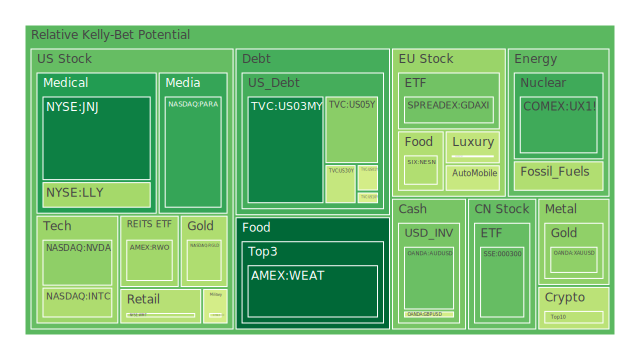
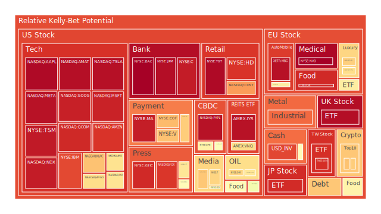
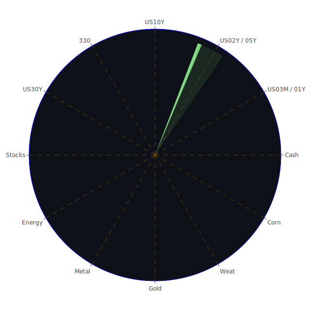

# 一、投資商品泡沫分析

在分析各種投資商品時，須留意其「當日現價PP100」以及「泡沫分數D1/D7/D14/D30」之高低。相對較高的泡沫指數顯示該商品近期價格或估值已有過熱或受到炒作的跡象；若在新聞或市場情緒上又出現重大負面訊號，則更需警惕短期修正風險。以下依據報告中提及之資產種類，綜合近期新聞、歷史借鑑及既有理論，簡要分析其泡沫風險與市場氛圍。

**1. 美國國債**  
美國國債一直是全球資金配置的核心標的。近期市場對聯準會（FED）貨幣政策的預期忽而鷹派忽而轉向微妙，尤其報告中顯示OIS FED Fund Rate 出現大幅波動，但最新數據指向4.48，跟上週5.33相比出現顯著下滑，隱含市場對未來利率路徑已有鬆動預期。10Y與30Y國債殖利率在4.57及4.81左右，顯示收益率曲線雖相對倒掛程度縮小，但仍為高位。在新聞面，過去對美國新政府推動刺激或大舉基建常導致發債量增加，而美國債務規模持續飆高，債務佔GDP比率維持高位，這通常會引發「美國國債是否存有泡沫」的質疑。然而，美國國債因其避險地位，若全球出現地緣政治風險或金融市場動盪，仍有相對資金回流效果。歷史上，美國國債在經濟衰退前期常會出現價格走揚、殖利率下行的趨勢，然當市場預期FED轉向寬鬆或資金流轉至其他風險資產時，也可能引發對債券價格的震盪。綜合看來，近幾日新聞提及特朗普及聯準會間可能再起的政策拉鋸，或將帶來美國國債短線波動。依據目前的泡沫指數與殖利率走勢，仍不宜輕忽其潛在風險，但中長期美債在「避險資產」地位上仍有其支撑。

**2. 美國零售股**  
美國零售股近期面臨多重挑戰，包括消費者可支配所得受到房貸利率攀升的擠壓，加之新聞中多次提及美國房地產市場成交量趨緩、「Home sales are stalled with 7% mortgages」等負面信號，意味著家庭部門的負債成本提升，衝擊零售消費意願。歷史經驗顯示，利率高升通常使信用卡循環利息爆炸性增長，而報告中亦指向美國信用卡違約率攀升、商業地產逾期率也維持在相對高位。對零售股而言，在民眾購買力可能趨緊的情況下，很多企業的季報表現及未來指引或不如預期。雖然有些新聞如「Biden to sign order to prioritize distressed 'left-behind communities'」顯示政府試圖紓困落後區域，但整體需求端的恢復仍具不確定性。美國零售股在泡沫風險方面，若估值過度依賴疫情後的報復性消費紅利，一旦利率成本或就業情勢改變，就會加速走跌，因此需特別留意。

**3. 美國科技股**  
科技股近年受到AI、新能源、5G等話題推動，一直是市場討論焦點。報告中，許多科技龍頭如AAPL、MSFT、GOOG等其泡沫指數均偏高，尤其部分個股接近0.90~0.95以上的區間。新聞層面也常出現「特朗普推動美國AI超級大國」、「OpenAI與各大企業合作」等，這反映投資人對AI、雲端、大數據的未來看好。然而須注意，如報告所示，一旦市場對利率或美國債務情勢開始憂慮，或FED態度更鷹派，科技股也容易遭遇資金撤出風險。回顧歷史類似的「網路泡沫」時期，在市場情緒過熱且本益比飆昇的時候，股價容易大幅波動。儘管此刻還不至於重演2000年的崩盤，但某些科技股若估值遠超過基本面，就得警惕泡沫危機。

**4. 美國房地產指數**  
本報告中顯示，與房地產相關的ETF或指數泡沫風險分數多在0.60~0.90之間，反映投資人對高利率環境下的房地產市場心存疑慮。新聞也多次提及「Home sales are stalled」、「7% mortgages」等訊息。回顧2007-2008年金融海嘯，房地產泡沫和次貸問題攪動全球金融體系，現階段銀行審核更為嚴格，雖然未必再度出現劇烈的崩盤，但在貸款利率與商業地產逾期率高企下，房地產投資者需要注意杠桿風險。若經濟遭遇衰退風險，房地產更可能出現價格壓力。不過，也有部分市場聲音如「Biden prioritizes left-behind communities」或某些地方政府稅費減免措施，可能在區域性上穩定住宅需求，因此仍需區分不同地區、不同物業類型的基本面。

**5. 加密貨幣**  
報告中顯示，BTC、ETH等主要加密貨幣的泡沫分數多數在0.50以上，甚至接近0.70，顯示短期價格確有顯著投機成分。新聞內提及「特朗普的首日政策與meme coin發行」引發市場雜音，另有「加密貨幣社群對其態度產生分歧」。歷史上，加密貨幣曾多次經歷狂熱炒作後的深度回調，如2018年及2021年底的劇烈波動。目前全球監管環境對加密貨幣仍然態度不一，美國監管機關對交易所也保持高度關注。建議在此領域保持謹慎，不可忽視流動性風險與監管政策突然轉向的衝擊。

**6. 金/銀/銅**  
在大宗商品裡，黃金常被視為通膨對沖或避險資產。報告顯示金價的泡沫指數雖有高於0.40~0.50，但主要因近期消息面的干擾，如FED貨幣政策走向未明、地緣政治風險等。新聞包括「以色列與加薩衝突」、「澳洲部分地區因氣候引發礦場關閉」等都會推動避險情緒。銀、銅方面受工業需求影響較大，尤其中國或新興市場需求變化是關鍵。新聞提及「中國經濟增長放緩」、「外銷訂單可能減弱」等，都會衝擊金屬價格。回顧歷史，金銀銅在全球局勢動盪時往往各自呈現分化：金屬作為保值工具具支撐，但若工業需求下滑，就可能影響銀與銅的走勢。因此在金屬領域內部也存在風險差異。

**7. 黃豆 / 小麥 / 玉米**  
農產品價格往往受到天候因素與地緣政治影響。報告可見CORN、WEAT等ETF或期貨之泡沫指數分布於0.30~0.60不等。新聞指向澳洲、俄羅斯等主要糧食出口國因氣候或戰爭帶來供應干擾，例如「澳洲西北部颶風」、「烏俄局勢」、「中國可能增加對澳洲農產品進口」等等，這些都可能推動短期波動。此外，歷史顯示，在金融市場不穩定時，農產品有時被視為替代避險標的，但與貴金屬相比，其價格波動通常更依賴供需面。在過去十年當中，黃豆與玉米都歷經過多次天災炒作行情。若要佈局農產品，需考慮天候模型與交易週期的特殊性。

**8. 石油 / 鈾期貨UX!**  
石油價格在報告數據中顯示泡沫風險指數約0.40~0.50之間，近期新聞如「特朗普推動美國增產」、「OPEC可能檢討產能」等均影響油價。歷史經驗表明，石油既是經濟活動的指標之一，也經常因地緣政治動盪而波動。地緣新聞若顯示中東地區衝突升級，油價往往迅速飆升，但若主要經濟體需求下滑或釋放戰略儲備，也可能壓抑油價。鈾期貨（UX!）則相對小眾，主要被視為核能需求相關標的。報告顯示泡沫指數中等偏上，顯示市場對核能重新興起的討論度高。然而，核能議題在過去因安全考量多次受民意與政策放緩影響，投資人應警惕政策轉向的風險。

**9. 各國外匯市場**  
近來澳幣(AUDUSD)與英鎊(GBPUSD)等貨幣對美元走勢均顯現震盪。報告中澳幣及英鎊泡沫分數中高，顯示投資人對澳洲與英國經濟基本面存疑。新聞如「澳洲賭場營運受挫」、「英國CMA監管層換人」等，不確定性升溫；英鎊也會因英國與歐盟後續關係而承壓。日圓(USDJPY)則受日銀政策彈性擴大影響而持續波動。歐元(EURUSD)最近幾日的泡沫指數相當高，顯示市場對歐洲在能源或財政的前景不一致。回顧歷史，每當美國轉向寬鬆或地緣政治不確定加大，資金往往逃往美元避險，推升美元指數，令新興貨幣與大宗商品貨幣承壓。外匯市場的槓桿高、流動性大，需要謹慎管理風險。

**10. 各國大盤指數**  
報告中可見如美國NASDAQ指數(NDX)、德國DAX指數(GDAXI)、法國CAC40 (FCHI)、英國FTSE (FTSE)等大盤，泡沫指數普遍偏高，尤其NASDAQ技術股成分重，風險積聚顯著。新聞持續提到特朗普的貿易政策走向尚未完全明朗，若重新採行關稅手段，對全球供應鏈將再度帶來影響。2020年以來，股市屢創新高，但其中是否包含過度投機，在歷史上類似的強勁漲勢之後，往往容易出現評價修正。需持續留意企業獲利指引與貨幣政策同步走向。

**11. 美國半導體股**  
AMD、NVDA、INTC、KLAC等在報告中的泡沫指數普遍高企，尤以NVDA近期AI相關應用題材使股價翻倍，也在新聞「Nvidia供應商股價下跌」「Deutsche Bank依舊看好」等消息來回震盪。半導體週期常伴隨大幅波動，歷史上每當晶片需求高漲（如挖礦、AI、高速運算週期），股價即可迎來熱潮；但需求一旦放緩或庫存積壓，就會快速下修。目前AI與車用電子需求支撐仍在，但若全球經濟放緩，半導體亦有修正空間。

**12. 美國銀行股**  
銀行股如JPM、BAC、C等在報告中的泡沫指數各有差異。新聞中也提到「Citigroup必須面對紐約官司」「美國信用卡違約率攀升」，反映銀行業正處在風險與機會並存的環境裡。高利率時期，銀行利差收益提高，但壞帳風險亦同步上升。歷史上，當景氣下行與違約率上升，銀行股往往首當其衝。雖然大型銀行因資本適足率高而更具防禦性，但此階段對各類銀行股均須留意資產品質與潛在風險敞口。

**13. 美國軍工股**  
軍工股如NOC、LMT、RTX等，近年因地緣政治衝突以及各國軍事預算增加而備受關注。報告中其泡沫指數多在0.50~0.55，屬中段偏上，顯示市場對軍工領域存在一定程度的投資興趣。新聞面頻繁提及中東衝突、烏俄地區緊張，支撐軍工股在歷史上常見的「軍事緊張—軍工收益」模式。若美國政府軍事預算持續擴張，軍工股有望維持相對強勢，但需要注意長期政治風險與預算審議波動。

**14. 美國電子支付股**  
電子支付股如V、MA、PYPL、ADP、GPN等之泡沫指數偏高，顯示市場長期看好數位支付浪潮。不過，新聞顯示「Citigroup未能保護消費者免於詐騙」、「電子支付詐騙」等，亦容易衝擊消費者信心。歷史上每當市場流動性充裕、電子商務活絡時，電子支付股表現往往亮眼；但在利率調整與消費信心波動時，也可能遭遇估值壓力。需觀察各大公司在安全機制與跨境支付佈局。

**15. 美國藥商股**  
MRK、JNJ、LLY等報告顯示泡沫指數多在0.10~0.60之間，風險相較科技股或區塊鏈題材股不算過度，但仍需關注「研發成功率」、「法律訴訟」、「藥價政策」等議題。新聞談及「醫保改革」或「重大公共衛生議題」皆可能影響藥企。歷史上，醫藥股因帶有防禦性，往往在市場震盪時保有一定支撐力，但仍不能忽視藥物研發風險與專利到期問題。

**16. 美國影視股**  
包括DIS、PARA、NFLX、FOX等。報告中有提及「Netflix訂戶大幅成長，且直播賽事與體育權利帶動收益」。新聞同時也有「電影與影視業製作困難」、「串流平台競爭」等，不同公司之間的泡沫指數高低不一。例如NFLX泡沫指數一度高達0.70以上，暗示樂觀情緒濃厚，但若競爭者跟進或觀眾口味多變，也可能拖累訂戶增長。回顧2008年金融危機中，影視娛樂類股曾一度逆勢受捧，顯示在經濟不景氣期間，部分娛樂消費仍有韌性。不過投資人需要留意當今串流市場的競爭格局與通膨對訂價策略的影響。

**17. 美國媒體股**  
CMCSA、NYT等公司代表傳統及新興媒體。新聞中提及部分媒體正面臨廣告營收壓力、美國政局變化帶來的政策趨勢不確定性。歷史上媒體股常隨著政治事件或大型賽事而出現流量或營收波動，但長期趨勢仍與消費者閱讀或收視習慣變遷密切相關。由於網路新興平台分流注意力，一些傳統媒體若未能轉型，可能面臨營收下滑壓力。

**18. 石油防禦股**  
石油防禦股與軍工股類似，都因地緣政治衝突而吸引特定買盤。例如XOM、OXY等近期報告中泡沫指數有0.60~0.80左右。OXY等公司亦受惠於頁岩油技術與美國內部增產策略，但國際油價若遇到需求面衰退或OPEC增產壓力，股價仍可能受創。歷史上在油價高檔時期，石油防禦股營利向好，但一旦油價反轉向下，其估值回檔也常常很快。

**19. 金礦防禦股**  
金礦防禦股如RGLD、GHC（部分金礦或綜合性控股）之估值受黃金價格牽動。如今黃金雖然有避險需求，但若利率回升導致持有黃金的機會成本提高，也可能抑制黃金走勢。歷史上，在股市大幅震盪階段，金礦股常能逆勢上漲，但其波動度也高於金價本身，因為金礦公司的生產成本、政治風險（礦區所在國政策）皆影響股價。

**20. 歐洲奢侈品股**  
如歐陸上市的MC、KER、RMS等，面臨中國消費需求的變數。報告中該類股泡沫指數多半在0.60~0.68上下。新聞顯示「中國經濟放緩」、「歐洲政治不穩」，以及人民幣匯率波動，都會影響奢侈品企業的業績。歷史經驗顯示，奢侈品對經濟景氣具前導性，景氣下行時業績減少，股價也往往率先修正。投資人需注意亞洲旅遊與高階消費的需求復甦速度。

**21. 歐洲汽車股**  
BMW、MBG等在報告中泡沫指數參差不一，MBG甚至一度超過0.90，但後來又回到0.66~0.70區間。新聞面「德國反對黨承諾興建氣電廠」、「歐洲整體能源政策不確定」等，可能對車廠的生產成本構成壓力。歷史上歐洲車廠在全球需求熱絡時市占率提高，尤其中國市場。但當中國或北美需求減速、或電動車轉型失利，就會產生衝擊。近期電動化轉型是趨勢，但對傳統車廠的轉型挑戰也不可小覷。

**22. 歐美食品股**  
包含KHC、NESN、KO等。報告數據顯示此類防禦型食品股的泡沫指數大致在0.30~0.55區間，頗具防禦特色。不過，新聞「零售需求下滑」、「消費者預算緊縮」仍是考量因素。食品企業在歷史上的抗通膨能力通常高於其他類股，但若成本端（如農作物、原料、運輸）出現大幅波動，獲利也會縮水。投資者需同時追蹤糧食原料和貨幣匯率走勢。

---

# 二、宏觀經濟傳導路徑分析

在宏觀層次，透過Spatial（地域分布）、Temporal（時間走向）及Conceptional（結構概念）三位一體分析可見，全球經濟仍處在疫情後復甦不均的階段，聯準會及各國央行的利率政策牽動資金流動。由於美國FED總資產減少、RRP走低，但貨幣市場基金規模卻在上升，顯示部分閒置資金留在貨幣市場。美國國債利率曲線維持平坦或略倒掛，一旦聯準會釋放鷹派言論，市場就可能快速轉向，衝擊股市與企業融資。對新興市場來說，美元短期依舊強勢，但若美債殖利率趨穩並開始下滑，資金可能重新流入新興市場或風險資產。報告顯示固定抵押30年房貸利率增至7.04，令美國房市進一步承受壓力，消費走弱可能拖累零售銷售及相關製造業，使得資金再度尋求穩定的債券或大盤股。石油、農產品、黃金的價格走勢，則與全球需求和地緣衝突同步波動。

---

# 三、微觀經濟傳導路徑分析

從企業與產業鏈角度觀察，由於高利率環境下借貸成本上升，企業必須在營運中更嚴格控管資金流。零售企業若消費緊縮，將優先面臨庫存積壓與營運資金吃緊的問題；科技企業則可能因新一輪AI或伺服器升級需求而仍有募資與研發支出，但一旦無法達成盈餘目標，股價恐大幅震盪。銀行業在信用卡違約率升高的情況下，壞帳撥備會侵蝕獲利；半導體企業受終端需求波動，庫存調整加劇。若產業供應鏈因政治因素或自然災害（如澳洲礦區風暴、加納金礦武裝衝突）而斷裂，則原料成本將進一步推升，傳導至終端產品價格，引發新的通膨壓力。最終這些衝擊會疊加在企業獲利報表，影響股價和債券評級。

---

# 四、資產類別間傳導路徑分析

依據三位一體的思考：  
- **Spatial**：各國市場的互動不僅在貿易層面，也包括跨國資本流動。美國一旦重啟關稅或進行地緣制裁，歐洲、亞洲新興市場皆可能相繼承受衝擊。  
- **Temporal**：在短期資金流動中，美國國債若殖利率走高，吸走全球流動性，壓抑新興市場；而在中長期，若美國經濟衰退，更多資金或轉向黃金、日圓等避險標的。高利率若持續超過一年，則商業地產與房地產ETF的風險將被放大。  
- **Conceptional**：產業上，科技股與半導體股對全球供應鏈的影響深遠，一旦此區塊受衝擊，可能拖累整體股市與經濟增長預期。另外，地緣政治衝擊軍工、石油、金屬板塊，再度使避險情緒升溫。由於多數投資組合都分散於股、債、商品與外匯，當新聞焦點從一國蔓延至多國，就形成「漣漪效應」：例如當歐洲奢侈品需求下滑，將傳導至歐洲經濟指標，再影響歐洲銀行風險承擔，並最終牽動全球金融市場風險偏好。

---

# 五、投資組合機會與對沖思考

根據報告數據想要找出風險對沖組合，需考慮相位盡可能滿足120度，相關係數約-0.5，使資產之間在波動時能互相抵銷風險。綜合上述分析，我們可以從以下角度思考：

1. **股債反向配置**：在高利率環境中，一般預期股市與債市呈現負相關，但目前市場對FED路徑仍不明，短線存在「股、債同跌」可能。若以美國短天期國債作對沖配置，雖然殖利率較高，但利率若反轉下跌，長天期國債價格反而更有空間，對沖效果更大。  
2. **商品對沖**：油價與黃金之間長期並非完全負相關，但在特定事件（如戰爭或政治衝突）會出現同漲同跌。可思考在投資組合裡納入金屬或農產品，因為他們受氣候或地域事件影響，走勢與全球股市之相關性相對低。  
3. **外匯對沖**：若投資人重壓美元資產，可考慮同時配置一些日圓或瑞郎部位。因這兩種貨幣傳統被視為避險貨幣，當全球風險偏好下降時，日圓與瑞郎容易升值。  
4. **產業對沖**：軍工股在地緣政治升溫時往往走強，可與零售或傳統經濟類股形成一定程度的對沖。若市場風險偏好上升，軍工股漲幅可能相對有限，但零售、消費、科技股或能補足收益空間。  

考量泡沫風險與市場互動，我們可構建如下思路：以美國半導體股與軍工股、黃金與房地產ETF、加密貨幣與美國10Y國債等進行配對，並力求它們之間相關性不高，盡量接近-0.5。同時，亦需審慎研究每一檔標的的流動性與波動幅度，確保整體組合能在大波動時相互緩沖。

---

# 六、最終多項資產之間的漣漪效應傳導路徑

在資產市場上，任何一個新聞事件都可能透過以下路徑在資產間造成「漣漪」：  
- **軍事或政治事件**：如以色列與鄰國衝突，可能推升石油或軍工股；石油上漲又帶動通膨預期，使債券殖利率攀升，最後反壓科技股與銀行股。  
- **利率轉向**：美國FED釋出鷹派訊息，導致美元走強，新興市場股債雙跌。企業貸款成本上揚，消費及投資意願下降，零售與房地產指數表現轉弱。  
- **政策公布**：若歐盟或美國宣布額外關稅或科技限制，直接打擊半導體與科技股，同時衝擊出口需求較高的歐洲汽車股，讓市場資金轉往防禦性標的如黃金、醫藥或必需消費品。  
- **消費趨勢變化**：當新聞指出「Home sales are stalled」、「7%房貸」，反映民眾可支配所得減少，將顯著衝擊美國零售股及食品股盈餘預期；進一步傳導至上下游物流、甚至科技訂單減少。  
- **社會情緒/心理因素**：若傳出嚴重天災或群聚性政治運動，市場情緒傾向風險厭惡，傾向出脫高風險資產如加密貨幣或高估值科技股，轉向傳統避險領域（美債、黃金、瑞郎等）。

---

# 投資建議

## 1. 穩健型配置 (合計 100%之中的40%)  
- **美國短天期國債**（約15%）：在利率相對高點區間，具有一定收益且波動相對較小。若未來利率意外再升，也能較靈活應變。  
- **黃金**（約15%）：用於對沖地緣政治與通膨風險。同時參考報告泡沫指數雖中高，但長期仍具備保值功能。  
- **必需消費品/食品股**（約10%）：如NESN、KO、KHC等，因日常消費需求穩定，在景氣下行時可提供防禦性。  

## 2. 成長型配置 (合計 100%之中的35%)  
- **美國科技股（雲端與AI）**（約15%）：如MSFT、GOOG等，AI與雲端仍是長線趨勢，但要嚴防高估值風險，分批佈局。  
- **半導體股**（約10%）：聚焦具技術領先或車用半導體需求穩定者，如AMD或NVDA，同時關注監管及地緣供應鏈風險。  
- **歐洲奢侈品或汽車股**（約10%）：若中國或北美消費回溫，歐洲品牌或受惠；但需審慎篩選財務健康和電動化佈局積極的公司。  

## 3. 高風險型配置 (合計 100%之中的25%)  
- **加密貨幣**（約10%）：BTC、ETH等主要幣種，在交易性與波動上都極高，短期漲跌可能劇烈，僅能以小比重博取高報酬。  
- **軍工股**（約10%）：如LMT、NOC，若地緣政治緊張加劇，軍工訂單與預算支撐股價，但政治風險與預算干擾因素也需留意。  
- **石油/鈾期貨或相關能源股**（約5%）：油價受地緣與需求周期影響劇烈，鈾期貨聚焦核能發展的未來潛力。適合少量配置作超額收益拼搏。  

上述配置並非固定不變，而是隨市場變化可機動調整。整體原則是：穩健型提供防禦與穩定收益，成長型把握長期趨勢與合理估值，高風險型則在控制部位的前提下追求潛在高回報。

---

# 風險提示

投資有風險，市場總是充滿不確定性。過去幾年我們已反覆見識到地緣衝突、疫情、政局變化等巨幅擾動。報告中多次提醒，如果加密貨幣或特定成長型科技股的泡沫分數過高，且缺乏實質獲利支撑，一旦市場出現風向轉變，就可能遭遇急速修正。房地產相關資產在利率高檔時亦需謹慎，尤其信用週期下行時容易發生流動性風險。另一方面，不少大盤指數或衍生品正處於高位，防禦心態不可或缺；亦要嚴防「音速下跌」或「流動性枯竭」。若新聞負面衝擊再度升溫，使得恐慌情緒聚集，市場將瞬間出清脆弱的高估值標的。

因此，本報告提出的任何建議僅供參考，投資者應根據自身風險承受能力與投資目標做出獨立決策。放眼未來，市場充滿挑戰，也蘊含機遇；唯有在判斷宏觀與微觀結構、結合資產間的正反合互動，並適度關注泡沫風險，方能在不確定中找尋更穩健的配置，並確保長遠的財務安全與成長。請務必牢記：泡沫風險高的資產通常在市場信心轉變時會最先面臨跳水，及早了解風險與籌劃對沖策略才是明智之舉。 

 
Daily Buy Map:

 
Daily Sell Map:

 
Daily Radar Chart:

 
