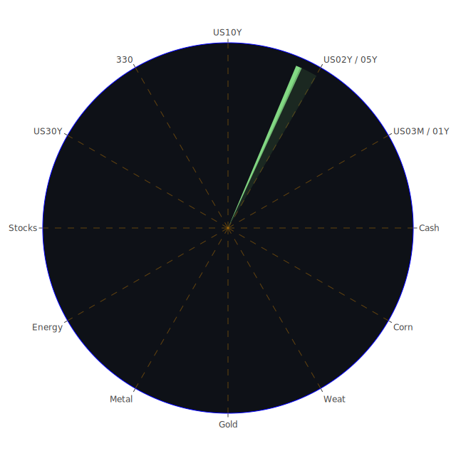

# 一、投資商品泡沫分析

此部分將針對多項資產，綜合考量其泡沫風險指標（如D1、D7、D14、D30等）以及近期的新聞事件與歷史背景，探討背後所反映的市場情緒、社會心理和博弈行為。也會提及經濟學與社會學的視角，如需求與供給、資金流動、避險與投機情緒、群體行為、消息面衝擊等等。

## 1. 美國國債
從歷史上看，美國國債一直是全球投資人眼中的避險資產之一，但近期受到聯準會貨幣政策、國內外通膨前景，以及美國財政部發債規模的影響，利率波動性顯著上升。根據最新的新聞和經濟數據顯示，長天期國債收益率（如30年期）已上揚至4.8以上，而5年期、2年期等中短期收益率也在4.3到4.6之間震盪。舊有的歷史經驗顯示，美債若長短端倒掛時間過長，或許暗示經濟前景出現隱憂，但近期部分新聞談到聯準會在政策發言上較趨於鷹派而非鴿派，短期內並沒有急速降息的明確訊號。這意味著市場對通膨、就業和地緣政治風險仍保有警戒。  
然而從心理學的角度來看，美國國債也因全球流動性需求和外資「安全停泊」的慣性，往往容易被大資金所配置，即使殖利率上下波動，長期仍有對沖功能。博弈論角度下，當全球主要央行還沒有大規模寬鬆的明確訊號時，投資人增持美債可能在於兩個考量：一是暫時的避險，二是對未來較長期經濟成長的不確定性。  
綜合新聞面可見，雖然近日對美債需求尚未有大幅降溫的情勢，但高殖利率亦意謂著未來價格回落風險也會存在。D1、D7、D14、D30的泡沫分數雖不算極度高昂，但市場對流動性與負債率的疑慮一直存在，需要持續觀察美國政府財政赤字與舉債上限的博弈。在歷史上，當美國政府陷入政府關門危機或舉債上限談判時，雖短期會出現資金風險偏好急降，但長期來說美債仍具避險需求。此處泡沫程度相對溫和，但必須警惕潛在的利率風險與價格下跌風險。

## 2. 美國零售股
美國零售股在近年面臨多重挑戰，包含線上與線下通路競爭、通膨推升成本、勞動力市場緊張、供應鏈時常不穩等。部份新聞（如某些大型連鎖零售商對近期獲利疑慮的消息）顯示，零售股可能經歷了業績的不確定性。再者，最新新聞提到「Home sales are stalled with 7% mortgages」等不利於消費端的消息，也將影響民眾購買力與消費傾向。  
即使零售公司中也有龍頭企業在力抗宏觀逆風，例如部分通路嘗試透過發展電商、生鮮配送或結合AI物流優化效率，然而社會學角度可見，消費者信心往往會因政治、經濟甚至疫情警訊而迅速波動。通過心理學和博弈論，可解讀零售投資人可能採取觀望態度，尤其遇到新聞報導企業財務預測疲弱，就會產生拋售或減持行為。  
近期對比歷史數據，在過去經濟衰退前期，零售股常呈現顯著震盪甚至領跌，是評估市場健康度的觀察指標之一。目前若泡沫分數顯現中度偏高，就意味投資人仍對通膨壓力和利率水準抱持憂慮，一旦市場景氣下滑加劇，零售業績容易大幅走弱。建議投資人留意財報季的銷售指標及展望指引。

## 3. 美國科技股
美國科技股一直是資本市場風向的核心指標之一，大型科技公司從歷史上看，常常驅動整體股市漲跌。近期多家科技公司在新聞中皆提及AI、雲端、資料中心相關的業務成長，像是一些做半導體（含高帶寬記憶體HBM的廠商）、AI晶片公司、或著重智慧型手機與雲端運算的企業等，都在財報或新聞中傳達利多。然而，新聞消息亦顯示「Trump's embrace of meme coin sours mood in crypto industry」等事件，可能亦暗示科技圈之間對於創新領域的情緒分歧。  
科技股在之前幾年疫情帶動數位化大潮下，出現股價狂飆，接著在利率翻揚後遭受巨大修正。現階段投資人仍在觀望全球經濟和利率變動，以及政治面對科技產業的監管政策。一些新聞顯示如「Musk Says FTC Concern Over Microsoft Backs His OpenAI Claims」等，也牽動市場對龍頭科技企業是否遭受監管壓力的擔憂。  
心理學與社會學層面可見，科技股對未來成長的敘事往往具有吸引資金的極大魅力。但博弈論則指出，高估值科技股也容易在明顯風險到來時，被基金大戶拋售砍倉，導致股價劇烈波動。結合歷史經驗，可以從2000年科網泡沫與之後的修正觀察到，當市場對特定科技概念的預期過度樂觀時，極可能引發估值背離基本面。目前若某些高階AI相關公司之泡沫分數升高，投資人就需仔細評估盈餘成長能否支撐高估值。整體而言，現階段科技板塊的確擁有不少亮點，但同時隱含的波動風險亦不能小覷。

## 4. 美國房地產指數
有新聞指「Home sales are stalled with 7% mortgages」，同時也看到「Fixed Mortgage 30Y Rate is at 7.04」，部分地區購屋需求受到資金成本飆升、就業結構變化等綜合作用而顯示疲弱。然而房地產市場素來與利率環境息息相關。歷史上，在低利率的年代（例如疫情初期與前期的量化寬鬆），房地產市場往往會出現一波衝高。然而利率升高期間，若民眾購買力與投資客需求轉弱，一旦價格無法被撐住，就可能湧現拋售潮。  
在心理層面，房地產一直被視作美國中產階層與資產增值的主要管道，很多人在近幾年爭相進場，推升了價格。若經濟衰退預期加深，大量房屋被迫擱置或拋售，就可能引發房地產股與房地產ETF回調。博弈論角度來說，若貸款利率持續高企，投資人對未來租金收益的評估也必須更加謹慎。當前泡沫風險雖不比2008年金融海嘯前狂熱，但仍要持續關注貸款違約率的變化。  
綜合市場訊息，房地產領域的風險分數中段偏高，顯示市場尚存一點樂觀預期——部分公司在商用不動產、資料中心租賃、物流倉庫等領域或許仍有需求，但整體脆弱性不能忽視。建議投資人密切追蹤未來利率走勢與就業數據，若經濟持續放緩，房地產指數恐將面臨二次探底風險。

## 5. 加密貨幣
近期新聞有「Bitcoin Falls From Record in Volatile Inauguration Day Trading」、「Trump's first day in office gets mixed reception from US stocks: Tesla, prison operators and other notable 'Trump trades'...」以及「Trump's embrace of meme coin sours mood in crypto industry」等，顯示加密貨幣市場對政治事件相當敏感。歷史上，比特幣、以太幣等價格屢次隨全球資金面鬆緊而大起大落。  
心理層面中，人們對去中心化金融抱持期望，但市場對監管風險、交易所安全性、政府態度轉向等皆格外敏感。社會學觀點則認為，加密貨幣一度成為年輕世代或社群團體的信仰與潮流投資。博弈論顯示，當大戶（鲸魚）控盤或消息面利多、利空同時出現時，行情容易超漲或超跌。  
從最新數據來看，比特幣再次突破十萬美元大關，然而泡沫分數在中高水準，引發市場擔憂回調壓力。不僅比特幣，如DOGE與ETH等也出現高波動性。一些專家警告可能存在高風險泡沫，若遇到政策打壓或大戶砸盤，跌幅可能劇烈。投資人若要配置該類資產，需要承擔極大的價格波動，並謹慎留意交易所的資金安全，以及市場對加密產業監管趨勢的變化。

## 6. 金／銀／銅
根據新聞可見，「GOLD OIL RATIO is at 36.63」「GOLD COPPER RATIO is at 642.08」等。金價波動與地緣政治、通膨預期與市場避險需求關聯頗深。近期聯準會鷹派取態略微放緩，但仍不明確，而地緣風險新聞尚未顯著消退，導致金價有一定支撐。銀與銅作為工業金屬，則更易受製於全球景氣與製造業回溫或衰退，尤其銅常被視為反映世界經濟活動的晴雨表，若中國或其他新興市場需求不振，銅價易疲弱，但若在綠能或電動車產業帶動下，長期需求亦存在機會。  
歷史上，在大環境不確定時，黃金常成為資金流入的避險標的。而白銀波動度往往比黃金更大，投資人須留意。銅的走勢若呈現高位震盪，可能顯示市場對經濟復甦信心或對基礎設施需求依舊有期待。就泡沫分數而言，目前金屬市場並非極度狂熱，但也出現一定程度上漲，顯示投資人留意對沖通膨的需要。

## 7. 黃豆 / 小麥 / 玉米
根據新聞顯示，黃豆、小麥、玉米等農產品市場偶爾受極端氣候、戰爭或輸出國政策調整影響。近期亦有消息指出「Brazil says soy shipments to China from five firms halted due to contamination」等，代表國際糧食市場供需關係仍不穩。歷史經驗顯示，當供給面臨氣候或地緣干擾，價格會突然飆漲；若需求國因經濟下滑或內需放緩，可能造成價格回檔。  
社會學與心理學觀點中，農產品因與民生需求、糧食安全相關，常被各國重點關照，一旦出現訊息干擾，也易放大投機情緒。博弈論則顯示，期貨市場若大戶席次不平衡，短線價格易受操控。從近期泡沫風險來看，農產品並未進入極端泡沫，但若氣候或貿易政策再起重大變數，漲跌幅度可能擴大。

## 8. 石油 / 鈾期貨UX!
石油價格走勢與地緣政治、OPEC+產量決策、美國頁岩油生產、經濟景氣和美元走勢息息相關。新聞面如「Oil Falls as Trump Holds Off on Tariffs, Vows to Boost Output」或「Kinder Morgan misses quarterly profit estimates, remains bullish on natgas demand」等，都顯示油氣板塊景氣仍然動盪。若經濟需求疲弱、國際政治衝突減緩，油價容易下跌；反之若有戰爭或供給面受阻，油價將大幅上揚。  
鈾期貨則多關聯到核能產業，需求穩定但也相對受政策導向。歷史上，當各國重新評估能源結構並擴建核能電廠時，鈾價格可望上揚；反之若核能議題在政治或民意層面遭反對，需求及價位就會下挫。心理學觀點可見大眾對核能的恐慌或支持在不同時期起伏很大，且社會層面亦會權衡碳排放與能源安全。以博弈論來看，各國能源政策若呈現搖擺不定，鈾價也易隨之波動。  
總體來看，石油泡沫風險分數持於中段，市場正在觀望全球需求端能否在AI與資料中心帶來更多電力需求的間接影響，以及地緣政治不確定性。鈾期貨則偏小眾，但一旦各國大幅擴大核能佈局，可能使價格飆漲；反之也有快速回跌的潛在風險。

## 9. 各國外匯市場
國際外匯市場的波動常受央行貨幣政策、貿易平衡、地緣政治局勢與市場風險偏好牽動。近期觀察可見，美元曾因美國內部政治與利率差影響而出現階段性走弱或走強。英鎊、歐元、澳幣、日圓等也都在動盪中。新聞中提到「Japan’s Love of Foreign Stocks Risks Pushing the Yen Even Lower」，顯示日圓持續偏弱。澳幣在商品市場需求波動下也較具敏感度。  
由心理學、社會學來看，市場對貨幣的信心與避險需求往往隨國際貿易戰、人道危機、政治衝突而變。博弈論顯示，央行與市場投機資本的互動會導致劇烈波動。若近期美國利率仍偏高，其他貨幣或有貶壓。歷史證明，若美元長期強勢，可能壓制新興市場外匯，但一旦美國經濟放緩或聯準會轉向，美元也會迅速走弱。對於外匯交易者來說，此市場風險與機會並存，但要留意自身槓桿與宏觀波動風險。

## 10. 各國大盤指數
各國大盤指數包括美股主要指數、歐洲主要指數、亞洲指數如日經、恆生、滬深或台灣等。根據新聞觀察，美國S&P 500近期因對AI龍頭股的利好消息而接近或逼近歷史高點；歐洲各主要股市中，部分國家受通膨壓力與能源問題所困，另有國家則因奢侈品與汽車產業營收表現上揚而維持不錯的漲幅。亞洲方面，日經指數受「日本資金向海外股票配置」的交叉影響中，指數維持相對強勢；中國大陸則在房地產與內需不振的壓力下，大盤波動。  
社會學觀點可見，指數常被視為經濟「晴雨表」，但有時也顯示資金集中少數龍頭板塊而導致與經濟實質狀況脫鉤。心理學層面，投資人可能對AI、能源、軍工等賽道抱持過高期待，而忽略潛藏風險。博弈論則顯示，各國官方可能透過政策市或匯率干預來支持股市表現，一旦政策翻轉，指數可能劇烈震盪。以歷史來看，過熱或過低的指數都可能被政策或事件逆轉。目前大盤指數在中高位震盪，泡沫風險不容輕忽。

## 11. 美國半導體股
半導體龍頭企業的新聞中，提及高帶寬記憶體(HBM)銷售熱潮、AI伺服器需求增強等，推動了營收與股價表現。一些分析報告也指出市場對資料中心需求成長抱持樂觀。然而，大陸市場需求的不穩定、地緣政治下的晶片管制、先進製程的投資成本劇增，都是半導體產業可能面臨的風險。  
觀察歷史，半導體產業的景氣循環十分明顯，旺季時訂單爆量，谷底時產能過剩，價格急跌。心理學觀點可說是「科技樂觀」與「庫存壓力」之間的不斷拉鋸。博弈論層面顯示，美中之間對高階晶片的博弈與出口管制，會對國際半導體供應鏈造成長期不確定性。若現在估值偏高且泡沫分數升溫，就要小心可能出現獲利了結的賣壓。市場仍預期AI持續發酵，但半導體股的漲勢在短時間內能否永續，需要更具體的需求支撐。

## 12. 美國銀行股
銀行股是金融市場的核心，衡量整體經濟健康與信用環境的關鍵指標。新聞中亦提到部分銀行因訴訟或罰款、客戶資金流向貨幣市場基金等，出現壓力。近來聯準會持續的緊縮政策，導致銀行業的放款利率與存款利率之間的利差壓力上升，雖然整體淨利差可能擴大，但也要看不良貸款與逾期狀況。  
另有消息指出，高收益債利率上升不再惡化，但信用卡呆帳與某些房地產貸款的拖欠可能在累積。歷史上銀行股在資本市場動盪時，容易被投資人撤資，特別是遇到重大流動性事件或擠兌風險時，更容易遭到猛烈拋售。心理學面顯示，一旦出現銀行倒閉或財務醜聞消息，民眾信心就會急速崩解。博弈論顯示，各大銀行也在競爭存款、資產管理與信貸業務，期望在風險與收益間取得平衡。若泡沫分數對銀行股的評估在中高位，也暗示市場對潛在金融風險尚存戒心。

## 13. 美國軍工股
軍工產業常與地緣政治、政府支出預算相關。當某些區域衝突升溫，或世界主要強權重新布局軍備時，軍工企業就會迎來大額訂單或至少不錯的前景。部分新聞（如美國政府或國會的軍費預算動向）也常左右軍工股的漲跌。  
歷史經驗顯示，在地緣衝突最緊張或局勢不確定時，軍工股相對有防禦性。然而一旦衝突和緩或財政預算被削減，該板塊也可能面臨利空衝擊。心態上，許多投資人視軍工股為系統防禦性標的，尤其在國際局勢多變之際；博弈論更指出，大國之間往往以軍事投資來展現肌肉，因此也形成潛在需求。就泡沫分數而言，軍工股目前並未在過度瘋狂範圍，但若接下來局勢變化或政策縮減，仍可能有震盪。

## 14. 美國電子支付股
電子支付企業包含信用卡、線上支付、金融科技支付平台等。新聞提到「Citigroup must face New York lawsuit...」、「Chair of UK competition regulator steps down...」等監管事件，也可能間接影響大型支付機構。有市場消息顯示，部分支付龍頭在跨境支付與線上零售大幅成長下，獲得穩定營收；但也有投資人擔憂新興競爭者或區塊鏈支付的威脅。  
社會與心理層面，消費者對行動支付的依賴度逐漸加深，但若經濟前景不明確、個人信用卡違約率上升，支付機構的手續收入恐受衝擊。博弈論角度，看得出大型金融科技公司之間互相競爭，並與傳統銀行爭取市占。就過往歷史來看，電子支付股時常具備成長潛力，股價一旦伴隨強勁財報便迅速上漲，但監管或系統性風險也可能釀成急跌。  
當前的泡沫風險指標大多在中高程度，如對風險偏好者具吸引力，但亦須有控制風險的策略。

## 15. 美國藥商股
美國藥商股的表現常與研發管線、新藥審批進度、醫療政策等密切相關。新聞中則可看到某些藥企面臨專利到期、競爭對手生物相似藥物推出的風險，也有些取得重大醫療突破，股價大漲。另一方面，美國政府對藥價的管制走向，也對藥商未來利潤空間有重大影響。  
歷史證明，藥品和生技產業更可能受到臨床試驗結果或併購消息激烈左右。心理學面顯示，投資人對於醫藥公司常懷抱「奇蹟療法」的期待，一旦市場解讀新藥潛力極大，估值就可能推高；反之若試驗失敗，股價將迅速腰斬。博弈論層面，藥商互相專利、併購、授權談判常牽動市場。以泡沫分數來看，該領域風險中等偏高，但並未達到瘋狂，仍要審慎關注法規與市場實際需求。

## 16. 美國影視股
影視產業受串流媒體、廣告市場、演員罷工、内容產權等多重因素影響。新聞可見「Netflix Posts Record Quarter Thanks to Sports, ‘Squid Game’」、「Netflix hikes subscription prices...」等皆表明串流巨頭在體育賽事與國際市場擴張上取得成績。  
歷史上，影視產業經常隨著技術與收視習慣改變而出現大幅洗牌，如早年DVD到線上串流的轉變，造成許多傳統影視公司衰退，但也讓新的OTT平台崛起。當前大公司競爭激烈，社會學角度顯示，消費者的娛樂選擇日益分散。心理學層面則顯示若有爆款內容（現象級影集、電影）可迅速帶來營收爆發。博弈論下，各家龍頭互相角力內容版權與平台訂閱用戶。若泡沫分數偏高，意味市場對其成長預期樂觀，但同時要防大額投入的內容成本難收回，或競爭對手夾殺的風險。

## 17. 美國媒體股
廣播、電視、出版、數位內容等媒體股，也常見受到廣告營收景氣、政治或體育賽事轉播權、新聞採購成本影響。新聞如「Nomura to Rebuild FX Options Business Stung by Wave of Exits」或「TikTok users anxiously await its return to US app stores」等並非直接針對傳統媒體，但反映整體數位生態競爭激烈。  
歷史經驗：傳統媒體在轉型過程中，受線上平台分流衝擊較大；一旦廣告客戶預算被分食或粉絲群體流向社群新興平台，就可能導致業績下滑。心理學層面上，受眾對權威媒體的忠誠度下降，也是社會結構轉變的標誌。博弈論顯示，大型媒體集團透過併購擴張內容版圖，但也要承受債務與經營整合風險。若在市場上，媒體股的泡沫分數若偏高，可能是因投資人預期新媒體布局成功，但也可能隱含在傳統模式中盈餘衰退的疑慮。保持警覺。

## 18. 石油防禦股
所謂「石油防禦股」多半是指同時從事石油開採、煉製、化工產品的綜合性企業，以及在能源危機時具防禦性的公司。當油價上行，該類公司能獲利大增；油價下行，若企業業務多元化，也相對具抗跌。新聞可見對地緣政治衝突和美國頁岩油的關注度較高，使該板塊維持一定關注度。  
歷史多次證明，石油巨頭往往能在高油價時期大舉投資，並在油價回跌時進行購併整合。心理學層面上，投資人視這些企業為「分散風險」或「現金流穩定」的工具，但博弈論顯示，若全球能源結構加速向綠能轉型，長期對石油需求恐放緩。近期泡沫風險在中間水位，尚無極端狂熱，需繼續觀察油價走勢與企業轉型進度。

## 19. 金礦防禦股
金礦防禦股與黃金價格走勢高度正相關，一旦市場避險需求上升，金價攀升，金礦股利潤便可望同步提升。又因為金礦本身需要開採成本，若金價不足以支撐開採，就會壓低獲利。新聞或經濟事件如「聯準會可能暫緩升息」或「地緣局勢緊張」時，金礦股通常受益。  
歷史上，金礦股在通膨高漲、貨幣貶值或戰爭風險攀升時，可能走出一大波漲勢，但反轉時也很快。心理上，投資人將其視為黃金替代投資。博弈論角度，金礦企業常在金價高漲時擴張產能，最終導致市場供給過剩或成為槓桿風險。觀察現在之泡沫分數顯示中高，要注意短線高波動。

## 20. 歐洲奢侈品股
歐洲奢侈品產業在近幾年受益於國際旅遊回暖與消費升級趨勢，但也面臨中國等新興市場需求放緩及全球地緣衝突對高端消費信心的衝擊。新聞顯示某些奢侈品龍頭不斷創新高，但一旦政治或經濟局勢不穩，他們的銷售也可能顯著下滑。  
社會與心理學層面上，奢侈品象徵地位與身份認同，一旦中產消費受到壓抑，企業高端客戶群仍在，但營收成長不如預期也會引起市場反應。博弈論則指出，奢侈品品牌之間的競爭與併購時常發生，透過合併提高市佔率。若市場預估奢侈品需求放緩，股價和估值都可能修正。綜觀泡沫風險處於溫熱階段，投資該板塊需留意全球消費信心變化。

## 21. 歐洲汽車股
歐洲汽車品牌在電動化與智能化變革中持續投入研發，並面臨來自特斯拉與其他新勢力廠商的市場競爭。新聞提到「BMW」之類企業也會受全球經濟週期、能源成本、供應鏈緊張等因素牽動。歷史上，歐洲汽車業常受歐盟排放法規改變衝擊，一旦新法規提高標準，企業必須支出大量資金技術升級。  
心理與社會層面，消費者對歐系車品牌形象與傳統工藝有一定支持，但電動車時代的來臨使得競爭模式不斷變化。博弈論觀點顯示，歐盟或各國可能推動財政補貼來協助電動車轉型，若企業無法跟上潮流恐被市場淘汰。目前若在評估泡沫時，看來該板塊並無極端炒作，但波動值得關注，尤其中期市場景氣是否能支撐高檔售價。

## 22. 歐美食品股
食品行業雖具有相對防禦性，但通膨與供應鏈成本抬升，仍會壓縮獲利。新聞如「Crop Trader Declares Force Majeure Along US Gulf During Rare Southern Snow」，若原料成本走揚，利潤也會受侵蝕。歷史證明，經濟衰退時食品需求減少並不顯著，但高級食品或外食可能下滑，因而影響相關廠商。  
心理與社會學角度，民眾的飲食習慣會因健康意識、生活方式轉變而改變需求結構。博弈論下，全球糧食公司互相競爭市場，並與大型零售商談判價格。整體泡沫風險屬中度，投資人若看重穩定現金流，可以關注食品股的股利，但也需留意原物料成本變動。

---

# 二、宏觀經濟傳導路徑分析

在宏觀面向下，市場資金流動與景氣週期相互影響。從FED數據觀察到「Total Assets下降」、「RRP下降」、「EFFR Volume高」、「BTFP低」、「Discount Window低」等，都顯示出美國市場流動性與短期利率機制的複雜演變。此種財務狀況不一定是單方寬鬆或緊縮，而較接近一種「部分緊縮、局部寬鬆」的結構，意即銀行體系整體信用創造空間並未完全斷裂，卻也因高利率而產生壓力。  
同時，美債殖利率曲線、FRA SOFR、OIS FED Fund Rate等利率價格指標，也在反映市場預期：聯準會暫時不會急轉降息，但也不敢過度緊縮以避免信用突然緊縮。對企業融資與民眾貸款而言，成本居高不下將抑制經濟活動。當可支配所得減少，消費及投資信心自然會受到衝擊。  
國際層面，各國央行隨著美國加息週期陸續跟進或調整，導致外匯市場震盪。美元地位、國際熱錢走向、外資配置，會在全球範圍內引發多米諾式效應：若新興市場過度依賴外資，流動性縮減會導致資產價格下修；若歐洲政治或能源問題進一步惡化，歐系大盤則會承受衝擊；亞洲主要經濟體若內需與外貿同步放緩，也會波及全球供應鏈。  
另在商品層面，油價、金價、農產品價格等變化，也透過通膨和企業成本影響宏觀結構。通膨若持續，央行可能進一步緊縮，企業與個人負擔亦增；若通膨緩和，或許帶來利率見頂轉向的曙光。如此一來，資本市場有機會再現風險偏好反彈，但仍需考量地緣政治、政府財政、全球貿易的未來走向。

---

# 三、微觀經濟傳導路徑分析

從企業層級來看，利率成本攀升使得公司在舉債與再融資上面臨更大壓力。加上新聞中出現的「信用卡拖欠率上升」、「商業地產逾期」、「消費者貸款呆帳」等，若過多違約案例累積，銀行與非銀金融機構會緊縮放貸，加深企業周轉難度。這種微觀層面的信用緊縮，最終將反映在資本支出放緩與就業市場降溫。  
同時，原物料或商品價格動盪，也直接影響生產者的毛利率。製造業者若沒有能力把上游成本壓力轉嫁給下游，勢必壓縮利潤或減少投資計畫。對於進口原料依賴度高的企業，外匯波動帶來的匯率損益更是一大風險。再加上不同產業間的漣漪效應，例如汽車產業若銷量下滑，連帶影響到鋼鐵、電子零組件、電池供應鏈等。  
此外，勞動市場不僅影響薪資成本，也影響消費意願。政治與社會因素，如「南非礦災」、「尼日利亞爆炸」、「烏克蘭局勢」等，會透過全球供應鏈、原料供給與政治風險溢價影響特定企業。微觀層面千絲萬縷，最終在營收與盈餘報表上表現出來，進而衝擊股價，反映於投資人的資產組合。

---

# 四、資產類別間傳導路徑分析

在「三位一體」（Spatial、Temporal、Conceptional）的維度互相交織下，各資產間可能透過以下途徑彼此傳導：

1. **利率與債券-股票互動：** 當美債收益率快速上揚，市場對高估值股票產生調整壓力，尤其是成長型科技股與房地產資產首當其衝。然而若經濟更顯示衰退危險，反而又會促使資金重新流向債券。  
2. **大宗商品與通膨：** 油價、農產品、金屬等價格波動，改變企業成本結構與消費者支出。若通膨緩步升高，央行政策緊縮，信用環境收緊，抑制企業的獲利前景，導致股市回調。但若通膨過高反而破壞經濟，也會引導部分資金流向黃金、金礦股與其他避險資產。  
3. **外匯與多市場資金配置：** 當美元強勢，新興市場貨幣貶值或資本外流，影響當地股市與債市。歐元、日圓、英鎊相對走弱時，歐洲和日本資產配置也會遭挪動，導致歐洲奢侈品股、汽車股等的投資人氣變動。  
4. **心理預期與博弈：** 投資人對政治新聞、政策訊號（例如特朗普對關稅的態度搖擺，或地緣衝突升級）的詮釋，往往同時影響多重資產類別。當恐慌情緒升溫，高收益債與股票的資金可能流向美債或黃金；當情緒好轉，則風險資產反彈。  
5. **跨產業供應鏈漣漪：** 半導體、汽車、化工等行業緊密聯動，任何一環的斷裂或需求急縮都會傳導給其他產業。尤其在緊密全球化的體系下，一個國家的能源或原料問題可以擴散到整個全球市埸。

---

# 五、投資建議

根據以上各項資產所呈現的泡沫風險與市場動能，本報告在穩健型、成長型與高風險型三大類投資組合，提供各自建議與大致比例示意。三類合計的配比總和為100%。請注意，下述僅為可能的假設性配置思路，實際操作仍須因應投資人風險承受力與資金狀況而調整。

## （一）穩健型組合（約50%佔比）
1. **短～中年期美國國債：** 目前收益率在4%以上且市場預期聯準會雖不急著降息，但長期來看若通膨回落，國債價格存在一定空間，可以提供相對穩定的票息與避險。  
2. **高品質食品股：** 具穩定消費需求，通膨期間仍能維持一定定價能力者，尤其在國際佈局完善的公司，可平衡市場波動。  
3. **金礦防禦股：** 作為長期對沖通膨與地緣風險的標的，若黃金價格在避險需求下持續上漲，此類公司有望提振營收。和黃金ETF相比，金礦股在黃金漲勢時的槓桿效應更大，但風險也較高，需適度配置。

## （二）成長型組合（約30%佔比）
1. **半導體龍頭股：** AI、雲端服務、高速網路需求日漸擴大，尤其在資料中心的帶動下，伺服器與先進晶片具長期趨勢。不過需謹慎挑選具技術領先與足夠生產規模者，避免短期震盪。  
2. **電子支付龍頭：** 受惠於數位化和全球線上消費成長，長期增長空間猶在，但短線需注意監管政策與金融事件影響。  
3. **AI與雲端基礎設施供應商：** 不管是設備端或系統端，只要具備核心專利或具有穩定大型客戶基礎者，可能在未來數年持續獲利。短線估值略高，但若能貫徹業務模式，仍具潛力。

## （三）高風險型組合（約20%佔比）
1. **加密貨幣：** 比特幣、以太幣等市值較大，但波動極大。看好區塊鏈長期發展者可少量配置，以分散風險。但需確保交易平台合規與資金安全。  
2. **軍工股或核能相關標的：** 若國際局勢對國防、核能預算支出持續提升，此類企業可能享有政府長期訂單或補貼。但一旦地緣衝突緩和或政策轉變，回調風險高。  
3. **歐洲奢侈品股：** 之所以歸類於高風險組合，是由於該板塊估值相對昂貴，對市場景氣與高端消費需求高度敏感，一旦全球經濟顯著放緩或政治風險升溫，容易受到衝擊。然而如果經濟維持穩健復甦，該類公司長期品牌力與議價能力仍具吸引力。

---

# 六、風險提示

1. **泡沫風險警告**  
   任何資產在短期內出現過度瘋狂的漲勢，都有快速回調的隱憂。加密貨幣、部分成長型科技股、奢侈品等熱度高的標的，往往是市場樂觀時的先鋒，也是市場情緒翻轉時的高位殺多目標。投資人需謹慎因應。

2. **宏觀不確定性**  
   美國、歐洲各主要央行貨幣政策未必同步行進，地緣衝突依舊層出不窮；各國貿易保護、能源轉型、政治選舉等因素都可能干擾經濟走向，促使市場波動加劇。

3. **利率與流動性衝擊**  
   若全球主要央行維持高利率過久，企業與個人都將陷入資金壓力，最終影響就業、信用環境，並引發多米諾效應。一旦金融市場出現流動性短缺，將波及股票、債券、大宗商品等多個領域。

4. **信用與違約風險**  
   部分國家或企業，若現金流無法支持高額債務，可能出現債務違約，造成金融市場動盪。銀行股與房地產等尤須留意潛在的呆帳問題。

5. **政策與監管變數**  
   從各國的反壟斷調查，到對加密貨幣、金融科技的監管趨嚴，都可能迅速改變市場遊戲規則。尤其大型科技和電子支付領域，相關法案或稅制改革，都會衝擊股價。

6. **極端事件或地緣衝突**  
   戰爭、天災、疫情反撲、恐怖攻擊等黑天鵝事件，可能在短時間內打亂所有預測，衝擊供應鏈並改變投資人情緒。高波動性資產在面臨此類事件時的調整幅度會更大。

---

# 總結

本報告從Spatial、Temporal、Conceptional三位一體的觀點出發，在空間層面上跨市場與新聞事件、在時間層面上借鑑過往歷史與近期新聞、在概念層面上以經濟學、社會學、心理學與博弈論大膽假設，分析了多種資產的泡沫風險。透過正反合的方式，我們除了點出可能的「正面驅動因素」（如AI技術升級、政策補貼、國際需求成長）與「負面衝擊」（如政治風險、利率高企、信用擠壓）外，也力圖綜合成合理的資產配置策略。

在風險對沖與投資機會方面，我們嘗試將不同相關係數的資產進行混合，讓彼此之間在120度相位、相關係數約-0.5的理想化想定下，相互分散並降低整體組合波動。然而金融市場充滿複雜性，實際操作時，任何資產都不可能完美對沖。不同群體投資人亦會因風險承受度差異而有不同決策。透過三類配置示範（穩健、成長、高風險），希望能提供一個大方向，但仍須不斷動態調整。

無論如何，面對金融市場的繁複變動，投資人應該秉持理性，結合對經濟數據、新聞事件與歷史經驗的洞察，在波動與機會並存的市場裡保持警覺。歷史一再證明，追逐短期熱點而忽略基本面與政策風險者，最終承擔較大虧損；亦有長期擁抱核心科技與穩健資產者，在震盪週期之後取得正向報酬。關鍵在於有效分散配置、謹慎控管槓桿、密切追蹤市場變化並適時因應。

---

# 風險提示

投資有風險，市場總是充滿不確定性。本報告並非投資建議的最終依據，僅供參考之用。投資者應根據自身的風險承受能力和投資目標，做出獨立判斷並隨時調整。任何單一資產都可能出現價格劇烈波動或遭遇不可預測之事件所帶來的衝擊。因此請持續關注全球政經、金融市場指標以及各類新聞與法規之最新動向，審慎評估後再行決策。祝各位投資順利。

 
Daily Buy Map:

 
Daily Sell Map:

 
Daily Radar Chart:

 
