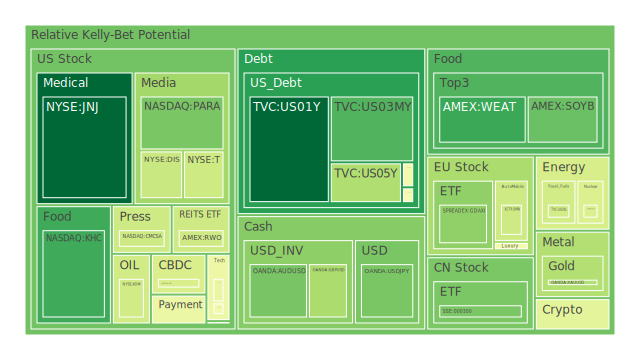
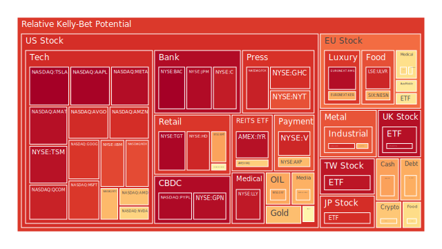
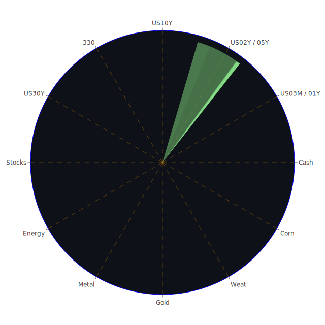

# 一、「資訊航母表格」的三位一體思維（文字化闡述）

在開始進行投資商品泡沫分析前，先闡述「空間（Spatial）、時間（Temporal）、概念（Conceptional）」三位一體的思維。此思維源自於我們在面對市場資訊量龐大且分散的情況下，往往需要同時兼顧市場的橫向維度（空間）、縱向維度（時間）以及抽象的理論推演維度（概念），才能較為全面且客觀地理解市場狀態，也更能洞察投資者行為與各類資產之間的互動關係。

1. **空間面（Spatial）**  
   - 主要指市場在地理或區域上的分布情況與不同市場之間的交互影響。包括各國的政策、各產業的佈局、各公司及投資人之間的資金流向等。從經濟學角度可考量不同國家貨幣政策之差異與國際資金流動規模；社會學則探討不同地區投資人情緒與文化如何影響市場；心理學面則評估投資人當地對風險的容忍度與跟風行為；博弈論則觀察各大機構與各國政府在「全球資金遊戲」中的策略選擇。

2. **時間面（Temporal）**  
   - 關注市場動態隨時間演進的週期、趨勢與關鍵事件的歷史脈絡。經濟學的商業循環、利率週期、財政與貨幣政策的時滯都屬此範疇；社會學可探究長期市場氣氛如何累積演變；心理學則關心資金信心或恐慌的「慣性」或「破滅點」；博弈論能夠提供對投資人於不同階段可能的對策推演（例如當市場長期上漲後，短線擊潰的誘因或經理人是否會獲利了結）。

3. **概念面（Conceptional）**  
   - 在較為抽象的理論或假設層次中思索：既有的經濟理論如效率市場假說、行為金融學對泡沫與市場失靈的解釋；社會學對群體動員與媒體影響的剖析；心理學對非理性繁榮與風險選擇偏誤的探究；以及博弈論中的「合作—背叛」等策略態度。此乃「看不見但卻能決定市場運行的神經網絡」，往往通過媒體消息、投資論壇、社交平台上的互動與情緒擴散而浮現。  

基於上述三個層次，每當我們加入新訊息或新聞事件，都可用「正反合」的簡練思路：先蒐集「正面、負面、以及雙方融合」的綜合評價，觀察市場的潛在自我修正機制或結構性扭曲。此思維將在本報告的各部分中反覆運用。

---

# 二、投資商品泡沫分析

以下針對各資產類別，從已知的價格（PP100代表當日現價）、泡沫風險分數（D1為當日、D7為七日平均、D14為兩週平均、D30為月平均）以及新聞消息面等資訊做初步闡述。由於文字較為冗長，僅以重點式描述，並引入部分新聞內容與歷史類似情況，說明該資產可能面臨的風險與機會。

## （1）美國國債
近期1年期與2年期、5年期、美債30年期利率都顯示出不同幅度的波動，根據最新數據，1年期與2年期殖利率在4%上下，而30年期則在4.8%以上，長天期與短天期之間的利差較過去歷史階段呈現持續收斂或偶爾再度出現倒掛。新聞面則見到美國政府在國債流通量上有「US Treasury total circulation」處於相對低點，但「US Treasury circulation held by FED、Public、Foreigners」都在高水準；再加上美國債務對GDP比重持續上升，暗示潛在的政治與財政角力也在加劇。  
過去在2008年金融海嘯或2020年疫情爆發期，都曾出現「資金湧向美債避險，殖利率走低」的現象。如今雖然FED的鷹派言論顯示可能維持較高的政策利率，但市場上對經濟放緩與風險事件的擔憂，仍在某些情況下令長天期債券受到追捧。若後續經濟成長數據持續走弱，美債也許仍是一個防禦性標的，唯其泡沫風險不算太高，但利率調整帶來的價格波動仍值得留意。

## （2）美國零售股（如WMT、TGT等）
從新聞可見零售業某些子板塊發生裁員或賣場關店，如亞馬遜關閉加拿大部分倉庫，引發對零售需求的疑慮。WMT（PP100約93上下）及TGT（PP100約137上下）各自的泡沫風險指標逐日、週期甚至月周期都有逐漸走高趨勢，尤其TGT在最新一日顯示D1已高達0.983以上。  
歷史上看來，零售股在經濟衰退預期下，雖然有時被視為必需品消費的相對穩定象徵，但若消費者信心大幅減弱、通膨壓力高漲，亦可能讓零售業獲利惡化。再者，新聞中對政治動盪（例如特朗普頻繁介入貨幣、貿易問題）也會對進出口成本構成衝擊。零售業一旦囤貨與需求不匹配，也會暴露財務風險。由於TGT泡沫風險分數相對偏高，投資人須留意其修正風險。

## （3）美國科技股（如GOOG、AAPL、MSFT、AMZN 等）
科技巨頭通常在市場情緒樂觀時常被追捧。根據最新風險數據，AAPL的D1約0.990以上，AMZN在0.906上下，GOOG約0.892至0.939之間，MSFT約0.889至0.935左右，整體看來泡沫分數普遍偏高。新聞面則提到大規模裁員在年初仍在繼續，顯示需求端或成本壓力有一定變數。  
在「疫情後」以及「AI科技大浪潮」裡，科技股走出一波強勁反彈，但市場對估值的挑戰也逐漸增溫。回顧2000年科網泡沫時期，企業的高市盈率與過度樂觀預期最終導致大幅回調。若FED維持緊縮路線且貸款成本升高，對科技類企業研發資金、併購與成長預期都可能帶來壓力。短線上，個別股票也會受益於AI、資料中心等需求增長（如SK海力士、Nvidia供應鏈的新聞）支撐，但整體評價偏高可能引發波段修正。

## （4）美國房地產指數或REITs（如RWO、VNQ、IYR 等）
RWO、VNQ、IYR等REITs指標近來的PP100在43、90至95上下，對應的日泡沫風險分數約0.39至0.96之間。最新數據顯示IYR的D1接近0.96以上，VNQ在0.64上下，RWO約0.40。整體呈現較分歧的泡沫風險。有些投資人認為REITs具備穩定配息特性，可在利率高檔期間分散股票波動，但在利率持續高企與商業地產融資困難下，部分房地產相關資產仍有壓力。  
對比2008年金融海嘯與2020年疫情初期的歷史，一旦租金收入受到衰退或遠距辦公趨勢的衝擊，商用不動產的空置率與貸款違約率將顯著升高。新聞中亦提到Commercial Real Estate Delinquent處於相對高位，需嚴防該類資產的信用風險。

## （5）加密貨幣（如BTCUSD、ETHUSD、DOGEUSD 等）
比特幣現報約10萬美元上下（PP100約103800至106000），泡沫分數在0.52至0.65之間；ETH在3000出頭（約0.46至0.50風險分數），DOGE約0.35美元上下（0.53至0.69風險分數）。整體雖沒有在峰值時那般誇張，但仍不可忽視風險。新聞中可見特朗普對所謂「meme coin」的支持與批評交錯，加密市場一度受到政策面與監管層面衝擊。  
歷史上比特幣曾多次經歷大起大落，2017-2018年牛轉熊的經驗，2021年經歷長牛後至2022年大幅回落等。業內人士指出若美國監管收緊，再度引發交易所退市或資金外逃，短線將有波動。博弈論觀點下，加密市場對「做多—做空」之間的籌碼對決極度敏感，當流動性資金縮減或交易所出現信任危機時，價格下探的速度往往快於大多數傳統市場。

## （6）金、銀、銅
黃金（XAUUSD約2740-2755）泡沫分數於0.34至0.40區間；白銀（XAGUSD約30.4-30.9）則在0.77至0.91以上，銅（COPPER約4.3上下）0.50-0.69左右。歷史上在經濟衰退或通膨疑慮期間，黃金作為避險資產需求上升，而銀與銅除了避險屬性外，也深度受工業需求影響。新聞中「GOLD OIL RATIO」在37以上，明顯高於前一年水準，暗示黃金相對原油價格有一定昂貴度。  
以博弈論思維，黃金是全球央行和大資金在風險時期的「通用對沖工具」；若實質利率長期上行，黃金可能面臨短暫調整；白銀與銅則更受製造業週期波動影響。銀與銅近年也在新能源與電子領域需求中扮演關鍵角色，一旦綠能或AI數據中心建設走強，銀、銅可能獲得長線支撐。

## （7）黃豆 / 小麥 / 玉米
對應資金主要觀察到WEAT、SOYB、CORN等ETF價格。新聞顯示巴西對中國部分黃豆出口遭暫停或檢疫卡關，亦有因天候與政治動盪造成的供給變動。有力學者預測極端天氣可能改變主要農產品的產量。從泡沫風險看，WEAT約0.16-0.31之間屬中度；SOYB與CORN在0.51-0.61左右。  
歷史上農產品價格也常受到貨幣政策及地緣政治等衝擊，例如1970年代的糧食危機，以及2012年美國乾旱期。不過若全球供需結構瞬間失衡，農產品價格容易出現快速上漲，故此處仍需警惕可能的價格波動風險。

## （8）石油 / 鈾期貨（UX!）
石油（USOIL約74-75）泡沫風險在0.34-0.48之間。近期新聞中提到冷颼颼的冬季使用煤和油的依賴度上升，美國也曾透過戰略儲備介入市場，但整體需求與OPEC產量政策都會影響油價走勢。鈾期貨（UX1!約73上下）泡沫分數則在0.39-0.50之間，長期看核能需求或許因AI數據中心與減碳議題而提高，新聞中也指出部分核能股飆漲，顯示資金對核能領域有正面想像空間。  
歷史上石油常於地緣衝突和OPEC談判階段劇烈波動，比如1973年石油危機、1990年海灣戰爭等。鈾市場歷來波動幅度較小眾但也相對劇烈，2007年鈾價曾短期飆破135美元/磅，接著急跌。投資人要留意此類資產對政策與非經濟因素的高度敏感性。

## （9）各國外匯市場（如EURUSD、GBPUSD、USDJPY、AUDUSD 等）
根據資料，EURUSD約1.04上下，GBPUSD約1.23上下，USDJPY約155-156，AUDUSD約0.63。新聞中多次提及特朗普與聯準會之間的爭議，包括要求降息、批評匯率政策等；此往往造成外匯市場短暫波動。  
歷史上強勢美元或弱勢美元對各國資本流動有重大影響。例如1985年廣場協議後美元貶值、90年代初期英鎊退出ERM等經典案例，都說明政策干預與國際博弈對匯率的塑造力。若特朗普繼續向FED施壓，美國利率或通膨等變化，將改變美元強弱走勢，其他貨幣的對應調整也不容小覷。

## （10）各國大盤指數（如TW50、FTSE、GDAXI、FCHI等）
TWSE:0050接近200上下，泡沫風險0.90-0.94之間屬於高檔；FTSE則約8500-8600，泡沫風險亦高達0.91-0.97；德國GDAXI約21000-21400之間，風險值約0.54-0.69不等；法國FCHI約7800上下，風險值大概0.50-0.58。市場對全球景氣的預期若持續分歧，股指也會大幅波動。  
參考歷史，歐洲股市在2011年歐債危機及2022年歐洲能源危機時出現過急跌；英國FTSE則受脫歐、通脹、政治不確定影響走勢震盪。亞洲市場對全球需求的敏感度高，也面臨晶片與電子產品的周期影響。

## （11）美國半導體股（如NVDA、INTC、AMD、MU、AMAT、KLAC等）
NVDA、AMD、MU、INTC等均出現在新聞焦點中，像是SK海力士在AI內存需求旺盛下獲利增加、三星也推出AI手機等，都激發市場對半導體股的興趣。但風險數據顯示NVDA、AMD和TSLA等高飛的成長股，其泡沫風險值在0.64-0.85之間，甚至AMD、MU、KLAC等可達0.70-0.73以上，AMAT也超過0.96，顯示非常高的估值壓力。  
2000年網路泡沫時，半導體股曾經出現過與下游需求脫節的炒作現象。若AI需求無法如市場預期般爆炸式擴張，也可能使得晶片或伺服器產能過剩。再者，報告中也指出日本、韓國等地對全球半導體市況有影響力。一旦政治或貿易摩擦升溫，也會造成半導體產業鏈重新洗牌。

## （12）美國銀行股（JPM、BAC、C等）
JPM、BAC、C等近來的泡沫風險較高，根據資料顯示，JPM約0.96-0.97、BAC達到0.99以上，C約0.93-0.94。新聞提到某些地區中小銀行面臨公債收益率上升的壓力，導致資本成本提升與潛在債券投資浮虧擴大。區域性銀行也受制於存款外流或獲利壓縮。  
歷史上銀行常在經濟週期末段爆發資產負債表問題，如2008年雷曼兄弟事件、2023年矽谷銀行危機。雖今時已提升監管，但若利率高居不下，加上商業地產及信用卡違約率攀高，銀行資產品質仍有惡化風險，建議留意。

## （13）美國軍工股（NOC、LMT、RTX等）
NOC、LMT、RTX在報告中的泡沫分數約0.48-0.55。中東、歐洲等地緣衝突頻傳，但同時也有新聞提到預算可能微調或政治力干預。歷史上軍工股往往在衝突升溫或政府追加軍費時走揚，如1990年海灣戰爭與之後的多次軍事行動。若地緣政治再度緊繃，軍工板塊仍具防禦特性，惟也須觀察國防預算走向。

## （14）美國電子支付股（V、MA、PYPL等）
V、MA、PYPL等支付龍頭泡沫風險皆偏高。V約0.91-0.94，MA約0.66-0.91，PYPL也高達0.96-0.97以上。數位支付於疫情及後疫情時代迅猛成長，帶動股價飆漲；但一旦消費步調趨緩或競爭對手（包含加密支付）崛起，會使估值面臨挑戰。  
以社會學與心理學角度看，消費者對電子支付的習慣日漸深化，但行為金融學告訴我們：資本市場對成長股的預估常傾向過度樂觀。一旦面臨財報不如預期，就會引發獲利了結或調整。需警惕可能的價格修正。

## （15）美國藥商股（LLY、MRK、JNJ 等）
LLY、MRK、JNJ在疫情後仍維持高市值，LLY在0.85-0.90、MRK約0.50-0.59、JNJ比較低約0.03-0.18（根據最新數據顯示）。LLY近年因減重藥與糖尿病藥等需求快速攀升，帶動股價猛漲，但也對估值提出挑戰；新聞報導顯示部分大藥廠對未來新藥線的審批速度及市場飽和度抱持謹慎樂觀。回顧2015-2016年的生技股狂飆行情後，2017年出現過一波整體修正。投資人應注意某些單一產品失利或競爭對手技術突破可能帶來的衝擊。

## （16）美國影視股（DIS、PARA、FOX、NFLX等）
DIS約108-111間，風險值約0.52-0.67；PARA約10.4-10.8間，風險值約0.25-0.38；FOX約45-46間，風險值則在0.77-0.93；NFLX約953-991，風險值高達0.70-0.97。新聞指出Netflix訂閱戶強勁增長並調漲價格，多家券商給予樂觀評價；但同時也有關於Disney整體影視業務的憂慮、及裁員計畫的不確定因素。  
歷史上媒體娛樂公司具備「內容決定勝負」的特性。一旦有爆款影視或體育轉播權利，股價會出現正向推力；但同時也受整體廣告景氣或競爭對手介入（例如亞馬遜、蘋果）影響。

## （17）美國媒體股（NYT、CMCSA 等）
NYT約52-53美元上下，泡沫風險約0.50-0.71之間；CMCSA約36-37美元，約0.39-0.44風險。媒體業受到數位轉型的衝擊已久，加上廣告市場動能可能減弱。但某些傳統媒體也因訂閱制或數位擴張找到新成長空間，需視各公司策略而定。

## （18）石油防禦股（如XOM、OXY等）
XOM在109-111美元，風險約0.63-0.74，OXY約50美元，風險約0.67上下。雖然全球對再生能源的需求與轉型努力在加速，但當下的能源消費仍高度仰賴化石燃料。石油股通常兼具股利收益和短期油價波動風險。若國際原油價格反彈，石油股能有一波上漲，但若OPEC增產、需求萎縮或地緣政治轉變，亦能使之承受壓力。

## （19）金礦防禦股（如RGLD、GOLD等）
RGLD約139-140，風險值約0.45-0.67不等。當金價上行時，金礦股往往有槓桿效應，但其開採成本與地緣風險亦不可輕忽。歷史上的黃金牛市常帶動金礦股數倍漲幅，但也易隨金價大幅回調。  

## （20）歐洲奢侈品股（如MC、KER、RMS 等）
MC約699-720，風險值約0.44-0.50；KER約245-248，風險0.63-0.70；RMS約2562-2646，風險0.66-0.96間。近年中國消費力對奢侈品影響關鍵。若中國經濟復甦放緩或地緣政治上升風險，奢侈品銷售將受衝擊。2020年疫情衝擊旅遊零售，當時亦曾顯示奢侈品牌業績急跌。但回彈後股價也常創高，顯示奢侈品消費的「剛性」與「象徵性地位」並存。

## （21）歐洲汽車股（如BMW、MBG等）
BMW約77-78歐元，風險0.45-0.54；MBG約55-56歐元，風險約0.50-0.66。新聞有提到德國經濟面臨能源成本、出口放緩等問題；另外電動車轉型壓力也在升溫，需投入巨大研發費用。2008-2009年金融危機曾重創歐洲車廠，2020年疫情初期亦讓銷量暴跌。但若全球需求回暖或中國市場解禁，亦能帶動股價反彈。  

## （22）歐美食品股（如KHC、NESN、KO等）
KHC約29美元上下，NESN約74-75瑞郎，KO約61-62美元。風險值則在0.17-0.50不等，KHC近期D1約0.17-0.55之間波動大，NESN約0.47-0.69，KO約0.50上下。食品飲料類往往具備防禦屬性，若通膨上漲、經濟下滑時，需求端仍相對穩健，不過也會面臨原物料與運輸成本上揚的利潤壓力。參照1970年代的通膨高峰期，食品股也曾出現短暫回落後大漲的走勢。

---

# 三、宏觀經濟傳導路徑分析

基於上述資產狀態，我們綜合以下幾點宏觀傳導路徑：

1. **貨幣與利率**  
   - FED現階段雖然仍維持鷹派立場，OIS FED Fund Rate近期在4.48上下，有跡象顯示去年高達5%以上的預期已回落。這對整體市場所謂「資金水位」的影響重大。若FED進一步放緩或暗示轉鴿，成長型資產如科技股、半導體、加密貨幣可能迎來新一波資金潮；反之，若FED維持高利率更久，銀行股和高槓桿企業有壓力，泡沫風險高的股份將首當其衝。

2. **財政與政治角力**  
   - 新聞顯示特朗普對降息與對抗通膨有強烈意志，並提出5000億美元對AI等基礎建設投資的政治宣示，一旦正式落地或促成基建計畫，傳統產業與AI供應鏈會有利好。但也可能造成政府赤字繼續擴大，促進通膨上行。地緣政治上，如中美貿易與地緣衝突加劇，都會影響石油、金屬等價格與企業供應鏈決策，形成商品與通膨互動，牽動整體市場評價。

3. **地緣衝突與原物料**  
   - 中東衝突、歐洲能源政策不確定性等，可能再度推升油價或天然氣價格。若衝突升級，軍工股與貴金屬或有避險需求上揚；若達到和解，則部分風險資產更有上漲空間。

4. **消費與就業**  
   - 匯集新聞可知零售、科技與部分金融機構仍在裁員或關店，表明就業市場開始分化。若失業率攀升或消費意願低迷，零售、服務業將進一步受挫，傳導到企業獲利下降與房地產租金壓力，再回饋到金融體系。

---

# 四、微觀經濟傳導路徑分析

1. **企業資本支出**  
   - 半導體與科技巨頭的資本支出減少，會直接衝擊設備供應鏈（AMAT、KLAC等），間接影響區域性生產與就業；但若AI浪潮持續並落地，該產業鏈可獲得大力推進。

2. **信用與槓桿**  
   - 若公司融資成本因利率高企而上升，可能削弱企業併購與回購股票的慾望，部分企業也會評估是否發債或發新股籌資。銀行在風險資產比重過高時會緊縮放貸。這將在微觀層面抑制部分企業的發展與盈餘增長。

3. **消費動能**  
   - 不同收入階層與地區的消費行為出現分化。中產與低收入群體若受到物價、房貸利率或就業不穩定打擊，消費會急劇萎縮，使零售、餐飲、旅遊業出現獲利壓力。高端消費（如奢侈品）部分，則還需看中國與中東等新興富裕階層的消費需求是否能持續。

---

# 五、資產類別間傳導路徑分析

1. **股債跷跷板**  
   - 傳統上，若股市明顯回落，市場資金將往國債或黃金等避險標的集中，造成股市資金流失、債券價格上升；反之亦然。當前美債殖利率在4%以上區間，吸引力不小，但若之後出現經濟放緩跡象且FED暗示轉向，則長債價格可能繼續上漲（殖利率下跌）。

2. **通膨與商品互動**  
   - 通膨若升溫，投資人會擁抱黃金、白銀或某些原物料；但若經濟衰退，工業金屬（銅、銀）需求將受壓抑。這之間形成一個複雜的反饋機制，取決於消費與投資端對未來利率與景氣的判斷。

3. **股—匯—債三角關係**  
   - 當美元走強，資金或將流出其他新興市場股市、債市；若美元走弱，美股評價可能攀升，但同時新興市場會吸引資金回流。現階段新聞指出特朗普仍希望美元走弱、利率降低，以提振製造與出口，但FED獨立性仍是變數。

4. **科技與能源間聯動**  
   - AI伺服器與數據中心需要穩定能源。若核能與火力發電供應不足，電價上漲，將推升科技業成本。此亦影響公共事業股與能源股的定位。  

---

# 六、根據三位一體觀點之風險對沖與投資組合機會

基於「空間—時間—概念」三位一體的縱橫比較，並考量各資產泡沫風險指標、新聞對情緒的影響、以及前述正反合的綜合平衡，我們可嘗試找出相位盡量滿足120度、相關係數約-0.5的配置組合。以空間層面來看，我們希望資產分散在不同地區、不同產業；在時間層面，希望能兼具短中期對沖與長期成長潛力；在概念層面，結合避險（防禦性）與成長（AI、綠能、軍工）以及穩定收益的思維。

以下以文字形式，提供若干「理想化」的對沖組合機會概要（不形成表格但分條羅列）：

1. **美國長債 vs. 半導體指數 vs. 貴金屬**  
   - 此組合利用長債對沖股市下行、同時抓住半導體對AI需求的波段機會，並用黃金或銀避險通膨。歷史經驗顯示，半導體與貴金屬在景氣輪動時的相關度相對不高，而債券在緊縮或衰退預期時有避險功能。

2. **歐洲奢侈品 vs. 美國零售防禦股 vs. 加密貨幣**  
   - 透過奢侈品（需求受富裕族群支撐）與美國零售必需品（經濟下行時，民生需求仍在）作一定程度的相反操作，並以加密貨幣加入高風險高報酬的對沖因子。相關度在歷史數據中不算高，但需留意加密市場的高波動。

3. **石油或油氣股 vs. 公用事業或再生能源 vs. 美元現金部位**  
   - 這組合希望利用能源股在通膨時期的抗跌特性，公用事業與再生能源在政策激勵下的中長期成長，並預留部分美元現金以防禦短期震盪並捕捉機會。  

---

# 七、對上述資產組合之篩選假設與潛在漣漪效應傳導

1. **篩選假設**  
   - 從「正反合」的角度，我們先假設未來半年內FED利率可能維持在4%-5%之間，不會急速降息也不會快速上調。此時成長股估值壓力不容小覷，但AI題材若持續火熱，資金可能繼續進入NVDA、AMD、TSLA之類標的，而使短線泡沫風險更上一層。  
   - 同時假設地緣衝突維持中度緊繃，不至於全面爆發，但也不會快速和解。石油價格或在70-80美元波動，核能話題也增添UX!期貨的長線想像空間。

2. **漣漪效應與傳導路徑**  
   - 若美國科技泡沫遭遇獲利不及預期，可能先波及半導體與高增長公司，進一步傳導到Nasdaq大盤回落，然後帶動全球科技板塊的資金減少；  
   - 若加密市場再度爆發監管危機或流動性事件，會有大量資金蒸發，同時衝擊部分金融機構持有的加密資產部位，進而擴及區域銀行信心；  
   - 若通膨仍居高不下，但FED遲遲不降息，能源與貴金屬或再次變得搶手，債市殖利率可能在通膨預期與衰退憂慮之間擺盪。  

透過兩兩相互驗證與大膽假設，我們可得結論：市場現階段的變數眾多，任何單一類資產都不宜過度集中，必須多元化，並時刻關注地緣政治與宏觀數據。

---

# 八、投資建議

此處，我們依照「穩健」、「成長」、「高風險」三種配置策略，分別提出各自的三個子投資項目並給出比例（總合為100%），以對應當前環境可能的最優化策略。

## （A）穩健配置：佔總資產 40%

1. **美國長期國債**（約15%）  
   - 雖然利率仍高，但若未來有經濟衰退跡象，長債價格可能受資金青睞。  
2. **大型防禦型股票**（如JNJ、MRK 或部分公用事業股）（約15%）  
   - 這些產業相對不易受到景氣波動，醫藥或公用事業較能維持穩定配息與獲利。  
3. **黃金**（實體或金礦股RGLD 等）（約10%）  
   - 作為通膨與地緣衝突可能升溫的對沖工具，並兼顧避險。

## （B）成長配置：佔總資產 40%

1. **半導體或AI供應鏈**（如AMD、NVDA、KLAC等）（約15%）  
   - 因AI與自動化浪潮仍被市場視為長線成長趨勢，但需警惕高泡沫指數。  
2. **奢侈品龍頭**（如MC、KER、RMS等）（約10%）  
   - 高端需求在全球富裕階層仍具支撐力，尤其中國、印度與中東購買力；若全球衰退加劇則此比例宜調低。  
3. **再生能源或核能概念**（如UX! 或核能股相關ETF）（約15%）  
   - 長期趨勢向上，且各國減碳目標可能帶動新一輪基建投資，需評估短期波動。

## （C）高風險配置：佔總資產 20%

1. **加密貨幣龍頭**（BTC或ETH）（約7%）  
   - 具高度波動性，但若市場流動性恢復，可能有顯著漲幅。注意監管風險與交易所信用。  
2. **高槓桿成長股**（如TSLA、AMZN、NFLX等）（約7%）  
   - 在大盤偏樂觀時或財報表現良好時有爆發力，但也最易回調。  
3. **新興市場股票或ETF**（例如某些亞洲或拉美國家）（約6%）  
   - 若美元走弱、新興市場資金回流，這類投資可望提供較高報酬，風險亦高。

在此三類合計100%的配置中，核心思維在於：穩健防禦（40%）確保下檔與對沖通膨，成長（40%）把握AI、奢侈品與新能源長期紅利，高風險（20%）適度參與加密與高飛股之機會。

---

# 九、風險提示

投資有風險，市場總是充滿不確定性。本報告基於當前資訊與大膽假設進行推演，僅供參考，不構成投資建議。下列風險務必謹慎留意：

1. **泡沫風險高的投資警告**  
   - 如上文所示，部分科技股與區塊鏈資產的泡沫指數（D1、D7、D14、D30）屢屢超過0.9，代表估值極度昂貴且容易因利空消息出現深度回調。  
2. **地緣政治與政策變動**  
   - 如果特朗普或其他主要國家領導人發布強烈政策（制裁、關稅、利率干預等），將對市場情緒造成巨大衝擊。中東、歐洲或其他地區的衝突升溫亦將干擾能源與糧食市場。  
3. **全球經濟衰退或信貸緊縮**  
   - 若市場對未來經濟前景從「軟著陸」轉為「深度衰退」預期，不論是股票、企業債、甚至部分原物料都可能同步下跌。  
4. **金融系統性風險**  
   - 地方銀行在利率上行期間可能產生投資組合虧損或存款流失；若信用卡或房地產貸款違約率持續攀升，也恐觸發金融業再度動盪。  
5. **流動性風險**  
   - 若FED縮表加速或國際資本轉向，使得市場資金面迅速收緊，高槓桿標的將面臨拋售壓力。加密貨幣與小型科技股首當其衝。  

投資人應根據自身的風險承受能力與投資目標，做出獨立決策。本報告提供的結論與觀點，並非保證獲利之依據，也無法預測所有潛在變數。建議隨時關注市場動態與宏觀指標（就業數據、CPI、PPI、GDP增速、企業財報、央行會議紀要等），並在必要時調整投資組合配置，避免單一風險過度集中。

 
Daily Buy Map:

 
Daily Sell Map:

 
Daily Radar Chart:

 
