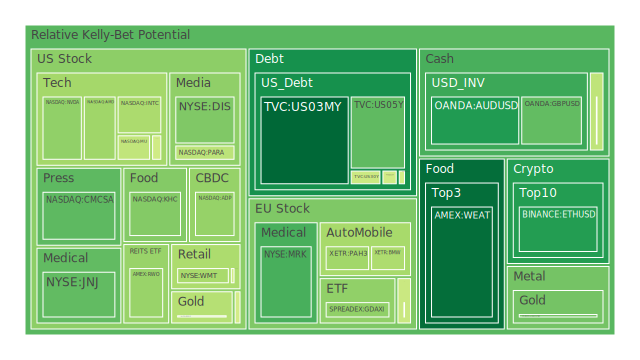
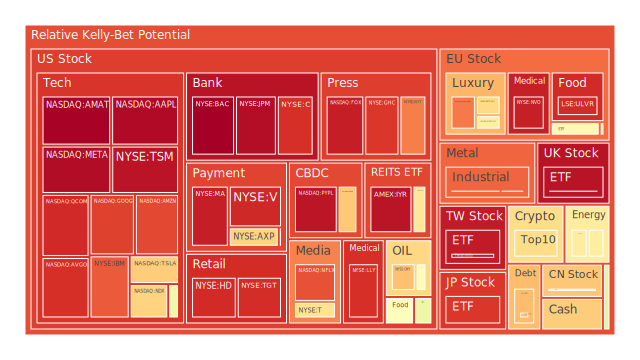
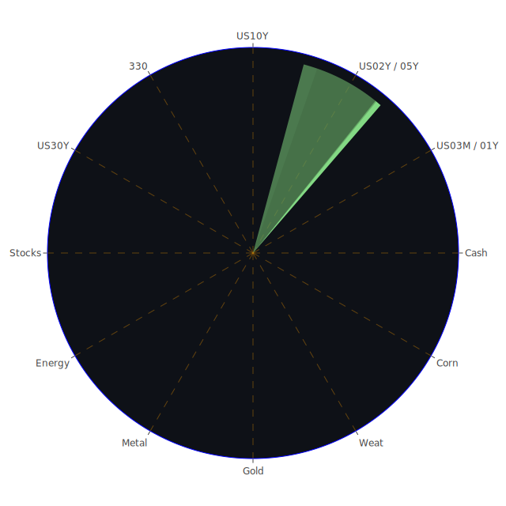

以下報告為一份綜合多面向觀點的分析，力求在經濟學、社會學、心理學與博弈論等不同領域提出大膽假設，但同時保持客觀、理性與謹慎。本報告從空間（Spatial）、時間（Temporal）與概念（Conceptional）三面向進行「市場與新聞的三位一體」解讀，並嘗試在三位一體的正反合中，探尋最少文字與最大涵義的結論。文末將進一步整合各種資產間的風險對沖與配置建議。整體行文採敘述與論說文方式呈現，並融合近期新聞與歷史相似場景的參考，以供投資人從多角度思考。

由於市場千變萬化，凡此種種分析僅供參考。任何投資決策，都需要投資人根據自身風險承受能力與投資目標，做出獨立判斷。市場永遠可能走向出乎意料之處，投資需警慎前行，切勿忽視任何潛在的泡沫風險。

---

# 資訊航母三位一體之空間(Spatial)、時間(Temporal)、概念(Conceptional)大膽假設與綜合

1. **空間面(Spatial)**  
   - **經濟學角度**：地區性經濟復甦與政治動盪同時存在，南韓第四季經濟成長率乏力，凸顯政治危機對內需的打擊；反觀美國仍在調整貨幣政策。空間上的差異使各國大盤指數在本週表現顯著分化，例如000300（中國）相對穩定，但JPN225（日本）、GDAXI（德國）、FTSE（英國）等面臨貨幣與地緣政治等不同壓力。  
   - **社會學角度**：全球化下，勞工流動及移民議題在多國新聞中出現，如紐西蘭人口外流、德國境內攻擊事件及其他社會動盪，都可能引發民眾對就業與生活成本的憂慮。社會動盪帶來消費心態轉變，影響零售、旅遊、娛樂產業情緒，例如DIS、PARA、NFLX等影視股也可能遭受不同程度市場觀感波動。  
   - **心理學角度**：新聞中的負面情緒（如政治危機、罷工、財源縮減、黑客攻擊等）在市場中容易引發投資者出脫高風險部位，從而流向相對安全的資產。也有些正面新聞（如AI需求擴大、企業收益優於預期）催化了對科技股的需求，形成投資者在避險與成長中拉扯的心態。  
   - **博弈論角度**：各國政府的經貿政策、企業財報與市場消息，如特朗普政府對多項政策的喊話，都可能激起不同市場主體的對策回應。此時國際貿易談判與內部政治壓力相互影響，空間分布的博弈不斷改寫各國金融市場結構。  

2. **時間面(Temporal)**  
   - **經濟學角度**：美國在利率、國債殖利率走勢與房市數據上的變化，帶有明顯的短中長期不同調性。短期內，因聯準會（FED）仍發表鷹派或維持高利率的基調，市場對美國國債的需求與殖利率變動充滿反覆。中期來看，許多新聞顯示企業的罷工與裁員（如美國科技公司與航空業），或見到歐洲市場疫情後的生產轉移，時間軸的推進將持續考驗供應鏈與就業市場。長期則著眼於全球貨幣政策最終回歸常態化的演進，以及美國國債殖利率曲線是否將徹底翻轉。  
   - **社會學角度**：隨著時間推進，社會衝擊的累積效應慢慢顯現在房市、銀行信用、消費習慣上。例如房市“90年代以來最弱銷量”對國內居民產生信心缺口，也在中長期傷害房地產類REITs如RWO、VNQ、IYR。這些變化不會一蹴可幾，而是隨著消費者信心與貸款利率的演變逐步顯現。  
   - **心理學角度**：投資者在面對一連串裁員、經濟衰退數據或政治動盪時，短期容易焦慮，群體行為傾向拋售高風險標的；中長期若企業營收或技術創新趨勢依然持續，市場可能又回頭補票。這種時間滯後的心理週期，往往先是避險情緒提升，再隨數據好轉逐漸回暖。  
   - **博弈論角度**：市場參與者並非僅因數據面當下的變化就立即行動，有時也會基於對未來政策的預期而進行布局。短期“鷹派言論”會壓抑資產價格，但若市場預計未來幾個月後政策鬆動，中期便有可能積極進場卡位，呈現出典型的博弈拉鋸。  

3. **概念面(Conceptional)**  
   - **經濟學角度**：從“三位一體”的概念面來看，各種資產如股票、債券、大宗商品、外匯和加密貨幣，都在需求與供給、通脹與利率、貨幣寬鬆或緊縮等大環境下呈現正反合的演進。例如近期新聞顯示各國對AI基礎建設投注新資源，推動科技股如NVDA、MSFT的熱潮，但也伴隨通脹與利率風險的暗潮。  
   - **社會學角度**：概念上，資訊傳遞的速度因媒體與網路加快，恐慌或亢奮都容易被放大。人們對新聞片面訊息的過度解讀，往往導致資產價格短期暴漲暴跌。當資本市場逐漸回歸理性後，才出現第二波的合理訂價。  
   - **心理學角度**：市場投資者在面對概念性題材（如AI、元宇宙、能源轉型）時，常有過度想像的傾向，但遇到經濟逆風或政治風險時，又會放大壞消息。這種心理起伏的概念融合到價格走勢，容易催生泡沫或急跌。  
   - **博弈論角度**：概念層面下，各國政府與企業在新技術或新市場上角力，往往涉及政策與補貼。各式正式或非正式的談判，都可能導致未來走向大異其趣。對投資人而言，需同時關注政策風向與市場結構，因為概念面能迅速形成投資熱點，也能瞬間退燒。  

4. **三位一體正反合的精煉結論**  
   - **正面（ Thesis ）**：AI與數位科技持續強勁，高階晶片、雲端需求因生成式AI應用爆發，對科技股帶來長線支持。部分能源與金屬在供需缺口下仍有支撐，如石油因寒流或地緣危機呈現短期供應吃緊、金銀銅在新能源產業擴張下具備一定需求支柱。  
   - **反面（ Antithesis ）**：政治動盪與高利率環境持續壓抑一些高槓桿企業或新創，若全球需求疲軟，利率偏高將進一步拖累消費與房市；若地緣衝突持續或某些國家政策不穩，將干擾供應鏈與資本流向。  
   - **合（ Synthesis ）**：在此正反交互的行情下，投資人須慎防短期波動與泡沫風險，也要看清長期成長故事的基礎。適度分散資產於不同區域與不同型態的標的，並持續更新對社會心理、政策博弈等面向的評估，以實現相對均衡與合理的佈局。  

---

# 投資商品泡沫分析

以下針對各資產類別，綜合前述三位一體（空間、時間、概念）觀點，並援引部分新聞事件觀察以及歷史場景參照，闡述現狀與風險。文中偶爾會參考“當日現價PP100”以及D1/D7/D14/D30泡沫指數（風險越高表示市場更可能處於過熱或過度槓桿），以提供大致走勢輪廓。

## 美國國債
近期美國短天期（US03MY、US02Y、US01Y）到長天期（US10Y、US30Y）的殖利率全面處於4%以上區間，根據最新資料顯示US10Y維持在4.62左右，US30Y在4.84附近，曲線雖略微陡化但仍有倒掛壓力緩解的跡象。新聞面顯示川普政府持續強調降低利率，但目前聯準會有多次鷹派言論，市場對未來實際降息時點仍存分歧。從歷史角度觀察，20世紀80年代曾見過利率高企，但隨後經濟衰退並逼迫政策轉向。本輪若短期政治博弈不能迅速結束或通脹反覆，美國國債收益率可能維持高檔，波動加劇。  
- **泡沫風險**：相對較低，但殖利率上揚之際，債券價格仍具回調風險。D1/D7/D14/D30都在中性偏低區域，顯示國債市場雖有波動，但並未積累大規模泡沫。

## 美國零售股
美國零售股如WMT、TGT、COST、HD與T等在新聞中常與就業、消費信心、市場流動性高度連動。近期有關房市銷售下滑、新增失業和裁員消息，對零售端多少構成壓力。WMT雖屬必需消費類型，但根據D1/D7顯示其風險指數升高。TGT亦陷入比較高的泡沫預警區域。回顧2008年金融危機期間，零售業因緊縮與消費疲弱曾出現股價重挫，當下雖未必完全類似，但高利率與通脹的影響不可小覷。  
- **泡沫風險**：中度偏高，尤其TGT的D1已超過0.92，意味短線追高風險頗高，需留意消費需求若持續走弱，零售股下修空間恐不小。

## 美國科技股
近期科技股持續在AI題材下發燙。MSFT雖有部分獲利回吐，D1已升至0.55以上，但整體市場對其AI服務仍相對看好。NVDA則在先前大幅衝高後，目前D1約在0.39-0.63間震盪，短期籌碼有鬆動，可能出現獲利了結。AAPL在新一輪硬體更新和宏觀壓力下，出現了開年以來最差的走勢。GOOG、META在廣告收益回暖及AI布局上仍具動能，但高風險因子依舊顯著，如META的D1約在0.97之上，顯示泡沫評價頗高。對照2000年網路泡沫，科技股的高估值常在利率上行周期面臨挑戰，須防資金撤離。  
- **泡沫風險**：高，尤其如META、GOOG等近期D1、D7、D14均顯示接近飽和，若市場對AI題材的預期過度樂觀，可能隨宏觀逆風而急轉直下。

## 美國房地產指數
RWO、VNQ、IYR等房地產相關ETF近期受高利率與房屋銷售大幅下滑打擊。新聞顯示2024全年美國房市銷售量降至90年代以來最低，兼之利率攀升，房貸壓力大增。回顧2008年，美國房地產泡沫破裂造成金融危機，此次風險不一定同等規模，但仍不容忽視。高利率環境下，若市場交易量持續萎縮，房地產抵押貸款延滯率攀高，將成為房地產ETF進一步下修的誘因。  
- **泡沫風險**：中度，隨著D1、D7指數均偏高，需提防借貸違約率提升帶來的下行風險。

## 加密貨幣
BTCUSD、ETHUSD、DOGEUSD等近期維持較高波動。BTCUSD雖徘徊在10萬美元左右，D1約0.64附近，市場動能不算過熱，但也難言穩定。ETHUSD則受AI應用帶動的Layer 2熱潮影響，短線有些上衝，但D1仍維持在0.26-0.48區間間浮動，有一定投機空間。DOGEUSD屬於情緒性投資，更易受社群言論或市場狂熱影響。歷史上，加密貨幣大漲大跌屢見不鮮，如2017年、2021年均有驚人漲勢後跟隨嚴重回調的先例。  
- **泡沫風險**：中度偏高，波動巨大，須慎防政策監管、市場流動性收緊帶來的深度修正。

## 金/銀/銅
XAUUSD、XAGUSD與COPPER一向是避險或工業需求的重要風向標。新聞面顯示全球地緣政治不穩，高通脹壓力下，金價有一定支撐，XAUUSD現價大約2760-2770區間，D1約0.35-0.37之間，尚不算極端。銀與銅同屬工業金屬，一方面受新能源與高階製造拉動，一方面受全球經濟放緩、需求緩降影響。近來COPPER短線震盪，因中國需求不及預期，但美國建設與新能源發展或能抵銷部分衰退風險。  
- **泡沫風險**：金中度，銀與銅中度到中低度。金屬類整體尚未達極端泡沫，但需留意地緣政治與宏觀經濟走勢牽動需求。

## 黃豆 / 小麥 / 玉米
WEAT、SOYB、CORN等農產品ETF或相關期貨皆與氣候、地緣政治以及出口政策緊密相連。近期新聞提及某些巴西與中國之間的檢疫爭端，引起黃豆、玉米供應端的關注。全球極端天氣也可能造成產量不穩。歷史上，農產品期貨常因天候、政治等突發事件而大漲大跌。  
- **泡沫風險**：農產品波動度本就較高，D1在0.18-0.54不等（具體依品項有差），須防止氣候或地緣變數引爆的短線大漲，但整體長期泡沫風險相對其他高成長股較低。

## 石油 / 鈾期貨UX!
USOIL曾受寒流需求升溫、部分地緣衝突與減產協議支持，但近來新聞顯示油價周線轉跌，並在政治角力中劇烈波動。鈾期貨UX1!則因AI與資料中心帶動電力需求升高，核能股反而活躍，利多帶動，但必須警惕政治與安全層面的不確定性。歷史上，油價與核能往往在危機時期各有表現，無法一概而論。  
- **泡沫風險**：石油中度，易被政治發言或庫存數據迅速影響。鈾期貨因市場較小，波動更劇烈，一旦情緒狂熱即可迅速上衝，也容易在轉風後重挫。

## 各國外匯市場
AUDUSD、GBPUSD、EURUSD、USDJPY等主要貨幣對，近期因通脹與利率政策而波動。美國利率水位居高不下，美元指數的走強走弱皆在新聞面佔據焦點。日圓USDJPY一度衝上155-156，顯示日本投資人重金買入海外資產，造成日圓持續承壓。歐元EURUSD維持1.04-1.05附近震盪，英鎊GBPUSD上到1.25水平，但英國國內仍面臨經濟緊縮問題。  
- **泡沫風險**：外匯市場主要是匯率波動，而非典型的「泡沫」。若美國繼續維持高利率，其他貨幣仍易受壓。需要密切關注政府政策動向。

## 各國大盤指數
包含000300（中國）、GDAXI（德國）、FTSE（英國）、FCHI（法國）、JPN225（日本）、0050（台灣）與NDX（美國納斯達克100）等。亞洲市場受貿易衰退疑慮與地緣政治影響，歐洲則因能源危機後的經濟調整，美國因加息週期未明朗化，使大盤指數皆呈現多空交雜。歷史上大盤在全球景氣下行時常同步回落，當前若各國無力短期刺激成長，風險可能逐漸發酵。  
- **泡沫風險**：NDX近年來飆漲較多，D1已超過0.68，處於中高風險區。歐洲與亞洲指數相對而言估值稍低，但也有結構性風險要素。

## 美國半導體股
NVDA、AMD、MU、QCOM、KLAC、AMAT、TSM、INTC等在AI浪潮推動下備受追捧，但新聞指出晶片產能調度與中美科技戰角力猶在延燒。NVDA曾大漲，如今D1落到約0.39-0.63之間，顯示短線籌碼易鬆動。MU、QCOM在手機與伺服器市場的需求存在不確定，KLAC、AMAT等設備廠也受景氣循環衝擊。歷史有2000年科網泡沫與2021年晶片缺貨大漲的先例，短期利好不代表長期無隱憂。  
- **泡沫風險**：半導體股屬成長股集中區，D1普遍較高（0.40以上），謹防高位震盪。

## 美國銀行股
BAC、JPM、C、COF、GPN、AXP等。利率提高雖令銀行淨息差擴大，但壞賬風險及監管壓力也隨之升高。新聞面提到部分地區銀行裁員，以及區域銀行受到公債殖利率壓力衝擊，顯示市場對銀行股存在擔憂。回溯2008年金融危機時期，銀行業因不良債務遭重創；本次情況雖不一定重演，但壞帳比率上升或可能衝擊獲利。  
- **泡沫風險**：銀行股看似估值不高，但若經濟下行風險累積，金融風暴引爆時脫手不易。D1多在0.90上下，值得警惕。

## 美國軍工股
LMT、NOC、RTX等軍工企業收益通常與地緣衝突或國防預算成長相關。新聞顯示某些地區衝突與武器需求上升，但也面臨國內財政壓力及政治干擾。歷史上，如2003年伊拉克戰爭前後曾帶動軍工股一波漲幅，但之後若政治風向改變、預算有限，軍工股也會出現周期性回調。  
- **泡沫風險**：中度。D1約0.49-0.55之間，有一定支撐，但若全球局勢轉好或預算縮減，也可能回落。

## 美國電子支付股
PYPL、V、MA等在電商交易成長、行動支付普及的推動下長期看俏。近期新聞顯示特朗普政府要求降息、降低成本，且AI對支付平台安全與交易效率或有新的應用空間。歷史上電子支付仍在增長趨勢，但估值常年高企，若宏觀經濟放緩，交易量同步走低時，股價也易受衝擊。  
- **泡沫風險**：中偏高。D1可達0.96（PYPL）、0.92（V）、0.94（MA）等水準，若市場資金緊縮，漲勢不易持續。

## 美國藥商股
LLY、MRK、JNJ、NVO皆屬醫藥健康產業龍頭。新聞提到JNJ風險指數D1維持相對低檔，顯示市場認為它較具防禦性；LLY正受新藥管線與肥胖藥題材加持，D1頗高，表示投資者對其預期相當樂觀，也需當心被炒作過度。歷史上，藥廠股常被視為逆勢成長標的，但仍須防研發風險或政策干預。  
- **泡沫風險**：中度。LLY、NVO泡沫風險高於JNJ與MRK，需要留意估值修正。

## 美國影視股
PARA、NFLX、DIS、FOX、CMCSA。流媒體競爭激烈，新聞提到NFLX用戶成長再度強勁，股價創高，但也有機會遇到成長放緩的隱憂。DIS在樂園與串流服務持續投入資金，但面臨市場對其財務結構的疑慮。歷史上，傳統影視於產業轉型期常面臨獲利不穩的挑戰，流媒體熱潮亦曾反覆。  
- **泡沫風險**：中度偏高。NFLX D1約0.86-0.97間，屬高風險區，DIS則約0.37-0.58間，顯示流動籌碼多空分歧。

## 美國媒體股
GHC、NYT等傳統媒體在數位轉型過程中，從新聞付費訂閱到新媒體佈局，都面臨盈利模式的考驗。NYT D1約0.81上下，反映市場對其長期轉型存在懷疑。回顧傳統報紙與出版產業的數位化轉型史，成功者仍有可觀利潤，但失敗者市場佔有率衰退速度也很快。  
- **泡沫風險**：偏中，須持續觀察訂閱成長與廣告收入走向。

## 石油防禦股
XOM、OXY等緊扣能源價格。新聞面顯示川普對OPEC減產與油價的喊話，以及經濟衰退對需求的衝擊，使油價上上下下。能源股常伴隨高殖利率、穩定現金流，但若油價再度大跌，獲利會受到明顯侵蝕。歷史上，如2014年油價腰斬時，能源股相繼重挫。  
- **泡沫風險**：中度。XOM D1約0.59-0.74，OXY約0.67-0.72，上漲空間可期但同時風險加大。

## 金礦防禦股
RGLD等金礦公司在金價上升時有助獲利，但須考量開採成本與政治風險。有些礦藏位於政局不穩地區，對供應中斷或成本激增的風險不容小覷。歷史上，金礦股波動幅度往往超越金價本身，暴漲與暴跌頻率較高。  
- **泡沫風險**：中度，和金價高度連動，屬避險概念股的一環，但籌碼易受市場情緒放大的影響。

## 歐洲奢侈品股
MC、RMS、KER、ULVR、NESN、BMW、MBG、PAH3等。歐洲奢侈品向來仰賴中國、北美消費者支出。新聞顯示中國經濟復甦力道不如預期，以及全球政經不穩定都可能影響高端消費。回顧2008年金融風暴或2015年亞太經濟放緩，奢侈品需求都曾大幅縮減。  
- **泡沫風險**：偏中或中偏高，RMS、KER D1接近0.70-0.81，宜提防全球消費情緒的轉折。

## 歐洲汽車股
BMW、MBG為德系車的重要指標。德國經濟受到能源價格、政治局勢與出口市場波動影響，新車需求放緩或轉向電動車的結構性變革都在衝擊傳統車廠。歷史上車廠於技術轉型期（內燃機到電動）往往股價波動劇烈。  
- **泡沫風險**：中度，D1約0.43-0.51，並不極端，但長線轉型不確定性仍高。

## 歐美食品股
KHC、KO、NESN等。必需消費板塊通常具防禦性，但新聞顯示部分企業面臨成本上漲與需求萎縮的兩難。KHC的D1近來波動不斷，由於食品需求相對穩定，但利潤空間易受通膨侵蝕，企業籌碼移動也相對頻繁。  
- **泡沫風險**：中到中高。KHC上週風險還在0.55以上，必需消費雖有防禦力，但非絕對安全。

---

# 宏觀經濟傳導路徑分析

1. **利率與貨幣政策傳導**：聯準會在高通脹、就業市場與金融穩定之間拉扯，若利率長期偏高，可能壓抑房市消費。長端國債利率4.8%以上易使企業融資成本升高，引發庫存減少與資本開支縮減。  
2. **國際貿易與地緣政治傳導**：政治危機消息遍布新聞，如南韓、巴西與中國的貿易糾紛、歐洲能源問題等，都在全球供應鏈環環相扣下發生連鎖效應。  
3. **匯率與資本流動傳導**：美國利率居高不下，吸引全球資金湧入美元資產，使新興市場貨幣承壓；然而若出現對衰退的預期或政治風向轉變，又會帶動避險情緒轉向黃金或國債市場。  

---

# 微觀經濟傳導路徑分析

1. **企業研發與成本結構**：不論是AI需求帶動的科技股，或受供應鏈干擾的製造業，微觀層面的生產成本、研究投入、裁員或招募，都會在財報中逐漸體現，進而影響股價與市場預期。  
2. **消費者信心與就業**：勞工罷工、企業解雇或政治動盪會引發消費需求下滑，進而打擊零售、娛樂、旅遊等行業，使營收預期走弱，也牽動銀行逾放比率上升。  
3. **公司財報與資產配置**：企業短期財報優劣往往引爆股價大幅波動，長期則要看獲利成長的穩定度。例如科技公司即使短期裁員財報優化，但若中長期需求疲軟，估值仍可能不保。

---

# 資產類別間傳導路徑分析

1. **股票與債券**：當利率走高、債券殖利率吸引力提升，部分資金可能流出高估值成長股，導致股市回調；若經濟擔憂加劇，市場可能轉投避險資產如國債與黃金。  
2. **商品與匯率**：原物料價格上漲時，進口依賴國的貨幣可能承壓；若一國貨幣走弱，則本國企業出口競爭力上升，但也擠壓進口利潤。  
3. **加密貨幣與傳統市場**：當流動性寬鬆、風險偏好高時，加密貨幣表現常呈爆發；反之若金融環境緊縮，資金容易撤離該市場，影響其他高風險資產走勢。  

---

# 投資建議

以下將以穩健、成長、高風險三類做建議，各類內再選出三項資產並給出比例分配。三大類合計為100%。

## 1. 穩健配置 (40%)
- **美國國債**(US10Y或其他中長期)：佔比15%。在高利率環境下，長債價格較有下跌風險，然而若未來經濟衰退，殖利率也可能走低、價格上漲，以防禦性來看仍具意義。  
- **金價(XAUUSD)**：佔比15%。歷史上黃金在不確定性升溫時常發揮避險功能，雖非絕對保值，但適合作為波動市場的分散。  
- **必需消費股(KO或類似食品飲料龍頭)**：佔比10%。屬防禦性標的，雖有通脹成本壓力，但人們對此類消費需求較穩定。

## 2. 成長配置 (30%)
- **美國科技股(MSFT、GOOG或同類)**：佔比10%。AI應用擴張下，部分龍頭仍具中長期成長潛力，需留意估值過高風險。  
- **半導體龍頭(NVDA或TSM)**：佔比10%。著眼於AI、資料中心長期趨勢，但短期已有高估嫌疑，需嚴控部位。  
- **醫藥成長股(LLY或NVO)**：佔比10%。在新藥與全球健康需求上行支撐下，長期可期；但部分公司評價偏高，要嚴防泡沫化。

## 3. 高風險配置 (30%)
- **加密貨幣(BTCUSD或ETHUSD)**：佔比10%。高波動下可提供超額報酬機會，但監管風險與市場情緒變化劇烈，須謹慎。  
- **軍工股(LMT或NOC)**：佔比10%。地緣衝突存在機率下，防衛支出相對穩定，但政治與預算變數也大。  
- **石油股(XOM或OXY)**：佔比10%。能源需求在寒冬或政治干預下波動大，短線可能大漲，但若經濟衰退，油價或重挫。

上述配置只是一種示範性框架，所有投資人仍須依資金規模、風險偏好、投資期限與稅務規劃等進行調整。

---

# 風險提示

投資有風險，市場總是充滿不確定性。本報告所提之觀點與假設，皆基於目前公開消息與歷史經驗，並不構成任何個別投資行動的建議或保證。若市場出現無法預料之重大變化，包含但不限於政治衝突、重大災變、政策急轉、流動性斷裂等，任何資產價格都可能大幅波動。

- **泡沫風險**：許多資產在D1、D7、D14、D30的指數上顯示較高分數，如TGT、META、GOOG、PYPL等，意味高估或泡沫化疑慮。投資人應多留意估值合理性與市場擁擠度。  
- **地緣風險**：新聞顯示多國政治動盪與軍事衝突威脅，這會影響能源、原物料與避險資產，需隨時關注。  
- **政策風險**：川普政府多項經濟與外交政策可能出現突然轉彎，特別是利率、關稅、企業監管等層面，都會在短期內帶來市場衝擊。  
- **宏觀風險**：經濟下行、債務上限問題、企業獲利下滑皆可能連鎖反應。若個人槓桿或投資組合缺乏對沖，損失風險將被放大。  

在此再次強調，本報告僅為多元化參考之用，不應視為投資建議的最終定論。投資者應結合自我研究與專業建議，量力而行，並維持對市場的持續關注與學習。在波動的全球市場，理性與靈活布局乃求生之本，盲目追高或拋售極易招致重大損失。審慎評估與分散布局方能在潛在泡沫中保全資金，或於風險對沖中捕捉適當的機會。祝投資順利。

 
Daily Buy Map:

 
Daily Sell Map:

 
Daily Radar Chart:

 
