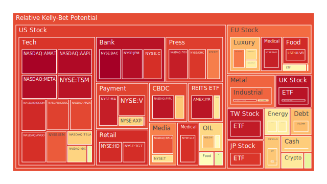

# 投資商品泡沫分析

在以下各資產分析中，將嘗試從經濟學、社會學、心理學、博弈論等角度，融合空間（Spatial）、時間（Temporal）與概念（Conceptional）三種層次進行闡述，並綜合近期新聞與歷史上的類似場景，歸納可能的風險或機會。同時也會參考近期泡沫分數（D1、D7、D14、D30）觀察其風險正逐漸增溫或稍有降溫，並搭配新聞事件給投資人一些參考視角。

---

## 美國國債

在過去十年當中，美國國債一直是全球資金的重要避風港。然而，根據最新資料，短年期國債（例如2Y、3M）與長年期國債（10Y、30Y）的殖利率結構存在一定程度的倒掛或貼近倒掛風險。依據2025-01-26的觀察數據：  
- 美國1Y殖利率約4.17%，比去年同期的5.35%顯著下降；  
- 美國2Y殖利率約4.26%，亦低於去年同期4.90%；  
- 美國10Y殖利率約4.62%，30Y則約4.84%。  

殖利率曲線看似逐漸趨向正常，但仍有部分期間利差處於偏低或倒掛邊緣，且新聞面顯示美國政府對於利率政策、通膨走勢及地緣政治事件均存在高度敏感度。近期新聞有提及「Trump將要求馬上降息」、「預期通膨可能再度升溫」等負面與正面雜訊交織。這些雜訊反映了投資人對未來利率方向的分歧，而市場心理學層面上，對防禦性的資產需求仍然強烈，因此短期對美國國債的泡沫疑慮相對較低。然而，長期來看，若美國政府財政赤字規模再度擴大，市場可能會擔憂債信評級下調或利率快速上行。博弈論上，各大中央銀行與投資機構都可能在主權債上採取“騎牆”策略：既不願意過度拋售、也無意過度增持。

觀察近期泡沫分數，3M、1Y等短年期的D1大多維持在0.17 - 0.49區間左右，風險分數並不高，顯示市場尚將之視為相對安全的資金停泊地。對於利率急劇升降的擔憂主要體現在「政策轉折的預期」，而新聞中例如「BlackRock表示通膨可能推動殖利率至20年新高」等，會使長期債券價格面臨波動。若市場出現系統性危機，還是會看到資金回流美國國債，但長期收益率可能出現急速變動。

---

## 美國零售股

美國零售股如WMT（沃爾瑪）、TGT（Target）等，一直作為衡量美國消費力道的指標。根據最新泡沫分數，TGT的D1已來到約0.92-0.98之間，顯示該類零售股的風險分數極高。近期新聞顯示Target因「結束DEI計畫」而遭受負面評價；另一則訊息指出有多家大型零售商面臨黑客事件，或因市場需求疲弱而調整未來獲利預測，對於零售板塊產生負面衝擊。社會學層面來看，消費者信心因通膨率、就業情況或政治因素而受影響；若通膨遲遲無法明顯下行、甚至捲土重來，將沖擊可支配所得，零售股恐會有更多獲利壓力。

從心理學的角度看，前期在疫情後期出現的「報復性消費」已逐漸趨緩；而且新聞多次提及美國出現裁員風潮，例如CNN、BP、Meta、Microsoft等大廠相繼裁員，這不免讓民眾對未來經濟前景更加不安，更可能壓抑消費需求。而博弈論上，大多數零售商現階段選擇「降價促銷」或「壓縮成本」來保住市場份額，但此策略容易引發競爭者跟進，整個產業獲利可能同步受到侵蝕，這種良性or惡性競爭仍有待觀察。歷史上，如2008年金融海嘯時的零售業也曾經歷成本壓力與消費衰退的雙重打擊。以空間層次(Spatial)來看，若地緣政治事件在美國本土以外區域升溫，可能一度出現對美國內需的短暫保護，但最終仍視整體經濟環境而定。

---

## 美國科技股

觀察如AAPL（蘋果）、MSFT（微軟）、GOOG（谷歌）、AMZN（亞馬遜）、META（臉書）、NVDA（輝達）等為代表的大型科技類股，最新的泡沫分數顯示部分標的D1已突破0.9甚至接近1.0，如特斯拉TSLA約0.99、微軟MSFT約0.55-0.88區間、谷歌GOOG約0.89-0.93不等。特斯拉特別明顯，D1來到0.995599，顯示其短期風險極高且具有泡沫化疑慮。這在過去幾年時常出現：市場對於電動車和高增長科技股的追捧在經濟寬鬆時期一再推升估值，而只要有任何利率上揚或政治逆風，都會讓該類股急跌。

近期新聞顯示，科技巨頭對於AI的投資熱度依舊高漲；然而同時也面對「國際監管壓力」，包括歐盟就隱私與反壟斷議題加強管制，以及美國國內針對大型科技公司也開始有更多限制之聲。社會情緒上仍然存在對「AI革命能否帶來長期產能提升」的樂觀想像。心理學層面上，投資人極易對「高成長科技」產生樂觀預期並低估風險；歷史上如2000年科網泡沫曾證明市場對新技術的過度投機並不可持續。目前博弈論角度觀察，若各家科技大廠互相競逐AI研發，就算技術有巨大突破，也可能在短期內因競爭或法規而削弱利潤。再者，最新新聞指出Google正嘗試遊說全球各國政府接受AI發展，但反遭到各國議會質疑。若全球景氣反轉或政治環境劇變，高風險的本質便會顯現。

---

## 美國房地產指數

以VNQ等房地產ETF或RWO等國際房地產ETF為代表，根據最新泡沫分數，VNQ的D1約在0.64-0.65左右，RWO約0.39-0.40區間，似乎並非整體房地產都已接近極端泡沫。然而新聞顯示保險公司開始出現“拒保HOA”的情況，甚至對公寓市場採取更保守態度，隱含美國住宅和商用不動產在高利率環境下依舊承壓。近期「Insurers are dropping HOAs」這類負面新聞帶來恐慌，代表火災、極端天候損害等風險正在攀升。此外，若房貸利率長期維持在6.95%-7%上下，將持續讓購房需求降溫。

從時間面(Temporal)的歷史鏡鑑來看，2007～2008年房市泡沫崩盤帶來慘重衝擊，不僅影響銀行體系，也動搖了投資人對房地產長期的信心。如今雖然大部分銀行資本充足率和風控都比當年強，但若經濟出現實質衰退或就業大幅下滑，抵押貸款的違約風險依舊會開始累積。心理學層面上，已購房者往往對價格下跌的訊息十分敏感，當市場情緒過度悲觀時，拋售或斷頭會加劇下跌壓力。而博弈論上，建商、業主、貸款銀行在利率走勢與需求放緩的環境下，互相會有押注與談判博弈：建商或許會放慢施工，銀行可能壓縮貸款規模，進一步影響供應與需求。雖然目前泡沫分數未顯示極端危險，但不排除未來隨著經濟放緩或升息周期又起，房地產指數會再度經歷較大幅度的修正。

---

## 加密貨幣

以BTC、ETH、DOGE為代表，目前BTC（比特幣）價格一度突破十萬美元大關（最新約在105k美元上下），而ETH（以太幣）約在3300多美元水準，DOGE約0.34～0.35美元上下。泡沫分數方面，BTC的D1約0.64，DOGE為0.43或0.69不等，ETH接近0.26～0.48區間。看似相較前兩年大牛市時期，整體熱度雖有回升，但泡沫分數尚未像2021年那樣衝到0.9以上。

然而，在新聞面上可以看到不少加密相關的正面與負面交織：正面如「AI驅動下對區塊鏈需求再起」，負面如部分國家對加密管制越趨嚴格，以及大型交易所或支付公司削減數位資產相關業務。歷史上，加密貨幣經常受到政策與市場流動性的雙重影響，若美聯儲重新收緊流動性，易引爆高波動的加密資產拋售潮。在心理層面，加密市場投資人往往具備「恐慌快速」、「貪婪也猛烈」的特徵，短期間市場情緒易被突發事件翻轉。博弈論角度則顯示，如果各國央行對央行數位貨幣（CBDC）加快研究並祭出更嚴厲的管制，加密貨幣也可能面臨外部競爭壓力。空間層次(Spatial)而言，部分國家或地區（例如南美洲）在通膨環境下積極擁抱加密資產以對抗法幣貶值，反觀已開發國家則出現更嚴格的稅務與洗錢審查，因此整體需求呈現區域性差異。

---

## 金／銀／銅

貴金屬中，黃金與白銀在通膨高漲或地緣政治局勢不穩時常被視為避險工具；銅則更具有工業金屬的屬性，通常與全球經濟景氣高度正相關。最新泡沫分數顯示黃金XAUUSD約在0.35-0.39上下，白銀XAGUSD約在0.91-0.92一帶，銅在0.69-0.70附近。這表示白銀相較黃金更可能處於投機熱潮（或供需失衡）之中。新聞中提及：「US power firms crank up dirty fuel use to fight cold snap」，在寒潮中雖然需要更多電力，但對白銀（光伏產業需求）或銅（電線電纜需求）等短期影響要再觀察。歷史上，金銀常在地緣衝突或金融市場大震盪時攀升，但若情勢忽然出現和緩，投機資金也會迅速離場。

心理層面，很多投資人視貴金屬為終極避險，因此若市場對衰退、戰事或政治動盪的恐慌升溫，金銀需求可能同步上升。然而泡沫風險也就此醞釀，尤其若消息平息或通膨真正受控，金銀又會高檔回落。對銅而言，經濟學上銅被視為「Doctor Copper」，若全球製造業出現明顯反彈、基建擴張或AI伺服器需求大增，銅價可獲支撐；但反之，一旦需求不及預期，銅價將面臨較大波動。從博弈論看，大宗商品交易商、礦商、投機基金之間常有拉鋸，使價格波動週期較難預測。

---

## 黃豆 / 小麥 / 玉米

農產品近期受極端氣候干擾，多地出現洪水或乾旱新聞，例如洛杉磯山火與雨水帶來農作物損失；國際上巴西、阿根廷等主要糧食輸出國，也面臨氣候不穩定問題。新聞指出，糧食折射出經濟與政治的結合：若地緣爭端導致航運受阻或禁運，價格會急漲。根據泡沫分數，黃豆（SOYB）短期風險約在0.51，玉米（CORN）約0.54～0.60，小麥（WEAT）在0.17～0.18區間較低。看起來小麥在近期並沒有進入明顯的投機泡沫狀態，然而若氣候變化突然加劇，小麥可能瞬間飆升。

歷史上，如2007～2008年全球糧食危機時，黃豆與小麥期貨大漲也伴隨政治不穩因素。就心理學而言，糧食價格上漲會引發民眾通膨預期，而政府則會壓制糧價或農業補貼。博弈論上，主要糧食出口國與進口國之間的博弈時常牽動市場情緒，小規模禁運或關稅也能擾動國際糧價。空間面(Spatial)則顯示一些地區受益於氣候條件或農業技術改進，能在供給端形成區域優勢；而其他地區供給萎縮，國際價格因區域差異化而更加震盪。

---

## 石油 / 鈾期貨UX!

石油OIL在近年供需兩頭受多因素干擾：主要產油國的協同減產、地緣政治衝突、需求端疫情後的恢復程度等。近期美國頁岩油產量回升，但OPEC+策略性調控產量，因此WTI或Brent價格較難大幅回落。從新聞面看：「Regional Banks Face Headache From Rising Treasury Yields」，雖然此與石油並非直接相關，但若利率上升過快，可能壓抑整體經濟活動與石油需求。就泡沫分數而言，石油大約維持在0.40-0.63區間，顯示投機性雖有抬頭但未至於瘋狂。

至於鈾期貨UX!則常與「核能產業」與「地緣政治」高度關聯。新聞中提到多國希望發展核電以因應AI巨量算力與全球電力需求提升，利多鈾礦與核能概念股。泡沫分數方面，UX1!約在0.42～0.63左右，暫時不算太高。但鈾的價格波動往往與安全疑慮或國際核協議、地緣對立掛鉤。歷史上，2011年日本福島核災導致核能投資一度大幅撤離；但近幾年因減碳需求，核能又重獲青睞。若軍事衝突波及核電廠或核供應鏈，短期將產生劇烈動盪。心理層面，民眾對核能存在「害怕又需要」的矛盾，博弈論上各國對核能立場也差異巨大，投資需小心政治與社會風向。

---

## 各國外匯市場

主要關注美元、歐元、英鎊、日圓、澳元等。2025-01-26數據顯示：  
- AUDUSD約0.63，泡沫分數0.26-0.39；  
- GBPUSD約1.25，風險分數約0.33-0.41；  
- EURUSD約1.05，風險分數0.69左右；  
- USDJPY則約156上下，短期風險約0.46-0.56。  

美元指數先前曾因美國強勢升息走高，但近期川普政府再次表態「可能干預市場」或以關稅方式管理匯率，引發市場對美元政策干預的擔憂。新聞面也出現「Trump欲全面運用關稅權力，暫時按兵不動」的訊息。若美國再次實施保護主義政策，可能在博弈論上引發他國報復性關稅，打擊全球貿易，進而影響匯率走勢。

歐元方面，歐盟面臨能源轉型與對大型科技公司監管的挑戰，利率政策相對趨於保守。英鎊則常受到英國脫歐後遺症與通膨壓力影響。日圓在全球風險資產波動時常被視為避險，但日本央行寬鬆政策也使日圓利率長期維持超低水準，匯率較易受到外部事件衝擊，近期官方亦試圖干預日圓過度貶值。澳元因與大宗商品出口掛鉤，受到中國需求、全球景氣循環變動影響，若中國經濟復甦力道不足，澳元也易承受賣壓。

---

## 各國大盤指數

美國NASDAQ、S&P 500、歐洲Stoxx 50、德國DAX、英國FTSE 100、中國上證指數(如000300)、法國CAC 40等。  
- NASDAQ指數(NDX)泡沫分數約0.68-0.85；  
- DAX(GDAXI)約0.39-0.66區間；  
- FTSE約0.92-0.96上下；  
- 上證300(000300)約0.25-0.70不等；  
- 法國CAC 40(FCHI)風險分數約0.54-0.60左右。  

美國科技股高估值推動NASDAQ，使NASDAQ的泡沫分數較高；FTSE則受到英國本土經濟與英鎊匯率的交互影響。新聞中出現許多負面經濟數據，如「美國零售業裁員」「歐洲奢侈品需求減緩」等，也有正面消息如「AI帶動雲端與電商發展」。歷史上，全球指數的波動常伴隨金融市場的流動性變動。若聯準會暫緩升息、甚至降息，資金仍可能回流股市推升指數；反之，若通膨再度爆發，美股也可能慘遭拋售而拖累全球。博弈論角度，各國央行之間的貨幣政策互動至關重要；當一方大幅緊縮，其他國家可能被迫跟進以維持匯率穩定。空間層次而言，歐洲與亞洲股市也會因地緣局勢、能源價格與區域經濟表現而出現分化。

---

## 美國半導體股

代表包含NVDA（輝達）、AMD（超微）、INTC（英特爾）、AMAT（應材）、KLAC（科林研發）、MU（美光）等。泡沫分數最高者如AMAT達到0.99以上，NVDA約0.39-0.70，也屬高風險區；INTC為0.68，但其基本面有復甦疑慮。新聞顯示，AI與雲端的強勁需求推升高階晶片需求，但「Texas Instruments預測疲軟」顯示部分晶片如類比晶片的需求下滑。這種半導體細分市場的分歧，說明了在經濟學中產業循環並非一體，數據中心與GPU需求旺盛，消費性電子則相對走弱。心理層面，投資人往往對半導體高景氣週期過度樂觀，但也曾在景氣反轉時遭遇重大資本支出過剩的衝擊。

歷史上，半導體產業的波動週期多與整體電子消費需求、企業資本支出計畫、地緣衝突或貿易戰中對關鍵晶片的限制等息息相關。博弈論層面，美國、中國與其他主要國家對高階製程或關鍵設備的掌控，將持續引發產業鏈重組。若國際對峙加劇，關鍵設備供應或技術斷供皆可能成為供應鏈風險。空間角度(Spatial)，各大廠的生產基地遍佈全球，任何一處地緣危機或疫情都可能造成連鎖效應。

---

## 美國銀行股

包含JPM（摩根大通）、BAC（美國銀行）、C（花旗）、COF（Capital One）等。泡沫分數顯示，BAC約0.99，C約0.91-0.94，JPM則約0.95-0.97上下。相當高的短期風險程度，說明市場對銀行業的擔憂不容小覷。根據新聞「Regional Banks Face Headache From Rising Treasury Yields」，當利率上升，銀行持有的長期債券帳面價值受損，或需面臨資本壓力。此外，新聞顯示「信用卡壞帳率上升」與「房地產違約風險」，一旦經濟減速或失業率上行，將衝擊銀行資產品質。

歷史上，銀行業一旦產生流動性或資本不足的疑慮，市場情緒會瞬間惡化並影響同業。心理層面上，存戶對銀行的信任若被動搖，容易出現擠兌或資金外流。博弈論層面，若某家銀行現金流短缺，其他銀行往往觀望或擔心連帶風險，系統性壓力就會快速累積。雖然目前美國FED對銀行監管力道較2008年後更嚴格，但「商業地產貸款逾期率飆升」之類訊號不得不防。

---

## 美國軍工股

代表為LMT（洛克希德馬丁）、NOC（諾斯洛普）、RTX（雷神）、GD等。從泡沫分數看，LMT長期維持在0.55左右，NOC也在0.48-0.54區間。新聞顯示，美國對軍事支出多次提高預算，並對外軍售活絡，短線上利多。另一方面，若國際衝突稍有緩解，軍工需求不至於大幅縮減，但增速可能放緩。歷史上，一旦爆發大型衝突，如伊拉克戰爭或地緣政治對立加劇，軍工股常得到資金關注，股價表現相對穩健。

心理學層面，軍工產業涉及政治、民族情感與國防安全，多有政府保護與長期合約，故投資人往往將之視為「特殊防禦性產業」。博弈論上，軍工企業間競標政府合約，可能會稀釋超額利潤，但只要軍費不縮減，這些企業仍能保持穩定收入。空間層次看，若全球衝突遍地開花，軍工出口亦將帶動股價需求；然而國際輿論壓力與外交政策也可能限制某些交易。

---

## 美國電子支付股

如V（Visa）、MA（Mastercard）、PYPL（PayPal）、GPN（Global Payments）等。從泡沫分數看，V約0.92-0.93，MA約0.94-0.95，PYPL 0.96-0.97，GPN也有0.70-0.86之間。可見電子支付領域熱度相當高。在歷史經驗中，電子支付業者常受益於網路消費與數位經濟成長，但若整體消費萎縮或信用卡違約率攀升，也會間接使支付交易量減少。

新聞提到「META計畫在AI上投入高達650億美元」、「大型科技公司裁員亦意味著部分消費信心減弱」，兩者對支付股有正反交織的影響。社會學角度，消費者支付習慣數位化已是長期趨勢，但也可能發生監管層面的干預，如政府對交易手續費上限作規範。博弈論而言，各大支付巨頭間在拓展跨境支付與新技術應用時存在激烈競爭，相互吞併或合作都在可能範圍。空間層次看，歐洲、亞洲等地區的本土行動支付業者興起，也對美國支付巨頭形成挑戰。

---

## 美國藥商股

如JNJ（強生）、MRK（默沙東）等。從資料看，JNJ短期泡沫分數僅約0.03-0.33左右，MRK約0.30-0.59區間，整體顯示醫藥股目前的投機熱度並不算很高。新聞提到醫療保險領域的隱憂，如「UnitedHealth遭遇駭客事件」等，可能引發部分對整體醫療產業的擔憂。另有報導指「Trump下令政府機構退回許多DEI計畫」，也可能影響醫藥公司的人事管理與業務調整。

歷史上，醫藥股通常具抗衰退、防禦性質。然而也要注意專利到期、藥價管制或大規模訴訟等風險。心理層面，投資人對新藥研發抱持熱情，但若研發失敗或法規卡關，股價也會大幅震盪。博弈論上，藥廠之間常會併購以取得研發管線或擴大市場，短期刺激股價，但長期仍須看產品真正能否商業化與擴利。

---

## 美國影視股

如DIS（迪士尼）、PARA（派拉蒙）、NFLX（網飛）等。觀察DIS泡沫分數0.37-0.58，PARA在0.25-0.45區間，NFLX則相對較高0.70-0.86。新聞指出「DIS財報表現不佳」，且現階段串流平台之間競爭激烈。PARA在近年雖嘗試擴大串流佈局，但市場份額仍有限。NFLX曾因會員成長趨緩而被拋售，但隨後在廣告營收模式與新內容加持下股價再度攀升。歷史上，影視產業常隨整體經濟週期與消費模式變化波動；DVD時代崩壞後，串流平台竄起，顯示科技演進對該產業至關重要。

心理層面，影視股在疫情期間一度享受訂閱用戶暴增紅利，但後疫情時代，觀眾回歸戶外活動、競爭者更多，成長放緩不可避免。博弈論看，各家串流平台在爭奪版權與原創內容上激烈廝殺，高成本投入或併購動作可帶來短期題材炒作，但中長期能否實現利潤仍是考驗。

---

## 美國媒體股

如FOX（福斯）、CMCSA（康卡斯特）等，媒體股與影視股雖類似，但媒體還包含新聞、廣告、電訊等多重領域。FOX目前泡沫分數約0.93-0.95，CMCSA在0.39-0.44。新聞顯示傳統媒體廣告收入下滑，轉向數位廣告成長，但又面臨Google、Meta等網路巨頭搶食。歷史上，媒體產業在新媒體興起時常面臨衝擊，2000年網路爆發、2010年後社群媒體迅速崛起，都導致傳統媒體市占率萎縮。

心理層面，投資人會關注媒體集團是否能成功轉型數位化或串流，否則收益恐持續衰退。博弈論下，各家媒體公司在議題設定與內容獨家合作上也互相角力，涵蓋政治立場、社會形象等複雜因素，對觀眾與廣告主都將有不同策略。空間層面，若在部分國家有更嚴格的新聞管制或平台稅收，該地區市場營收可能受限。

---

## 石油防禦股

如XOM（埃克森美孚）、OXY（西方石油）等。XOM泡沫分數約0.59-0.70之間，OXY約0.71-0.72，屬於中度偏高水平。石油公司常在油價高檔時獲利能力提升，但也面臨政策的碳排放限制與新能源競爭。新聞裡提到，「美國電力企業反而短期依賴更多高污染燃料來撐過寒潮」，此種現象對傳統石油企業短期是利多。歷史上，油價波動大，上漲受地緣政治刺激，下跌則常因供給過剩或需求放緩。心理上，投資人對化石燃料的前景存有長期悲觀，認為終將被綠能取代；但當前全球對石油的依存度仍高。

---

## 金礦防禦股

與金銀礦商相關，如RGLD（Royal Gold）等。RGLD泡沫分數約0.44-0.67之間，屬於正常或略偏高。金礦股可視為金價的槓桿投資，一旦金價長期走牛，金礦公司利潤上升幅度通常更大。不過，金礦股容易受礦區所在國家的政局或資本成本變動影響。新聞雖少直接報導金礦，但若市場對金價預期高漲，金礦股易被炒作。心理層面，金礦股投資人往往同時看好金價與礦業本身的合併獲利。博弈論角度，如果礦區產權受政府干預或衝突影響，則公司面臨系統性風險。

---

## 歐洲奢侈品股

如歐洲LVMH、KER（開雲集團）等。KER泡沫分數約0.68-0.81，隱含近期奢侈品需求雖仍穩，但對中國、北美等關鍵市場消費放緩的擔憂漸增。新聞顯示「中國與歐洲之間的旅遊與高端消費尚未完全恢復，歐洲經濟也面臨能源轉型壓力」。歷史上，奢侈品高度依賴全球富裕客群的需求；若地緣局勢或經濟衰退，該族群消費同樣可能縮水。心理層面，一旦社會或政治環境引發對炫富的負面看法，也可能影響奢侈品市場。博弈論而言，各大品牌互相競爭與併購，透過向新興市場擴張或跨界合作來保持增長，但也面臨假貨、海外關稅等挑戰。

---

## 歐洲汽車股

如BMW、MBG（賓士集團）、VW、STLA等。BMW泡沫分數約0.39-0.43，MBG約0.51-0.57。新聞指出「歐洲汽車產業在電動化轉型」，再加上能源成本高漲，人力成本升溫，削弱部分利潤。美國對歐洲車企關稅施壓也在不斷變動。歷史上，歐系車大多走高端品質路線，若全球消費力下滑或關稅激增，銷售很快受挫。心理層面，消費者對電動車的接受度上升，但歐系車相較特斯拉在軟體與充電網絡尚需跟進。博弈論上，歐洲車企、韓系車企、中國新勢力以及美國特斯拉之間，正進行全球市場份額的激烈搶奪。

---

## 歐美食品股

如NESN（雀巢）、KHC（卡夫亨氏）、ULVR（聯合利華）等。NESN泡沫分數約0.47-0.52，KHC約0.17-0.38，ULVR則高達0.77-0.92之間。新聞顯示部分食品公司因原料成本上漲與物流受阻，導致利潤空間壓縮，而也有公司受惠於通膨期的漲價策略而保住毛利。歷史上，食品股多具穩健防禦特性，但若經濟陷入衰退，民生消費雖相對穩定，但高檔產品或特定品牌的銷量可能下滑。心理層面，一些公司若被貼上「不健康」或「環境污染」標籤，消費者抵制也會對營收形成打擊。博弈論中，各大食品集團把持原料採購與通路優勢，如果發生糧食危機或政治衝突，供應鏈斷裂也可能造成價格劇烈波動。

---

# 宏觀經濟傳導路徑分析

在Spatial層面，地緣政治衝突與全球供應鏈阻斷最先衝擊大宗商品與原材料價格，進而波及各國通膨與貨幣政策。歐美若升息過猛或地緣對立加深，將顯著打擊全球需求。在Temporal層面，短期內FED與各國央行的政策走向至關重要；若通膨回落不及預期或地緣衝突升級，升息或緊縮政策可能延長，使金融市場動盪加重。歷史上多次證明，央行政策的延後效應往往在9-18個月後顯現。Conceptional層面，市場對「AI科技革命」、「綠能轉型」的樂觀敘事與對「高通膨復燃」、「政策不確定」的擔憂同時並存，形成正反合的矛盾。

在經濟學理論與社會學觀點看，若大多數投資人逐漸「風險趨避」，資金便流向美國國債與黃金等防禦性資產；但若市場又突然轉而相信「AI將帶動新一輪高增長」，則會迅速反手湧入科技股。這種集體情緒轉向時間常極為短暫，投資人需警惕由此引發的泡沫風險。

---

# 微觀經濟傳導路徑分析

在企業層級，利率抬升致使舉債成本增加，特別是房地產、金融、零售等資金密集或對消費敏感的產業受衝擊更大。同時，產業競爭亦會因供應鏈重新布局而加劇，企業需要投入更多資本適應新的生產與銷售模式，導致利潤壓縮。心理學層面員工對裁員消息恐慌、管理層對於資本支出縮手等，均會削弱企業成長動能。博弈論角度，各家競爭者在市場萎縮時，都有誘因採取降價或擴張宣傳搶市佔，但也可能引發價格戰，進一步拉低利潤。

---

# 資產類別間傳導路徑分析

1. **商品與貨幣互動**：大宗商品（例如石油、金屬）價格上漲通常帶動商品出口國貨幣升值，但若政治或社會不安，資金反而會流向美元避險。  
2. **股債跷跷板**：傳統上，若股市走強會分散資金離開債市；但若系統性風險升溫，債市又成為避險。近年來在超低利率環境下兩者亦曾「同漲同跌」，顯示非常態的市場結構。  
3. **金融業與房地產**：房地產危機會連帶衝擊金融機構資產品質；銀行若貸款壞帳攀升，就會削減其他產業貸款額度，連帶影響整體經濟。  
4. **科技與整體消費**：科技股能帶動市值與財富效應，一旦下跌，也會打擊消費者信心。  
5. **國際股市連動**：美國股市一旦大幅波動，往往透過國際ETF、機構資金外流的管道影響歐洲、亞洲股市。

---

# 投資建議

綜合上述三位一體的正反合觀察，投資人應考慮分散佈局並保持對各資產泡沫風險的警覺。由於新聞與歷史證明市場波動加劇，宜在配置上做風險對沖。從資產間相關係數的角度，若想追求相位差120度、相關度約-0.5，意即在不同市場與產業之間找相對對沖機制，以平衡整體組合波動。

以下提供穩健、成長、高風險三大類投資組合樣例（總和100%），並簡要說明其配置比例，期能在當前環境下提供多元機會與對沖功能。此處所謂「穩健」並不代表無風險，而是相對波動度較低；「成長」代表具有中長期潛力但仍需承擔部份市場風險；「高風險」則以波動大、泡沫分數較高的標的為主。

1. **穩健型 (40%)**  
   - 美國中短期國債(15%)：利率仍具一定吸引力，且具防禦性，能在系統性波動時提供避險。  
   - 主要黃金資產(15%)：在高通膨或地緣衝突時擁有避險功能，歷史上亦呈現與股市相對分散。  
   - 藥商股(10%)：如JNJ或MRK等基礎醫療需求穩定，具抗衰退屬性，短期泡沫分數不高。

2. **成長型 (40%)**  
   - 半導體設備/晶片龍頭(15%)：在AI與雲端需求不斷攀升的時代，此領域長期成長可期，但要謹防估值過高的短期回調風險。  
   - 歐洲奢侈品或汽車(15%)：在全球經濟復甦時，歐洲知名品牌仍具吸引力，若中國或美國消費回補可望帶動盈利。  
   - 部分加密貨幣(10%)：BTC或ETH等已具一定共識基礎，在金融機構逐漸介入後，長線可能繼續納入主流資產，但波動度仍高。

3. **高風險型 (20%)**  
   - 美國高增長科技股(10%)：如TSLA、部分雲端與AI概念股，雖短期泡沫分數極高，但若未來技術突破，股價仍有向上空間。  
   - 能源轉型相關如鈾礦或特定綠能(5%)：政治因素與社會輿論對核能需求回溫，或綠能基礎建設獲政策補貼，皆可能提供爆發性回報。  
   - 新興市場投機性ETF(5%)：在資金輪動下，新興市場股債波動大，若全球景氣復甦，短線或有高漲幅可能，但亦須防範資金快速撤出。

配置比例僅供參考，並非建議投資人必然分配到此程度。關鍵在於用不同比例，對衝各自領域的潛在風險。如此一來，有些資產在風險飆升時會下跌，但同時也可能帶動避險類資產上漲，互相抵消波動。

---

# 風險提示

1. **泡沫風險**：從上述泡沫分數可見，科技股、電子支付、部分半導體股、銀行股泡沫程度偏高。一旦利率或政策變數改變，資金大舉撤離恐造成股價急跌。  
2. **地緣政治**：新聞反覆提到衝突區域的戰事升溫、糧食與能源供應受阻等，若情勢突然惡化，恐引發連鎖反應。  
3. **利率政策轉折**：市場對美聯儲與各國央行存在期待落差，聯準會若再次升息，或若通膨突升，對高估值資產影響尤其劇烈。  
4. **流動性枯竭**：若銀行或金融體系出現流動性壓力，資產價格將面臨大面積拋售風險。2008年雷曼事件即是一例。  
5. **極端天候與自然災害**：山火、暴風雨或寒潮不斷，加上氣候變遷加劇，容易擾動農產品或保險、房地產市場，導致出乎預期的經濟衝擊。  
6. **政策不確定性**：新聞顯示美國政府有意強化關稅、逆轉DEI計畫、喊話降息等多重訊號，歐洲也面臨能源法規調整，各種政策逆轉風險不斷。

投資有風險，市場總是充滿不確定性。本報告所提建議僅供參考，投資者應根據自身的風險承受能力和投資目標，獨立判斷後再行投資。在當前市場環境下，建議維持動態調整，不要過度集中於單一領域，也要隨時留意泡沫警訊以及國際新聞變化，才能在動盪中更穩健地掌握機會。

 
Daily Buy Map:

 
Daily Sell Map:

 
Daily Radar Chart:

 
