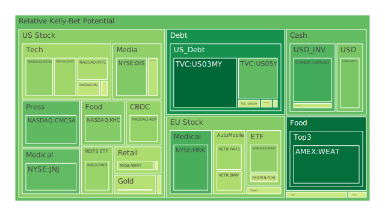
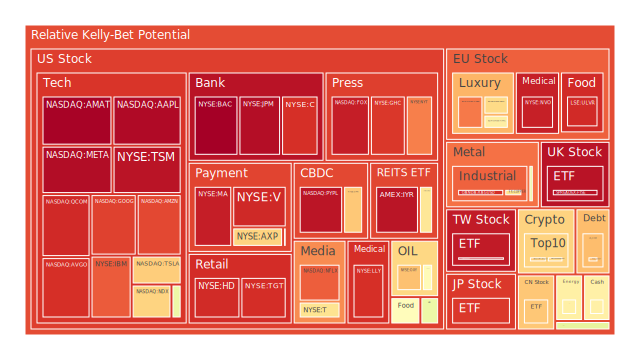
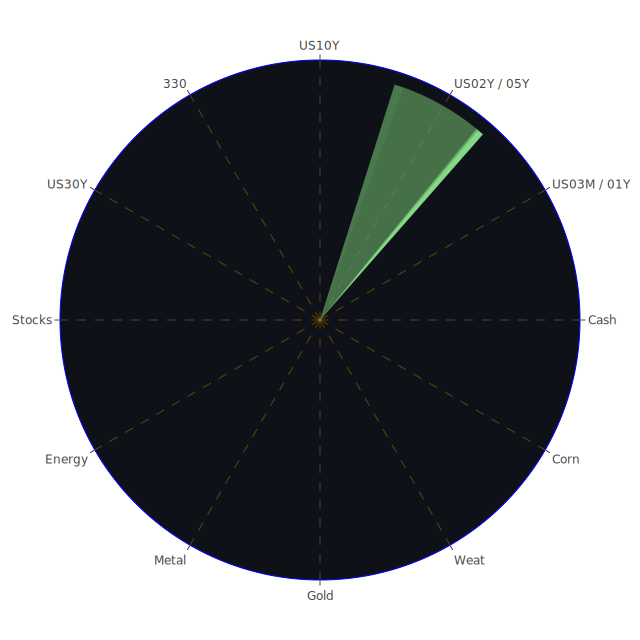

# 投資商品泡沫分析

在分析泡沫之前，先須理解本文所謂的「泡沫」風險，乃是基於部分量化指標（D1、D7、D14、D30等日平均風險分數）的觀察，以及結合近期新聞事件所反映的市場情緒。以下將就當前數據中提到的主要資產種類一一說明。值得注意的是，我們在參考這些風險分數時，會以比較長期與多元的視角綜合判斷，而非只憑單一指標。

## 美國國債（US03MY、US05Y、US10Y、US30Y、US02Y、US01Y等）
目前美國各年期國債收益率都介於4.1%到4.8%左右，其中兩年期美債（US02Y）維持在4.25-4.26之間，與1年期美債（US01Y）4.17的差距相當微小。依據D1、D7、D14、D30等泡沫指數，整體風險分數約在0.17到0.73之間不等，普遍屬於中低到中等風險。加上來自聯準會（FED）經濟關鍵數據顯示，目前RRP（逆回購）呈現下降、聯準會總資產規模相對低、BTFP相對低、貼現視窗使用率較低等，都暗示著市場流動性依然保持一定水準，同時也顯示市場對短期美債的需求未完全消退。

不過，需要留意的是，新聞中多次提到美國政府在2025年初可能面臨負債上限的政治僵局，以及由於對外部事件（如特朗普對外課徵關稅、制裁他國）造成的地緣政治壓力，都可能使美債遭遇評級風險。此外，資金若在全球大範圍流動中出現避險需求下滑，10年期和30年期長天期國債價格可能下跌，收益率上行，造成估值波動加劇。整體而言，美國國債目前雖是風險相對較低的資產，但也要警惕收益曲線斜率變化的異常情況，尤其是過去幾年多次倒掛，暗示經濟衰退風險仍可能籠罩。

## 美國零售股（WMT、TGT 等）
觀察到美國零售股，如WMT（沃爾瑪）在數據中的D1風險值約0.425，D30約0.659，呈現一定程度上升趨勢，代表市場對零售領域抱持一點疑慮。根據最新新聞顯示，部分零售商因DEI（多元、公平與包容）政策在政治環境中受到嚴峻挑戰，加上房地產市場疲軟、消費者可支配所得可能受到通膨與房貸利率高企的影響，零售業的銷售成長不如預期。特別是關於Target（TGT）相關的新聞提到，因取消部分多元與包容等方案，並且面臨社會爭議，使得公司形象陷入兩難。D1約0.920，七天至三十天平均風險值也在0.93上下，顯示泡沫分數頗高，投資者需小心評估。

## 美國科技股（NVDA、AMD、INTC、MSFT、AAPL、AMZN、GOOG、META等）
美國科技板塊近年來無論是AI概念、雲端服務或半導體需求等，都呈現高速波動。數據顯示，NVDA（NVIDIA）的D1風險約0.393，但14天與30天平均值卻高達0.63以上，顯示短線雖有修正，但中期泡沫風險並未消散。AMD、INTC同樣處於類似情況。值得一提的是MSFT（微軟）與AAPL（蘋果），在D1風險上各自超過0.55與0.98，尤其AAPL之D1近乎1.0，意味著市場對其估值可能存在較大疑慮，或者市場預期其股價已有相當高的本益比或本夢比。

新聞層面也印證了這些波動：如Google正在積極推動AI全球教育與遊說，不過同時面臨各地反壟斷與監管壓力。Meta雖不斷強調AI投資、高額資本支出，但分析師對其股價前景眾說紛紜。此外，馬斯克與特朗普維持良好互動，也可能改寫特斯拉或其他科技產業的監管環境。整體來說，科技股仍在成長浪潮上，但也需留心估值過高與政策干預等潛在風險。

## 美國房地產指數（RWO、VNQ等）
在可動用的數據中，RWO（全球房地產ETF）與VNQ（美國REITs）都表現出中高風險。RWO的D1約0.404，VNQ則達0.649以上，而且長期趨勢在0.6以上，顯示市場對房地產仍抱持謹慎。新聞面也顯示，美國住宅市場「重回1990年代量能」的警訊──意即銷售量大幅縮減，有些地區價格出現比預期更顯著的下滑。再者，近期30年期房貸固定利率已經飆升至6.96%，相較前一年只有2-3%的利率，如此巨大的利率差距對購房需求抑制作用相當明顯。此外，有部分新聞指出保險公司撤出某些地區的房屋承保，會使潛在買家卻步，亦加劇房地產市場風險。

## 加密貨幣（BTCUSD、ETHUSD、DOGEUSD 等）
加密貨幣市場表現相當躁動。ETHUSD 在前幾天出現約0.26-0.47的風險值，顯示短期波動頗大；BTCUSD 更是D1約0.64-0.69之間，說明投資人應謹慎因應可能的高位震盪。DOGEUSD（狗狗幣）更容易受到特斯拉創辦人馬斯克推文的影響，新聞透露馬斯克對DOGE態度搖擺，但依舊具備一定的炒作動能。

值得一提的是，比特幣（BTC）的「泡沫值」呈現D1和D7相對較高的狀況，短期波動顯著。歷史經驗來看，加密貨幣市場常在政治或經濟不確定性提升時吸引避險或投機資金流入，但亦常在監管趨嚴或技術黑天鵝事件爆發時，瞬間大幅回跌。隨著特朗普對外祭出關稅、制裁他國等貿易保護主義動作，若造成傳統金融市場震盪，部分資金仍有可能短暫轉向加密貨幣，但終歸此市場屬高風險領域。

## 金/銀/銅（XAUUSD、XAGUSD、COPPER等）
金價 XAUUSD 最新報價約2760-2770美元上下，D1風險在0.54以上，中長期風險分數約0.40-0.50不等，亦呈現微幅升高態勢。銀（XAGUSD）則約30美元上下，D1風險達0.92，屬相對高泡沫。銅（COPPER）在4.3美元左右，D1風險約0.66-0.69，短線風險也不低。

從宏觀角度看，金價通常被視為通膨或動盪時期的避險資產，然而當前FED雖仍維持偏緊的貨幣政策，但近期OIS FED Fund Rate自5.33大幅下滑至4.48，也產生對黃金需求的對衝力量。新聞面，地緣衝突、國際貿易爭端都刺激貴金屬需求；不過，若美國的利率繼續高檔盤旋、美元指數仍維持一定強勢，金價也不易直線飆漲。銀、銅作為工業需求金屬，更受到中美經濟表現與全球供應鏈輪動的影響。若特朗普繼續對主要金屬消費國（例如中國等）展開制裁或關稅政策，銅價可能短線承壓。

## 黃豆 / 小麥 / 玉米（SOYB、WEAT、CORN等）
根據D1與D7風險指標，WEAT（小麥）風險值略低於0.19-0.26，SOYB（黃豆）約0.51-0.50，CORN（玉米）則在0.54左右，三者都屬中等風險區間。新聞面上，農產品市場近來面臨的問題包括極端氣候、美國內部運輸成本以及地緣政治干擾（如俄烏戰爭波及全球穀物出口）等。儘管俄羅斯與烏克蘭的衝突在新聞中已淡化，但仍然潛在影響全球穀物供給。此外，阿根廷政治情勢（如Milei當選）對農業政策或對穀物出口稅等的調整，也會間接影響國際期貨行情。因此，農產品雖非市場主流的投機標的，但面對可能的多重供給或需求衝擊，其價格也存在不小波動空間。

## 石油 / 鈾期貨UX!（USOIL、UX1!）
在數據中，USOIL約74美元附近，D1為0.49-0.63之間，而UX1!（鈾期貨）D1超過0.62，亦呈現中度風險。新聞顯示，特朗普再次執政後，對美國自身能源獨立政策宣示更強，暫停了新的海上風力發電租賃，市場對化石燃料產業的監管可能相對寬鬆。此舉對石油價格或短線有支撐，但長期看仍受全球需求與地緣政治動盪影響；例如中東局勢、俄羅斯原油出口問題等，都會對油價產生顯著波動。

鈾期貨（UX1!）具有一定防禦屬性，因核能在歐美某些地區逐漸被視為清潔能源替代，需求增長預期明朗。但政治議題同樣敏感，任何核能事故或國際條約變動都可能引發價格劇烈震盪。考慮到地緣不確定性，該市場風險仍不可小覷。

## 各國外匯市場（AUDUSD、GBPUSD、EURUSD、USDJPY等）
在資料中，AUDUSD（澳幣兌美元）最初顯示約0.63，但到最新數據有一筆顯示已變成「-1.0000/0.6300」，意即交易面臨某些不完整紀錄，整體泡沫指數接近0.26-0.47；GBPUSD則接近1.24-1.25，風險值約0.33-0.40之間，近期則升高至0.29-0.38；EURUSD約1.05上下，風險值約0.62-0.69，呈現中高區域。USDJPY由於出現缺失資料，最新顯示155.53-155.79，D1約0.36-0.46，仍算中等水準。

新聞層面提到，特朗普重新執政後，對不少國家祭出新的移民與貿易制裁；同時，美國國內呼籲FED降息與實際對通脹的擔憂交織，對美元產生多空並存的效果。部分國家（如哥倫比亞、阿根廷）因與美國關係緊張而受制裁或關稅壓力，其貨幣匯率也可能大幅波動。新興市場貨幣在新聞中屢被提到受美國政治影響而搖擺。

## 各國大盤指數（NDX、GDAXI、FTSE、FCHI、000300、JPN225 等）
資料顯示，NDX（NASDAQ 100指數）D1約0.68以上，屬較高風險；GDAXI（德國指數）D1約0.39-0.51，逐漸走高；FTSE（英國指數）D1約0.96以上，顯示市場對英國也存在較高不確定性；FCHI（法國指數）曾顯示約0.60附近，但最新有一筆不完整紀錄；000300（滬深300）D1約0.70上下；JPN225（日經225）D1則超過0.90，意味著在日本市場中也累積不少風險因子。新聞層面的訊息，例如歐洲在奢侈品與汽車出口方面面臨的政治與全球需求挑戰，中國股市受疫情後政策轉向、地緣衝突等因素影響增添不確定性。日本指數高漲，可能來自於日元相對疲弱推動出口型企業獲利，但若FED持續維持利率高檔，資金回流美國市場，日本股市也面臨一定回調風險。

## 美國半導體股（NVDA、AMD、KLAC、AMAT、MU、INTC 等）
部份與科技股重疊，但此處特別強調半導體產業鏈。NVDA、AMD、INTC風險數值均呈現一定升溫，KLAC（科磊）、AMAT（應用材料）D1約0.48-0.99不等，顯示市場對半導體週期仍有高度期待，但也擔憂其供需失衡。新聞中提到台積電（TSM）在美國市場亦顯示高風險值0.96以上，暗示晶圓代工龍頭的估值偏高、市場對其前景有矛盾。半導體行業特別容易受到地緣政治（如中美科技戰）或產業周期（如手機、伺服器、AI應用）驟變的衝擊。

## 美國銀行股（JPM、BAC、C、COF等）
根據資料，JPM D1約0.97、BAC D1接近1.0，C D1約0.91以上，COF（Capital One）則約0.51-0.57，普遍顯示銀行股風險頗高。相關新聞顯示，聯準會持續縮表、利率維持高檔使銀行業在存款端利率壓力增加，同時信用卡違約率上升，房地產貸款表現不佳，也提高逾放風險。一旦經濟景氣放緩或發生系統性信用問題，銀行股恐面臨獲利能力的疑慮，資本適足率若不及也會雪上加霜。

## 美國軍工股（NOC、LMT、RTX等）
此類股票（NOC約0.49-0.53、LMT約0.55、RTX約0.50）雖然表面上風險指標不算極度高，然而一旦爆發國際衝突升級，或特朗普重新制定國防預算，軍工企業的獲利能見度可能增強。新聞提到，特朗普可能放寬某些出口限制或對某些地區實施制裁，都可能提升軍工股的業績潛力。但此類公司市值通常已融入國防開支預期，若國際局勢緩和或預算被削減，軍工板塊也可能面臨回調。

## 美國電子支付股（V、MA、PYPL、GPN等）
資料中，V（Visa）D1約0.92-0.93，MA（Mastercard）約0.94-0.95，PYPL（PayPal）甚至達0.96以上，GPN（Global Payments）也超過0.70，說明投資人對電子支付板塊熱度仍在，但泡沫風險相對提升。新聞提到，人們對AI金融科技的前景預期，以及全球移動支付趨勢持續擴張，推升了這些企業的股價。然而也需警惕競爭環境趨於激烈、監管加嚴，以及全球經濟若因貿易衝突而使跨境支付萎縮，都可能使此領域估值出現壓力。

## 美國藥商股（JNJ、MRK、LLY等）
JNJ、MRK風險相對中等，D1在0.30-0.49，然而LLY（禮來）卻高達0.91以上。這些公司主要受藥品審批、專利保護與醫療政策變動影響。目前新聞中未見大量醫療議題，但若特朗普重新評估健保政策、推動減少藥價或對外國藥品施行限制，可能對大型藥商產生利空或利多。此外，銀行貸款成本若繼續上揚，對研發支出需求高的藥廠也會是挑戰。

## 美國影視股（DIS、PARA、NFLX、FOX等）
DIS（迪士尼）D1接近0.37，風險不算最高，但14天、30天平均約0.55-0.58，呈現溫和上升。PARA（派拉蒙）因股價震盪嚴重，資料出現-1.0000/11.07的奇怪紀錄，但D1仍在0.45上下。NFLX（Netflix）D1約0.85，30天則0.72左右，顯示短線波動頗大。FOX約0.94則更高，該公司在美國新聞與娛樂領域具相當影響力。

新聞指出，影視產業受到串流競爭、消費者預算緊縮與廣告市場波動的多重影響。其中迪士尼因轉向串流服務，資本支出與獲利結構都在調整。若經濟趨緩、廣告營收下滑，可能對這些公司的市值帶來壓力。

## 美國媒體股（NYT、CMCSA、GHC等）
NYT（紐約時報）D1約0.81，CMCSA（康卡斯特）約0.32-0.44之間，GHC（Graham Holdings）則高達0.90以上，風險水平差異較大。媒體產業在政治環境變化下可能受到壓力，包括對特定立場的審查、廣告收入減少等因素。新聞更提到若特朗普持續與主流媒體對立、或有更多社交平台競爭，也將干擾傳統媒體的經營模式。

## 石油防禦股（XOM、OXY等）
XOM（埃克森美孚）與OXY（西方石油）在資料中的D1風險均達0.59-0.71左右，顯示投資人普遍將石油公司歸類為週期性強且受政治市況左右的產業。新聞提到美國政府暫停離岸風電租賃、扶植本土化石能源，對石油巨頭短期利多，但若全球需求減弱或國際油價回落，股價仍可能承壓。

## 金礦防禦股（RGLD 等）
RGLD（Royal Gold）D1約0.44-0.44+，14天或30天平均值高於0.47甚至0.60，顯示金礦股雖然具備一定的避險概念，但仍可能受金價波動或礦場投資成本影響。若黃金需求升溫，金礦股有機會跟漲；然而市場一旦對黃金價格預期轉弱，此類公司也可能大幅回跌。

## 歐洲奢侈品股（MC、KER、RMS 等）
MC（LVMH）D1約0.63上下，KER（開雲）D1約0.81，RMS（Hermès）約0.67，皆顯示投資人認為奢侈品產業在地緣政治不穩、全球高端消費需求起伏下充滿挑戰。新聞提及中國等新興市場需求若被關稅或簽證政策限制，歐洲奢侈品銷售也會減少，導致股價的壓力。

## 歐洲汽車股（BMW、MBG等）
BMW（寶馬）D1約0.43，MBG（奔馳）則較高，超過0.51-0.63，顯示市場對德系車廠前景多空分歧。一方面，歐洲車廠在電動化、數位化上積極轉型；另一方面，政治環境（如對中國出口衝突、供應鏈斷裂風險）對其銷售造成不確定性。

## 歐美食品股（KHC、KO、NESN、ULVR等）
KHC（Kraft Heinz）D1約0.37，KO（可口可樂）約0.59，NESN（雀巢）約0.47，ULVR（聯合利華）約0.92，四者風險指標不盡相同，但總體呈中高階段。食品巨頭在高通膨時期能夠相對穩定轉嫁成本，但若消費者信心下滑或新興市場受到衝擊，其銷售增長也恐放緩。新聞提到大型消費品牌因DEI爭議而紛紛調整市場策略，並面臨保險、供應鏈成本上升等種種問題。

---

# 宏觀經濟傳導路徑分析

從宏觀面來看，美國聯準會目前公布的多項數據顯示總資產、貼現視窗使用度、BTFP等都相對低檔，意味著市場流動性雖未見大幅緊縮，但也並非如2020年疫情初期那樣極度寬鬆。金融機構的信用風險意識在上升，尤其是商業地產、信用卡違約率走高，銀行可能更趨保守。此外，高收益債利率雖然被描述為相對低位，但若經濟環境出現逆風，此類信用產品的利差可能瞬間拉大，引起更廣泛的連鎖反應。

特朗普重新上任後，多次發表對外課徵關稅、制裁的聲明，對多個國家的貿易和政治也造成波動。市場同時觀察到特朗普對FED持續施壓，要求降息以刺激經濟，但FED的獨立性是否會在政治壓力下改變方向仍屬未知。由於通膨暫時未完全遠離，且就業數據雖顯示勞動力市場仍緊俏，但企業利潤遭受人力成本和融資成本雙重打擊，失業或裁員新聞也時有傳出，企業投資意願不穩定，最終可能反映到GDP成長放緩或衰退的風險上。

綜合來看，在Spatial層面，各主要經濟體（美國、歐洲、中國等）互動日趨緊張，分化態勢未見緩和；在Temporal層面，美國聯準會未來對利率的方向與量化緊縮進程仍是關鍵；在Conceptional層面，市場對各種資產的認知正受到「去全球化」、「對外制裁」以及「科技發展與AI前景」等觀點的撼動，充滿不確定性。

---

# 微觀經濟傳導路徑分析

在微觀層面，企業利潤與消費者需求是觀察重點。許多新聞顯示，由於房貸利率提升、通膨維持在較高水準，民眾的可支配所得被壓縮，導致零售、耐久財、房地產等行業面臨銷售額下降。同時，消費者對AI技術、電動車、元宇宙等新興領域的期待，讓資金在科技領域仍相對活躍。企業若能掌握新的需求轉向、並降低成本，有助於維持獲利成長。

另一方面，若公司負債或融資成本未能合理控制，在信用環境收緊、銀行提高放貸門檻時，可能引爆資金斷裂風險。加密貨幣公司或高杠桿投資機構，尤其容易成為第一批受到波動衝擊的群體，而產生「去槓桿」連鎖反應。這些微觀機制往往通過企業獲利表現、股市與債市市值的蒸發，最終牽動整體經濟預期。

---

# 資產類別間傳導路徑分析

1. **股債互動**：當美國國債收益率上行時，資金可能由股市流向債市，尤其在高評級債券收益率優勢明顯的情況下，投資人偏好避險。但若聯準會意外轉向寬鬆，或市場對經濟前景變得樂觀，資金又會回流股市。

2. **外匯與商品**：特朗普對外強硬政策可能驅動美元短期上揚，但若最終演化成全面貿易戰，市場恐對美元失去信心。避險資金或因各國央行黃金儲備策略而推高金價。同時，油價、銅價等工業原物料取決於全球經濟需求強度，一旦需求衰退，這些商品價格下行風險提高。

3. **科技股與加密貨幣**：高風險偏好資金在科技股高估值階段或會轉向加密貨幣或其他新興市場；反之，一旦監管或市場情緒轉向，科技股和加密貨幣都可能一同下跌。

4. **房地產與銀行業**：銀行若持有大量商業房地產貸款，房地產價格持續走弱會讓銀行出現更多呆帳。信用風險擴散後，銀行股與REITs往往同向下跌。

上述傳導路徑因為地緣政治、政府政策與市場心理的交織，可能形成多重漣漪效應；小規模的衝擊也可能在複合式反饋下擴大。

---

# 投資建議

綜合Spatial（空間上：各國關係，產業互動），Temporal（時間上：當前FED政策、未來趨勢），Conceptional（概念上：市場風險與資金流向的假設）三大面向的分析，我們接下來就提出三種風險屬性配置方案，並為各方案建議相應比例。這些配比僅是示範，實際操作應考量個人風險承受度與資金規模。

1. **穩健型組合（40%）**  
   - **美國國債（10%）**：基於美國短期國債（例如US01Y、US02Y）的收益率尚可，但需密切注意收益曲線可能倒掛或迅速正轉倒的風險。  
   - **大型藍籌股（15%）**：如部分穩健的食品飲料股（KO、NESN）或必需消費品（WMT），在經濟景氣不明時能提供相對穩定的現金流與股息。  
   - **實物黃金/金礦股（15%）**：金價中長期可能得到地緣政治與通膨避險需求支撐，但考慮其波動性，可佔穩健配置的一部分以分散風險。

2. **成長型組合（40%）**  
   - **半導體科技股（15%）**：考量AI、雲端運算與高效能運算仍具成長潛力，但留意評價過高所帶來的泡沫風險。建議嚴選龍頭企業（如NVDA、AMD、TSM等），並注意短期回檔。  
   - **生技與醫療創新（10%）**：疫情與高齡化需求使醫療產業具備相對剛性，但要區分研發管線與財務穩健度，避免單一新藥賭注失敗而造成大幅回調。  
   - **能源轉型相關（15%）**：雖然特朗普暫停新的海上風電租賃，但歐洲與其他國家仍在發展新能源，像是綠能基礎建設或核能材料（鈾）。不過鈾期貨（UX1!）波動大，須謹慎評估。

3. **高風險型組合（20%）**  
   - **加密貨幣（10%）**：BTC、ETH等主流幣對大多數投資人而言仍是高波動性標的，可小比例配置用於分散部分通膨與金融市場動盪。然而監管與市場情緒轉折巨大，可能瞬間重挫。  
   - **新興市場股票或債券（5%）**：如阿根廷或哥倫比亞雖面臨政治經濟不確定性，但若能克服關稅與制裁負面，反而有較大反彈空間。  
   - **選擇性概念股（5%）**：如AI應用、Web3概念、前沿醫療等，雖然標榜未來潛力，但估值極高且競爭激烈，短線爆炒風險明顯。

建議投資人不要一味追逐高回報，而需考量資產相關係數，嘗試在不同行情下維持分散。根據要求，這三類方案合計100%，每類再細分三個標的並給了相應比例，只是示意範例，實際操作中須再視資金規模與個人承受度調整。

---

# 風險對沖的各種投資組合機會

若要尋求對沖風險，可考慮以下幾點：

1. **資產間相位盡量滿足120度，相關係數接近-0.5**：  
   - 股票與債券：在利率走升階段，成長型科技股與長天期債券通常呈負相關，可部分對沖。  
   - 黃金與美元指數：歷史上常呈負相關，但若因地緣政治引發雙雙上漲也非絕對。  
   - 新興市場債與避險資產：某些新興市場債跟美元波動有負相關，若配置恰當，可對沖美國股市系統性風險。  
   - 加密貨幣與傳統資產：短期可能出現所謂「避險」或「高風險偏好」兩種極端路徑。要利用其負相關不容易，需要密切追蹤政策動向與流動性。

2. **對沖工具與策略**：  
   - 期貨或期權：針對特定標的進行避險，特別是石油、黃金或主要股指期權，能在單邊劇烈波動時保護組合價值。  
   - 貨幣交換或遠期合約：若對美元或其他貨幣走勢抱持強烈觀點，可適度使用外匯衍生品做風險管理。  
   - 多空佈局或市場中性策略：若看好AI產業長期前景，但擔心市場大幅回調，可透過多某一AI龍頭、空其它較弱勢競爭者的對沖方式，減少整體市場下跌風險。

---

# 對上述所有資訊進行三位一體、兩兩相互驗證的篩選假設分析

1. **Spatial層面**：  
   - 在區域政治與經濟互動中，美中關係持續緊繃，美歐之間在某些產業領域競合並存；另一方面，俄羅斯與烏克蘭衝突雖新聞熱度下降，但地緣風險未完全結束。若將資產配置在多國市場，需要謹慎衡量各地監管及制裁風險。  
   - 新聞提到哥倫比亞、阿根廷、非洲一些國家政治動盪，各國若被特朗普課徵關稅，將衝擊進出口，資金可能流向風險更低的國家。

2. **Temporal層面**：  
   - FED下一次會議動向，新聞中暗示特朗普希望FED降息，但目前整體通膨與就業數據不至於允許大幅降息，市場對利率路徑預期分歧加大。  
   - 企業財報旺季時，若大量企業發布不佳的獲利預測，會影響市場對後市的信心。

3. **Conceptional層面**：  
   - 心理學角度：若市場對特朗普政府每次政策干擾都逐漸「麻木」，投資人情緒或改以「逢低買進」看待，這會抬高股市的支撐價。  
   - 經濟學與博弈論角度：主要國家之間的制裁與反制裁，呈現動態博弈。一旦某國做出讓步或簽訂協議，市場情緒也會大幅修正。

上述假設透過兩兩相互驗證，如果地緣緊張帶來輸出限制，則國際商品價格可能大漲；若FED不降息則美元易居強勢地位，進而壓抑黃金上漲空間；若企業成本升高導致獲利不振，則科技股泡沫風險更深，可能連帶衝擊加密貨幣。如此多重因果關係，需要投資人及時關注最新數據、政府聲明和市場情緒調整投資策略。

---

# 投資建議

綜合所有分析，短中期內應採取分散投資與動態調整的策略。可保留一定現金或等同現金的短期國債部位，以便在市場大幅震盪時進行撿便宜或緊急對沖。同時，對於高風險與高槓桿標的（如加密貨幣、少數新興市場股票）務必審慎控管部位。若看好長期科技與能源轉型，可分批佈局龍頭企業，但須避開估值過高的「炒作型」標的。

無論是穩健、成長或高風險投資組合，都需記得任何泡沫風險都會在最意想不到的時點破裂，尤其在政治、疫情、金融監管互相牽動下，更須保持警覺。同時，藉由期貨、選擇權及貨幣避險工具做適度配置，有助於減少重大突發事件對資產組合的損害。

---

# 風險提示

投資有風險，市場總是充滿不確定性。本報告所提及的觀察與建議僅供參考，投資者應依自身風險承受能力與投資目標，慎重做出獨立判斷。時刻警惕市場可能存在的泡沫、政策轉折與地緣變動風險，並隨著最新數據及新聞事件的發展即時調整投資策略。

 
Daily Buy Map:

 
Daily Sell Map:

 
Daily Radar Chart:

 
