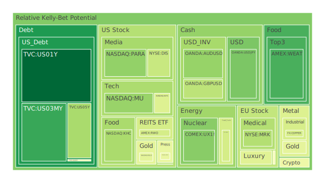
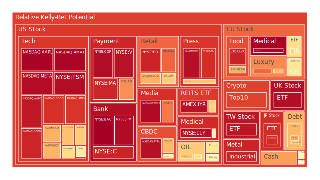
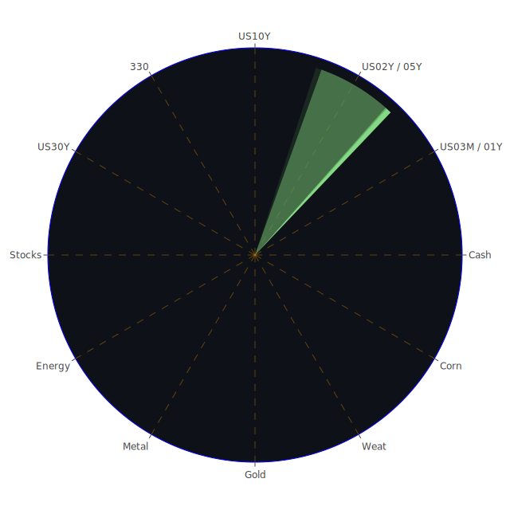

以下報告將以繁體中文撰寫，採用敘事與論說方式，從宏觀到微觀、從空間到時間與概念層面，進行多維度的觀察與推演，同時融入新聞事件與歷史場景，力求客觀呈現各類資產的潛在風險、可能的泡沫徵兆，以及三位一體正反合的投資假設。文末將提出穩健、成長與高風險三大類組合的優化建議與配置比例，協助投資人思考市場波動中的對沖機會。請注意，以下內容只供參考，任何投資決策皆需投資人自行判斷與評估自身風險承受能力。

---

# 投資商品泡沫分析

## 美國國債
過去數十年來，美國國債常被視為避險資產的首選。然而近期種種跡象顯示，美國公債殖利率曲線在不同年期之間出現壓力，1年、2年、3個月等短天期利率曾經高於10年與30年的長天期利率，現階段雖有些微收斂，但依舊值得關注。以空間角度（Spatial）來看，美國國債因具備全球交易量巨大、國際資金流動性高的特性，常在國際重大政治或地緣事件發生時迎來資金湧入或湧出。近期新聞顯示，美國與多國的貿易政策反覆，尤其針對關稅與制裁問題屢見不鮮，投資人對於主權債務市場的配置可能因此保守轉趨積極避險。從歷史層面參照2008年金融危機及2020年初期市場動盪，皆可見美國國債價格在全球資金避險心態下上漲。然若聯準會貨幣政策偏鷹派，或政府財政壓力擴大，長線公債也可能面臨拋售壓力，誘發較高的殖利率風險。

## 美國零售股
美國零售股往往與消費者信心、就業市場及薪資成長率掛鉤。近年電商競爭加劇，再疊加供應鏈變化與地緣政治風險，零售業利潤率走勢並不穩定。新聞面顯示某些區域消費萎縮、房市影響購買力等情況持續發酵。歷史對照2000年互聯網泡沫時，零售股因網購浪潮而洗牌，有些公司受到重創。若市場再次出現消費力下滑跡象或就業波動，零售股可能產生泡沫顯現或估值回落之風險。

## 美國科技股
美國科技股近幾年走勢極度狂飆，背後推力來自雲端、AI、大數據等主題。然而，近期出現中國新創AI企業DeepSeek的新聞衝擊，造成美國半導體與AI相關類股出現重大震盪，顯示市場對科技領域的競爭格局相當敏感。一旦出現新技術或成本優勢顯著的競爭者，投資人可能重新評估美國科技公司的高估值。歷史類比2000年科網泡沫，同樣是企業在短期營收、商業模式尚未完全落地前，股價因市場熱錢而激烈炒作，最終釀成大規模修正。市場情緒面的快速轉變，特別能透過心理學與博弈論解釋：投資人往往因追逐話題而忽略風險，一旦群體預期翻轉就可能瞬間「踩踏」。從空間維度看，若海外競爭對手的技術崛起，美國科技股會再次面臨全球資本重新配置的壓力。

## 美國房地產指數
美國房地產市場在2020至2022年間的熱潮，部分地區因低利率和疫情移居趨勢而持續發燒。但新聞提及，美國多個州的保險公司因災害與風險上升而撤出房屋保單，顯示市場可能逐漸增添結構性風險。此外，也有媒體指出部分房型（如遠郊區大宅等）價值可能在2025年底前面臨下跌。對照2008年金融海嘯之前房地產繁榮，若信貸條件收緊或市場預期翻轉，資產重估壓力將急速浮現。此時不動產市場與銀行體系的健康度、消費者可支配所得，以及就業狀況都可能在情緒面與實質經濟面產生負反饋。從博弈論角度看，買房與持有房地產者與金融機構之間的互動，若信貸違約率攀升，銀行風險敞口增加，房地產泡沫風險就越發明顯。

## 加密貨幣
加密貨幣在2023年至2024年經歷多次寒冬與牛市，但投機心理依舊活躍。近期新聞顯示，加密交易平台出現違規或合規風險，有的甚至遭到美國司法部巨額罰款，這種監管的強度與市場信心之間相互牽動。再從歷史來看，比特幣、以太幣等在2021年曾經屢創新高，但也多次重挫。心理層面常見FOMO（害怕錯過）與恐慌拋售的交替。若AI相關議題吸引資金流入新創領域，有可能分食原本在加密貨幣領域的投機資金。從博弈角度，投資人往往預期短期暴漲而爭相湧入，一旦監管利空或市場避險情緒增加，又可能快速撤出，因而波動度和泡沫風險一直處於相對高檔區。

## 金／銀／銅
貴金屬與工業金屬常被市場視為通膨防禦、產業景氣指標等多重角色。2025年來看，金價一直受到地緣政治與通膨預期交互影響。若聯準會政策轉向不明，金價通常是資金的一大避風港。但近期「Gold/Oil Ratio」、「Gold/Copper Ratio」等指標顯示金價相對於原油和銅價略顯昂貴，一方面暗示通膨預期尚未全面消退，一方面也說明市場對未來景氣可能轉弱的防禦心態。銀與銅的工業屬性更強：景氣若轉好通常帶動銅價，但若中國或其他主要經濟體製造業不振，銅價可能回落。對照1970年代的石油危機與1980年代之後的通膨控管時期，金屬價格的波動常源於能源、地緣政治以及全球需求變化。現在則需留意電動車、再生能源、AI伺服器等新型需求帶來的結構性影響，同時考量金銀等傳統避險屬性對資金的吸引。

## 黃豆／小麥／玉米
農產品價格易受天氣、地緣衝突、運輸成本等多重因素所影響。新聞顯示有些地區受氣候災害，例如洛杉磯附近野火或國際局勢改變時，供應鏈中斷風險急增。對照過去全球糧食價格在戰爭或疫情期間暴漲的案例，若供應國遇上天災、禁止出口或地緣政治衝突加劇，農產品價格恐迅速走高，形塑明顯泡沫。另一方面，若國際局勢突然緩和、航運成本下滑，疊加市場對谷物替代品（例如改用其他作物）增加，這些農產品也可能瞬間轉為供過於求，價格急跌。農產品屬性帶有高週期敏感度與政治敏感度，因此可能出現局部短期泡沫快速膨脹又消退。

## 石油／鈾期貨
石油方面，近期價格走勢受到「需求增減」與「供給策略」等多重議題影響。例如，面對中國或其他新興市場的成長動能變動，若需求不如預期，油價可能受挫。加之國際政治態勢：某些產油國可能操作生產配額，市場一旦釋放過量供給，價格就很容易向下修正。然而戰爭、新興國家需求抬頭則可能成為油價上行的助推力。鈾期貨方面則關係到核能發電的前景，一旦再生能源政策受到重挫或國際對核能態度轉趨積極，鈾價格可能驟升。歷史上也曾有因國家政策轉彎導致核能需求急增或急減的先例，因此鈾期貨泡沫風險與政策面息息相關。

## 各國外匯市場
外匯市場多空並存，近期因美國與其他國家之間的利率差變化，以及地緣政治或貿易政策的反覆，貨幣走勢極易出現突發性波動。墨西哥披索先前承受了因美國關稅威脅而引發的劇烈下跌；其他新興市場貨幣也可能遭受相似衝擊。若以博弈論來看，美國若頻繁採取制裁與關稅手段，與之貿易往來密切的國家貨幣可能遭到估值壓力，形成短期泡沫破滅或加劇波動的風險。歷史上，新興市場貨幣曾在1997年與2013年美國退場量化寬鬆的時點出現大規模資金外流，顯示外匯泡沫在資金流向逆轉時十分脆弱。

## 各國大盤指數
各國大盤指數往往代表該國整體上市公司的市值加權。2025年來看，美股NASDAQ、道瓊指數與歐洲主要指數等，都在AI與其他經濟復甦題材之間大幅波動。亞洲部分市場在地緣政治、出口需求和國內政策鼓勵措施下，呈現分化。新聞面顯示，有些歐洲國家遇到能源與高通膨問題而備受壓抑，也有國家受惠於出口復甦而指數表現佳。從心理層面來說，大盤指數一旦整體出現系統性高估，往往意味著整個市場都充滿樂觀預期。若利率上揚或全球衰退風險提升，投資人信心由正轉負，將顯示「潮水退去」式的估值修正。

## 美國半導體股
半導體股乃美國科技產業的靈魂，橫跨CPU、GPU、人工智慧晶片等領域。在新聞提及中國DeepSeek新AI技術後，美國知名半導體龍頭出現市值鉅額蒸發，說明市場對「技術競爭力」的高度敏感。回顧歷史，半導體產業也曾在科技泡沫時期被推上高峰，一旦新的競爭者或市場景氣趨緩出現，估值可能急轉直下。投資人需關切全球設備製造商對這一領域的訂單、供應鏈安全度，以及地緣政治對高階晶片出口的管制等因素。

## 美國銀行股
銀行股往往反映金融體系健康度與貨幣政策的寬鬆或收緊力度。若消費者貸款利率走高且資產質量下滑（如房貸或消費信貸違約率上升），銀行股估值可能面臨壓力。新聞面所提及的保險公司退出部分地區房市、車貸違約與信用卡逾期率抬升，都可能透過銀行部門放貸風險擴散到銀行股。從過去歷史看，2008年的雷曼危機便是由美國房貸市場崩潰而引爆整個金融體系的系統性風險。銀行股也會因市場流動性或資金壓力而產生泡沫破滅風險。

## 美國軍工股
美國軍工股受政府預算、地緣衝突、對外軍售等因素推動，具有一定抗景氣循環的特質。然而新聞顯示，現階段在各種國防及軍售議題上，美國可能時有調整。雖然世界上多處衝突升溫（中東、非洲等），但若政治局勢轉變或政府預算削減，軍工股也可能面臨利空。歷史上，在結束重大戰事之後，軍工需求往往大減，股價面臨修正。因此軍工股雖具防禦性，但並非完全無泡沫風險，須持續關注世界主要大國在軍事出口上的政策態度。

## 美國電子支付股
電子支付趨勢曾被市場譽為金融革命，特別是行動支付、虛擬貨幣介接等商業模式。但2025年的發展仍然要面對合規壓力、交易手續費、資安問題與全球經濟放緩的考驗。新聞若顯示某些區域對跨境支付加嚴監管或對FinTech公司課徵新稅，將影響電子支付業者的盈收。歷史參考在2018年前後，許多支付新創在估值高峰期大舉擴張，最終不少公司因現金流無法支應而倒閉或被併購，說明該領域在短期內也可能積聚泡沫後快速破滅。

## 美國藥商股
大藥廠股價受新藥研發、專利期、政府醫療保險制度、藥價政策等影響。近期有新聞提到部分藥廠合併要約可能被拒絕，或因專利價值未被充分認可而出現博弈。2000年代初期，藥商股在研發投入不足、專利懸崖陰影下也曾引發市場質疑；但若成功推出重磅新藥，則股價可急劇飆升。該行業的泡沫風險常體現於「市場對單一管線過度期待」，一旦臨床試驗失敗或法律監管扼殺利潤，估值就可能快速縮水。

## 美國影視股
串流服務的興起、戲院觀影人數的波動，再加上媒體併購整合，使得影視公司財務狀況與未來成長趨勢不確定性頗高。歷史證明，傳統電影產業在新平台、新觀眾收視模式轉移時，股價可巨幅震盪。例如2020年的疫情衝擊院線市場、流媒體平台反而逆勢成長，但進入2024、2025年後，各類平台競爭白熱化，內容成本攀升，盈利空間亦遭擠壓。若投資人對串流領導廠商或傳統媒體巨頭抱持過高預期，影視股也存有一定的泡沫風險。

## 美國媒體股
媒體集團的收益來源包括廣告、版權與付費訂閱等。宏觀經濟如果轉弱，企業廣告支出也會縮水，直接打擊媒體股營收。若監管單位或政府對於大型媒體併購案持負面態度，亦阻礙該產業的擴張。參考2008年後網路廣告時代興起，大批傳統媒體營收下滑，市場份額被線上廣告商搶走。當前若媒體業未及時擁抱新技術，如AI生產內容、新型態短影音社群等，泡沫風險可能在投資人撤離資金時迅速顯現。

## 石油防禦股
石油防禦股可能代表與煉油、管線運輸、油田服務或相關基礎建設領域的公司。油價一旦有大幅波動，相關公司獲利能力與估值也將翻騰。歷史上，石油市場受到中東局勢、OPEC協議與全球需求量等多重因素支配。若國際局勢緩和或再生能源興起抑制長期石油需求，防禦股也可能面臨獲利走弱。反之，若地緣衝突加劇或能源制裁重新升級，油價大漲將帶動相關股價短期衝高，一旦後續平息又面臨修正。

## 金礦防禦股
金礦股通常與金價高度正相關，且在全球市場動盪時最受避險資金青睞。但要注意的是，金礦企業本身還面臨地質勘探風險、環境法規、開採成本與地方社會問題等挑戰。若金價處於高檔，但礦業公司擴充產能所需的資本支出與時間遠超預期，也可能引發市場對該企業估值的質疑。回顧過去，當金價長期高漲之際，如果市場對通膨擔憂減弱或央行轉向強力收縮貨幣，金價大幅回調時，金礦股泡沫往往無法避免地破裂。

## 歐洲奢侈品股
歐洲奢侈品消費者主要來自全球高淨值客群，以及對品牌文化認同度高的消費群體。新聞顯示，一些歐洲奢侈品牌股在中國消費者回歸或美國市場需求不振的兩極化之下，股價頻繁震動。歷史經驗告訴我們，奢侈品銷售在金融危機或地緣政治動盪時，仍保有一定韌性，但若消費者對經濟前景看淡，非必需品支出將縮減。社會學角度也指出「炫耀性消費」的盛行或式微將改變奢侈品需求，因此奢侈品也具有一定泡沫風險。

## 歐洲汽車股
歐洲車廠在電動化與數位化的轉型下投入巨資研發，然而市場對轉型成果的期待若過度膨脹，最終營收若無法追上研發支出，就可能出現估值修正。新聞中若顯示關於排放法規收緊或某些原材料短缺，皆可能造成成本端波動。從歷史脈絡看，歐洲車廠在2015年排放醜聞後曾經跌入低谷，之後又因電動車與智慧駕駛的趨勢而獲得資本青睞。此種「潮水式」的資本流動往往容易導致周期性或結構性的泡沫風險。

## 歐美食品股
食品產業看似穩定，但也會因消費者口味、原材料價格、健康環保趨勢等而迅速變動。新聞若提及糧食供應緊縮，或極端氣候造成的農作歉收，都會帶動食品公司上游成本或利潤端變化。歷史顯示，在通膨高漲時期，一方面可以轉嫁成本，但若消費需求亦受壓抑、同業競爭激烈，利潤也會受到擠壓；在過度樂觀的情況下可能造成股價偏高，形成潛在泡沫。

---

# 宏觀經濟傳導路徑分析
在空間（Spatial）層面，美國、歐洲、中國及新興市場互動頻繁。若美國對特定國家發起制裁或提高關稅，被制裁國家之市場資金很可能向其他區域流竄。加密貨幣或貴金屬也往往成為短期資金避風港，推升此類資產的泡沫風險。  
在時間（Temporal）層面，短期政策與市場情緒可能與中長期基本面脫節，例如聯準會短期維持利率不變或限縮，卻無法改變企業長期獲利下滑的趨勢，形成股價與獲利背離的泡沫。  
在概念（Conceptional）層面，若投資人受到新技術（如AI）或地緣政治衝突等情緒性影響而爭相買進，沒有充分估算實際獲利能力，就容易創造高估值，同時不斷累積下行風險。

---

# 微觀經濟傳導路徑分析
針對企業與產業層面，利率走向、匯率波動、原物料價格與人力成本等都會直接影響企業營收與利潤。當新聞報導中的國際衝突或政策變化帶動匯率劇烈波動，各企業營運成本與海外市場的出口競爭力亦相應改變。  
若部分公司無法即時轉嫁成本或分散供應鏈，就算短期股價因投資人炒作而飆高，也有可能在實際財報公佈時驟降。心理學與博弈論指出，當市場多頭氛圍最濃厚時，往往就是盲目跟風者進場，最後形成潛在泡沫破裂風險。

---

# 資產類別間傳導路徑分析
1. **股債互動**：當全球資金對未來景氣走向不明時，可能同時推高美國長短期國債與風險資產的價格。但一旦聯準會貨幣政策明確轉向，資金往往快速移動到收益更具吸引力或更安全的資產，導致高估的股票或公司債泡沫化。  
2. **大宗商品與貴金屬**：若能源、糧食或金屬價格大漲，企業利潤遭到壓縮，投資人也可能轉向黃金、白銀等避險金屬。貴金屬本身價格又會影響金礦、銅礦等相關股票，產生上游到下游的連鎖反應。  
3. **加密貨幣與新興市場**：新興市場貨幣若因政治或債務疑慮而劇烈貶值，部分資金可能轉往加密市場尋求對沖；反之，當監管風險升高或流動性緊縮時，加密貨幣也可能同時遭到拋售。  
4. **房地產與銀行、保險**：房市的波動往往透過銀行與保險公司的資產負債表傳遞，從而影響整體金融市場對風險的評價。一旦違約率攀升，資金會尋找其他避險標的，造成資產間的迴盪效應。

---

# 投資建議

以下將綜合穩健、成長與高風險三大組合，並對應相應子投資項目。請記住，這些建議僅為參考範例，配置比例亦須依照各人風險承受能力與目標調整。

1. **穩健組合（合計約40%）**  
   - 美國短期國債（約15%）：收益率尚可，流動性與安全性高；在市場不確定性增長時能提供一定的資金避風港。  
   - 黃金（約15%）：地緣政治或通膨擔憂時常推升金價，可作為對沖金融風險的一環。  
   - 防禦性消費品類股（約10%）：例如食品、日用品等必需消費品，在經濟衰退時也較具韌性。  

2. **成長組合（合計約35%）**  
   - 美國大型科技或AI概念股（約15%）：雖然近期新聞提及DeepSeek帶來競爭，若龍頭公司能持續研發新技術，長期仍具發展空間，但須警覺泡沫風險。  
   - 歐洲奢侈品股（約10%）：消費層雖受經濟景氣影響，但以品牌與文化根基深厚，可作為多元化配置。  
   - 半導體裝置相關（約10%）：儘管競爭激烈，但晶片需求長期大多在AI、高速運算、電動車等持續成長的應用領域，若能精選優質標的具一定空間。  

3. **高風險組合（合計約25%）**  
   - 加密貨幣（約10%）：波動度極高，若能掌握風險控管且對該領域生態具深入理解，可視為小比例的資金配置，隨時注意監管與市場情緒變化。  
   - 新興市場股市（約10%）：政策與貨幣風險較高，但人口成長與潛在消費力或為中長期亮點，可望在全球經濟循環回升時有跳躍式回報。  
   - 能源或原材料概念股（約5%）：包括石油、鈾、金礦等，政治干擾大，報酬與風險並存，適合以小部位進行布局，以利用大宗商品週期波動。

此配置方案在短期相關係數上，盡力考量了不同資產間的互補與對沖特性，盡量達到彼此之間有負相關（約-0.5）或相位接近120度的分散效果，期望在市場出現較大波動時能減少整體組合回撤幅度。

---

# 風險提示

投資市場常包含人性預期與情緒放大的成分，各類資產一旦偏離基本面，泡沫風險隨時可能加大。尤其對於槓桿操作或集中持股的投資人而言，更須警惕任何大幅度的利空或政策轉向，都可能造成急遽的價格修正。本報告雖試圖梳理近期新聞與歷史場景，但市場始終充滿多重不確定性。若未能及時追蹤企業財報、宏觀指標或國際衝突動態，仍可能面臨超預期的重大損失。

1. **政策變動**：美國、歐洲或新興國家政府對利率、關稅、外匯管制等政策臨時大幅調整，將迅速衝擊金融市場並推升泡沫破裂風險。  
2. **地緣政治**：衝突升級或簽署和平協議都可能在短期內改變資金流向，導致特定區域或產業行情急轉。  
3. **科技競爭**：AI技術或新興產業的突破，可能一夕之間改變產業結構。投資人若未警覺領先技術的出現或無法判斷其商業落地成效，易陷入市場炒作後的泡沫化。  
4. **流動性風險**：在某些小型市場或波動劇烈的商品上，若遇外部衝擊，市場流動性可能枯竭，報價大幅跳空，造成無法出脫或被迫止損。  
5. **極端事件**：天災、公共衛生事件、大規模金融詐騙、網路攻擊等衝擊面廣且難以預測。此類黑天鵝事件往往超越一般經濟模型的預期範疇。  

總體而言，市場分析和投資策略必須納入多層次考量——空間（全球與區域交織）、時間（短中長期交互）、概念（經濟、社會、心理、博弈）等多維度的正反合推演。任何投資決策皆需投資者根據自身財務狀況、風險承受能力與對市場的研究判斷來落實。投資向來有風險，請審慎評估後再行投入資金。

 
Daily Buy Map:

 
Daily Sell Map:

 
Daily Radar Chart:

 
