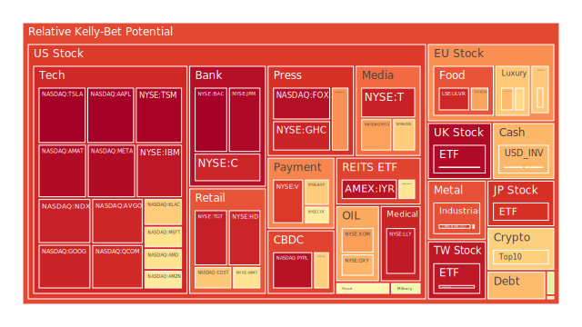

# 三位一體分析總論（空間、時間、概念）

在空間（Spatial）層次，對各區域市場之新聞與資產互動進行定位，可以觀察全球主要金融市場、美國本土、歐洲各國、新興市場與大宗商品的流動狀況；在時間（Temporal）層次，則關注近期新聞的即時反應、過去歷史經驗、以及市場對未來預期的演變；最後在概念（Conceptional）層次，藉由經濟學的供需輪動、社會學的群眾心理、心理學的風險偏好轉移、博弈論的策略行為等，綜合解讀各項新聞事件與政策措施如何透過「正—反—合」的辯證過程在市場上積累漣漪效應。

就「空間」而言，我們看到國際間主要的風險消息包含：美國對哥倫比亞之關稅與制裁威脅、對墨西哥的額外制裁考量、在亞歐地區出現的一些地緣衝突升溫、以及AI產業因中國新創DeepSeek帶來的技術競爭，牽動了科技股急跌再反彈的動盪。就「時間」而言，上述事件分佈在近幾日乃至近幾週的不同新聞週期中，對資產的價格波動有段差異性的衝擊，但一些長期指數如美國國債殖利率曲線之倒掛程度或漸趨收斂，也在時間軸上產生了不同層次的影響。再加上歷史經驗如「2018-2019年貿易戰」與「2020-2022年疫情」帶來的供應鏈瓶頸與市場恐慌反應，可能對當前有相似衝擊（例如：美國再次揮舞關稅大旗）。同時，就「概念」層面考量，投資人會同時使用經濟學基礎面（如GDP成長、貨幣政策）、社會學的群體從眾心理（恐慌時過度拋售，樂觀時快速湧入）、心理學對風險的恐懼與貪婪、以及博弈論中的談判與策略互動，來評估自身操作。

為了將三位一體的正反合邏輯應用於投資決策，可先提出大膽假設：在空間上，假設地緣政治的衝擊將普遍拉高風險資產波動；在時間上，假設市場因對聯準會（FED）政策、AI競爭、地緣新聞而經歷一連串快速調整；在概念上，以經濟面指標輔以人性心理變數做整體考量，或許能得出某些資產之間的對沖組合——這些組合在周期性的價格波動或衝擊之下，相位差約能達到120度以上，相關係數趨近-0.5，以提供較佳的風險平衡。

接下來，將以「投資商品泡沫分析」為主體，針對多項資產的現狀、泡沫風險指數、近期市場新聞與歷史類似場景等面向展開敘述，再進一步闡述經濟傳導與風險對沖建議。

---

# 投資商品泡沫分析

以下針對各資產類別，一一進行觀察視角與可能的發展態勢，並融入新聞事件與歷史對照，以協助理解其泡沫風險高低。此處將使用簡化標的名稱（如US03MY指美國3個月國債殖利率，WEAT指小麥ETF，GBPUSD指英鎊兌美元匯率等），忽略前方之券商或交易所代號。部分資產在原始資料中具備「PP100」代表現行價格，「D1、D7、D14、D30」表示單日、七日、兩週與月平均之風險或泡沫分數，數值越高通常代表潛在泡沫或脆弱性越大。請注意，以下即使有提及風險偏高之處，也不代表其短期一定下跌或崩盤，市場往往與投機心理互相糾纏，在任何時點都可能出現短線上漲或下跌的特殊情形。

## 1. 美國國債
美國各期國債當前殖利率略有回落跡象，如1年期（US01Y）現行約4.14附近，與上一週4.22相比稍降，同時10年期（US10Y）在4.54的水準，也比上一週4.62略降。30年期（US30Y）維持在4.78上下。就近期新聞看，美國國債對通膨預期及聯準會政策變動非常敏感。由於最新數據顯示通膨（CPIYOY）約為2.92%，市場對利率可能暫時保持高檔但不劇烈上升，10年與3個月的殖利率利差雖不再極端倒掛，但僅有約0.24的距離，依然處於微妙區域。  
歷史經驗中，當利率水準高企，但市場仍對未來增長不確定時，長期債券的需求可能來自避險資金，導致殖利率不易飆升；然而，一旦市場對通脹或財政赤字加深顧慮，長端殖利率也可能迅速上攻。就泡沫風險而言，美國國債屬相對低風險資產，但若財政政策遇到衝擊（如特朗普再度對外揮舞關稅，或陷入國債上限談判僵局），也有可能使殖利率進一步震盪。  
新聞面提到「Trump’s Federal Funding Pause Threatens State Financials」顯示聯邦資金暫停對各州經費的影響，短期內或許對公債避險需求造成支撐，但若局勢惡化，也可能造成市場對政府信用的擔憂。建議投資人將美國長短期國債作為資產組合中防禦性配置之一，但仍須注意政策動向。

## 2. 美國零售股
美國零售股如WMT、TGT等，從新聞中可見Costco、Walmart等大型零售商受通膨壓力與消費力道變動影響。整體來看，WMT（PP100約97上下）、TGT（141上下）風險指標依然偏高，D1數據如TGT約在0.94上下，顯示市場對未來業績疑慮頗大。再者，新聞指出「Trump仍計畫對加拿大和墨西哥徵收關稅」，或將對物流成本或供應鏈帶來進一步壓力。歷史上，在貿易戰升溫期間，零售股常因進口商品成本上揚而盈利承壓。  
對於零售領域，一旦廣泛的關稅衝擊落實，供應成本提高，利潤空間被壓縮。短期可能因市場避險情緒加重而股價回落。從社會學、心理學面向來看，消費者在經濟前景不明朗時會減少非必需品消費，零售商若未能有效促銷或控制成本，可能出現盈利下滑。但也要留意大型連鎖零售往往在危機時佔據市場份額的優勢，因此若能運用對沖策略，可將零售股與其他不同類型的資產分散配置。

## 3. 美國科技股
美國科技股經歷了AI熱潮後，又在近期因中國DeepSeek公司的競爭而遭遇大幅震盪。Nvidia（NVDA）在新聞中一度單日市值蒸發數百億美元，這種極端波動顯示市場對AI龍頭地位的重新定價。資料顯示NVDA近期泡沫分數在單日可達0.58-0.69區間，代表其估值或市場情緒高度脆弱。微軟（MSFT）、谷歌（GOOG）等也出現一波短期跳水後的反彈，部分投資者認為「深度學習」競賽仍會延續，但競爭對手的崛起使市場重新檢視科技巨頭的估值。  
歷史上，大型科技股經常在「創新—炒作—修正—再創新」的周期反覆演繹。2000年的網路泡沫是極端案例，但之後如2015年的生技股熱潮、2017-2018年的加密貨幣與區塊鏈概念熱潮，也有類似脈絡。就社會心理學角度而言，投資人傾向對前景看好的新技術願意給予極高估值，但當有新競爭者（如DeepSeek）出現，原有龍頭的未來利潤可持續性即受到質疑，從而引發獲利了結的資金湧現。  
未來關鍵在於實際營收能否支撐高估值。若DeepSeek大獲成功、能以更低成本與更高效能的模型衝擊市場，龍頭科技股不排除二次回調。從博弈論觀點，巨頭可能採取併購或授權合作的策略來鞏固自己的地位，市場短期或出現波動與整併浪潮。投資人若持有大量科技股，仍需考慮保留一定比例的防禦性資產對沖。

## 4. 美國房地產指數
美國房地產（RWO、VNQ等）近期價格相對疲軟，泡沫分數約在0.64到0.66左右。歷史經驗顯示，當美國利率處於高檔，30年固定房貸利率（當前約6.96）對購房需求有負面衝擊，可能造成房地產周轉量下降，價格漲勢趨緩。但若聯準會暗示暫停升息，或市場對經濟衰退的恐懼放大，部分資金也可能湧向房產抵禦通膨風險，形成一種交互拉力。新聞面並未特別提及房地產直接政策動向，但若「Trump’s Federal Funding Pause」對某些地區基建投資有打擊，部分地區商用不動產需求恐受影響，房地產信託基金（REITs）之租金回報或許面臨下行壓力。  
建議投資人若對房地產看多，可在利率趨緩跡象較明顯時分批佈局，同時以其他類別資產（如黃金或部分抗通膨公債）對沖經濟放緩風險。

## 5. 加密貨幣
加密貨幣(BTC、ETH、DOGE等)在資料中顯示，BTC約在101307-102774之間上下波動，泡沫分數不斷在0.54-0.68之間浮動；ETH則在約3000-3235美元區域，短期泡沫分數維持0.44-0.47左右。新聞面上，美國司法部對KuCoin的罰款，加深加密市場對監管的擔憂，也造成短期拋售壓力。歷史上，加密貨幣市場常見劇烈波動，如2017年底與2021年的幾次牛市、熊市輪迴，很大程度受網路情緒推動。  
社會學層面來看，當法規不確定性增強，交易所或礦商受打擊時，人群恐慌傾向上升；然而，對於長期信仰者而言，每次監管事件都可能被視為入場機會。心理學指出，投資人對高波動資產有時會出現「僥倖心理」或「恐慌殺低」。建議在加密貨幣投資上，除了要關注技術面，也應留意是否有大規模的監管掃蕩或資金鏈斷裂風險。

## 6. 金 / 銀 / 銅
黃金（XAUUSD）當前報價約在每盎司2762美元上下，D1泡沫分數約0.45上下，銀（XAGUSD）泡沫分數更高，約0.90左右，代表市場對白銀投機性需求較大。銅（COPPER）在4.25附近，泡沫分數約0.55左右。新聞面提到的地緣政治衝突（如中東局勢、俄烏邊境緊張）都可能推升金價避險買盤。而銀在工業需求、綠能需求方面同樣與經濟週期掛鉤，價格波動幅度更大。  
歷史經驗上，黃金在利率高企下，通膨若仍有可能反撲，往往維持一定支撐；銀則常常動能更大，但風險更高；銅與全球景氣需求息息相關，若中國復甦不及預期，銅價可能承壓。先前新聞曾報導中國市場債務壓力導致需求放緩，也會影響銅價。因此在金銀銅之間的配置，要同時衡量避險與經濟成長前景。

## 7. 黃豆 / 小麥 / 玉米
大宗農產品有SOYB(黃豆基金)、WEAT(小麥)、CORN(玉米)等。小麥（WEAT）估價約4.84，泡沫分數落在0.16-0.27區間，相對溫和；玉米（CORN）在19.7上下，泡沫分數則較高，接近0.57-0.60；黃豆（SOYB）則約22.1-22.25，也在0.49-0.51之間。歷史經驗顯示，糧食價格常因天氣、地緣糾紛（如出口禁令）而劇烈波動。新聞面目前無直接關於穀物危機的重大消息，但哥倫比亞關稅、墨西哥貿易爭端若擴大，也可能影響部分農產品貿易路線。  
社會學面向：糧食價格若飆升，民生壓力大增，容易觸發政治與社會動盪；另一方面，若天氣條件良好，供給充足，價格則易回落。對投資人而言，農產品可作為實體通膨對沖手段，但因受季節性與突發新聞衝擊較大，需謹慎評估進場時機。

## 8. 石油 / 鈾期貨UX!
石油（USOIL）約在73美元上下，泡沫分數約0.34-0.49。新聞顯示受中國AI需求疑慮與國際地緣風險消息左右；若中國經濟不景氣，石油需求預期下修；反之，中東衝突可能推升油價。近期報導顯示「Oil Holds Biggest Gain in Two Weeks as Tariff Threats Dominate」，可見市場對地緣與政策敏感度仍高。歷史上，石油受OPEC+產量政策與全球需求交互影響，波動往往劇烈。若美國對哥倫比亞或墨西哥制裁擴大，拉丁美洲原油供給鏈也可能出現動盪。  
鈾期貨（UX1!）在69-71美元區間，泡沫分數約0.41-0.62。鈾一直是具備安全、軍工、電力結構轉變議題的指標。若地緣緊張升溫，或對核能需求前景看好，鈾價格可能上揚；但其市場規模相對較小，波動性並不低。歷史上，如2011年福島事件後，鈾價大跌；近年隨著核能重新被部分國家關注，價格有所回升。投資人須留意核能政策的政治風險。

## 9. 各國外匯市場
英鎊兌美元（GBPUSD）1.24-1.25，泡沫分數約0.29-0.73不等，顯示短線內對英鎊的信心有所波動。歐元兌美元（EURUSD）在1.05上下，泡沫分數較高(0.72)，代表市場對歐元仍有不確定性，或認為歐洲經濟相對脆弱。日圓兌美元（USDJPY）則維持在155左右，泡沫分數約0.30-0.52，也呈現寬幅震盪。新聞中多次提到貿易爭端與地緣風險，往往令避險貨幣升值，但目前日圓並未出現強力走升，顯示對日本國內經濟與貨幣政策的擔憂。  
歷史上，若聯準會升息步伐放緩，而其他國家也面臨通膨與經濟衰退兩難時，外匯市場常呈現區間震盪狀態。社會心理學角度則提醒，外匯交易常伴隨高度槓桿，投資人對風險事件的反應較為激烈，易造成快速波段行情。可透過分散配置減少特定貨幣貶值風險。

## 10. 各國大盤指數
如德國DAX（GDAXI）、法國FCHI、英國FTSE、美國NASDAQ 100（NDX）、臺灣0050（TWSE:0050）等。德國DAX約在21400上下，泡沫分數約0.40-0.66不等；法國（FCHI）約在7900上下，泡沫分數0.45-0.62之間；英國FTSE約在8500上下，泡沫分數一度高達0.96-0.97，代表市場對英國指數有較大疑慮；美國NASDAQ 100在21,000上下，泡沫風險逼近0.69-0.82之間，顯示科技股權重大的指數易受AI題材波動。  
亞洲部分，臺灣指數0050約201元，泡沫分數約0.95左右，顯示台股受半導體行情炒作，短線漲幅大，風險積聚。歷史上，各國大盤指數若同時面臨全球經濟成長下行、通膨壓力、以及政治動盪，可能出現同步性回落。社會學觀點認為，ETF投資人情緒易互相影響，一旦風險偏好轉向保守，賣壓會從區域蔓延至全球。建議投資人定期檢視國際局勢，分散於不同區域指數，而非過度集中某一市場。

## 11. 美國半導體股
半導體股如NVDA、AMD、INTC、KLAC、AMAT等，經歷了AI概念股的大幅拉抬後，最近在DeepSeek消息重創下出現劇烈震盪。泡沫分數普遍偏高（NVDA可至0.67以上，AMD約0.50上下，INTC雖表面看估值較低，但風險分數也在0.47-0.53間）。根據博弈論，若競爭者中國DeepSeek自建硬體供應鏈，可能侵蝕美國廠商的技術優勢。歷史經驗：2018-2019年貿易戰也曾對半導體供應鏈造成嚴重衝擊，之後雖有反彈，但波動始終較大。  
短期看，市場仍然相信AI芯片需求不是一朝一夕就被外來者取代，但投資者應提防系統性評價修正。社會心理面向下，大型投資機構常同步調整持股部位，一旦情緒翻轉，殺傷力高。因此建議有半導體持股者可考慮在高點進行部分避險操作。

## 12. 美國銀行股
美國銀行股如BAC、JPM、C等，新聞顯示有關「聯邦政府資金暫停」、「地區性銀行存款流動」等議題，引發對銀行流動性與資本適足性的擔憂。BAC（46-47美元），泡沫分數已高達0.99上下，顯示市場對銀行股後續的風險容忍度不高。JPM雖業務多元，但其泡沫指數仍在0.96-0.97之間，顯現高估值與潛在不確定性。歷史經驗指出，金融危機往往與金融機構槓桿或流動性鏈條有關，一旦出現信心危機，銀行股會領跌大盤。  
新聞面曾提到「Charge-off Rate on Credit Card is at relatively high level」，意味著銀行的壞帳率上升。再結合Trump施政可能造成財政撙節混亂，若衝擊就業與消費者收入，將進一步推高信貸違約率。投資人若看好銀行股基本面，也須謹慎權衡財報風險。

## 13. 美國軍工股
軍工股（LMT、NOC、RTX等）一向與地緣衝突正相關。數據顯示NOC約在486-503區間，泡沫分數約0.49-0.53；LMT在457-503之間，也有一定的風險評級。新聞面談及中東、非洲地緣衝突（例如剛果叛軍、以巴問題），以及美國可能擴大對拉丁美洲的軍事影響，都為軍工需求增溫提供想像空間。歷史上，軍工股在全球局勢升溫時往往比大盤更抗跌。但一旦局勢緩解，或政府預算面受限，也可能導致股價快速修正。建議可將軍工股視為一種「地緣避險工具」，但切勿忽略其高估值的危險。

## 14. 美國電子支付股
電子支付股（V、MA、PYPL、GPN等）長期受惠於電子商務擴張。新聞面顯示若關稅與地緣政策導致跨境交易萎縮，電子支付也會遭逢逆風。Visa（V）及Mastercard（MA）的風險分數約0.90-0.94之間，似顯示估值不低；PayPal（PYPL）也維持高泡沫分數0.96上下。歷史上，金融科技創新會快速推升某些支付類股估值，但同時監管和競爭也可能拉低前景。面對目前通膨與全球成長放緩的結合，投資者應謹慎評估其支付規模能否持續擴張。

## 15. 美國藥商股
藥商股（MRK、JNJ、LLY等）一般被視為相對防禦性資產，但本次數據顯示LLY、JNJ的泡沫風險也不小，其中LLY更是在0.85-0.95上下波動，表示市場對其未來突破新藥或潛在營收增長的預期很高，也帶來估值風險。JNJ則因法律爭議和其他風險事件，雖然短期價格有所回升，但仍須留意不確定性。新聞面提到一些關於醫療保險與補助可能受Trump的「Federal Funding Pause」影響，可能間接打擊藥品需求；反之，若疫情類事件再度爆發，藥商股可能出現相對抗跌的特性。

## 16. 美國影視股
影視娛樂股（PARA、DIS、NFLX、FOX等），新聞顯示例如Disney（DIS）價格在112-113左右，NFLX在970-980上下。PARA則處於11美元上下，泡沫分數約0.30-0.45，不算高，但其經營基本面仍有挑戰。NFLX近來泡沫分數在0.76-0.84左右，意味著市場對串流平台競爭的擔心未減。社會心理學角度：景氣不佳時，大眾娛樂需求有時會逆勢增長（所謂「口紅效應」或「小確幸理論」），但也可能被更嚴峻的財務壓力抵銷。歷史上，影視股在全球經濟放緩時，廣告與付費會員增長恐受衝擊。

## 17. 美國媒體股
媒體股（NYT、CMCSA、GHC等）隨著社群平台及串流娛樂興起，傳統媒體的營收模式轉型壓力大。NYT泡沫分數大約0.66-0.80，顯示投資人對其訂閱模式既期待又擔心；CMCSA則在37-38美元區域，泡沫風險約0.44-0.46。新聞面提到，政局混亂時，新聞媒體閲讀量、收視率可能增長，但廣告商預算緊縮也會抵銷部分成長。歷史上，媒體公司常受制於產業改革與數位化趨勢，若能轉型成功則可能突圍，反之面臨停滯不前的營收來源也很常見。

## 18. 石油防禦股
石油防禦股可理解為能源產業中偏上游或整合度高的公司（例如XOM、OXY等）。XOM目前約108-110美元區間，泡沫分數約0.65-0.76之間；OXY約49美元左右，分數可達0.68-0.73。新聞顯示油價近期因地緣風險反覆震盪，但若Trump政策再度影響油氣管線建設、或對OPEC成員國關係產生變數，都可能改變供需關係。歷史上，石油公司在高油價階段能快速擴充營收，但一旦油價反轉下跌，也可能出現獲利縮水。投資人需格外關注國際油市的供需趨勢。

## 19. 金礦防禦股
金礦股（如RGLD等）通常在黃金行情上行時表現優於黃金本身，但也承擔更高經營風險。RGLD目前價格在139上下，泡沫分數約0.45-0.60。當前黃金對沖需求仍在，尤其全球政治不確定性沒有減輕。但金礦公司也面臨開採成本、環保規範等限制。歷史上，若金價進入長期牛市，金礦股回報可觀，但一旦金價回落，股價下跌幅度也往往更大。

## 20. 歐洲奢侈品股
歐洲奢侈品（MC、RMS、KER等）依賴全球消費者購買力，尤其是中國、北美等市場。RMS（Hermès）與KER（Kering）近期受中國經濟前景與歐美消費動能所影響。RMS在2662-2671上下，泡沫分數大約0.67-0.71；KER則在260-263左右，分數可達0.68-0.81。新聞面亦提到「LVMH considering widening US footprint」，顯示法國大企業在國內稅率或政策不確定下，可能轉向海外。歷史經驗：奢侈品股對全球景氣敏感度較大，經濟轉弱會影響奢侈消費；但也曾出現逆勢增長的案例，因富裕群體的消費彈性較高。

## 21. 歐洲汽車股
歐洲汽車（如BMW、MBG）部分指標顯示：BMW約78-81歐元，泡沫分數0.46-0.53，MBG(Mercedes)在56-58之間，也有0.51-0.63。新聞面較少聚焦汽車，但整體而言，若關稅糾紛擴展，美國對歐洲汽車進口關稅升高，將對德系車廠不利。博弈論下，若歐洲回擊美方關稅，也可能互傷。投資人需留意汽車股與美元匯率、原物料（鋼、銅、電子元件）成本之連動。

## 22. 歐美食品股
KO（可口可樂）、NESN（雀巢）等，都屬全球食品龍頭。可口可樂約62-63美元，泡沫分數0.52-0.60，NESN約78美元上下，泡沫分數約0.50-0.75。此類消費必需品在景氣下行時往往相對穩定，但估值若過高，也可能產生回調風險。歷史上，大型食品商一直是防禦型代表，但近年也面臨健康潮流、原料上漲、包裝材料供應不穩等挑戰。新聞面顯示「英國財政部對企業稅率可能調整」，或許會影響部分歐洲食品商在英國的策略布局。

---

# 宏觀經濟傳導路徑分析

1. **貨幣政策與通膨預期傳導**：FED維持較高利率，主要是為壓抑通膨（CPIYOY約2.92%），但市場對景氣衰退的擔憂也日增。一旦利率前景不再明朗，資金在國際之間流動改變，美國國債與外匯市場的波動加劇。通膨若重新抬頭，黃金、農產品等通膨敏感標的上漲。

2. **地緣政治與關稅政策傳導**：特朗普對哥倫比亞、墨西哥的潛在制裁，若擴及其他國家，會影響大宗商品與全球供應鏈。零售股的採購成本上升，銀行流動性風險也可能增加，科技股供應鏈受干擾，最後牽動大盤指數。

3. **AI產業競爭升溫**：中國DeepSeek帶來的震撼，可能在科技股間形成鯰魚效應：Nvidia、AMD、Intel等被重新評價。若該技術短期確實落地，會衝擊美國對華科技限制政策的有效性，甚至引發更大範圍的半導體博弈。

4. **全球資本市場交互影響**：歐洲經濟在能源危機後仍處於脆弱復甦期，若美國風險上升，歐洲也難獨善其身；國際熱錢在尋找相對安全資產時，可能湧向美債或黃金，推升匯率震盪。

---

# 微觀經濟傳導路徑分析

1. **企業信用風險傳導**：銀行股若因違約率提高而信貸緊縮，企業融資成本上升，連鎖反應會波及消費與就業。  
2. **供應鏈中斷傳導**：如關稅升高，供應鏈物流延誤，零售、汽車、電子產品成本增高，利潤下降，再反映於股價。  
3. **市場情緒與槓桿行為**：投資人若看好AI或防禦股，可能加大槓桿進場，帶來短線快速拉抬；但消息面風向轉變時也會造成急跌。

---

# 資產類別間傳導路徑分析

1. **貴金屬與美元之此消彼長**：當避險需求上升時，黃金、白銀通常與美元可能同步升值，但也有時候因利率變動而相互排擠資金。  
2. **原油與股市輪動**：油價上漲通常意味全球經濟需求旺盛，短期可能利好能源股，但也會增加企業運營成本，施壓其他板塊。  
3. **半導體與科技類股的外溢效應**：Nvidia等龍頭動向常牽動整體NASDAQ指數，進而影響市場風險偏好。  
4. **農產品價格對通膨的拉動**：若糧價大漲，將再度推升通膨壓力，使得央行保持更緊的貨幣政策。  

---

# 風險對沖的各種投資組合機會

基於三位一體的理論與正反合的思維，將盡量找出彼此相位約能滿足120度、相關係數約-0.5的對沖組合。以下以文字描述方式列示：

1. **組合A：黃金（XAUUSD） + 半導體股（NVDA或AMAT） + 美國長債（US30Y）**  
   - 理由：當科技股因AI競爭而大起大落時，黃金與美國長債可同時提供避險；而若地緣風險升溫，黃金可能走強，但長債殖利率或也受壓。這三者之間在歷史上相關性不高，約能達到分散效果。

2. **組合B：能源股（XOM） + 歐洲奢侈品股（RMS或KER） + 加密貨幣（BTC）**  
   - 理由：能源股與奢侈品股在經濟循環中所處的波動週期不同；加密貨幣與傳統股市的聯動性時強時弱，但整體而言若某些監管風險上升，資金可能流向能源或防禦型消費。此組合本身風險較高，但在某些衝擊下也能對沖部分方向。

3. **組合C：美國零售股（WMT或TGT） + 黃豆基金（SOYB） + 日圓現金部位**  
   - 理由：零售股與農產品價格有某種供應鏈利潤擠壓的負相關；同時在避險時日圓若出現資金流入，可彌補其他下跌。此組合偏向防禦，但仍會受地緣政治影響。

4. **組合D：加密貨幣（ETH） + 金礦股（RGLD） + 短期美國國債（US03MY）**  
   - 理由：ETH與金礦股雖然都帶有高波動與避險概念，但往往在不同市場周期各自表現；若市場轉向風險厭惡，短期國債是資金的停泊處，可平滑資產大幅下挫的風險。

---

# 對上述所有表格（概念性整理）之三位一體、兩兩相互驗證篩選假設分析

為使情境更合理，我們可進一步檢視以下可能的「漣漪效應」傳導路徑，並推敲它們在現實中是否具備可行性：

1. **地緣或政治衝擊→零售與物流成本上升→通膨壓力續存→聯準會繼續緊縮**  
   - 若發生，美國內需股以及非必須消費品將承受壓力，黃金與國債受追捧。

2. **AI龍頭格局劇變→大型半導體廠市值下修→NASDAQ帶動大盤回調→資金轉進必需消費品、防禦股、黃金或短債**  
   - 這種風險偏好切換在歷史上多次出現，但也可能因新技術發酵而再度上漲，不可一概而論。

3. **區域銀行因消費者違約率升→放款更保守→企業擴張計畫受限→經濟下行壓力增→最終拖累原物料需求**  
   - 農產品、石油、銅價都有下行風險，但若貨幣寬鬆又重啟，價格可能再度反彈。

4. **美元偏強→新興市場資金外流→對新興市場股市和匯率構成壓力→國際利差擴大→先進國家資金流動再度引發波動**  
   - 最終形成螺旋式傳導，可能促使部分歐洲股市與新興市場承壓。

在兩兩相互驗證下，可以發現若第一條路徑成真，第四條路徑也易同步出現。這些假設場景彼此間並非互斥，但也不一定會同時全部實現，投資者須根據各自的風險承受度與對未來的預判來做調整。

---

# 投資建議

綜觀以上分析，建議投資人保持風險意識。以下提出三種投資風格下可能的最佳化配置（穩健、成長、高風險），並搭配「比例」設定，令三種風格加總為100%，同時於各自風格中再選三個子投資項目（或資產種類）示範如何分配。此處僅為概念示例，最終配置應因人而異：

1. **穩健型（佔整體資金約50%）**  
   - 子投資項目A：美國長債（US30Y）或短債（US03MY）合併持有（約20%），利用固定收益對沖經濟波動。  
   - 子投資項目B：黃金現貨/黃金ETF（約15%），為避險及通膨對沖。  
   - 子投資項目C：全球大型消費必需品股（如可口可樂KO或雀巢NESN）（約15%），偏防禦性需求。

2. **成長型（佔整體資金約30%）**  
   - 子投資項目A：美國科技龍頭股（如MSFT、GOOG）（約10%），承接AI發展潛力，但留意估值風險。  
   - 子投資項目B：歐洲奢侈品或工業龍頭（如RMS、KER或BMW）（約10%），博取全球消費與歐洲政策利好。  
   - 子投資項目C：高配息REITs或部分新興市場債券（約10%），尋求收益與有限成長。

3. **高風險型（佔整體資金約20%）**  
   - 子投資項目A：半導體或AI供應鏈（如NVDA、AMD、AMAT）（約7%），有望高收益但波動甚鉅。  
   - 子投資項目B：加密貨幣BTC或ETH（約6%），追求潛在翻倍收益，須承受泡沫風險。  
   - 子投資項目C：軍工或石油防禦股（如LMT、XOM）（約7%），地緣衝突升溫時可能逆勢走高。

以上「穩健、成長、高風險」三大類合計剛好100%。投資者可根據個人風險承擔能力與資金性質微調。如強調資本保全，則擴大穩健佔比；若有長期閒置資金並追求高收益，則拉高高風險佔比，但需隨時警惕泡沫破裂風險。

---

# 風險提示

投資市場風險無處不在，對於可能的泡沫風險或突然性政治事件，更須保持高度警覺。以下再次提醒幾點重要風險：

1. **泡沫風險**：無論是AI概念股、美國科技巨頭或加密貨幣，都可能存在高估現象。從數據可見不少標的的D1或D7泡沫分數高企，若基本面未能跟上，極易出現快速回調。

2. **地緣政治與關稅**：特朗普對拉丁美洲國家的關稅與制裁若進一步擴大，或俄烏、中東、非洲地區衝突升高，都可能迅速衝擊全球股匯市。需留意新聞及官方政策聲明，以免陷入突然的價格巨震。

3. **金融流動性危機**：銀行股的壞帳率上升，聯邦政府補助若被暫停或縮減，可能導致部分地區性銀行承受更大壓力，甚至引發流動性問題。市場信心一旦動搖，連鎖影響可能波及多數風險資產。

4. **監管風險**：加密交易所KuCoin的罰款案例顯示監管力度增強，若後續對其他交易所或區塊鏈金融有更嚴厲措施，投資人恐面臨資產凍結或市場流動性不足等情況。

5. **通膨與利率**：若通膨反撲或油價大漲，FED或ECB可能被迫持續升息，再度施壓股市債市，削弱企業獲利並推高借貸成本。

6. **情緒與槓桿**：市場正處於多空因素交織狀態，投資人若在過度樂觀或過度恐懼下進行槓桿交易，容易出現非理性行為。在消息面劇烈變動時，波動幅度將被放大。

總而言之，投資從來不保證獲利，每項資產都面臨其獨特的風險。建議投資者務必做好資金控管，根據自身風險承受能力和投資目標做出理性決策。在當前新聞與政策訊息頻繁轉折的環境下，更應保持對全球事件的敏感度，謹防因漣漪效應而遭受重大損失。

---

## 投資有風險，市場總是充滿不確定性。我們的建議僅供參考，投資者應根據自身的風險承受能力和投資目標，做出獨立的投資決策。

 
Daily Buy Map:

 
Daily Sell Map:

 
Daily Radar Chart:

 
