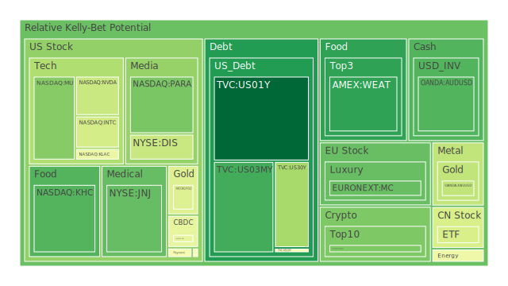
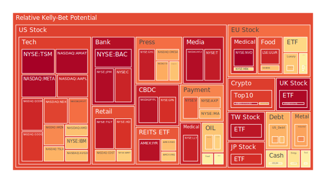
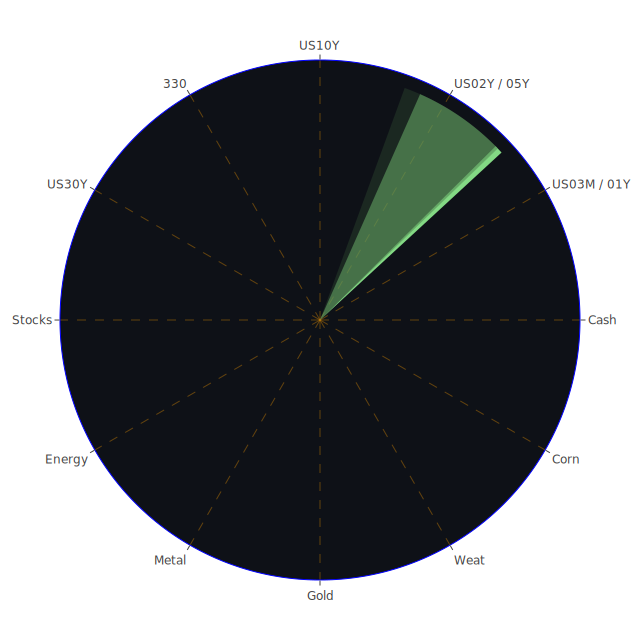

# 投資商品泡沫分析

## 1. 美國國債
近幾日的市場數據顯示，美國國債整體收益率曲線有些許抬升趨勢，一年期、兩年期、五年期與十年期、三十年期利率都維持在4%以上。表面上，這可能意味著投資人對聯準會（以下簡稱FED）未來是否降息還存在保留，另一方面也顯示中長期債券的收益率仍在較高區間盤整。根據對最新泡沫分數的觀察，一年期國債的泡沫風險指數相對不高（D1約在0.03至0.04間上下波動），顯示市場對短期安全資產依舊維持穩定需求。但中長期國債之泡沫指標並不算特別低，尤其是三十年期國債，近期有高於0.3的泡沫分數，代表持有人若預期接下來通脹風險或經濟衰退變化不明，仍可能面臨價格震盪。  
在歷史類比上，當長短天期之間的收益率曲線出現倒掛或趨勢混亂時，往往暗示未來經濟存在較高不確定性。雖然最新觀察顯示部分期限利差轉正，但也不能忽視其中隱含的潛在警訊。社會心理層面上，投資人傾向把美國國債視為一種避險資產，然而當殖利率持續在4%至5%之間不斷波動，且新聞裡對經濟前景的負面情緒漸起（例如近期包含對政府支出凍結的緊張局面），有可能強化市場上「分散風險」的需求。博弈論觀點下，若其他投資人也爭相涌入美國國債，短期價格也許會被推升，但隨之而來的殖利率下降，可能進一步衝擊市場對其他資產的需求。投資人應充分注意到此種「集體湧入—集體撤離」的反射機制。

## 2. 美國零售股
美國零售股方面，部分消費類股在新聞顯示零售巨頭財報數據喜憂參半，疫情後的消費力回溫趨勢仍不穩定。近期也有不少關於美國國內政策動盪的新聞，例如政府對移民或對貿易的舉措，引發市場對未來消費增長力道的疑慮。從泡沫風險分數來看，有些零售股的短期泡沫分數大約在0.6到0.8左右上下起伏，顯示短期炒作氣氛尚在，然而若是整體利率環境持續偏高，可能侵蝕消費支出，同時衝擊零售業的利潤空間。  
若對比歷史上的2008年金融危機前夕，當時零售股一度享受最後一波旺盛消費，但之後因信用環境緊縮而急速下滑。此刻並不至於有雷同的寬鬆信貸環境，但是若利率繼續維持高檔，社會心理上消費者意願受到壓抑，零售股的多空博弈將持續。短期內若沒有額外重大利多的刺激，零售板塊內部或將面臨調整風險。

## 3. 美國科技股
就美國科技股而言，近來消息面受到中國新創公司的AI突破（DeepSeek）衝擊，導致許多知名科技龍頭的市值在短時間內出現劇烈波動。新聞指出，多家巨頭發布財報不甚理想，尤其是雲端及AI支出增速放緩或市場競爭力下滑的訊息，引發市場投資人的恐慌。部分高成長科技股的泡沫分數一度逼近0.9到1的範圍，顯示市場對它們先前的「高估值」狀態已產生較大疑慮。特別是一些半導體龍頭，一旦市場對AI的需求前景產生遲疑，其股價波動幅度就更為劇烈。  
回顧類似歷史場景，2000年網路泡沫時期，投資人對科技與網路相關概念抱持過高預期，最終隨著市場情緒反轉而大量下跌。現今雖有實際的AI需求支撐，但仍難保證估值不出現「前期炒作+過度樂觀」所積累的泡沫。心理學層面上，市場對創新概念總有偏好，一旦情緒轉向謹慎，很可能釋放連鎖賣壓。博弈論顯示，科技巨頭彼此間仍存在競爭與合作的糾結，若有任何一家廠商在AI領域的技術或成本優勢快速冒起，就會對原本處於領先地位的公司形成壓力。

## 4. 美國房地產指數
美國房地產整體仍處在利率高壓的環境。從最新30年期固定房貸利率已經接近7%，而一年多前利率僅有3%附近，這樣的劇烈上漲常常對住宅需求造成不小衝擊。最新的房地產相關指數泡沫風險介於0.4到0.6左右，顯示投資人對房市估值的爭議相當大：有一派人相信房地產因供給有限而繼續堅挺，也有一派擔憂高利率會在未來幾季持續壓抑買氣，導致交易量持續下滑。歷史上，2006-2008年美國次貸危機是房地產的慘痛教訓，但目前銀行對房貸的審核相對嚴格。然而在商用不動產或租金市場，若經濟成長動能減弱，仍有出現大面積違約或空置率攀升的風險。  
社會學面向來看，房地產是一個牽動民生的重要市場。若就業市場在高利率之下逐漸受到抑制，銀行貸款意願下降，房地產市場的流動性也可能由高峰期漸漸衰退。心理因素顯示，大多數人仍視房產為保值資產，一旦預期出現反轉，就可能帶來急售與拋售的狀況。博弈論上，開發商與投資人可能陷入互相觀望的局面，導致流動性進一步受限。

## 5. 加密貨幣
加密貨幣市場最近出現了負面新聞，包括交易所因涉嫌違規而遭到罰款、或對洗錢問題的疑慮。比特幣與其他山寨幣在前期因對沖通脹的敘事而得到了支持，但現在面對監管升溫，尤其是美國對加密資產的審查愈發嚴苛，加上一些交易所的動盪引起投資人恐慌，因此價格屢次大幅波動。從泡沫風險看，比特幣近期的指數約在0.68至0.70區間浮動，以太幣約在0.44至0.47之間，相較於歷史上更瘋狂的時期並未達到極端峰值，但仍不可忽視大幅震盪的可能性。另有一些更高風險的代幣，其短期泡沫指數甚至逼近0.95以上，隨時可能因消息面而雪崩。  
回顧2018年的「加密寒冬」，當時也是因監管與市場對區塊鏈落地應用的懷疑情緒大幅抬頭，價格一路暴跌。就心理學而言，加密貨幣市場多半存在「網路世代」群體的集體行為，一旦風向轉變，拋售往往非常迅速。博弈論指出，加密市場存在大量的槓桿交易和高頻交易者，他們容易在重大新聞觸發後引爆連鎖反應。

## 6. 金 / 銀 / 銅
貴金屬和工業金屬向來有不同的需求面驅動。近期黃金價格受到避險情緒支撐，尤其全球地緣政治紛爭仍在，投資人會在新聞釋出負面政治訊號時傾向增持黃金。金價泡沫分數約在0.37至0.45之間上下，算是中等水準；銀價出現一定波動，甚至在短期泡沫指數來看逼近0.75以上，顯示投機氣氛大於實質需求。銅價則與產業週期高度相關，近期在中國經濟成長疑慮下，銅的需求預期遭受挑戰，泡沫分數介於0.54至0.57左右。  
歷史經驗顯示，每當全球經濟衰退風險上升，黃金通常成為主要避險標的，而白銀與銅則更多地受到工業及投機需求的影響。社會心理層面，投資人對金屬價格的追逐常常會反映對宏觀經濟前景的期待或恐懼。就博弈論而言，貴金屬市場因滲入大量ETF與衍生品交易，當其中一個市場（如黃金）被視為「太過擁擠」時，部分資金可能移轉至白銀等次要金屬，造成局部過熱的現象。

## 7. 黃豆 / 小麥 / 玉米
農產品方面，在通脹預期與大宗商品波動下，黃豆、小麥、玉米等期貨的價格時常成為地緣政治和天氣因素博弈的焦點。最新數據顯示，這些農產品的泡沫指數大都在0.16至0.57之間，其中小麥相對較低（有些短期讀值在0.16至0.19附近），顯示需求端雖仍穩定，但市場炒作意願減弱。黃豆與玉米的泡沫指標則稍高，尤其玉米有些時段達到0.5以上，這或與生質能源、飼料需求的變數有關。  
就歷史性事件，例如2010-2011年全球糧價飆漲曾引爆一連串地緣政治動盪，凸顯糧價不僅是經濟議題，也是社會問題。心理層面，若出現極端氣候或政治禁運，農產品價格很容易被預期推升。博弈論中，主要糧食出口國與進口國之間常存在談判與策略性庫存操作，因而加深價格波動。

## 8. 石油 / 鈾期貨
石油價格在最近受到若干負面新聞衝擊，包含對於中國需求可能放緩的擔憂，加之市場對美國政策上不確定性升溫，油價出現回調。由於短期消息提及AI高耗能數據中心的需求被中國某些新創模式「壓制」，投資人擔心整體能源需求無法如預期般大幅擴張。石油的泡沫指數中期介於0.35至0.60左右，短線雖有下跌，但若未來供給面不出現巨幅增產，仍可能有震盪上行空間。至於鈾期貨是相對小眾的市場，短期波動大，泡沫指數大約在0.41至0.47之間，反映對核能需求的不同評估。  
歷史上，油價大幅波動常見於重大地緣政治衝突或需求劇增與供給斷層同時發生之際。社會心理層面，原油價格漲跌往往被輿論放大，也會牽動通膨預期。博弈論顯示，石油輸出國與進口國之間對於產量與價格的博弈不斷，因此投資者需關注未來若在國際舞台上爆發新的制裁或協議，都可能造成價格劇烈變動。

## 9. 各國外匯市場
近來外匯市場上，美國對墨西哥和哥倫比亞關稅議題的不確定性，使得墨西哥披索等新興市場貨幣相對疲弱，新聞也提到墨西哥披索一度大跌。其他主要貨幣如歐元、英鎊，則因各自國內經濟與政治因素，呈現疲弱或反彈交雜。特別值得注意是日圓，短期內雖有震盪，但若市場預期未來美國經濟下行風險提高，日圓仍可能扮演避險貨幣角色。  
回顧歷史，匯市大動盪通常在政經不穩定時出現，2016年前後英鎊曾因英國脫歐公投大幅走貶。心理層面上，外匯交易者容易受新聞與市場情緒牽引，甚至有較高槓桿操作的習慣。博弈角度，尤其是新興市場貨幣若發生大幅拋售，中央銀行可能被迫出手干預，導致預期混亂。投資人在外匯市場需謹慎應對各國政策面的隨時突變。

## 10. 各國大盤指數
全球主要大盤指數，如美國綜合指數、歐洲重要股市，以及亞洲多國股市，都隨著科技股動能變化與宏觀經濟消息面而波動。一方面，市場對FED維持高利率一段時間已有預期，另一方面，歐洲經濟能見度並不清晰，中國也在AI等領域出現新的變量，令投資者猶豫。  
在泡沫風險上，各大盤指數的整體熱度略有差異。部分指數短期泡沫分數逼近0.95甚至0.97，顯示投資人對科技類權值股比重高的指數仍存疑慮，一旦利多題材降溫，調整幅度可能猛烈。歷史上股市繁榮與衰退往往伴隨資金流向的轉變，像是1929年大崩盤與2008年的金融危機之前，都有明顯的估值過熱跡象。心理層面，投資大眾對「市場永遠只漲不跌」的錯覺一旦破裂，就會出現連鎖拋售。博弈論在此顯示，機構投資者與散戶的互動極可能於市場轉折點大舉出脫，進一步放大波動。

## 11. 美國半導體股
受到中國AI新創DeepSeek的衝擊，美國半導體股正面臨評價重新調整的壓力，尤其是高估值龍頭股，短期內市值下殺驚人。新聞顯示部份公司損失了近千億美元等級的市值，泡沫指數在部分報告裡甚至衝上0.95以上。這類動態顯示市場對未來毛利與需求增速的擔憂，並且懷疑是否之前對AI晶片需求抱持過度樂觀。  
回顧歷史，半導體周期性很強，如2018年對智慧手機需求趨緩時，整個半導體板塊都出現大幅回調。社會學角度，科技創新領域中投資人常抱持遠大的「未來圖景」，但一旦出現有力的競爭者或技術成本更低的替代方案，就會引爆信心危機。博弈論顯示，美國半導體廠商在全球供應鏈中原本握有關鍵地位，若全球需求與競爭格局生變，可能促使廠商削價競爭或加快併購整合。

## 12. 美國銀行股
美國銀行股向來在利率上行週期中享有存貸利差的擴大利多，但同時也面臨經濟下行風險、企業與個人違約率走高的衝擊。根據新聞提到的信用卡違約率明顯上升，以及某些房貸違約、商用不動產壓力增長，都可能在未來幾季影響銀行資產品質。部分銀行股的泡沫指數已接近1，顯示市場仍在評估其收益與潛在壞帳的博弈，尤其當短債利率持續走高時，銀行若在資金端壓力漸增，貸款端風險無法對沖，股價就易受衝擊。  
若回顧2008年金融海嘯及隨後的歐債危機，金融股往往是衝擊最先受到波及的焦點。社會心理上，當公眾對銀行體系的信任不穩定時，容易出現擠兌或類似的恐慌。博弈論觀點，銀行之間存在互相流動性支持，同時也要面臨監管機構的風險壓力測試，一旦有一家大銀行出現資本問題，往往在市場上造成不良的連鎖反應。

## 13. 美國軍工股
軍工股在地緣政治動盪時，通常被視為防禦性較強的標的。新聞時有提及國際衝突、維和任務等，似乎給予軍工相關企業持續的訂單。然而，泡沫指數在軍工領域有的數值並不低（部分接近0.50至0.55以上），顯示投資者對其未來盈餘仍存樂觀期待，但不排除估值過高的可能。  
歷史上，只要地緣爭端或大型軍售案出現，軍工股往往水漲船高。但心理學面向，普通投資大眾對於軍火工業的道德或政策爭議常有複雜態度；假如全球主要大國外交局勢突然緩和，也可能降低軍工股的市場熱度。博弈論點出，軍工大廠之間往往依賴政府合約，國家預算分配及政局變動都會直接影響其市值。

## 14. 美國電子支付股
電子支付在新冠疫情爆發後曾快速成長，因線上消費與無接觸交易盛行。不過，隨著疫情放緩、部分商業活動回歸實體，以及市場對手續費的關注，電子支付公司在競爭中增長可能趨緩。最新泡沫分數顯示，有幾家電子支付龍頭接近0.68至0.75，意味著一段時間以來的過度追捧已趨於冷卻。  
歷史上，支付產業變革（例如信用卡普及、行動支付的崛起）常伴隨高成長與高估值，但當市場進入整合期後，資本需求與收益壓力攀升，也會伴隨一輪洗牌。心理層面顯示，消費者多元支付習慣逐漸成形，但費率與個資安全等問題也影響投資人對產業前景的預估。博弈論上，電子支付業者之間可能在費用與渠道整合展開激烈競爭，若不斷削價促銷，也會壓低利潤。

## 15. 美國藥商股
醫藥股一般在市場波動時相對防禦性質較強。然而，目前根據新聞，個別藥商因併購、研發進展、或藥物審批延宕而影響股價。尤其某些藥廠提出收購報價卻被目標公司視為「嚴重低估」，顯示產業內對未來研發管線和現金流價值判斷上存在分歧。這也體現在部分大型藥廠股價泡沫指數約0.35至0.50；一些研發型中小企業則可高達0.70甚至0.80以上。  
參考歷史上，醫藥領域的關鍵轉折在於重大專利到期、重大突破藥物臨床結果等。社會層面，醫藥股會受到公衛與政策法規高度關注，一旦國家保險給付或藥價改革發生巨變，股價也會立即反應。博弈論方面，藥廠之間常有交叉授權與合作研發，同時也會有併購交易來建立管線或刪除競爭對手。

## 16. 美國影視股
影視娛樂股在流媒體與傳統模式的競合中顯示出不穩定性。新聞提及某些影視公司對未來內容成本的增加感到擔憂，或財務狀況並不如預期。部分傳媒集團的泡沫指數逼近0.66至0.70之間，市場對其「訂戶增長與廣告收入」模式可能已有懷疑。歷史上，類似的轉折曾發生於電視崛起、DVD盛行與之後的串流浪潮期間，最終會導致產業贏家與輸家快速洗牌。  
心理學方面，大眾對娛樂內容需求旺盛，但消費者對平台訂閱可能存在邊際飽和。博弈論顯示，各大內容提供者與平台之間的授權戰一旦升溫，就會出現天價買斷或版權競價，加深財務負擔，也引發投資者對現金流是否穩健的關注。

## 17. 美國媒體股
廣義的媒體產業涵蓋新聞、出版、廣告與網路社群等多個面向。新聞報導顯示部分公司因新型AI內容生成技術興起而陷入競爭壓力，泡沫指數在0.66以上，表示投資人對老牌媒體能否有效轉型有疑問。歷史上，傳統媒體曾在網際網路浪潮時面臨營收大幅下滑，若不能快速擁抱新技術，市場地位就可能被後起之秀取代。  
社會學層面，大眾對於新聞與媒體的信任在全球範圍內皆有動搖，加上社群平台崛起，傳統媒體的廣告收入不斷被分食。博弈論顯示，媒體集團之間競爭激烈，同時還需面對新型態的資訊流平台。對投資者而言，市場通常只青睞能跟上技術革新的企業，否則估值恐持續壓縮。

## 18. 石油防禦股
所謂石油防禦股，主要指那些在石油產業上下游佈局完善、同時進行勘探、生產與售後服務的綜合型企業。這些企業面對油價波動通常具備相對抗跌能力，但若油價進入長期下行周期，市值仍難免受到衝擊。近期泡沫指數約0.61至0.69，顯示市場對該領域抱持一定信心，但仍擔憂需求不振。  
回顧歷史，石油企業在2008年金融危機前夕於高油價時賺得盆滿缽滿，但崩盤後股價一度腰斬，隨後在新一輪石油牛市中復甦。心理學視角下，投資人可能把這些企業當作「長期股息與相對穩健的收益來源」，但若全球轉向綠能或地緣衝突影響能源供需，也會形成短期暴漲或暴跌局面。博弈論中，OPEC與非OPEC國家產量策略會直接影響這些業者的收益。

## 19. 金礦防禦股
金礦股與金價密切相關，亦常被視為對沖地緣政治風險與通脹的避險標的。然而金礦公司也面臨開採成本與財務槓桿問題。近期金礦股泡沫指數有的達到0.59以上，對照黃金自身約在0.37至0.45間，顯示金礦股的投機性更高，投資者或許在預期金價長線上漲，但也可能快速退場。  
歷史上，金礦股曾在金價大漲時表現凌厲，但若金價走弱或公司開礦執照與環保議題遭遇挫折，股價也會大跌。社會層面，金礦開發常伴隨環境破壞爭議，心理上也會受到政策限制影響。博弈論顯示，大型金礦公司擁有多元礦場，供應風險較低，中小型礦商則更受單一礦脈與地區政治風險所左右。

## 20. 歐洲奢侈品股
新聞顯示，歐洲部分奢侈品巨頭考慮在美國擴充生產布局，原因在於本土政策與稅賦變化的擔憂。奢侈品市場向來依賴中國、美國、歐洲旅遊購買力，但若全球經濟走疲，會減少消費者支出衝動。近來部分奢侈品龍頭的泡沫指數已接近0.70以上，代表市場前期對奢侈品的高成長期待，如果消費力不如預期，股價會出現較大回調。  
歷史上，奢侈品行業在2008年金融海嘯後也出現過一波業績滑落，隨後因中國興起與新興市場消費才快速恢復。心理學來看，奢侈品是身份與地位象徵，但若全球不穩定因素增多、旅遊流動受限，需求面受壓力不容小覷。博弈論面向，奢侈品集團之間透過併購壯大並布局全球，對抗經濟週期下行時的市場萎縮，但仍難免遭受消費意願驟降的衝擊。

## 21. 歐洲汽車股
歐洲汽車產業正面臨電動化轉型及中國競爭者的強勢挖角。部分車廠在歐洲市場疲弱，加之利率上升影響消費者車貸意願，泡沫指數約在0.49至0.65間不等，部分公司甚至逼近0.65以上，顯示市場對於歐洲車企的轉型腳步與未來利潤可能保留態度。  
回顧歷史，汽車業在轉型時期的陣痛往往導致股價劇烈波動。社會心理層面，消費者對電動車接受度上升，但歐洲本土車廠是否能在成本與技術上快速跟上仍存疑。博弈論方面，國際車廠之間在關稅、技術專利與品牌定位互相較勁，任何一方若取得突破或訂單，都可能搶占市場份額。

## 22. 歐美食品股
食品行業一向被歸類為民生必需品，屬於相對穩定的投資類別。然而從新聞面看，若原物料價格不斷攀升，食品企業的利潤空間也會受到壓縮。部分食品巨頭近期泡沫指數約在0.52至0.70之間。由於通脹雖有緩解，但成本端壓力仍大，加上若利率居高不下，家庭消費力也會減緩。  
歷史上，食品行業曾在1970年代石油危機與通脹時期面臨過成本飆升的情況。心理層面，大眾可能因物價壓力而轉向更廉價的替代品，損及某些高端食品品牌。博弈論顯示，大型食品公司彼此之間也存在價格與通路戰略，若哪一家無法掌控成本，將在競爭中落後。

---

# 宏觀經濟傳導路徑分析
從宏觀面看，此次環境具備以下特徵：  
第一，利率維持高檔，美國國內信用卡與消費貸款違約率攀升，使銀行與消費者支出雙雙承壓。當銀行資本水準受到質疑，企業貸款利率將進一步提升，影響到中小企業投資與就業。  
第二，貿易與地緣政治的不確定性上升，美國對拉丁美洲與其他地區的關稅威脅，引起新興市場貨幣波動，新興國家可能被迫提高利率因應資本外流，全球資金成本同步上揚。  
第三，中國AI新創帶來的技術衝擊，直接顯示在科技半導體產業的景氣循環中，若全球對美國先進科技需求降溫，連帶衝擊先前過度樂觀的投資計畫。  
第四，FED的政策走向雖暫時維持利率不再調升，但也不見得急於降息；新聞也顯示政府支出凍結的提案又反覆，引發市場對未來GDP增長動力的擔憂。這些在空間（各國之間的政策互動）、時間（近幾季利率走勢與信用週期）與概念（對通脹、就業、成長模式的認知）之間相互影響，構成一個宏觀的閉環。

---

# 微觀經濟傳導路徑分析
微觀層面，企業與消費者的行為動機在以下幾方面顯現：  
第一，企業端：利率高企，對資本密集產業（例如房地產開發、基礎建設、半導體廠擴產）形成明顯阻力，資金成本抑制擴張。若下游需求不及預期，企業便面臨庫存與銷售壓力。  
第二，消費端：信用卡違約與貸款審核趨嚴，民眾償債成本高，衝擊汽車、家電、娛樂等耐久財的消費意願。但生活必需品（食品、醫藥等）維持基本需求。  
第三，金融機構：在貨幣市場與債券市場之間不斷調整資產配置，以平衡流動性與收益。若經濟下行壓力過大，銀行可能收緊信貸標準，形成更大範圍的信用緊縮。  
第四，投機與避險操作：投資人會觀察新聞中對衝突、制裁或其他地緣政治事件的即時訊息，在金銀、加密貨幣或國債之間進行輪動，導致短期內價格大幅震盪。

---

# 資產類別間傳導路徑分析
不同資產之間常透過利率、風險偏好與匯率傳導而互相影響：  
1. **利率鏈**：若美國國債收益率攀升，股票估值受壓；同時美元匯率可能上揚，抑制大宗商品價格或新興市場資本流動；反之亦然。  
2. **風險偏好鏈**：當市場氣氛偏向避險，資金湧入黃金、美國國債或部分防禦型股票，退出加密貨幣、新興市場股債或高成長科技股；一旦風險偏好重啟，資金再回流。  
3. **匯率鏈**：匯率波動影響出口競爭力與資本流向，進而影響各國大盤表現。例如，歐元若大幅走貶，歐洲出口股受惠，但進口企業成本上升。  
4. **政策與新聞鏈**：政府支出或政治情勢改變時，軍工股、基礎建設股、藥商股等可能先行異動；若新聞提及重大科技突破或併購案，也會快速影響該產業股票走勢。

---

# 投資建議

1. **穩健配置（合計約40%）**  
   - （1）**中短期美國國債**：由於美國的貨幣政策仍在高利率區間，中短期國債提供穩定利息收入，泡沫風險指數偏低，相對安全，可考慮約15%。  
   - （2）**防禦型公共事業或基礎民生股**：例如歐美大型民生消費或公用事業企業，它們具備一定抗週期能力，估值泡沫相對不高，可考慮約15%。  
   - （3）**黃金**：新聞顯示地緣衝突並未消退，且通脹仍有變數，黃金在避險方面的需求可持續存在，可考慮約10%。

2. **成長配置（合計約30%）**  
   - （1）**次要半導體或周邊供應鏈**：在AI風潮下，雖然龍頭高估值遭受衝擊，但上下游周邊零件與設備可能具有成長空間，可考慮約10%。  
   - （2）**醫藥研發股**：看好人口老化與醫療需求長期增長，雖然短期內有估值分歧，但其中具研發管線優勢的企業仍有潛力，可考慮約10%。  
   - （3）**能源轉型相關**：包含綠能或核能供應鏈，因全球政策轉向減碳，相關設備或服務供應商在長線具潛力，可考慮約10%。

3. **高風險配置（合計約30%）**  
   - （1）**少部分加密貨幣**：看好長線區塊鏈技術發展，但監管風險與波動巨大，故只佔小部分，高風險高報酬，可考慮約10%。  
   - （2）**歐洲奢侈品股**：短期泡沫風險不低，但若全球經濟反彈、旅遊回溫，該產業有快速修復能力，可考慮約10%。  
   - （3）**流媒體與影視內容股**：在競爭白熱化中，高風險亦蘊含高機會，若能推出獨家熱門內容，市占率或能攀升，可考慮約10%。

以上建議旨在藉由資產間的負相關或中度負相關，試圖把投資組合之整體波動度拉低、同時保留部分成長機會。依據資料顯示，若能找尋相位差接近120度的互補型資產，並讓相關係數約-0.5，則在風險對沖方面更有優勢。例如，中短期國債與加密貨幣、軍工股或半導體股之間的波動邏輯往往不相同；黃金與股票之間有時呈現負相關，均可做為分散風險的參考。

---

# 風險提示

投資有風險，市場總是充滿不確定性。本報中所提及之任何觀點，僅為基於最新新聞與歷史類比的參考分析，並非對未來結果的絕對預測。  
第一，可能存在泡沫風險過高的領域，包括某些科技股、加密貨幣與銀行股，一旦情緒反轉，下跌速度會很快。  
第二，宏觀層面仍需警惕通膨與信用違約同時抬頭的可能，若新興市場債務壓力劇增，也將對全球金融市場造成衝擊。  
第三，地緣政治與政策走向難以預料。關稅、政府補助與國際制裁等若有任何突發變化，將對市場情緒帶來劇烈的影響。  
第四，在實際操作中，建議投資者先評估自身的風險承受能力與資金特性，再做最終決策，並適度考慮風險對沖工具，以防範極端波動。  
最終強調：本報所述皆為綜合各種公開信息的客觀分析，不構成對任何資產的絕對買賣建議。投資者應該就個人財務狀況、投資目標，以及風險偏好作獨立判斷與決策。多元佈局與理性判斷，始終是應對多變市場的關鍵。  

 
Daily Buy Map:

 
Daily Sell Map:

 
Daily Radar Chart:

 
