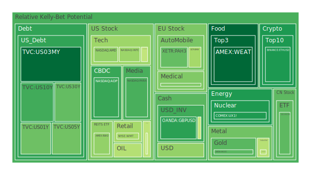
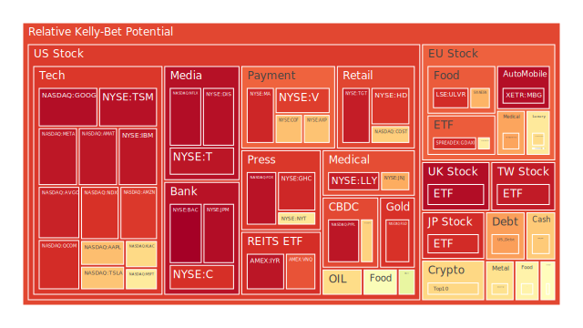
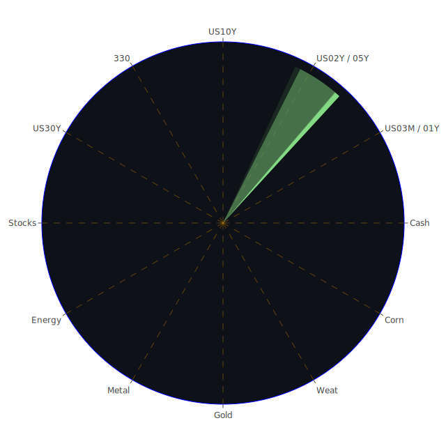

# 導論：三位一體（Spatial、Temporal、Conceptional）的思考脈絡

在整體分析中，本文運用三個面向的交疊：

1. **Spatial（空間）**：著眼全球資產分散度、區域經濟體之間的互動、各國宏觀政策與地緣新聞事件的影響。  
2. **Temporal（時間）**：關注市場的即時動態、中短期震盪與長期趨勢，並檢視資金流向如何沿時間推移，影響資產的風險程度與泡沫積聚。  
3. **Conceptional（概念）**：綜合經濟學、社會學、心理學、博弈論以及歷史模式，試圖在市場情緒與理性面間取得觀察平衡，剖析集體預期如何塑造漲跌循環、如何影響資金配置，以及各種資產彼此之間傳導的可能機制。

透過上述三位一體的視角，輔以新聞事件對市場的正面與負面衝擊分析，並採用「正—反—合」的思維方式，把不同理論和資料彙整後再行歸納，以期在保留不同假設空間的同時，歸結出相對合理的結論或假說。本報告中對於各資產的「泡沫風險分數」（D1、D7、D14、D30等）以及技術或基本面數據，亦將盡量放入敘述背景，以防忽視任何潛在高風險的可能。

---

# 投資商品泡沫分析

以下依序針對多項重要資產類別進行概觀，並引用當前新聞事件與過往類似場景之觀點。所有的「symbol」在撰寫時皆省略了券商名稱部分（例如只提「TSLA」，不再寫「NASDAQ:TSLA」）。同時會於分析間提到多日累積的泡沫指數走勢與對於資產風險之影響。

## 1. 美國國債
美國國債近期收益率走勢存在明顯曲線變化。根據資料，1Y、2Y、5Y、10Y、30Y等殖利率在2025年初維持在4-4.8%區間上下浮動。從Temporal角度來看，去年此時美國短期國債殖利率曾飆至5%以上，但現今略降至4.1-4.2%左右，顯示市場對於FED未來緊縮腳步轉為觀望。同時，最新FED經濟數據裡顯示Reserve仍處於較高水位，Money Market Funds亦持續走高，顯現資金偏好風險較低的工具。  
反觀新聞面，總體政治消息顯示特朗普（Trump）宣布凍結某些撥款與關稅威脅的新聞一度帶來對國債的避險需求，但隨後因法庭阻撓而暫時撤回。從Conceptional立場（尤其是博弈論）觀之，若這樣的反覆政策操作導致市場避險情緒升溫，美國國債反而有機會成為資金淨流入標的。但也需警惕長端債市的泡沫積聚可能：長天期（10Y、30Y）殖利率相較短天期利差出現部分正值，雖然比去年深度倒掛更緩解，但潛在經濟放緩仍未完全解除。  
回顧相似場景，2007年前後因資金氾濫、風險偏好高昂，長短天期利差維持扭曲，後續誘發金融海嘯。如今的泡沫風險指數在D1、D7、D14數值雖不同，但仍應保持謹慎。對於保守投資人，短天期國債可視為較穩定的配置，但需留意一旦通膨或景氣轉向，長天期國債價格波動或許會更大。

## 2. 美國零售股
美國零售股如WMT、TGT等，近幾日泡沫分數呈現中度偏高走勢。例如WMT的D1約0.65，TGT在0.94上下浮動，顯示市場存在一定的泡沫疑慮。從Temporal面來看，零售股在聖誕及年終假期後，銷售大多已反映於財報，接下來市場聚焦於各公司對未來消費力道的展望。  
新聞層面則顯示，部分民眾對總統關稅政策表示憂慮，可能影響進口商品成本，導致零售成本結構波動。歷史上，當2002年美國實施鋼鋁關稅時，零售業邊際利潤確曾受影響。若類似狀況再度出現，則零售股後續利潤預估恐下修。雖然部分大型零售商(WMT等)財務結構穩健，但在「博弈論」層面上，市場參與者也會相互競爭下調價格，增加經營風險。  
然而，社會學與心理學角度顯示，若消費者開始信心不足、縮減支出規模，零售股往往走弱。此時能否利用優惠與品牌力加大市場占有率是關鍵，否則恐面臨價值面持續遭到壓抑。

## 3. 美國科技股
在科技股領域，尤其以MSFT、AAPL、GOOG、META、TSLA等最受矚目。根據新聞，部分公司財報不如預期，例如微軟雲端成長指引令人失望，蘋果iPhone銷售亦遭遇中國需求下滑的壓力，導致股價短期回檔。  
然而，同一時間，也有消息指出Meta在元宇宙以及AI方面投入加大，華爾街對此持兩極看法：一方認為大手筆投入AI可持續吸引資本，另一方則擔心過度投資使財務槓桿惡化。回想2000年網路泡沫時期，科技公司靠大量燒錢維繫概念，但現今更強調實質利潤的時代，若未能在中短期展現明顯回報，股價容易面臨高估下的回調壓力。  
此外，特斯拉（TSLA）雖在最近季度財報遜於預期，但在新聞中又出現CEO對未來自動駕駛和新車型的積極發言，股價一度翻揚。這種「樂觀預期—現實財報」的拉鋸，正是科技股泡沫與投資人期望之間的博弈。近幾日的D1泡沫分數常見在0.70以上，顯示市場對科技股的風險情緒偏高。

## 4. 美國房地產指數
美國房地產相關指數（如RWO或VNQ等）在前期曾出現因利率高企而使房市交易量下降、價格漲勢趨緩的情況；不過資料顯示利率開始小幅回落，可能帶動買方需求再度增溫。然而，Fixed Mortgage 30Y Rate尚在6.95%附近，遠高於以往2-3%的超低利率時代。  
從歷史經驗來看，2006-2007年的次貸危機就與過度槓桿的房貸市場息息相關。雖然目前銀行端對貸款審核嚴格度有所提升，且不見大規模次級房貸證券化，但在金融壓力或經濟放緩情況下，房地產市場依然可能面臨局部泡沫風險。另一方面，黑天鵝事件或政府政策變動也可能使房地產指數波動更加明顯。  
新聞層面看，美國國會對於財政預算與稅賦議題爭論激烈，若企業或民眾信心動搖，房地產需求可能再受抑制。故此類資產短期雖可能反彈，但中長期走勢仍要觀察實質購買力與資金供應面的支撐度。

## 5. 加密貨幣
比特幣（BTCUSD）在最近持續上攻，單價已突破十萬美元之高，ETH也在三千美元上下徘徊。根據泡沫指數顯示，BTC的D1約0.66-0.70的區間高檔，ETH則0.26-0.44之間，一旦市場出現流動性趨緊或監管打壓，短時間可能劇烈回調。回顧2017年底與2021年初的「加密狂熱」，每次大幅衝高後均歷經修正。  
新聞層面上，Binance在法國涉嫌洗錢調查的消息、某些國家對數位貨幣的稅務加壓，都可能拉低投資人信心。不過，加密市場也常常因大戶與散戶心理博弈而出現反直覺行情。歷史上，加密貨幣反覆出現「狂飆—大幅回調—重新建構共識」的循環。對中長期投資者而言，需要評估對區塊鏈技術或代幣需求的實質支撐。若純粹逐利，則高波動意味著高風險與高獲利並存。

## 6. 金 / 銀 / 銅
黃金近期受到避險資金和特朗普關稅議題影響，一度創下歷史高價，GOLD OIL RATIO與GOLD COPPER RATIO都處於高位。歷史顯示，當地緣政治緊張或貿易保護升溫，黃金往往受資金追捧。此時泡沫風險指數同樣需要注意：D1雖不算極端高，但連續幾週維持高檔，不排除情緒退潮後金價有快速回吐風險。  
白銀雖與黃金同屬貴金屬，但用途不同，具備工業屬性；銀價常受到工業需求與投機熱絡雙向牽動。銅則更直接反映製造業景氣。若未來經濟放緩，銅價可能壓回。歷史上2008年金融海嘯爆發後，銅價曾自高位急跌。故此三者作為避險、防禦或產業資源用途都有其關聯，但在價格高檔時，亦隱含投資人的情緒性推升。

## 7. 黃豆 / 小麥 / 玉米
農產品（特別是黃豆、小麥、玉米）不僅受天氣與季節週期影響，也深受國際貿易與地緣政治干擾。若特朗普的關稅措施擴大到農產品，出口市場將面臨波動，尤其美國大豆對部分國家之銷售佔比可觀。  
目前WEAT（小麥）和CORN（玉米）的D1在0.17-0.63之間擺盪，說明投資人對農產品的泡沫擔憂不及股票或加密貨幣般高漲。然而，一旦天候因素或政策干擾（例如出口禁令）突然爆發，短期價格可能劇烈波動。歷史上一旦出現極端氣候，如2010年俄羅斯大旱導致小麥價格飆漲，這種事件會引發食物通膨，進而產生社會衝擊。

## 8. 石油 / 鈾期貨UX!
原油價格近期在70-73美元每桶之間震盪，官方數據顯示需求受到全球經濟前景動搖所影響，儘管OPEC仍在調整產量。以Temporal角度分析，短期內若地緣衝突升溫或供需失衡，油價仍可能急漲；但若全球經濟持續放緩，長期看漲力道不足。  
鈾期貨UX!相對較為冷門，價格自高位小幅回調後仍維持在69-70美元上下。由於核能議題近年受到環保與能源安全討論，部分國家正重啟或擴大核能計畫，形成鈾需求的潛在動力；然而，過去日本福島核災、德國退出核能的歷史亦顯示，政策改變會影響鈾需求走向。投資該標的需審慎面對政治與環保風險。

## 9. 各國外匯市場
最近外匯波動顯示美元指數維持一定強勢，但各貨幣對美元的變化不一。資料顯示GBPUSD在1.24上下，EURUSD約1.04，USDJPY達到154附近。儘管FED暫緩大幅升息，但全球仍面臨不確定性，市場在縮表等動作下，美元整體趨穩。  
而若特朗普執意發動關稅戰，亦會衝擊加元、墨西哥披索等，使得地區經濟更動盪。過往2018年中美貿易摩擦時期，離岸人民幣（CNH）也曾迅速貶值。故外匯市場不僅要看基本面利差，還需要注意突發政治風險。

## 10. 各國大盤指數
美國三大指數（NDX、JPN225等）高位震盪，歐洲（FCHI、GDAXI、FTSE）同樣面臨企業獲利與通膨疑慮的交織。近幾日新聞透露歐洲在奢侈品領域雖有部分利多，但德國經濟數據顯示動能趨緩，法國方面則因可能稅改令企業觀望。英國Brexit後的關稅問題導致旅遊支出與整體消費面顯示不安。  
日本方面（JPN225）則持續衝高，甚至超越年初預期，推測與弱勢日元助攻出口、寬鬆貨幣政策尚未全面轉向等因素有關。須留意若未來BOJ（日本央行）調整利率政策，是否會導致資金出現明顯回流或拋售。

## 11. 美國半導體股
半導體板塊包括NVDA、AMD、INTC、KLAC、AMAT等，對市場的科技景氣有領頭指標意味。新聞顯示Nvidia雖在AI晶片上具龍頭地位，但成本飆升、需求增長放緩疑慮，使股價高位震盪。記憶體廠商Micron（MU）也因需求週期調整而時有業績壓力。  
類似2018-2019年半導體週期下行時，股價曾出現大幅度修正。如今AI題材令投資人保持熱度，但泡沫分數普遍偏高，市場對業績能否真正落實的質疑聲不斷。投資人若看多該產業，需留意特定公司在擴產、競爭格局及地緣晶片供應鏈爭端等面向。

## 12. 美國銀行股
銀行股如JPM、BAC、C等，2025年初在高利率環境下，利差收入增厚，但另一方面也面臨房貸與消費貸款可能的違約風險上升。資料顯示，美國的Charge-off Rate（信用卡呆帳率）及消費者違約指數均處於相對高檔。若經濟下行或失業率升高，銀行資產品質恐受影響。  
新聞提到總統凍結部分聯邦撥款之舉被法院暫停，給金融機構留下短暫寬慰，但金融股表現仍取決於經濟大環境。回顧2008年金融危機的慘痛教訓，銀行股估值常在好時候看似便宜，但經濟下行時可能面對風險陡增。

## 13. 美國軍工股
NOC、LMT、RTX等軍工類型股票往往與地緣政治、政府國防預算密切連動。近期雖然新聞暗示政府可能有預算爭議，但中東與歐洲部分地區衝突持續，替軍工產業帶來潛在支撐。  
歷史數據顯示，每當全球安全局勢緊張，例如海灣戰爭或冷戰後期，都會帶動軍工類股走高。但若預算削減或衝突趨於緩和，短期內可能回跌。博弈論角度看，每個國家都不願在軍備上處於劣勢，軍工股長期或有支持，只是政治波動使該板塊短期易遭轉折。

## 14. 美國電子支付股
電子支付相關公司如V、MA、PYPL等，受惠於全球消費往線上化移動，加上各式FinTech興起，帶來交易量成長。不過新聞顯示Visa雖於假期檔期受益，但市場對之後經濟環境轉弱有所擔憂；Mastercard同樣面對商戶費用與消費者信心問題。  
回想過去網路普及階段，電子支付股維持高成長，並且具備壟斷與高門檻優勢，但一旦出現新技術（如區塊鏈支付、數位人民幣等）或反壟斷監管，都可能導致估值壓縮。從泡沫指數看，V與MA近期D1約在0.90以上，已是高檔區域，需小心踩踏風險。

## 15. 美國藥商股
包含MRK、JNJ、NVO等大型藥廠，常被視為防禦性質資產。然而，若政策端對藥價進行壓制，或者突發藥證、專利爭議，也會重創整體行情。近期新聞顯示，MRK財報平穩，但JNJ則受企業併購或裁員消息干擾，股價曾出現短暫下挫。NVO因糖尿病新藥需求強勁而保持高估值，但估值過高的風險在歷史上也不容小覷。  
1980年代以來，生技和藥廠在美國經常獲得政策支持，但市場常高估研發成果帶來的利潤，最後有時泡沫化。投資人仍需判斷該企業的管線含金量及研發成功率。

## 16. 美國影視股
指標公司如DIS、PARA、NFLX、CMCSA等。流媒體戰爭激烈，Netflix靠AI演算法與大量原創內容穩定擴張，用戶付費動能成為焦點，財報時常影響股價劇烈波動。迪士尼則面對主題樂園與串流平台的雙重挑戰。若經濟衰退壓力增強，消費者娛樂支出縮減，該產業即不免受衝擊。  
從歷史相似場景可見，經濟景氣走弱時，影視娛樂開支雖不會歸零，但成長趨勢會放緩，並遭受內容製作成本攀升的壓力。新聞亦顯示某些電影公司面臨罷工或成本超支，容易造成不確定性。

## 17. 美國媒體股
此處常和影視股有重疊，但傳統媒體公司如NYT、FOX等，近期在市場中有其獨特風險：廣告收入易受經濟景氣影響，且在數位化與訂閱模式轉型中，成敗關鍵取決於訂閱量和廣告主意願。  
歷史上，媒體板塊曾因廣告市場大幅下滑而慘遭重創（例如2008-2009金融風暴時）。如今泡沫分數顯示FOX較高，NYT則中等。若政治風向或法規改變（如對媒體壟斷的限制或對社交媒體競爭的開放）可能帶來結構性衝擊。

## 18. 石油防禦股
此類公司往往同時涉足石油開採、煉製或相關服務，收益受油價波動掌控，也受地緣政治影響。若原油價格保持在70美元以上，石油防禦股大多能穩定獲利。然而，若再爆發經濟衰退，需求下滑可能影響整體營收。  
回顧1991年海灣戰爭與2003年伊拉克戰爭期間，油價飆升帶動石油產業蓬勃，但戰事結束或經濟放緩後，股價亦可能快速回吐。石油防禦股看似穩健，但要留意國際政策干預（例如制裁或減產協議）的不確定性。

## 19. 金礦防禦股
金礦公司在黃金價格走高時往往股價領漲；與黃金現貨相比，金礦股因槓桿效應波動更大。歷史上，金價爆衝時，金礦股能享受倍數成長；但若金價反轉，也可能深跌。例如2011年金價見頂後，金礦股修正幅度更為慘烈。  
在通膨高漲或政局不穩時，金礦股是典型避險資產。2025年初在關稅、政局緊繃等消息面下，金價攀高帶來金礦股機遇，但需小心的是：金礦開發本身還涉及環境爭議與產能成本，若開發延誤或政變，亦易造成鉅額虧損。

## 20. 歐洲奢侈品股
LVMH等公司在疫情後持續拓展北美及亞洲市場，新聞提到其CEO考慮在美國擴大生產線。然而，歐洲奢侈品今年承擔了歐洲經濟疲軟和中國市場波動的雙重壓力。雖然高端消費者不易受小幅經濟波動影響，但若地緣摩擦升溫或稅改不利，歐洲奢侈品股仍可能震盪。  
2015-2016年曾因中國反腐浪潮，奢侈品銷售短期重挫，也對全球該板塊帶來衝擊。現今若全球政治氛圍再次趨嚴，也應警惕高端品牌反覆洗牌的風險。

## 21. 歐洲汽車股
德國汽車公司如BMW、MBG等，泡沫指數顯示近來D1約0.42-0.97不等，波動頗大。電動車轉型、國際貿易關稅與能源危機的疊加，使歐洲汽車產業前景不明朗。  
2008年全球金融危機時，汽車行業大受衝擊，一些公司靠政府紓困方案生存。現今雖然經濟結構有差別，但若關稅壁壘持續升高或地緣政治造成供應鏈緊張，汽車板塊依然脆弱。

## 22. 歐美食品股
可涵蓋KHC、KO、NESN等企業。食品業屬於偏防禦性質，一般較不易受經濟週期劇烈影響。然而，新聞與資料指向原物料成本、運輸費用、關稅的影響在2025年初仍存在。即使企業具定價能力，也可能因內部結構或通膨而產生利潤壓力。  
回想過去經驗，食品股若通過多元併購或品牌優化，能維持一定獲利，但市場氛圍若轉向極度保守，仍須留意估值過高之風險。

---

# 宏觀經濟傳導路徑分析

1. **政策與地緣政治**：特朗普揮舞關稅大旗，帶動全球對進出口產品成本與供應鏈中斷的恐懼。歐洲與中國等地可能相互採取報復措施，外貿萎縮之下，大宗商品價格與全球股市同受衝擊。同時，美國聯邦預算或撥款凍結的政治動盪，也令國內外投資者產生憂慮。  
2. **貨幣政策**：FED雖然暫時停止升息腳步，但縮表與資金成本高企尚未完全結束。全球其他主要央行（歐洲央行、英國央行、日本央行）若陸續放鬆或改變貨幣政策，匯率與資本流向會立即受到影響，進而牽動各國大盤與相關資產估值。  
3. **通膨與消費力**：若經濟放緩且通膨率仍在較高水準，實質消費力容易下降，零售、餐飲、旅遊等行業營收受挫。企業獲利下滑則影響股價，銀行貸款呆帳率也上揚。

---

# 微觀經濟傳導路徑分析

1. **企業獲利與產業鏈**：電子支付、科技股、半導體等依賴研發與消費市場動能的企業，若財報展望不佳，股價承壓，可能蔓延到相關供應鏈（設備、零組件、軟體服務）。  
2. **就業市場與薪資**：若科技或金融業因獲利壓力而裁員，就業市場惡化，進一步降低消費意願，形成負向循環。房地產交易量或房價也因此下滑，影響建築、家電、零售產業。  
3. **消費者信心與心理**：社會學與心理學的觀點揭示：若媒體與社交平台充斥負面衝擊，新一輪恐慌情緒可能被擴大，導致過度拋售。相反地，若政府釋出利多或好消息，或像AI新技術題材導致市場過度樂觀，也易引發炒作泡沫。

---

# 資產類別間傳導路徑分析

1. **股債聯動**：一旦股市風險攀升，資金可能流向短期國債、黃金或貨幣市場基金，以躲避波動；但若對衰退預期加深，也可能打擊高收益債或長天期債的價格。  
2. **商品與貨幣**：原油價格走高會推升產油國貨幣、拉抬通膨預期；若加密貨幣大漲則顯示投資人風險偏好增強，傳統避險資金或從黃金流向比特幣，也可能造成金價壓力。  
3. **地緣衝突**：例如軍工股與能源股容易同向波動，但若衝突擴大，整體股市又可能全面修正。奢侈品股、觀光相關股也會因旅遊限縮或高端消費緊縮而下跌。

---

# 投資建議

以下建議只是為了提供思路參考，並非保證獲利。面對波動與泡沫風險，投資人應衡量自身風險承受度。

## 一、穩健型組合（總計 100% 之中的 30% 配比）
1. **美國短天期國債（10%）**：短期殖利率仍不錯，風險較低，可作為避險基礎配置。  
2. **大型藥商股（10%）**：如MRK或JNJ，雖有泡沫分數，仍屬防禦性板塊，建議佔小部分。  
3. **黃金現貨或金礦防禦股（10%）**：金價處於高位，但遇政治經濟不確定性可發揮保值功能。需避免過度集中，金礦股波動較金現貨大。

## 二、成長型組合（總計 100% 之中的 40% 配比）
1. **半導體龍頭（15%）**：聚焦AI、高速運算需求，如NVDA、AMD或KLAC，但避免重倉。  
2. **電子支付（15%）**：如V、MA，長期電子支付趨勢成長性仍存在，但現時估值偏高需分批切入。  
3. **歐洲奢侈品股（10%）**：雖有歐洲經濟放緩疑慮，但頂級奢侈品牌全球市佔較穩，可博取中長線成長。

## 三、高風險型組合（總計 100% 之中的 30% 配比）
1. **加密貨幣（10%）**：BTC、ETH等，波動極高但長期潛力與題材不斷。需嚴格控制部位。  
2. **美國科技成長股（10%）**：例如TSLA或中型新創型公司，因激進研發及高速成長，伴隨泡沫風險。  
3. **鈾期貨或核能概念股（10%）**：政策與能源轉型趨勢下具有想像空間，但也受地緣與安全議題牽制。

在以上三大類（穩健30%、成長40%、高風險30%）組合配置中，嘗試透過多元資產與不同行業的搭配，讓彼此之間的相關性不至於完全正相關，並尽量控制在-0.5到0.3的區間，使市場波動時能降低單一劇烈風險衝擊。相位角度盡可能分散至120度以上，有助緩解系統性風險。

---

# 風險對沖的漣漪效應傳導路徑

根據「資訊航母表格」中三位一體的正反合思考，我們可嘗試整合兩兩驗證結果，並推衍可能的傳導路徑：

1. **美國國債 ↔ 美國科技股**：當科技股過熱，若財報或監管風險突發，投資人轉進國債避險，國債殖利率短期下跌（價格上升）。反之，若FED再度暗示寬鬆，利率下行，科技股又獲得一波資金青睞。  
2. **加密貨幣 ↔ 黃金 / 石油**：全球動盪加劇或法幣政策壓力大時，部分資金湧入比特幣作「數位黃金」，同時傳統黃金也走強。但若監管單位打擊加密市場，資金或回流實體黃金與其他避險資產，令加密貨幣大跌。  
3. **美國零售股 ↔ 歐洲奢侈品股**：若美國關稅措施實施，歐洲奢侈品在美國市場的售價上升，或壓抑需求；而美國零售商也面對進口成本提高。兩者之間彼此競爭與替代效應，加上全球購買力轉移，構成不對稱風險傳導。  
4. **石油 / 鈾期貨 ↔ 半導體 / 軍工**：地緣衝突可能同時推升油價與軍工股走勢；半導體供應鏈則可能受能源與關鍵礦物短缺影響。若核能擴張政策出爐，鈾期貨需求看漲，然後軍工支出亦可能擴大。但若政治風向逆轉，該傳導路徑也會反向壓制。

在整個「漣漪效應」中，風險對沖取決於各資產對相同事件的不同反應，善用低相關度或負相關度之組合，可以在市場震盪時降低組合波動。

---

# 結論與投資建議總結

1. **多元分散**：不論對衝或長期布局，須兼顧國債、黃金、股票、商品與外匯等多面向標的，才能在情緒突變或政策轉折時及時止損或調整。  
2. **關注泡沫風險**：科技、加密、部份半導體股正處於高泡沫分數，短線上易受財報與消息面放大。對於加密貨幣與高成長科技公司，若資金有限或風險承受度較低，建議控制倉位。  
3. **短期波動預期**：特朗普關稅政策與全球地緣政治脆弱性，使得市場利多利空交織，建議存留一定現金或類現金部位，以應對突發下跌。  
4. **中長期趨勢**：AI、數位支付、核能轉型等大趨勢仍具發展潛力，對於能堅持長期觀點者，可分批佈局，但要嚴防炒作極端化、避免懷抱不切實際預期。  
5. **注意歷史教訓**：2000年科技泡沫與2008年金融危機皆顯示：資本市場走勢往往先脫離基本面後又劇烈修正。有些防禦性標的雖能在動盪中提供緩衝，但一旦出現重大政策或系統性崩盤，無資產能完全獨善其身。將風險分配到多個領域是常見的理性之舉。

---

# 風險提示

投資有風險，市場總是充滿不確定性。本報告中所提出的假說與觀察，均以歷史數據、最新新聞以及多方理論為參考，並非對未來走勢的絕對保證。投資者應根據自身的財務目標、風險承受能力及投資期限，審慎評估並做出獨立決策。特別是在高泡沫風險領域，如科技股、加密貨幣或槓桿型衍生品，任何突發的政策或流動性變化都可能引發重大損失。建議持續關注資產市場相關指數的變動及各國政策訊號，亦需留意地緣政治與經濟週期的交互影響。

 
Daily Buy Map:

 
Daily Sell Map:

 
Daily Radar Chart:

 
