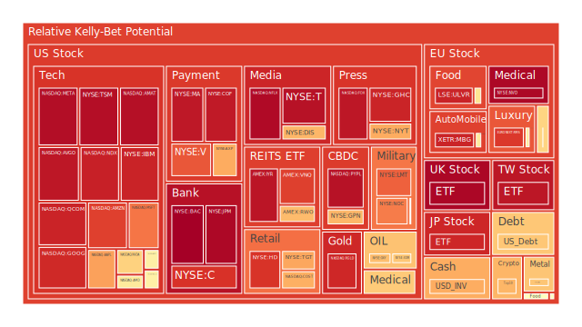

# **一、投資商品泡沫分析**

（為維持結構清晰，以下依序列出各大資產之最新風險與可能泡沫跡象。）

## 1. 美國國債
過去一年來，美國國債收益率曲線不斷震盪，近期一至二年期國債收益率下滑至約4.2%上下，十年期維持在4.5%出頭，而三十年期在4.7%至4.8%高檔區域。根據部分短期泡沫指數顯示，日級別（D1）風險分數在過去數日一度降至約0.02-0.03區間，但週期平均（D7、D14）則維持在相對偏高或中高水位。此現象暗示市場對於短線利率走勢仍有較大關注，而長天期部分因通脹預期與財政狀態等因素，令市場對美國長債風險保持一定警戒。新聞層面，近期白宮消息再度提及對北美、亞洲若干進口品實施關稅，使得債市對政經干擾高度敏感。另外，歷史上對沖需求常使美國國債成為避險熱點，但亦可能因市場對聯準會後續貨幣政策態度出現分歧，而在較短時間內放大波動。經濟學與博弈論角度預示，當市場對未來衰退或高通脹路徑出現分岐時，長短天期利差會經歷反覆修正；社會心理層面也常在此時產生集體「避險為先」與「觀望持有」的糾結。綜上所述，美國國債依舊擔當全球資金避險角色，但利率與泡沫風險指數皆顯示短期尚難回歸絕對安全的舊有基準。

## 2. 美國零售股
新聞面傳出部分零售商如Levi或某些服飾相關企業的財測不如預期，同時大型量販店也面臨庫存管理與營運成本上揚的挑戰。在泡沫數據方面，一些零售類股（如WMT等）之D1風險分數雖稍有回落至0.4-0.6間，然而兩週甚至一個月平均（D14、D30）仍維持在相對較高水平，暗示投資者對零售消費力道與企業盈餘能否支撐未來股價仍有疑慮。歷史案例顯示，零售業在景氣下行或民眾消費習慣急遽轉變時，獲利會大幅波動。心理層面，投資者傾向追逐大幅折扣、尋找相對低估，但經濟學與博弈論則提醒，真實需求萎縮時，折扣與促銷僅是短期手段，長遠難免影響盈收。需留意目前市場通脹尚未完全穩定，若整體消費信心轉弱，零售股後續的獲利預測仍可能承受壓力。

## 3. 美國科技股
近期多檔科技龍頭公佈財報，有些雖超越市場預期，如Meta展現AI領域強勁資源投入，但其他巨頭如微軟、特斯拉則在成長幅度與邊際獲利呈現雜音。市場一方面擔憂擴大投資AI所帶來的短期成本增加，另一方面則憧憬未來AI創新或自駕等技術成熟後的巨大潛力。泡沫風險指數中，一部分高成長股D1值已上沖到0.7-0.9，甚至接近1，表示短線炒作與資金湧入迅速。然而D30值也顯示部分科技類股的本月風險水準逐步走高，顯示市場對於高估值有所疑慮。歷史案例例如2000年科網泡沫與2021年疫情後的科技狂潮，都展現了當市場過度憧憬某項新技術時，股價常被推至脫離基本面的水平。社會心理層面，投資者易追逐「新趨勢」；博弈論則暗示領先佈局者亦可能先行獲利了結，帶動波動加劇。故美國科技股雖具潛力，但須提防過熱跡象。

## 4. 美國房地產指數
固定房貸30年利率升至近7%上下，對房市需求形成抑制。數據顯示，部分房地產ETF的D1風險指數已降至0.8以下，但月平均仍相對頑固在0.6-0.7間，顯示市場對美國房地產前景尚存不安。新聞層面，聯準會暫時凍結升息或維持利率不變並不代表貸款成本會迅速回落；同時，就業市場若遭遇企業裁員，房市需求可能持續疲弱。歷史經驗顯示，美國房市自2008年金融海嘯後一度長期復甦，但疫情推升房價過快，後續若通脹與貸款利率同時居高，需求面勢必轉弱。博弈論可見：在房市成交急縮時，賣方通常不願大幅調降要價，而買方則試圖等待更優惠價格，導致成交量下滑，流動性進一步惡化。整體而言，美國房地產指數當前不算絕對泡沫，但風險端不可輕忽。

## 5. 加密貨幣
比特幣、以太幣在近期價格一度大幅攀升，然而波動仍甚劇烈。比特幣當前價格已突破10萬美元大關（部分交易平台的報價），但新聞報導指出交易所面臨法規、洗錢調查等負面因素，特別是法國對某家大型加密交易所展開洗錢調查，為市場帶來短期擔憂。從泡沫指數來看，比特幣與其他加密幣短期日級（D1）風險雖一度出現放緩，但兩週到一個月區間（D14、D30）依然居高不下甚至逼近0.6-0.7以上。歷史上，加密資產的狂熱與崩盤周期反覆出現，多受投資者情緒驅動。經濟學層面，加密貨幣尚缺乏穩定的現金流與基本面支撐；社會心理學層面則強調群體追漲的FOMO（怕錯過）效應；博弈論觀點也認為早期布局者可能隨時釋出籌碼，引發大幅波動。持有者應高度注意流動性與法規政策風險。

## 6. 金 / 銀 / 銅
全球政治風險及對大宗商品的地緣需求，推動金價一度再創新高，近來金價對油價比率亦升至37-38左右，較去年同期顯著上升。金的D1風險分數略呈上移，但D30平均變動相對持穩，顯示市場對金的長線避險功能仍存期待。銀亦呈現跟漲現象，但波動更大，短週期D1、D7數值曾衝破0.75。銅方面則受國際貿易趨勢所左右，一旦全球製造業需求放緩或關稅衝擊，銅價亦難獨善其身。歷史上金在地緣衝突、高通脹時常獲資金青睞，銀因工業及投機需求兼具，漲跌幅度更甚；銅則對景氣循環敏感。當前新聞提及俄烏以及中美關稅政策反覆，亦讓金屬市場人心不安。

## 7. 黃豆 / 小麥 / 玉米
近期農產品市場受地緣政治及氣候變遷影響不斷。黃豆、小麥、玉米價格分別受到糧食安全與天候影響，各自變動。觀察泡沫指數顯示，小麥的D1約在0.15-0.17區間徘徊，稍有上升。玉米與黃豆ETF的D30值則徘徊在0.5上下，顯示投資人對於農業周期的預期尚不穩定。新聞面提及巴西或阿根廷等南美國家糧食產量增長，以及北美某些地區糧食減產的對沖作用，令國際農產品價格波動更激烈。歷史上，因天災或地緣衝突導致糧價飆漲的情形屢見不鮮，社會心理層面則常在糧食危機時產生恐慌搶購。投資人若參與農產品衍生品，務必注意實際運輸、倉儲與政策風險。

## 8. 石油 / 鈾期貨
石油市場持續留意供需博弈：OPEC+減產與美國戰略石油儲備動態皆可能帶來價格波動。近期新聞指出白宮若對部分國家開徵新關稅，是否排除石油尚未明確，但油價隨消息一度小漲後回落。泡沫指數來看，石油短期（D1）風險約在0.59-0.60之間，但週期或月均（D7、D14、D30）數值略有回落，表示市場對石油泡沫的擔憂暫時減輕。鈾期貨UX!在綠能轉型與核能話題帶動下，關注度有所提升，但流動性偏低且消息面刺激大。長期來看，若各國重新強化核能布局，鈾價格可能提升，但因政治與安全層面爭議尚多，仍屬高波動品種。

## 9. 各國外匯市場
近期美元指數在關稅與避險需求下時而走強，然而若美國國內政治風險升溫，或通脹、赤字問題再現，也可能使美元後勁不足。歐元區面臨ECB可能進一步降息的傳言，英鎊則觀望英國通脹與脫歐後衝擊延續，日圓在日銀是否轉向正常化政策的猜測中上下搖擺，澳幣與加拿大幣則受商品價格與中美需求影響。近期消息顯示，加拿大幣出現連續多月疲弱走勢，因美加關稅談判及油價不穩牽動市場。外匯泡沫風險通常不如股市明顯，但在地緣衝突與政策大幅波動時，各國匯率仍可能面臨急升急貶。

## 10. 各國大盤指數
歐亞各主要大盤指數近來漲跌互見。部分歐洲指數，如法國、德國，對全球景氣循環與區域地緣政治的敏感度高，一旦關稅政策或能源議題升溫，指數容易大幅擺動。新興市場如中國大陸、東協國家等亦受整體外貿壓力影響。觀察泡沫指數，歐洲某些大盤D1值已逼近0.9，但也有月平均相對下降的情形，顯示外資對歐洲資產仍是短炒為主。台灣或韓國等科技輸出型市場，因AI供應鏈話題和半導體循環，指數變動同樣具高波動特質。歷史上，若全球出現明顯衰退跡象，大盤指數往往會先行反應；在政治爭端延燒時，市場情緒面亦能顯著影響股市。

## 11. 美國半導體股
半導體是美國科技領域的重要支柱，包括Nvidia、AMD、Intel、Micron等公司近期財報各異。AI晶片需求雖增長迅猛，但硬體製造成本也同步上揚，且顯示卡與伺服器晶片之毛利率波動大。泡沫風險指數顯示，有些高成長半導體公司D1、D14均接近0.7-0.8以上，相對於其他類股更顯熱度。然而博弈論可見，如果市場對AI投資前景產生修正，此領域也可能面臨資金流出。歷史上，半導體景氣循環通常3-4年一輪，上漲期常見過熱一面，幾年後若需求飽和，股價將出現明顯回落。

## 12. 美國銀行股
銀行股近期面臨利率環境的複雜影響。存放利率上升雖能提高淨利差，但經濟放緩與貸款需求下滑又會抑制銀行整體獲利。數據顯示，美國多家銀行的D1風險指數接近0.9，月均則在0.79-0.92區間。新聞方面，聯準會不急於降息，但市場仍擔心未來若消費信貸或地產貸款違約率走高，銀行資產品質恐惡化。歷史教訓可見，每當經濟下行，銀行需面臨呆帳與資本充足率挑戰。社會心理層面也可能放大對銀行體系的恐慌情緒，一旦某家銀行出現流動性警訊，就易產生連鎖影響。

## 13. 美國軍工股
地緣政治對軍工產業營收具直接影響，從短期看，若國際衝突升級或國防預算大增，軍工股往往受惠。然而長期而言，政策走向一旦趨於緩和，軍工類股漲勢也可能消退。近期新聞面有關某些企業收購或軍售訂單傳言，但未獲最終證實。泡沫風險指數顯示，軍工股D1大約在0.49-0.55上下浮動，屬中等水準，但投資人仍須留意若大環境經濟轉弱，防務預算成為政治談判焦點時，可能產生預算刪減風險。相較過去歷史，本輪軍工行情可能更依賴特定地緣事件的刺激。

## 14. 美國電子支付股
電子支付行業在疫情後依然快速發展，但市場對支付龍頭的估值已相對高昂。近期財報大多顯示交易量增長，但AI、數位錢包、跨境支付等領域的競爭壓力加劇，導致營收前景難以完全準確預估。數據顯示，一些支付公司短期D1、D7風險值上衝至0.70-0.80區間，顯示資金對其高成長的追捧，但月平均（D30）也居於高檔。歷史觀點提醒，不少支付業者面臨科技風險、監管政策與資安問題。博弈論觀察，支付市場或許集中度會持續提升，兼併收購與價格競爭有機會持續。

## 15. 美國藥商股
醫藥板塊相對具防禦性，但也面對專利到期、研發成本、政策定價等挑戰。近期新聞有關FDA核准某些新藥物的正面消息，也有重大財測不如預期的負面聲音，使得藥商股走勢分化。泡沫指數顯示，多數大型藥廠D1、D7在0.2-0.5區間，屬較溫和風險，但亦有中型研發藥企D1飆至0.6以上，暗示投機資金傾向炒作短期研發消息。過往經驗顯示，藥企若關鍵臨床試驗受挫，股價常瞬間重挫；若拿到FDA重大批准，也可能迅速拉抬。此領域的預期心理與實際數據的差距往往相當大。

## 16. 美國影視股
影視產業因串流平台與消費模式改變而深度轉型。新聞面可以看到有些大型影視公司財測不佳，並裁員以壓低成本；也有流媒體龍頭在海外市場持續成長。泡沫指數觀察到影視板塊D1約在0.38-0.49區間，但D14、D30多在0.5-0.6以上，顯示市場對該行業長期營收模式仍有疑慮。歷史上，影視公司的獲利週期受大檔電影或電視劇IP成敗影響；社會心理學層面則看到觀眾品味快速轉變，新生代觀眾群對傳統電視或戲院依賴度下降，導致傳統影視營收壓力不斷。

## 17. 美國媒體股
與影視產業相似，媒體公司也面臨廣告收入衰退與數位轉型雙重壓力。近期有新聞指出大型媒體集團財報不及預期，主要因廣告客戶縮減預算。經濟學層面，當宏觀經濟走弱或企業增長放緩，廣告預算往往首當其衝。泡沫指數顯示，媒體股短週期風險分數仍處於0.6-0.7之間，表明市場對該產業未來獲利不確定性頗高。歷史上，媒體業隨技術革新而陣痛，若未能及時抓住新興平台的流量，就可能面臨快速凋零。心理層面也暗示，消費者的注意力無限分散，傳統廣告模式正在萎縮。

## 18. 石油防禦股
石油防禦型企業多半指那些垂直整合、上下游風險管控較佳的企業。他們通常在原油價格劇烈波動時，因下游煉油或銷售渠道穩定而維持一定盈餘。但若全球石油需求整體放緩，其股價亦可能面臨壓力。近期泡沫指數顯示，石油防禦股的D1約在0.50-0.60中段，月平均也無大幅上衝，顯示市場對這類股份預期相對理性。歷史經驗佐證：在油價高漲或地緣衝突時，防禦型企業可享受利潤；但若宏觀衰退加深，需求萎縮，油防禦也難以獨善其身。

## 19. 金礦防禦股
金礦企業常與金價高度正相關，亦具備部分防禦屬性。最近金價升勢推動相關企業股價，但同時生產成本、地理風險、政治風險亦干擾獲利水準。部分新聞顯示金礦公司積極擴產，但需注意各國採礦法規與環境保護考量。泡沫風險上，金礦股D1介於0.4-0.5，D30稍高於0.56，表示投資人抱持一定興趣，但未過度追捧。歷史上金礦股亦常伴隨金價劇烈波動出現大漲大跌。投資者須留意政治與勞動糾紛導致的停工風險。

## 20. 歐洲奢侈品股
歐洲奢侈品巨頭面向全球高端客戶，尤其仰賴中國、北美、中東等市場的消費能力。近期消息顯示歐洲某些奢侈品牌營收表現亮眼，但亦有對未來地緣政治、人民幣匯率、旅行規範放寬速度的顧慮。泡沫指數顯示，奢侈品類D1有時飆到0.5以上，但月均居於0.6-0.7，暗示價格雖高，但市場需求暫未有急速轉向的具體跡象。歷史上奢侈品在經濟逆風中仍能維持一定消費力，但若世界經濟大幅衰退，中產消費恐現萎縮，高端客群支撐力亦可能不足。

## 21. 歐洲汽車股
歐洲汽車業者在電動化轉型、供應鏈短缺、能源價格波動等因素交雜下，近來股價雖有反彈，但前景依舊不明朗。新聞指出某些歐洲車廠因中國電動車競爭壓力加劇，必須思考新的市場策略。泡沫風險觀察，這些汽車股的D1約0.47-0.58間，週期平均則略高於0.5，表示短線雖有炒作空間，但中長期風險依舊。歷史教訓顯示，歐洲車廠若遭遇全球關稅壁壘或電動車競爭烈度升溫，市場估值可能迅速下修。

## 22. 歐美食品股
食品類股兼具防禦與成長特質，但在通脹環境下，原材料和物流成本上漲會壓縮利潤。新聞表示部分食品企業能通過提價轉嫁成本，也有企業因市場競爭激烈而無法輕易調漲。泡沫指數顯示，食品業在D1約0.5-0.6之間，D30則無過度升溫，屬於中度風險。歷史上，食品類股多是抗衰退，但在極端通脹或政策干預（例如糧食管制、補貼等）下，也難免遭遇獲利壓力。心理層面上，食品需求相對剛性，但品牌與通路的競爭不容小覷。

---

# **二、宏觀經濟傳導路徑分析**

在Spatial（空間）層面，全球市場彼此交織：美國對加拿大、墨西哥、中國等國的關稅政策演變，往往透過全球供應鏈影響石油、原物料、貨幣、甚至股債市的流動性。不僅如此，歐洲與亞洲市場同樣觀望美國聯準會與白宮動向，引發資金快速跨境流竄。當外匯市場波動加劇，銀行體系安全與熱錢避險需求等變因，會同時牽動多個地區的資產價格。

在Temporal（時間）層面，短期聯準會利率決策或白宮臨時頒布新關稅，往往令金融市場在數週內產生大幅震盪；若時間拉長至季、年，實際經濟成長率、就業數據與企業獲利狀況則較能主導資產走勢。例如美國長短天期國債收益率或金銀價格，在一段時間後會回歸基本面，而非僅憑一時消息面操作。

在Conceptional（概念）層面，市場與新聞的「三位一體」：一是經濟學觀點下的供需關係與貨幣現象；二是社會學角度對集體情緒的渲染與媒體傳播效應；三是心理學與博弈論對投資者行為、風險偏好及信念蛻變的影響。當重大消息（例如大型企業財測崩盤或地緣衝突升溫）同時觸發市場恐慌，供給端、需求端與交易策略端會同步反應，導致波動拉大。

若將以上正反合整合，可見世界已進入高度互聯的市場結構，任何局部性事件都能透過避險需求、套利行為、政策回應的快速循環，在數小時到數週內擴散至全球範圍。當事件真實影響有限時，市場可能出現「反合」階段的理性回調；若基本面確實惡化，市場將進一步展開自我強化的下行風險。

---

# **三、微觀經濟傳導路徑分析**

微觀層面重在企業與消費者的行為模式。若企業面臨關稅或原料成本飆升，會壓縮獲利並可能裁員，影響民眾消費力，再反饋至零售、房地產或金融業等面向。消費者在新聞轟炸下，往往產生非理性決策：有些人因擔憂物價上漲而提前購買，另一些人則選擇延遲消費，以觀望價格回跌。這類行為變化透過供應鏈上下游，最終也會影響股價或商品期貨行情。例如，科技產品需求下滑會導致半導體公司減少投資，也讓設備供應商或地區房地產市場受到牽連。博弈論角度，企業可能同業聯合報價或進行策略競爭，進一步加劇市場波動。

---

# **四、資產類別間傳導路徑分析**

當美國國債收益率提升，資金往往從股票或其他風險資產流出，轉移到債市或貨幣市場；倘若地緣衝突帶動油價飆升，也會推升通脹預期並施壓債券價格，反饋至股市評價。若金價持續攀升，有時意味著市場風險意識增強，加密貨幣也可能吸引投機資金。然而，一旦加密市場遇到監管訊號收緊，投資人可能又回流傳統避險資產。這些路徑在Spatial與Temporal維度交織，借由各種新聞推波助瀾，形成牽一髮而動全身的環環相扣局面。

舉例而言，銀行股若因貸款呆帳率上升而承壓，恐影響市場對金融風險的評估，導致外匯市場出現劇烈波動，然後商品市場的投機力道也受影響，最終帶動科技、零售、地產等鏈式反應。這種「漣漪效應」從宏觀快速落實到各產業，也反映在各資產類別的相關性係數之變動。

---

# **五、投資建議**

在此環境下，運用風險對沖、降低高泡沫資產的集中度，並透過較低相關性或負相關性之標的進行分散，是策略關鍵。本文嘗試選出若干資產相位盡可能分散至120度以上，相關係數約-0.5左右，以達風險對沖之效。以下提出「穩健、成長、高風險」三大配置方向，三者合計總比重為100%。在每一類別中僅選擇三種子項目，並給出大致比例，供參考：

1. **穩健型（40%）**  
   - 美國國債：15%  
     - 由於當前收益率相對不低，且在金融市場振盪時債市仍可能吸納避險資金。  
   - 金或金礦防禦股：15%  
     - 高通脹及地緣風險下，金屬仍具傳統避險價值。金礦股雖有波動，但相對穩健。  
   - 歐美大型食品股：10%  
     - 食品需求較具剛性，防禦色彩凸顯，短期經濟波動影響相對小。  

2. **成長型（40%）**  
   - 美國科技股：15%  
     - 包含雲端、AI及電子支付等領域龍頭，雖風險上升，但長期技術突破可能帶來可觀成長。  
   - 半導體股：15%  
     - 受AI、5G、電動車需求帶動，短期雖震盪，仍可能為未來數年技術基礎。  
   - 歐洲奢侈品股：10%  
     - 中高端消費市場維持韌性，雖受地緣政治影響，但具有全球知名品牌優勢，擁有定價力。  

3. **高風險型（20%）**  
   - 加密貨幣：5%  
     - 高波動高風險，適合僅用少部分資金配置。政策環境存在不確定性，但若技術或法規突破，報酬不容忽視。  
   - 小麥 / 玉米等農產品期貨：5%  
     - 天候、地緣衝突等變數大，行情可能瞬間劇烈波動，但若糧價急漲，亦可能為對沖通膨風險。  
   - 美國零售股：10%  
     - 疫情後消費型態轉變帶來機遇，也伴隨經濟衰退風險，屬高Beta標的。若經濟重啟動能持續，可能有爆發力。  

此三種配置的總和約為100%，冀望通過空間與時間上的分散，達到風險對沖及穩健與成長並重的平衡。當然，投資者可因應自身風險偏好略調比例，例如將高風險壓低至10%，或是更青睞部分債券、黃金等資產。

---

# **六、風險提示**

1. **市場泡沫風險不可忽視**  
   以上多類資產的泡沫風險指數，包含D1、D7、D14、D30等指標，不少已達中高水位。任何超漲或熱錢推動，都有可能帶來猛烈回調。

2. **地緣政治與政策不確定性**  
   白宮關稅政策搖擺、歐洲地區局勢、俄烏戰事、中東緊張等皆可能瞬間升溫，激化全球市場波動。相關消息常導致資金在商品、外匯、股債之間快速切換。

3. **通脹與利率環境反覆**  
   雖有部分數據暗示通脹見頂，但官方數據不一定能即時反映供應鏈與企業成本結構。同時聯準會、ECB、其他央行的利率決策如有意外轉變，將嚴重影響資產評價。

4. **產業結構轉型與競爭加劇**  
   科技、支付、零售、媒體等行業迅速演進，一旦領先者技術突破，對落後企業影響巨大。投資人若只依賴歷史市占率判斷，恐失誤。

5. **流動性風險與槓桿危機**  
   若出現大規模多頭退潮或債務違約上升，部分衍生品與小市值標的可能流動性萎縮，無法及時脫手，甚至引發系統性衝擊。

6. **匯率與監管風險**  
   新興市場貨幣若大幅貶值，或加密資產監管環境急變，都會對投資組合的實際報酬產生巨大影響。需關注各國法規演變與金融制裁措施。

綜上所述，投資應秉持謹慎多元之策略，充分體察宏觀與微觀層面的各種傳導因果關係，也要適度關注市場情緒與心理動能。現狀並非決定性宿命，仍可在嚴謹風控之下尋找對沖與布局機會。然而，所有建議僅供參考，最終投資決策應因應各人風險承擔能力而定。

 
Daily Buy Map:

 
Daily Sell Map:

 
Daily Radar Chart:

 
