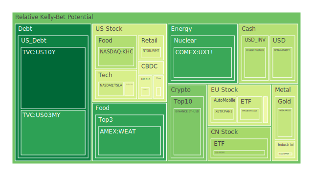
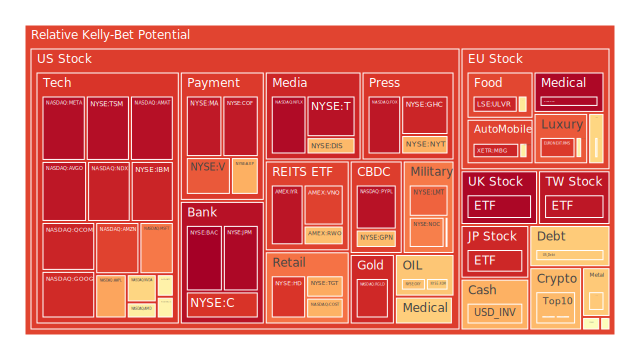
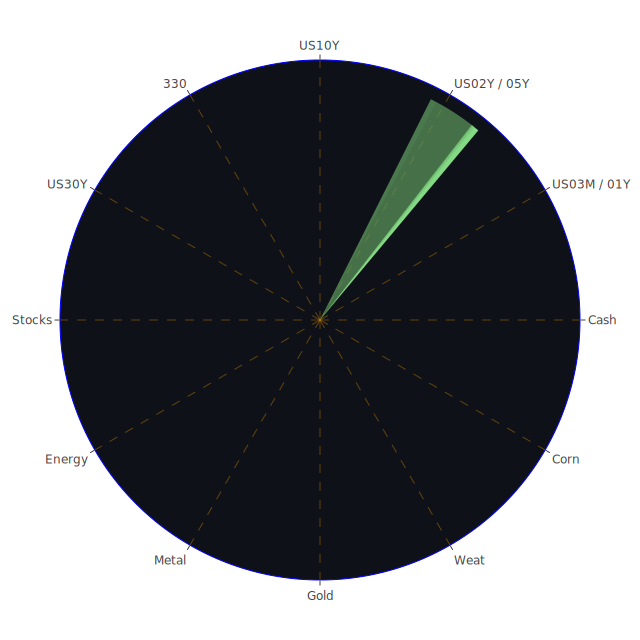

# 一、投資商品泡沫分析

在以下討論中，我們基於對多種金融資產的「泡沫風險指數」與現價（PP100）之綜觀，並佐以近期新聞、市場情緒與歷史面向，嘗試探究各資產正處於何種風險與估值階段。整合經濟學、社會學、心理學與博弈論，多角度分析其可能的價格走向，以及可能受到的政策或事件衝擊。同時，我們也將依據「三位一體」理論做正面假設、反面質疑與綜合結論，提醒讀者警惕任何形成泡沫的前兆。

## 1. 美國國債
- 在「時間」面向（Temporal）上，美國1年期至30年期公債殖利率雖略有震盪，但總體仍維持在4.1%～4.8%上下。其中，10年期殖利率日前約在4.54%，略高於上月4.52%，也高於去年同期的4.34%。5年期同樣在4.33%附近，顯示中期國債的殖利率走勢尚未出現明顯大幅下修。   
- 「空間」面向（Spatial）可觀察到美國國內與海外持有美國國債的結構：根據最新原始數據顯示，美國國債的整體流通量水位不高，但外國機構持有占比較高，可能產生一定的擔憂。結合新聞面來看，地緣政治或貿易政策的緊張波動，可能會衝擊外資的持債意願。  
- 「概念」面向（Conceptional）可從心理和博弈的角度理解：投資人目前對美國政府財政狀況及FED立場仍抱持一定的信任，但近期出現美國總統對外公布關稅政策、對通膨及就業市場的態度，也牽動市場對未來FED調整利率的預期。  
- 歷史上，美國國債在經濟不確定期間往往充當避險資產，但若FED過快收緊或地緣政治突生巨變，也可能造成殖利率極端波動。新聞顯示，目前美國政府在貿易上動作頻頻，以防堵通膨或另類地收緊市場流動性；這些舉措也提升了殖利率曲線波動的風險。  
- 綜合而論，國債相對泡沫風險偏低，但不能忽視通膨與財政狀況帶來的潛在衝擊。如果長端收益率持續攀升，價格就會回落，投資者需要留意潛在資本損失風險。

## 2. 美國零售股
- 近期美國零售股受到美國消費者支出動能以及政治面干擾的多重影響。根據新聞提及：「白宮將於週六執行對加拿大、墨西哥與中國的關稅，可能導致物流與成本壓力。」零售業體質相對脆弱者，若本已面臨通膨、庫存管理或需求不確定，則進口原材料或成品的關稅增長可能進一步壓縮獲利。  
- 在心理層面，投資人對零售業信心主要取決於實體店面銷售數據、電商平臺增長，以及季節性消費旺季（如年底購物季）的觀察。歷史上顯示，零售業在假期前若能顯示強勁銷售數字，可以帶動股價迅速反彈；但若通膨與利率走高，消費者也可能縮減可自由支配的支出。  
- 有新聞指出：美國零售龍頭公司對未來季度的展望偏向保守。有些零售股的泡沫風險指數已逐步升高（尤其在估值攀高時），同時部分股價波動劇烈。這類資產的風險並非來自單一財報不佳，而是通膨政策與國際貿易衝突疊加下的綜合性壓力。  
- 建議對零售類股保持審慎，並區分必需消費品零售（更具防禦性）與非必需消費品零售（更具週期性）之差異。若要佈局，可透過波段操作或避險手段納入投資組合。

## 3. 美國科技股
- 新聞層面可見多則負面訊息，例如「微軟雲端服務執行問題，蘋果iPhone銷售未達預期」等，對龍頭科技類股造成短期衝擊。同時也存在正面驚喜，如「KLA預期晶片製造工具需求堅挺」等利多。但目前負面消息佔比較大，影響市場對科技股的短期展望。  
- 大膽假設而言，若AI技術浪潮受到中美貿易限制或地緣衝突干擾，科技股的估值可能面臨泡沫破裂的階段性修正，但若企業能證明AI服務帶來切實營收增長，則高估值仍可部分獲得支撐。這顯示明顯的博弈論特徵：市場預期越高，就越需實際的業績佐證，一旦證明不足，資金撤離速度極快。  
- 歷史類比：2000年網路泡沫時曾出現過「概念優勢難掩財報弱勢」的現象。現今市場部分投資者心中埋有陰影，一旦龍頭企業成長不及預期，很可能加劇拋售潮。近期多家新聞針對專門做AI雲端計算的業者指出，硬體成本與雲端架構維護費用上漲，也有壓縮利潤的風險。  
- 結論來看，科技股雖具有長期成長潛力，但短期泡沫風險確實不容忽視。建議投資人適度分散，並留意不同子產業（如半導體、雲端、軟體服務等）之間的週期與本益比水準。

## 4. 美國房地產指數
- 就歷史而言，美國房地產曾在2007-2008年出現重大泡沫與崩盤，留下深刻教訓。目前30年期房貸利率已攀升到約6.95%的高水準，高房貸利率容易抑制買氣，壓抑房價上漲空間。  
- 最新資料顯示，銀行持有不動產相關貸款的逾期率、商業地產貸款的壓力都在上升。在社會學與心理學角度來看，普通家庭若因房價與利率過高，往往延後購房、甚至觀望不買，同時市場轉向租賃市場或其它替代方案。  
- 新聞面則顯示，在通脹與買氣不足的交錯下，部分地區租金也開始鬆動，例如「丹佛租金正以相當快的速度下降」。若租金也下跌，房地產投資收益率恐進一步降低。  
- 總結：房地產目前存在中度泡沫風險。由於市場景氣循環下行疊加房貸利率高企，不動產泡沫若持續累積，極易因資金斷裂或經濟驟變而爆破。保守投資者可謹慎觀察數據再行佈局，或選擇防禦性REITs等相對穩定標的。

## 5. 加密貨幣
- 近期比特幣在10萬美元上下徘徊（數據中提及其價格約在10萬美元以上，但需留意該報價是否為分割或異常），也有以太幣在3000～3300美元之間震盪。一些高泡沫指數標的如狗狗幣等山寨幣，短線上浮動劇烈。  
- 新聞中提及「有司法機構對加密交易所的洗錢行為進行調查」「某些交易所面臨法國或美國等司法單位的質疑」，在情緒上屬負面。這將持續影響投資者對加密貨幣的合規與信任度。  
- 從博弈論與心理學分析：加密貨幣市場歷來受群眾情緒驅動，若短時間出現系統性利空，可能引發踩踏。反面若有國家級或大型企業大舉採用，也能驟然推高價格。  
- 歷史相似案例：2017-2018年比特幣在2萬美元高峰後崩跌；2021年又在數位經濟熱潮裡衝到更高點。可見加密市場泡沫風險高，然而回報也相對可觀。投資者若擁有高風險承受度，可少量佈局，但務必高度警惕監管、洗錢或交易所倒閉等風險。

## 6. 金/銀/銅
- 黃金受到地緣政治緊張、美國總統對外關稅政策、以及投資者避險需求驅動而走強。新聞顯示金價一度衝至2800～2790美元/盎司水準（實際數據約2790上下），並有「創下新高」的論調。泡沫風險指數約在0.39～0.42之間（屬於溫和），顯示市場對黃金的需求具有一定支撐。  
- 白銀、銅等工業金屬則受製造業需求和經濟活動影響。近期銅價約在4.27～4.32美元/磅之間，波動幅度較黃金更易受到貿易關稅與製造業周期波動。  
- 從歷史看，黃金常在通脹、地緣衝突、或美元走軟階段成為避風港，銀銅則更偏向工業屬性，因此波動較大，增長空間受經濟景氣循環牽制。  
- 總結：金銀銅整體風險偏中等，黃金防禦屬性較強，銀銅較具週期波動風險。若地緣衝突升溫或貿易戰拉長，銅可能因關稅提高而需求下滑，使價格走跌。

## 7. 黃豆 / 小麥 / 玉米
- 報告中顯示小麥價格約在5美元附近，黃豆、玉米價格亦相對靠近階段高點或區間震盪區。農產品市場常受天氣、地緣衝突（例如戰爭影響糧食供應）、以及貿易政策（進出口關稅）等因素牽動。  
- 新聞提到「阿根廷央行降息」「巴西財長預期食品價格走跌」，暗示南美地區農業出口或正在擴增，或貨幣走弱時對國際市場提供更有競爭力的農產品價格，影響全球糧食定價。  
- 從心理層面，農產品交易者多半關注氣候異常或供給衝擊。若本季天氣狀況良好，供給充分，價格往往回落；反之若遭遇旱災、颶風或大型地緣戰爭，價格暴漲風險大。  
- 短線可能保持區間震盪，泡沫風險不算太高，但投資人在春耕季、秋收季前後特別留意極端天氣與倉儲庫存數據，因為這時最易爆發劇烈行情。

## 8. 石油 / 鈾期貨
- 原油近期價格在70～75美元/桶上下浮動。新聞顯示「關稅計畫若影響北美、亞太地區石油流向，會拉高美國本土能源成本，也可能波及全球油價」。  
- 部分報告提到石油產業的過剩產能並不充裕，如OPEC+是否持續減產仍有不確定性。若關稅政策造成供應錯配，油價可能在短期內出現飆漲。  
- 鈾期貨方面，核能在碳中和政策下的長期需求擁有一定想像空間。新聞並未提到重大利多或利空，但市場對核能支持度在某些國家（法國、部分亞洲國家）仍在升高，反之也有部分地區對核能風險心存疑慮。  
- 歷史借鏡：地緣政治動盪往往推升油價，但當景氣下滑時，需求收縮又能使油價迅速修正。現階段需留意美國對加拿大、墨西哥關稅，以及俄烏等地緣衝突對石油供需的間接影響。整體來看，石油與鈾期貨的泡沫風險雖不算最高，但波動風險巨大。

## 9. 各國外匯市場
- 根據消息，美國政府對加拿大、墨西哥與中國的進口關稅動作可能打擊加元、墨西哥披索和人民幣；也有新聞顯示一些投資者擔憂若美元走強，則新興市場貨幣承壓。  
- 英鎊、歐元、日圓等主要貨幣在新聞中並未見重大地緣政治利空，但市場對英國與歐洲的經濟成長疑慮持續，加上日本通膨與能源進口代價上升，也導致日圓走弱。  
- 若參照過去數十年資料，美國實施貿易保護主義時，往往造成進口國之貨幣貶值或外匯市場動盪。投資者可在避險需求下，增持黃金或美元現金部位；但當前美元指數並未如想像中持續飆漲，顯示投資者對美國利率與經濟狀況的前景亦有所疑慮。  
- 短線外匯市場劇烈波動的機率提高，泡沫風險相對不是最突出，但若有資金大舉湧入某些貨幣避險，也會瞬間推高其匯率，引發泡沫疑慮。

## 10. 各國大盤指數
- 根據數據與新聞顯示，歐美與亞洲主要大盤指數在近幾週略為震盪。部份報導提到歐洲如法國、德國等地遇到經濟成長趨緩與能源成本上升，日本的通膨與日圓貶值也削弱外資流入熱度。  
- 美國方面，若關稅戰加劇，各大指數如道瓊、標普500、那斯達克指數等都可能產生波動。新聞亦多次提及科技巨頭財報表現分化，使那斯達克指數短期大幅震盪。  
- 歷史上，大盤指數連續上漲後若遭遇重磅利空，回調可能頗為劇烈。當前泡沫風險指數在部分主要股指已經顯示偏高（部分達到0.9以上），應留意短期大幅回檔的可能。

## 11. 美國半導體股
- 半導體業者處於AI與高階製造等需求增長的浪潮中，但受到地緣政治、管制出口與全球經濟週期影響。新聞中提到「KLA對第三季維持樂觀預期」「Nvidia被中國新創DeepSeek的動作所牽制」。  
- 從歷史面來看，半導體曾在科技熱潮時估值衝高，但如2000年網路泡沫或2008年金融海嘯時，也曾經歷獲利與本益比大幅下修的寒冬。  
- 近期新聞有「AI晶片需求仍強，帶動部分設備商營收大增」，但也有負面風險：若各國關稅與出口管制升級，業者將受限於出口許可或供應鏈中斷。此外，對高階製程投資的競逐，可能讓小廠難以為繼。  
- 半導體類股的泡沫風險整體相對高，約在0.5～0.9區間不等，投資者需謹防該產業的週期性波動。

## 12. 美國銀行股
- 新聞與數據顯示，美國銀行股有逾期貸款比率上升的信號，尤其在商業地產與信用卡區塊，且相關Charge-off Rate也相對提高。FED資產負債表收縮趨勢，且FED立場略顯鷹派，可能使銀行資本成本提升。  
- 社會學層面來看，大眾對銀行業的信心依賴於金融穩定度與監管。任何大型銀行若被傳出資金流動性問題，都可能引發連鎖性的信任危機。  
- 若回顧2008年金融風暴，由次級房貸問題延燒到銀行股崩跌，顯示銀行業一旦進入風險擴散狀態，殺傷力往往極大。雖然現行監管較為健全，仍不可忽視商業地產與消費者信貸風險。  
- 整體而言，美國銀行股目前泡沫風險屬中度偏高，需要時刻關注逾期率、FED動向與消費信心指數。

## 13. 美國軍工股
- 軍工股傳統上受政府國防開支的支持，不易受到經濟衰退影響。但地緣政治的不可預測性，也決定軍工股能否持續獲得訂單和技術研發資金。  
- 新聞點到「以巴衝突釋放更多軍備需求」「烏俄戰爭持續升溫」，可能推升對軍工的需求。然而也有人道與政治上的爭議，若美國政府對外軍售受國會阻攔，訂單可能不如預期。  
- 歷史上，如阿富汗戰爭、伊拉克戰爭等都帶動過軍工企業利潤，但一旦戰事降溫或預算被削減，又會迅速造成股價回調。  
- 目前軍工股的估值與泡沫風險不算最低，也不算最高，屬於中等或略偏高，需要持續關注國會預算、外交政策走向。

## 14. 美國電子支付股
- 由於電商及行動支付快速崛起，此類支付業者的營收通常跟隨交易筆數成長。但目前面臨全球支付競爭加劇、手續費壓力、及消費者行為不確定性。  
- 新聞報導「Visa與萬事達等公司在假期消費季表現優於預期」，但若後續關稅導致物價上漲，消費需求放緩，可能使支付交易額收斂。  
- 從心理與博弈觀點，電子支付廠商的利潤空間主要看商家端收費、用戶端量能。隨著科技巨頭加入支付戰局，此區塊競爭極為激烈。  
- 電子支付股目前在整體市場中屬於高估值成長股，若成長放緩或出現監管利空，則泡沫可能一夕破滅。建議投資人保守布局或分散風險。

## 15. 美國藥商股
- 部分藥廠因研發管線成功或獲得政府批准新藥，股價具防禦性。新聞指出「美國FDA批准某新型止痛藥，作為阿片類藥物的替代品」。此類報導對藥商是利好。  
- 另一方面，一些醫藥企業專利到期、研發失利、或保險給付政策改變，都可能造成嚴重的股價衝擊。  
- 回顧歷史，藥商屬於相對穩定且具有防禦特質的板塊，但近年以生技創新與專利為驅動的企業也可能出現「一夜翻盤」式大幅波動，並非所有藥商都能穩健收益。  
- 目前整體泡沫風險不算特別高，但投資者需仔細區分「成熟藥廠」與「研發型生技」，以免遭遇高波動衝擊。

## 16. 美國影視股
- 流媒體平台競爭加劇，傳統影視公司在市場份額上正面臨分食。雖然疫情舒緩後影院業務有回溫，但整體娛樂消費模式仍處於混沌階段。  
- 新聞中有關影視板塊的負面報導並不多，但「消費者娛樂預算受通膨與總體經濟壓力影響」這一點不容小覷。過去歷史：經濟衰退期，娛樂支出往往下滑。  
- 泡沫風險取決於該類公司對內容創新的投資與負債水平。若持續大量負債拍片而收視或票房不佳，危機可能醞釀。  
- 建議投資人關注有雄厚IP和多元管道的公司，相對比較具抗風險能力；純依賴單一系列作品的公司則風險較高。

## 17. 美國媒體股
- 與影視股略有重疊，但更著重在新聞、廣告與傳統媒體布局。由於廣告收入與市場景氣高度相關，通膨或關稅衝擊下的消費縮減，可能抑制廣告業務收入。  
- 新聞顯示媒體某些領域（例如數位轉型）依舊增長，但如果紙媒或電視業務占比高且轉型不力，面臨結構性衰退風險。  
- 歷史案例：2000年前後的網路興起導致傳統媒體廣告收入大幅下滑，許多老牌報社關閉或被併購，2010年後又開始強調數位訂閱模式，但競爭激烈。  
- 整體泡沫風險不低，若估值仍停留在傳統媒體全盛時期，極易破滅；數位化程度較深且能賺取訂閱收入的公司，相對有更高存活空間。

## 18. 石油防禦股
- 為了避免原油價格波動對能源股造成過度衝擊，有些公司採取防禦性多元化，如兼顧天然氣、石化品、可再生能源等。  
- 近期關稅政策可能對上游採油成本無直接顯著衝擊，但若下游煉油或國際運輸受關稅或物流干擾，也會削弱整體獲利。  
- 從歷史看，石油防禦股在油價大漲或產業整合時有升值空間，但若國際政治局勢緩和，油價走弱，也會反向拖累股價。  
- 泡沫風險視個別公司財務與佈局情況，整體而言仍要關注油價走勢與國際政治。

## 19. 金礦防禦股
- 金礦企業受金價波動影響頗大，金價高企時可帶來高額利潤，但若礦企的開採成本與財務槓桿也高，金價一旦回落，風險不容小覷。  
- 近期由於金價在高點附近震盪，金礦股或有上漲空間。不過回顧過去，金價漲跌具週期性且波動劇烈，不少礦業公司也曾因資金周轉不靈而破產。  
- 博弈論層面，由於金礦防禦股易吸引避險資金，但也更容易跟著金價波動，屬高彈性投資工具。  
- 目前泡沫風險不低，因投資人對金價仍抱有強勢預期，但若地緣政治忽然緩和或美元重新走強，也可能大幅衝擊金礦股估值。

## 20. 歐洲奢侈品股
- 新聞提到部分歐洲奢侈品牌業績仍有增長，但若全球貿易保護主義盛行，高淨值客戶消費力下降或旅遊受阻，可能不利於奢侈品銷售。  
- 社會與心理學角度：奢侈品消費跟階層與文化等因素緊密相關，一旦經濟下行，許多消費者會縮減非必需品支出，特別是新興市場客戶受到滯脹或通膨打擊時。  
- 歷史資料顯示，歐洲奢侈品公司在金融危機中也曾出現獲利驟減，但隨後也能隨全球景氣反彈而回升。  
- 短期泡沫風險在估值偏高時可能浮現，特別是若高端消費放緩。需多留意新興市場客戶與出境旅遊人數變化。

## 21. 歐洲汽車股
- 歐洲汽車產業在轉型電動化之際，同樣面對全球晶片短缺、供應鏈延誤與關稅沖擊。若美國對歐洲進口汽車加稅，將對德國、法國汽車品牌形成壓力。  
- 歷史看法：歐洲汽車股往往周轉率大、現金流龐大，但也受景氣循環與技術演進左右。從心理角度，消費者若擔憂未來收入，可能延後換車計畫。  
- 若關稅確定大幅提升，業者毛利空間會被擠壓、或被迫轉嫁價格給消費者，產生銷售量與利潤的兩難。  
- 現階段歐洲汽車股處於高不確定性之中，若市場高估電動車轉型效果，可能潛藏泡沫風險。

## 22. 歐美食品股
- 食品行業在多數情況下屬防禦性產業，但原物料價格波動、運輸成本與人民消費習慣轉變都會影響其盈利。  
- 新聞顯示若農產品價格（如玉米、大豆）在全球市場上升，食品製造商成本勢必上揚，且若關稅政策造成額外進口成本，最終或將轉嫁到消費者。  
- 歷史上，食品股常有相對穩定的現金流，但遇到大通膨與激烈競爭時，利潤也可能被擠壓。  
- 泡沫風險雖不高，但因疫情後某些公司股價已漲幅可觀，建議留意估值是否已超出合理範圍。

---

# 二、宏觀經濟傳導路徑分析

1. **利率與貨幣政策的傳導**  
   - FED目前總資產縮減、RRP下降、TGA上升，顯示政府現金需求量大增，商業銀行存款與準備金有可能承受壓力。銀行若收緊信貸，將對企業投資、消費需求造成抑制。  
   - 根據歷史經驗，當利率走高、資金面縮緊時，股市常出現估值壓縮，特別是高估值的科技或成長股。同時，美元維持一定強勢會抑制新興市場貨幣，造成資金外流。  

2. **國際貿易與地緣政治的傳導**  
   - 美國對加拿大、墨西哥、中國等加徵關稅，可能演變成報復性關稅，削弱全球供應鏈效率。若輸美商品量下降，進一步影響大宗商品價格與國際運費等。  
   - 歷史上，貿易保護主義升溫常導致市場情緒脆弱，大型跨國企業須重新佈局供應鏈，加大成本，也造成企業獲利不確定性。

3. **就業、工資與消費的相互影響**  
   - 美國與歐洲若因關稅政策或經濟疲軟導致企業緊縮開支、裁員，則就業前景轉弱，衝擊消費支出與零售業表現。反過來，若政府刺激政策不足，就會造成景氣下行風險。  
   - 心理學觀點：若大眾對未來經濟感到悲觀，在非必需消費上將表現更謹慎，導致更多產業連鎖萎縮。

4. **金融市場與流動性**  
   - 高收益債券利率在低位或高位之間劇烈波動，顯示資金對風險資產的偏好快速轉移。一旦企業融資成本飆升，違約風險也隨之而起。  
   - 報告中顯示商業地產與消費貸款的逾期率上升，也是一個警訊，若流動性再度收緊，對企業融資、資產價格都會形成雙重打擊。

---

# 三、微觀經濟傳導路徑分析

1. **企業個體的應對**  
   - 面對高關稅、利率上升與不確定環境，一些企業將縮減產能、延後投資或尋求更具效率的供應鏈。微觀層面可觀察到大型企業在財報中對未來預期謹慎，甚至調降盈餘目標。  
   - 企業也可能轉嫁成本給消費者，但若消費者信心不足或通膨壓力大，銷售量難以提高，最終導致利潤衰退。

2. **消費者行為的改變**  
   - 當前高房價、高利率，家庭購房與消費能力受限。若抵押貸款利率攀升到6.95%～7%區間，很多中產階級會暫緩購房與大額消費。  
   - 消費者也更傾向於在電商平台找折扣、轉向二手市場或較便宜的品牌，影響零售股、奢侈品股與汽車股等。

3. **資產負債表與槓桿效應**  
   - 高槓桿企業若在升息與貿易壓力下，將面臨更高的利息支出與營運成本。一旦獲利壓縮，債務違約風險升高，形成惡性循環。  
   - 個人端亦然，信用卡債與車貸、房貸背負高利率或失業風險，造成拖欠率上升，最後銀行承擔壞帳，一再傳導至金融市場。

---

# 四、資產類別間傳導路徑分析

1. **股票與債券之間**  
   - 債券殖利率上升常與股市呈現負向關係，尤其是高估值科技股對利率的敏感度高。一旦國債或公司債殖利率走揚，市場會比較債券與股票的風險收益比，進而移轉資金。  
   - 同時，若股票市場風險劇增，避險資金湧向債市，使長端殖利率下行，形成短暫的「股跌債漲」格局。

2. **原物料、外匯與通膨**  
   - 石油、農產品價格提高，會推升通膨壓力，逼使央行收緊貨幣政策，進一步打壓股債行情。反之，若經濟衰退需求疲弱，原物料價格下跌，又壓低相關企業利潤。  
   - 貨幣貶值國家可能面對進口通膨惡化，人民生活成本上升，引發社會不安定乃至政治風險。

3. **金融與房地產之間**  
   - 銀行對房地產貸款敞口大，一旦房市轉冷，逾期貸款增加，銀行資本狀況惡化，影響銀行股與金融市場穩定。  
   - 歷史上多次爆發金融危機皆源自房地產或高槓桿資產膨脹帶來的系統性風險。

4. **股票板塊內部的漣漪效應**  
   - 科技、金融、能源、房地產等板塊，有時因產業鏈緊密聯動而帶動全局波動。例如科技公司若業績不佳，雲端需求下降，半導體與設備商跟著受衝擊；或油價上漲使航空運輸與航運成本攀升，連帶拖累相關股票。

---

# 五、投資建議

依照上述三位一體的綜合分析，各資產彼此之間存在高度的漣漪傳導，不可單純以「單點利多或利空」去判斷全局走勢。以下以「穩健、成長、高風險」三類投資目標，提供可能的組合配置（每類合計最終分配加總為100%），讓投資人有不同風險偏好選擇。期間僅示範「相位約120度、相關係數約-0.5」的概念性思考，實務上仍需更精細的量化評估。

## (A) 穩健型投資組合 (約50%)
1. **美國國債**：比重可放在10-15%，用於在經濟下行或市場震盪時的避險。  
2. **黃金現貨或金礦防禦股**：約10-15%，因應地緣政治與市場恐慌。金礦股波動相對高，可視投資者承受度調整。  
3. **必需消費品類股或防禦性食品股**：約20-25%，若經濟放緩，民生必需品需求相對穩定，股息率較為穩固。

## (B) 成長型投資組合 (約30%)
1. **美國科技龍頭**：約10-15%，聚焦在雲端、AI或半導體龍頭，審慎評估估值。  
2. **醫藥及生技**：約5-10%，避險能力與成長潛力兼備，留意專利和研發進度。  
3. **歐洲奢侈品/汽車**：約5-10%，可博取歐洲市場若復甦的成長，但需防範關稅或景氣放緩。

## (C) 高風險型投資組合 (約20%)
1. **加密貨幣**：5-10%，針對比特幣、以太幣等相對主流標的，但需控制部位規模、提防市場槓桿交易和交易所風險。  
2. **能源或原油相關**：5-10%，基於地緣政治與供需週期，波動大，漲跌幅度也大。  
3. **新興市場高收益債或股票**：0-5%，著眼於發展中國家可能的經濟反彈，但受美國利率與政治風險影響甚鉅。

---

# 六、風險提示

1. **泡沫風險高的投資警告**  
   - 前述多項資產均有跡象顯示存在不同程度的泡沫風險，尤其是估值偏離基本面過多的科技股、半導體股、加密貨幣等。當負面新聞密集出現或FED進一步加息縮表，資產價格可能快速回落。  
   - 房地產市場雖不一定立即崩潰，但高利率与高房價的結合隨時可能引發交投慘淡或按揭斷供潮。一旦該泡沫破裂，也往往連動金融體系。

2. **市場總是充滿不確定性**  
   - 宏觀角度：政治局勢變化（如貿易戰、地緣衝突）與央行貨幣政策動向，都無法百分之百精準預測。  
   - 微觀層面：企業財報、消費者信心與突發黑天鵝事件均可能干擾資產走勢。

3. **投資者因人而異**  
   - 投資人應根據自身的風險承受力、投資期限、資金流動性需求等因素進行判斷。本報告中的大膽假設及觀察僅供參考，並無法保證獲利。

4. **監管與政策**  
   - 加密貨幣領域面臨嚴厲監管和洗錢調查，金融市場上也有日趨嚴格的ESG要求、資料隱私法規等新趨勢，任何政策改變都能衝擊市場。  
   - 稅收、補貼、關稅措施改變則是另一顆不定時炸彈，尤其近期美國對多國加徵關稅，加劇國際資本移動與企業成本壓力。

---

# 結語與綜合提醒

透過「空間（Spatial）」、「時間（Temporal）」與「概念（Conceptional）」三位一體的正反合觀點，可以理解市場並非簡單的單向趨勢，而是全球資本、政治、心理互動下的不斷博弈。新聞層面顯示，世界各地正面臨多種負面事件（戰爭、衝突、經濟不安、監管行動等）與少數正面機會（AI興起、能源轉型、政策刺激等）的纏鬥。這些事件如同漣漪，從一處湧現後在全球資產中傳導與疊加，影響著宏觀指數與微觀價值。

在避險組合設計上，建議分散投資於不同相位、相關係數盡量維持負相關的標的，以期在任何單一利空發生時，整體投資能維持一定防禦能力或彈性。然而，外部環境的快速變動意味著我們必須動態調整配置，持續追蹤泡沫風險指數的走勢。本報告所示範的穩健（50%）、成長（30%）和高風險（20%）三大類配置，僅為宏觀層面的案例。實際操作時，更需要結合個人財務目標、投資週期、流動性需求與對市場的研究深度做進一步修訂。

**最終敬告**：  
投資具有風險，市場總是充滿不確定性。以上內容僅為學術性與觀察性建議，投資者需依自身的財務狀況及目標，審慎評估風險再行決策。在當前環境下，高估值或泡沫化風險的投資品更需額外注意，切勿單憑短期熱潮及媒體言論就草率投入。

 
Daily Buy Map:

 
Daily Sell Map:

 
Daily Radar Chart:

 
