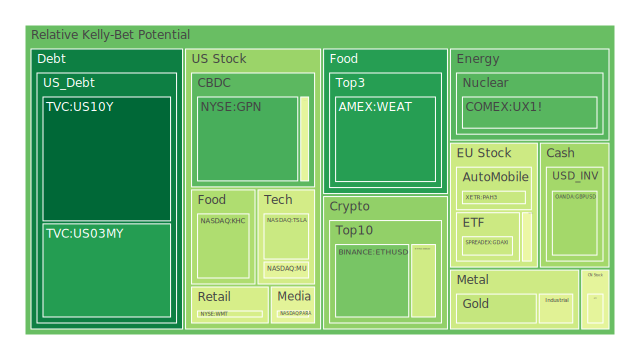

# 一、導論：三位一體的整合思維與近期新聞衝擊

在當前的全球金融市場中，各種資產之間的互動越加複雜，多空交織的現象也不斷深化。從近期新聞可以觀察到，美國總統特朗普再度對加拿大、墨西哥與中國等國祭出高關稅，市場對全球貿易戰是否進一步惡化頗為擔憂。這些新聞顯示出地緣政治與經濟決策快速變動，造成投資人情緒波動，進而衝擊各資產的表現。此外，美國聯邦政府機構出現人事風波，如消費者金融保護局（Consumer Financial Protection Bureau）局長遭解僱，以及USAID部分人員被迫離職等，都顯示出政治面干擾正在加深金融市場的結構性不確定性。

同時，在歐洲方面則持續有英法德等多國內部的政治動盪與民意壓力，包含法國國會就預算法案的爭論升溫、德國民眾示威以及英國本土農業與企業面臨關稅衝擊後所做的抗議。而地緣衝突尤其在俄烏邊境持續，引發全球對能源與農產品供應的憂慮。同時間，美國科技股領域也持續受到DeepSeek與其他先進AI技術的競爭壓力，使得企業研發成本與市場前景評估更加複雜。綜合而言，我們正身處一個多重變數交錯、宏微觀訊息並存的時刻，對資產配置提出更高的分析要求。

為了更有效地整理這些多元資訊，我們透過「空間（Spatial）」、「時間（Temporal）」、「概念（Conceptional）」三位一體的維度，先進行大膽的假設與歸納，並將結論進一步融入「正—反—合」的思維。之後，我們根據泡沫風險指標（D1, D7, D14, D30）與現價（PP100）等資訊，篩選出可能的對沖投資組合，嘗試讓彼此之間的相關係數趨近-0.5，並讓不同資產間的相位盡可能達到120度，以降低系統性風險。

---

# 二、空間（Spatial）層面：各地市場與新聞事件的三位一體

1. **大膽假設之一（經濟學角度）**  
   依據空間（Spatial）層面考量，當前的全球經濟體系被強化的美國貿易壁壘所衝擊。若美國關稅政策持續擴散，歐洲與亞洲的重要製造業可能接連受到影響。新聞中多次提及加墨兩國對美國關稅措施的反擊，導致貨幣與出口依存度高的地區（如加拿大、墨西哥）面臨經常帳壓力。中國方面亦因關稅擴張面臨輸出成本上升。俄烏戰爭與局部軍事衝突進一步擾動農產品和能源原物料供給，牽動全球物價及下游產業供應鏈。

2. **大膽假設之二（社會學角度）**  
   由於貿易戰與多邊衝突的政治操作，不同地區的就業市場與消費力也會受到社會層面的影響。近期新聞提及加拿大與美國的關係惡化以及美國國內政局的波動，都可能影響人民對未來的就業與消費信心。此外，歐洲多國在應對難民、地緣政治、以及能源短缺的壓力下，社會對政府的信任度將面臨更大考驗。一旦社會對政府信任下滑，可能使企業投資計劃轉趨保守，將進一步加深資本市場的動盪。

3. **大膽假設之三（心理學與博弈論角度）**  
   貿易戰升級時，市場參與者往往有放大恐懼或過度投機的心理傾向。一方面，在各國互相加稅、祭出貿易制裁的博弈中，許多跨國企業被迫重新規劃供應鏈，一些投資人趁不確定性最高時拋售風險資產。另一方面，也有部分投資人看準恐慌情緒而大規模套利。新聞顯示「市場衝擊」、「股票大跌」等負面訊息佔據了相當比例，足以在短期引發蝴蝶效應，促使資產價格加大波動。

綜合空間層面的三位一體觀察（經濟—社會—博弈），可以看出在貿易保護主義加劇、地緣衝突與政局不穩的社會氛圍下，投資人短期心理極易受到負面新聞的助長，造成許多市場資金流向債券、美金、黃金等傳統避險資產。然而也要注意，一旦負面新聞發酵過度，若某些協商或談判出現意外轉機，又可能導致風險資產的短線大幅反彈。

---

# 三、時間（Temporal）層面：短期、中期、長期的市場與新聞三位一體

1. **短期（經濟學角度）**  
   短期最直接的衝擊來自特朗普對加拿大、墨西哥、中國關稅政策的「即刻實施」宣告，以及美國對外政治與外交突然的轉向。新聞多次顯示企業裁員、投資佈局延後或取消，尤其在農產品、鋼鋁、能源等領域首當其衝。若我們再對照所提供的市場數據，近期石油價格走勢雖有些許上揚（伴隨美國對外情勢轉變），但更大的擔憂在於長久供應鏈的穩定。  

2. **中期（社會學角度）**  
   假若這些關稅紛爭在未來幾個月持續，企業開始內部調整供應鏈與生產模式，將可能影響就業與社會穩定。新聞報導顯示加拿大與墨西哥都著手準備反制機制；歐洲、非洲及亞洲各國也可能擔憂「貿易壁壘擴散」。這將引起一系列社會與政治博弈，以爭取全球供應鏈的重新配置。中期之內，各國中央銀行的貨幣政策，以及美國聯準會對利率與資金流動性的調整，就會變得更舉足輕重。

3. **長期（心理學與博弈論角度）**  
   若這種貿易保護傾向在長期持續，國際資本市場可能進入另一次「去全球化」的重構過程。結合新聞中提到的AI產業（例如DeepSeek）崛起與美國主導地位的變化，市場資金的流動方式可能大幅洗牌。歷史上類似的長期影響可見於1970年代石油禁運、以及2008年金融海嘯後的量化寬鬆時期。它們都對未來十年乃至更久的經濟佈局產生深遠影響。新的博弈格局下，國與國之間的協定恐怕不再是單純的關稅談判，也包含供應鏈、產業政策與金融監管層面的全面競逐。

---

# 四、概念（Conceptional）層面：市場與新聞的三位一體

1. **經濟學理論內的觀點**  
   市場對總需求與總供給之間失衡的擔憂仍是主軸，關稅拉高進口物價在供給層面造成人民實質購買力壓縮，若失業率上升則總需求進一步萎縮。通貨膨脹或停滯性通膨都可能成為警訊。由於在新聞中可見企業紛紛預警營運成本上漲，某些行業或將減少招聘，導致總體經濟成長下修。

2. **經濟學理論之外的觀點**  
   跨國企業的企業文化、品牌聲譽，以及投資人對「產業永續性」與「全球合作」等抽象價值的重視度提高，也是值得留意的面向。一旦投資人認為某地區或某企業的地緣政治風險與環境風險過高，就會加速資金撤離。新聞中不乏公司提到推遲海外併購，這些現象都出現了「資本轉向低風險標的」的勢頭，一方面拉高了安全資產的價格，另一方面使得某些對衝策略更具吸引力。

3. **心理學、博弈論與歷史參考**  
   目前的關稅戰、地緣緊張，以及民粹政治等現象，與歷史上部分時期有相似之處。1920年代末期的保護貿易主義造成1930年代經濟衰退的導火線之一；1970年代石油禁運與1980年代廣場協議也曾深刻影響跨國企業的佈局。市場參與者在此種環境中，難免出現過度恐慌或過度樂觀的「羊群效應」。過往經驗顯示，當負面消息集體爆發後，若政治人物或國際組織祭出特定寬鬆或補助措施，市場常可能迅速報復性反彈，進一步加劇波動。

---

# 五、泡沫風險與各主要資產類別探討

以下將整理市場上的多種資產類別，以及部分新聞事件的參照。由於本報告禁止使用表格，僅以文字敘述概括泡沫風險（D1、D7、D14、D30代表當日、一週平均、兩週平均、一個月平均的風險分數；分數越高泡沫風險越大），同時提及相似歷史場景與近期新聞對該資產的影響。

1. **美國國債**  
   觀察短天期與中長天期美國國債，殖利率呈現小幅度的波動。目前1Y在4.16%、2Y在4.21%、5Y在4.33%、10Y在4.54%、30Y在4.79%，最新消息顯示美國聯邦政府政治紛擾依舊，不過國債仍被視為市場動盪中的資金避風港。數據中，短期（D1）泡沫指數相對不高，但中長期（D7, D14, D30）稍有上升。歷史上，當美國陷入對外貿易戰並引發經濟衰退預期時，資金常會湧入國債市場，但若利率繼續拉高，價格也可能顯著波動。  
   近期新聞中並未直接聚焦在國債，但提到美國政治爭端不斷，FED資產負債表縮減仍在進行，市場對未來幾個月的貨幣政策預期相對分歧。一旦美國國債再度面臨舉債上限談判或其他政治障礙，可能引發長期殖利率的劇烈波動。

2. **美國零售股（例如WMT、TGT等）**  
   從最新泡沫風險指數來看，WMT的D1與中長期指數增幅顯示中度以上的泡沫壓力，TGT（目標百貨）則在D14、D30的泡沫風險相對更高。新聞裡指出，美國若與加拿大、墨西哥全面進入互徵關稅，部分零售商進口成本恐將上漲，或許在短線上會將成本轉嫁到消費者，進一步打壓需求。歷史上2008年金融危機前夕，大型零售股曾一度被視為「相對防禦」類型，但仍因需求下滑而在危機最嚴重時期面臨股價重挫。  
   此次情境相似，若中低收入戶在通膨與就業不穩下縮減支出，零售銷售難以維持高成長。新聞顯示許多企業預期獲利衰退與裁員，因此零售類股近期要保持高度警惕。

3. **美國科技股（如AAPL、MSFT、AMZN、META、GOOG、TSLA等）**  
   這些高市值科技股之泡沫指數普遍維持在0.7到0.9以上（以D1至D30來看都不低），顯示市場對科技巨頭的熱情依舊相當高，但也意味風險累積。新聞提及美國AI產業面臨競爭與專利官司，例如DeepSeek與其他AI企業的糾紛；同時還有可能受到特朗普關稅與其他國家報復性措施的衝擊。  
   從歷史類比來看，科技股往往在牛市後期呈現更大波動性，一旦景氣轉弱，通常修正幅度也較深。市場對新技術抱有高度期待，但若政策或市場信心轉向，科技股也可能出現快速估值回調。

4. **美國房地產指數 / REITs（例如RWO、VNQ、IYR）**  
   數據顯示，這些指數D1與D7略有波動但整體風險在中高水準（接近或超過0.7至0.9）。新聞指出美國30年固定抵押貸款利率已達6.95%，對房市構成壓力。從歷史上看，利率越高，房市購屋成本越高，成交量往往緩慢下滑，房地產投資信託收益的穩定度也會被動搖。此時若就業及經濟前景不穩，供需失衡可能造成房地產指數深度回調。再加上新聞顯示若貿易戰擴散，企業投資與就業前景下修，房地產市場將進一步承壓。

5. **加密貨幣（例如BTCUSD、ETHUSD、DOGEUSD）**  
   BTC與ETH在新聞中一直被討論，近期數據顯示BTC的價格雖仍在高位（超過9萬美元），但泡沫指數居高不下（約0.69 - 0.69+）。ETH也呈現類似狀況，D1維持在0.27-0.28之間，短期雖看似尚可，中長期風險仍偏高。DOGE稍低於前兩者，但也有可能因市場炒作而波動。歷史上，加密貨幣在全球政治不確定性時，會出現短期對沖資金流入，但同時也易遭政策監管、稅負或宏觀資金風險影響，波動往往更大。若國際貿易體系緊張加劇，法幣流動性趨緊時，也會快速衝擊到加密市場的資金面。

6. **金 / 銀 / 銅**  
   黃金（XAUUSD）數據顯示泡沫指數介於0.39至0.42之間，屬於中性偏高。白銀（XAGUSD）風險指數偏高（0.67 - 0.82之間），可能因白銀工業用途與投資需求同時存在，使得波動略大於黃金。銅（COPPER）最近同樣風險在中度到中高度之間（約0.45至0.56）。新聞指出若全球貿易惡化，銅的需求可能下降；但也要注意新能源與電動車產業仍需求銅。黃金歷史上在市場緊張時多扮演避險角色，然而若美國利率持續走高、美元走強，也會壓抑金價表現。

7. **黃豆 / 小麥 / 玉米**  
   小麥WEAT泡沫指數介於0.17-0.17+；黃豆SOYB、玉米CORN則在0.51-0.57附近，風險稍高。近期新聞提到俄烏衝突導致黑海地區穀物出口受阻，加上美國對加拿大、墨西哥關稅政策，農產品國際市場價格走勢恐更加震盪。歷史上，若戰爭導致全球糧食供應鏈中斷，農產品價格往往易在短時間飆漲，但同時也易被國家政策與期貨交易所的限制或補貼所影響，波動性自然相對大。

8. **石油 / 鈾期貨**  
   石油（USOIL）最新價約73-74美元區間，泡沫指數在0.39 - 0.51附近浮動。新聞談到特朗普對多國課徵關稅，包含原油進口也在名單上，而其他國家可能採取報復，對石油市場的潛在衝擊不容小覷。鈾期貨（UX1!）雖相對冷門，但數據顯示其泡沫風險穩定在0.18 - 0.39之間，算是中低位。考量到各國能源轉型和地緣衝突，核能需求若上升，鈾價格可能在未來有長期支撐。

9. **各國外匯市場**  
   近期新聞顯示加拿大元、墨西哥披索因關稅戰而下挫，英鎊方面則受到英國內部政治動盪的壓力。澳幣因澳洲經濟結構也受到大宗商品與中國需求的牽動，短期波動加大。日圓對美元已升至155.81附近，顯示日圓相對走弱（可能與日本央行維持較寬鬆貨幣政策有關）。  
   歷史上，當美國領導的貿易保護政策抬頭，或重大地緣動盪發生時，美元常扮演避險貨幣角色。若局勢持續惡化，預計美元指數將維持強勢，而新興市場貨幣可能面臨進一步貶值。

10. **各國大盤指數（如000300、GDAXI、FTSE、JPN225、FCHI等）**  
   中國000300的最新泡沫風險約0.33-0.50，歐洲德國股指GDAXI約0.41-0.64，法國FCHI在0.50-0.63，英國FTSE則相對較高，甚至接近0.98。日經225則約在0.91-0.92之間。新聞顯示歐洲部分國家的政治與經濟政策存在不確定性，以及對科技領域稅收與AI監管的新提案正在醞釀。德國、本田（在日本）、以及法國的奢侈品集團等，若貿易紛爭升溫恐使其供應鏈或出口受阻。  
   歷史經驗表明，當歐美關係與全球貿易受到衝擊時，最先受害的往往是出口依存度高的國家（如德國、中國、日本），但反彈也會在局勢暫時緩和時較顯著。

11. **美國半導體股（KLAC、AMD、INTC、NVDA、QCOM、AMAT等）**  
   半導體類股泡沫風險在0.55 - 0.97之間，可見市場資金對此領域仍然瘋狂追捧，尤其是與AI運算、數據中心相關的廠商。新聞指出DeepSeek與其他AI競爭可能帶動半導體需求，但若貿易戰限制原材料供給或出口技術管制，衝擊也可能不小。2018年曾出現過一次對中國半導體與零組件管制，引發全球供應鏈大洗牌。此類股要謹防過度炒作後的一次性回調。

12. **美國銀行股（JPM、BAC、C等）**  
   銀行股泡沫風險普遍偏高（0.89 - 0.99附近），顯示市場對利率環境與貸款風險的預期並不樂觀。新聞又提到消費者金融保護局局長突然被解僱，政府內部權力角力可能使金融監管政策出現反覆。歷史上，每當經濟不穩定、美債殖利率曲線反轉或壓縮時，銀行利差受到衝擊，壞帳風險亦同步上升。當前聯準會動向尚未明朗，美國銀行股需要特別留意。

13. **美國軍工股（如LMT、NOC、RTX等）**  
   軍工股對地緣衝突的新聞反應通常較敏感。俄烏局勢、歐洲地區的種種衝突都可能提振軍工訂單。然而，過去軍工股的上漲常與美國政府預算支持有關，若關稅戰令美國財政惡化、政治兩極化，未必能長期支撐軍工預算。最新資料顯示LMT、NOC等D1-D30泡沫風險雖高，但若全球衝突加劇，這類股依舊有防禦性，也必須留意估值是否早已反映。

14. **美國電子支付股（V、MA、PYPL、GPN等）**  
   這些股票的泡沫指數在0.76 - 0.96甚至更高，顯示投資人對數位消費與金融服務仍抱持相當信心。新聞中可見，若消費需求降低或跨境交易放緩時，支付股成長可能受限。歷史曾多次證實金融股在高利率與經濟衰退陰影下較為脆弱，一旦信用卡壞帳攀升，支付公司營收也會受影響。從最新泡沫風險可看出這類公司估值並不便宜，任何一則負面新聞就會帶來調整壓力。

15. **美國藥商股（MRK、JNJ、LLY等）**  
   藥商股D1在0.48-0.67左右，LLY的中長期風險甚至到0.67-0.88區間。新聞中指出醫療支出有可能因政府開支緊縮遭受衝擊，但疫情後的健康意識與一些創新藥物需求仍存在。歷史上，藥商在經濟衰退時通常被視為相對防禦的產業。但若遇到專利風險、法規改革或政治壓力（例如政府干預藥價），股價也會瞬間變臉。依現況看來，短期防禦性猶在，但長期不確定因素增多。

16. **美國影視股（PARA、DIS、NFLX、FOX等）**  
   影視傳媒公司泡沫風險整體維持在約0.55-0.97，部分公司如FOX甚至逼近0.95-0.96。新聞稱美國內部政治或意識形態分裂，往往會帶動平台審查與市場觀眾結構改變。歷史經驗顯示，若經濟轉弱，娛樂性花費會被優先縮減。同時，串流市場的競爭激烈（如Disney+、Netflix等），倘若彼此價格戰與內容投資飆升，長期獲利能力恐受質疑。

17. **美國媒體股（CMCSA、NYT等）**  
   與影視相似，媒體股在經濟不穩時廣告收入可能減少，泡沫風險約在0.47-0.73。NYT雖有特定客群與訂閱模式，但新聞提到若政治氣候對新聞媒體不友善，經營模式仍易受衝擊。2020年後許多傳統媒體積極轉型數位訂閱，但也面臨新興自媒體或AI生成內容的競爭。

18. **石油防禦股（如XOM、OXY等）**  
   防禦性在於市場若對傳統能源產生需求，這些企業短期獲利彈性大。但D1-D30指數都顯示風險不小（約0.65-0.77）。新聞中提到若貿易制裁與關稅開始衝擊油價，或部分國家意圖發展替代能源來消弭進口關稅成本，也會改變石油股的前景。歷史上石油公司在地緣動亂時常能賺取超額利潤，但也容易被政策壓力與環保趨勢反噬。

19. **金礦防禦股（如RGLD等）**  
   金礦公司股價通常跟黃金走勢正向關聯，但槓桿效應更大。RGLD風險指數在0.57-0.91不等，若金價走勢上漲，金礦股漲幅更大；相反地，金價若受壓，股價也會雪崩。歷史顯示，此類標的在不確定時期常成投資人青睞，但也要避免金價短期回落的風險。

20. **歐洲奢侈品股（MC、KER、RMS等）**  
   歐洲奢侈品泡沫風險約在0.45-0.88區間。新聞提到關稅可能影響歐美消費者支出，同時中國消費者若出現經濟壓力，也可能影響該產業。2015年前後，歐洲奢侈品曾在中國消費井噴期享有高漲，但貿易與政治關係的動盪，對奢侈品銷售造成壓力。

21. **歐洲汽車股（如BMW、MBG等）**  
   這些車廠重度依賴出口，美國關稅對歐洲汽車業衝擊顯著。數據顯示BMW、MBG風險分數也不低，若出口受阻，獲利便面臨考驗。歷史上，歐洲車廠常在地緣政治風險中受害，一旦美歐貿易關係惡化，亦或電動車議題改變市場需求，他們都需快速調整策略。

22. **歐美食品股（如KHC、KO、NESN等）**  
   食品股的防禦性通常相對較高，但也有指標顯示在當前市場環境下，KHC、KO、NESN的風險指數都在0.35-0.60不等。新聞若顯示全球經濟不穩、糧食成本可能提高，這些公司毛利率也會受壓縮。歷史上，大型食品企業於經濟衰退時仍維持基本盤，但也要注意全球原材料價格與匯率波動帶來的衝擊。

---

# 六、宏觀經濟傳導路徑分析

綜合前述各資產分類與新聞事件，宏觀層面的傳導路徑可分為：

1. **貿易戰與地緣衝突**  
   特朗普祭出關稅 → 各國報復性關稅與政治緊張 → 全球供應鏈調整 → 原材料與最終產品價格上揚 → 通膨或停滯性通膨疑慮 → 央行貨幣政策分歧 → 外匯與資本市場大幅波動。

2. **美國內部政治與聯準會政策**  
   政府內部人事動盪、FED縮表持續 → 市場對流動性的依賴增加 → 利率走勢成為決定後續資金流向的關鍵 → 若名目利率與通膨差距擴大，長天期債券價格大幅震盪 → 股票市場也顯著波動。

3. **全球資金避險與風險資產配置**  
   投資人擔憂衰退或政治動盪 → 資金短期湧入黃金、美國國債或其它避險資產 → 但高泡沫風險的領域（如大型科技股）若市場信心崩潰，可能瞬間觸發系統性賣壓。

---

# 七、微觀經濟傳導路徑分析

1. **企業層面**  
   關稅抬高進口成本 → 企業毛利下滑或轉嫁給消費者 → 零售與耐久財消費受壓 → 企業營收與現金流壓力上升 → 裁員或縮減研發 → 進一步降低國內需求。

2. **金融機構層面**  
   商業銀行若面臨壞帳攀升、企業貸款需求疲軟 → 貸款利差縮小 → 商業銀行股價面臨壓力 → 系統性風險傳導至其他金融部門 → 電子支付、信用卡壞帳與互聯網金融公司都將受到影響。

3. **個人投資與行為**  
   個人面對就業不確定與物價上漲 → 消費支出減少 → 股市或房市下滑後的財富效應進一步負面循環 → 消費與投資同時保守。

---

# 八、資產類別間傳導路徑分析

若美國金融市場遭遇衝擊，透過全球資金與貿易連動，歐洲、亞洲新興市場股匯債市都難以倖免。科技股修正往往帶動大盤指數跌幅擴大，而債市若出現較明顯資金回流，也可能暫時壓低殖利率，若伴隨通膨堪憂則會使黃金與其他避險資產再度走強。  
油價與金屬價格更易在地緣政治升溫時波動；若衰退確定，工業金屬與能源需求放緩將壓低價格，但期間也會伴隨突如其來的政策干預（例：各國戰略儲備購買）。整體來說，在高不確定性下，各資產都以高波動、高聯動率的方式表現，增添投資難度。

---

# 九、投資建議：風險對沖與資產組合的三種策略

基於三位一體（空間、時間、概念）的分析，以及對風險分數（D1-D30）與新聞趨勢的觀察，我們嘗試構建三種資產配置方案，分別為「穩健」、「成長」、「高風險」，三者之合為100%。同時考量各資產之間的負相關程度（目標相關係數約-0.5）與相位接近120度，以力求更全面的風險對沖。以下以文字敘述建議的三組配置方向與大致比例：

1. **穩健配置（建議比例40%）**  
   - **美國國債（中長天期）**：考量現階段利率仍處較高位置，且若經濟衰退疑慮升高，殖利率後市仍可能下行，國債價格有機會獲得支撐。  
   - **黃金**：雖然金價在美元走強下可能受壓，但若地緣政治進一步惡化或通膨拉高，黃金防禦性依然顯著。  
   - **藥商股（MRK或JNJ等）**：醫療需求相對穩定，若政治面導致市場普遍轉向防禦，醫藥股能提供一定的抗震效果。

2. **成長配置（建議比例35%）**  
   - **半導體龍頭（如NVDA或AMD）**：長期看好AI與雲端運算帶動的需求，但須嚴防貿易政策對供應鏈的衝擊。  
   - **電子支付（如V或MA）**：數位消費、線上金融服務中長期成長趨勢可期，短期受到恐慌情緒時可能有波動。  
   - **原油巨頭（如XOM）**：若貿易摩擦持續，油價雖有壓力，但若任何地緣衝突升溫或供給意外受限，能源股有機會得到上漲動能。

3. **高風險配置（建議比例25%）**  
   - **加密貨幣（BTC或ETH）**：波動極大，適合少部分資金做風險收益較高的對沖，若法幣流動性不足或市場衰退可能急跌。  
   - **軍工股（如LMT、NOC）**：地緣政治衝突升溫時，軍工訂單與營收可能攀升。但若衝突淡化或政府財政出現問題，軍工預算也會被削減。  
   - **金礦防禦股（如RGLD）**：乘黃金的槓桿效應，報酬與風險都更高，適合在避險情緒很強時進場，但要及時注意金價回調風險。

此三類配置比例僅供參考，實際仍需依投資人風險承受度與資金規模而調整。大方向是利用國債、黃金等低相關與避險特質資產，對沖科技、加密貨幣等高風險或高槓桿資產，以求在風暴來臨時不致受到全盤衝擊，但也兼顧長期成長的可能。

---

# 十、多項資產之間漣漪效應傳導路徑與篩選假設

在對沖策略中，我們希望各資產間的相關係數降低，但在實務操作上，由於市場情緒往往在危機時變得「一同下跌」。因此，我們對各假設做了以下篩選與分析：

1. **美國國債與黃金**：  
   歷史上兩者在恐慌時同漲，但需注意若美債信用遭質疑（舉債上限危機）或利率太高，資金對黃金反而更加青睞，可能顯示負相關。此種「正—反—合」反覆進行，需隨時觀察美國財政政治進展。

2. **加密貨幣與軍工股**：  
   加密貨幣的漲跌主要受到市場對去中心化與避險的心理追捧，但軍工股是與地緣戰爭風險掛勾。若衝突加劇，軍工股看漲；同時投資人可能也將加密貨幣視為一種「避開傳統金融系統風險」的避險標的。兩者理論上缺乏顯著的基本面關聯，但在極端的恐慌或投機時，反而有機會出現短期正向相關或同步飆升，要審慎留意。

3. **科技股與電子支付**：  
   雖然同屬成長板塊，但在詳細分布上，科技巨頭更多元布局、支付公司則仰賴交易量與經濟活絡。若經濟持續萎縮，支付公司會先顯示交易量下滑；科技巨頭則可能因雲端收入或訂閱模式延後受影響。兩者間中短期相關度可能較高，但在長期的「正—反—合」動態中，仍有差異。

4. **房地產（REITs）與銀行股**：  
   兩者在升息環境下同受衝擊：房貸需求下滑，銀行放貸毛利壓縮；若房價大跌則銀行壞帳也增多。然而在資金緊縮末端，若利率趨穩，房地產可能先反彈，銀行股若壞帳問題受控也可能回升。此二者可能不同步但大致方向相近。

經過這些「正—反—合」的兩兩篩選，我們暫時保留國債、黃金、科技龍頭、軍工、加密貨幣等做對沖組合，並將其他高關稅風險產品（如歐洲汽車、零售業）比重相對降低。如此一來，整體的波動雖仍可能在政策突變時放大，但若報復性關稅延燒，至少整組資產不至於同時下挫。

---

# 十一、投資建議：觀察視角與策略

1. **引用相關新聞事件與類比**  
   - 近期關稅衝擊下，零售股與汽車股預期最先受害。  
   - AI產業競爭熱度持續升溫，短期雖有利於半導體高端需求，但也要注意政治面對產業的監管與補貼走向。  
   - 銀行股若消費貸款壞帳激增，可能陷入獲利困境，新聞也顯示消費者金融保護局與聯邦監管出現真空期。  
   - 比特幣與其他加密貨幣則在通膨與衰退之間，可能因避險與投機需求並存而大幅波動。

2. **歷史參考與既有理論**  
   - 1930年代關稅引爆全球經濟衰退的教訓。  
   - 1970年代石油危機對通膨與企業投資意願的重傷。  
   - 2008年金融海嘯後，量化寬鬆雖救市卻也埋下資產泡沫。  
   - 每次重大轉折都出現資產重估與市場結構調整，投資人若能透過分散、對沖與關注產業趨勢轉向，往往能減少損失並於復甦階段獲利。

3. **穩健、成長、高風險三種最佳化配置**  
   - 如前文，第1類穩健（40%）：美國國債、黃金、藥商股  
   - 第2類成長（35%）：半導體龍頭、電子支付、原油巨頭  
   - 第3類高風險（25%）：加密貨幣、軍工股、金礦防禦股  
   整體加總100%，建議隨時動態調整。

4. **不同資產之間的微妙關聯**  
   - 石油市場與政治衝突的連動、黃金與利率預期的互斥。  
   - 加密貨幣對法定貨幣政策信心的對沖，但也容易受監管消息左右。  
   - 科技股的高估值水準與市場資金情緒之間的快速變動。

---

# 十二、風險提示

1. **泡沫風險高企**  
   本報告多次強調，各資產最新D1、D7、D14、D30分數，多呈現高檔或快速上升趨勢，表明市場對未來不確定性的警惕或投機氛圍旺盛。若任何單一重要事件觸發拋售，泡沫破裂風險將迅速放大。

2. **政策與政治性風險**  
   美國白宮政策多變，聯準會縮表與利率走勢不確定，歐洲多國政治不穩、英國農業與企業強烈反對關稅等，都可能帶來極端的市場振盪。

3. **地緣衝突與金融監管**  
   俄烏戰爭仍未結束，中東、北非或其他地區衝突也可能升溫；各國政府對加密貨幣、網路科技、高風險資產的監管動作加強，都可能在短時間內扭轉市場預期。

4. **歷史經驗不可完全套用**  
   雖然歷史提供某些參考，但新的科技、全球化程度與政治思潮與以往不同，需留意傳統理論與歷史經驗不一定能百分之百反映當前局勢。

5. **投資心態與資產分配**  
   投資者應根據自身風險承受度與資產規模，調整組合中穩健、成長、高風險的比重。本文所提僅是大方向參考。市場瞬息萬變，配置需靈活應對。

---

# 十三、結論：在高度不確定中追求正—反—合的動態平衡

綜合以上分析，當前全球市場在貿易戰與地緣政治的變局下，充滿了結構性與短期的負面訊號。而同時，新科技與供應鏈重組又提供了長期轉機。面對未來，投資人需在「正面展望」與「反面警惕」中取得合宜的平衡：  
- **「正」**：AI、雲端、大數據與新興能源帶來的轉型契機，部分企業可以持續成長。  
- **「反」**：關稅戰、政治動盪、利率波動，可能壓抑市場信心、帶來系統性風險。  
- **「合」**：尋求多元資產、跨區域的對沖與結合，構建能應對各種衝擊的彈性組合。

最後強調，不論是國債、黃金、股票、房地產或加密貨幣，市場永遠存在不確定性與波動風險。投資者應持續追蹤新聞與經濟數據，結合自身財務目標與風險偏好，做動態調整與風險管理。

---

# 風險提示

投資有風險，市場總是充滿不確定性。本報告所提供之觀點僅供參考，並非投資建議的絕對依據。投資者應根據自身的風險承受能力和投資目標，做出獨立的投資決策，並隨時關注最新的市場與政治訊息。如遇重大政治變動、黑天鵝事件或監管風向轉變，市場行情可能在短期內急遽逆轉，需做好風險控管與心理準備。切勿忽視任何高泡沫或高槓桿資產所帶來的潛在危機，也不可忽略地緣衝突對全球供應鏈與財務市場的隱形衝擊。審慎評估，分散布局，以追求「在風險之中同時保有成長機會」的投資平衡。

 
Daily Buy Map:

 
Daily Sell Map:

 
Daily Radar Chart:

 
