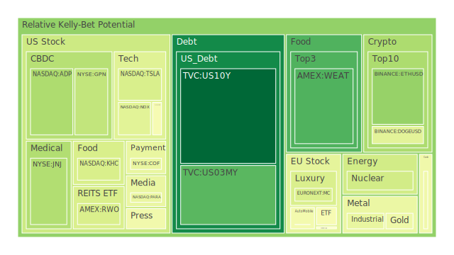
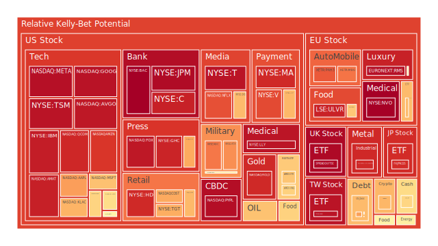
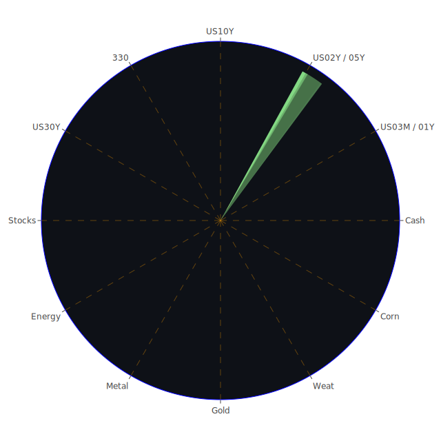

# 一、Spatial（空間面）市場與新聞三位一體之大膽假設

空間面（Spatial）強調的是市場在地緣與區域上的分佈，以及不同地理範疇之間的互動。從最近的新聞與市場走勢來看，可以簡化為「全球—區域—本土」三個層次的三位一體結構。以下將從經濟學、社會學、心理學與博弈論四個角度，對此空間結構提出大膽假設：

第一層次，全球市場與新聞事件的交互：
1. **經濟學**：自2025年初以來，全球市場對貿易關稅、地緣衝突與各國央行貨幣政策的動態相當敏感。尤其最近美國對加拿大、墨西哥與中國祭出新一輪關稅，引發廣泛負面情緒。多則新聞顯示，這波關稅衝擊或許會再度推高美國國內部分製造業成本，也削弱了美國以外地區的出口競爭力。雖然部分美國鋼鋁業或基礎原物料業在短期可能受益（某些報導提到「關稅給了美國鋼廠調漲價格的綠燈」），但其他國際供應鏈參與者恐面臨翻倍的關稅成本。
2. **社會學**：新聞顯示「美加墨關係」受到嚴重挑戰。一方面，美國對鄰國加、墨實施高關稅時，頻頻有爭議談話指出「加拿大若沒有美國的協助就不存在」，導致加拿大、墨西哥國內民眾出現民族自尊心受挫與群體焦慮。社群媒體也不斷擴散抵制美國商品的呼聲，甚至再度喚起歷史上反美示威的記憶。
3. **心理學**：面對全球性貿易衝突的負面報導與政治人物激烈言論，投資人普遍出現恐慌與避險傾向。國際投資資金可能流向黃金、債券等防禦性資產。加密貨幣市場雖具「對沖政治風險」的部分論調，但從近期泡沫指數顯示，一些主流加密資產的風險評分仍呈較高水位，意味投機成分亦明顯。若恐慌情緒繼續攀升，也可能引發更大波動。
4. **博弈論**：各國之間的關稅戰更像是「賽局的混沌擴散」。如果美國堅持施壓，加拿大、墨西哥等國報復措施也將陸續出臺。一旦雙方都鎖定對方之弱點，不斷升級課稅與限貨，全球供應鏈難免重新洗牌，出現地區間的聯合或排他陣營。一些後端市場，如歐洲可能在美國市場出現空缺後填補機會，或反之在政治壓力下與美國結盟而對第三方祭出制裁。在這種複雜結盟與反結盟的博弈中，各主要經濟體的協商槓桿會產生疊加性影響。

第二層次，區域市場與新聞事件的交互：
1. **經濟學**：儘管地緣政治與貿易壁壘加劇，歐洲與亞洲某些區域仍可能持續成為外資佈局熱點，比如東南亞國家在製造業轉移中受益，或部分非洲及南美洲國家因大宗商品價格波動得到短期提升。然而，最新消息指出歐洲在應對通膨與高企利率時，其國內需求有放緩跡象。法國部分官員呼籲歐洲央行應加速降息，但目前ECB內部仍對降息時機存疑。如果歐洲經濟再度陷入停滯，將影響全球投資人對歐系資產的配置。
2. **社會學**：從新聞可看出法國與德國國內民眾對於與極右勢力合作的擔憂持續升高，社會對立深化，示威者抗議政府強行通過預算案，足見歐洲政治局勢的緊張感。此外，在亞洲區域，中國與東協國家對美國針對性的關稅採取觀望或進行局部反制。地緣政治紛擾下，每個區域都有分裂或重組的可能性。
3. **心理學**：許多投資人對於區域衝突與地緣政治風險會放大心理恐懼，例如加拿大與墨西哥內部反美情緒升溫，市場更擔憂北美貿易協定體系徹底崩壞；而在歐洲境內對通膨與經濟停滯的焦慮，也可能壓抑消費。正面消息並非完全缺乏，如印度稅改激勵中產階級消費、日本企業收益改善等，都為區域市場帶來局部的樂觀心理，顯示市場情緒仍相當分歧。
4. **博弈論**：區域層面博弈包含彼此協定重新談判及區域貿易組織的運作。例如加拿大為因應美國關稅，宣告將透過國際仲裁機制維護自身權益並祭出反制關稅，歐洲則暗示或將和加拿大結盟，共同應對美國。這種區域策略若推向極端，可能形成各自小圈子的經貿區域，相互課稅、互不協同，帶來更大摩擦。

第三層次，本土市場與新聞事件的交互：
1. **經濟學**：在美國國內，房地產市場出現租金下跌或停滯的新動態，例如丹佛的租金下降速度頗快，根據新聞顯示，有些專家擔心進一步打壓房地產開發投資。同時，因為關稅衝擊，多位業者警告建材成本可能上揚，從而推升新屋興建成本。再者，本土零售股如WMT、TGT等面臨關稅波及，物流及供應鏈成本上升或將侵蝕獲利。
2. **社會學**：部分媒體指出美國國內政策動盪，例如「特朗普突然解僱消費者金融保護局（CFPB）局長」等，引發民眾對金融監管的擔憂。若消費者保護功能削弱，信用卡或消費貸款的糾紛容易增多，更影響低收入族群的生活穩定度與社會公平感。
3. **心理學**：美國國內民眾對經濟前景出現分化，一方面AI與科技股熱潮正吸引部分投資人，Palantir、NVIDIA、AMZN等企業被視作「AI熱浪」的受益者，市場對其抱有高漲期望；但另一方面，高房貸利率（最新資料顯示30年固定抵押貸款利率來到6.95，且相對去年2.73大幅上揚）使許多家庭對未來購房、消費力出現悲觀情緒，同時有更多人擔心通膨與就業前景不明。兩種情緒交錯帶來投資決策上的搖擺。
4. **博弈論**：美國國內共和、民主兩黨對於關稅與國際關係的態度彼此糾纏不清，企業利益遊說集團則施壓政府鬆綁或修改進出口限制。權力機關之間相互角力，最終將牽動多條市場走向。例如企業是否能順利說服政府減免某些生產用原材料的關稅，就成了博弈重心，企業不願放棄對境外原料的依賴，政府也希望拿關稅換取外交籌碼。此一博弈短期內恐難有完美解方，導致市場投資氣氛依然緊張。

將以上全球、區域、本土的新聞與市場互動視為三位一體，從經濟學、社會學、心理學與博弈論的各種探討，我們不難發現：貿易保護與地緣政治動盪已成主線，市場因此持續產生風險轉移與恐慌，加之通膨與利率環境使部分資產泡沫疑慮升溫。在此空間架構下，關注各資產面臨的供需、政策與情緒變化至關重要。

# 二、Temporal（時間面）市場與新聞三位一體之大膽假設

時間面分析聚焦短期（1-3個月）、中期（3-12個月）、長期（1-3年）三位一體，從最新新聞衝擊到結構調整，再到制度性或趨勢性改變來看，可同樣採用經濟學、社會學、心理學與博弈論提出假設：

短期（1-3個月）：
1. **經濟學**：美國最新聯準會（FED）數據顯示，Total Assets持續下滑，RRP同樣下降，但BTFP、Discount Window等危機性工具使用量較低，代表金融流動性尚無急速耗竭之虞。然而，政治面關稅與通膨陰影仍然壓頂，市場短期或有股市震盪、外匯市場劇烈波動。近期新聞強調特朗普關稅政策引爆的恐慌情緒，或促使投資人快速抽回在風險資產的資金。  
2. **社會學**：短期示威、罷工或集體行動的頻率可能提升。像法國爆發大規模示威，德國抵制與極右合作的遊行，加拿大與墨西哥則抗議美國關稅等，這些事件常令市場對政治與公共安全的信心下滑。  
3. **心理學**：負面新聞密集轟炸，尤其關稅、裁員等皆令消費者信心下修。還有美國房貸利率持續偏高，有些地區租金下降但並不足以紓解民眾對經濟的整體擔憂。短期的恐慌與避險需求可能促進黃金與政府公債的買盤，也可能導致更劇烈地賣出高估值成長股。  
4. **博弈論**：在短期層次，政府與企業往往無法立即調整生產鏈，報復關稅或臨時協商恐怕處於拉鋸狀態。因此市場容易因風聲鶴唳而做極端反應，使得波動率加劇，各種臆測與放大訊息都可能推動資金急進急退。

中期（3-12個月）：
1. **經濟學**：泡沫風險數據若持續飆高，尤其像NASDAQ:AMZN、NASDAQ:GOOG、NASDAQ:META等科技龍頭，根據最新的D1、D7、D14、D30風險評分普遍顯示偏高，若關稅與利率環境沒有改善，全球資金或轉而流向防禦型部位，導致科技股長達數月的修正。另一方面，若FED維持相對高利率水準或減少購債，流動性環境將持續緊縮，進一步抑制金融市場增長慾望。  
2. **社會學**：隨著政治口水戰延燒，更多抗議活動、工會行動會在未來數月醞釀，特別是涉及多邊協定與就業市場層面，社會矛盾可能升高。失業率若因企業倒閉或裁員出現階段性上揚，則更多社會資源分配議題將浮現。  
3. **心理學**：中期投資心態常向「理性化」靠攏。若初期的恐慌過後，投資人開始審視基礎面與估值水準，會對高泡沫風險資產採取更謹慎態度，亦會重新評估地緣政治的真實衝擊有多深。一旦市場情緒逐漸鈍化，股市波動可望收斂，但前提是無新的重大負面衝擊。  
4. **博弈論**：美國、加拿大、墨西哥在NAFTA替代協定或其衍生協議上的談判，預期在3-12個月內仍有反覆。各國也可能就關稅有階段性讓步，以擴大自身談判空間。企業會審慎對待供應鏈重組，計算地緣風險、關稅成本與當地補貼等因素，博弈態勢將持續演進。

長期（1-3年）：
1. **經濟學**：若保護主義持續，美國企業競爭力與成本結構將受到深遠影響。國際貿易壁壘一旦長期存在，新興市場與歐亞國家或會另立新供應鏈體系，造成美國市佔地位慢慢被替代。全球貨幣與債券市場也可能因主要央行政策轉趨保守，導致通膨與利率維持某個新區間。  
2. **社會學**：長期的政治對立與社會意識形態撕裂，可能改寫許多國家政治版圖。極右派或民粹勢力是否壯大，對外貿易觀念轉變，甚至企業是否更具社會責任意識，都在1-3年的框架中逐步累積。  
3. **心理學**：長期情緒從一開始的恐慌、到中期的理性化，最後往往走向「習以為常」或「漸進接受」。人們若對保護主義、關稅摩擦與高利率環境「習慣」後，也會調整自身消費模式與投資策略，形成新的常態。  
4. **博弈論**：隨著地緣勢力重新洗牌，長期賽局中，各國會發展不同戰略聯盟。例如歐洲若持續內部意見分裂，也許各國分別與美國簽署不同的條件協議；又或者加拿大更積極尋找其他貿易夥伴。最終在3年以後才可能形成更穩定的格局，或另一次劇烈衝突。

從這三段時間框架的正反合綜合來看：短期可能激烈震盪，中期逐漸穩定或修正，長期才出現真正的結構化變遷。投資人需分別擬定對應策略，在短期避險，中期佈局，並關注長期趨勢的再配置機會。

# 三、Conceptional（概念面）市場與新聞三位一體之大膽假設

概念面所指的三位一體，可以視為「恐懼—理性—接受」或「原初假設—他者挑戰—新的綜合」等形上討論。仍分經濟學、社會學、心理學、博弈論來加以詮釋：

1. **經濟學概念**：  
   - 原初假設：自由貿易能帶來最大資源配置效率。  
   - 他者挑戰：保護主義浪潮，關稅戰使原本效率遭到干擾。  
   - 新的綜合：各國可能在自由市場與戰略保護中尋找折衷，或導向分區域、多中心的世界經濟。

2. **社會學概念**：  
   - 原初假設：跨國互動與全球化下，世界公民意識增強，各國邊界相對弱化。  
   - 他者挑戰：民族主義、民粹抬頭，試圖鞏固邊界、增強國家認同。  
   - 新的綜合：政治與社會運動會在全球化與本土化之間反覆拉扯，也許會同時出現「超國家合作」與「本土文化堅守」的並存局面。

3. **心理學概念**：  
   - 原初假設：投資人是理性的、追逐報酬最大化。  
   - 他者挑戰：新聞頻繁的負面衝擊、突如其來的政治與疫情因素，讓投資者深陷恐慌、從眾、追高殺低等非理性行為。  
   - 新的綜合：投資決策中的行為金融學愈受重視，大眾學會在雜亂訊息裡自我糾偏，以避免情緒驅使所造成的過度波動。

4. **博弈論概念**：  
   - 原初假設：各國合作可以共同達成帕累托最適，聯手創造更大經濟蛋糕。  
   - 他者挑戰：國家之間的猜疑、地緣政治衝突帶來零和甚至負和博弈，互施關稅或制裁。  
   - 新的綜合：博弈隨著時間或許會在多邊框架下找到共識，或出現新的地緣經濟圈，但需經過一連串衝突與協商。

由此可見概念層面或形而上結構，充分體現了市場與新聞事件如何左右社會心理與政治行為，也牽動著投資決策的基本假設與信念。市場若在恐懼—理性—接受的循環之間擺盪，則資本流動會因不同階段的情緒或交易策略而呈現高度波動或轉折。

# 四、三位一體正反合之精簡綜合

將Spatial、Temporal、Conceptional三大面向的分析做正反合匯整，可簡要歸納出以下幾個關鍵結論，以最少文字容納最大意涵：

- **正（Thesis）**：全球化深化下，貿易自由與技術創新曾被視為共同繁榮的基礎。  
- **反（Antithesis）**：新一波保護主義、地緣衝突、通膨與高利率環境衝擊了既有秩序，導致社會、心理層面出現恐懼與對立。  
- **合（Synthesis）**：最終市場可能在多極化或分區域化中逐漸定型，投資策略需同時兼顧新興產業（AI、科技）與保守防禦（黃金、債券），避險動能與成長可能並存，但泡沫風險依舊不可輕忽。

# 五、風險對沖投資組合機會及相位與相關係數考量

基於上述三位一體觀察，我們嘗試尋找各資產間相位接近120度、相關係數約-0.5的對沖組合，提供投資人多元風險分散：

1. **黃金（XAUUSD） VS. 美國科技股（NASDAQ:AMZN、NASDAQ:GOOG、NASDAQ:META等）**  
   - 基於歷史經驗，市場風險攀升時，資金往往流向黃金；反之，當科技領軍牛市時，黃金需求常相對轉弱。兩者之間的走勢常呈負向關聯，若在恰當比例配置，可達相位分散效果。  
2. **美國國債（US10Y或US30Y） VS. 加密貨幣（BTCUSD、ETHUSD）**  
   - 傳統上，美國長天期國債被視為低風險對沖工具；加密貨幣則波動高，受市場情緒與投機驅動嚴重。當宏觀風險升溫時，資金偏好國債；而在市場情緒亢奮時，加密貨幣漲幅常遠超基準。只要抓好配置比例，二者或能降低整體組合波動。  
3. **能源原物料（Crude Oil USOIL、鈾期貨UX1!） VS. 防禦型股（軍工股RTX、LMT與金礦防禦股RGLD等）**  
   - 油價常與全球經濟週期高度聯動，軍工防禦則在地緣衝突升高時受到追捧。當經濟持續擴張、需求增高，能源與資源類股受益；若地緣衝突、政治風險攀升，防禦股或能支撐。透過適度搭配，可取得-0.5左右的對沖係數。

其他潛在可考慮的對沖組合尚包括：歐洲奢侈品股（MC、KER）與美國零售股（WMT、TGT）、農產品（黃豆SOYB、小麥WEAT、玉米CORN）與美元指數等。這些標的之間一旦取得負相關特質，也可成為分散風險的好工具。

# 六、多項資產之間的漣漪效應傳導路徑：三位一體兩兩相互驗證與篩選假設

基於上述空間、時間、概念三面向，我們可以推演各種傳導路徑並透過兩兩相互驗證，嘗試排除不合理的假設，歸納出較有可能的漣漪效應：

1. **美國國內利率（Temporal + Spatial）驅動房地產與銀行股傳導**  
   - 目前房貸利率6.95，較去年2.73大幅提高，令購房需求降溫。對應新聞「美國多地租金不升反降」，顯示房地產發展趨勢放慢，連帶壓抑銀行放款收益。若關稅措施又推升通膨，FED可能保持利率高檔，壓力繼續傳遞到銀行股（JPM、BAC、C等）與房地產ETF（VNQ、IYR、RWO）。兩者受到利率與供需變化的雙重挤壓。
2. **關稅與全球供應鏈（Spatial + Conceptional）影響科技股與零售股**  
   - 特朗普施加關稅，新聞提到部分企業或被迫將生產鏈轉移；加之可能的報復關稅使美國出口受限，最終衝擊科技產業零組件取得與海外銷售。零售股（WMT、TGT）也面臨採購成本變高、消費者信心減弱的危機。市場若陷恐懼期，科技股高估值泡沫風險被放大，更易出現集中拋售。
3. **地緣衝突（Spatial + Temporal）助長避險需求並衝擊原物料**  
   - 俄羅斯與烏克蘭的戰火持續（新聞指出俄軍空襲或烏軍反擊都頻繁），或蘇丹、剛果金等地區爆發衝突，全球油價、農產品供應面若出現供給中斷，就會推升價格。但是若整體經濟增速下滑，需求面又被壓抑，於是原物料價格波動幅度加劇。黃金等避險資產或成階段性避風港，再經心理學與博弈論的情境放大，可能出現「油價、糧食價格、貴金屬齊漲」的動盪圖景，也逼迫各國政府做政治抉擇。
4. **政治對立（Conceptional + Spatial）與社會動盪加深**  
   - 美國內部政治立場撕裂，解雇金融監管負責人、國會再度爭吵財政預算等，歐洲則爭論是否要降息、抵制極右勢力；這些都象徵社會動盪風險的上升。從心理學面看，大眾恐慌或疲憊，最終影響消費與投資意願。此種環境下，醫藥股（MRK、JNJ、LLY）若在短期內受健保議題干擾，股價也可能震盪，因政治多變常令醫療預算或補貼細節出現分歧。
5. **AI與科技榮景（Conceptional + Temporal）vs. 實體需求面疲弱**  
   - 新聞報導「AI需求依舊強勁」、「Palantir股價衝高」，顯示投資人對AI概念仍存期待，視其能帶動未來經濟。然而在時序推移下，若整體需求面不振，加之高利率環境延續，科技股現金流折現率變化將不利於估值。兩者之間的落差會不斷在短期與中期激盪，使該板塊出現大幅漲跌交織。

上述五種漣漪效應，兼具空間、時間與概念的複合作用，彼此之間互相驗證與影響。最終，只有在政治衝突和緊張情緒趨緩、或全球化再度修復時，市場才可能回到較為穩定的格局；否則就得在多重風險並存下不斷調整投資組合。

# 七、各資產類別的新聞事件、歷史類比與專業論述

以下逐一針對重要資產類別進行解析，引用新聞與歷史經驗，並結合現階段泡沫風險數據（D1、D7、D14、D30）做專業論述。重申：即使資產表面價格穩定，我們也不可忽視任何高泡沫風險警告。價格以「PP100」現價作為可參考的市價指標；風險愈高（Bubble Index），潛在跌幅與回調風險也愈大。

1. **美國國債**  
   - 新聞面：FED資產負債表縮減趨勢仍在，短期內利率續高概率偏高。  
   - 歷史類比：2008金融危機與2020疫情初期，美國國債常作為資金避險首選，一度獲得高額買盤推升債券價格。  
   - 風險：若通膨大幅再起或政府赤字增加，可能推升長天期殖利率並壓抑價格；同時，債務上限爭議亦是一項潛在政治風險。

2. **美國零售股**（WMT、TGT 等）  
   - 新聞面：高關稅、宅配物流成本增加、房貸利率上升壓抑中產消費，再加上政治不穩定因素帶來消費者信心下滑。  
   - 歷史類比：零售股常在經濟衰退前夕表現疲弱，例如2000年互聯網泡沫後期、2008年金融危機之初，消費意願急遽下滑。  
   - 風險：若通膨頑固、利率再度抬升，零售業的庫存和利潤率會同時受侵蝕。

3. **美國科技股**（AAPL、MSFT、GOOG、META、AMZN 等）  
   - 新聞面：AI浪潮下的高增長預期仍在，但最新新聞亦顯示特朗普關稅可能影響生產成本與海外需求，加之市場對高估值的擔憂。  
   - 歷史類比：科技股曾在1999-2000年出現「網際網路狂熱」，結果在2000年3月崩盤。高估值勢必需要高增長去支撐，一旦政策或宏觀環境翻轉，調整壓力沉重。  
   - 風險：根據泡沫指數觀察，科技股不少標的風險評分偏高，特別是AMZN、GOOG、META等，若遇恐慌性拋售，跌幅可能相當可觀。

4. **美國房地產指數** (RWO、VNQ、IYR 等)  
   - 新聞面：丹佛與部分城市租金下滑，30年房貸利率高企，開發商成本恐因關稅與建材價格上漲而增加。  
   - 歷史類比：2008年房市泡沫破裂前，房貸利率升溫、次級貸風險浮現，房價最終大幅修正，嚴重波及金融體系。  
   - 風險：房地產ETF泡沫評分已偏高，利率持續高檔下空頭壓力尚未結束。

5. **加密貨幣** (BTCUSD、ETHUSD、DOGEUSD 等)  
   - 新聞面：政治與銀行監管不確定，另有部分傳言認為加密資產可對沖惡性通膨與政治風險。  
   - 歷史類比：比特幣自2020到2021牛市炒熱，之後多次出現40-50%以上的急跌，證實波動極大。  
   - 風險：近期BTC、ETH等泡沫風險在中高水位，若政策監管收緊或市場流動性收斂，價格恐再度巨幅震盪。切忌忽視極端回調風險。

6. **金／銀／銅**  
   - 新聞面：金價受避險需求支撐，銀、銅等工業金屬則和全球製造需求正相關，若關稅重創貿易量，工業金屬需求減弱可能抑制價格。  
   - 歷史類比：金融動盪時，金價往往突飛猛進；若經濟成長放緩，銀與銅需求同步下降。  
   - 風險：金銀銅的走勢常因宏觀情勢而產生背離，例如金價飆漲不代表銀銅一定跟漲。投資者須監測工業需求面衰退與資金避險熱潮之間的角力。

7. **黃豆 / 小麥 / 玉米**  
   - 新聞面：貿易戰可能影響農產品出口，若運輸成本增加或報復性關稅生效，進口國需求減少，價格可能承壓。  
   - 歷史類比：2018年中美貿易戰時，黃豆首當其衝，期貨價格大幅波動。  
   - 風險：一旦農產品被列為反制清單，生產國農民將面臨庫存積壓與價格下跌風險。同時極端天氣因素也會帶來產量波動。

8. **石油 / 鈾期貨UX1!**  
   - 新聞面：國際能源市場受俄烏戰爭、歐佩克產量政策、以及特朗普關稅影響，整體不確定性仍高。鈾則相對小眾，但與核能發電政策與地緣衝突也有一定關聯性。  
   - 歷史類比：石油價格曾在過往多次因地緣衝突與OPEC減產而劇烈波動，鈾期貨在核電浪潮或核議題緊張時也可能被炒作。  
   - 風險：短期價格可能因消息面突發急漲急跌，長期需評估綠能轉型和核能政策走向。

9. **各國外匯市場** (GBPUSD、EURUSD、AUDUSD、USDJPY 等)  
   - 新聞面：各國貨幣受利率、經濟成長與政治局勢的交錯影響。近期美元因關稅與避險需求，有階段性強勢可能，但也會被美國內部赤字與高利率問題反噬。  
   - 歷史類比：金融危機時，美元通常短線急漲。歐債危機階段(2010-2012)則曾大量資金逃離歐洲資產。  
   - 風險：近新聞多起顯示加元、墨西哥披索、人民幣均有貶值壓力，若美國進一步擴大關稅，外匯市場恐現連鎖反應。

10. **各國大盤指數** (SSE:000300、FTSE、GDAXI、JPN225等)  
    - 新聞面：中、歐、日指數的漲跌受全球市場風險偏好與貨幣政策影響。中國大盤指數若外部需求放緩，出口導向企業壓力升溫。  
    - 歷史類比：大型股指數往往在全球經濟衰退時有明顯修正，同時也曾在寬鬆政策或市場狂熱時創新高。  
    - 風險：不少指數的泡沫風險評分已不低，若情緒反轉或貨幣緊縮超預期，下跌空間將被迅速放大。

11. **美國半導體股** (AMD、INTC、NVDA、KLAC、QCOM等)  
    - 新聞面：AI與雲端需求增長帶動半導體需求，但跨國晶片製造與設備易受關稅與中美科技戰衝擊。  
    - 歷史類比：半導體股票在2020-2022年曾大漲，但也經歷缺貨與庫存循環的劇烈震盪。  
    - 風險：若經濟週期下滑或關稅政策加劇，企業削減資本支出，對半導體需求縮減，股價容易出現大幅修正。

12. **美國銀行股** (JPM、BAC、C等)  
    - 新聞面：利率升高理論上利好銀行淨利差，但若經濟衰退或房地產下行，壞帳率、呆帳上升，都會侵蝕銀行獲利。  
    - 歷史類比：2008年金融海嘯、2023年局部銀行危機，銀行股常在資本市場波動時遭受重創。  
    - 風險：美國消費者信用狀況若惡化，信用卡與房貸拖欠率上揚，對金融機構資產負債表的衝擊不容小覷。

13. **美國軍工股** (RTX、LMT、NOC等)  
    - 新聞面：地緣衝突、各國軍事預算增加，軍工產業受惠可能性高。  
    - 歷史類比：中東戰爭、俄羅斯與烏克蘭危機期間，軍工股需求往往攀升。但若局勢趨緩或政治風向改變，也可能突然急挫。  
    - 風險：此類股票對政治與外交事件依賴度高，也曾發生巨額武器合約取消、公司醜聞等衝擊。

14. **美國電子支付股** (V、MA、PYPL等)  
    - 新聞面：電子支付產業隨著電商與消費需求而動，但如果關稅抑制跨境貿易量，或經濟放緩導致消費疲弱，會影響交易手續費收入。  
    - 歷史類比：網路購物潮下，電子支付企業一度加速成長；然而，2008-2009年消費衰退亦導致交易量萎縮。  
    - 風險：估值偏高，若整體消費不振或金融監管突變，可能面臨較大的回檔空間。

15. **美國藥商股** (MRK、JNJ、LLY等)  
    - 新聞面：國內政治干擾，如總統解雇消費者金融局長，背後涉及醫療保險制度議題，可能影響製藥商收款與政府補助策略。  
    - 歷史類比：醫療保健產業曾在歐巴馬健保推行時因政策不確定性而大幅震盪，但長期仍保持相對穩定的收益。  
    - 風險：藥物審批、價格管制、專利訴訟等都是不容忽視的政策風險因素。

16. **美國影視股** (DIS、PARA、FOX等)  
    - 新聞面：串流平台競爭激烈，加之關稅戰、廣告收入下滑風險。對傳統影視公司而言，國際市場的收視和授權收入或遭到壓抑。  
    - 歷史類比：2008年經濟衰退期，娛樂開支經常被家庭縮減，造成某些媒體公司的營收衰退。  
    - 風險：用戶增長停滯、版權爭議或廣告營收緊縮，都可能讓影視股陷入估值泡沫破裂的風險。

17. **美國媒體股** (NYT、CMCSA等)  
    - 新聞面：政治爭議頻繁，民眾對新聞報導需求增加，但廣告收入未必同步成長，媒體經營模式仍在轉型。  
    - 歷史類比：報紙與有線電視曾在網路崛起時面臨巨大衝擊，後來積極轉向線上訂閱、串流平台。  
    - 風險：政治干預或訊息審查，外加廣告市場競爭激烈，導致獲利能力脆弱。

18. **石油防禦股** (如XOM、OXY等)  
    - 新聞面：國際油價近期忽漲忽跌，美國能源企業面對國際環保壓力與碳排政策，但同時享受化石燃料需求的基本面支撐。  
    - 歷史類比：石油巨頭在每一次地緣衝突與經濟週期中都可得到某種利好，但也會在結構轉型（如新能源興起）中遭遇挑戰。  
    - 風險：油價大幅下滑時，盈利立即受損；若關稅戰擴及能源產品，也會衝擊出口導向的企業。

19. **金礦防禦股** (RGLD等)  
    - 新聞面：金價若因避險需求提升，開採與特許權公司收益提高，但也需注意金礦成本與環境問題。  
    - 歷史類比：每當全球政經風險上揚，金礦股常隨金價水漲船高。  
    - 風險：金礦類股對金價波動非常敏感，若金價止漲或下跌，股票跌幅通常倍於金價。

20. **歐洲奢侈品股** (MC、KER、RMS等)  
    - 新聞面：中國消費者曾是歐洲奢侈品的主要客源，但若關稅升高或全球經濟放緩，高端消費力可能下降。法國與德國內部動盪也帶來政治不確定。  
    - 歷史類比：奢侈品在2008年後的數年內受衝擊，但之後迅速反彈，顯示高端客群的購買力有一定韌性。  
    - 風險：政治衝突、全球消費者對價格敏感度提高，以及貨幣波動，都可能削弱奢侈品的需求。

21. **歐洲汽車股** (BMW、MBG等)  
    - 新聞面：若美國向歐洲車企徵收懲罰性關稅，德系車廠遭受巨大打擊。國內政治紛擾亦壓抑本土消費。  
    - 歷史類比：2018年貿易戰時，歐系車商就一度面臨出口關稅危機。  
    - 風險：全球汽車市場若需求下滑或電動車轉型不利，會出現產能與銷售壓力。美國關稅再次提高更是雪上加霜。

22. **歐美食品股** (KO、KHC、NESN等)  
    - 新聞面：通膨和關稅造成原材料成本走高，如糖、穀物、包裝等。若經濟緊縮，消費者也可能偏向價格更敏感的競品。  
    - 歷史類比：食品巨頭在過往衰退期維持一定需求，但利潤率會被成本上漲侵蝕。  
    - 風險：通膨頑固與經濟衰退交織下，食品股利潤率與銷售量都受威脅。

綜合而言，大多數資產類別皆受地緣政治、關稅與貨幣政策變動的衝擊，建議持謹慎態度，切勿只因短期價格波動就忽視可能的泡沫風險。

# 八、宏觀經濟傳導路徑分析

宏觀層面：國際局勢 → 利率與貨幣政策 → 企業利潤與就業 → 消費者信心 → 股票與債券市場波動 → 資金流向防禦資產。  
綜合上述新聞與FED數據，美國利率暫無大幅降息跡象，市場流動性比疫情期間收緊甚多。一旦關稅及國內政局干擾導致就業或消費下滑，企業獲利衰退的邏輯鏈會被快速放大，依序衝擊股價、帶動信用債風險上升。資金在恐慌之下，流往黃金、美國短天期國債、甚至部分加密資產。若泡沫加劇，則可能在某一時點出現多米諾式連鎖拋售。

# 九、微觀經濟傳導路徑分析

微觀層面：單一企業供應鏈重組 → 成本轉嫁消費者 → 定價與利潤率受壓 → 是否裁員或縮減投資 → 影響競爭格局。  
以半導體、零售業為例，當關稅驟升，企業需臨時更改供應來源、與本土廠商協商，或承擔更高的原物料或物流成本。如果難以轉嫁給消費者，則利潤被壓縮。利潤一旦無法支撐既定規模，企業將削減人事成本與新投資計劃，最終影響上下游合作夥伴的訂單量，形成負向循環。

# 十、資產類別間傳導路徑分析

從更廣泛角度看，不同資產彼此互動複雜：  
1. **外匯與商品價格**：美元走強時，通常壓制貴金屬與大宗商品價格；但若地緣衝突升溫，金價又可能逆勢走揚。  
2. **債券與股市**：利率升高壓制股市估值，也讓債券殖利率競爭力上升。但若企業債務惡化，信用風險會反向衝擊債市。  
3. **國際指數與大宗商品**：全球製造業若下滑，銅、石油等工業性原物料指數面臨壓力，也會連動新興市場指數下跌。  
4. **同類型資產之間**：美國零售股與歐洲零售股，也可能因關稅與匯率變動而表現分化；科技股與半導體股在AI熱潮下同步波動。

這些傳導路徑並非一次性或線性，而是隨著新聞發布、政治環境與市場情緒的波動反覆交織。

# 十一、投資建議：穩健、成長與高風險三大配置

在當前環境下，我們須注意「多重風險並存」。建議分成穩健、成長、高風險三類配置，三類合計100%，並各選三個子投資項目為代表。

1. **穩健型 (建議比重 50%)**  
   - **美國國債 (20%)**：著眼於利率維持相對高點期間，長天期國債可能波動較大，建議偏中短天期（1-5年），在市場動盪時具防禦作用。  
   - **黃金 (15%)**：地緣政治風險與金融市場不確定性下，金價長期仍具保值功能。  
   - **醫療與必需消費品 (15%)**：如美國藥商股（JNJ、MRK）或歐美食品股（NESN、KO）。雖面臨一些成本與政策阻力，但防禦性特質較強，能減緩景氣循環衝擊。

2. **成長型 (建議比重 30%)**  
   - **AI與半導體 (10%)**：如NVDA、AMD、KLAC等。AI需求雖受宏觀調整，但長期前景仍被看好。建議可分批佈局，並嚴控泡沫風險。  
   - **美國大型科技 (10%)**：如AAPL、MSFT、GOOG。市場擁有眾多正面期待，但估值水準偏高，需在回調時介入。  
   - **能源轉型概念股 (10%)**：包括再生能源或清潔能源ETF，以及鈾期貨相關企業。如核能政策被某些國家重新採用，相關公司可能受惠。

3. **高風險型 (建議比重 20%)**  
   - **加密貨幣 (5%)**：BTC、ETH等流動性強、波動大，但仍具潛在對沖政治風險的投機功能，建議只在能承受大幅波動的前提下少量配置。  
   - **新興市場股債 (10%)**：如部分亞洲或拉美市場ETF，若貿易戰趨緩，此區域可能迎來資金流入；但風險敞口亦較大。  
   - **軍工股 (5%)**：如RTX、LMT，地緣衝突若升級，軍工股或將受資金青睞，漲幅可觀，但政治因素影響高、漲跌幅亦大。

以上配置比例為示範性參考，投資者可根據自身風險承受度和資金規模作彈性調整。最重要的是時時關注市場變動，不要重壓於單一高風險標的。

# 十二、風險提示

1. **泡沫風險**  
   - 根據最新泡沫風險指數，大量科技股、電子支付股、以及部分地區大盤指數均出現偏高的D1、D7評分。若市場恐慌情緒急劇升溫，股價可能出現閃崩式調整。

2. **政治與地緣衝突風險**  
   - 新聞顯示關稅衝突、俄烏戰爭、蘇丹與剛果金區域動亂皆未見明確和緩。任何意外升級都可能擾動商品價格與股匯市走勢。

3. **通膨與利率高企風險**  
   - 美國房貸利率已逼近7%，FED態度依舊鷹派，高利率環境壓抑經濟成長，也使借貸成本升高。若通膨捲土重來，金融市場會遭受進一步打擊。

4. **流動性風險**  
   - FED持續縮表、SOFR交易量等指標顯示流動性保持緊縮，中小型企業或新興市場一旦資金壓力擴大，易產生債務違約或破產風險。

5. **政策監管與不可預期性**  
   - 特朗普連番解雇官員與施壓貿易夥伴，各國應對政策多變，也可能改變產業規則，如消費金融、醫療保險、數位稅等，都令企業難以進行長期規劃。

總體而言，本報告強調「投資有風險，市場充滿不確定性」。上述建議僅供參考，投資者應依自身風險承受能力、財務目標以及市場環境動態，靈活調整配置。任何看似穩健的標的，也可能在特殊事件（例如地緣政治突然升級、監管政策大轉向）下發生激烈震盪，請勿忽視高泡沫或潛在系统性風險的警訊。

 
Daily Buy Map:

 
Daily Sell Map:

 
Daily Radar Chart:

 
