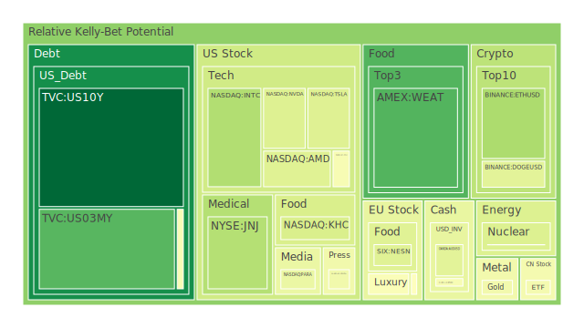
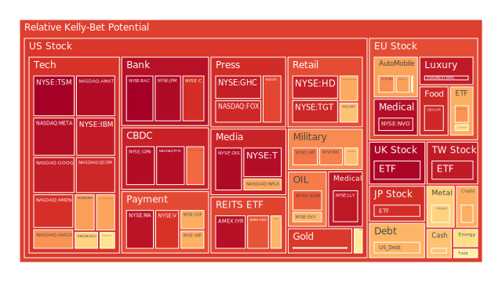
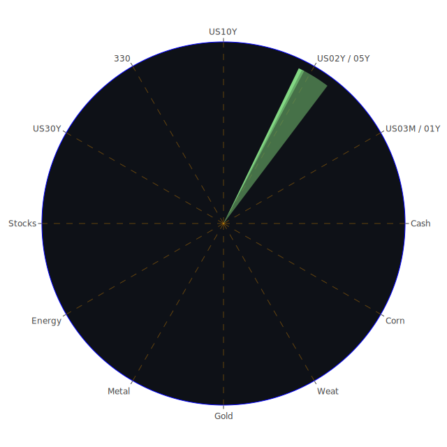

# 三位一體（Spatial, Temporal, Conceptional）之大膽假設與概括

在空間層次（Spatial）方面，當前全球市場受到多重消息衝擊，尤其新聞中提及美國與加拿大、墨西哥等國互相加徵關稅的訊息時有出現，導致全球供應鏈與各國進出口企業可能面臨成本加劇或貿易壁壘。再者，俄羅斯與烏克蘭衝突仍有高頻次的負面新聞，包括俄方空襲、烏克蘭方的防禦以及歐洲多國的政治動盪，這些地緣政治的空間分佈風險使國際資本在區域選擇上更加謹慎。

在時間層次（Temporal）方面，美聯儲（FED）歷經數月來資產負債表的持續調整，近期數據顯示FED總資產水位仍在降低，而逆回購（RRP）顯示資金可能從某些短期流動工具撤出，TGA（美國國庫餘額）卻有上升趨勢。歷史上，一旦緊縮態勢加劇又遇上關稅或地緣衝突，往往會導致市場劇烈波動。例如2008年金融危機與之後的歐債危機，也是在信用與資金流之間出現了時間差，疊加政策干擾，形成金融市場的連鎖反應。

在概念層次（Conceptional）方面，當前市場上對「通膨預期」、「地緣政治風險」、「貿易戰」、「貨幣政策轉向」等議題都存在不同程度的心理預期與博弈考量。新聞裡關於「特朗普關稅」再度引發的紛爭，即是典型的博弈論案例：各國如加拿大、墨西哥、甚至歐盟都會思考對等或更強的報復，或在國際組織提起法律行動；美國國內也有人懷疑此關稅政策可能引爆更深層的產業衰退風險。從社會心理學來看，在資本市場高位波動下，投資人更容易被負面新聞帶動恐慌，而造成流動性需求提升，一旦市場短期資金需求無法被滿足，就容易爆發流動性抽乾的風險。

透過空間、時間與概念三位一體的正反合分析，可以綜合出以下幾個初步假設：

1. **空間層次（Spatial）假設**：關稅戰、地緣衝突與區域性銀行體系壓力將使資金更傾向流向「相對安全、政治穩定」的區域，帶動美元、黃金及特定主權債市需求。衝突嚴重地區相關企業或供應鏈仍處高風險泡沫邊緣。

2. **時間層次（Temporal）假設**：美聯儲持續貨幣緊縮或維持相對高利率區間的時間若延長，疊加關稅與政治干預，企業融資成本與債券收益率之間將產生高低錯位，市場可能在未來數月出現大量債券到期無法順利再融資的風險。若再遇到歷史上類似2000年網路泡沫與2008年金融危機中「資金鏈斷裂」的狀況，波動性會進一步加劇。

3. **概念層次（Conceptional）假設**：投資者對各國央行與政府衝突的認知，容易產生心理層面的避險需求，加密貨幣雖可能受此追捧，但歷史上加密資產波動極大，若泡沫風險指數飆高，長期投資者還是會在此高波動階段持保留態度。傳統的黃金或美國長天期國債，雖然也可能遇到價格高估，但往往在高壓政治環境下，被視為避險工具。

---

# 投資商品泡沫分析

以下針對主要資產類別，在目前新聞與市場動態下，進行相對泡沫與風險評估。部分新聞影響力較高，如「特朗普關稅」「俄烏衝突」等負面事件密集，市場焦點也聚集在科技股、軍工股、加密貨幣等領域。歷史上經驗顯示，若以上因素持續累積，可能推升金融市場波動。因此以下分析皆納入了心理因素與投機過度之可能。

---

## 美國國債

美國國債（例如US10Y、US02Y、US05Y、US30Y等不同年期）近期殖利率水準在4%多至接近5%上下波動，與去年同期相比，有所回落但仍處於相對高位。結合新聞顯示，美國國內政治雖然充斥關稅爭議，但美國國債多數時候依然具有全球避險角色。只是不斷有負面聲音質疑美國政府財政狀態，尤其在關稅衝擊的背景下，進口成本增加，長期對GDP增長不利，故存在一定泡沫疑慮。歷史上2011年美國主權信用評級下調雖引發市場震盪，但最終美國國債價格依舊走升。現階段美債需求仍強，但需留意FED緊縮步調或出現節奏轉折。D1、D7、D14、D30風險分數雖非極端高，但若地緣變局突然爆發，避險資金涌入和債務規模之間不平衡，仍可能引起殖利率大幅波動。

---

## 美國零售股

零售股當前承受兩股壓力：一是關稅若導致消費品進口成本升高，零售利潤將受壓縮；二是若消費者信心因政治動蕩或經濟下滑而減弱，零售需求可能衰退。近期新聞裡有提及美國多間公司裁員消息，也有關於消費者購買力可能下滑的報導。歷史上2008年金融危機時，零售板塊首波受傷害甚深；2018年中美關稅風波也曾使部分零售商進口成本激增。雖然本報告內部的風險指數顯示仍未到達極端，但不可忽視泡沫風險；技術層面若再次爆發恐慌拋售，短期可能急速下探。

---

## 美國科技股

科技股（如AAPL、MSFT、GOOG、META、NVDA、AMD等）在2024年至2025年初大漲後，面臨估值高企的問題。許多新聞顯示大型科技公司業績略低於市場預期，例如雲端或數據中心成長開始放緩。有關「非法壟斷」等司法訴訟也時有所聞。再者，對半導體與AI領域之熱情伴隨地緣競爭與高資本開支，也累積了不少投機成分。過往2000年網路泡沫即發生在「新經濟」信仰過熱，市盈率連續膨脹時。目前D1與D7風險分數在部分龍頭（如微軟、蘋果）水準高企。新聞提到多家科技企業財報不如預期，或裁員、或調降雲端與廣告收入預測，這使得市場對科技板塊的樂觀情緒大打折扣。

---

## 美國房地產指數

房地產市場受利率上行與貸款成本攀升影響，企業投資型房地產開始顯示壓力，例如REITs相關標的在新聞裡時有傳出股價下挫的報導。歷史上2008年次貸危機的教訓猶在，如今商業不動產可能因工作模式轉變（遠距辦公）導致辦公室空置率上升，加上FED房貸利率接近7%，容易打擊購屋需求或再融資能力。新聞裡也可見部分貸款延滯數據呈現走高，可能預告未來會有違約情況增多的風險。若政治或地緣衝擊拖慢經濟成長，房地產泡沫風險亦會更顯著。

---

## 加密貨幣

比特幣（BTCUSD）、以太幣（ETHUSD）與狗狗幣（DOGEUSD）等的新聞話題熱度時高時低。從心理學上看，每當有系統性風險出現，部分投資者視加密資產為對沖通膨與政府干預的選擇，但同時也伴隨高度泡沫與槓桿風險。回顧2018年、2021年和2022年，數次熊市暴跌都反映加密市場過度槓桿化，一旦信心動搖，資金就猛烈撤離。新聞中有提及一些加密交易所端出新的融資方案，但若整體流動性下降，價格恐急跌。加密資產泡沫指數往往在市場情緒過度亢奮時升至高點，近期D7或D14雖不似極端，但仍位於歷史偏高水準，投資人要保持警惕。

---

## 金/銀/銅

金價（XAUUSD）在新聞裡反覆提及因地緣動盪與高通膨預期而被視為避險資產。不過近年來金價也常在投資人恐慌或Fed政策風向轉折時，出現劇烈波動。銀與銅則更受工業需求影響，一旦關稅推升製造業成本，可能影響全球生產與需求。從歷史上看，若關稅造成經濟衰退或減少投資支出，銅需求可能下行。銀則介於工業和貴金屬避險屬性之間。新聞面顯示當前對工業金屬需求尚未有明顯復甦信號，因此盲目追高或低接，都須同時評估關稅與地緣風險。在2025年之初，金銀泡沫分數仍處於中高水準，稍有風吹草動就可能加速價格波動。

---

## 黃豆 / 小麥 / 玉米

農產品期貨（如SOYB、WEAT、CORN）在新聞面中較少直接焦點，但若關稅戰延伸到農業產品出口，或因地緣衝突造成產地供應受阻，則價格易大幅波動。回顧2012年美國乾旱與俄烏衝突對小麥出口的影響，農產品期貨曾一度飆漲。近期新聞也提到某些國家在反制美國關稅時，會進一步針對美國農業產品下手，造成美國農民壓力。如果這種情況擴散，短線農產品價格可能迅速波動，但若全球需求同時疲弱，則漲勢有限。就泡沫程度而言，此類商品過去較易在特定季節或天氣狀況引發價格劇變，須留意未來數月的氣候與政策訊號。

---

## 石油 / 鈾期貨

石油（USOIL）價格受地緣衝突、OPEC政策、以及全球經濟景氣的交互作用。新聞裡反覆提及對油價的談判、以及不同國家施行能源稅、補貼或限制出口等，令油價波動加劇。歷史上1970年代石油危機與2014年油價崩跌都展現了石油市場受政治與產能布局之左右。眼下對石油泡沫風險的評估偏中等，但若俄烏衝突進一步惡化，或美國進一步針對中東國家關稅或制裁，油價可能再度飆升。

鈾期貨（UX1!）相對是小眾標的，但在國家能源安全議題升溫時常被提及。新聞中若有關於核能發電計劃擴張或地緣衝突對鈾供應鏈影響的消息，可能觸發投機炒作。但市場規模小，流動性不如主流商品。歷史上鈾價格曾在2011年日本核災後跌入低谷，也在核能重啟議題上出現波段漲勢，投資人要特別警惕其高波動與流動性風險。

---

## 各國外匯市場

外匯市場同樣受政治與關稅影響較大。新聞裡可見如墨西哥披索、加拿大加元等因美國關稅政策而出現明顯貶值；英鎊與歐元也面臨英歐內部政治紛擾。對美元則因其避險屬性，在動盪時易受到資金流入而升值。若貿易衝突持續升級，外匯市場或出現新一波波動。歷史上1997年亞洲金融風暴與2015年瑞郎黑天鵝，皆顯示外匯市場的連鎖影響與極端事件風險。投資人若進行貨幣對沖，需要對當前關稅、地緣戰略以及各國央行利率策略有充足理解。

---

## 各國大盤指數

各國股市大盤（例如美國主要科技指數、歐洲STOXX、德國DAX、法國CAC、英國FTSE，以及日本日經指數、台灣大型龍頭ETF等）都在近期新聞裡遭遇負面衝擊：一是貿易戰擴散的風險；二是地緣政治高度不確定；三是市場對全球經濟前景轉趨謹慎。歷史上2018年的關稅波動就曾顯示，若中美或美歐關係惡化，各國股市都難免一波大幅修正。D7、D14泡沫指數若在高檔徘徊，警訊就越明顯。須密切注意經濟數據及企業財報，以判斷短中期走勢。

---

## 美國半導體股

半導體股票（如NVDA、AMD、QCOM、KLAC、AMAT等）擁有龐大市值與高成長想像空間，多家企業也積極投入AI與高速運算領域。然而新聞裡提到某些廠商對未來成長預期降低，顯示部分訂單可能因終端需求放緩或地緣管制政策而削弱。歷史上半導體產業有明顯週期性，上行時資本支出大增，下行時庫存和資本密集度造成獲利壓力。若宏觀環境繼續受政治風波影響，加上大盤整體評價偏高，半導體股可能出現大幅震盪。需注意是否形成「創新動能強，但短期獲利無法支撐」的泡沫型態。

---

## 美國銀行股

美國銀行股近期雖受益於利率相對高水準，銀行淨利差增加，但大環境緊縮中亦可能產生資產減損與不良貸款問題。新聞裡多次提到信用卡壞帳率走高，商業地產貸款違約風險也攀升。回顧2008年金融危機，銀行股往往在初期利率上行時仍看似穩定，後期才爆發流動性和資本不足問題。若FED貨幣政策繼續高利率，部分銀行壓力可能加大，尤其中小型銀行在經濟週期下行時風險更大。投資銀行股時要警惕潛在的泡沫化風險。

---

## 美國軍工股

軍工股（如LMT、NOC、RTX等）在新聞裡與地緣衝突密切相關。有關俄烏戰事的進程、其他地區緊張局勢或國防預算增加，都可能推升軍工企業訂單。歷史顯示軍工股在國際緊張加劇時，通常能維持較高防禦性，但若戰爭或衝突局面進入膠著或談判階段，也可能引發短線回檔。此外，各國政府預算有限，若經濟衰退，軍備開支能否持續擴大也是疑問。投資此板塊需注意政治轉折與國防政策的落實時間差。

---

## 美國電子支付股

電子支付領域在近幾年有顯著成長，但新聞裡有指部分大型支付企業在金融監管或競爭對手崛起下，增速有放緩跡象。若消費市場萎縮或經濟不景氣，電子支付交易量也可能增長不及預期。比較歷史經驗，電子支付並未完全擁有「逆經濟週期」特質，仍受民眾消費力與線上零售景氣所影響。泡沫程度可能潛藏在對「未來無限成長」的高估。

---

## 美國藥商股

藥商股（如MRK、LLY等）通常具備防禦性，但也有研發風險、法規與專利糾紛等不確定因素。新聞裡提及部分新藥審批延誤、或遭逢法規重大挑戰，市場情緒也會影響股價。回顧歷史上，當公共健康政策被高度政治化或財政壓力過大時，藥價管制或健保爭議可能一夕之間影響藥商獲利，從而觸發股價震盪。就短期而言，藥商股的泡沫風險不算最高，但也不可忽視政策面轉變的衝擊。

---

## 美國影視股

影視產業（如DIS、PARA、FOX等）一直受串流媒體競爭、廣告收入變化的影響。新聞顯示多家傳統影視公司仍在調整商業模式，面對高額內容投資與觀眾口味快速變動。歷史上此產業具有「內容爆款」帶動股價、亦有「虧損拖累」的高波動特徵。若廣告市場因關稅衝擊或整體經濟轉弱而縮水，影視公司獲利將面臨挑戰。

---

## 美國媒體股

媒體股與影視股雖有部分重疊，但更廣泛涉及報紙、電視網、網路平台等。新聞面中，部分媒體公司因網路新興平台的競爭，訂閱與廣告營收穩定度不如以往。若整體經濟下行，廣告預算縮水會使媒體股泡沫風險升高。回顧2000年網路泡沫破裂時，不少傳統媒體也因廣告收入下滑而股價暴跌。當前政治氣候也會牽扯媒體的公信力與觀眾流失，新進或轉型平台的競爭更激烈。

---

## 石油防禦股

從市場經驗來看，部分石油企業或石油服務公司具有一定「防禦性」，因石油需求在全球仍為相對剛性。但新聞裡卻提到電動車普及、能源轉型趨勢或國際制裁等議題，增加化石燃料類股的長期風險。回顧2014-2016年油價大跌使石油公司慘遭拋售，雖2022年以來油價反彈，但若再次爆發經濟衰退，仍無法排除新一波下滑。泡沫風險在於對石油需求的過度樂觀預估，以及地緣衝突引發的短線炒作。

---

## 金礦防禦股

金礦股通常與金價高度正相關。新聞上若顯示地緣局勢緊張、關稅戰風險提高，金價往往受到青睞，金礦公司股價同步受惠。然而歷史上，金礦類股波動性往往比金價更大，且面臨產量、開採成本與環境規範等挑戰。若金價只是短期因避險需求被推高，但實質經濟環境無法支撐，更可能出現金價與礦業營運脫鉤的情形，投資要警惕此類陷阱。

---

## 歐洲奢侈品股

歐洲奢侈品公司（如RMS、MC、KER等）常被視為高端消費象徵，也受全球富裕人群消費習慣左右。新聞若呈現富裕階層受金融市場波動影響縮減奢侈消費，該類股價亦可能顯著下滑；反之，若新興市場上層消費維持增長，則能提供底部支撐。歷史上2008年金融危機也曾大幅削弱奢侈品消費，但之後由於新興經濟體富人增多而迅速反彈。因此此類標的在地緣政治、關稅政策下並非絕對穩健，仍需謹慎觀察全球富裕群體的資產變動。

---

## 歐洲汽車股

歐洲汽車製造商（如BMW、MBG等）在新聞裡反覆提及受美國與歐盟的潛在關稅博弈影響。回顧2018年的關稅爭端，德國車廠便因美國威脅對歐洲汽車課稅而股價受創。再者，俄烏戰爭與能源價格上升，也衝擊汽車供應鏈。電動車轉型雖是長線機會，但短線研發投資巨大，疫情以來晶片短缺雖有所改善，卻也壓迫利潤率。泡沫風險在於投資人對歐洲高端車市前景過度樂觀，一旦全球需求下滑或關稅擴大，會產生大幅調整。

---

## 歐美食品股

食品行業被視為某種程度的防禦標的，像是KO、KHC、NESN、ULVR等，但新聞裡亦有提及原物料與運輸成本壓力。若關稅提高令出口食品或其原料供應受到衝擊，或者地緣衝突造成產地生產不穩，食品股盈餘也會下滑。歷史上食品業雖較不易出現股價暴跌，但一旦基本面惡化，長期回報同樣會被削弱。必要消費雖相對穩定，但若經濟環境過度惡化，仍可能遇到營收持續下行。

---

# 宏觀經濟傳導路徑分析

綜合上述資產類別，大體可由三位一體的空間（地域衝突、貿易關稅紛爭）、時間（利率緊縮週期、商業週期）、概念（市場預期、政策博弈）三方交互影響，導出以下宏觀傳導路徑：

1. **利率與資金流動**：美聯儲與其他央行的貨幣政策若長期維持緊縮，高利率環境下企業融資成本上揚，各類資產估值泡沫受到壓抑。同時，區域衝突或貿易不確定性則使資金青睞美元與美債，造成他國貨幣或資產承壓。

2. **關稅與通膨**：特朗普關稅主張使多國報復性關稅同步升高，導致輸入性通膨上升或供應鏈動盪。農產品、工業金屬、能源與零售品價格可能受到衝擊，也間接影響企業利潤、就業與民間消費。

3. **地緣政治與市場預期**：歐洲、美洲、亞洲若各自陷入政治分裂，或地緣衝突不斷升級，投資人對經濟前景的預期將更趨謹慎，增添金融市場的不確定性。

---

# 微觀經濟傳導路徑分析

1. **企業利潤與資本支出**：高關稅環境下，企業原物料與中間品成本上升，淨利受壓。若銷售量同時下降，資本支出勢必縮減，形成對科技、半導體、機械、運輸等供應鏈的傳導效果。

2. **消費者行為與就業**：裁員消息不斷，企業受利潤壓縮後可能進一步裁減人力，造成消費力萎縮，進而影響零售、服務業等部門，使經濟走向疲弱循環。

3. **金融槓桿與連鎖風險**：如果銀行因企業違約與貸款質量惡化，資產負債惡化將影響信用擴張。倘若發生信用收縮，會波及股市、房市與企業投資決策，引發連鎖去槓桿效應。

---

# 資產類別間傳導路徑分析

1. **股票—債券**：若市場再度出現恐慌，資金可能快速由股票流向債券，但若國家財政疑慮浮現，長天期國債也會在某些情況下被拋售或殖利率轉而飆高。這種正反合情境下，同時需要對衰退風險與政府信用做動態評估。

2. **股票—大宗商品**：地緣衝突推升油價、金屬價，但若衰退擔憂進一步擴大，工業金屬需求恐下滑；而黃金、白銀在避險情緒高漲時會出現反向走高。此傳導過程對周期性企業與防禦性資產之間造成不同漣漪。

3. **房市—銀行**：房地產價格下跌增加銀行不良貸款與抵押品貶值風險，銀行股價格下挫又可能抑制其他投資活動，如此往返互斥，可能加深金融體系風險。

4. **匯率—國際資本流動**：若地緣政治衝突升溫或貿易關稅升高，資金往往流向避險貨幣與金融市場，造成其他新興市場與非美元貨幣貶值，並與該國的債市、股市形成負向循環。

---

# 投資建議

在此複雜環境下，建議投資人要分散資產，兼顧地緣政治變數與全球貨幣政策轉折。必要時應採用風險對沖策略，避免單一市場或單一產業曝險過大。以下提供穩健、成長與高風險三大類，各有三項子投資標的與配置比例，僅作為參考：

1. **穩健（合計30%）**  
   - **美國10年期國債（10%）**：在全球風險升溫時具備一定避險功能，雖有利率波動，但尚屬抗震。  
   - **黃金（10%）**：長期對衝地緣政治衝突與通膨的傳統選擇。  
   - **防禦型消費品股票（10%）**：如食品、必需消費品龍頭，即使經濟波動也較能維持穩定需求。

2. **成長（合計35%）**  
   - **半導體/AI相關股票（15%）**：長期來看，人工智慧應用仍有巨大潛力，但需留意泡沫風險。  
   - **歐洲奢侈品股（10%）**：雖受高檔消費力波動影響，但在全球富裕族群的需求下長期仍具潛力。  
   - **電子支付與雲端服務（10%）**：數位化趨勢不會輕易逆轉，然而要評估反壟斷與成長不及預期的風險。

3. **高風險（合計35%）**  
   - **加密貨幣（20%）**：可望享受避險或投機資金湧入的紅利，但高波動且政策監管風險甚大。  
   - **新興市場股票（10%）**：若關稅風波稍緩，新興市場可能有估值修復空間，但地緣政治或疫情等突發因子不可預測。  
   - **高收益債券（5%）**：利率高企可帶來利息收入，但違約風險不容小覷，需要分散佈局。

因以上僅為概括之投資組合，每個投資者都需依據自身的風險承受度、資金規模與投資期限來做分配與動態調整。值得強調，三大類資產之間在理想狀態下相位盡量分散，相關係數力圖控制在負0.5左右，目的是追求在負面事件衝擊時能互相對沖，而非同向放大風險。

---

# 風險對沖與多項資產間的漣漪效應傳導

若在空間與時間層面同時爆發地緣政治惡化與國際關稅衝擊，存在資金大幅撤出風險。對沖策略可優先考量：

1. **跨貨幣對沖**：若有較重的海外股票或債券部位，可利用美元、日圓、或黃金部位做保值；同時，若對歐洲市場存疑，適度配置美元流動性或購買美國短期國債以分散。

2. **選擇權與期貨**：針對石油、金屬、農產品或主要股指的看空或看多期權，根據市場波動率衡量成本。若新聞顯示衝突升溫或關稅談判破裂，適時調整保護部位。

3. **行業對沖**：在房地產風險提高時，可同時擁有建材、原物料或黃金的部位；一旦房市下跌，建材與金屬因基建刺激或避險需求可能提升，這是一種微觀層面的相位分散。

經過上述的兩兩篩選假設分析，不同資產因三位一體（空間、時間、概念）的外力衝擊，而在各自的價值鏈中產生遞延或放大的漣漪。一旦美國科技股大跌，可能衝擊半導體供應鏈及廣告、支付、電商平台；若石油或大宗商品反彈，則會提升通膨預期與物流成本，使零售股再受衝擊。投資人要持續關注新聞脈絡、歷史先例及政策博弈的走向，才能及時捕捉風險對沖機會或避開泡沫風險。

---

# 風險提示

投資有風險，市場總是充滿不確定性。本報告所提供的建議僅供參考，任何人都應根據自身的風險承受能力與投資目標，做出獨立決策。歷史上曾多次證明，當利率循環、關稅博弈、地緣政治或市場情緒驟變時，資產的價格可能瞬息大幅波動。尤其在當前政治環境複雜、多數新聞報導具高負面情緒指數，加之泡沫風險指數在許多資產類別都未處於低位，請務必嚴加留意潛藏的「黑天鵝」或「灰犀牛」事件，並慎防任何過度槓桿或盲目樂觀。切記，穩健與風控始終應是投資配置的核心原則。

 
Daily Buy Map:

 
Daily Sell Map:

 
Daily Radar Chart:

 
