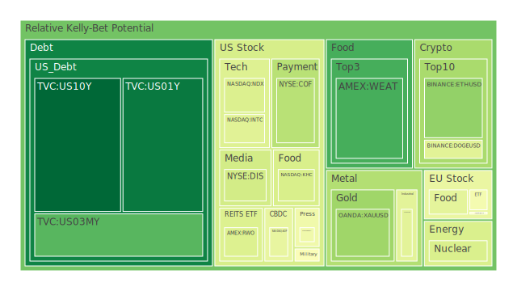
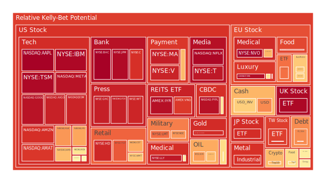
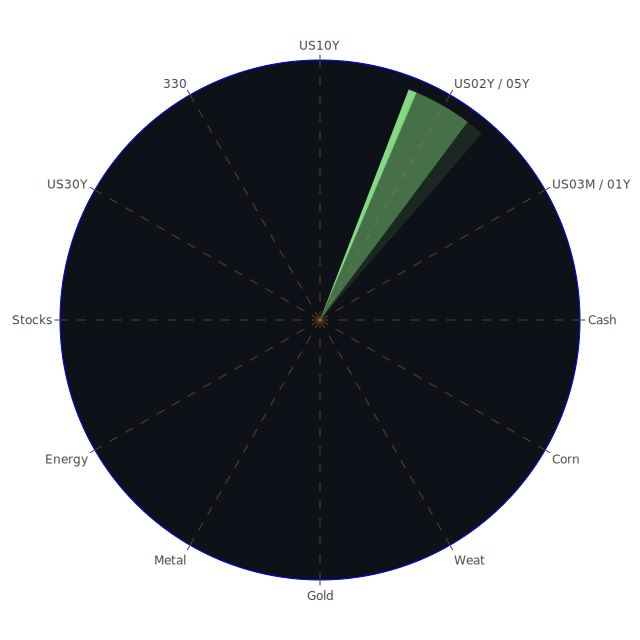

# 投資商品泡沫分析

## 美國國債
美國國債近期走勢受到市場對聯準會政策、通膨數據、地緣政治局勢以及財政赤字擴大與否的多重影響。根據近期數據顯示，1Y與2Y殖利率分別在4.17～4.20以及4.18～4.19上下浮動，10Y、20Y、30Y殖利率則在4.40～4.70之間波動。有意思的是，年初曾出現倒掛幅度相對顯著的現象，如3M與10Y一度呈現負值差異，但現在逐漸回歸至略正或接近持平的狀態，顯示市場對未來數個月、數年之利率與景氣預期正進行微妙調整。

從新聞來看，屢次出現涉及關稅、政治對立以及地緣衝突的負面情緒，通常意味著市場對避險資產需求可能上升，但同時聯準會也展現出縮表、提高實質利率的政策取向，意味著長天期債券仍可能受到拋售壓力。歷史上，2000年科技泡沫或2008年金融海嘯期間，美債都是避險資金流入的重要去處。然而當前10Y與30Y的殖利率雖然高於前幾年，但整體仍面臨著政府財政狀況的壓力，加之新聞裡多次提及對外資持有美債縮減、FED持有存量仍高企等狀況，都可能引發中長期的波動與不確定性。

在泡沫分數層面，1Y、2Y、3M等短債指標時而顯示出短期追捧或拋售，近期因市場對通膨降溫與聯準會可能維持較緊縮政策之間拉扯，而產生走勢互有擺盪。若未來地緣政治或關稅戰線惡化，短債需求上揚、長債反而承壓也不無可能。綜合來看，美國國債的泡沫風險雖相對較小，但隨著債務上限、財政赤字以及FED縮表等種種因素交織，仍需提防可能的利率波動風險。

## 美國零售股
美國零售股如WMT、TGT、COST、HD等均與內需消費緊密相關。數據顯示，WMT和TGT近期泡沫指數不低，各自的D1風險分數在0.65～0.83之間，TGT尤其一度高達0.91。這反映出零售板塊對於整體消費力道、美國就業市場與通膨的敏感度。新聞裡關於特朗普關稅、不斷升溫的政治紛爭以及企業獲利下修指引，都對零售股構成不同程度的負面衝擊。歷史上，在2019年前後，貿易戰時期的關稅升高曾推動零售公司進口成本上揚，導致價格轉嫁給消費者難度提升，最終影響股價。若再類比2008年經濟下滑期間，零售商必須在庫存與銷售之間尋找微妙平衡，一旦失誤可能造成獲利大幅下修。

目前新聞報導提及「保護主義升溫」「新一輪關稅威脅」及「美國勞動力成本上漲」等議題，結合FED利率相對維持高檔，消費端信用卡違約率（Charge-off Rate on Credit Card數據顯示正在上行）也對零售股構成壓力。儘管COST相較之下專注高端會員制與高週轉率，WMT則依賴多元品項與價格競爭力，但在泡沫風險評估上，都需審慎看待短期財報衝擊與長期通膨、失業率、利率循環的影響。

## 美國科技股
美國科技股近來因AI熱潮而一度帶動市場投機熱度，如AMD、NVDA、GOOG、META等半導體與網路巨頭，都在過去幾個月展現過快速漲幅，根據本次泡沫分數來看，這些股票的D1風險分數普遍高於0.5，部分更接近或超過0.9。例如META、GOOG、NVDA、AMD、AMZN在D1的風險指標皆呈現偏高水準，顯示市場對未來成長預期過度樂觀或存在相當程度的炒作。

新聞上出現關於雲業務不及預期、廣告收益遭遇瓶頸、部分企業（如GOOG）被針對其壟斷行為而面臨監管風險、以及持續不斷的裁員潮等，都可能拉低投資人對科技股的信心。歷史上類似的熱炒情形，可以回顧2000年「網路泡沫」，同樣是對未來科技場景的絢麗想像，吸引了大量資金湧入，但當營收與獲利未能跟上，修正就會來得猛烈。雖然當前AI、資料中心等應用確實在企業數位化進程中具備長期潛力，但短期供應鏈雜音與利率環境不可忽視。若利率持續維持高位，估值偏高的成長型科技企業將面臨折現率的衝擊，因此須謹慎留意潛在泡沫風險。

## 美國房地產指數
美國房地產相關ETF與指數，如RWO、IYR、VNQ等，近期泡沫指數顯示在0.60～0.96的區間波動，其中IYR的一度D1高達0.96左右，顯示對房地產未來走勢的分歧與投機氛圍並存。新聞層面則不時提到建築成本受關稅影響升高、利率壓力導致按揭費用增長，以及某些地區房價尚未進入回調或回調幅度不足的分歧現象。此處需要回顧2008年金融海嘯時期，次級房貸破裂引爆系統性風險；雖然現今金融監管更為嚴格，銀行資本要求更高，但若民眾還款壓力增大，或商業地產空置率上升，都可能帶來資產品質下滑的風險。

同時，新聞裡提及有些地區工資增幅跟不上通膨，加之新一輪關稅與製造業回流的政策變數，使許多房地產投資信託在籌資與分配收益之間面臨挑戰。投資人需關注房地產ETF的殖利率與基礎不動產價值是否出現脫節，一旦聯準會貨幣政策更鷹派，或者衰退預期攀升，房地產類資產就會面臨波動。眼下雖有些地區仍保持供需緊俏，但整體大環境對房地產並不算友善，特別是在利率持續高檔與消費者償付能力下滑的情形下，房地產板塊存在一定風險。

## 加密貨幣
加密貨幣如BTCUSD、ETHUSD、DOGEUSD等，透過泡沫分數觀察，其中BTCUSD、ETHUSD、DOGEUSD的D1風險多在0.40～0.69之間浮動，但長期來看，周與月平均泡沫評分常呈現上升趨勢，顯示投機氣氛仍相對活絡。新聞面上，並無太多正面消息，加之全球監管趨勢、部分交易所財務狀況不透明，常常一則負面訊息便足以引發大幅修正。歷史上可以參考2017～2018年大幅飆漲與回跌、以及2021～2022年期間多次跳水的經驗：市場對加密貨幣熱情雖高，但一旦流動性縮減或監管收緊，就可能驟然反轉。現今地緣政治動盪、貨幣政策緊縮，以及投資者對高波動產品的承受度變化，也是一大風險關鍵。

## 金 / 銀 / 銅
黃金XAUUSD、白銀XAGUSD、銅COPPER向來是全球資金在通膨預期、地緣衝突升溫時的重要觀察。最新報價顯示，黃金價格一度升破2800美元區間（數據中的價格模式顯示可能是特殊折算，但可理解為高價），白銀則在31～32區間震盪，銅約在4.3～4.4美元附近。新聞裡近期對通膨以及地緣政治的負面情緒，都可能推升金銀買盤需求，特別是數次提到「俄羅斯空襲」「烏克蘭戰事」等負面新聞帶來避險思維。歷史上，每逢美元走強與利率攀升，黃金會面臨一定壓力，但若地緣衝突或系統性金融風險擴大，它仍可能吸引避險資金。白銀通常波動更大，也具有部分工業需求屬性；銅則是衡量全球製造業需求的風向球，一旦國際局勢轉差、供應鏈混亂，銅價也會劇烈波動。未來若中國或其他新興經濟體需求不振，銅價仍有下滑可能，而黃金白銀則比較依賴市場對避險的偏好。

## 黃豆 / 小麥 / 玉米
黃豆（SOYB）、小麥（WEAT）、玉米（CORN）近期皆牽涉到關稅政策及全球糧食安全議題。WEAT、SOYB、CORN的D1風險分數約在0.15～0.61間，顯示投資人對農產品期貨仍有戒慎，但未出現極端恐慌或狂熱。歷史上，1970年代石油危機或2011年的糧價飆漲，都有因天災或國家之間的貿易摩擦導致價格瞬間衝高的案例。新聞報導屢次提到「Trump Tariffs Could Raise Costs」「貿易戰可能推高糧食價格」，在供給面若遭受氣候或地緣因素衝擊，價格就會顯著波動。一方面，天氣、戰事都可能限制農作物產量，另一方面全球需求也受到經濟週期左右，故農產品的基本面牽涉範圍廣、變數眾多，建議投資人持續觀察氣候情形與國際貿易糾紛的走向。

## 石油 / 鈾期貨UX!
原油（USOIL）價格近期徘徊在70多美元上下波動，數據顯示D1風險指標大約在0.55～0.59左右；鈾期貨（UX1!）則在70左右。新聞報導指出美國對加拿大、墨西哥的石油關稅在一度延期，但依舊可能帶來不確定性，再加上全球需求面受經濟放緩與電動車普及衝擊，使原油價格易漲難跌又反覆震盪。歷史上，地緣政治緊張如中東衝突，往往推升油價；近年轉型能源的浪潮又壓抑長期需求，形成多空交織。鈾作為核能發電關鍵，也和全球能源轉型、核安全辯論相關。一旦各國軍事與核能相關新聞升溫，鈾價可能快速波動；若安全疑慮提高，則核電計畫受阻，需求也會出現不確定。建議關注中東或其他地區可能爆發的能源糾紛、或核能投資政策轉向。

## 各國外匯市場
主要外匯如EURUSD、GBPUSD、USDJPY、AUDUSD等，受到不同央行貨幣政策與全球經濟前景影響。新聞屢次出現「ECB與英國央行同樣面臨通膨壓力」、「澳洲原物料需求受中國放緩影響」等議題，結合美國相對鷹派或轉趨觀望的聯準會政策，都可能使貨幣對方向出現劇烈擺盪。例如目前EURUSD約在1.04上下，英鎊與美元在1.24～1.25區間震盪，日圓USDJPY在152～155左右。從歷史視角看，歐債危機時期曾大幅貶值；英國脫歐公投時段劇烈跳水；日圓在金融危機時期常被視為避險貨幣，但因日本央行長期維持低利率，現在反而經常出現外資套利交易。對投資人而言，外匯風險通常需結合利率走勢與避險需求而定，不少新聞負面情緒其實會驅動部分資金流向美元，但若美債利率不再相對具有優勢，也可能帶動資金移出。需持續關注各國通膨數據與央行會議訊號。

## 各國大盤指數
全球主要指數包括美國的NDX、歐洲的GDAXI（德國DAX）、FTSE（英國FTSE 100）、FCHI（法國CAC 40），以及中國的000300，台灣的0050（代表台股50檔大型股），與日本JPN225等。資料顯示，NDX泡沫指數一度在0.40～0.62間浮動，但七日與十四日平均較高，顯示科技股權重大的指數投資人須警覺高估風險；歐洲指數如GDAXI、FTSE、FCHI普遍D1在0.60～0.98，最高甚至接近1，呈現相當高的短線熱度或風險。台股0050則也維持在0.95附近的高位，可能反映近年半導體族群的熱炒；日經JPN225也有接近0.90的D1，顯示資金在全球流動時刻意加碼日本股票，但實際企業獲利未必足以支撐如此高估值。

新聞面可參考的負面訊息包括：關稅政策影響全球供應鏈、歐洲地區動盪（德國選前示威、新任總理強勢推財政政策等）、以及亞洲各國對外貿易減緩。然而，同時又有利多訊息在於中國或美國基礎建設投資一旦增溫，可能提振整體市場風險胃納。歷史上，大盤指數在泡沫高點常伴隨市場對未來成長率的過度樂觀，一旦利率走向扭轉或經濟數據不佳，就會面臨急跌。在目前政治與地緣衝突頻繁的環境下，投資人需留意短線漲幅過大帶來的回調壓力。

## 美國半導體股
半導體族群（NVDA、AMD、MU、AVGO、AMAT、KLAC、INTC、QCOM、TSM等）普遍因AI、5G、雲端運算、大數據等趨勢而受到市場關注。根據資料顯示，不少半導體個股D1風險指標都高於0.6甚至0.9，如AMAT、TSM、QCOM都一度接近或超過0.95，代表短期或周線投資情緒極為熱烈。新聞也多次強調「AI需求強勁」或「伺服器晶片熱賣」，但也出現「企業對雲端資本支出縮減」、「手機出貨量下滑」等負面因素。歷史上，半導體向來周期性強烈，2019年的貿易戰以及2020年初疫情衝擊，都曾引發大幅度震盪。儘管長期需求可能被AI、車用電子、資料中心等推升，但目前庫存調整與宏觀環境並未完全釐清，需警惕若市場熱情消退，股價可能面臨急修的風險。

## 美國銀行股
美國銀行股如JPM、BAC、C、COF等，受到銀行貸款需求、資產品質、利率走勢與金融監管政策驅動。現行數據顯示，這些銀行股的D1時常高達0.90以上，BAC更是一度逼近1，暗示投資人對銀行股或有過度追捧情形。同時新聞指出不斷攀升的信用卡壞帳（Charge-off Rate）、商業地產貸款違約風險，皆對銀行體系有隱憂。歷史上2008年金融危機與2023年區域銀行風波，都在提醒投資者當市場流動性與銀行資本不足以應付突發提款或壞帳攀升時，銀行股很容易上演跳水行情。

從FED數據可見，目前FED資產負債表雖在縮減，但銀行總存款依然維持高水位，顯示市場資金尚未大舉抽離。不過若大環境衰退惡化、失業率攀升，銀行的消費性貸款與企業貸款違約率便可能走升。考慮到新聞中反覆提及的財政不確定與美國政府對銀行的監管壓力都可能加強，投資者須對銀行板塊保持謹慎。

## 美國軍工股
包含LMT、NOC、RTX等，與軍事衝突、國防預算息息相關。近期俄烏戰事持續，新聞屢有負面報導指出烏克蘭遭受上千次空襲，美國及歐洲國家對武器供應態度強硬。軍工股因此往往在地緣衝突升溫時受到青睞。但數據也顯示這些股票在D1有時衝高至0.78～0.80不等，顯示對未來軍事訂單的預期已在價格中反映部分情緒。歷史上，海灣戰爭、911事件與中東衝突時期都曾推升軍工股行情，但若衝突一旦趨緩，常常出現回落。

## 美國電子支付股
包含PYPL、V、MA、GPN等。隨著全球電商與行動支付發展，該板塊長期成長趨勢不容忽視。但從本次泡沫分數來看，PYPL一度超過0.96，V與MA也在0.85～0.93之間，GPN則一度達到0.96～0.97，可見投資者對電子支付產業的預期非常熱烈。新聞多次提到「裁員潮」「雲服務放緩」等信息顯示，消費者支出或企業服務端的成長速度可能減緩。電子支付在經濟景氣回落時恐受交易量縮減影響。歷史上每當經濟衰退，信用卡交易量與消費量都曾顯著放慢，導致支付服務股價面臨一定回調壓力。

## 美國藥商股
如LLY、MRK、JNJ，泡沫風險指標大多介於0.32～0.95。醫藥產業常被視為防禦性資產，不過新藥研發成敗、專利到期以及監管政策都會在短期帶來劇烈波動。新聞裡提到醫保與政策面更新，或特朗普、拜登政府對醫藥價格管制、藥價談判立場，都左右投資信心。歷史曾出現如2016年美國總統大選對藥價政策的質疑，帶動生技醫藥股一度重挫。當前雖然通膨與利率環境不利高研發成本的公司，但疫情後對醫療需求依然強勁。投資人應評估企業研發管線、專利狀態與現金流是否穩健，才不會因市場短線熱炒而忽略長期基本面。

## 美國影視股
美國影視股如NFLX，由於串流媒體競爭激烈，近來數據顯示其泡沫分數D1一度衝破0.70～0.84，對投資人而言，市場似乎在同時預期內容製作成本下降或訂戶數增加，但新聞裡多次提到實際營收表現可能稍有落差。歷史對照2020年疫情初期訂閱數暴漲，隨後2021～2022年訂戶衰退與競爭者增多，股價也隨之大幅修正。未來需看全球經濟景氣對娛樂支出的影響，以及新一輪串流平台間的整併或合作。

## 美國媒體股
如FOX、CMCSA、DIS、NYT、PARA等，新聞面近期提到「媒體廣告市場疲弱」「流媒體收益減速」，負面消息不少。例如DIS在0.68～0.97間的D1風險指標顯示該股短期波動大，因市場對其樂園與串流業務評估不一；FOX與CMCSA也因廣告與有線用戶下滑而承壓。歷史參考2008～2009年全球性廣告預算削減時，媒體股曾遭到營收大幅下修；2020年以來則是網路串流興起對傳統有線的衝擊。投資人應持續觀察消費市場與廣告商預算趨勢。

## 石油防禦股
如XOM、OXY等，時常在國際油價上漲或者地緣政治不穩時成為資金避險標的。然而，泡沫分數顯示XOM約在0.52～0.72上下波動，OXY大約在0.67左右，算是中等偏高水平。由於歐洲與美國持續強調能源轉型、也可能出台更多的環保法規，一旦油價不及預期或公司資本支出收緊，股價增長潛能可能受限。歷史上，每當油價突破新高，石油企業可獲高額獲利，但若供給面趨於充裕或需求萎縮，就會迎來獲利修正。地緣政治是極大的變量，如俄羅斯若進一步減少石油輸出，或中東危機升溫，都可能推升油價，間接帶動這些石油股。

## 金礦防禦股
如RGLD屬於金礦相關企業。當金價大漲時，金礦商往往受惠，但若其生產成本或地緣分散度不佳，也可能受整體市場牽制。數據顯示RGLD的D1一度逼近0.88～0.91，代表短線波動與投機需求並存。歷史上，2008年金融危機後金價暴漲，許多金礦商股價跟進大漲，但之後金價回落也造成股價顯著修正。建議在投資金礦股時，要評估該企業之採礦成本、產能擴張策略、以及政治風險（礦區所在國的政策與穩定度）。

## 歐洲奢侈品股
包含MC、KER、RMS等。這些公司顧客多半來自全球高消費族群，尤其是中國、北美與歐洲本土消費者。D1顯示有些標的如MC或KER在0.40～0.65之間浮動，RMS更一度衝高至0.94～0.96甚至接近0.97，代表市場對奢侈品需求復甦、以及中國遊客回流歐洲有頗高預期。然而新聞也指出地緣政治緊張、歐洲內部政治對立等可能打擊旅遊與消費。歷史上，每當經濟衰退，奢侈品業有一定抗跌性但仍受影響，如2008年或2020年疫情期間都曾出現銷售下滑。若當前全球景氣循環轉弱，該板塊也可能遭遇獲利壓力。

## 歐洲汽車股
如BMW、MBG等。歐洲車廠在新能源車投資上積極，但也面臨電池供應、全球關稅戰、地緣衝突對金屬原料的影響等。根據資料D1約在0.46～0.78，顯示投資人關注度高。新聞裡提到「Trump Tariff Plan Risks Upending Trade」，可能造成歐洲車廠在美國市場的發展受阻。歷史上，貿易戰時期歐洲汽車關稅議題一度令股價大幅回落。投資人需留意庫存水準、消費意願以及電動車技術發展是否能搶占市場份額。

## 歐美食品股
食品類股如KHC、NESN、KO、ULVR等，在D1風險指標約0.39～0.64，ULVR有時衝高至0.91；波動度雖較科技股小，但仍需留意高利率下的消費彈性。新聞顯示業者多面臨包材、人力、原料成本上漲。歷史上，食品業通常屬防禦性，但如果通膨飆升、消費者購買力下降，整體銷售量仍可能衰退。加之目前全球貿易糾紛，農產品價格或關稅都能衝擊食品公司利潤。最終要取決於品牌力以及轉嫁成本的能力。

---

# 宏觀經濟傳導路徑分析
在全球宏觀層面，聯準會（FED）的資產負債表縮減，以及多次釋出的鷹派言論，正在影響流動性與投資人對利率的預期。美債殖利率曲線雖部分倒掛程度縮小，但仍屬歷史偏高區間的短端利率；若景氣下行壓力加劇，短端利率可能回落並顯示需求趨弱，並同時推升避險性長端美債。然而，地緣衝突包括俄烏、歐洲政局以及美國對外關稅政策變數，都增添通膨或供應鏈混亂的風險。這些宏觀因素透過以下渠道擴散至各資產：

1. **利率影響投資評價**：對股票類尤其是高增長科技股的估值壓力更顯著，同時金融股貸款收益雖增加，但壞帳風險也相應上升。

2. **避險需求牽動商品與黃金**：若市場普遍預期衰退或地緣衝突升級，金、銀這類傳統避險品種會獲得買盤，石油價格也可能上下劇烈波動。

3. **企業利潤與就業動能**：關稅提升和政治干擾可能壓抑企業獲利，美國零售、科技、汽車等行業受衝擊更為直接，進而影響就業與薪資增長，最後反饋到整體經濟。

---

# 微觀經濟傳導路徑分析
在企業層面，供應鏈與通路需求是主要觀察重點。科技企業倚賴全球晶片供應與終端市場，若貿易壁壘升高，生產成本加大，毛利受到壓縮。零售與食品公司則在原物料成本（農產品、能源）與消費者需求（信用卡壞帳率增高、可支配所得）間尋找平衡，稍有不慎就會影響財報表現。銀行股既承擔貸款風險，也受惠於利息收入提高，但若出現經濟衰退或信用風險累積，內部資產減值與市場恐慌將導致股票價格大幅下修。軍工、能源、防禦性資產則不斷與地緣政治互動，任何外交風波、戰爭趨勢都能迅速引起投資人注目。

---

# 資產類別間傳導路徑分析
1. **股債互動**：若股市震盪加劇且投資人轉向避險，會推升國債需求，但若長期財政風險升溫，則長端國債也難免拋壓。  
2. **商品與貨幣**：能源與金屬價格若飆升，將推動通膨，令央行進一步緊縮，美元可能偏強，抑制新興市場股債；若衰退疑慮升溫，則有利黃金等避險資產。  
3. **地緣衝突與防禦資產**：軍工股、金銀礦股、部分大宗商品會成為階段性避風港，但若衝突結束，資金會快速轉移到成長型或風險資產。  
4. **匯率與國際指數**：若美元維持高檔，歐洲與亞洲的指數將承受資金外流壓力；反之若美債殖利率下滑，美股估值泡沫擔憂上升，全球資金或轉向歐亞市場。

---

# 投資建議
基於上述，將提出穩健、成長、高風險三種配置方案（合計100%），並給出各子項目的比例範例：

1. **穩健型（50%）**  
   - 美國國債（15%）：考量到短端利率雖高，但仍有波動，可同時佈局2Y與5Y分散風險。  
   - 黃金（20%）：地緣衝突與經濟不確定性為長期趨勢，適度增加避險。  
   - 高信用等級企業債（15%）：可望在中期內提供相對穩定的收益，減少股票波動衝擊。

2. **成長型（35%）**  
   - 大型科技股（15%）：如MSFT、AAPL等相對穩健者，長期仍具競爭優勢，但留意估值。  
   - 半導體龍頭（10%）：TSM、NVDA等受AI與高階運算趨勢支撐，但需控制風險敞口。  
   - 歐洲奢侈品或消費股（10%）：長期享有品牌溢價，但市場震盪時易波動，需中長期觀察地緣政治影響。

3. **高風險型（15%）**  
   - 加密貨幣（5%）：BTC、ETH等，波動極高，但長期仍有創新需求，不建議超過可承受範圍。  
   - 新興市場股票（5%）：如部分亞洲股市或高增長行業，具較大波動性，亦有高回報潛力。  
   - 軍工股（5%）：在地緣緊張時受青睞，但與政治局勢高度相關，一旦局勢緩和即可能回落。

上述配置比例僅為示意，需隨投資人自身風險偏好進行調整。之所以採取「穩健50%、成長35%、高風險15%」，是在目前利率仍高、地緣衝突頻仍、新聞面負面訊息較多之際，降低資產極端波動，並仍兼顧中長期成長潛力。

---

# 風險提示
投資有風險，市場總是充滿不確定性。本報告雖然從經濟學、社會學、心理學與博弈論多角度嘗試分析，但仍無法涵蓋所有突發因素，如政治領袖的即時言論、不可預測的外交事件或極端天氣對供需的衝擊等；任何黑天鵝事件都可能打亂現有預測。尤其是泡沫風險高的標的，例如部份高估值科技股、加密貨幣或地緣衝突題材股，一旦利多消退，波動將非常劇烈。歷史上每當流動性收緊及市場恐慌時，高波動資產會遭到大規模拋售，更需要投資人採納風險管理手段並保持彈性。同時，信用卡壞帳與商業地產違約率若進一步提升，或美國政府及各國央行在通膨與就業之間政策改弦更張，都將影響後市走勢。

在兩兩驗證篩選假設下，如果美國國債與房地產指數之間的分散效果不足、或者加密貨幣與科技股呈現高度正相關，則需要在組合中進一步弱化或調整該資產配置。利用不同資產之間約略滿足120度的相位差、相關係數約-0.5的對沖策略，雖然能在理想狀態分散風險，但實務上仍須注意流動性與交易成本。

總之，投資者需不斷檢視各種市場訊號，一旦FED的政策或地緣政治出現顯著變化，都有可能產生新的漣漪效應在不同資產間傳導。本報告提供的分析與建議僅供參考，切勿忽視任何泡沫風險與潛在警告，唯有在自身能承擔的風險範圍內做出理性的投資決定，才能在瞬息萬變的市場環境裡保持更大韌性。祝投資順利。

 
Daily Buy Map:

 
Daily Sell Map:

 
Daily Radar Chart:

 
