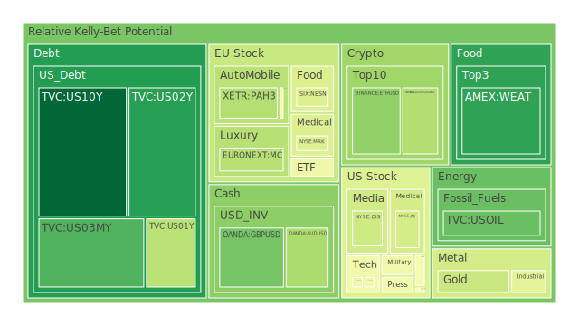
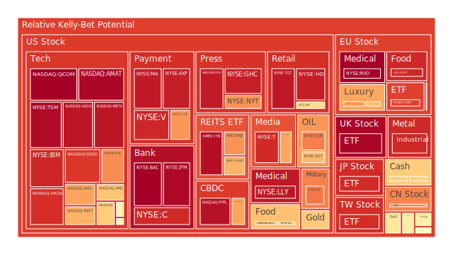
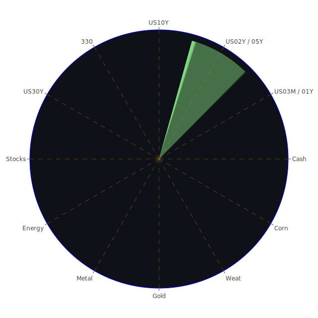

# 資訊航母與三位一體觀點（概述）

在建立「資訊航母表格」的過程中，我們可將「空間（Spatial）」、「時間（Temporal）」與「概念（Conceptional）」三種面向之市場與新聞資訊，進行正、反、合三個步驟的交互驗證。本報告將以文字敘述取代表格式呈現，說明何謂「三位一體」在投資分析時的運用：

1. **Spatial（三位一體之一）**  
   - **正面（正）**：觀察各地區、各市場之交易流動、通路及資金分佈。藉由空間維度，可以看到不同區域的資本與資源，如何在地理與市場空間中進行流動與交換。例如歐洲相對高通膨與美國就業市場數據的對比，常常提供了不同區域之間資金可能流向的早期訊號。  
   - **反面（反）**：此維度也必須看各市場區塊的分歧風險。例如近來在亞洲市場，有些國家對大宗商品有較高進口需求，而歐洲或美國對該等商品需求或庫存卻可能處於不同週期，這就帶來供需衝突或價格扭曲。  
   - **整合（合）**：最終在空間層面得出綜合結論，歸納哪一區域資本正在累積泡沫風險，哪一區域的金融工具或資產可能正被低估。藉此大膽假設：若歐洲某些奢侈品股的現值上漲顯著，而同類型產業在北美或亞洲卻量能未見擴張，則可能出現跨區域套利與資本重新配置的時機。

2. **Temporal（三位一體之二）**  
   - **正面（正）**：時間序列可觀察市場動態之循環或階段性特質，例如季報公佈、年度預算案公布、或各國利率週期變動點。近期（2025年前後）聯準會政策轉向頻繁，對市場預期的衝擊往往會從短端公債殖利率開始顯現，進而影響中長端再到股市或房地產等資產。  
   - **反面（反）**：不同時點的新聞衝擊與地緣事件，常常打亂市場原本的週期，導致預計中的週期走勢受到干擾。例如從2023年到2025年的高通膨與多次升息，使得原本預期於2024年大幅回落的通膨進程並未如期穩定，時序節點產生錯位。  
   - **整合（合）**：時間維度整合後，可以形成對「市場關鍵轉折點」的粗略判斷。例如若觀察到某些指數在四週到八週的移動平均線上出現下行趨勢，同時新聞面或財報季的負面展望也逐漸增加，或許暗示短線下行風險增大；反之，如逢利率見頂並進入降息或寬鬆預期，或政治週期出現利多，市場情緒可能加速向上。

3. **Conceptional（三位一體之三）**  
   - **正面（正）**：概念層面結合經濟學、社會學、心理學、博弈論與歷史經驗等，試圖在資訊洪流中擷取關鍵人性與集體情緒轉折。例如當市場瀰漫對地緣衝突的擔憂，或對高利率時代的恐慌，投資人往往有「防禦性避險」的心理，促使黃金或公債等資產反向走強。  
   - **反面（反）**：群體心理、政府政策、企業策略之間也存在矛盾。從博弈論看，假如某些國家開始打「貨幣戰」，透過外匯干預，則市場對該國匯率、債券等資產的交易行為會產生急劇變化。  
   - **整合（合）**：在概念面得出的結論，著重強調「資本永遠在尋找安全與成長」的本質，而心理學與社會學角度提示我們，市場對大環境事件的敏感度與過度反應，也經常放大價格波動。結合經濟理論常見的「均值回歸」或「有效市場假說」等，再融入歷史事件，如2008年金融海嘯或2000年科網泡沫崩解的經驗，可推論市場情緒持續極端狂熱時，更應警惕泡沫風險。

透過這三大面向的「正、反、合」觀點，我們將對市場做精煉解讀，並找出潛在對沖機會與資產之間的漣漪傳導路徑。以下章節將分別就各資產類別泡沫風險做整合性分析。

---

# 投資商品泡沫分析

以下依照金融市場常見之主要投資標的，結合近期新聞、歷史相似事件、與既有理論的不同觀察視角，探討可能的泡沫徵兆與風險警告。

---

## 1. 美國國債
美國國債殖利率近期維持在相對高檔。短期公債（如一年期、兩年期）利率雖自前期高點略微回落，但仍在4%左右區域徘徊，十年期、三十年期國債也保持在4.4-4.6附近。根據最新聯準會（FED）公布的關鍵數據，資金面在某些領域（如Discount Window、BTFP）雖然需求不高，但銀行體系的總存款相對仍維持在高水平，意味著機構端的流動性並未完全枯竭。然而，美國政府債務占GDP比率依舊高企，且「Debt held by the public」正在走升，市場對於長期債務負擔有所擔憂。歷史上在2011年以及2023年兩度爆發美國政府可能出現技術性違約的辯論，都曾短暫衝擊市場信心，引發殖利率異常波動。

就泡沫風險而言，若未來聯準會趨向鷹派、持續高利率之時間拉長，短端殖利率壓力仍大，但長端可能出現「收益率曲線轉正或陡峭化」。目前觀察到三個月期與十年期殖利率之利差相比前一年已由負轉正，代表曲線逐漸修正，反映市場對未來可能有衰退趨勢放緩或利率趨向放鬆的預期。但是，投資者亦需留意在財政赤字龐大的前提下，長期國債是否會因供給過大、需求無法跟上而持續維持相對高利率。這類結構性矛盾，經常造成未來一年至兩年之內，國債價格的波動風險上升。整體評估，雖然公債一般視為避險資產，但若殖利率波動劇烈，也可能帶來資本利得上的隱藏風險。

---

## 2. 美國零售股
觀察零售領域，如沃爾瑪、Target以及一些信用卡金融機構背後所反映的消費動能，近期財報季出現兩極：部分零售商展望調降或對未來庫存保守，但另一些消費類股因電商與線上銷售持續增長而維持平穩。新聞事件顯示，有若干全美零售商預期今年（2025）消費者支出受高通膨與貸款利率較高影響，會趨向謹慎。目前市場上同時傳出對電商需求仍在增長的樂觀看法，與實體店面減少存貨、裁員優化的負面新聞。  
歷史上在經濟週期接近頂點或轉折階段，零售股通常先行反映消費疲弱。2007年末到2008年初，當投資人發現消費意願走低，零售板塊先行修正。因此，目前亦需留意可能的「過度樂觀+庫存修正」風險。若失業率或信用卡違約率升高，零售端亦將面臨衰退威脅。由於零售股往往具有較高貢獻的就業相關新聞，一旦出現負面消息也容易放大市場恐慌。泡沫分數雖未到極端高點，但已有潛在壓力。

---

## 3. 美國科技股
美國科技股近期在晶片、AI、雲端服務等領域新聞頻傳：一方面，部分雲端營收未如預期導致股價承壓；另一方面，AI熱潮則為半導體、軟體服務商帶來亮眼題材。新聞中，同時可見許多大型科技公司持續進行大幅裁員，以壓低成本、提高獲利。歷史上，2000年網路泡沫與2022-2023年間高估值的修正，都顯示科技板塊容易在「願景題材」與「財報實際表現」間產生巨大落差。  
再者，若利率維持高檔，成長型科技股通常承受高折現率帶來的估值壓力。從心理層面看，市場對AI等新興領域仍存有高度期待，社會學觀點也顯示新技術革命往往在前期會將公司估值推高，但隨後若未能兌現利潤或實質營收增長，就可能出現大幅修正。投資人對此應尤其謹慎：科技股可能仍在熱潮中，但隱含的估值泡沫分數逐漸提高。

---

## 4. 美國房地產指數
美國房地產市場觀察指數顯示，受抵押貸款利率逼近7%（30年期固定）影響，成交量趨緩，房市熱度比前兩年回落。2025年最新數據顯示建商對市場前景更趨謹慎，但整體房價下修幅度並未十分劇烈，也沒有出現像2008年般的全面崩跌。  
回顧2006-2007年房市高點，當時是因大量次級房貸衍生品和高槓桿導致危機。現今金融機構對房貸審核更為嚴格，使房地產部位風險減少。然而，高利率環境畢竟增加了購屋者負擔，若就業或經濟成長放緩，房市會進一步承壓。市場上已有部分「防禦型房地產REITs」強調自身穩健租金收入，用以吸引保守投資者，但一旦寬鬆週期遲遲不至，整體估值仍可能調整。

---

## 5. 加密貨幣
加密貨幣近期波動仍大，部分市場參與者樂觀解讀「區塊鏈技術」及「DeFi」新應用場景，另一方面也看到一些大型交易所或機構因監管壓力、資金流動性下滑而出現動盪。歷史經驗指出，加密市場在多次牛熊循環間，價格劇烈波動，泡沫時期（例如2017-2018年與2021年）常突顯「人性貪婪與恐慌」的心理循環。  
從經濟學角度，加密貨幣尚缺乏真正的收益基礎，多依靠資金流入帶動價格。若傳統市場流動性略顯緊縮，市場對高風險資產（如加密）配置往往縮減。就博弈論而言，短期內若有大型資金進出容易改變行情方向，但價格又常反映過度樂觀或過度悲觀。當前泡沫指數仍處於偏高區域，若全球金融條件進一步收緊，加密貨幣或有高幅度修正風險。

---

## 6. 金/銀/銅
- **黃金**：高利率環境下，黃金理應承受較大機會成本，但近期金價仍能在相對高檔盤旋，一方面顯示避險需求仍在，另一方面也反映出市場對未來金融及地緣衝突的擔憂。新聞亦顯示一些地緣政治消息，如俄烏衝突或中東波動，令避險情緒偶爾升溫。歷史多次証明當通膨或地緣不確定性攀升時，黃金作為保值工具往往受到追捧。  
- **白銀**：工業需求與避險功能兼具，但波動性通常大於黃金。若全球經濟前景趨緩，工業需求減少，銀價易受衝擊。目前白銀價格亦處於較不穩定的區域，投機成分較高。  
- **銅**：作為經濟生產及製造業需求的晴雨表，一旦經濟成長走弱，銅價將面臨下行壓力。近期新聞顯示中國與其他新興市場對金屬需求的波動性大，並非線性增長。回顧2015年中國成長放緩時，銅價曾大幅度下跌，凸顯其對基本面依存度高。

---

## 7. 黃豆 / 小麥 / 玉米
農產品期貨在全球氣候異常、地緣政治（如糧食禁運）等情況下波動相當顯著。近期小麥與玉米等報價並未出現極度上漲，但某些地區氣候災害或物流不穩定，可能使市場對糧價的預期再度升溫。歷史上，1970年代石油危機、2007-2008年糧食危機，都曾造成農產品價格暴漲。另新聞透露部分國家對食品安全及糧價進行補貼或管制，也使價格走勢更難預測。  
若投資人佈局農產品期貨，宜留意天氣和國際局勢的資訊。市場心理層面也常受媒體渲染而放大波動。但若全面衰退，整體需求放緩時，農產品價格也可能回落。泡沫風險在此並不算特別高，但屬於「事件驅動」高敏感性品項。

---

## 8. 石油 / 鈾期貨
- **石油**：全球經濟景氣趨緩下，石油需求成長可能受限。但近年產油國聯盟（如OPEC+）協調減產，造成供給端約束，一旦有地緣衝突（例如中東地區變局）或全球經濟出現波動，油價常受到顯著推動。新聞面近來較少看到石油爆炸性上漲或崩跌，但仍要警惕政治性因素。  
- **鈾期貨**：核能再次受部分國家重視，但同時也因安全與政策爭議而可能遭遇風險。鈾價自歷史高點（2011年福島事故前後）落下後，近幾年有恢復需求的徵兆，但市場流動性仍較有限，泡沫化或大幅波動的空間都存在。當全球對綠能的重視與核能再次興起時，鈾期貨可能走強，但同時也容易受到監管與社會輿論衝擊。

---

## 9. 各國外匯市場
外匯市場近期因各國央行政策分化而出現差異。澳幣相對較弱，原因包括大宗商品景氣可能放緩；英鎊在英國通膨與政局不確定下也存在壓力；歐元因歐洲地區有通膨與能源挑戰，同樣脆弱。美元指數雖未再次飆高，但在利率相對優勢下維持一定強勢。歷史上，當美國利率高於主要先進國家時，美元往往得到支撐。需留意若聯準會最終實施更多鷹派動作，新興市場貨幣恐進一步承壓。  
投資人在外匯市場看似容易利用利差或趨勢套利，但也面臨逆轉風險。市場心理一旦對聯準會貨幣立場有所改變，匯率走勢可瞬間翻轉。泡沫風險在外匯層面通常難以量化，但不可忽視高槓桿與投機行為所帶來的潛在衝擊。

---

## 10. 各國大盤指數
歐洲大盤（如德國指數、法國指數）在通膨與能源危機壓力中仍有震盪，上漲空間受限；美國大型指數（標普、納斯達克）雖間歇創高，但波動明顯上升；亞洲市場（中國A股、香港恆指）對政策與全球需求依賴大，發展路徑並不一致。  
2025年來看，市場對中國經濟復甦的期待與歐美經濟放緩的對比，可能導致資金暫時轉向亞洲，但若歐美需求不振，中國的出口導向也可能受損，形成連動下跌。從歷史觀點出發，全球大盤指數常在寬鬆或過剩流動性時期出現同漲，反之在流動性偏緊之際同步回落。眼下尚未看到極度寬鬆的信號，應警惕大盤指數是否在高位形成泡沫。

---

## 11. 美國半導體股
晶片需求涉及伺服器、手機、車用電子、AI應用等多領域。近來財報顯示，部分半導體公司對AI前景樂觀，但整體PC市場或智慧型手機需求放緩，導致營收成長動能轉弱。若經濟衰退力度加劇，企業IT支出縮水，進而影響伺服器訂單，也會連帶壓抑半導體股的估值。過去幾個十年，半導體行業常受「技術迭代」、「產能週期」影響出現波峰波谷。投資人要留意這種週期性與估值高峰間疊加造成的泡沫風險。

---

## 12. 美國銀行股
銀行股受益於較高利率環境中的淨息差，但也面臨逆風，包括房貸與消費貸款的潛在違約風險，以及地產抵押貸款的評估。新闻層面，銀行體系總存款仍高，但部分地區性銀行近年因利率波動出現壓力。2008年的次貸危機與2023年的地區銀行倒閉事件，都展示了銀行股在經濟下行週期可能爆發風險的脆弱面。雖短期淨利差或許尚能支撐獲利，仍須警惕大額逾期貸款導致的潛在資產品質惡化。

---

## 13. 美國軍工股
地緣衝突ニュース顯示，多國軍事支出上升，如菲律賓擴充防衛、歐洲與義大利擬增加坦克採購等。軍工產業傳統上有政府訂單支持，業務相對穩定。然而，軍工股估值常受政治因素影響巨大：如一旦主要衝突降溫或預算被削減，市場信心就會轉向。歷史上軍事開支在2000年科索沃戰爭、2003年伊拉克戰爭、2022年俄烏局勢等階段都迅速提升，帶動軍工企業股價上漲。但投資者應警惕冷卻後的業績銳減風險以及國會預算變化。

---

## 14. 美國電子支付股
電子支付公司依附電商景氣與線上交易量。疫情時期線上交易大幅增長，此後雖回歸正常，但許多消費模式仍留在數位化路徑上。新聞中若提及對消費市場的預期減弱，電子支付公司交易額也容易同步受到負面影響。參考2001年互聯網泡沫破裂時，一些支付類公司先前獲得天價估值，但在消費或廣告支出減少後迅速衰退。要留意此板塊現階段仍維持不錯估值，但高利率與消費不振恐造成估值下修的風險。

---

## 15. 美國藥商股
藥商股在醫療保健領域屬於相對防禦型，許多大型藥廠依賴專利藥品的護城河；或因疫苗與新療法需求，使營收更顯穩定。然而近期新聞顯示某些大廠關於研發新藥的前景並未如預期樂觀，且美國政策層面有壓低藥價的可能。過去2008金融海嘯及2020年疫情時期，此類股票表現相對抗跌，但若研發失利或法規突變，也會造成股價下挫。泡沫風險不明顯，但定價與法規風險在長期值得注意。

---

## 16. 美國影視股
影視產業受串流平台崛起與傳統電視收視下降的衝擊。雖然疫情後戲院觀眾數有回升，但仍未恢復至疫情前水準。部分影視股因串流服務訂閱增長放緩而面臨挑戰，也在財報中釋出較保守的廣告營收展望。對比1990年代影視業的黃金時期，如今競爭格局因串流媒體與自製內容生態產生根本改變。投資人要留意該行業結構性轉型期的泡沫風險或估值錯配。

---

## 17. 美國媒體股
傳統媒體（報紙、有線電視台）面臨廣告商轉投數位平台，受眾分眾化使傳統廣告成長停滯。一些媒體股在新聞事件或政治週期中常受到一時利好（例如大選期間廣告支出上揚），但整體長期趨勢仍具不確定。對比過去，紙媒與有線電視訂戶數量的流失是結構性衰退，投資人應審視媒體股是否已有轉型的電商、串流內容等多元營收模式。若缺乏創新，該領域泡沫風險或估值下調壓力依舊存在。

---

## 18. 石油防禦股
石油防禦股指的是部分專注於傳統能源及服務業務的公司，這些公司一般股息穩定或以防禦性定位吸引投資。當油價走低，該等公司盈利自然受阻；然而，若其擁有上游探勘或中游管線運輸等分散業務，營收波動性相對緩和。歷史觀察2000年科網泡沫時，石油防禦股因全球經濟尚好而維持穩定，但2008年金融海嘯時則因需求快速萎縮而股價重挫。投資者務必關注國際原油價格走勢與全球經濟景氣連動。

---

## 19. 金礦防禦股
金礦公司股價與金價高度相關，亦受其自身開採成本、產量與管理效率影響。當金價上漲時，金礦股往往漲幅更大；但金價若大跌，金礦股也易出現較大回落。此為典型「槓桿化」黃金投資模式。在高利率背景下，若市場避險需求仍旺，金礦股或能受惠；否則一旦風險偏好轉為資本流向股市或債市，金礦股泡沫風險將迅速顯現。

---

## 20. 歐洲奢侈品股
歐洲奢侈品公司在近十年，藉由亞洲及新興市場需求迅速成長。新聞常報導亞洲消費者重新回流歐洲購物，在疫情後的報復性消費尤其明顯。然而若全球經濟再次放緩，高端消費勢必受到衝擊。過去在2008金融危機及2015年中國經濟增長放慢時，歐洲奢侈品股都曾顯示一定下修幅度。投資人須留意：該板塊對全球富裕階層與旅遊人次復甦高度依賴。一旦度假或消費力道不及預期，估值泡沫可能逐步顯現。

---

## 21. 歐洲汽車股
歐洲汽車產業面臨電動化轉型挑戰，以及高成本結構、地緣供應鏈風險。電動車雖是趨勢，但不少企業在研發和市場投入上的成本沉重。新聞面也出現關於排放法規、碳稅政策、或供應鏈斷裂的警訊。過去2009年金融海嘯和2020年疫情封鎖時，歐洲汽車業銷售一度慘淡並依賴政府補貼。眼下若整體景氣走弱，汽車消費可快速收縮，須留意該行業股價先前已擁有相對估值溢價的泡沫危險。

---

## 22. 歐美食品股
食品業屬必需消費品，防禦性較高，但也面臨原料價格上漲（如小麥、玉米、糖等）、供應鏈運輸成本提升的壓力。新聞若顯示部分公司毛利率下滑，股價也會受挫。從歷史來看，食品企業通常能透過提價轉嫁成本，但高通膨或景氣衰退下，消費者購買力下降也會影響銷量。如今估值泡沫不算顯著，但要關注若原料成本激增或全球經濟疲態下，該類股也可能遭到獲利了結。

---

# 宏觀經濟傳導路徑分析
在宏觀層面，聯準會高利率政策與各國貨幣政策分化，透過下列路徑傳導至全球市場：

1. **利率與流動性路徑**：美國維持較高的利率，美元資產具有一定吸引力，新興市場資本外流的壓力上升；同時，美國政府財政赤字高企，國債供給增加也會推升長端利率，削弱海外市場資金。  
2. **地緣與貿易路徑**：各國在能源、軍事、科技領域的政策分歧，加劇貿易衝突風險。新聞顯示多國可能擴大軍費支出，提高對軍工股需求，但若實體經濟放緩導致稅收下滑，各國預算壓力也會上升。  
3. **信用風險路徑**：銀行與企業在高利率壓力下若無法持續滾動短期債務或新增借貸成本太高，容易引發違約事件，進一步影響全球信用市場。特別是消費貸款、商業地產貸款等領域出現明顯違約率上升時，會產生連鎖反應衝擊。  
4. **通膨與消費路徑**：通膨雖有趨緩跡象（CPI從高點回落至2-3%的區間），但全球能源、糧食供給若再受干擾，通膨壓力恐再起。這反過來又影響央行的政策走向，使利率下行空間被壓縮。高利率抑制消費與投資，經濟動能繼續放緩。

---

# 微觀經濟傳導路徑分析
在企業與行業層面，資本開支、融資成本、供應鏈分工，及最終消費需求產生如下傳導：

1. **企業資金成本**：許多公司在高利率環境下，借貸成本高昂。為維持獲利，一些中小企業選擇縮小產能或裁員，進一步影響就業與收入，形成負向循環。  
2. **需求縮減**：房地產、汽車、耐久財等行業最先感受到消費者購買力下滑，庫存管理更趨謹慎，使得供應鏈上游（如金屬、化工、運輸等）獲利前景也跟著下調。  
3. **併購與結構調整**：部分企業會在景氣下行時期進行廉價併購或收購，尋求整併而擴大市場份額。這在博弈論上是一種策略性壓制對手的作法，但同時也必須注入資金。若市場流動性有限、或股價過高造成增資困難，該策略或難以推行。  
4. **技術驅動與競爭**：如AI、綠能、數位支付等新興領域，雖然未必能夠完全抵消總體經濟放緩，但可在特定產業帶來超額成長。微觀層面的佈局可能反映在研發支出、合資計畫，以及相互排擠老舊業態等。

---

# 資產類別間傳導路徑分析
不同資產類別之間因流動性、風險偏好、或對沖需求而有複雜聯動：

1. **股債聯動**：若投資人預期聯準會可能暫停升息或進入降息週期，則債券價格先行反彈，資金亦可能回流股票，形成短期同漲。但若地緣、財政或通膨再度升溫，債券與股票或同步下跌。  
2. **商品與股市**：油價上漲往往帶動能源類股走強，但若油價飆升至經濟無法承受之地步，也會壓制整體經濟成長，反過來拖累股票市場。金屬與農產品則多半跟隨全球需求走勢。  
3. **避險資產與高風險資產**：黃金、某些防禦型股票（公用事業、醫療保健、必需消費品）在市場避險情緒抬頭時受捧；相對地，科技、加密貨幣等高beta資產則會在資金寬鬆或風險偏好高時大漲。一旦情緒逆轉，資金迅速撤離造成巨大波動。  
4. **房地產與REITs**：房地產與REITs在高利率下承受融資與估值壓力，但其分紅收益對追求穩健現金流的投資者仍具吸引力。若利率見頂或下行，REITs可能有不錯表現，但若宏觀經濟衰退加劇，租金回收與物件價值也會受衝擊。

---

# 風險對沖的投資組合機會

基於前述三位一體分析，若要在資產間取得相位盡量滿足約120度、相關係數約-0.5的對沖效果，可考慮以下幾種可同時分散風險的佈局（僅以文字描述核心概念）：

- **方案1**：配置一部分於短年期美國國債（鎖定收益+防禦）、一部分於高成長科技股（高波動+潛在收益）、以及黃金（避險屬性）。其邏輯在於：短年期公債與黃金通常在風險事件或市場轉向時能提供部分避險，而科技股則在市場冒險情緒或利率轉折期有望獲利。  
- **方案2**：選擇歐洲奢侈品股（倚賴亞洲客群+觀光復甦）對沖新興市場貨幣（如澳幣、部分亞洲貨幣），並再搭配防禦型食品股。因奢侈品消費與新興市場景氣正向相關，但若新興市場貨幣波動，可藉歐洲奢侈品的全球銷售分散。食品股則在經濟下滑時較能穩定支撐。  
- **方案3**：農產品期貨（黃豆、小麥或玉米）+能源股（石油防禦股）+歐美醫療保健股。農產品跟能源波動常因天氣、地緣存在不同周期；醫療保健股較具防禦性，亦不與農產品、能源過度同向。  
- **其他構想**：也可布局部分加密貨幣（高風險）與傳統公用事業股（穩定且受通膨調整能力）、再加上一籃子新興市場債券。雖然新興市場債可能與公用事業股呈現一定程度負相關，但仍需考慮整體利率風險。

此類組合互相配比時，要注意不同資產對市場的敏感度與其相位差異，並盡力將它們的波動相關性維持在中低程度，以期在市場劇烈波動時得以分散。

---

# 對上述所有表格的兩兩篩選假設分析

進一步驗證各類組合的合理性，可從下列三位一體的交錯角度切入：

1. **Spatial驗證**：對照全球不同地區需求與經濟狀況。如選擇奢侈品股則應同時考量亞洲旅遊復甦現況；石油防禦股需注意中東產量、北美頁岩油、俄羅斯制裁等；農產品需看主要產區天氣、貿易政策。若這些地理面向存在互補或對沖，則該組合具有合理的分散。  
2. **Temporal驗證**：考量各資產在時間週期上的敏感度。如短年期國債在聯準會短期決策中變化迅速，黃金則有較長線的地緣政治避險考量；科技股常受季度財報衝擊；農產品則看季節性收成。將投資時間軸拆解，若資產間的週期大致錯開，則可減少同時淪陷的機率。  
3. **Conceptional驗證**：觀察投資人心理與新聞面衝擊。例如地緣衝突升溫時，防禦資產走強而高風險資產易遭拋售；市場對AI熱情升溫或通膨壓力加重時，又會轉移資金至半導體股或黃金。若組合中資產能在不同心理、政策消息中相互平衡，就能在各種不確定性中較具韌性。

經過兩兩互為驗證後，如發現資產之間高度正相關，則需調整比例或替換標的；若發現分散效果良好，則可維持該對沖策略並動態微調。

---

# 投資建議

在此提供穩健、成長與高風險三種配置方向，並以三大子項投資標的做示例（總和為100%）。

## 1. 穩健型（約40%）
- **美國短期國債**（約15%）：利率雖略有下行空間，但仍提供防禦性與安全性。  
- **黃金現貨或金礦防禦股**（約15%）：避險功能，對沖高通膨或地緣風險。  
- **必需消費品/食品股**（約10%）：相對穩定，景氣循環中需求不易大幅衰退。

## 2. 成長型（約30%）
- **歐洲奢侈品或高端消費股**（約10%）：著眼於亞洲觀光復甦與全球中高端消費需求。  
- **半導體設備或AI概念股**（約10%）：利用新技術浪潮帶來的高成長性，但波動亦高。  
- **醫療保健股**（約10%）：兼具防禦與穩定成長，特別是高研發投入的藥廠或醫療器材公司。

## 3. 高風險型（約30%）
- **選擇性加密貨幣配置**（約10%）：著眼於潛在高報酬，但須嚴控倉位與風險。  
- **新興市場股票/債券**（約10%）：在當地貨幣與經濟成長的周期性波動中，或有可觀收益。  
- **能源（石油或鈾期貨）或相關防禦股**（約10%）：波動大，易受地緣政治影響；若時機把握得宜，報酬可觀。

以上三類投資方向的比例並非固定，投資人可依自身資產規模與風險承受度做調整。

---

# 風險提示

投資有風險，市場的每一次波動皆可能受到地緣政治、央行政策與投資人心理等多重因素影響。以下幾點警示尤其值得關注：

1. **泡沫風險高的警告**：若市場忽視基本面、追捧概念題材（如AI、加密貨幣），或大幅槓桿操作，就有可能累積泡沫。歷史顯示，當價格遠高於內在價值且市場熱度持續上升時，崩盤往往並非逐漸下修，而是瞬間爆炸式下跌。  
2. **地緣衝突**：當前新聞報導多國軍備擴張與區域糾紛，任何單一衝突升溫都可能造成能源供應中斷或避險需求激增。  
3. **財務槓桿與信用市場緊張**：高利率時代下，部分企業與金融機構恐無法支撐高額融資成本，一旦違約連鎖發生，金融市場劇烈震盪。  
4. **流動性收縮**：FED若持續縮表或維持高利率，將削弱投資人對高風險資產之胃納度。流動性收縮常令市場出現「好消息漲不動、壞消息大跌」的格局。  
5. **政策與法規風險**：各國法規對產業（包括高科技、醫藥、能源、加密貨幣）等可能新設限制或進行課稅，會大幅影響企業估值，亦加劇股價波動。

---

綜上所述，當前市場雖有部分利多訊息（例如AI前景、局部消費復甦），但也面臨地緣政治、財政赤字壓力與信用風險等多重不確定。透過三位一體的空間（Spatial）、時間（Temporal）、概念（Conceptional）多維度分析，能更清晰辨識不同資產間的潛在關聯與風險傳遞。建議投資人維持對泡沫風險的謹慎，並利用各類資產的組合對沖策略，在穩健、成長與高風險資產之間做好比例調整，以應對市場的多變態勢。

最終提醒：本報告所有觀點僅供參考，投資決策仍須結合自身財務狀況、風險偏好與投資目標做獨立判斷。金融市場充滿未知，理性而審慎地評估風險，是所有投資行動前最重要的一環。祝投資平安順利。

 
Daily Buy Map:

 
Daily Sell Map:

 
Daily Radar Chart:

 
